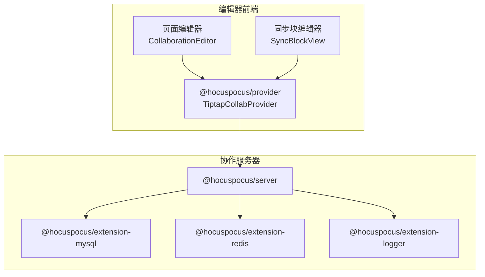
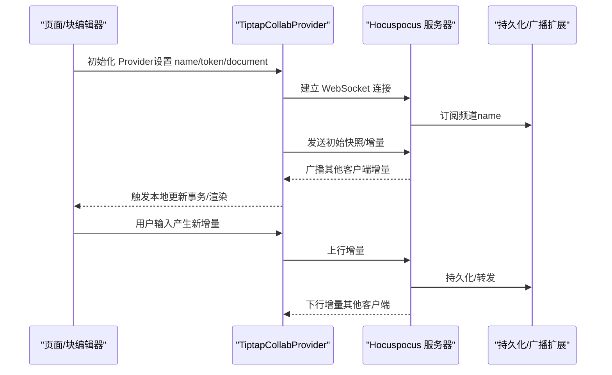
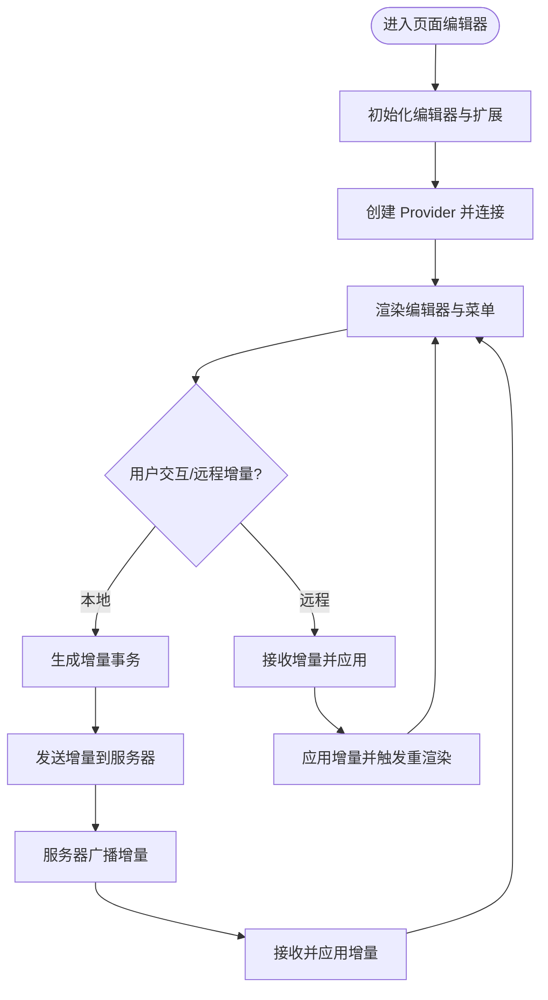
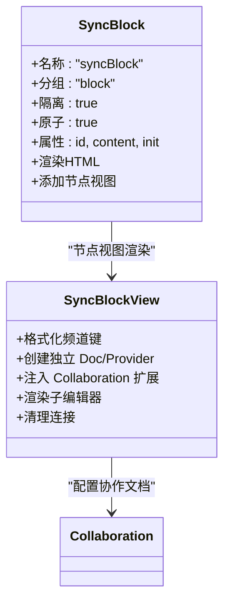
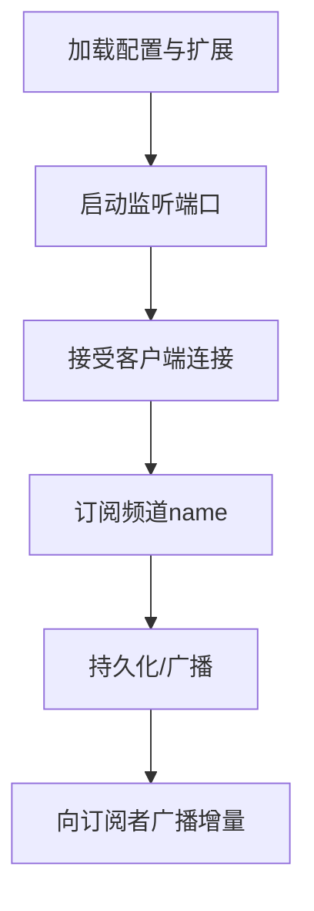
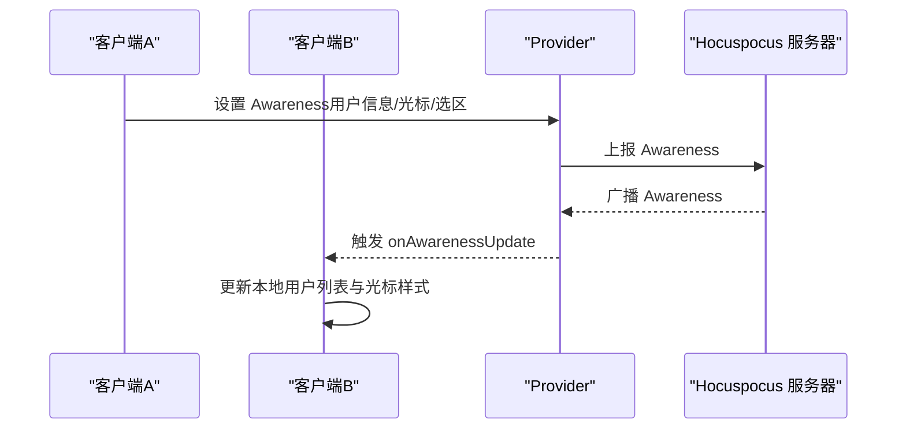
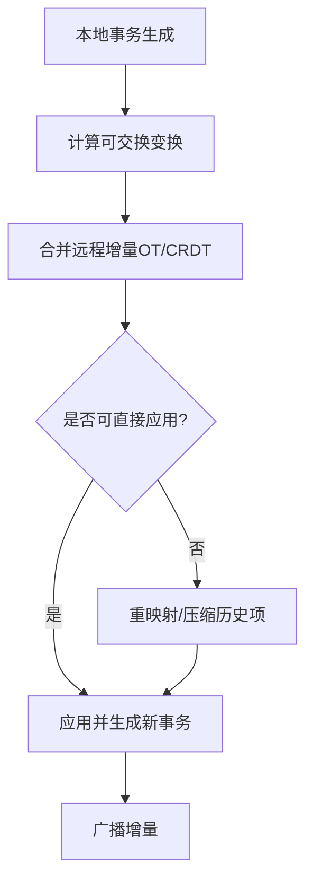
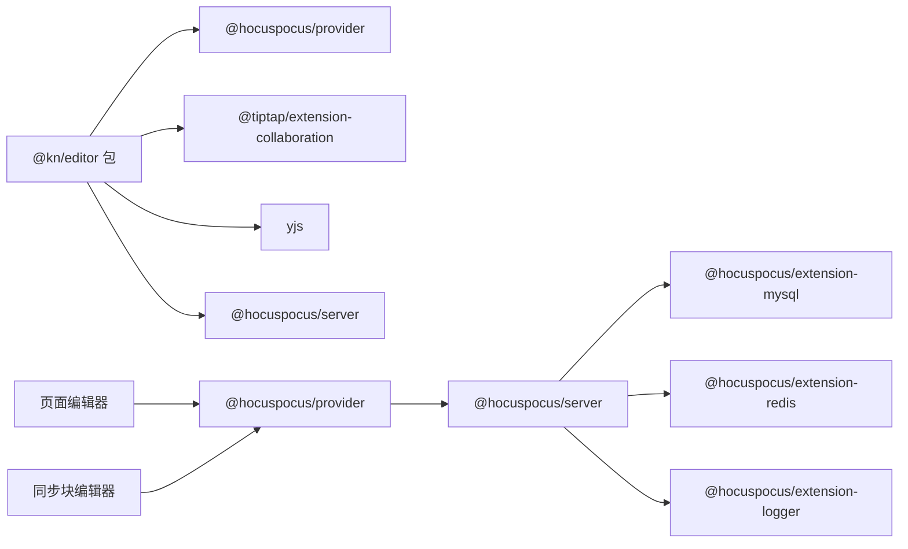

# 实时协作架构

<cite>
**本文引用的文件**
- [packages/editor/src/extensions/sync-block/SyncBlock.tsx](file://packages/editor/src/extensions/sync-block/SyncBlock.tsx)
- [packages/editor/src/extensions/sync-block/sync-block.ts](file://packages/editor/src/extensions/sync-block/sync-block.ts)
- [packages/editor/src/editor/collaboration.tsx](file://packages/editor/src/editor/collaboration.tsx)
- [packages/editor/src/editor/render.tsx](file://packages/editor/src/editor/render.tsx)
- [packages/editor/src/server/server.mjs](file://packages/editor/src/server/server.mjs)
- [packages/editor/package.json](file://packages/editor/package.json)
- [packages/plugin-main/src/pages/Journals/JournalEditor/index.tsx](file://packages/plugin-main/src/pages/Journals/JournalEditor/index.tsx)
- [packages/plugin-main/src/pages/PageRoom/index.tsx](file://packages/plugin-main/src/pages/PageRoom/index.tsx)
- [packages/editor/src/styles/editor.ts](file://packages/editor/src/styles/editor.ts)
- [packages/editor/src/extensions/undo-redo/history.ts](file://packages/editor/src/extensions/undo-redo/history.ts)
</cite>

## 目录
1. [引言](#引言)
2. [项目结构](#项目结构)
3. [核心组件](#核心组件)
4. [架构总览](#架构总览)
5. [详细组件分析](#详细组件分析)
6. [依赖关系分析](#依赖关系分析)
7. [性能考虑](#性能考虑)
8. [故障排除指南](#故障排除指南)
9. [结论](#结论)

## 引言
本文件面向知识库管理系统的实时协作架构，围绕 Yjs 协作引擎与 Hocuspocus 协作服务器的集成进行系统化说明。重点涵盖：
- CRDT 数据结构与冲突自由合并原理在编辑器中的应用
- Hocuspocus 协作服务器的连接与通信协议要点
- SyncBlock 同步块的设计理念与内容块级协作编辑实现
- 协作状态管理（用户光标、选区、在线用户）策略
- 冲突检测与自动解决算法（基于 Yjs 的 OT/CRDT）
- 性能优化策略（增量同步、内存管理、网络优化）
- 调试方法与常见问题排查

## 项目结构
协作能力由“编辑器前端 + 协作服务器”两部分组成：
- 编辑器前端：基于 Tiptap/Yjs，通过 @hocuspocus/provider 连接 Hocuspocus 服务器，支持页面级与块级协作
- 协作服务器：基于 @hocuspocus/server，使用扩展实现持久化与分布式广播（示例中采用 MySQL/Redis 扩展）

图表来源
- [packages/editor/src/editor/collaboration.tsx](file://packages/editor/src/editor/collaboration.tsx#L1-L142)
- [packages/editor/src/extensions/sync-block/SyncBlock.tsx](file://packages/editor/src/extensions/sync-block/SyncBlock.tsx#L1-L87)
- [packages/editor/src/server/server.mjs](file://packages/editor/src/server/server.mjs#L1-L26)
- [packages/editor/package.json](file://packages/editor/package.json#L1-L104)

章节来源
- [packages/editor/src/editor/collaboration.tsx](file://packages/editor/src/editor/collaboration.tsx#L1-L142)
- [packages/editor/src/extensions/sync-block/SyncBlock.tsx](file://packages/editor/src/extensions/sync-block/SyncBlock.tsx#L1-L87)
- [packages/editor/src/server/server.mjs](file://packages/editor/src/server/server.mjs#L1-L26)
- [packages/editor/package.json](file://packages/editor/package.json#L1-L104)

## 核心组件
- 页面级协作编辑器：负责整页内容的协作渲染与事件处理，承载菜单、目录等 UI，并通过 Provider 管理连接状态
- 同步块（SyncBlock）：以独立 Y.Doc 与 Provider 实现内容块级协作，隔离不同块的变更流
- Hocuspocus 协作服务器：统一接收来自各客户端的增量更新，经扩展持久化与广播给其他订阅者
- 用户光标与选区：通过 Awareness 机制共享用户状态（含光标位置、选区），样式由编辑器样式定义

章节来源
- [packages/editor/src/editor/collaboration.tsx](file://packages/editor/src/editor/collaboration.tsx#L1-L142)
- [packages/editor/src/extensions/sync-block/SyncBlock.tsx](file://packages/editor/src/extensions/sync-block/SyncBlock.tsx#L1-L87)
- [packages/editor/src/server/server.mjs](file://packages/editor/src/server/server.mjs#L1-L26)
- [packages/editor/src/styles/editor.ts](file://packages/editor/src/styles/editor.ts#L740-L802)

## 架构总览
下图展示从页面/块进入编辑器到 Hocuspocus 服务器的完整流程，包括连接建立、增量同步与广播。

图表来源
- [packages/plugin-main/src/pages/Journals/JournalEditor/index.tsx](file://packages/plugin-main/src/pages/Journals/JournalEditor/index.tsx#L1-L54)
- [packages/editor/src/extensions/sync-block/SyncBlock.tsx](file://packages/editor/src/extensions/sync-block/SyncBlock.tsx#L1-L87)
- [packages/editor/src/server/server.mjs](file://packages/editor/src/server/server.mjs#L1-L26)

## 详细组件分析

### 页面级协作编辑器（CollaborationEditor）
- 负责整页协作渲染，挂载菜单、目录等 UI 组件
- 通过 useEditor 创建编辑器实例，配置扩展与属性
- 通过 Provider 管理连接生命周期（连接、断开、销毁）
- 提供状态回调（onStatus）、Awareness 更新（onAwarenessUpdate）等钩子

图表来源
- [packages/editor/src/editor/collaboration.tsx](file://packages/editor/src/editor/collaboration.tsx#L1-L142)
- [packages/plugin-main/src/pages/Journals/JournalEditor/index.tsx](file://packages/plugin-main/src/pages/Journals/JournalEditor/index.tsx#L1-L54)

章节来源
- [packages/editor/src/editor/collaboration.tsx](file://packages/editor/src/editor/collaboration.tsx#L1-L142)
- [packages/plugin-main/src/pages/Journals/JournalEditor/index.tsx](file://packages/plugin-main/src/pages/Journals/JournalEditor/index.tsx#L1-L54)

### 同步块（SyncBlock）设计与实现
- SyncBlock 是一个原子化的块节点，用于承载独立的协作编辑上下文
- 每个块拥有独立的 Y.Doc 与 Provider，形成内容块级的协作域
- 通过 Collaboration.configure 将块的 Y.Doc 注入编辑器扩展，实现块内增量同步
- 块级 Provider 使用统一的 baseUrl 与按块命名的 name/token，确保频道隔离

图表来源
- [packages/editor/src/extensions/sync-block/sync-block.ts](file://packages/editor/src/extensions/sync-block/sync-block.ts#L1-L40)
- [packages/editor/src/extensions/sync-block/SyncBlock.tsx](file://packages/editor/src/extensions/sync-block/SyncBlock.tsx#L1-L87)

章节来源
- [packages/editor/src/extensions/sync-block/sync-block.ts](file://packages/editor/src/extensions/sync-block/sync-block.ts#L1-L40)
- [packages/editor/src/extensions/sync-block/SyncBlock.tsx](file://packages/editor/src/extensions/sync-block/SyncBlock.tsx#L1-L87)

### Hocuspocus 协作服务器
- 服务端通过 Server.configure 配置扩展，示例中包含数据库与缓存扩展，以及日志扩展
- 通过环境变量控制端口与后端存储参数
- 服务器启动后监听连接，依据频道（name）进行广播与持久化

图表来源
- [packages/editor/src/server/server.mjs](file://packages/editor/src/server/server.mjs#L1-L26)
- [packages/editor/package.json](file://packages/editor/package.json#L1-L104)

章节来源
- [packages/editor/src/server/server.mjs](file://packages/editor/src/server/server.mjs#L1-L26)
- [packages/editor/package.json](file://packages/editor/package.json#L1-L104)

### 协作状态管理（光标、选区、在线用户）
- 在线用户与用户状态（含光标、选区）通过 Awareness 机制共享
- 客户端在 Provider 中注册 onAwarenessUpdate 回调，解析 states 并维护本地用户列表
- 编辑器侧提供协作光标样式类名，用于渲染他人的光标与标签

图表来源
- [packages/plugin-main/src/pages/Journals/JournalEditor/index.tsx](file://packages/plugin-main/src/pages/Journals/JournalEditor/index.tsx#L1-L54)
- [packages/editor/src/styles/editor.ts](file://packages/editor/src/styles/editor.ts#L740-L802)

章节来源
- [packages/plugin-main/src/pages/Journals/JournalEditor/index.tsx](file://packages/plugin-main/src/pages/Journals/JournalEditor/index.tsx#L1-L54)
- [packages/editor/src/styles/editor.ts](file://packages/editor/src/styles/editor.ts#L740-L802)

### 冲突检测与自动解决（基于 Yjs 的 CRDT）
- Yjs 采用 CRDT（冲突无关复制数据类型），通过操作转换（OT）与因果关系保证最终一致性
- 当多个客户端并发修改同一文档时，Yjs 自动计算可交换的变换并合并，避免锁与回滚
- 历史记录模块在协作场景下对远程变更进行重映射与压缩，维持历史栈的正确性与性能

图表来源
- [packages/editor/src/extensions/undo-redo/history.ts](file://packages/editor/src/extensions/undo-redo/history.ts#L88-L204)

章节来源
- [packages/editor/src/extensions/undo-redo/history.ts](file://packages/editor/src/extensions/undo-redo/history.ts#L88-L204)

## 依赖关系分析
- 编辑器前端依赖 @hocuspocus/provider 与 @tiptap/extension-collaboration，结合 yjs 实现协作
- 服务器端依赖 @hocuspocus/server 与多种扩展（MySQL/Redis/Logger），实现持久化与分布式广播
- 页面与块编辑器均通过 Provider 进行连接管理，页面使用统一频道，块使用独立频道

图表来源
- [packages/editor/package.json](file://packages/editor/package.json#L1-L104)
- [packages/editor/src/server/server.mjs](file://packages/editor/src/server/server.mjs#L1-L26)

章节来源
- [packages/editor/package.json](file://packages/editor/package.json#L1-L104)
- [packages/editor/src/server/server.mjs](file://packages/editor/src/server/server.mjs#L1-L26)

## 性能考虑
- 增量同步
  - 仅传输增量事务，减少带宽占用；服务器按频道广播，避免全量同步
- 内存管理
  - 块级协作使用独立 Doc，降低单文档规模，便于 GC 与局部重渲染
  - Provider 生命周期内及时断开与销毁，防止内存泄漏
- 网络优化
  - 使用稳定的 WebSocket 连接与重连策略；在高并发场景建议启用 Redis 扩展提升广播效率
- 历史与重映射
  - 历史模块对远程变更进行重映射与压缩，避免历史栈膨胀导致性能下降

章节来源
- [packages/editor/src/extensions/sync-block/SyncBlock.tsx](file://packages/editor/src/extensions/sync-block/SyncBlock.tsx#L1-L87)
- [packages/editor/src/extensions/undo-redo/history.ts](file://packages/editor/src/extensions/undo-redo/history.ts#L88-L204)
- [packages/editor/src/server/server.mjs](file://packages/editor/src/server/server.mjs#L1-L26)

## 故障排除指南
- 连接失败
  - 检查服务器地址与端口配置，确认网络可达
  - 查看 Provider 的 onStatus 回调与日志扩展输出
- 同步异常
  - 确认频道（name/token）唯一且一致；块级频道应包含块标识
  - 检查 Provider 是否在组件卸载时正确断开与销毁
- 光标/选区不显示
  - 确认 Awareness 已正确上报与接收；检查样式类名是否生效
- 性能问题
  - 大文档或高并发场景建议拆分块级协作；启用 Redis 扩展优化广播
  - 关注历史栈长度与重映射开销，必要时调整深度或触发压缩

章节来源
- [packages/plugin-main/src/pages/Journals/JournalEditor/index.tsx](file://packages/plugin-main/src/pages/Journals/JournalEditor/index.tsx#L1-L54)
- [packages/editor/src/extensions/sync-block/SyncBlock.tsx](file://packages/editor/src/extensions/sync-block/SyncBlock.tsx#L1-L87)
- [packages/editor/src/styles/editor.ts](file://packages/editor/src/styles/editor.ts#L740-L802)
- [packages/editor/src/server/server.mjs](file://packages/editor/src/server/server.mjs#L1-L26)

## 结论
本系统以 Yjs 为核心，借助 Hocuspocus 提供的协作框架，实现了页面与内容块两级的实时协作编辑。通过频道隔离与增量同步，系统在保证一致性的同时具备良好的扩展性与性能表现。配合 Awareness 机制与样式体系，实现了用户光标与选区的可视化协作。未来可在历史深度控制、广播优化与持久化策略上进一步细化，以适配更大规模的协作场景。