# 实时协作架构

<cite>
**本文引用的文件**
- [packages/editor/src/extensions/sync-block/SyncBlock.tsx](file://packages/editor/src/extensions/sync-block/SyncBlock.tsx)
- [packages/editor/src/extensions/sync-block/sync-block.ts](file://packages/editor/src/extensions/sync-block/sync-block.ts)
- [packages/editor/src/editor/collaboration.tsx](file://packages/editor/src/editor/collaboration.tsx)
- [packages/editor/src/editor/render.tsx](file://packages/editor/src/editor/render.tsx)
- [packages/room-server/src/server.mjs](file://packages/room-server/src/server.mjs)
- [packages/room-server/src/plugin/mysql/MysqlPlugin.mjs](file://packages/room-server/src/plugin/mysql/MysqlPlugin.mjs)
- [packages/room-server/package.json](file://packages/room-server/package.json)
- [packages/room-server/Dockerfile](file://packages/room-server/Dockerfile)
- [packages/editor/package.json](file://packages/editor/package.json)
- [packages/plugin-main/src/pages/Journals/JournalEditor/index.tsx](file://packages/plugin-main/src/pages/Journals/JournalEditor/index.tsx)
- [packages/plugin-main/src/pages/PageRoom/index.tsx](file://packages/plugin-main/src/pages/PageRoom/index.tsx)
- [packages/editor/src/styles/editor.ts](file://packages/editor/src/styles/editor.ts)
- [packages/editor/src/styles/editor.css](file://packages/editor/src/styles/editor.css)
- [packages/editor/src/extensions/undo-redo/history.ts](file://packages/editor/src/extensions/undo-redo/history.ts)
- [packages/plugin-main/docs/COLLABORATION_API.md](file://packages/plugin-main/docs/COLLABORATION_API.md)
- [packages/plugin-main/src/pages/InviteCollaboration/index.tsx](file://packages/plugin-main/src/pages/InviteCollaboration/index.tsx)
- [packages/plugin-main/src/api/index.ts](file://packages/plugin-main/src/api/index.ts)
- [packages/plugin-main/src/event/index.ts](file://packages/plugin-main/src/event/index.ts)
- [packages/editor/src/extensions/collaboration-cursor/collaboration-cursor.ts](file://packages/editor/src/extensions/collaboration-cursor/collaboration-cursor.ts)
- [packages/editor/src/extensions/collaboration-cursor/index.ts](file://packages/editor/src/extensions/collaboration-cursor/index.ts)
- [packages/editor/src/hooks/use-collaboration.tsx](file://packages/editor/src/hooks/use-collaboration.tsx)
- [packages/editor/src/editor/ToC.tsx](file://packages/editor/src/editor/ToC.tsx)
- [packages/editor/src/extensions/page-content/PageContentView.tsx](file://packages/editor/src/extensions/page-content/PageContentView.tsx)
- [packages/editor/src/extensions/table-of-content/index.tsx](file://packages/editor/src/extensions/table-of-content/index.tsx)
- [packages/editor/src/extensions/table-of-content/table-of-content.ts](file://packages/editor/src/extensions/table-of-content/table-of-content.ts)
- [packages/ui/src/hooks/use-disclosure.ts](file://packages/ui/src/hooks/use-disclosure.ts)
</cite>

## 更新摘要
**所做更改**
- 新增节点选择协作功能的技术实现，支持块级节点选择可视化
- 完善Awareness状态管理机制，实现分离的协作状态字段
- 增强协作光标扩展，支持节点选择装饰和插件状态共享
- 新增节点选择CSS样式和装饰器实现
- 扩展协作Hook，提供插件协作状态管理能力
- **更新** 表格目录（ToC）默认隐藏变更：表格目录可见性从默认启用改为默认禁用，影响用户默认体验

## 目录
1. [引言](#引言)
2. [项目结构](#项目结构)
3. [核心组件](#核心组件)
4. [架构总览](#架构总览)
5. [详细组件分析](#详细组件分析)
6. [Y.js 协作协议与操作转换](#yjs-协作协议与操作转换)
7. [SyncBlock 同步块架构](#syncblock-同步块架构)
8. [Hocuspocus 房间服务器](#hocuspocus-房间服务器)
9. [协作状态管理](#协作状态管理)
10. [节点选择协作功能](#节点选择协作功能)
11. [表格目录（ToC）UX变更](#表格目录tocux变更)
12. [冲突检测与自动解决](#冲突检测与自动解决)
13. [协作邀请系统](#协作邀请系统)
14. [依赖关系分析](#依赖关系分析)
15. [性能考虑](#性能考虑)
16. [故障排除指南](#故障排除指南)
17. [结论](#结论)

## 引言
本文件面向知识库管理系统的实时协作架构，围绕新的 @kn/room-server 房间服务器包与 Hocuspocus 技术栈的完整实现进行系统化说明。重点涵盖：

- **新的房间服务器架构**：基于 @kn/room-server 包的标准化协作服务
- **Hocuspocus 技术栈**：完整的服务器配置、扩展与持久化机制
- **Yjs 协作协议与操作转换**：基于 CRDT 的冲突无关复制数据类型
- **SyncBlock 同步块**：内容块级协作编辑的架构设计与实现原理
- **协作状态管理**：用户光标、选区、在线用户的状态同步机制
- **节点选择协作功能**：新增的块级节点选择可视化和状态管理
- **Awareness 状态管理**：分离的协作状态字段和插件状态共享机制
- **表格目录（ToC）UX变更**：表格目录可见性从默认启用改为默认禁用的重要用户体验变更
- **冲突检测与自动解决**：基于 Yjs 的 OT/CRDT 算法实现
- **协作邀请系统**：完整的邀请流程、权限管理、消息中心集成与插件共享机制
- **容器化部署**：Docker 支持和生产环境部署策略
- **性能优化策略**：增量同步、内存管理、网络优化的实现方案
- **调试方法与故障排除**：协作功能的诊断与问题解决指南

## 项目结构
协作能力由"编辑器前端 + 房间服务器 + 邀请系统"三部分组成，形成完整的实时协作生态系统：

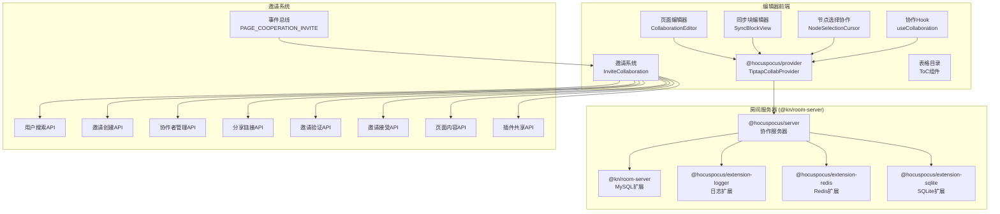
```mermaid
graph TB
subgraph "编辑器前端"
FE_Page["页面编辑器<br/>CollaborationEditor"]
FE_Block["同步块编辑器<br/>SyncBlockView"]
FE_Provider["@hocuspocus/provider<br/>TiptapCollabProvider"]
FE_Invite["邀请系统<br/>InviteCollaboration"]
FE_NodeSel["节点选择协作<br/>NodeSelectionCursor"]
FE_CollabHook["协作Hook<br/>useCollaboration"]
FE_ToC["表格目录<br/>ToC组件"]
end
subgraph "房间服务器 (@kn/room-server)"
HServer["@hocuspocus/server<br/>协作服务器"]
ExtMySQL["@kn/room-server<br/>MySQL扩展"]
ExtLogger["@hocuspocus/extension-logger<br/>日志扩展"]
ExtRedis["@hocuspocus/extension-redis<br/>Redis扩展"]
ExtSQLite["@hocuspocus/extension-sqlite<br/>SQLite扩展"]
end
subgraph "邀请系统"
API_Search["用户搜索API"]
API_Invite["邀请创建API"]
API_Collaborators["协作者管理API"]
API_Share["分享链接API"]
API_Validation["邀请验证API"]
API_Accept["邀请接受API"]
API_Page["页面内容API"]
API_Plugins["插件共享API"]
EventBus["事件总线<br/>PAGE_COOPERATION_INVITE"]
end
FE_Page --> FE_Provider
FE_Block --> FE_Provider
FE_NodeSel --> FE_Provider
FE_CollabHook --> FE_Provider
FE_Invite --> API_Search
FE_Invite --> API_Invite
FE_Invite --> API_Collaborators
FE_Invite --> API_Share
FE_Invite --> API_Validation
FE_Invite --> API_Accept
FE_Invite --> API_Page
FE_Invite --> API_Plugins
FE_Provider --> HServer
HServer --> ExtMySQL
HServer --> ExtRedis
HServer --> ExtSQLite
HServer --> ExtLogger
EventBus --> FE_Invite
```

**图表来源**
- [packages/editor/src/editor/collaboration.tsx](file://packages/editor/src/editor/collaboration.tsx#L1-L162)
- [packages/editor/src/extensions/sync-block/SyncBlock.tsx](file://packages/editor/src/extensions/sync-block/SyncBlock.tsx#L1-L87)
- [packages/editor/src/extensions/collaboration-cursor/collaboration-cursor.ts](file://packages/editor/src/extensions/collaboration-cursor/collaboration-cursor.ts#L1-L230)
- [packages/editor/src/hooks/use-collaboration.tsx](file://packages/editor/src/hooks/use-collaboration.tsx#L1-L574)
- [packages/room-server/src/server.mjs](file://packages/room-server/src/server.mjs#L1-L59)
- [packages/plugin-main/src/pages/InviteCollaboration/index.tsx](file://packages/plugin-main/src/pages/InviteCollaboration/index.tsx#L513-L546)
- [packages/plugin-main/src/api/index.ts](file://packages/plugin-main/src/api/index.ts#L150-L171)
- [packages/plugin-main/src/event/index.ts](file://packages/plugin-main/src/event/index.ts#L13-L15)

**章节来源**
- [packages/editor/src/editor/collaboration.tsx](file://packages/editor/src/editor/collaboration.tsx#L1-L162)
- [packages/editor/src/extensions/sync-block/SyncBlock.tsx](file://packages/editor/src/extensions/sync-block/SyncBlock.tsx#L1-L87)
- [packages/editor/src/extensions/collaboration-cursor/collaboration-cursor.ts](file://packages/editor/src/extensions/collaboration-cursor/collaboration-cursor.ts#L1-L230)
- [packages/editor/src/hooks/use-collaboration.tsx](file://packages/editor/src/hooks/use-collaboration.tsx#L1-L574)
- [packages/room-server/src/server.mjs](file://packages/room-server/src/server.mjs#L1-L59)
- [packages/plugin-main/src/pages/InviteCollaboration/index.tsx](file://packages/plugin-main/src/pages/InviteCollaboration/index.tsx#L513-L546)

## 核心组件

### 页面级协作编辑器
负责整页内容的协作渲染与事件处理，承载菜单、目录等 UI 组件，通过 Provider 管理连接状态和用户光标同步。

### 同步块（SyncBlock）
以独立 Y.Doc 与 Provider 实现内容块级协作，隔离不同块的变更流，支持原子化的块级编辑。

### 节点选择协作扩展
新增的协作扩展，专门处理节点选择的可视化和状态同步，支持块级节点选择的实时显示。

### 协作Hook系统
提供统一的协作状态管理，包括Awareness状态、用户信息、插件状态等的集中管理。

### 房间服务器 (@kn/room-server)
基于 Hocuspocus 的标准化协作服务器，提供统一的 WebSocket 服务和扩展机制，支持多种存储后端和部署方式。

### 协作邀请系统
完整的协作邀请流程，包括用户搜索、权限管理、分享链接、消息中心集成和插件共享等功能的 API 接口。

### 表格目录（ToC）组件
提供文档结构导航的表格目录功能，默认状态下处于隐藏状态，需要用户手动启用显示。

**章节来源**
- [packages/editor/src/editor/collaboration.tsx](file://packages/editor/src/editor/collaboration.tsx#L1-L162)
- [packages/editor/src/extensions/sync-block/SyncBlock.tsx](file://packages/editor/src/extensions/sync-block/SyncBlock.tsx#L1-L87)
- [packages/editor/src/extensions/collaboration-cursor/collaboration-cursor.ts](file://packages/editor/src/extensions/collaboration-cursor/collaboration-cursor.ts#L1-L230)
- [packages/editor/src/hooks/use-collaboration.tsx](file://packages/editor/src/hooks/use-collaboration.tsx#L1-L574)
- [packages/room-server/src/server.mjs](file://packages/room-server/src/server.mjs#L1-L59)
- [packages/plugin-main/docs/COLLABORATION_API.md](file://packages/plugin-main/docs/COLLABORATION_API.md#L1-L806)
- [packages/editor/src/editor/ToC.tsx](file://packages/editor/src/editor/ToC.tsx#L1-L180)

## 架构总览
下图展示从页面/块进入编辑器到房间服务器的完整协作流程，包括连接建立、增量同步、广播与状态管理：

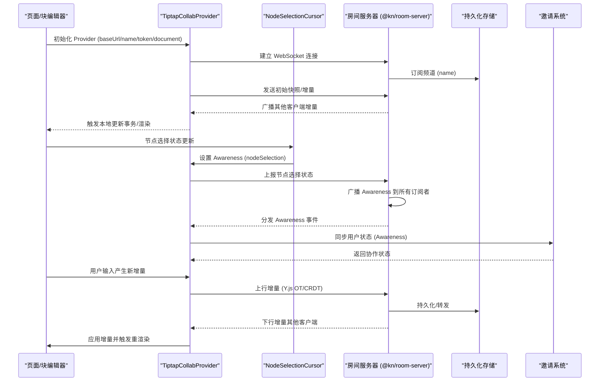
```mermaid
sequenceDiagram
participant UI as "页面/块编辑器"
participant Provider as "TiptapCollabProvider"
participant NodeSel as "NodeSelectionCursor"
participant RoomServer as "房间服务器 (@kn/room-server)"
participant Storage as "持久化存储"
participant Invite as "邀请系统"
UI->>Provider : 初始化 Provider (baseUrl/name/token/document)
Provider->>RoomServer : 建立 WebSocket 连接
RoomServer->>Storage : 订阅频道 (name)
Provider->>RoomServer : 发送初始快照/增量
RoomServer-->>Provider : 广播其他客户端增量
Provider-->>UI : 触发本地更新事务/渲染
UI->>NodeSel : 节点选择状态更新
NodeSel->>Provider : 设置 Awareness (nodeSelection)
Provider->>RoomServer : 上报节点选择状态
RoomServer->>RoomServer : 广播 Awareness 到所有订阅者
RoomServer-->>Provider : 分发 Awareness 事件
Provider->>Invite : 同步用户状态 (Awareness)
Invite-->>Provider : 返回协作状态
UI->>Provider : 用户输入产生新增量
Provider->>RoomServer : 上行增量 (Y.js OT/CRDT)
RoomServer->>Storage : 持久化/转发
RoomServer-->>Provider : 下行增量其他客户端
Provider->>UI : 应用增量并触发重渲染
```

**图表来源**
- [packages/plugin-main/src/pages/Journals/JournalEditor/index.tsx](file://packages/plugin-main/src/pages/Journals/JournalEditor/index.tsx#L20-L42)
- [packages/editor/src/extensions/sync-block/SyncBlock.tsx](file://packages/editor/src/extensions/sync-block/SyncBlock.tsx#L27-L43)
- [packages/editor/src/extensions/collaboration-cursor/collaboration-cursor.ts](file://packages/editor/src/extensions/collaboration-cursor/collaboration-cursor.ts#L172-L226)
- [packages/room-server/src/server.mjs](file://packages/room-server/src/server.mjs#L1-L59)

## 详细组件分析

### 页面级协作编辑器（CollaborationEditor）
负责整页协作渲染，通过 useEditor 创建编辑器实例，配置 Collaboration 和 CollaborationCursor 扩展，实现完整的协作功能。

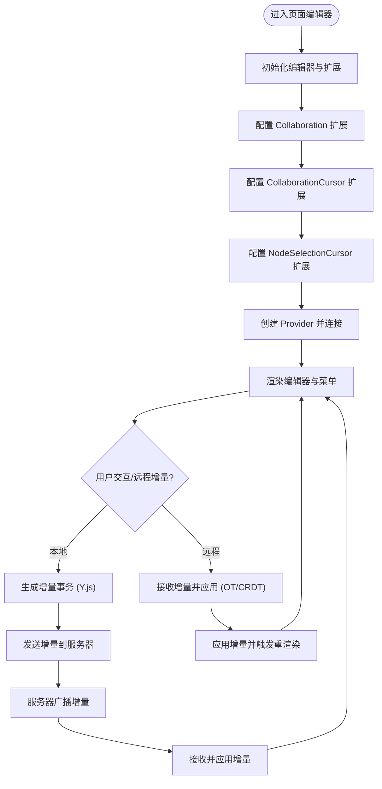
```mermaid
flowchart TD
Start(["进入页面编辑器"]) --> Init["初始化编辑器与扩展"]
Init --> Config["配置 Collaboration 扩展"]
Config --> Cursor["配置 CollaborationCursor 扩展"]
Cursor --> NodeSel["配置 NodeSelectionCursor 扩展"]
NodeSel --> Connect["创建 Provider 并连接"]
Connect --> Render["渲染编辑器与菜单"]
Render --> Events{"用户交互/远程增量?"}
Events --> |本地| LocalTx["生成增量事务 (Y.js)"]
Events --> |远程| RemoteTx["接收增量并应用 (OT/CRDT)"]
LocalTx --> Send["发送增量到服务器"]
RemoteTx --> Apply["应用增量并触发重渲染"]
Send --> Broadcast["服务器广播增量"]
Broadcast --> Receive["接收并应用增量"]
Receive --> Render
Apply --> Render
```

**图表来源**
- [packages/editor/src/editor/collaboration.tsx](file://packages/editor/src/editor/collaboration.tsx#L57-L82)
- [packages/plugin-main/src/pages/Journals/JournalEditor/index.tsx](file://packages/plugin-main/src/pages/Journals/JournalEditor/index.tsx#L20-L42)

**章节来源**
- [packages/editor/src/editor/collaboration.tsx](file://packages/editor/src/editor/collaboration.tsx#L1-L162)
- [packages/plugin-main/src/pages/Journals/JournalEditor/index.tsx](file://packages/plugin-main/src/pages/Journals/JournalEditor/index.tsx#L1-L54)

## Y.js 协作协议与操作转换

### CRDT 数据结构原理
Yjs 采用冲突无关复制数据类型（CRDT），通过以下机制实现无锁协作：

- **操作转换（Operational Transformation）**：将远程操作转换为本地可应用的形式
- **因果关系维护**：通过版本向量确保操作的因果顺序
- **可交换性保证**：并发操作可以安全地重新排序和组合

### Y.js 核心组件
- **Y.Doc**：文档容器，管理整个协作文档的状态
- **Y.Text/Y.Array/Y.Map**：不同类型的协作数据结构
- **Y.XmlFragment/Y.XmlElement**：用于 ProseMirror 集成的 XML 结构
- **Y.ShadowClock**：用于跟踪操作的时间戳和版本信息

### 操作转换流程
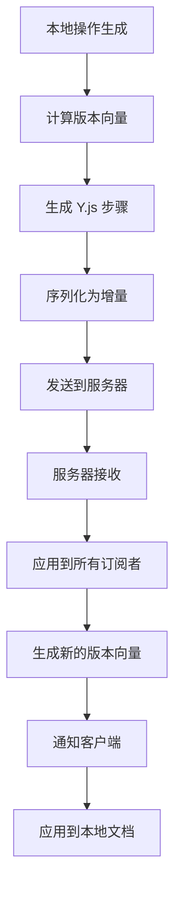
```mermaid
flowchart TD
A["本地操作生成"] --> B["计算版本向量"]
B --> C["生成 Y.js 步骤"]
C --> D["序列化为增量"]
D --> E["发送到服务器"]
E --> F["服务器接收"]
F --> G["应用到所有订阅者"]
G --> H["生成新的版本向量"]
H --> I["通知客户端"]
I --> J["应用到本地文档"]
```

**图表来源**
- [packages/editor/src/extensions/undo-redo/history.ts](file://packages/editor/src/extensions/undo-redo/history.ts#L88-L204)

**章节来源**
- [packages/editor/src/extensions/undo-redo/history.ts](file://packages/editor/src/extensions/undo-redo/history.ts#L88-L204)

## SyncBlock 同步块架构

### SyncBlock 设计理念
SyncBlock 是一个原子化的块节点，用于承载独立的协作编辑上下文：

- **独立文档域**：每个块拥有独立的 Y.Doc 与 Provider
- **频道隔离**：使用空间ID、页面ID、块ID组成的复合频道键
- **原子化操作**：块级的创建、编辑、删除都是原子操作
- **资源隔离**：避免大文档中的性能问题

### SyncBlock 实现原理
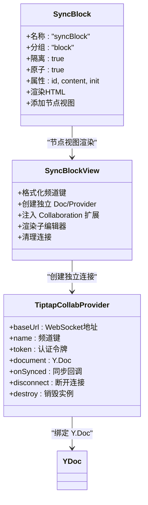
```mermaid
classDiagram
class SyncBlock {
+名称 : "syncBlock"
+分组 : "block"
+隔离 : true
+原子 : true
+属性 : id, content, init
+渲染HTML
+添加节点视图
}
class SyncBlockView {
+格式化频道键
+创建独立 Doc/Provider
+注入 Collaboration 扩展
+渲染子编辑器
+清理连接
}
class TiptapCollabProvider {
+baseUrl : WebSocket地址
+name : 频道键
+token : 认证令牌
+document : Y.Doc
+onSynced : 同步回调
+disconnect : 断开连接
+destroy : 销毁实例
}
SyncBlock --> SyncBlockView : "节点视图渲染"
SyncBlockView --> TiptapCollabProvider : "创建独立连接"
TiptapCollabProvider --> YDoc : "绑定 Y.Doc"
```

**图表来源**
- [packages/editor/src/extensions/sync-block/sync-block.ts](file://packages/editor/src/extensions/sync-block/sync-block.ts#L10-L40)
- [packages/editor/src/extensions/sync-block/SyncBlock.tsx](file://packages/editor/src/extensions/sync-block/SyncBlock.tsx#L15-L87)

### 频道键格式设计
SyncBlock 使用层次化的频道键格式：
```
"space:{spaceId}|page:{pageId}|block:{blockId}"
```

这种设计确保：
- **全局唯一性**：每个块都有唯一的频道标识
- **层次化组织**：支持按空间、页面、块的层级查询
- **广播隔离**：不同块的增量不会相互影响

**章节来源**
- [packages/editor/src/extensions/sync-block/sync-block.ts](file://packages/editor/src/extensions/sync-block/sync-block.ts#L1-L40)
- [packages/editor/src/extensions/sync-block/SyncBlock.tsx](file://packages/editor/src/extensions/sync-block/SyncBlock.tsx#L23-L25)

## Hocuspocus 房间服务器

### 服务器架构与配置
新的 @kn/room-server 包提供了标准化的 Hocuspocus 协作服务器实现：

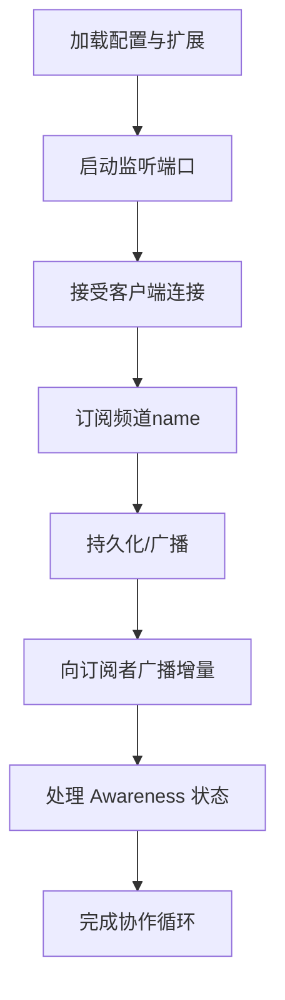
```mermaid
flowchart TD
Config["加载配置与扩展"] --> Listen["启动监听端口"]
Listen --> Accept["接受客户端连接"]
Accept --> Subscribe["订阅频道name"]
Subscribe --> Persist["持久化/广播"]
Persist --> Broadcast["向订阅者广播增量"]
Broadcast --> Handle["处理 Awareness 状态"]
Handle --> Complete["完成协作循环"]
```

**图表来源**
- [packages/room-server/src/server.mjs](file://packages/room-server/src/server.mjs#L30-L55)

### 支持的存储扩展
- **MySQL 扩展**：企业级关系型数据库存储，通过自定义 Mysql 插件实现
- **Redis 扩展**：高性能缓存和发布订阅
- **SQLite 扩展**：轻量级嵌入式数据库
- **Logger 扩展**：详细的日志记录和监控

### MySQL 数据库扩展实现
自定义的 Mysql 插件提供了完整的数据库集成：

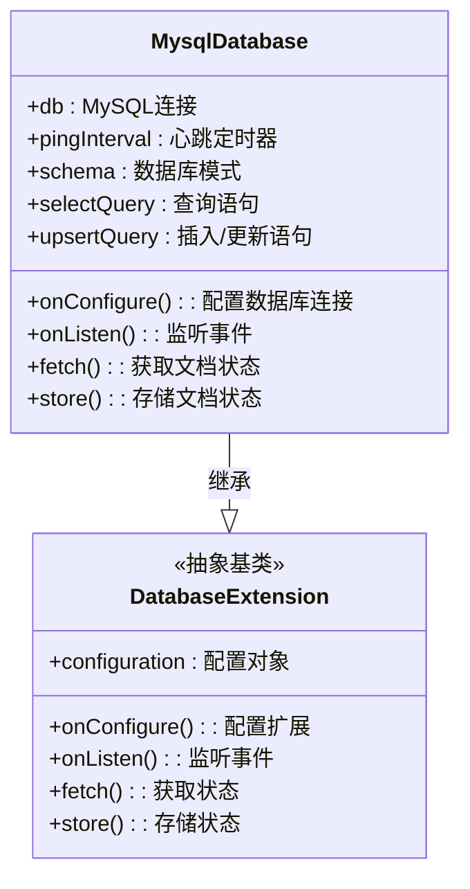
```mermaid
classDiagram
class MysqlDatabase {
+db : MySQL连接
+pingInterval : 心跳定时器
+schema : 数据库模式
+selectQuery : 查询语句
+upsertQuery : 插入/更新语句
+onConfigure() : 配置数据库连接
+onListen() : 监听事件
+fetch() : 获取文档状态
+store() : 存储文档状态
}
class DatabaseExtension {
<<抽象基类>>
+configuration : 配置对象
+onConfigure() : 配置扩展
+onListen() : 监听事件
+fetch() : 获取状态
+store() : 存储状态
}
MysqlDatabase --|> DatabaseExtension : 继承
```

**图表来源**
- [packages/room-server/src/plugin/mysql/MysqlPlugin.mjs](file://packages/room-server/src/plugin/mysql/MysqlPlugin.mjs#L21-L124)

### 服务器启动流程
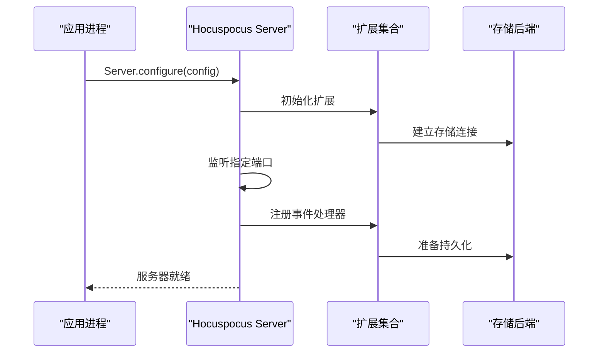
```mermaid
sequenceDiagram
participant App as "应用进程"
participant Server as "Hocuspocus Server"
participant Ext as "扩展集合"
participant DB as "存储后端"
App->>Server : Server.configure(config)
Server->>Ext : 初始化扩展
Ext->>DB : 建立存储连接
Server->>Server : 监听指定端口
Server->>Ext : 注册事件处理器
Ext->>DB : 准备持久化
Server-->>App : 服务器就绪
```

**图表来源**
- [packages/room-server/src/server.mjs](file://packages/room-server/src/server.mjs#L54-L55)

### Docker 容器化部署
房间服务器支持完整的 Docker 容器化部署：

- **基础镜像**：Node.js 22 Alpine Linux
- **端口暴露**：默认 1234 端口
- **环境变量**：PORT、NODE_ENV、SSL_ENABLED、SSL_KEY_PATH、SSL_CERT_PATH
- **构建脚本**：支持 docker:build 和 docker:run 命令

**章节来源**
- [packages/room-server/src/server.mjs](file://packages/room-server/src/server.mjs#L1-L59)
- [packages/room-server/src/plugin/mysql/MysqlPlugin.mjs](file://packages/room-server/src/plugin/mysql/MysqlPlugin.mjs#L1-L124)
- [packages/room-server/package.json](file://packages/room-server/package.json#L1-L32)
- [packages/room-server/Dockerfile](file://packages/room-server/Dockerfile#L1-L29)

## 协作状态管理

### 用户光标与选区同步
协作光标管理通过 Awareness 机制实现：

- **光标位置**：精确的文本位置坐标
- **选区范围**：用户当前选择的文本范围
- **用户信息**：姓名、颜色、头像等标识信息
- **活动状态**：在线、离线、活跃度等状态

### Awareness 状态同步流程
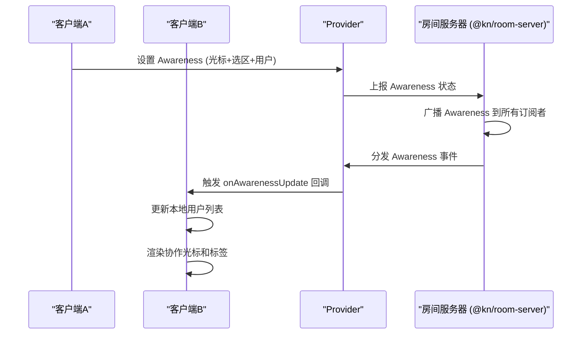
```mermaid
sequenceDiagram
participant ClientA as "客户端A"
participant ClientB as "客户端B"
participant Provider as "Provider"
participant Server as "房间服务器 (@kn/room-server)"
ClientA->>Provider : 设置 Awareness (光标+选区+用户)
Provider->>Server : 上报 Awareness 状态
Server->>Server : 广播 Awareness 到所有订阅者
Server->>Provider : 分发 Awareness 事件
Provider->>ClientB : 触发 onAwarenessUpdate 回调
ClientB->>ClientB : 更新本地用户列表
ClientB->>ClientB : 渲染协作光标和标签
```

**图表来源**
- [packages/plugin-main/src/pages/Journals/JournalEditor/index.tsx](file://packages/plugin-main/src/pages/Journals/JournalEditor/index.tsx#L27-L34)

### 样式系统支持
协作光标和标签通过 CSS 类名实现：
- `.collaboration-cursor__caret`：光标样式
- `.collaboration-cursor__label`：用户标签样式
- 动画效果：光标闪烁动画
- 主题适配：支持明暗主题切换

**章节来源**
- [packages/plugin-main/src/pages/Journals/JournalEditor/index.tsx](file://packages/plugin-main/src/pages/Journals/JournalEditor/index.tsx#L1-L54)
- [packages/editor/src/styles/editor.ts](file://packages/editor/src/styles/editor.ts#L793-L845)

## 节点选择协作功能

### 节点选择协作设计理念
新增的节点选择协作功能允许用户协作编辑块级节点的选择状态，提供更丰富的协作体验：

- **节点选择检测**：识别 NodeSelection 类型的选择状态
- **分离状态管理**：使用独立的 'nodeSelection' 字段避免与光标状态冲突
- **实时可视化**：通过装饰器实时显示远程用户的节点选择
- **兼容性设计**：与现有的光标协作功能完全兼容

### 节点选择协作实现原理
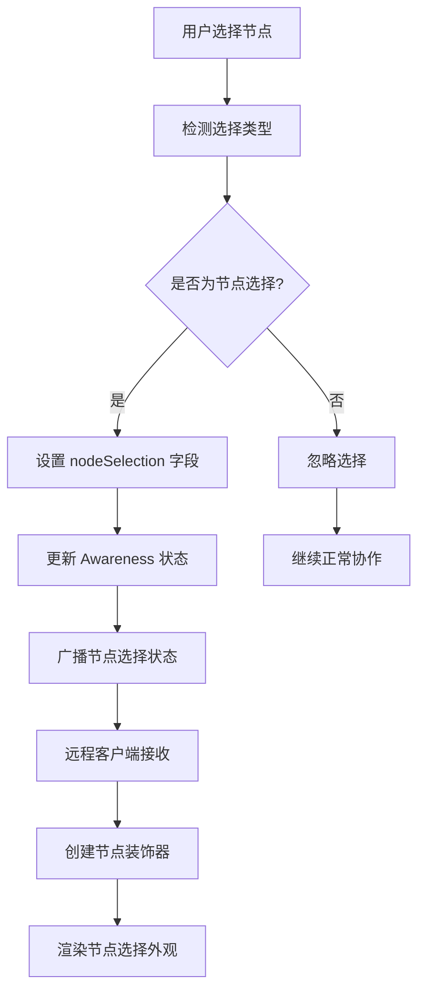
```mermaid
flowchart TD
A["用户选择节点"] --> B["检测选择类型"]
B --> C{"是否为节点选择?"}
C --> |是| D["设置 nodeSelection 字段"]
C --> |否| E["忽略选择"]
D --> F["更新 Awareness 状态"]
F --> G["广播节点选择状态"]
G --> H["远程客户端接收"]
H --> I["创建节点装饰器"]
I --> J["渲染节点选择外观"]
E --> K["继续正常协作"]
```

**图表来源**
- [packages/editor/src/extensions/collaboration-cursor/collaboration-cursor.ts](file://packages/editor/src/extensions/collaboration-cursor/collaboration-cursor.ts#L182-L202)

### 节点选择状态管理
节点选择状态通过 Awareness 的分离字段实现：

- **状态结构**：包含 isNodeSelection、from、to 三个关键字段
- **字段隔离**：使用 'nodeSelection' 字段避免与 'cursor' 字段冲突
- **实时同步**：通过 Awareness 事件实时同步节点选择状态
- **状态验证**：确保选择位置的有效性和完整性

### 节点选择装饰器实现
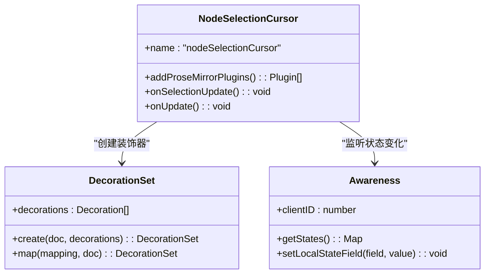
```mermaid
classDiagram
class NodeSelectionCursor {
+name : "nodeSelectionCursor"
+addProseMirrorPlugins() : Plugin[]
+onSelectionUpdate() : void
+onUpdate() : void
}
class DecorationSet {
+decorations : Decoration[]
+create(doc, decorations) : DecorationSet
+map(mapping, doc) : DecorationSet
}
class Awareness {
+clientID : number
+getStates() : Map
+setLocalStateField(field, value) : void
}
NodeSelectionCursor --> DecorationSet : "创建装饰器"
NodeSelectionCursor --> Awareness : "监听状态变化"
```

**图表来源**
- [packages/editor/src/extensions/collaboration-cursor/collaboration-cursor.ts](file://packages/editor/src/extensions/collaboration-cursor/collaboration-cursor.ts#L103-L170)

### 节点选择CSS样式设计
节点选择协作通过专门的CSS类实现视觉效果：

- **主样式类**：`.collaboration-cursor__node-selection`
- **伪元素样式**：`.collaboration-cursor__node-selection::before`
- **回退样式**：`.collaboration-cursor__node-selection-fallback`
- **颜色变量**：使用 `--collaboration-cursor-color` CSS变量
- **过渡动画**：0.15秒的颜色过渡效果

**章节来源**
- [packages/editor/src/extensions/collaboration-cursor/collaboration-cursor.ts](file://packages/editor/src/extensions/collaboration-cursor/collaboration-cursor.ts#L1-L230)
- [packages/editor/src/styles/editor.css](file://packages/editor/src/styles/editor.css#L142-L166)

## 表格目录（ToC）UX变更

### ToC 默认隐藏变更概述
**重要 UX 变更**：表格目录（Table of Contents, ToC）的默认可见性已从"启用"改为"禁用"，这一变更显著影响了用户的默认编辑体验。

### 变更前后的对比
- **变更前**：表格目录默认显示，用户无需额外操作即可看到文档结构导航
- **变更后**：表格目录默认隐藏，用户需要主动启用才能看到目录

### ToC 组件架构
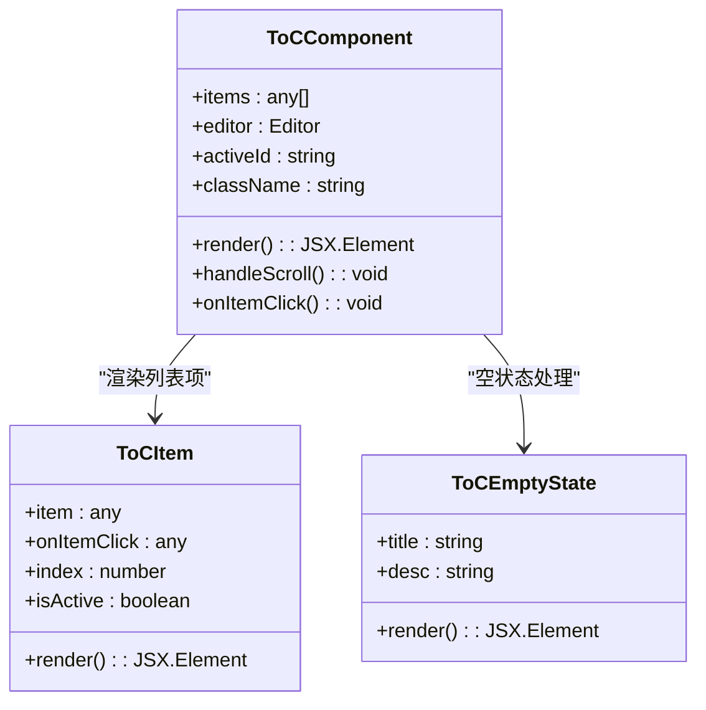
```mermaid
classDiagram
class ToCComponent {
+items : any[]
+editor : Editor
+activeId : string
+className : string
+render() : JSX.Element
+handleScroll() : void
+onItemClick() : void
}
class ToCItem {
+item : any
+onItemClick : any
+index : number
+isActive : boolean
+render() : JSX.Element
}
class ToCEmptyState {
+title : string
+desc : string
+render() : JSX.Element
}
ToCComponent --> ToCItem : "渲染列表项"
ToCComponent --> ToCEmptyState : "空状态处理"
```

**图表来源**
- [packages/editor/src/editor/ToC.tsx](file://packages/editor/src/editor/ToC.tsx#L10-L180)

### ToC 显示状态管理
ToC 组件采用状态管理模式来控制显示/隐藏：

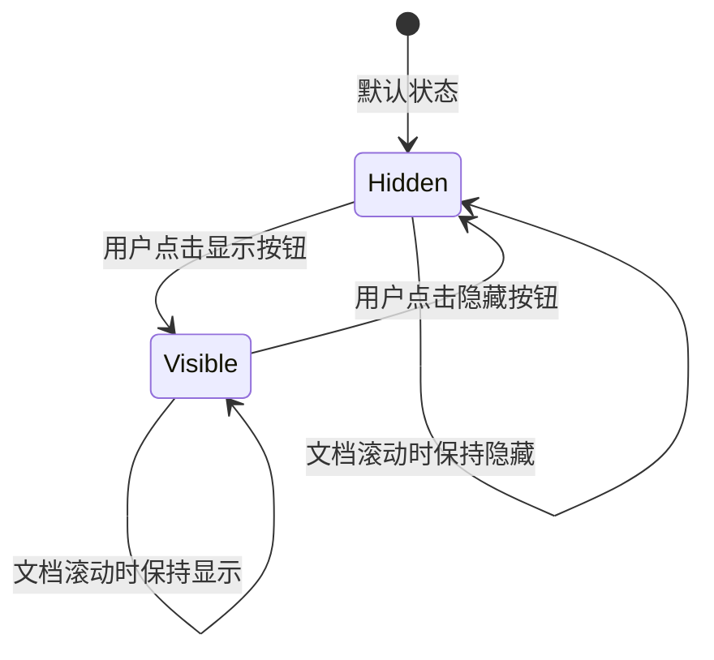
```mermaid
stateDiagram-v2
[*] --> Hidden : 默认状态
Hidden --> Visible : 用户点击显示按钮
Visible --> Hidden : 用户点击隐藏按钮
Visible --> Visible : 文档滚动时保持显示
Hidden --> Hidden : 文档滚动时保持隐藏
```

**图表来源**
- [packages/editor/src/editor/ToC.tsx](file://packages/editor/src/editor/ToC.tsx#L73-L107)

### ToC 空状态处理
当文档没有标题内容时，ToC 组件提供友好的空状态提示：

- **空状态组件**：`ToCEmptyState` 提供"无内容"的提示信息
- **国际化支持**：使用 `useTranslation` hook 支持多语言
- **视觉设计**：采用 `Empty` 组件提供一致的视觉反馈

### ToC 交互行为
- **滚动同步**：根据编辑器滚动位置高亮显示当前标题
- **平滑滚动**：点击目录项时进行平滑滚动定位
- **选区同步**：点击后自动设置编辑器选区到对应位置
- **视觉反馈**：提供高亮闪烁效果增强用户体验

### 对用户体验的影响
**积极影响**：
- **界面简洁**：减少默认界面复杂度，让编辑区域更加清爽
- **专注编辑**：避免目录遮挡，提升主要编辑任务的专注度
- **个性化定制**：用户可以根据个人偏好选择显示/隐藏

**潜在挑战**：
- **学习成本**：新用户可能不熟悉需要手动启用目录的功能
- **发现性问题**：用户可能不知道目录功能的存在
- **工作流程调整**：需要适应新的操作习惯

### 解决方案与建议
- **引导机制**：在首次编辑时提供 ToC 启用的引导提示
- **快捷键支持**：考虑添加快捷键快速切换 ToC 显示状态
- **记忆功能**：记住用户的 ToC 显示偏好设置
- **上下文提示**：在编辑器中提供 ToC 功能的上下文帮助

**章节来源**
- [packages/editor/src/editor/ToC.tsx](file://packages/editor/src/editor/ToC.tsx#L1-L180)
- [packages/editor/src/extensions/page-content/PageContentView.tsx](file://packages/editor/src/extensions/page-content/PageContentView.tsx#L1-L14)
- [packages/editor/src/extensions/table-of-content/index.tsx](file://packages/editor/src/extensions/table-of-content/index.tsx#L1-L12)
- [packages/editor/src/extensions/table-of-content/table-of-content.ts](file://packages/editor/src/extensions/table-of-content/table-of-content.ts#L1-L1)
- [packages/ui/src/hooks/use-disclosure.ts](file://packages/ui/src/hooks/use-disclosure.ts#L1-L12)

## 冲突检测与自动解决

### Yjs 的 CRDT 算法
Yjs 实现了高级别的冲突自由合并：

- **可交换性**：并发操作可以安全地重新排序
- **幂等性**：重复应用相同操作不会改变结果
- **一致性**：所有客户端最终达到一致状态
- **无锁设计**：不需要分布式锁机制

### 历史记录与重映射
协作场景下的历史管理：

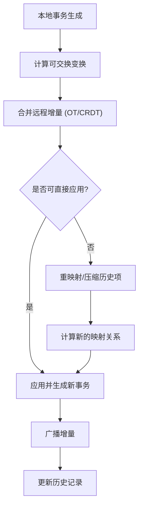
```mermaid
flowchart TD
A["本地事务生成"] --> B["计算可交换变换"]
B --> C["合并远程增量 (OT/CRDT)"]
C --> D{"是否可直接应用?"}
D --> |是| E["应用并生成新事务"]
D --> |否| F["重映射/压缩历史项"]
F --> G["计算新的映射关系"]
G --> E
E --> H["广播增量"]
H --> I["更新历史记录"]
```

**图表来源**
- [packages/editor/src/extensions/undo-redo/history.ts](file://packages/editor/src/extensions/undo-redo/history.ts#L126-L204)

### 冲突解决策略
- **时间戳优先**：基于操作的时间戳确定执行顺序
- **因果关系**：确保操作的前置条件得到满足
- **版本向量**：维护复杂的并发关系
- **自动重映射**：透明地处理位置变化

**章节来源**
- [packages/editor/src/extensions/undo-redo/history.ts](file://packages/editor/src/extensions/undo-redo/history.ts#L88-L204)

## 协作邀请系统

### 邀请系统架构设计
协作邀请系统提供了完整的权限管理和用户协作流程，支持多种邀请方式和权限管理：

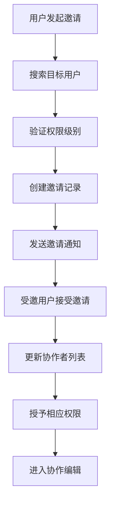
```mermaid
flowchart TD
A["用户发起邀请"] --> B["搜索目标用户"]
B --> C["验证权限级别"]
C --> D["创建邀请记录"]
D --> E["发送邀请通知"]
E --> F["受邀用户接受邀请"]
F --> G["更新协作者列表"]
G --> H["授予相应权限"]
H --> I["进入协作编辑"]
```

**图表来源**
- [packages/plugin-main/docs/COLLABORATION_API.md](file://packages/plugin-main/docs/COLLABORATION_API.md#L18-L61)

### 核心 API 功能
- **用户搜索**：支持按姓名或邮箱搜索用户
- **权限管理**：READ、WRITE、ADMIN 三种权限级别
- **邀请管理**：创建、接受、撤销邀请流程
- **分享链接**：生成可访问的分享链接
- **消息中心集成**：实时 WebSocket 通知
- **插件共享**：确保邀请者和被邀请者使用相同的编辑器扩展

### 权限模型设计
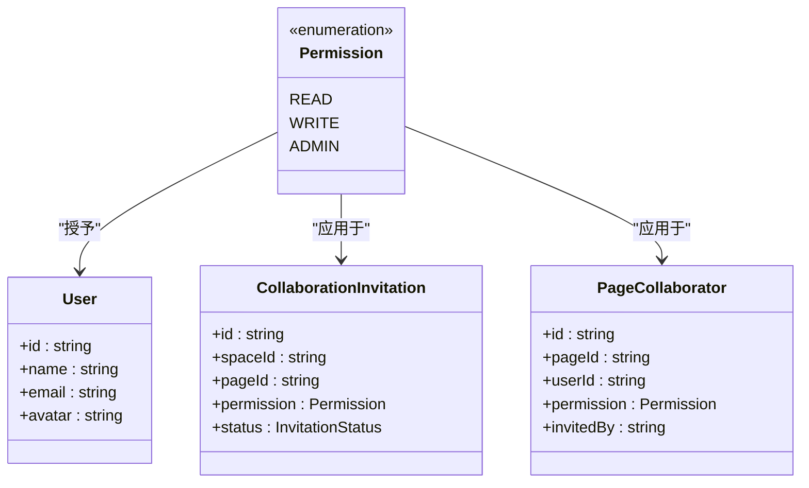
```mermaid
classDiagram
class Permission {
<<enumeration>>
READ
WRITE
ADMIN
}
class User {
+id : string
+name : string
+email : string
+avatar : string
}
class CollaborationInvitation {
+id : string
+spaceId : string
+pageId : string
+permission : Permission
+status : InvitationStatus
}
class PageCollaborator {
+id : string
+pageId : string
+userId : string
+permission : Permission
+invitedBy : string
}
Permission --> User : "授予"
Permission --> CollaborationInvitation : "应用于"
Permission --> PageCollaborator : "应用于"
```

**图表来源**
- [packages/plugin-main/docs/COLLABORATION_API.md](file://packages/plugin-main/docs/COLLABORATION_API.md#L125-L231)

### 邀请前端页面实现
InviteCollaboration 组件实现了完整的邀请处理流程：

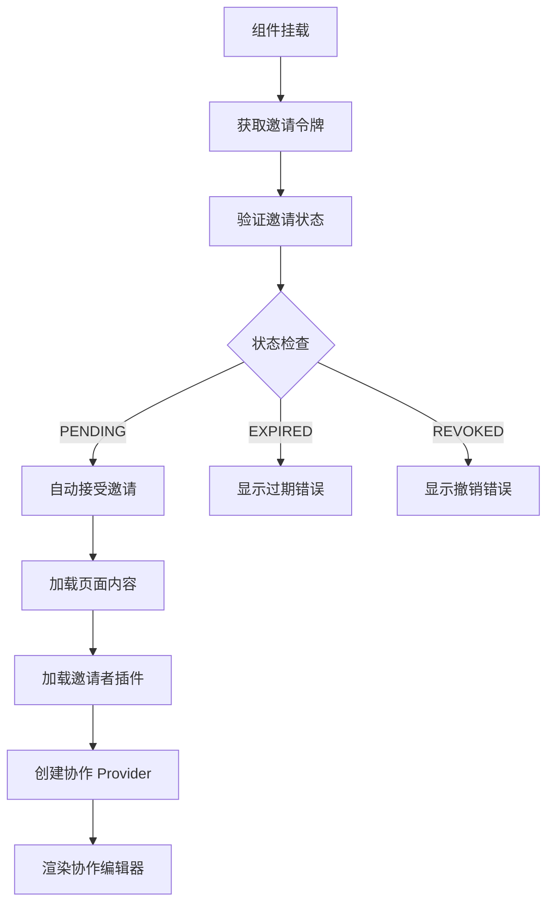
```mermaid
flowchart TD
A["组件挂载"] --> B["获取邀请令牌"]
B --> C["验证邀请状态"]
C --> D{"状态检查"}
D --> |PENDING| E["自动接受邀请"]
D --> |EXPIRED| F["显示过期错误"]
D --> |REVOKED| G["显示撤销错误"]
E --> H["加载页面内容"]
H --> I["加载邀请者插件"]
I --> J["创建协作 Provider"]
J --> K["渲染协作编辑器"]
```

**图表来源**
- [packages/plugin-main/src/pages/InviteCollaboration/index.tsx](file://packages/plugin-main/src/pages/InviteCollaboration/index.tsx#L171-L240)

### 事件系统集成
协作邀请系统通过事件总线实现松耦合的消息传递：

- **PAGE_COOPERATION_INVITE**：页面协作邀请事件主题
- **实时通知**：通过 WebSocket 实时推送邀请状态
- **状态同步**：确保所有相关组件保持状态一致

**章节来源**
- [packages/plugin-main/docs/COLLABORATION_API.md](file://packages/plugin-main/docs/COLLABORATION_API.md#L1-L806)
- [packages/plugin-main/src/pages/InviteCollaboration/index.tsx](file://packages/plugin-main/src/pages/InviteCollaboration/index.tsx#L1-L495)
- [packages/plugin-main/src/api/index.ts](file://packages/plugin-main/src/api/index.ts#L150-L171)
- [packages/plugin-main/src/event/index.ts](file://packages/plugin-main/src/event/index.ts#L13-L15)

## 依赖关系分析

### 核心依赖关系
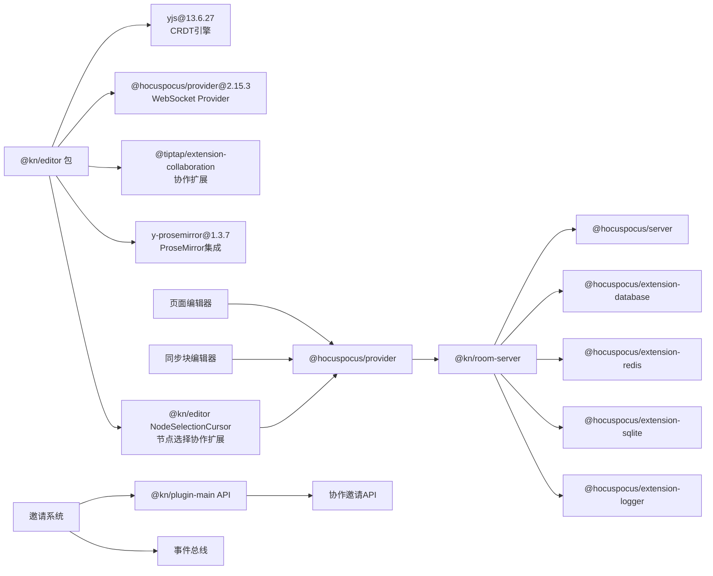
```mermaid
graph LR
Pkg["@kn/editor 包"] --> Yjs["yjs@13.6.27<br/>CRDT引擎"]
Pkg --> Hocuspocus["@hocuspocus/provider@2.15.3<br/>WebSocket Provider"]
Pkg --> Tiptap["@tiptap/extension-collaboration<br/>协作扩展"]
Pkg --> YProseMirror["y-prosemirror@1.3.7<br/>ProseMirror集成"]
Pkg --> NodeSel["@kn/editor NodeSelectionCursor<br/>节点选择协作扩展"]
Page["页面编辑器"] --> Provider["@hocuspocus/provider"]
Block["同步块编辑器"] --> Provider
NodeSel --> Provider
Provider --> RoomServer["@kn/room-server"]
RoomServer --> HocuspocusServer["@hocuspocus/server"]
RoomServer --> MySQL["@hocuspocus/extension-database"]
RoomServer --> Redis["@hocuspocus/extension-redis"]
RoomServer --> SQLite["@hocuspocus/extension-sqlite"]
RoomServer --> Logger["@hocuspocus/extension-logger"]
Invite["邀请系统"] --> API["@kn/plugin-main API"]
Invite --> EventBus["事件总线"]
API --> CollaborationAPI["协作邀请API"]
```

**图表来源**
- [packages/editor/package.json](file://packages/editor/package.json#L17-L106)
- [pnpm-lock.yaml](file://pnpm-lock.yaml#L1299-L1320)

### 版本兼容性
- **Yjs 13.6.27**：最新的 CRDT 引擎版本
- **@hocuspocus/provider 2.15.3**：稳定的企业级协作库
- **@hocuspocus/server 2.15.3**：标准化的服务器实现
- **@kn/room-server 0.0.16**：新的房间服务器包
- **NodeSelectionCursor 0.0.1**：新增的节点选择协作扩展

### 新增依赖
- **@kn/room-server**：标准化的协作服务器包
- **@hocuspocus/extension-database**：数据库扩展
- **@hocuspocus/extension-redis**：Redis 扩展
- **@hocuspocus/extension-sqlite**：SQLite 扩展
- **mysql**：MySQL 数据库驱动
- **NodeSelectionCursor**：节点选择协作扩展

**章节来源**
- [packages/editor/package.json](file://packages/editor/package.json#L17-L106)
- [packages/room-server/package.json](file://packages/room-server/package.json#L1-L32)
- [pnpm-lock.yaml](file://pnpm-lock.yaml#L1299-L1320)

## 性能考虑

### 增量同步优化
- **最小化传输**：只传输增量事务，而非完整文档
- **压缩算法**：使用 lib0 库进行高效的二进制编码
- **批量处理**：合并多个小操作为批量事务
- **背压控制**：防止服务器过载的流量控制机制

### 内存管理策略
- **块级隔离**：SyncBlock 的独立文档避免内存膨胀
- **垃圾回收**：及时断开和销毁不再使用的 Provider
- **文档大小限制**：监控和限制单个文档的大小
- **内存池管理**：复用临时对象减少 GC 压力

### 网络优化技术
- **WebSocket 连接池**：复用连接减少握手开销
- **心跳机制**：保持连接活跃状态
- **自动重连**：网络中断后的智能重连策略
- **TLS 加密**：生产环境的安全传输层

### 节点选择协作性能优化
- **装饰器缓存**：缓存节点选择装饰器避免重复创建
- **状态过滤**：仅处理有效的节点选择状态
- **位置验证**：提前验证选择位置的有效性
- **异常处理**：优雅处理装饰器创建失败的情况

### 历史与重映射优化
- **历史深度控制**：限制历史记录的数量
- **压缩算法**：定期压缩历史记录减少存储
- **增量重映射**：只重映射受影响的历史项
- **异步处理**：后台处理重映射避免阻塞主线程

### 邀请系统性能优化
- **插件预加载**：邀请者插件的异步加载机制
- **缓存策略**：邀请状态和页面内容的缓存
- **连接复用**：协作编辑器的 Provider 复用
- **资源优化**：头像和用户信息的懒加载

### 房间服务器性能优化
- **扩展配置**：根据需求启用必要的扩展
- **连接池管理**：合理配置数据库连接池
- **Redis 缓存**：使用 Redis 进行会话和状态缓存
- **日志优化**：控制日志级别避免性能影响

### ToC 组件性能优化
- **懒加载机制**：ToC 组件默认隐藏，减少初始渲染负担
- **条件渲染**：只有在需要时才渲染目录组件
- **滚动优化**：使用防抖机制优化滚动事件处理
- **虚拟滚动**：对于长文档可考虑虚拟滚动优化

**章节来源**
- [packages/editor/src/extensions/sync-block/SyncBlock.tsx](file://packages/editor/src/extensions/sync-block/SyncBlock.tsx#L67-L75)
- [packages/editor/src/extensions/collaboration-cursor/collaboration-cursor.ts](file://packages/editor/src/extensions/collaboration-cursor/collaboration-cursor.ts#L30-L94)
- [packages/editor/src/extensions/undo-redo/history.ts](file://packages/editor/src/extensions/undo-redo/history.ts#L173-L204)
- [packages/room-server/src/server.mjs](file://packages/room-server/src/server.mjs#L1-L59)
- [packages/plugin-main/src/pages/InviteCollaboration/index.tsx](file://packages/plugin-main/src/pages/InviteCollaboration/index.tsx#L216-L232)
- [packages/editor/src/editor/ToC.tsx](file://packages/editor/src/editor/ToC.tsx#L76-L107)

## 故障排除指南

### 连接问题诊断
- **网络连接失败**
  - 检查 WebSocket 地址和端口配置
  - 验证防火墙和代理设置
  - 确认服务器端口监听状态
  - 测试网络连通性和延迟

- **认证失败**
  - 验证 token 生成和传递机制
  - 检查频道名称的唯一性和格式
  - 确认用户权限和空间访问权限
  - 验证服务器端认证中间件

### 同步异常处理
- **增量丢失**
  - 检查网络稳定性
  - 验证服务器端存储配置
  - 确认客户端重连逻辑
  - 监控服务器负载情况

- **光标同步错误**
  - 验证 Awareness 配置
  - 检查用户状态更新频率
  - 确认样式类名正确加载
  - 测试多浏览器兼容性

### 节点选择协作故障排除
- **节点选择不显示**
  - 检查 NodeSelectionCursor 扩展是否正确配置
  - 验证 Awareness 中的 nodeSelection 字段
  - 确认 CSS 样式类名正确加载
  - 测试节点选择检测逻辑

- **节点选择状态冲突**
  - 检查是否存在多个协作扩展同时修改 Awareness
  - 验证 nodeSelection 字段的写入时机
  - 确认装饰器的创建和映射逻辑
  - 测试节点边界位置的处理

### 协作Hook系统故障排除
- **Awareness 状态获取失败**
  - 检查 provider.awareness 是否正确初始化
  - 验证 setLocalStateField 方法的调用
  - 确认状态订阅和更新机制
  - 测试插件状态的序列化和反序列化

- **插件协作状态异常**
  - 检查 pluginId 的唯一性和一致性
  - 验证 plugin 状态的数据结构
  - 确认 updatedAt 时间戳的更新
  - 测试远程状态的同步和合并

### ToC 组件故障排除
- **目录不显示**
  - 检查 ToC 组件的默认隐藏状态
  - 验证用户是否已启用目录显示
  - 确认编辑器中存在标题内容
  - 检查 ToC 组件的渲染逻辑

- **目录滚动不同步**
  - 验证滚动事件监听器的绑定
  - 检查元素定位和坐标计算
  - 确认 activeId 状态的正确更新
  - 测试不同容器的滚动处理

- **目录项点击无效**
  - 检查 DOM 元素的 data-toc-id 属性
  - 验证元素定位和滚动逻辑
  - 确认选区设置和焦点处理
  - 测试高亮效果的触发机制

### 房间服务器故障排除
- **服务器启动失败**
  - 检查端口占用和权限
  - 验证环境变量配置
  - 确认依赖包安装完整
  - 查看启动日志输出

- **数据库连接问题**
  - 验证 MySQL 配置参数
  - 检查数据库服务状态
  - 确认网络连通性
  - 验证用户权限设置

- **Redis 缓存问题**
  - 检查 Redis 服务可用性
  - 验证连接配置
  - 监控缓存命中率
  - 检查内存使用情况

### 邀请系统故障排除
- **邀请链接无效**
  - 验证邀请令牌格式和有效期
  - 检查数据库中邀请记录状态
  - 确认消息中心通知发送成功
  - 验证前端路由配置

- **插件加载失败**
  - 检查插件 CDN 可访问性
  - 验证插件版本兼容性
  - 确认跨域资源共享配置
  - 测试插件加载超时处理

- **权限验证错误**
  - 验证用户认证状态
  - 检查协作者权限表数据
  - 确认权限继承关系
  - 验证空间成员身份

### 性能问题排查
- **大文档性能**
  - 考虑使用 SyncBlock 进行分块协作
  - 监控内存使用和垃圾回收
  - 优化历史记录深度
  - 实施懒加载策略

- **高并发场景**
  - 启用 Redis 扩展进行广播优化
  - 配置适当的连接池大小
  - 实施速率限制和背压控制
  - 监控服务器资源使用

### 调试工具和方法
- **浏览器开发者工具**
  - Network 面板监控 WebSocket 连接
  - Console 查看错误和警告信息
  - Performance 分析性能瓶颈
  - Application 检查存储和缓存

- **服务器端日志**
  - 启用详细日志记录
  - 监控连接数和内存使用
  - 分析慢查询和性能指标
  - 设置告警和监控规则

- **Docker 容器调试**
  - 使用 docker logs 查看容器日志
  - 通过 docker exec 进入容器调试
  - 监控容器资源使用情况
  - 验证网络和服务连通性

**章节来源**
- [packages/plugin-main/src/pages/Journals/JournalEditor/index.tsx](file://packages/plugin-main/src/pages/Journals/JournalEditor/index.tsx#L1-L54)
- [packages/editor/src/extensions/sync-block/SyncBlock.tsx](file://packages/editor/src/extensions/sync-block/SyncBlock.tsx#L67-L75)
- [packages/editor/src/extensions/collaboration-cursor/collaboration-cursor.ts](file://packages/editor/src/extensions/collaboration-cursor/collaboration-cursor.ts#L1-L230)
- [packages/editor/src/hooks/use-collaboration.tsx](file://packages/editor/src/hooks/use-collaboration.tsx#L1-L574)
- [packages/editor/src/styles/editor.ts](file://packages/editor/src/styles/editor.ts#L793-L845)
- [packages/room-server/src/server.mjs](file://packages/room-server/src/server.mjs#L1-L59)
- [packages/plugin-main/src/pages/InviteCollaboration/index.tsx](file://packages/plugin-main/src/pages/InviteCollaboration/index.tsx#L1-L495)
- [packages/editor/src/editor/ToC.tsx](file://packages/editor/src/editor/ToC.tsx#L1-L180)

## 结论
本系统以新的 @kn/room-server 房间服务器包为核心，基于 Hocuspocus 技术栈实现了标准化的实时协作架构。通过 CRDT 算法和操作转换机制，系统在保证数据一致性的前提下实现了无锁协作。

### 技术优势
- **标准化服务器**：全新的 @kn/room-server 包提供统一的协作服务接口
- **模块化扩展**：支持 MySQL、Redis、SQLite 等多种存储后端
- **容器化部署**：完整的 Docker 支持便于生产环境部署
- **架构完整性**：从编辑器到服务器再到邀请系统的完整解决方案
- **性能优化**：块级隔离、增量同步、内存管理等多重优化策略
- **扩展性强**：支持多种存储后端和自定义扩展
- **用户体验**：实时光标同步、选区共享、在线用户显示
- **协作邀请系统**：完整的权限管理、消息中心集成和插件共享机制
- **节点选择协作**：新增的块级节点选择可视化和状态管理功能
- **Awareness 状态管理**：分离的协作状态字段和插件状态共享机制
- **ToC UX 优化**：表格目录默认隐藏设计提升了界面简洁性和专注度

### 重要 UX 变更总结
**ToC 默认隐藏变更**是本次更新中的关键用户体验改进：
- **设计理念**：通过减少默认界面复杂度，让用户专注于主要编辑任务
- **实现方式**：采用状态管理模式控制 ToC 的显示/隐藏状态
- **用户收益**：提供更清爽的编辑界面，避免目录遮挡
- **适应性考虑**：通过引导机制和快捷键支持帮助用户适应新行为

### 未来发展方向
- **邀请系统完善**：增强权限管理、审计日志、通知机制
- **性能监控**：建立更完善的性能指标和监控体系
- **移动端适配**：优化移动端的协作体验和性能表现
- **安全性增强**：加强数据加密、访问控制和安全审计
- **AI 协作增强**：集成 AI 辅助编辑和智能协作功能
- **微服务架构**：考虑将房间服务器拆分为更细粒度的服务
- **节点选择优化**：进一步优化节点选择协作的性能和体验
- **协作状态扩展**：支持更多类型的协作状态和插件集成
- **ToC 功能增强**：考虑添加更多交互功能和个性化定制选项

通过持续的优化和改进，该协作架构能够支持更大规模的团队协作场景，为知识库管理提供强大的实时协作能力，同时通过合理的 UX 设计提升用户的整体使用体验。