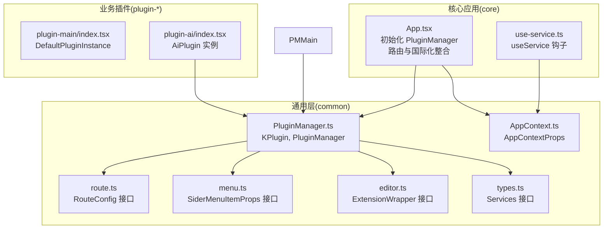
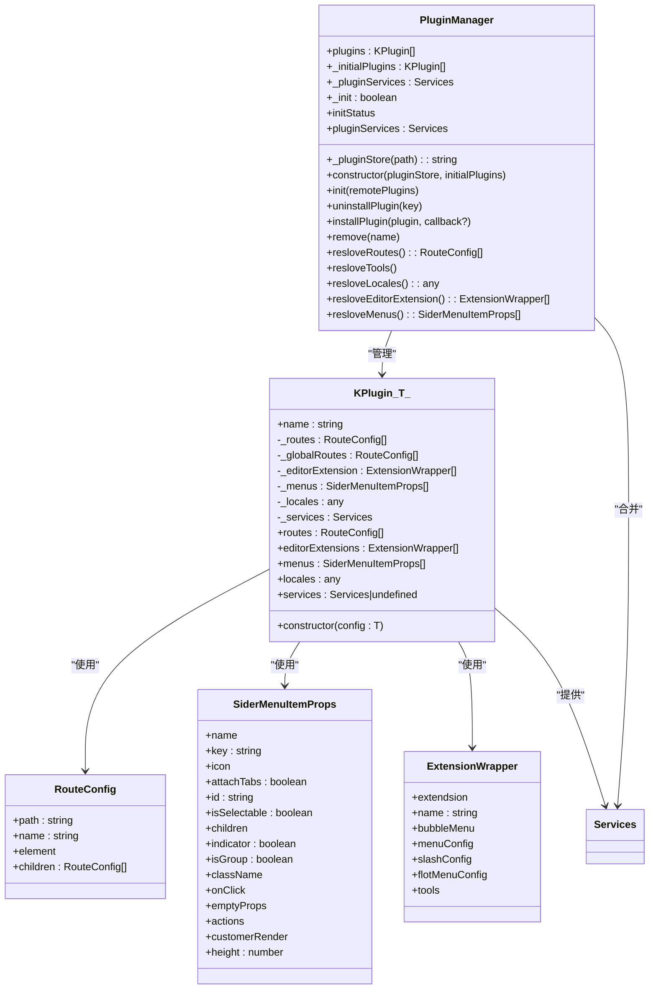
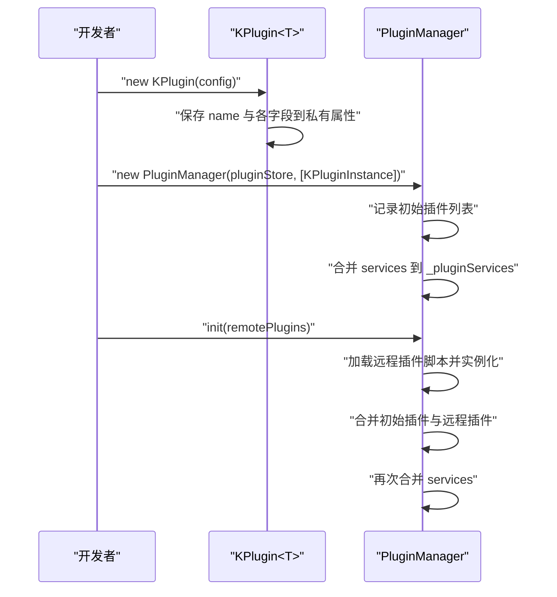
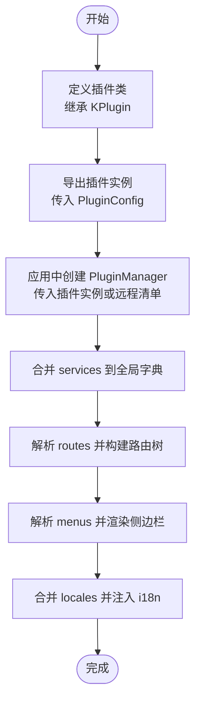
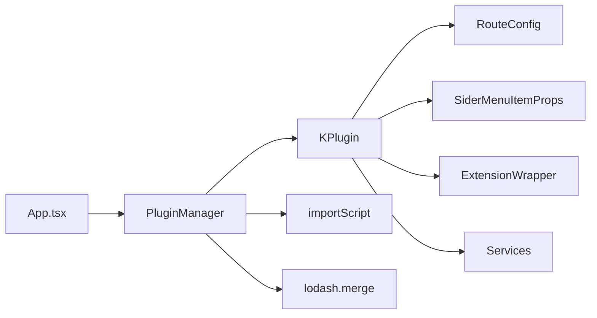

# KPlugin类设计

<cite>
**本文引用的文件**
- [packages/common/src/core/PluginManager.ts](file://packages/common/src/core/PluginManager.ts)
- [packages/common/src/core/types.ts](file://packages/common/src/core/types.ts)
- [packages/common/src/core/route.ts](file://packages/common/src/core/route.ts)
- [packages/common/src/core/menu.ts](file://packages/common/src/core/menu.ts)
- [packages/common/src/core/editor.ts](file://packages/common/src/core/editor.ts)
- [packages/common/src/core/AppContext.ts](file://packages/common/src/core/AppContext.ts)
- [packages/core/src/App.tsx](file://packages/core/src/App.tsx)
- [packages/core/src/hooks/use-service.ts](file://packages/core/src/hooks/use-service.ts)
- [packages/plugin-main/src/index.tsx](file://packages/plugin-main/src/index.tsx)
- [packages/plugin-ai/src/index.tsx](file://packages/plugin-ai/src/index.tsx)
</cite>

## 目录
1. [引言](#引言)
2. [项目结构](#项目结构)
3. [核心组件](#核心组件)
4. [架构总览](#架构总览)
5. [详细组件分析](#详细组件分析)
6. [依赖关系分析](#依赖关系分析)
7. [性能考虑](#性能考虑)
8. [故障排查指南](#故障排查指南)
9. [结论](#结论)
10. [附录](#附录)

## 引言
本设计文档围绕 KPlugin 泛型类展开，系统阐述其设计理念、类型安全机制与插件配置模型 PluginConfig 的结构与约束。文档将逐项解释各配置字段（如 name、status、routes、globalRoutes、menus、editorExtension、locales、services 等）的语义、使用场景与最佳实践，并说明插件实例的创建流程、配置验证要点、访问控制与 getter 方法实现。同时提供常见错误处理建议、自定义插件配置示例与调试技巧，帮助开发者在不直接阅读源码的情况下也能高效理解并正确使用 KPlugin。

## 项目结构
KPlugin 位于通用层 common 包中，作为插件系统的基础设施，配合 PluginManager 实现插件的动态加载、合并与分发；在核心应用 core 中通过 App 初始化流程集成插件，最终在业务插件包（如 plugin-main、plugin-ai）中以具体配置实例化 KPlugin。

图示来源
- [packages/common/src/core/PluginManager.ts](file://packages/common/src/core/PluginManager.ts#L1-L170)
- [packages/common/src/core/types.ts](file://packages/common/src/core/types.ts#L1-L4)
- [packages/common/src/core/route.ts](file://packages/common/src/core/route.ts#L1-L8)
- [packages/common/src/core/menu.ts](file://packages/common/src/core/menu.ts#L1-L25)
- [packages/common/src/core/editor.ts](file://packages/common/src/core/editor.ts#L1-L31)
- [packages/common/src/core/AppContext.ts](file://packages/common/src/core/AppContext.ts#L1-L13)
- [packages/core/src/App.tsx](file://packages/core/src/App.tsx#L1-L187)
- [packages/core/src/hooks/use-service.ts](file://packages/core/src/hooks/use-service.ts#L1-L15)
- [packages/plugin-main/src/index.tsx](file://packages/plugin-main/src/index.tsx#L1-L118)
- [packages/plugin-ai/src/index.tsx](file://packages/plugin-ai/src/index.tsx#L1-L35)

章节来源
- [packages/common/src/core/PluginManager.ts](file://packages/common/src/core/PluginManager.ts#L1-L170)
- [packages/core/src/App.tsx](file://packages/core/src/App.tsx#L1-L187)

## 核心组件
- KPlugin<T extends PluginConfig>
  - 设计理念：以泛型约束 PluginConfig，确保插件配置在编译期具备强类型保障；内部字段私有化，通过只读 getter 暴露，实现访问控制与不可变性。
  - 关键字段与类型：
    - name: string（必填）
    - status: string（必填）
    - routes?: RouteConfig[]
    - globalRoutes?: RouteConfig[]
    - menus?: SiderMenuItemProps[]
    - editorExtension?: ExtensionWrapper[]
    - locales?: Record<string, any>
    - services?: Services
  - Getter 方法：
    - routes: 返回私有 routes 或空数组
    - editorExtensions: 返回私有 editorExtension 或空数组
    - menus: 返回私有 menus 或空数组
    - locales: 返回私有 locales
    - services: 返回私有 services 或 undefined
  - 类型安全机制：
    - 通过 T extends PluginConfig 约束构造函数参数，避免传入不合规配置。
    - 所有 getter 均返回安全默认值（如空数组），降低调用端判空成本。

- PluginManager
  - 职责：管理插件集合、合并服务、解析路由/菜单/编辑器扩展、聚合多语言资源。
  - 关键能力：
    - init(remotePlugins): 支持远程插件脚本按需加载并实例化，合并初始插件与远程插件，更新服务集合。
    - uninstallPlugin/remove: 插件卸载与移除。
    - resloveRoutes/resloveMenus/resloveEditorExtension/resloveLocales: 聚合各插件配置。
    - pluginServices: 暴露合并后的服务字典。

- App 与上下文
  - App 在启动时创建 PluginManager 并初始化，随后根据插件路由构建应用路由树，合并插件多语言资源并注入 i18n。
  - AppContext 提供插件管理器的全局访问入口。

章节来源
- [packages/common/src/core/PluginManager.ts](file://packages/common/src/core/PluginManager.ts#L1-L170)
- [packages/common/src/core/types.ts](file://packages/common/src/core/types.ts#L1-L4)
- [packages/common/src/core/route.ts](file://packages/common/src/core/route.ts#L1-L8)
- [packages/common/src/core/menu.ts](file://packages/common/src/core/menu.ts#L1-L25)
- [packages/common/src/core/editor.ts](file://packages/common/src/core/editor.ts#L1-L31)
- [packages/common/src/core/AppContext.ts](file://packages/common/src/core/AppContext.ts#L1-L13)
- [packages/core/src/App.tsx](file://packages/core/src/App.tsx#L1-L187)

## 架构总览
下图展示 KPlugin 与 PluginManager 的协作关系，以及与路由、菜单、编辑器扩展、服务、国际化等模块的交互。

图示来源
- [packages/common/src/core/PluginManager.ts](file://packages/common/src/core/PluginManager.ts#L1-L170)
- [packages/common/src/core/route.ts](file://packages/common/src/core/route.ts#L1-L8)
- [packages/common/src/core/menu.ts](file://packages/common/src/core/menu.ts#L1-L25)
- [packages/common/src/core/editor.ts](file://packages/common/src/core/editor.ts#L1-L31)
- [packages/common/src/core/types.ts](file://packages/common/src/core/types.ts#L1-L4)

## 详细组件分析

### KPlugin<T extends PluginConfig> 类设计
- 泛型约束与类型安全
  - 通过 T extends PluginConfig 确保构造函数接收的配置对象满足 PluginConfig 的字段集合，避免遗漏或多余字段导致的运行时问题。
  - 字段私有化与只读 getter 提供访问控制，防止外部直接修改内部状态。
- 字段与 getter 行为
  - routes/editorExtensions/menus：若未提供则返回空数组，便于上层统一处理。
  - locales/services：保留原始值，允许为 undefined。
- 访问控制与不可变性
  - name 在构造时赋值后不可更改，保证插件标识稳定。
  - 内部数组字段通过浅拷贝返回，避免外部修改影响内部状态。

图示来源
- [packages/common/src/core/PluginManager.ts](file://packages/common/src/core/PluginManager.ts#L78-L112)
- [packages/plugin-main/src/index.tsx](file://packages/plugin-main/src/index.tsx#L16-L70)
- [packages/plugin-ai/src/index.tsx](file://packages/plugin-ai/src/index.tsx#L1-L35)

章节来源
- [packages/common/src/core/PluginManager.ts](file://packages/common/src/core/PluginManager.ts#L1-L170)
- [packages/plugin-main/src/index.tsx](file://packages/plugin-main/src/index.tsx#L16-L118)
- [packages/plugin-ai/src/index.tsx](file://packages/plugin-ai/src/index.tsx#L1-L35)

### PluginConfig 接口与字段详解
- name
  - 含义：插件唯一标识名称。
  - 使用场景：用于卸载、事件触发、服务映射等。
  - 最佳实践：保持全局唯一且语义明确。
- status
  - 含义：插件状态字符串，用于标记启用/禁用等状态。
  - 使用场景：插件商店筛选、安装/卸载逻辑判断。
  - 最佳实践：采用枚举化或常量集，避免拼写错误。
- routes
  - 含义：插件提供的页面路由配置数组。
  - 使用场景：App 初始化时解析为 React Router 路由树。
  - 最佳实践：路径规范、嵌套路由清晰、元素按需懒加载。
- globalRoutes
  - 含义：全局路由（与 routes 的区别在于作用域或生命周期）。
  - 使用场景：跨页面共享的导航或工具路由。
  - 最佳实践：谨慎使用，避免与主应用路由冲突。
- menus
  - 含义：侧边栏菜单项配置数组。
  - 使用场景：生成导航菜单、Tab 切换、快捷入口。
  - 最佳实践：icon 与 key 组合唯一，支持分组与子菜单。
- editorExtension
  - 含义：编辑器扩展集合，包含扩展、菜单、悬浮工具等。
  - 使用场景：在编辑器中注入新功能节点、命令与 UI。
  - 最佳实践：按功能分组（block/inline/mark/custom），提供清晰的菜单与 slash 输入提示。
- locales
  - 含义：多语言资源对象，通常包含语言代码到翻译包的映射。
  - 使用场景：App 初始化时合并至 i18n 资源库。
  - 最佳实践：遵循层级命名，避免 key 冲突；提供默认语言回退。
- services
  - 含义：插件提供的服务对象，供其他模块通过 useService 钩子获取。
  - 使用场景：业务逻辑封装、API 封装、工具方法暴露。
  - 最佳实践：服务命名清晰、职责单一、避免循环依赖。

章节来源
- [packages/common/src/core/PluginManager.ts](file://packages/common/src/core/PluginManager.ts#L9-L18)
- [packages/common/src/core/route.ts](file://packages/common/src/core/route.ts#L1-L8)
- [packages/common/src/core/menu.ts](file://packages/common/src/core/menu.ts#L1-L25)
- [packages/common/src/core/editor.ts](file://packages/common/src/core/editor.ts#L1-L31)
- [packages/common/src/core/types.ts](file://packages/common/src/core/types.ts#L1-L4)

### 插件实例创建流程与配置验证
- 创建流程
  - 定义插件类继承 KPlugin<T>，不强制覆写任何方法即可使用默认 getter。
  - 在插件入口导出单例实例，传入符合 PluginConfig 的配置对象。
  - 在应用启动时将插件实例传入 PluginManager 构造函数，或通过远程插件加载机制动态注入。
- 配置验证
  - 编译期：T extends PluginConfig 约束确保字段齐全。
  - 运行期：PluginManager 在合并 services 时进行对象合并，若字段缺失将按默认值处理（如 routes 默认空数组）。
  - 建议：在开发阶段对关键字段（如 name、status）增加单元测试断言，确保插件清单一致性。

图示来源
- [packages/plugin-main/src/index.tsx](file://packages/plugin-main/src/index.tsx#L16-L118)
- [packages/plugin-ai/src/index.tsx](file://packages/plugin-ai/src/index.tsx#L1-L35)
- [packages/common/src/core/PluginManager.ts](file://packages/common/src/core/PluginManager.ts#L78-L169)
- [packages/core/src/App.tsx](file://packages/core/src/App.tsx#L129-L169)

章节来源
- [packages/plugin-main/src/index.tsx](file://packages/plugin-main/src/index.tsx#L16-L118)
- [packages/plugin-ai/src/index.tsx](file://packages/plugin-ai/src/index.tsx#L1-L35)
- [packages/common/src/core/PluginManager.ts](file://packages/common/src/core/PluginManager.ts#L78-L169)
- [packages/core/src/App.tsx](file://packages/core/src/App.tsx#L129-L169)

### 访问控制与 getter 方法实现
- 访问控制
  - name 为公开只读属性，其余字段均为私有属性，仅通过 getter 暴露。
  - getter 返回安全默认值（如空数组），避免调用端频繁判空。
- 典型使用
  - 路由解析：PluginManager.resloveRoutes() 会遍历所有插件的 routes 并合并。
  - 多语言：PluginManager.resloveLocales() 递归合并各插件 locales。
  - 编辑器扩展：PluginManager.resloveEditorExtension() 汇总 editorExtension。
  - 菜单：PluginManager.resloveMenus() 汇总 menus。

章节来源
- [packages/common/src/core/PluginManager.ts](file://packages/common/src/core/PluginManager.ts#L41-L61)
- [packages/common/src/core/PluginManager.ts](file://packages/common/src/core/PluginManager.ts#L122-L169)

### 插件配置最佳实践
- 字段完整性
  - 至少提供 name 与 status；若无路由/菜单/编辑器扩展/多语言/服务，可留空但需显式声明。
- 路由与菜单
  - 路径规范：使用语义化路径，避免重复；嵌套路由清晰分层。
  - 菜单项：icon 与 key 唯一，支持分组与子菜单，提供点击回调与动作按钮。
- 编辑器扩展
  - 按功能分组（block/inline/mark/custom），提供菜单与 slash 输入提示，确保执行函数健壮。
- 多语言
  - 语言键名与翻译层级清晰，避免 key 冲突；提供默认语言回退。
- 服务
  - 服务命名清晰、职责单一；避免循环依赖；对外暴露稳定的 API。

章节来源
- [packages/common/src/core/route.ts](file://packages/common/src/core/route.ts#L1-L8)
- [packages/common/src/core/menu.ts](file://packages/common/src/core/menu.ts#L1-L25)
- [packages/common/src/core/editor.ts](file://packages/common/src/core/editor.ts#L1-L31)
- [packages/common/src/core/types.ts](file://packages/common/src/core/types.ts#L1-L4)

### 常见错误与处理
- 忘记提供 name/status
  - 现象：插件无法被识别或卸载。
  - 处理：确保 PluginConfig 中 name 与 status 存在；在开发阶段添加断言。
- routes/menus 为空导致 UI 不显示
  - 现象：页面路由缺失、侧边栏无入口。
  - 处理：确认 routes/menus 是否正确传入；使用默认空数组避免崩溃。
- locales 结构不一致
  - 现象：i18n 合并失败或覆盖。
  - 处理：统一语言键与翻译层级；避免重复 key。
- services 未合并
  - 现象：useService 获取不到服务。
  - 处理：确认插件 services 对象存在且键名唯一；检查 PluginManager.init 流程是否执行。

章节来源
- [packages/common/src/core/PluginManager.ts](file://packages/common/src/core/PluginManager.ts#L78-L112)
- [packages/core/src/hooks/use-service.ts](file://packages/core/src/hooks/use-service.ts#L1-L15)

### 自定义插件配置示例与调试技巧
- 示例参考
  - 主插件示例：DefaultPluginInstance 展示了完整的 routes、menus、editorExtension、services、locales 配置。
  - AI 插件示例：AiPlugin 展示了 editorExtension 与 locales 的最小化配置。
- 调试技巧
  - 在 PluginManager.init 中打印已加载插件与服务，定位远程加载失败或合并异常。
  - 使用 useService 钩子在组件中打印服务对象，确认服务键名与类型。
  - 在 App 初始化阶段打印路由与多语言资源，验证合并结果。

章节来源
- [packages/plugin-main/src/index.tsx](file://packages/plugin-main/src/index.tsx#L16-L118)
- [packages/plugin-ai/src/index.tsx](file://packages/plugin-ai/src/index.tsx#L1-L35)
- [packages/core/src/hooks/use-service.ts](file://packages/core/src/hooks/use-service.ts#L1-L15)
- [packages/common/src/core/PluginManager.ts](file://packages/common/src/core/PluginManager.ts#L78-L112)

## 依赖关系分析
- 组件耦合
  - KPlugin 与 PluginManager：PluginManager 管理 KPlugin 实例集合，二者低耦合高内聚。
  - KPlugin 与类型模块：依赖 RouteConfig、SiderMenuItemProps、ExtensionWrapper、Services 等类型，形成清晰边界。
  - App 与 PluginManager：App 在启动时初始化 PluginManager，并基于其结果构建路由与国际化。
- 外部依赖
  - importScript：用于远程插件脚本的动态加载。
  - lodash.merge：用于合并服务与多语言资源。
- 循环依赖风险
  - 当前结构未发现循环依赖；建议新增插件时避免在 KPlugin 实例中引入对 App 的直接依赖。

图示来源
- [packages/core/src/App.tsx](file://packages/core/src/App.tsx#L1-L187)
- [packages/common/src/core/PluginManager.ts](file://packages/common/src/core/PluginManager.ts#L1-L170)
- [packages/common/src/core/route.ts](file://packages/common/src/core/route.ts#L1-L8)
- [packages/common/src/core/menu.ts](file://packages/common/src/core/menu.ts#L1-L25)
- [packages/common/src/core/editor.ts](file://packages/common/src/core/editor.ts#L1-L31)
- [packages/common/src/core/types.ts](file://packages/common/src/core/types.ts#L1-L4)

章节来源
- [packages/core/src/App.tsx](file://packages/core/src/App.tsx#L1-L187)
- [packages/common/src/core/PluginManager.ts](file://packages/common/src/core/PluginManager.ts#L1-L170)

## 性能考虑
- 动态加载远程插件
  - 使用 importScript 并带缓存参数，减少重复加载开销。
  - 并行加载多个插件脚本，缩短初始化时间。
- 合并策略
  - 服务与多语言使用深度合并，避免重复键覆盖；建议在插件侧保持键名唯一，减少合并成本。
- 路由与菜单解析
  - 解析 routes/menus 时尽量避免深层嵌套与复杂元素，减少渲染压力。

[本节为通用指导，无需列出章节来源]

## 故障排查指南
- 插件未生效
  - 检查 name/status 是否正确传入；确认 PluginManager.init 已执行。
- 路由不显示
  - 核对 routes 配置路径与元素；确认 PluginManager.resloveRoutes 输出。
- 菜单不显示
  - 核对 menus 配置项与 icon/key；确认 PluginManager.resloveMenus 输出。
- 多语言未生效
  - 核对 locales 结构与语言键；确认 App 初始化时已合并资源。
- 服务获取失败
  - 核对 services 键名；确认 useService 参数与插件导出一致。

章节来源
- [packages/common/src/core/PluginManager.ts](file://packages/common/src/core/PluginManager.ts#L78-L169)
- [packages/core/src/hooks/use-service.ts](file://packages/core/src/hooks/use-service.ts#L1-L15)
- [packages/core/src/App.tsx](file://packages/core/src/App.tsx#L129-L169)

## 结论
KPlugin 通过泛型约束与私有字段+只读 getter 的设计，在保证类型安全的同时提供了良好的访问控制与不可变性。结合 PluginManager 的动态加载与聚合能力，形成了灵活、可扩展的插件体系。遵循本文的最佳实践与调试技巧，可显著提升插件开发效率与稳定性。

[本节为总结，无需列出章节来源]

## 附录
- 关键实现位置索引
  - KPlugin 类与 PluginConfig 定义：[packages/common/src/core/PluginManager.ts](file://packages/common/src/core/PluginManager.ts#L9-L61)
  - PluginManager 初始化与聚合：[packages/common/src/core/PluginManager.ts](file://packages/common/src/core/PluginManager.ts#L78-L169)
  - App 初始化与路由/国际化整合：[packages/core/src/App.tsx](file://packages/core/src/App.tsx#L129-L169)
  - useService 钩子：[packages/core/src/hooks/use-service.ts](file://packages/core/src/hooks/use-service.ts#L1-L15)
  - 主插件示例 DefaultPluginInstance：[packages/plugin-main/src/index.tsx](file://packages/plugin-main/src/index.tsx#L16-L118)
  - AI 插件示例 AiPlugin：[packages/plugin-ai/src/index.tsx](file://packages/plugin-ai/src/index.tsx#L1-L35)

[本节为索引，无需列出章节来源]