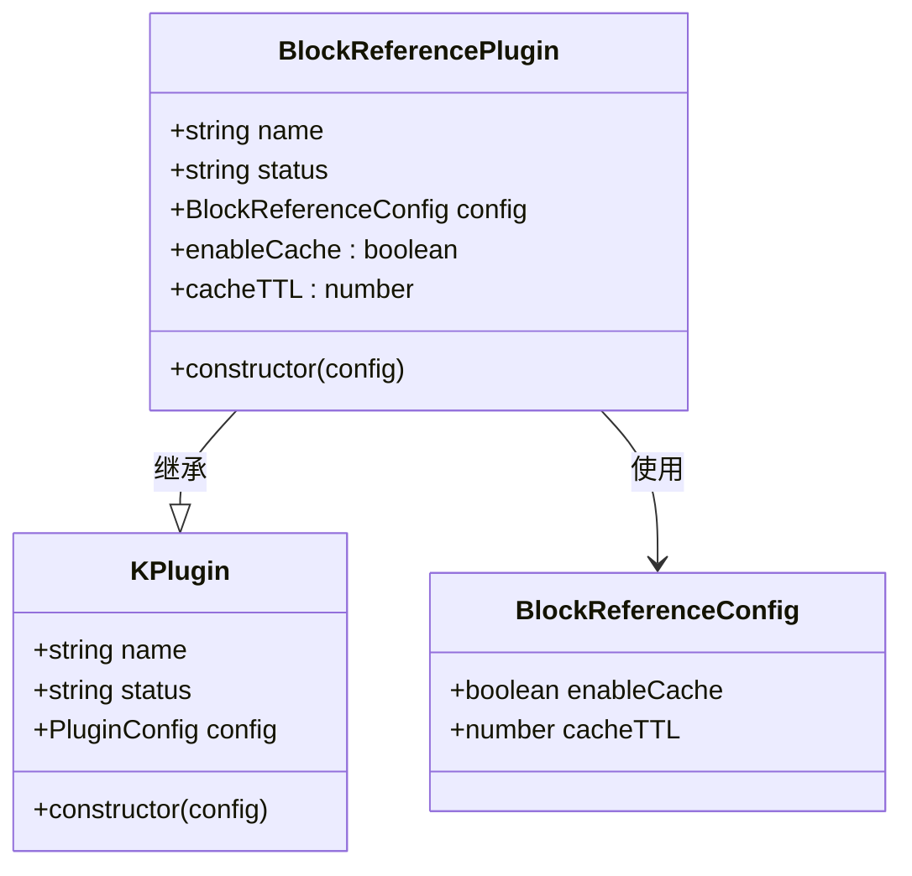
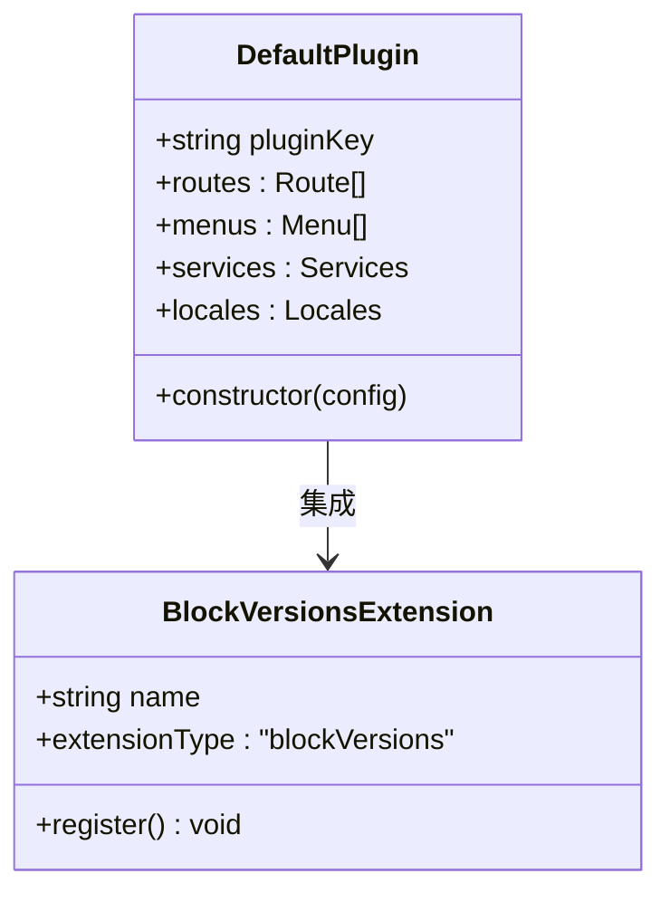
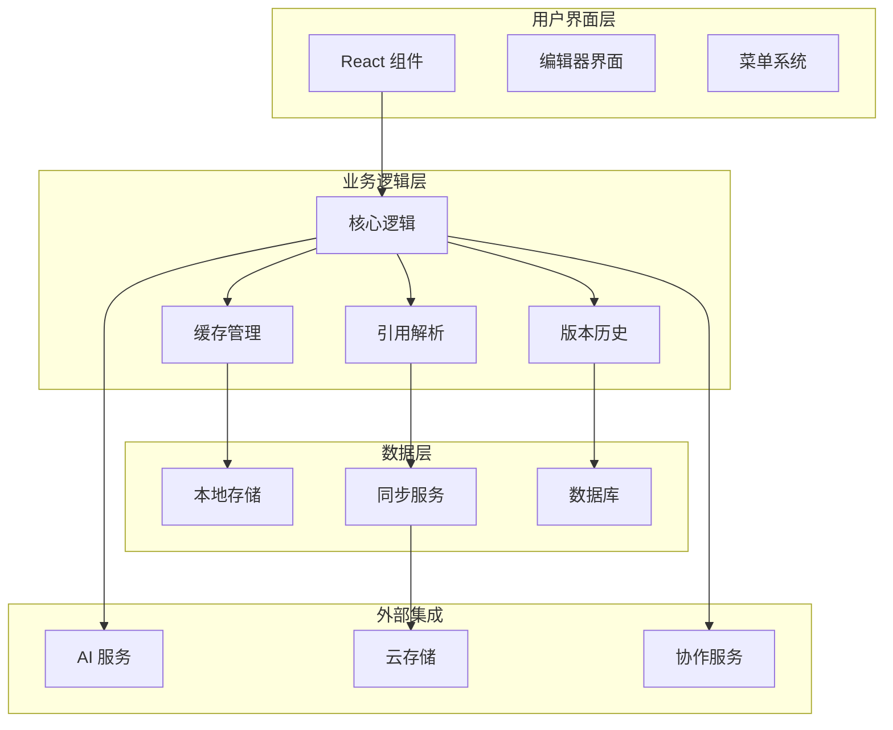
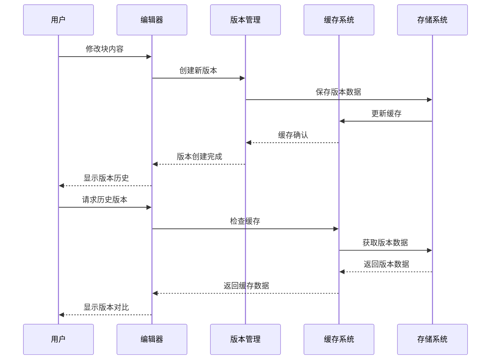
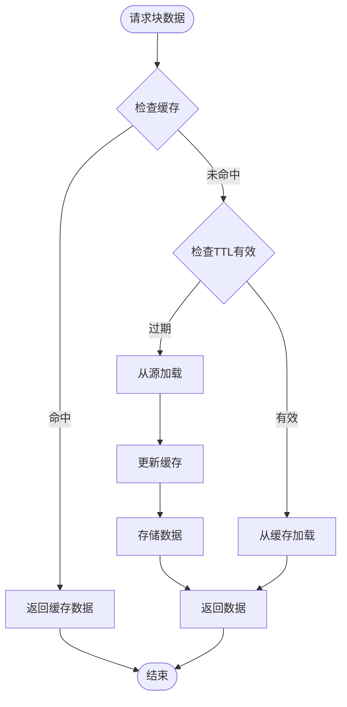
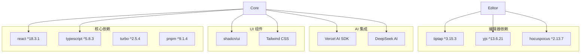

# 块版本扩展

<cite>
**本文档引用的文件**
- [README.md](file://README.md)
- [package.json](file://package.json)
- [turbo.json](file://turbo.json)
- [pnpm-workspace.yaml](file://pnpm-workspace.yaml)
- [packages/core/package.json](file://packages/core/package.json)
- [packages/editor/package.json](file://packages/editor/package.json)
- [packages/plugin-block-reference/package.json](file://packages/plugin-block-reference/package.json)
- [packages/plugin-main/package.json](file://packages/plugin-main/package.json)
- [packages/plugin-main/src/index.tsx](file://packages/plugin-main/src/index.tsx)
- [packages/plugin-block-reference/src/index.tsx](file://packages/plugin-block-reference/src/index.tsx)
- [packages/core/src/index.ts](file://packages/core/src/index.ts)
</cite>

## 目录
1. [简介](#简介)
2. [项目结构](#项目结构)
3. [核心组件](#核心组件)
4. [架构概览](#架构概览)
5. [详细组件分析](#详细组件分析)
6. [依赖关系分析](#依赖关系分析)
7. [性能考虑](#性能考虑)
8. [故障排除指南](#故障排除指南)
9. [结论](#结论)

## 简介

块版本扩展是 Knowledge Repo 项目中的一个核心功能模块，专门用于增强富文本编辑器的块级别版本控制能力。该项目是一个强大的协作知识管理平台，集成了现代 Web 技术和实时协作功能。

根据项目文档，块版本扩展主要服务于以下目标：
- 提供块级别的版本控制和历史记录管理
- 支持跨文档的块引用和链接功能
- 实现智能缓存机制以优化性能
- 提供国际化支持和无障碍访问

## 项目结构

Knowledge Repo 采用 Turborepo 作为 monorepo 架构，项目结构清晰地分为应用层和包层：

```mermaid
graph TB
subgraph "应用层 (Apps)"
ViteApp[知识库应用]
LandingPage[着陆页面]
DesktopApp[桌面应用]
end
subgraph "包层 (Packages)"
subgraph "核心包"
Core[@kn/core]
Editor[@kn/editor]
Common[@kn/common]
UI[@kn/ui]
Icon[@kn/icon]
end
subgraph "插件包"
MainPlugin[@kn/plugin-main]
BlockRef[@kn/plugin-block-reference]
AIPlugin[@kn/plugin-ai]
Bitable[@kn/plugin-bitable]
FileManager[@kn/plugin-file-manager]
end
end
ViteApp --> Core
ViteApp --> Editor
Core --> MainPlugin
Core --> BlockRef
Editor --> MainPlugin
Editor --> BlockRef
```

**图表来源**
- [README.md: 66-97:66-97](file://README.md#L66-L97)
- [pnpm-workspace.yaml: 1-4:1-4](file://pnpm-workspace.yaml#L1-L4)

**章节来源**
- [README.md: 66-97:66-97](file://README.md#L66-L97)
- [pnpm-workspace.yaml: 1-4:1-4](file://pnpm-workspace.yaml#L1-L4)

## 核心组件

### 块引用插件 (Block Reference Plugin)

块引用插件是实现块版本扩展的核心组件，提供了跨文档的块链接和引用功能：



**图表来源**
- [packages/plugin-block-reference/src/index.tsx: 20-28:20-28](file://packages/plugin-block-reference/src/index.tsx#L20-L28)

### 主插件 (Main Plugin)

主插件负责集成块版本扩展功能，并提供完整的应用界面：



**图表来源**
- [packages/plugin-main/src/index.tsx: 26-28:26-28](file://packages/plugin-main/src/index.tsx#L26-L28)
- [packages/plugin-main/src/index.tsx: 14](file://packages/plugin-main/src/index.tsx#L14)

**章节来源**
- [packages/plugin-block-reference/src/index.tsx: 1-28:1-28](file://packages/plugin-block-reference/src/index.tsx#L1-L28)
- [packages/plugin-main/src/index.tsx: 1-466:1-466](file://packages/plugin-main/src/index.tsx#L1-L466)

## 架构概览

块版本扩展的整体架构采用分层设计，确保功能的模块化和可扩展性：



**图表来源**
- [README.md: 5-17:5-17](file://README.md#L5-L17)
- [packages/core/package.json: 17-34:17-34](file://packages/core/package.json#L17-L34)

## 详细组件分析

### 块版本扩展流程

块版本扩展的核心工作流程包括版本创建、历史管理和引用处理：



**图表来源**
- [packages/plugin-main/src/index.tsx: 14](file://packages/plugin-main/src/index.tsx#L14)
- [packages/plugin-block-reference/src/index.tsx: 10-14:10-14](file://packages/plugin-block-reference/src/index.tsx#L10-L14)

### 缓存机制设计

块引用插件实现了智能缓存机制来优化性能：



**图表来源**
- [packages/plugin-block-reference/src/index.tsx: 10-14:10-14](file://packages/plugin-block-reference/src/index.tsx#L10-L14)

**章节来源**
- [packages/plugin-block-reference/src/index.tsx: 1-28:1-28](file://packages/plugin-block-reference/src/index.tsx#L1-L28)
- [packages/plugin-main/src/index.tsx: 1-466:1-466](file://packages/plugin-main/src/index.tsx#L1-L466)

## 依赖关系分析

### 包依赖图



**图表来源**
- [README.md: 43-65:43-65](file://README.md#L43-L65)
- [packages/core/package.json: 17-34:17-34](file://packages/core/package.json#L17-L34)
- [packages/editor/package.json: 16-93:16-93](file://packages/editor/package.json#L16-L93)

### 插件间依赖关系

```mermaid
graph LR
subgraph "插件依赖"
MainPlugin[@kn/plugin-main] --> Core[@kn/core]
BlockRef[@kn/plugin-block-reference] --> Core
BlockRef --> Editor[@kn/editor]
MainPlugin --> Editor
AIPlugin[@kn/plugin-ai] --> Core
FileManager[@kn/plugin-file-manager] --> Core
end
subgraph "共享依赖"
Common[@kn/common] --> Core
UI[@kn/ui] --> Core
Icon[@kn/icon] --> Core
end
Core -.-> Common
Core -.-> UI
Core -.-> Icon
```

**图表来源**
- [packages/plugin-main/package.json: 15-20:15-20](file://packages/plugin-main/package.json#L15-L20)
- [packages/plugin-block-reference/package.json: 16-23:16-23](file://packages/plugin-block-reference/package.json#L16-L23)
- [packages/core/package.json: 22-25:22-25](file://packages/core/package.json#L22-L25)

**章节来源**
- [package.json: 9-54:9-54](file://package.json#L9-L54)
- [turbo.json: 1-27:1-27](file://turbo.json#L1-L27)

## 性能考虑

### 缓存策略

块版本扩展实现了多层次的缓存策略来优化性能：

1. **内存缓存**: 最近使用的块数据缓存在内存中
2. **持久化缓存**: 使用本地存储保存常用数据
3. **TTL 管理**: 自动过期机制确保数据新鲜度
4. **智能预加载**: 基于用户行为预测的数据预加载

### 并发处理

系统支持高并发场景下的数据一致性：
- 使用 Yjs 实现实时协作
- 采用 CRDT 算法保证数据同步
- 实现乐观锁机制防止冲突

### 资源优化

- 懒加载非关键资源
- 图片和媒体文件的延迟加载
- 内存使用监控和自动清理

## 故障排除指南

### 常见问题及解决方案

| 问题类型 | 症状 | 解决方案 |
|---------|------|----------|
| 缓存失效 | 数据显示过期 | 清除浏览器缓存或等待TTL过期 |
| 版本冲突 | 同步错误 | 检查网络连接，重启协作服务 |
| 插件加载失败 | 功能不可用 | 检查依赖安装，重新构建项目 |
| 性能问题 | 页面卡顿 | 关闭不必要的标签页，清理缓存 |

### 调试工具

1. **开发者工具**: 使用浏览器开发者工具监控网络请求
2. **日志系统**: 查看应用日志了解错误详情
3. **性能分析**: 使用性能面板分析内存使用情况
4. **网络监控**: 监控实时协作数据传输

**章节来源**
- [README.md: 286-304:286-304](file://README.md#L286-L304)

## 结论

块版本扩展作为 Knowledge Repo 的核心功能模块，通过精心设计的架构和优化的性能策略，为用户提供了强大而高效的块级别版本控制能力。该模块不仅满足了基本的版本管理需求，还通过智能缓存、实时协作和国际化支持等特性，为用户创造了卓越的使用体验。

项目采用的现代化技术栈和模块化设计，确保了系统的可维护性和可扩展性，为未来的功能扩展和技术升级奠定了坚实的基础。通过持续的优化和改进，块版本扩展将继续为知识管理领域提供领先的解决方案。