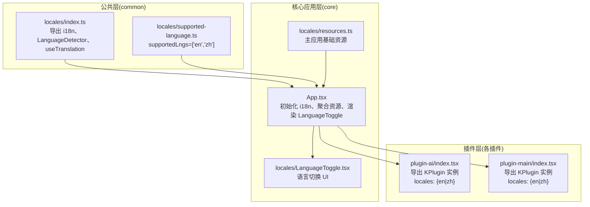
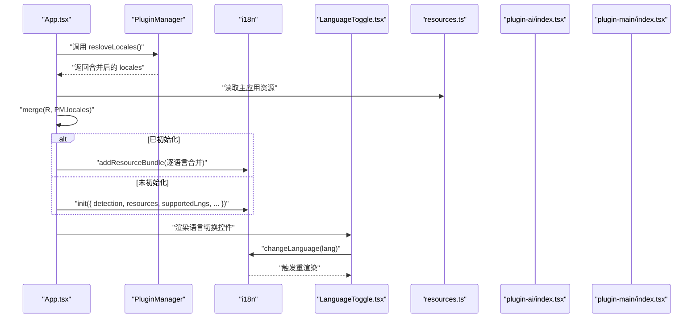
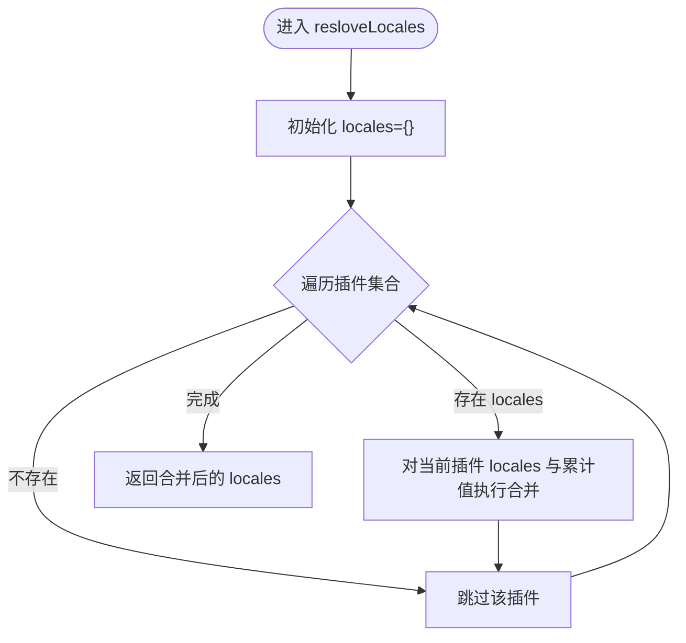
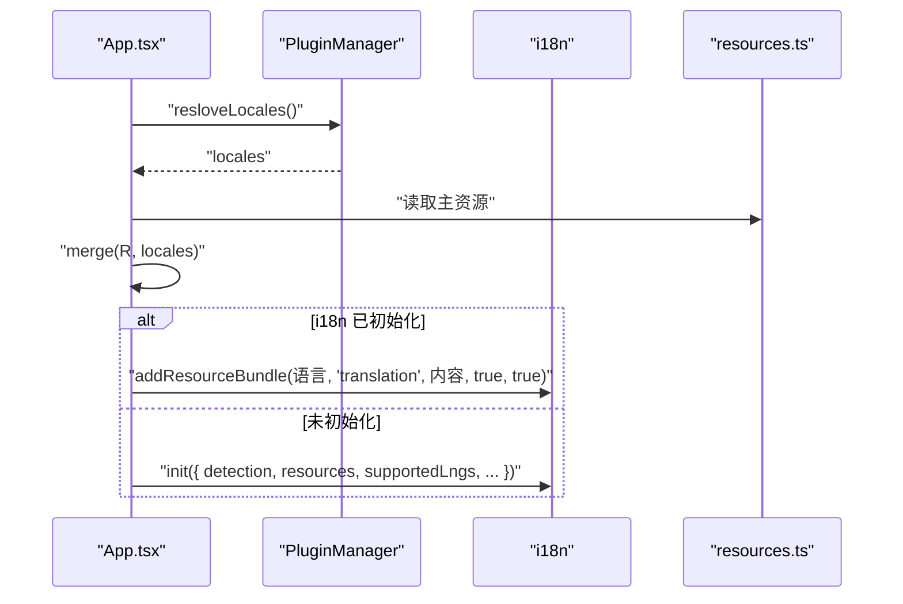
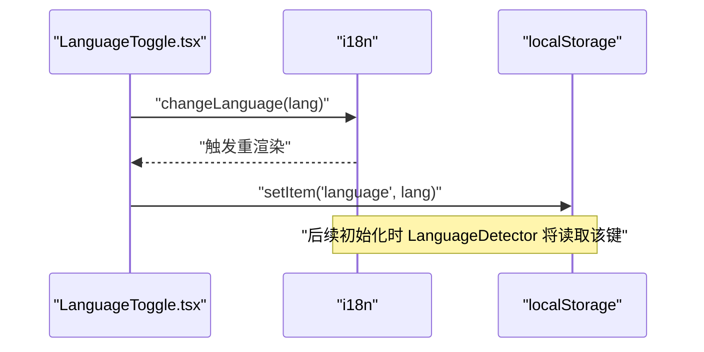
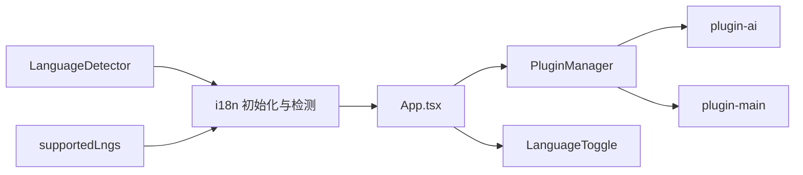

# 插件国际化系统

<cite>
**本文引用的文件**
- [packages/common/src/core/PluginManager.ts](file://packages/common/src/core/PluginManager.ts)
- [packages/common/src/locales/index.ts](file://packages/common/src/locales/index.ts)
- [packages/common/src/locales/supported-language.ts](file://packages/common/src/locales/supported-language.ts)
- [packages/core/src/App.tsx](file://packages/core/src/App.tsx)
- [packages/core/src/locales/resources.ts](file://packages/core/src/locales/resources.ts)
- [packages/core/src/locales/LanguageToggle.tsx](file://packages/core/src/locales/LanguageToggle.tsx)
- [packages/plugin-ai/src/index.tsx](file://packages/plugin-ai/src/index.tsx)
- [packages/plugin-main/src/index.tsx](file://packages/plugin-main/src/index.tsx)
</cite>

## 目录
1. [简介](#简介)
2. [项目结构](#项目结构)
3. [核心组件](#核心组件)
4. [架构总览](#架构总览)
5. [详细组件分析](#详细组件分析)
6. [依赖关系分析](#依赖关系分析)
7. [性能考量](#性能考量)
8. [故障排查指南](#故障排查指南)
9. [结论](#结论)
10. [附录](#附录)

## 简介
本文件系统性梳理仓库中的“插件国际化系统”，围绕以下目标展开：
- 解释插件本地化的配置结构与多语言资源管理机制（locales 属性、资源文件组织）
- 深入说明 resolveLocales 方法的合并逻辑与资源优先级处理
- 阐述插件语言包的动态加载与切换机制
- 明确国际化资源的命名规范与文件结构要求
- 总结多语言支持的最佳实践与翻译工作流程
- 提供国际化系统的测试方法与质量保证策略

## 项目结构
国际化能力由三层协同构成：
- 公共层（common）：提供 i18n 初始化、语言检测器、受支持语言列表等通用能力
- 核心应用层（core）：负责应用启动时聚合主资源与插件资源，初始化 i18n 并暴露语言切换 UI
- 插件层（各插件包）：在各自入口导出 KPlugin 实例，并通过 locales 字段声明多语言资源



图表来源
- [packages/common/src/locales/index.ts](file://packages/common/src/locales/index.ts#L1-L6)
- [packages/common/src/locales/supported-language.ts](file://packages/common/src/locales/supported-language.ts#L1-L2)
- [packages/core/src/App.tsx](file://packages/core/src/App.tsx#L129-L159)
- [packages/core/src/locales/resources.ts](file://packages/core/src/locales/resources.ts#L1-L26)
- [packages/core/src/locales/LanguageToggle.tsx](file://packages/core/src/locales/LanguageToggle.tsx#L1-L30)
- [packages/plugin-ai/src/index.tsx](file://packages/plugin-ai/src/index.tsx#L1-L35)
- [packages/plugin-main/src/index.tsx](file://packages/plugin-main/src/index.tsx#L60-L118)

章节来源
- [packages/common/src/locales/index.ts](file://packages/common/src/locales/index.ts#L1-L6)
- [packages/common/src/locales/supported-language.ts](file://packages/common/src/locales/supported-language.ts#L1-L2)
- [packages/core/src/App.tsx](file://packages/core/src/App.tsx#L129-L159)
- [packages/core/src/locales/resources.ts](file://packages/core/src/locales/resources.ts#L1-L26)
- [packages/core/src/locales/LanguageToggle.tsx](file://packages/core/src/locales/LanguageToggle.tsx#L1-L30)
- [packages/plugin-ai/src/index.tsx](file://packages/plugin-ai/src/index.tsx#L1-L35)
- [packages/plugin-main/src/index.tsx](file://packages/plugin-main/src/index.tsx#L60-L118)

## 核心组件
- PluginManager：统一管理插件生命周期与资源配置，提供 resolveLocales 聚合插件 locales
- i18n 初始化与语言检测：在应用启动阶段完成初始化，支持从本地存储读取语言偏好
- 语言切换 UI：提供下拉菜单切换语言，并持久化到本地存储
- 主应用资源与插件资源：主应用 resources 作为基线，插件资源通过合并覆盖

章节来源
- [packages/common/src/core/PluginManager.ts](file://packages/common/src/core/PluginManager.ts#L136-L144)
- [packages/core/src/App.tsx](file://packages/core/src/App.tsx#L129-L159)
- [packages/core/src/locales/LanguageToggle.tsx](file://packages/core/src/locales/LanguageToggle.tsx#L1-L30)
- [packages/core/src/locales/resources.ts](file://packages/core/src/locales/resources.ts#L1-L26)
- [packages/common/src/locales/index.ts](file://packages/common/src/locales/index.ts#L1-L6)
- [packages/common/src/locales/supported-language.ts](file://packages/common/src/locales/supported-language.ts#L1-L2)

## 架构总览
整体流程：应用启动 → 加载主资源 → 聚合插件资源 → 初始化 i18n → 渲染语言切换 UI → 运行期按需更新资源



图表来源
- [packages/core/src/App.tsx](file://packages/core/src/App.tsx#L129-L159)
- [packages/common/src/core/PluginManager.ts](file://packages/common/src/core/PluginManager.ts#L136-L144)
- [packages/core/src/locales/resources.ts](file://packages/core/src/locales/resources.ts#L1-L26)
- [packages/core/src/locales/LanguageToggle.tsx](file://packages/core/src/locales/LanguageToggle.tsx#L1-L30)
- [packages/plugin-ai/src/index.tsx](file://packages/plugin-ai/src/index.tsx#L1-L35)
- [packages/plugin-main/src/index.tsx](file://packages/plugin-main/src/index.tsx#L60-L118)

## 详细组件分析

### PluginManager 的 resolveLocales 合并与优先级
- 合并策略：对每个插件的 locales 执行深度合并，最终形成全局可用的多语言资源对象
- 优先级规则：后加入的插件资源会覆盖先前资源中同路径键值；同一插件内部以语言维度分隔，互不干扰
- 数据结构：locales 顶层为语言代码字符串，第二层固定为 translation 命名空间，第三层为键路径



图表来源
- [packages/common/src/core/PluginManager.ts](file://packages/common/src/core/PluginManager.ts#L136-L144)

章节来源
- [packages/common/src/core/PluginManager.ts](file://packages/common/src/core/PluginManager.ts#L136-L144)

### 应用启动时的资源聚合与初始化
- 资源来源：主应用 resources 与插件聚合后的 locales 通过合并生成最终资源集
- 初始化参数：启用语言检测器、设置回退语言、限定受支持语言、配置转义行为
- 运行期增量更新：若 i18n 已初始化，则逐语言向现有实例追加资源包



图表来源
- [packages/core/src/App.tsx](file://packages/core/src/App.tsx#L129-L159)
- [packages/core/src/locales/resources.ts](file://packages/core/src/locales/resources.ts#L1-L26)
- [packages/common/src/locales/index.ts](file://packages/common/src/locales/index.ts#L1-L6)
- [packages/common/src/locales/supported-language.ts](file://packages/common/src/locales/supported-language.ts#L1-L2)

章节来源
- [packages/core/src/App.tsx](file://packages/core/src/App.tsx#L129-L159)
- [packages/core/src/locales/resources.ts](file://packages/core/src/locales/resources.ts#L1-L26)
- [packages/common/src/locales/index.ts](file://packages/common/src/locales/index.ts#L1-L6)
- [packages/common/src/locales/supported-language.ts](file://packages/common/src/locales/supported-language.ts#L1-L2)

### 语言切换与本地存储
- 切换机制：LanguageToggle 使用 useTranslation 获取 i18n 实例，点击项调用 changeLanguage 并将语言写入本地存储
- 检测顺序：i18n 初始化时配置了从本地存储读取语言偏好的检测器



图表来源
- [packages/core/src/locales/LanguageToggle.tsx](file://packages/core/src/locales/LanguageToggle.tsx#L1-L30)
- [packages/common/src/locales/index.ts](file://packages/common/src/locales/index.ts#L1-L6)

章节来源
- [packages/core/src/locales/LanguageToggle.tsx](file://packages/core/src/locales/LanguageToggle.tsx#L1-L30)
- [packages/common/src/locales/index.ts](file://packages/common/src/locales/index.ts#L1-L6)

### 插件资源声明与组织
- 插件入口导出 KPlugin 实例，并在 config 中提供 locales 字段
- 语言层级：顶层为语言代码字符串（如 en、zh），第二层为 translation 命名空间，第三层为键路径
- 示例：AI 插件与主插件均在 locales 中提供 en/zh 两套键值

```mermaid
classDiagram
class KPlugin {
+name : string
+routes
+editorExtensions
+menus
+locales
+services
}
class PluginManager {
+plugins : KPlugin[]
+resloveLocales() any
+resloveRoutes() RouteConfig[]
}
class PluginAI {
+locales : {en|zh}
}
class PluginMain {
+locales : {en|zh}
}
PluginManager --> KPlugin : "聚合"
PluginAI --> KPlugin : "继承/使用"
PluginMain --> KPlugin : "继承/使用"
```

图表来源
- [packages/common/src/core/PluginManager.ts](file://packages/common/src/core/PluginManager.ts#L9-L18)
- [packages/common/src/core/PluginManager.ts](file://packages/common/src/core/PluginManager.ts#L136-L144)
- [packages/plugin-ai/src/index.tsx](file://packages/plugin-ai/src/index.tsx#L1-L35)
- [packages/plugin-main/src/index.tsx](file://packages/plugin-main/src/index.tsx#L60-L118)

章节来源
- [packages/plugin-ai/src/index.tsx](file://packages/plugin-ai/src/index.tsx#L1-L35)
- [packages/plugin-main/src/index.tsx](file://packages/plugin-main/src/index.tsx#L60-L118)
- [packages/common/src/core/PluginManager.ts](file://packages/common/src/core/PluginManager.ts#L9-L18)

## 依赖关系分析
- 公共层依赖：i18next、i18next-browser-languagedetector、react-i18next
- 核心应用依赖：公共层提供的 i18n、LanguageDetector、supportedLngs
- 插件依赖：公共层提供的 KPlugin 类型与 PluginManager 能力
- 关键耦合点：resolveLocales 与 merge 的组合决定资源合并与覆盖规则



图表来源
- [packages/common/src/locales/index.ts](file://packages/common/src/locales/index.ts#L1-L6)
- [packages/common/src/locales/supported-language.ts](file://packages/common/src/locales/supported-language.ts#L1-L2)
- [packages/core/src/App.tsx](file://packages/core/src/App.tsx#L129-L159)
- [packages/common/src/core/PluginManager.ts](file://packages/common/src/core/PluginManager.ts#L136-L144)
- [packages/plugin-ai/src/index.tsx](file://packages/plugin-ai/src/index.tsx#L1-L35)
- [packages/plugin-main/src/index.tsx](file://packages/plugin-main/src/index.tsx#L60-L118)

章节来源
- [packages/common/src/locales/index.ts](file://packages/common/src/locales/index.ts#L1-L6)
- [packages/common/src/locales/supported-language.ts](file://packages/common/src/locales/supported-language.ts#L1-L2)
- [packages/core/src/App.tsx](file://packages/core/src/App.tsx#L129-L159)
- [packages/common/src/core/PluginManager.ts](file://packages/common/src/core/PluginManager.ts#L136-L144)
- [packages/plugin-ai/src/index.tsx](file://packages/plugin-ai/src/index.tsx#L1-L35)
- [packages/plugin-main/src/index.tsx](file://packages/plugin-main/src/index.tsx#L60-L118)

## 性能考量
- 合并成本：resolveLocales 对每个插件执行合并，插件数量较多时建议控制资源体量与层级深度
- 运行期增量更新：已初始化实例采用 addResourceBundle 追加资源，避免重复初始化带来的开销
- 语言检测：本地存储读取成本极低，建议保持检测器配置简洁
- 资源体积：建议拆分大型命名空间，按页面或功能模块划分，减少不必要的热更新范围

## 故障排查指南
- 语言未生效
  - 检查 LanguageToggle 是否正确调用 changeLanguage，并将语言写入本地存储
  - 确认 i18n 初始化时 supportedLngs 包含目标语言
  - 参考路径：[packages/core/src/locales/LanguageToggle.tsx](file://packages/core/src/locales/LanguageToggle.tsx#L1-L30)，[packages/common/src/locales/supported-language.ts](file://packages/common/src/locales/supported-language.ts#L1-L2)
- 资源未合并
  - 确认插件入口已导出 KPlugin 实例且 locales 结构正确
  - 确认 resolveLocales 返回值被用于 merge 与初始化
  - 参考路径：[packages/common/src/core/PluginManager.ts](file://packages/common/src/core/PluginManager.ts#L136-L144)，[packages/plugin-ai/src/index.tsx](file://packages/plugin-ai/src/index.tsx#L1-L35)，[packages/plugin-main/src/index.tsx](file://packages/plugin-main/src/index.tsx#L60-L118)
- 回退语言不符合预期
  - 检查 i18n 初始化时 fallbackLng 设置
  - 参考路径：[packages/core/src/App.tsx](file://packages/core/src/App.tsx#L129-L159)
- 重复键冲突
  - 合并策略为后入覆盖先入，确保插件间键路径不冲突或明确覆盖意图
  - 参考路径：[packages/common/src/core/PluginManager.ts](file://packages/common/src/core/PluginManager.ts#L136-L144)

章节来源
- [packages/core/src/locales/LanguageToggle.tsx](file://packages/core/src/locales/LanguageToggle.tsx#L1-L30)
- [packages/common/src/locales/supported-language.ts](file://packages/common/src/locales/supported-language.ts#L1-L2)
- [packages/common/src/core/PluginManager.ts](file://packages/common/src/core/PluginManager.ts#L136-L144)
- [packages/plugin-ai/src/index.tsx](file://packages/plugin-ai/src/index.tsx#L1-L35)
- [packages/plugin-main/src/index.tsx](file://packages/plugin-main/src/index.tsx#L60-L118)
- [packages/core/src/App.tsx](file://packages/core/src/App.tsx#L129-L159)

## 结论
本国际化系统通过公共层提供 i18n 能力、核心应用层完成资源聚合与初始化、插件层以 KPlugin 的 locales 字段贡献多语言资源，形成“集中初始化、分散贡献、运行期增量”的架构。resolveLocales 的合并逻辑清晰，优先级明确，配合 LanguageDetector 与本地存储实现平滑的语言切换体验。

## 附录

### 国际化资源命名规范与文件结构
- 顶层语言代码：'en'、'zh'
- 第二层命名空间：'translation'
- 第三层键路径：按功能域/页面划分，避免冲突
- 示例参考：
  - 主应用资源：[packages/core/src/locales/resources.ts](file://packages/core/src/locales/resources.ts#L1-L26)
  - 插件资源（AI）：[packages/plugin-ai/src/index.tsx](file://packages/plugin-ai/src/index.tsx#L1-L35)
  - 插件资源（主插件）：[packages/plugin-main/src/index.tsx](file://packages/plugin-main/src/index.tsx#L60-L118)

章节来源
- [packages/core/src/locales/resources.ts](file://packages/core/src/locales/resources.ts#L1-L26)
- [packages/plugin-ai/src/index.tsx](file://packages/plugin-ai/src/index.tsx#L1-L35)
- [packages/plugin-main/src/index.tsx](file://packages/plugin-main/src/index.tsx#L60-L118)

### 多语言支持最佳实践与翻译工作流程
- 规范化键设计：按页面/功能域分层，避免深层嵌套导致维护困难
- 一致性：统一命名空间与键路径风格，便于自动化工具处理
- 版本化：在插件版本升级时评估键变更，必要时提供迁移策略
- 测试：在新增语言或修改键时进行回归测试，确保 UI 正常渲染
- 文档：为翻译人员提供键清单与上下文说明，减少歧义

### 国际化系统的测试方法与质量保证
- 单元测试：验证 resolveLocales 的合并结果与优先级
- 集成测试：模拟应用启动流程，验证 i18n 初始化与资源注入
- 端到端测试：验证 LanguageToggle 的切换、本地存储持久化与 UI 重渲染
- 质量门禁：在 CI 中增加 i18n 覆盖率检查与键冲突扫描