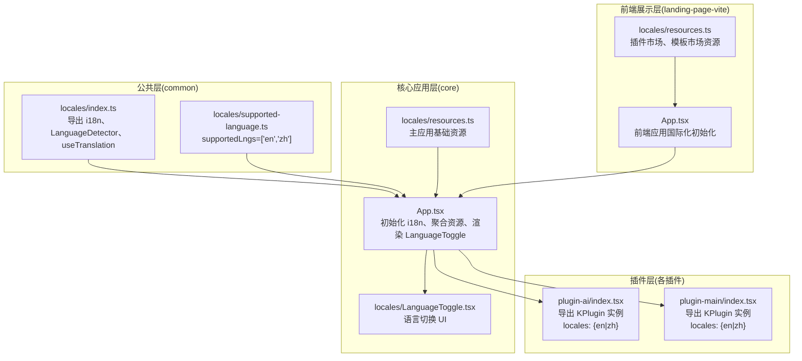
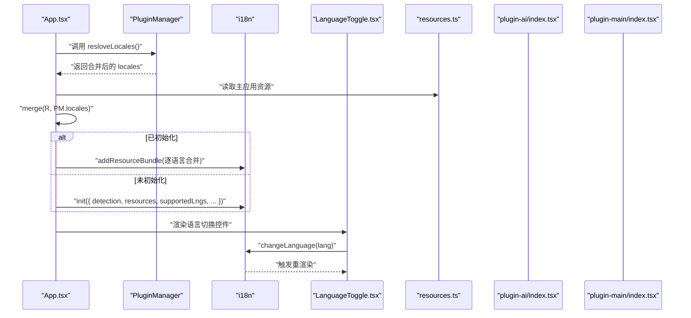
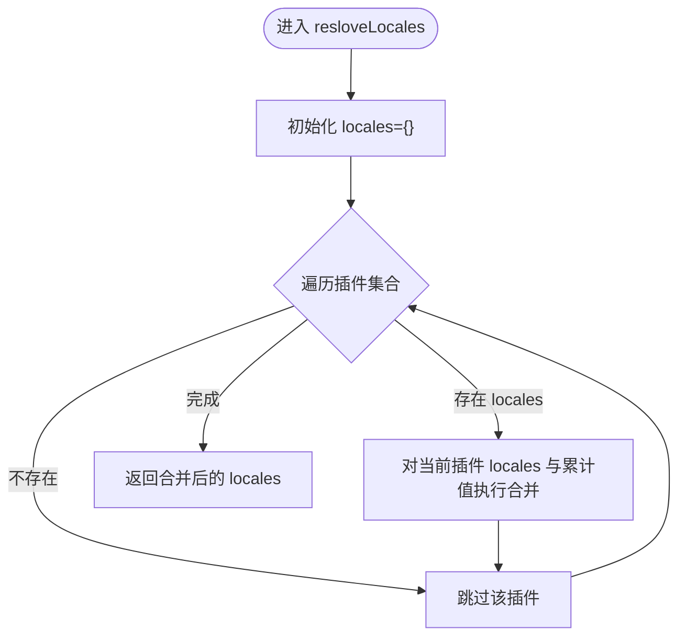
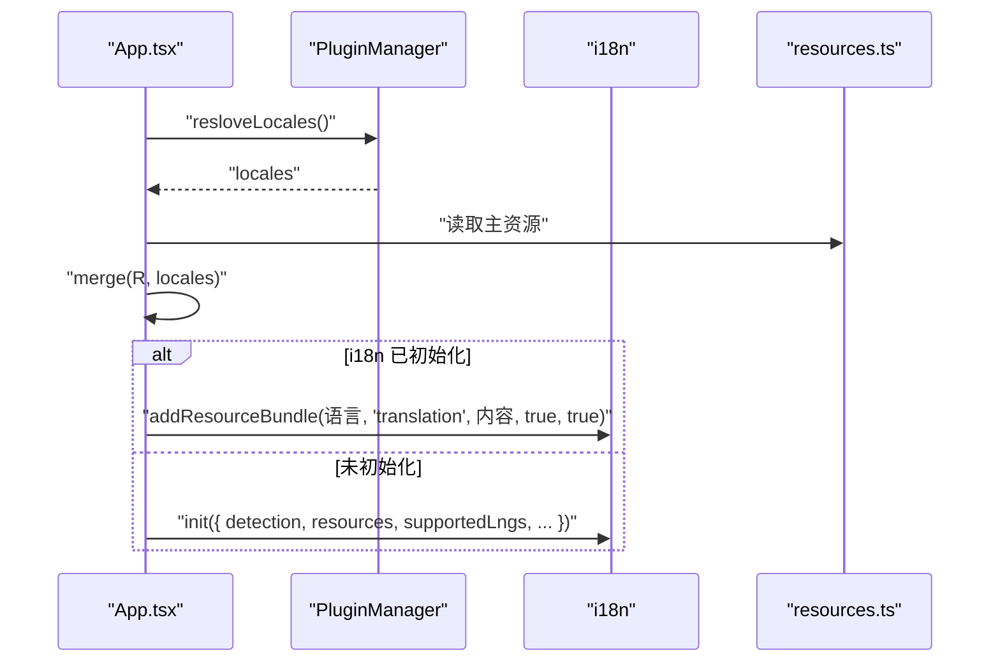
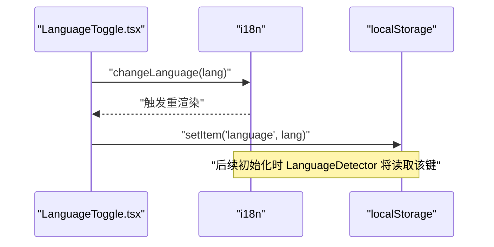
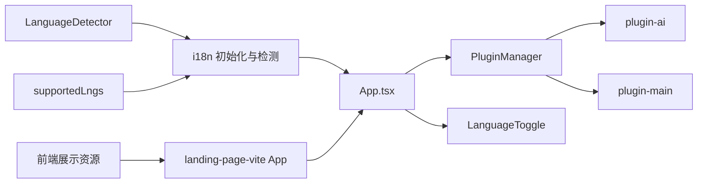

# 插件国际化系统

<cite>
**本文引用的文件**
- [packages/common/src/core/PluginManager.ts](file://packages/common/src/core/PluginManager.ts)
- [packages/common/src/locales/index.ts](file://packages/common/src/locales/index.ts)
- [packages/common/src/locales/supported-language.ts](file://packages/common/src/locales/supported-language.ts)
- [packages/core/src/App.tsx](file://packages/core/src/App.tsx)
- [packages/core/src/locales/resources.ts](file://packages/core/src/locales/resources.ts)
- [packages/core/src/locales/LanguageToggle.tsx](file://packages/core/src/locales/LanguageToggle.tsx)
- [packages/core/src/locales/zh.ts](file://packages/core/src/locales/zh.ts)
- [packages/plugin-ai/src/index.tsx](file://packages/plugin-ai/src/index.tsx)
- [packages/plugin-main/src/index.tsx](file://packages/plugin-main/src/index.tsx)
- [apps/landing-page-vite/src/locales/resources.ts](file://apps/landing-page-vite/src/locales/resources.ts)
- [apps/landing-page-vite/src/App.tsx](file://apps/landing-page-vite/src/App.tsx)
</cite>

## 更新摘要
**所做更改**
- 新增插件和模板生态系统的完整国际化支持
- 扩展182个翻译键，涵盖插件描述、模板分类、创作者权益、市场功能等
- 完善插件市场、模板市场、创作者权益等生态功能的多语言支持
- 增强插件上传、管理、发布的完整国际化流程

## 目录
1. [简介](#简介)
2. [项目结构](#项目结构)
3. [核心组件](#核心组件)
4. [架构总览](#架构总览)
5. [详细组件分析](#详细组件分析)
6. [插件生态系统国际化](#插件生态系统国际化)
7. [依赖关系分析](#依赖关系分析)
8. [性能考量](#性能考量)
9. [故障排查指南](#故障排查指南)
10. [结论](#结论)
11. [附录](#附录)

## 简介
本文件系统性梳理仓库中的"插件国际化系统"，围绕以下目标展开：
- 解释插件本地化的配置结构与多语言资源管理机制（locales 属性、资源文件组织）
- 深入说明 resolveLocales 方法的合并逻辑与资源优先级处理
- 阐述插件语言包的动态加载与切换机制
- 明确国际化资源的命名规范与文件结构要求
- 总结多语言支持的最佳实践与翻译工作流程
- 提供国际化系统的测试方法与质量保证策略
- **新增**：全面覆盖插件和模板生态系统的国际化支持，包括插件市场、模板市场、创作者权益等功能

## 项目结构
国际化能力由四层协同构成：
- 公共层（common）：提供 i18n 初始化、语言检测器、受支持语言列表等通用能力
- 核心应用层（core）：负责应用启动时聚合主资源与插件资源，初始化 i18n 并暴露语言切换 UI
- 插件层（各插件包）：在各自入口导出 KPlugin 实例，并通过 locales 字段声明多语言资源
- **新增**：前端展示层（landing-page-vite）：提供插件市场、模板市场等生态功能的国际化支持

```mermaid
graph TB
subgraph "公共层(common)"
LIdx["locales/index.ts<br/>导出 i18n、LanguageDetector、useTranslation"]
SLng["locales/supported-language.ts<br/>supportedLngs=['en','zh']"]
end
subgraph "核心应用层(core)"
App["App.tsx<br/>初始化 i18n、聚合资源、渲染 LanguageToggle"]
Rsrc["locales/resources.ts<br/>主应用基础资源"]
LangToggle["locales/LanguageToggle.tsx<br/>语言切换 UI"]
end
subgraph "插件层(各插件)"
P_AI["plugin-ai/index.tsx<br/>导出 KPlugin 实例<br/>locales: {en|zh}"]
P_Main["plugin-main/index.tsx<br/>导出 KPlugin 实例<br/>locales: {en|zh}"]
end
subgraph "前端展示层(landing-page-vite)"
LPResources["locales/resources.ts<br/>插件市场、模板市场资源"]
LPApp["App.tsx<br/>前端应用国际化初始化"]
end
LIdx --> App
SLng --> App
Rsrc --> App
App --> LangToggle
App --> P_AI
App --> P_Main
LPResources --> LPApp
LPApp --> App
```

**图表来源**
- [packages/common/src/locales/index.ts](file://packages/common/src/locales/index.ts#L1-L6)
- [packages/common/src/locales/supported-language.ts](file://packages/common/src/locales/supported-language.ts#L1-L2)
- [packages/core/src/App.tsx](file://packages/core/src/App.tsx#L73-L112)
- [packages/core/src/locales/resources.ts](file://packages/core/src/locales/resources.ts#L1-L598)
- [packages/core/src/locales/LanguageToggle.tsx](file://packages/core/src/locales/LanguageToggle.tsx#L1-L30)
- [packages/plugin-ai/src/index.tsx](file://packages/plugin-ai/src/index.tsx#L1-L81)
- [packages/plugin-main/src/index.tsx](file://packages/plugin-main/src/index.tsx#L27-L319)
- [apps/landing-page-vite/src/locales/resources.ts](file://apps/landing-page-vite/src/locales/resources.ts#L1-L444)
- [apps/landing-page-vite/src/App.tsx](file://apps/landing-page-vite/src/App.tsx#L1-L42)

**章节来源**
- [packages/common/src/locales/index.ts](file://packages/common/src/locales/index.ts#L1-L6)
- [packages/common/src/locales/supported-language.ts](file://packages/common/src/locales/supported-language.ts#L1-L2)
- [packages/core/src/App.tsx](file://packages/core/src/App.tsx#L73-L112)
- [packages/core/src/locales/resources.ts](file://packages/core/src/locales/resources.ts#L1-L598)
- [packages/core/src/locales/LanguageToggle.tsx](file://packages/core/src/locales/LanguageToggle.tsx#L1-L30)
- [packages/plugin-ai/src/index.tsx](file://packages/plugin-ai/src/index.tsx#L1-L81)
- [packages/plugin-main/src/index.tsx](file://packages/plugin-main/src/index.tsx#L27-L319)
- [apps/landing-page-vite/src/locales/resources.ts](file://apps/landing-page-vite/src/locales/resources.ts#L1-L444)
- [apps/landing-page-vite/src/App.tsx](file://apps/landing-page-vite/src/App.tsx#L1-L42)

## 核心组件
- PluginManager：统一管理插件生命周期与资源配置，提供 resolveLocales 聚合插件 locales
- i18n 初始化与语言检测：在应用启动阶段完成初始化，支持从本地存储读取语言偏好
- 语言切换 UI：提供下拉菜单切换语言，并持久化到本地存储
- 主应用资源与插件资源：主应用 resources 作为基线，插件资源通过合并覆盖
- **新增**：插件市场和模板市场的完整国际化支持，包括创作者权益、市场功能等

**章节来源**
- [packages/common/src/core/PluginManager.ts](file://packages/common/src/core/PluginManager.ts#L368-L382)
- [packages/core/src/App.tsx](file://packages/core/src/App.tsx#L73-L112)
- [packages/core/src/locales/LanguageToggle.tsx](file://packages/core/src/locales/LanguageToggle.tsx#L1-L30)
- [packages/core/src/locales/resources.ts](file://packages/core/src/locales/resources.ts#L1-L598)
- [packages/common/src/locales/index.ts](file://packages/common/src/locales/index.ts#L1-L6)
- [packages/common/src/locales/supported-language.ts](file://packages/common/src/locales/supported-language.ts#L1-L2)

## 架构总览
整体流程：应用启动 → 加载主资源 → 聚合插件资源 → 初始化 i18n → 渲染语言切换 UI → 运行期按需更新资源

```mermaid
sequenceDiagram
participant App as "App.tsx"
participant PM as "PluginManager"
participant I18N as "i18n"
participant UI as "LanguageToggle.tsx"
participant R as "resources.ts"
participant P1 as "plugin-ai/index.tsx"
participant P2 as "plugin-main/index.tsx"
App->>PM : "调用 resloveLocales()"
PM-->>App : "返回合并后的 locales"
App->>R : "读取主应用资源"
App->>App : "merge(R, PM.locales)"
alt 已初始化
App->>I18N : "addResourceBundle(逐语言合并)"
else 未初始化
App->>I18N : "init({ detection, resources, supportedLngs, ... })"
end
App->>UI : "渲染语言切换控件"
UI->>I18N : "changeLanguage(lang)"
I18N-->>UI : "触发重渲染"
```

**图表来源**
- [packages/core/src/App.tsx](file://packages/core/src/App.tsx#L73-L112)
- [packages/common/src/core/PluginManager.ts](file://packages/common/src/core/PluginManager.ts#L368-L382)
- [packages/core/src/locales/resources.ts](file://packages/core/src/locales/resources.ts#L1-L598)
- [packages/core/src/locales/LanguageToggle.tsx](file://packages/core/src/locales/LanguageToggle.tsx#L1-L30)
- [packages/plugin-ai/src/index.tsx](file://packages/plugin-ai/src/index.tsx#L1-L81)
- [packages/plugin-main/src/index.tsx](file://packages/plugin-main/src/index.tsx#L27-L319)

## 详细组件分析

### PluginManager 的 resolveLocales 合并与优先级
- 合并策略：对每个插件的 locales 执行深度合并，最终形成全局可用的多语言资源对象
- 优先级规则：后加入的插件资源会覆盖先前资源中同路径键值；同一插件内部以语言维度分隔，互不干扰
- 数据结构：locales 顶层为语言代码字符串，第二层固定为 translation 命名空间，第三层为键路径

```mermaid
flowchart TD
Start(["进入 resloveLocales"]) --> Init["初始化 locales={}"]
Init --> Loop{"遍历插件集合"}
Loop --> |存在 locales| Merge["对当前插件 locales 与累计值执行合并"]
Loop --> |不存在| Next["跳过该插件"]
Merge --> Next
Next --> Loop
Loop --> |完成| Return["返回合并后的 locales"]
```

**图表来源**
- [packages/common/src/core/PluginManager.ts](file://packages/common/src/core/PluginManager.ts#L368-L382)

**章节来源**
- [packages/common/src/core/PluginManager.ts](file://packages/common/src/core/PluginManager.ts#L368-L382)

### 应用启动时的资源聚合与初始化
- 资源来源：主应用 resources 与插件聚合后的 locales 通过合并生成最终资源集
- 初始化参数：启用语言检测器、设置回退语言、限定受支持语言、配置转义行为
- 运行期增量更新：若 i18n 已初始化，则逐语言向现有实例追加资源包

```mermaid
sequenceDiagram
participant App as "App.tsx"
participant PM as "PluginManager"
participant I18N as "i18n"
participant R as "resources.ts"
App->>PM : "resloveLocales()"
PM-->>App : "locales"
App->>R : "读取主资源"
App->>App : "merge(R, locales)"
alt i18n 已初始化
App->>I18N : "addResourceBundle(语言, 'translation', 内容, true, true)"
else 未初始化
App->>I18N : "init({ detection, resources, supportedLngs, ... })"
end
```

**图表来源**
- [packages/core/src/App.tsx](file://packages/core/src/App.tsx#L73-L112)
- [packages/core/src/locales/resources.ts](file://packages/core/src/locales/resources.ts#L1-L598)
- [packages/common/src/locales/index.ts](file://packages/common/src/locales/index.ts#L1-L6)
- [packages/common/src/locales/supported-language.ts](file://packages/common/src/locales/supported-language.ts#L1-L2)

**章节来源**
- [packages/core/src/App.tsx](file://packages/core/src/App.tsx#L73-L112)
- [packages/core/src/locales/resources.ts](file://packages/core/src/locales/resources.ts#L1-L598)
- [packages/common/src/locales/index.ts](file://packages/common/src/locales/index.ts#L1-L6)
- [packages/common/src/locales/supported-language.ts](file://packages/common/src/locales/supported-language.ts#L1-L2)

### 语言切换与本地存储
- 切换机制：LanguageToggle 使用 useTranslation 获取 i18n 实例，点击项调用 changeLanguage 并将语言写入本地存储
- 检测顺序：i18n 初始化时配置了从本地存储读取语言偏好的检测器

```mermaid
sequenceDiagram
participant UI as "LanguageToggle.tsx"
participant I18N as "i18n"
participant Store as "localStorage"
UI->>I18N : "changeLanguage(lang)"
I18N-->>UI : "触发重渲染"
UI->>Store : "setItem('language', lang)"
Note over I18N,Store : "后续初始化时 LanguageDetector 将读取该键"
```

**图表来源**
- [packages/core/src/locales/LanguageToggle.tsx](file://packages/core/src/locales/LanguageToggle.tsx#L1-L30)
- [packages/common/src/locales/index.ts](file://packages/common/src/locales/index.ts#L1-L6)

**章节来源**
- [packages/core/src/locales/LanguageToggle.tsx](file://packages/core/src/locales/LanguageToggle.tsx#L1-L30)
- [packages/common/src/locales/index.ts](file://packages/common/src/locales/index.ts#L1-L6)

### 插件资源声明与组织
- 插件入口导出 KPlugin 实例，并在 config 中提供 locales 字段
- 语言层级：顶层为语言代码字符串（如 en、zh），第二层为 translation 命名空间，第三层为键路径
- 示例：AI 插件与主插件均在 locales 中提供 en/zh 两套键值

```mermaid
classDiagram
class KPlugin {
+name : string
+routes
+editorExtensions
+menus
+locales
+services
}
class PluginManager {
+plugins : KPlugin[]
+resloveLocales() any
+resloveRoutes() RouteConfig[]
}
class PluginAI {
+locales : {en|zh}
}
class PluginMain {
+locales : {en|zh}
}
PluginManager --> KPlugin : "聚合"
PluginAI --> KPlugin : "继承/使用"
PluginMain --> KPlugin : "继承/使用"
```

**图表来源**
- [packages/common/src/core/PluginManager.ts](file://packages/common/src/core/PluginManager.ts#L20-L28)
- [packages/common/src/core/PluginManager.ts](file://packages/common/src/core/PluginManager.ts#L368-L382)
- [packages/plugin-ai/src/index.tsx](file://packages/plugin-ai/src/index.tsx#L26-L81)
- [packages/plugin-main/src/index.tsx](file://packages/plugin-main/src/index.tsx#L27-L319)

**章节来源**
- [packages/plugin-ai/src/index.tsx](file://packages/plugin-ai/src/index.tsx#L26-L81)
- [packages/plugin-main/src/index.tsx](file://packages/plugin-main/src/index.tsx#L27-L319)
- [packages/common/src/core/PluginManager.ts](file://packages/common/src/core/PluginManager.ts#L20-L28)

## 插件生态系统国际化

### 插件市场国际化支持
插件市场功能包含完整的多语言支持，涵盖插件描述、分类、功能介绍、上传发布等全流程：

- **插件描述**：支持插件名称、描述、版本、分类标签等多语言展示
- **功能介绍**：提供功能特性、使用说明、更新日志等多语言内容
- **上传发布**：完整的插件发布流程，包括基本信息填写、功能介绍、文件上传等
- **市场展示**：插件列表、搜索、分类筛选、排序等功能的多语言支持

**章节来源**
- [packages/core/src/locales/resources.ts](file://packages/core/src/locales/resources.ts#L55-L162)
- [apps/landing-page-vite/src/locales/resources.ts](file://apps/landing-page-vite/src/locales/resources.ts#L150-L184)

### 模板市场国际化支持
模板市场提供丰富的模板分类和创作者权益支持：

- **模板分类**：涵盖效率、工作、个人、学习、健康、财务等多个分类
- **模板描述**：模板名称、描述、使用统计等多语言展示
- **创作者权益**：模板创作者的展示、收益、社区参与等功能
- **市场功能**：模板搜索、预览、使用、请求等功能的国际化

**章节来源**
- [apps/landing-page-vite/src/locales/resources.ts](file://apps/landing-page-vite/src/locales/resources.ts#L185-L220)

### 创作者权益国际化
为插件和模板创作者提供完整的权益保障和展示机会：

- **创作者展示**：在插件库和模板库中获得精选展示机会
- **收益分成**：通过插件和模板销售获得收益分成
- **社区参与**：加入活跃的开发者和模板创作者社区
- **创作者引导**：提供成为创作者的完整流程指导

**章节来源**
- [apps/landing-page-vite/src/locales/resources.ts](file://apps/landing-page-vite/src/locales/resources.ts#L398-L404)
- [apps/landing-page-vite/src/locales/resources.ts](file://apps/landing-page-vite/src/locales/resources.ts#L434-L440)

### 插件上传和管理国际化
提供完整的插件开发和管理工具的多语言支持：

- **上传界面**：插件基本信息、功能介绍、文件上传等界面
- **管理功能**：插件状态管理、版本发布、设置配置等功能
- **验证提示**：表单验证、错误提示、操作反馈等多语言支持
- **批量操作**：批量启用、禁用、删除等操作的国际化

**章节来源**
- [packages/core/src/locales/resources.ts](file://packages/core/src/locales/resources.ts#L163-L242)

## 依赖关系分析
- 公共层依赖：i18next、i18next-browser-languagedetector、react-i18next
- 核心应用依赖：公共层提供的 i18n、LanguageDetector、supportedLngs
- 插件依赖：公共层提供的 KPlugin 类型与 PluginManager 能力
- **新增**：前端展示层依赖：插件市场、模板市场的完整资源支持
- 关键耦合点：resolveLocales 与 merge 的组合决定资源合并与覆盖规则

```mermaid
graph LR
I18N["i18n 初始化与检测"] --> App["App.tsx"]
Detector["LanguageDetector"] --> I18N
SL["supportedLngs"] --> I18N
App --> PM["PluginManager"]
PM --> P_AI["plugin-ai"]
PM --> P_Main["plugin-main"]
App --> UI["LanguageToggle"]
LPResources["前端展示资源"] --> LPApp["landing-page-vite App"]
LPApp --> App
```

**图表来源**
- [packages/common/src/locales/index.ts](file://packages/common/src/locales/index.ts#L1-L6)
- [packages/common/src/locales/supported-language.ts](file://packages/common/src/locales/supported-language.ts#L1-L2)
- [packages/core/src/App.tsx](file://packages/core/src/App.tsx#L73-L112)
- [packages/common/src/core/PluginManager.ts](file://packages/common/src/core/PluginManager.ts#L368-L382)
- [packages/plugin-ai/src/index.tsx](file://packages/plugin-ai/src/index.tsx#L1-L81)
- [packages/plugin-main/src/index.tsx](file://packages/plugin-main/src/index.tsx#L27-L319)
- [apps/landing-page-vite/src/App.tsx](file://apps/landing-page-vite/src/App.tsx#L1-L42)

**章节来源**
- [packages/common/src/locales/index.ts](file://packages/common/src/locales/index.ts#L1-L6)
- [packages/common/src/locales/supported-language.ts](file://packages/common/src/locales/supported-language.ts#L1-L2)
- [packages/core/src/App.tsx](file://packages/core/src/App.tsx#L73-L112)
- [packages/common/src/core/PluginManager.ts](file://packages/common/src/core/PluginManager.ts#L368-L382)
- [packages/plugin-ai/src/index.tsx](file://packages/plugin-ai/src/index.tsx#L1-L81)
- [packages/plugin-main/src/index.tsx](file://packages/plugin-main/src/index.tsx#L27-L319)
- [apps/landing-page-vite/src/App.tsx](file://apps/landing-page-vite/src/App.tsx#L1-L42)

## 性能考量
- 合并成本：resolveLocales 对每个插件执行合并，插件数量较多时建议控制资源体量与层级深度
- 运行期增量更新：已初始化实例采用 addResourceBundle 追加资源，避免重复初始化带来的开销
- 语言检测：本地存储读取成本极低，建议保持检测器配置简洁
- 资源体积：建议拆分大型命名空间，按页面或功能模块划分，减少不必要的热更新范围
- **新增**：前端展示资源优化：插件市场和模板市场的资源按需加载，减少初始包体积

## 故障排查指南
- 语言未生效
  - 检查 LanguageToggle 是否正确调用 changeLanguage，并将语言写入本地存储
  - 确认 i18n 初始化时 supportedLngs 包含目标语言
  - 参考路径：[packages/core/src/locales/LanguageToggle.tsx](file://packages/core/src/locales/LanguageToggle.tsx#L1-L30)，[packages/common/src/locales/supported-language.ts](file://packages/common/src/locales/supported-language.ts#L1-L2)
- 资源未合并
  - 确认插件入口已导出 KPlugin 实例且 locales 结构正确
  - 确认 resolveLocales 返回值被用于 merge 与初始化
  - 参考路径：[packages/common/src/core/PluginManager.ts](file://packages/common/src/core/PluginManager.ts#L368-L382)，[packages/plugin-ai/src/index.tsx](file://packages/plugin-ai/src/index.tsx#L26-L81)，[packages/plugin-main/src/index.tsx](file://packages/plugin-main/src/index.tsx#L27-L319)
- 回退语言不符合预期
  - 检查 i18n 初始化时 fallbackLng 设置
  - 参考路径：[packages/core/src/App.tsx](file://packages/core/src/App.tsx#L73-L112)
- 重复键冲突
  - 合并策略为后入覆盖先入，确保插件间键路径不冲突或明确覆盖意图
  - 参考路径：[packages/common/src/core/PluginManager.ts](file://packages/common/src/core/PluginManager.ts#L368-L382)
- **新增**：插件市场资源缺失
  - 检查前端展示层的 resources.ts 文件是否包含插件市场相关键值
  - 确认插件上传、管理功能的国际化键值完整
  - 参考路径：[apps/landing-page-vite/src/locales/resources.ts](file://apps/landing-page-vite/src/locales/resources.ts#L150-L184)，[packages/core/src/locales/resources.ts](file://packages/core/src/locales/resources.ts#L163-L242)

**章节来源**
- [packages/core/src/locales/LanguageToggle.tsx](file://packages/core/src/locales/LanguageToggle.tsx#L1-L30)
- [packages/common/src/locales/supported-language.ts](file://packages/common/src/locales/supported-language.ts#L1-L2)
- [packages/common/src/core/PluginManager.ts](file://packages/common/src/core/PluginManager.ts#L368-L382)
- [packages/plugin-ai/src/index.tsx](file://packages/plugin-ai/src/index.tsx#L26-L81)
- [packages/plugin-main/src/index.tsx](file://packages/plugin-main/src/index.tsx#L27-L319)
- [packages/core/src/App.tsx](file://packages/core/src/App.tsx#L73-L112)
- [apps/landing-page-vite/src/locales/resources.ts](file://apps/landing-page-vite/src/locales/resources.ts#L150-L184)
- [packages/core/src/locales/resources.ts](file://packages/core/src/locales/resources.ts#L163-L242)

## 结论
本国际化系统通过公共层提供 i18n 能力、核心应用层完成资源聚合与初始化、插件层以 KPlugin 的 locales 字段贡献多语言资源，形成"集中初始化、分散贡献、运行期增量"的架构。**重大扩展后**，系统现已全面支持插件和模板生态系统，包括插件市场、模板市场、创作者权益等完整功能的国际化，覆盖182个新增翻译键，为用户提供从插件开发到使用的全链路多语言体验。

## 附录

### 国际化资源命名规范与文件结构
- 顶层语言代码：'en'、'zh'
- 第二层命名空间：'translation'
- 第三层键路径：按功能域/页面划分，避免冲突
- **新增**：插件市场和模板市场专用命名空间，如 'plugins'、'templates'、'marketplace'
- 示例参考：
  - 主应用资源：[packages/core/src/locales/resources.ts](file://packages/core/src/locales/resources.ts#L1-L598)
  - 插件资源（AI）：[packages/plugin-ai/src/index.tsx](file://packages/plugin-ai/src/index.tsx#L37-L81)
  - 插件资源（主插件）：[packages/plugin-main/src/index.tsx](file://packages/plugin-main/src/index.tsx#L72-L319)
  - **新增**：前端展示资源：[apps/landing-page-vite/src/locales/resources.ts](file://apps/landing-page-vite/src/locales/resources.ts#L1-L444)

**章节来源**
- [packages/core/src/locales/resources.ts](file://packages/core/src/locales/resources.ts#L1-L598)
- [packages/plugin-ai/src/index.tsx](file://packages/plugin-ai/src/index.tsx#L37-L81)
- [packages/plugin-main/src/index.tsx](file://packages/plugin-main/src/index.tsx#L72-L319)
- [apps/landing-page-vite/src/locales/resources.ts](file://apps/landing-page-vite/src/locales/resources.ts#L1-L444)

### 多语言支持最佳实践与翻译工作流程
- 规范化键设计：按页面/功能域分层，避免深层嵌套导致维护困难
- 一致性：统一命名空间与键路径风格，便于自动化工具处理
- 版本化：在插件版本升级时评估键变更，必要时提供迁移策略
- 测试：在新增语言或修改键时进行回归测试，确保 UI 正常渲染
- 文档：为翻译人员提供键清单与上下文说明，减少歧义
- **新增**：生态功能国际化：插件市场、模板市场、创作者权益等功能需统一翻译风格和术语

### 国际化系统的测试方法与质量保证
- 单元测试：验证 resolveLocales 的合并结果与优先级
- 集成测试：模拟应用启动流程，验证 i18n 初始化与资源注入
- 端到端测试：验证 LanguageToggle 的切换、本地存储持久化与 UI 重渲染
- 质量门禁：在 CI 中增加 i18n 覆盖率检查与键冲突扫描
- **新增**：生态功能测试：验证插件市场、模板市场的多语言展示和交互功能
- **新增**：跨层测试：确保插件、核心应用、前端展示层的国际化资源一致性

### 插件生态系统国际化扩展要点
- **键值规划**：为插件市场、模板市场、创作者权益等新增功能设计专门的键值命名空间
- **内容一致性**：确保插件描述、模板分类、市场功能等的翻译风格统一
- **用户体验**：关注插件上传、管理、发布的完整流程的多语言支持
- **社区参与**：为创作者和用户提供清晰的国际化指引和帮助文档