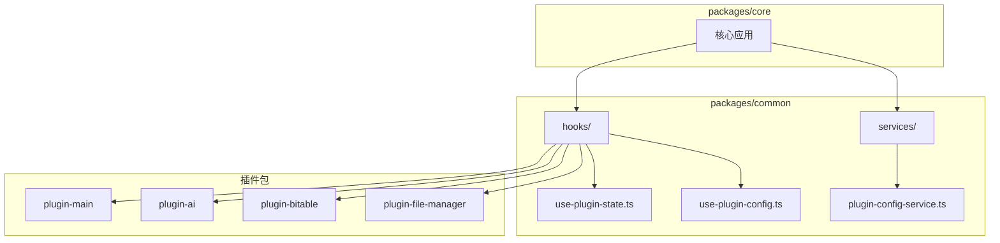
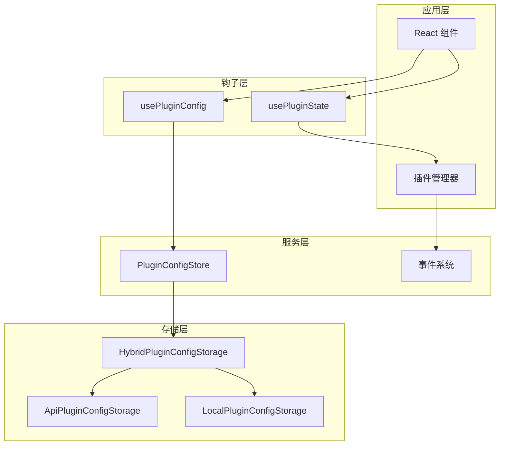
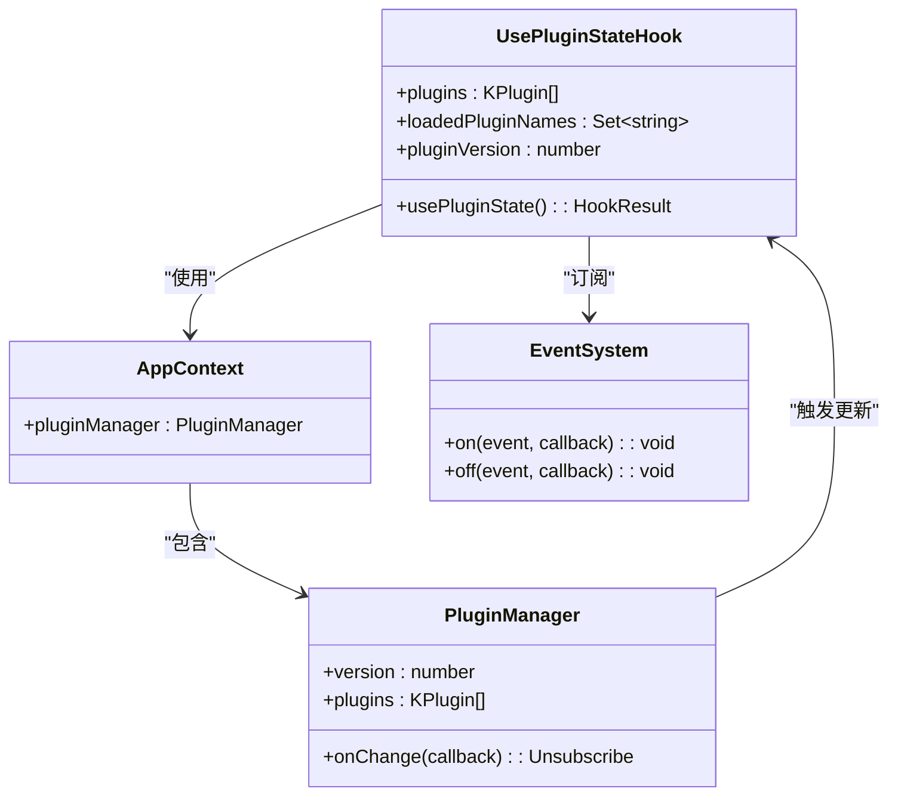
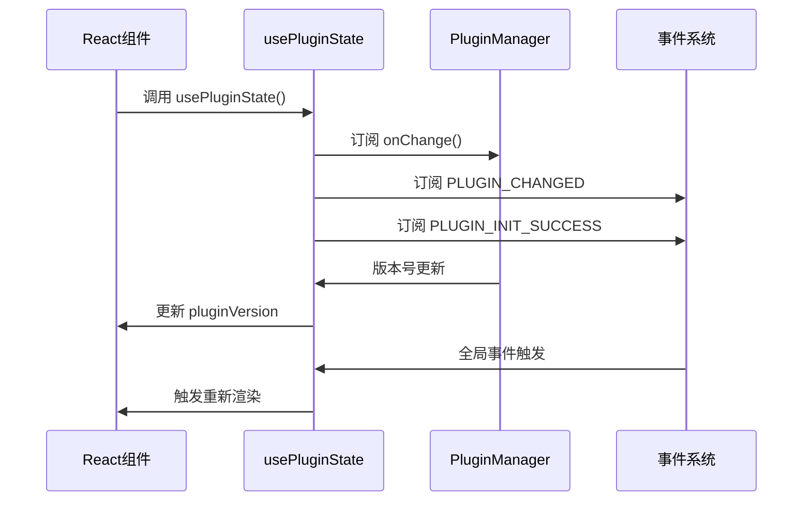
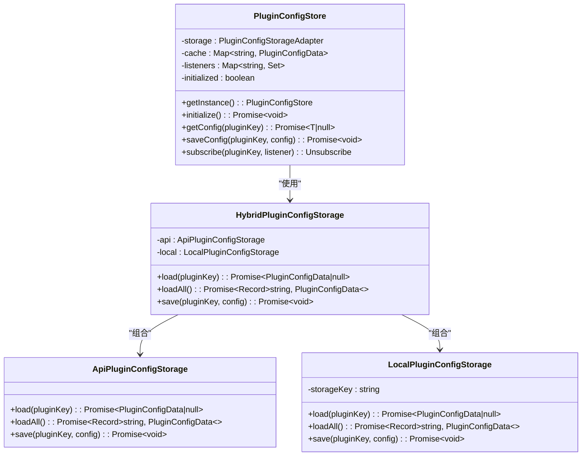
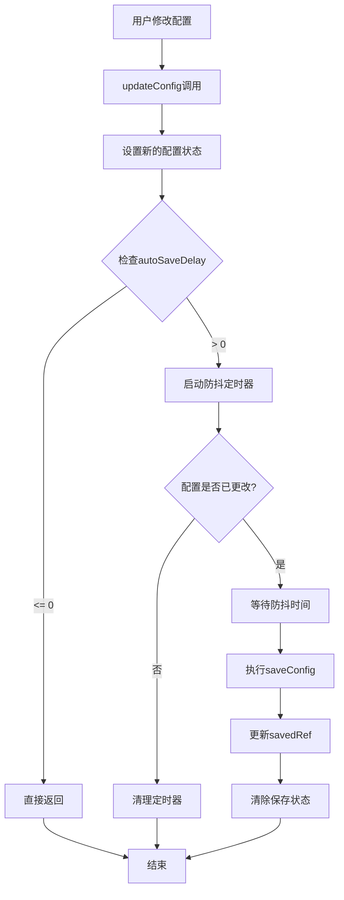
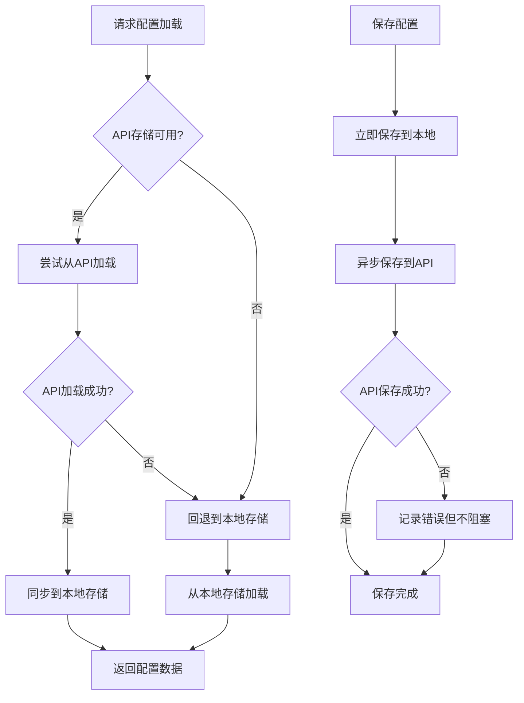
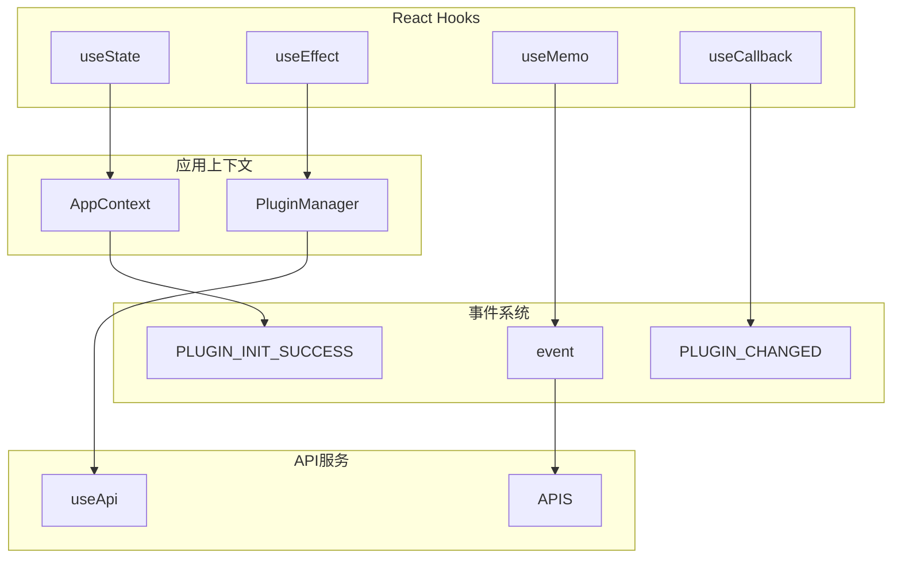

# 插件状态钩子

<cite>
**本文档引用的文件**
- [use-plugin-state.ts](file://packages/common/src/hooks/use-plugin-state.ts)
- [use-plugin-config.ts](file://packages/common/src/hooks/use-plugin-config.ts)
- [plugin-config-service.ts](file://packages/common/src/services/plugin-config-service.ts)
- [package.json](file://packages/common/package.json)
- [package.json](file://packages/core/package.json)
</cite>

## 目录
1. [简介](#简介)
2. [项目结构](#项目结构)
3. [核心组件](#核心组件)
4. [架构概览](#架构概览)
5. [详细组件分析](#详细组件分析)
6. [依赖关系分析](#依赖关系分析)
7. [性能考虑](#性能考虑)
8. [故障排除指南](#故障排除指南)
9. [结论](#结论)

## 简介

插件状态钩子是知识库项目中用于管理和跟踪插件生命周期状态的关键组件。该系统提供了两个核心钩子：`usePluginState` 和 `usePluginConfig`，它们分别负责插件实例状态的跟踪和插件配置的持久化管理。

该项目采用现代化的 React Hooks 架构，通过事件驱动的方式实现插件状态的实时更新。系统支持插件的动态加载、卸载和配置管理，为构建可扩展的知识管理平台提供了强大的基础设施。

## 项目结构

知识库项目采用 Monorepo 架构，插件状态钩子位于 `packages/common` 包中，这是整个插件生态系统的核心模块。

**图表来源**
- [use-plugin-state.ts:1-60](file://packages/common/src/hooks/use-plugin-state.ts#L1-L60)
- [use-plugin-config.ts:1-140](file://packages/common/src/hooks/use-plugin-config.ts#L1-L140)
- [plugin-config-service.ts:1-241](file://packages/common/src/services/plugin-config-service.ts#L1-L241)

**章节来源**
- [package.json:1-56](file://packages/common/package.json#L1-L56)
- [package.json:1-43](file://packages/core/package.json#L1-L43)

## 核心组件

### usePluginState 钩子

`usePluginState` 是一个专门设计的 React Hook，用于跟踪插件系统的整体状态变化。它提供了三个关键属性：

- **plugins**: 当前加载的所有 KPlugin 实例数组
- **loadedPluginNames**: 当前运行时中插件名称的 Set 集合  
- **pluginVersion**: 每次插件变更时递增的计数器

该钩子通过订阅 PluginManager 的内部可观测对象和全局事件来实现自动更新机制。

### usePluginConfig 钩子

`usePluginConfig` 提供了完整的插件配置管理解决方案，包括：

- **配置加载**: 从混合存储中异步加载插件配置
- **实时编辑**: 支持表单状态的实时更新
- **自动保存**: 可配置的防抖自动保存机制
- **冲突处理**: 处理多标签页间的配置同步
- **错误处理**: 完善的保存错误反馈机制

**章节来源**
- [use-plugin-state.ts:1-60](file://packages/common/src/hooks/use-plugin-state.ts#L1-L60)
- [use-plugin-config.ts:1-140](file://packages/common/src/hooks/use-plugin-config.ts#L1-L140)

## 架构概览

插件状态钩子系统采用分层架构设计，确保了良好的可维护性和扩展性。

**图表来源**
- [use-plugin-state.ts:23-46](file://packages/common/src/hooks/use-plugin-state.ts#L23-L46)
- [use-plugin-config.ts:32-84](file://packages/common/src/hooks/use-plugin-config.ts#L32-L84)
- [plugin-config-service.ts:166-240](file://packages/common/src/services/plugin-config-service.ts#L166-L240)

## 详细组件分析

### usePluginState 组件分析

#### 类图展示

**图表来源**
- [use-plugin-state.ts:18-58](file://packages/common/src/hooks/use-plugin-state.ts#L18-L58)

#### 工作流程序列图

**图表来源**
- [use-plugin-state.ts:26-46](file://packages/common/src/hooks/use-plugin-state.ts#L26-L46)

**章节来源**
- [use-plugin-state.ts:1-60](file://packages/common/src/hooks/use-plugin-state.ts#L1-L60)

### usePluginConfig 组件分析

#### 配置存储架构

**图表来源**
- [plugin-config-service.ts:166-240](file://packages/common/src/services/plugin-config-service.ts#L166-L240)
- [plugin-config-service.ts:117-162](file://packages/common/src/services/plugin-config-service.ts#L117-L162)

#### 自动保存流程

**图表来源**
- [use-plugin-config.ts:106-130](file://packages/common/src/hooks/use-plugin-config.ts#L106-L130)
- [use-plugin-config.ts:90-103](file://packages/common/src/hooks/use-plugin-config.ts#L90-L103)

**章节来源**
- [use-plugin-config.ts:1-140](file://packages/common/src/hooks/use-plugin-config.ts#L1-L140)
- [plugin-config-service.ts:1-241](file://packages/common/src/services/plugin-config-service.ts#L1-L241)

### 混合存储策略

系统实现了智能的混合存储策略，确保配置数据的可靠性和一致性：

**图表来源**
- [plugin-config-service.ts:126-161](file://packages/common/src/services/plugin-config-service.ts#L126-L161)

**章节来源**
- [plugin-config-service.ts:117-162](file://packages/common/src/services/plugin-config-service.ts#L117-L162)

## 依赖关系分析

### 核心依赖关系

**图表来源**
- [use-plugin-state.ts:1-60](file://packages/common/src/hooks/use-plugin-state.ts#L1-L60)
- [use-plugin-config.ts:1-140](file://packages/common/src/hooks/use-plugin-config.ts#L1-L140)

### 插件生态系统集成

系统与多个插件包紧密集成，形成完整的插件生态：

| 插件包 | 功能特性 | 集成方式 |
|--------|----------|----------|
| plugin-main | 核心应用功能 | 基础插件，提供导航和主界面 |
| plugin-ai | AI文本生成和图像创建 | 高级AI功能集成 |
| plugin-bitable | 多维表格视图 | 数据管理和可视化 |
| plugin-file-manager | 文件组织系统 | 文档和资源管理 |

**章节来源**
- [package.json:17-43](file://packages/common/package.json#L17-L43)
- [package.json:17-34](file://packages/core/package.json#L17-L34)

## 性能考虑

### 内存优化策略

1. **懒加载机制**: 插件配置采用按需加载，避免不必要的内存占用
2. **缓存策略**: 使用 Map 缓存已加载的配置，减少重复请求
3. **防抖优化**: 自动保存功能使用防抖技术，避免频繁的网络请求

### 并发处理

系统通过以下机制处理并发场景：
- **事件去重**: 同一事件的多次触发会被合并处理
- **取消机制**: 组件卸载时自动清理所有订阅和定时器
- **错误隔离**: 单个插件的错误不会影响其他插件的正常运行

## 故障排除指南

### 常见问题及解决方案

#### 插件状态不更新

**症状**: 插件加载后状态没有反映到 UI 中

**排查步骤**:
1. 检查插件管理器是否正确初始化
2. 验证事件监听器是否正常注册
3. 确认插件版本号是否递增

#### 配置保存失败

**症状**: 修改的配置无法持久化保存

**排查步骤**:
1. 检查网络连接状态
2. 验证 API 端点是否可达
3. 查看浏览器控制台的错误信息

#### 内存泄漏问题

**症状**: 应用运行时间越长内存占用越高

**排查步骤**:
1. 检查 useEffect 返回的清理函数是否正确实现
2. 验证所有事件监听器是否在组件卸载时移除
3. 确认定时器是否正确清理

**章节来源**
- [use-plugin-state.ts:41-46](file://packages/common/src/hooks/use-plugin-state.ts#L41-L46)
- [use-plugin-config.ts:79-84](file://packages/common/src/hooks/use-plugin-config.ts#L79-L84)

## 结论

插件状态钩子系统为知识库项目提供了强大而灵活的插件管理能力。通过精心设计的架构和完善的错误处理机制，该系统能够：

- **实时响应**: 通过事件驱动机制实现实时状态更新
- **可靠持久化**: 采用混合存储策略确保配置数据的安全性
- **高性能**: 通过缓存和防抖等优化技术提升用户体验
- **可扩展**: 模块化的架构设计便于新功能的添加和维护

该系统不仅满足了当前的知识管理需求，还为未来的功能扩展奠定了坚实的基础。其清晰的代码结构和完善的文档说明使得开发者能够轻松理解和使用这些核心组件。