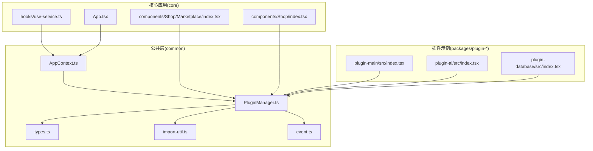
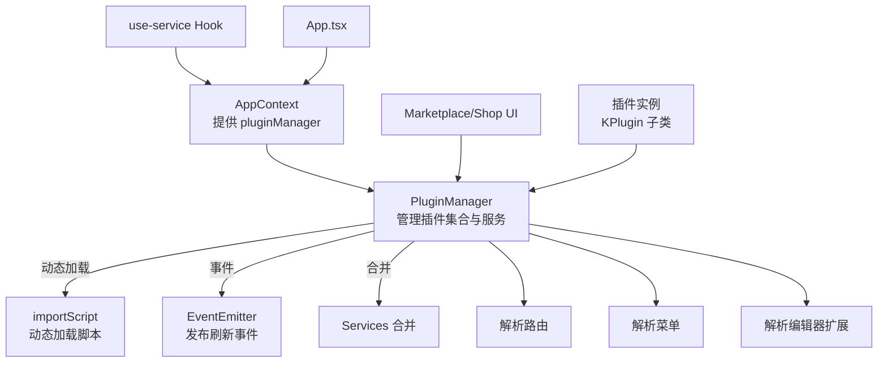
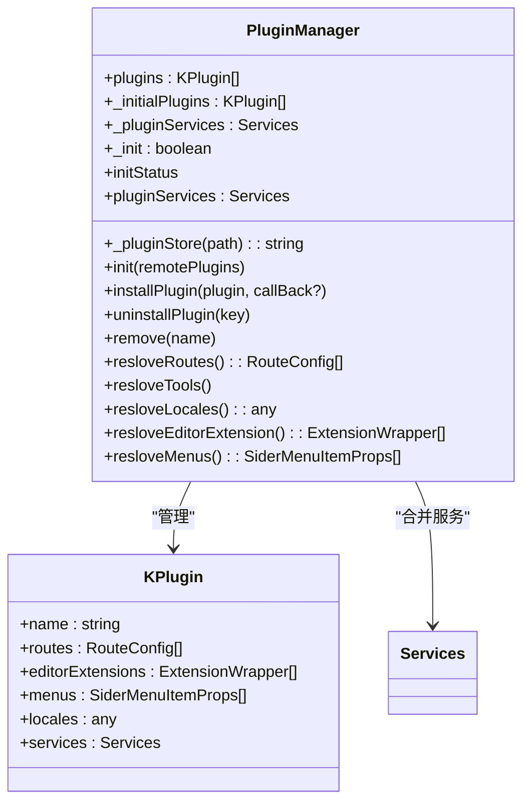
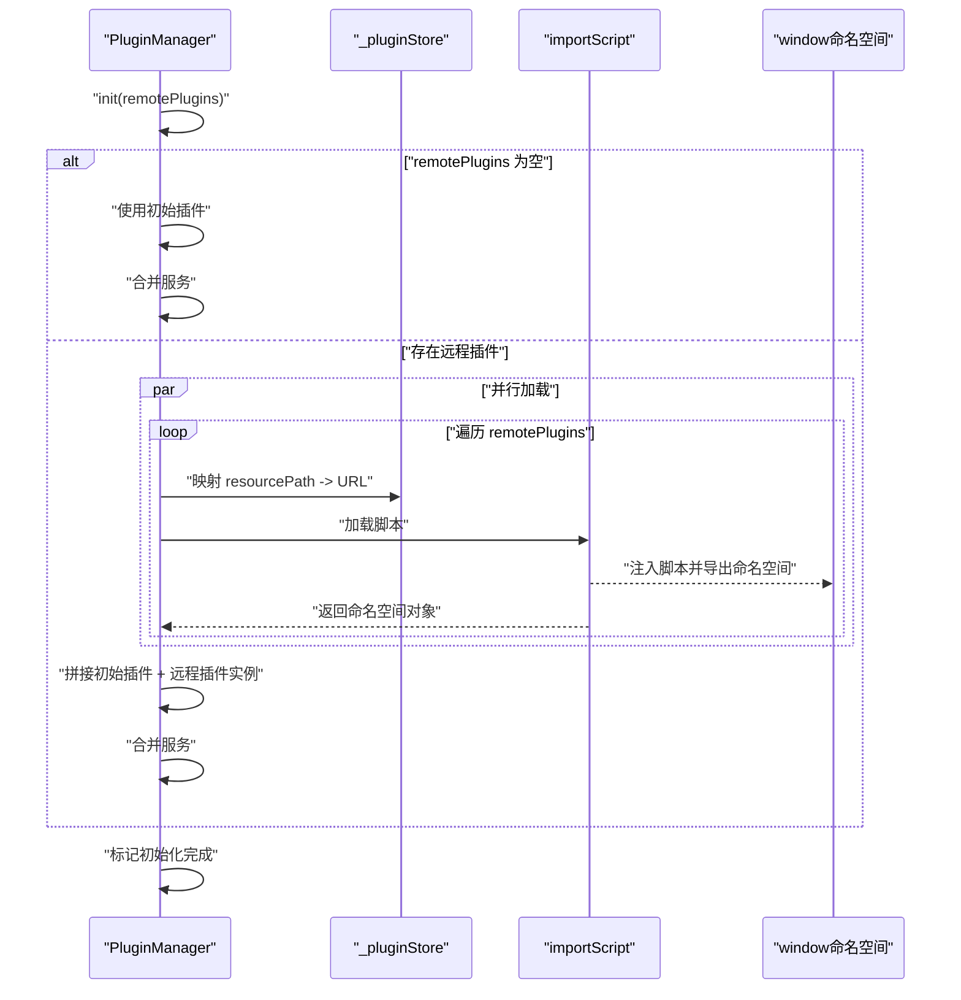
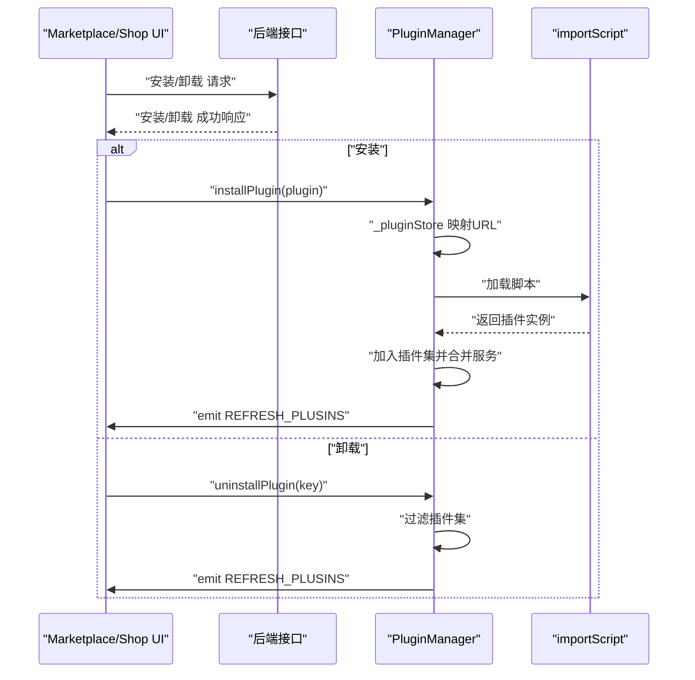
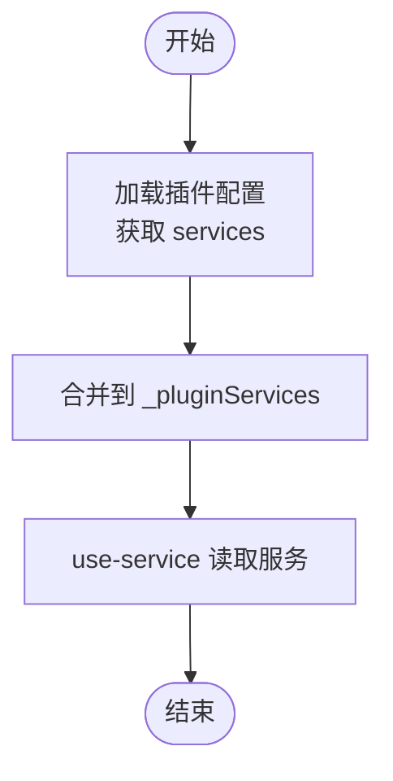
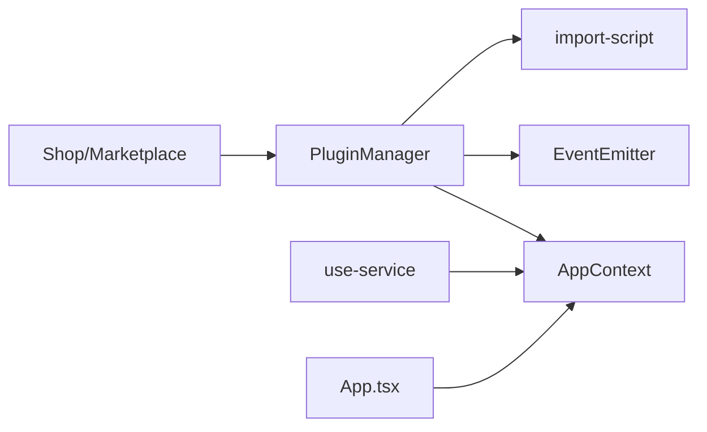

# 插件管理器核心

<cite>
**本文引用的文件**
- [packages/common/src/core/PluginManager.ts](file://packages/common/src/core/PluginManager.ts)
- [packages/common/src/core/types.ts](file://packages/common/src/core/types.ts)
- [packages/common/src/core/AppContext.ts](file://packages/common/src/core/AppContext.ts)
- [packages/common/src/utils/import-util.ts](file://packages/common/src/utils/import-util.ts)
- [packages/common/src/event/event.ts](file://packages/common/src/event/event.ts)
- [packages/core/src/hooks/use-service.ts](file://packages/core/src/hooks/use-service.ts)
- [packages/core/src/App.tsx](file://packages/core/src/App.tsx)
- [packages/plugin-main/src/index.tsx](file://packages/plugin-main/src/index.tsx)
- [packages/plugin-ai/src/index.tsx](file://packages/plugin-ai/src/index.tsx)
- [packages/plugin-database/src/index.tsx](file://packages/plugin-database/src/index.tsx)
- [packages/core/src/components/Shop/Marketplace/index.tsx](file://packages/core/src/components/Shop/Marketplace/index.tsx)
- [packages/core/src/components/Shop/index.tsx](file://packages/core/src/components/Shop/index.tsx)
</cite>

## 目录
1. [引言](#引言)
2. [项目结构](#项目结构)
3. [核心组件](#核心组件)
4. [架构总览](#架构总览)
5. [详细组件分析](#详细组件分析)
6. [依赖关系分析](#依赖关系分析)
7. [性能考虑](#性能考虑)
8. [故障排查指南](#故障排查指南)
9. [结论](#结论)
10. [附录](#附录)

## 引言
本文件聚焦于插件管理器核心组件，系统性阐述 PluginManager 类的设计与实现，覆盖以下主题：
- 插件初始化流程与动态加载机制
- 插件安装与卸载的实现原理（含远程插件与本地插件）
- 插件服务的注册与合并策略
- 插件实例创建过程与错误处理
- 插件状态管理与事件通知机制
- 最佳实践与性能优化建议

## 项目结构
围绕插件管理器的关键文件分布如下：
- 核心定义：PluginManager、KPlugin、类型与上下文
- 动态加载工具：importScript
- 事件系统：EventEmitter
- 使用方：React Hook use-service、应用入口 App.tsx
- 插件示例：plugin-main、plugin-ai、plugin-database
- 市场与卸载交互：Shop/Marketplace 组件

图表来源
- [packages/common/src/core/PluginManager.ts](file://packages/common/src/core/PluginManager.ts#L63-L170)
- [packages/common/src/utils/import-util.ts](file://packages/common/src/utils/import-util.ts#L1-L23)
- [packages/common/src/event/event.ts](file://packages/common/src/event/event.ts#L1-L44)
- [packages/common/src/core/types.ts](file://packages/common/src/core/types.ts#L1-L4)
- [packages/common/src/core/AppContext.ts](file://packages/common/src/core/AppContext.ts#L1-L13)
- [packages/core/src/hooks/use-service.ts](file://packages/core/src/hooks/use-service.ts#L1-L15)
- [packages/core/src/App.tsx](file://packages/core/src/App.tsx#L158-L187)
- [packages/core/src/components/Shop/Marketplace/index.tsx](file://packages/core/src/components/Shop/Marketplace/index.tsx#L33-L61)
- [packages/core/src/components/Shop/index.tsx](file://packages/core/src/components/Shop/index.tsx#L110-L210)
- [packages/plugin-main/src/index.tsx](file://packages/plugin-main/src/index.tsx#L1-L118)
- [packages/plugin-ai/src/index.tsx](file://packages/plugin-ai/src/index.tsx#L1-L35)
- [packages/plugin-database/src/index.tsx](file://packages/plugin-database/src/index.tsx#L1-L17)

章节来源
- [packages/common/src/core/PluginManager.ts](file://packages/common/src/core/PluginManager.ts#L63-L170)
- [packages/common/src/utils/import-util.ts](file://packages/common/src/utils/import-util.ts#L1-L23)
- [packages/common/src/event/event.ts](file://packages/common/src/event/event.ts#L1-L44)
- [packages/common/src/core/types.ts](file://packages/common/src/core/types.ts#L1-L4)
- [packages/common/src/core/AppContext.ts](file://packages/common/src/core/AppContext.ts#L1-L13)
- [packages/core/src/hooks/use-service.ts](file://packages/core/src/hooks/use-service.ts#L1-L15)
- [packages/core/src/App.tsx](file://packages/core/src/App.tsx#L158-L187)
- [packages/core/src/components/Shop/Marketplace/index.tsx](file://packages/core/src/components/Shop/Marketplace/index.tsx#L33-L61)
- [packages/core/src/components/Shop/index.tsx](file://packages/core/src/components/Shop/index.tsx#L110-L210)
- [packages/plugin-main/src/index.tsx](file://packages/plugin-main/src/index.tsx#L1-L118)
- [packages/plugin-ai/src/index.tsx](file://packages/plugin-ai/src/index.tsx#L1-L35)
- [packages/plugin-database/src/index.tsx](file://packages/plugin-database/src/index.tsx#L1-L17)

## 核心组件
- PluginManager：负责插件集合的装载、安装、卸载、服务合并与路由/菜单/编辑器扩展解析。
- KPlugin：插件配置的轻量封装，暴露 routes、editorExtensions、menus、locales、services 等只读访问器。
- Services 类型：用于声明插件服务接口契约。
- AppContext：在 React 应用中注入 PluginManager 实例，供全局消费。
- importScript：动态加载远程脚本并缓存结果，返回命名空间对象。
- EventEmitter：事件发布订阅，驱动 UI 刷新与联动。

章节来源
- [packages/common/src/core/PluginManager.ts](file://packages/common/src/core/PluginManager.ts#L21-L61)
- [packages/common/src/core/PluginManager.ts](file://packages/common/src/core/PluginManager.ts#L63-L170)
- [packages/common/src/core/types.ts](file://packages/common/src/core/types.ts#L1-L4)
- [packages/common/src/core/AppContext.ts](file://packages/common/src/core/AppContext.ts#L1-L13)
- [packages/common/src/utils/import-util.ts](file://packages/common/src/utils/import-util.ts#L1-L23)
- [packages/common/src/event/event.ts](file://packages/common/src/event/event.ts#L1-L44)

## 架构总览
下图展示插件管理器在系统中的角色与交互：

图表来源
- [packages/common/src/core/PluginManager.ts](file://packages/common/src/core/PluginManager.ts#L63-L170)
- [packages/common/src/utils/import-util.ts](file://packages/common/src/utils/import-util.ts#L1-L23)
- [packages/common/src/event/event.ts](file://packages/common/src/event/event.ts#L1-L44)
- [packages/common/src/core/AppContext.ts](file://packages/common/src/core/AppContext.ts#L1-L13)
- [packages/core/src/hooks/use-service.ts](file://packages/core/src/hooks/use-service.ts#L1-L15)
- [packages/core/src/App.tsx](file://packages/core/src/App.tsx#L158-L187)
- [packages/core/src/components/Shop/Marketplace/index.tsx](file://packages/core/src/components/Shop/Marketplace/index.tsx#L33-L61)
- [packages/core/src/components/Shop/index.tsx](file://packages/core/src/components/Shop/index.tsx#L110-L210)
- [packages/plugin-main/src/index.tsx](file://packages/plugin-main/src/index.tsx#L1-L118)
- [packages/plugin-ai/src/index.tsx](file://packages/plugin-ai/src/index.tsx#L1-L35)
- [packages/plugin-database/src/index.tsx](file://packages/plugin-database/src/index.tsx#L1-L17)

## 详细组件分析

### PluginManager 类设计与职责
- 职责边界
  - 插件集合管理：维护已安装插件列表、初始插件、服务聚合。
  - 初始化流程：支持仅本地初始插件或结合远程插件进行统一装载。
  - 安装/卸载：动态加载远程插件并更新插件集；移除指定插件。
  - 解析能力：路由、菜单、编辑器扩展、工具栏、多语言资源的聚合。
  - 服务合并：基于 lodash.merge 将各插件服务合并到统一命名空间。
  - 状态与事件：标记初始化完成状态，并通过事件驱动 UI 刷新。

- 关键方法与流程
  - init(remotePlugins)：若 remotePlugins 为空则仅使用初始插件；否则并行加载远程插件后合并。
  - installPlugin(plugin)：动态加载单个远程插件并追加到插件集，随后合并其服务。
  - uninstallPlugin(key)：按名称过滤插件并发出刷新事件。
  - resloveRoutes/resloveMenus/resloveEditorExtension/resloveLocales：分别聚合各插件的对应配置。
  - pluginServices：对外暴露合并后的服务字典。

- 错误处理策略
  - importScript 在脚本加载失败时抛出错误，调用方需捕获以避免静默失败。
  - 当前实现未对 importScript 的异常进行 try/catch 包裹，建议在调用处增加容错处理。

- 生命周期管理
  - 初始化完成后设置内部标志位，供上层判断是否可安全使用插件服务。
  - 卸载与安装均会触发事件，UI 层监听该事件以刷新插件列表或界面状态。

章节来源
- [packages/common/src/core/PluginManager.ts](file://packages/common/src/core/PluginManager.ts#L63-L170)

#### 类关系图

图表来源
- [packages/common/src/core/PluginManager.ts](file://packages/common/src/core/PluginManager.ts#L21-L61)
- [packages/common/src/core/PluginManager.ts](file://packages/common/src/core/PluginManager.ts#L63-L170)
- [packages/common/src/core/types.ts](file://packages/common/src/core/types.ts#L1-L4)

### 初始化流程与动态加载机制
- 流程概览
  - 若传入空的 remotePlugins，则直接采用初始插件并合并服务。
  - 否则，对每个远程插件：
    - 通过 _pluginStore 将 resourcePath 映射为最终 URL，并附加缓存参数。
    - 使用 importScript 并行加载脚本，返回命名空间对象。
    - 将返回对象的第一个值（即插件实例）加入插件集。
  - 最终合并所有插件的服务配置，并标记初始化完成。

- 并行动态加载
  - 使用 Promise.all 并行导入远程插件，缩短整体初始化时间。
  - importScript 内置缓存，避免重复下载同一 URL。

- 合并策略
  - 使用 lodash.merge 深度合并服务对象，确保同名服务被覆盖，不同服务可共存。

图表来源
- [packages/common/src/core/PluginManager.ts](file://packages/common/src/core/PluginManager.ts#L78-L97)
- [packages/common/src/utils/import-util.ts](file://packages/common/src/utils/import-util.ts#L1-L23)

章节来源
- [packages/common/src/core/PluginManager.ts](file://packages/common/src/core/PluginManager.ts#L78-L97)
- [packages/common/src/utils/import-util.ts](file://packages/common/src/utils/import-util.ts#L1-L23)

### 插件安装与卸载实现原理
- 远程插件安装
  - 通过 _pluginStore 获取资源 URL，附加缓存参数后调用 importScript 加载。
  - 将返回的插件实例加入当前插件集，并合并其服务。
  - 发出 REFRESH_PLUSINS 事件，触发 UI 刷新。

- 卸载插件
  - 依据插件名称过滤插件集，移除目标插件。
  - 发出 REFRESH_PLUSINS 事件，UI 监听后重新渲染。

- 本地插件集成
  - 初始插件通过构造函数注入，无需远程加载，直接参与初始化与服务合并。

- UI 集成点
  - Marketplace 组件在用户点击安装后，先调用后端安装接口，再调用 pluginManager.installPlugin 完成前端集成。
  - 卸载操作在 Shop 页面中触发，调用后端卸载接口后，同样通过事件刷新 UI。

图表来源
- [packages/core/src/components/Shop/Marketplace/index.tsx](file://packages/core/src/components/Shop/Marketplace/index.tsx#L33-L61)
- [packages/core/src/components/Shop/index.tsx](file://packages/core/src/components/Shop/index.tsx#L110-L210)
- [packages/common/src/core/PluginManager.ts](file://packages/common/src/core/PluginManager.ts#L99-L112)
- [packages/common/src/utils/import-util.ts](file://packages/common/src/utils/import-util.ts#L1-L23)

章节来源
- [packages/core/src/components/Shop/Marketplace/index.tsx](file://packages/core/src/components/Shop/Marketplace/index.tsx#L33-L61)
- [packages/core/src/components/Shop/index.tsx](file://packages/core/src/components/Shop/index.tsx#L110-L210)
- [packages/common/src/core/PluginManager.ts](file://packages/common/src/core/PluginManager.ts#L99-L112)

### 插件服务注册与合并机制
- 服务注册
  - 各插件在其配置中提供 services 字段，包含若干服务函数或对象。
  - 插件实例通过 KPlugin 的 services 访问器暴露给管理器。

- 合并策略
  - PluginManager 在初始化与安装时，将各插件的 services 逐个合并到统一的 _pluginServices 中。
  - 合并使用 lodash.merge，相同键名的值会被覆盖，不同键名的服务可共存。

- 使用方式
  - React Hook use-service 从 AppContext 取得 pluginManager，读取 pluginServices 中的指定服务。
  - UI 组件通过该 Hook 获取服务，实现跨插件的服务消费。

图表来源
- [packages/common/src/core/PluginManager.ts](file://packages/common/src/core/PluginManager.ts#L82-L93)
- [packages/common/src/core/PluginManager.ts](file://packages/common/src/core/PluginManager.ts#L105-L112)
- [packages/common/src/core/PluginManager.ts](file://packages/common/src/core/PluginManager.ts#L167-L170)
- [packages/common/src/core/types.ts](file://packages/common/src/core/types.ts#L1-L4)
- [packages/core/src/hooks/use-service.ts](file://packages/core/src/hooks/use-service.ts#L1-L15)

章节来源
- [packages/common/src/core/PluginManager.ts](file://packages/common/src/core/PluginManager.ts#L82-L93)
- [packages/common/src/core/PluginManager.ts](file://packages/common/src/core/PluginManager.ts#L105-L112)
- [packages/common/src/core/PluginManager.ts](file://packages/common/src/core/PluginManager.ts#L167-L170)
- [packages/common/src/core/types.ts](file://packages/common/src/core/types.ts#L1-L4)
- [packages/core/src/hooks/use-service.ts](file://packages/core/src/hooks/use-service.ts#L1-L15)

### 插件实例创建与错误处理
- 实例创建
  - 插件通过继承 KPlugin 并在构造函数中传入 PluginConfig，即可成为插件实例。
  - 远程插件通过 importScript 返回的命名空间对象，取第一个值作为插件实例加入管理器。

- 错误处理
  - importScript 在加载失败时抛出错误，当前 PluginManager 方法未显式捕获，可能导致初始化或安装阶段中断。
  - 建议在 installPlugin 与 init 中增加 try/catch，并提供回滚或提示逻辑。

- 典型插件示例
  - plugin-main：提供路由、菜单、编辑器扩展、服务与多语言资源。
  - plugin-ai：提供编辑器扩展与多语言资源。
  - plugin-database：提供编辑器扩展。

章节来源
- [packages/common/src/utils/import-util.ts](file://packages/common/src/utils/import-util.ts#L1-L23)
- [packages/plugin-main/src/index.tsx](file://packages/plugin-main/src/index.tsx#L1-L118)
- [packages/plugin-ai/src/index.tsx](file://packages/plugin-ai/src/index.tsx#L1-L35)
- [packages/plugin-database/src/index.tsx](file://packages/plugin-database/src/index.tsx#L1-L17)

### 插件状态管理与事件通知
- 状态字段
  - _init：标记初始化是否完成。
  - initStatus：对外暴露初始化状态。
  - plugins/_initialPlugins：当前插件集合与初始插件集合。

- 事件通知
  - 卸载与安装完成后，通过 event.emit 发布 REFRESH_PLUSINS。
  - UI 层订阅该事件以刷新插件列表或界面状态。
  - App.tsx 在路由构建成功后还会发布 PLUGIN_INIT_SUCCESS，便于其他模块感知初始化完成。

章节来源
- [packages/common/src/core/PluginManager.ts](file://packages/common/src/core/PluginManager.ts#L63-L103)
- [packages/common/src/event/event.ts](file://packages/common/src/event/event.ts#L1-L44)
- [packages/core/src/App.tsx](file://packages/core/src/App.tsx#L158-L187)
- [packages/core/src/components/Shop/Marketplace/index.tsx](file://packages/core/src/components/Shop/Marketplace/index.tsx#L33-L61)
- [packages/core/src/components/Shop/index.tsx](file://packages/core/src/components/Shop/index.tsx#L110-L210)

## 依赖关系分析
- 组件耦合
  - PluginManager 依赖 importScript 进行远程加载，依赖 EventEmitter 触发 UI 刷新。
  - AppContext 为全局上下文，向 React 层提供 PluginManager。
  - use-service Hook 依赖 AppContext 读取服务。
  - UI 层（Marketplace/Shop）依赖 PluginManager 执行安装/卸载。

- 外部依赖
  - lodash.merge：用于服务合并。
  - 浏览器动态脚本加载：document.createElement/script。

图表来源
- [packages/common/src/core/PluginManager.ts](file://packages/common/src/core/PluginManager.ts#L63-L170)
- [packages/common/src/utils/import-util.ts](file://packages/common/src/utils/import-util.ts#L1-L23)
- [packages/common/src/event/event.ts](file://packages/common/src/event/event.ts#L1-L44)
- [packages/common/src/core/AppContext.ts](file://packages/common/src/core/AppContext.ts#L1-L13)
- [packages/core/src/hooks/use-service.ts](file://packages/core/src/hooks/use-service.ts#L1-L15)
- [packages/core/src/App.tsx](file://packages/core/src/App.tsx#L158-L187)
- [packages/core/src/components/Shop/Marketplace/index.tsx](file://packages/core/src/components/Shop/Marketplace/index.tsx#L33-L61)
- [packages/core/src/components/Shop/index.tsx](file://packages/core/src/components/Shop/index.tsx#L110-L210)

章节来源
- [packages/common/src/core/PluginManager.ts](file://packages/common/src/core/PluginManager.ts#L63-L170)
- [packages/common/src/utils/import-util.ts](file://packages/common/src/utils/import-util.ts#L1-L23)
- [packages/common/src/event/event.ts](file://packages/common/src/event/event.ts#L1-L44)
- [packages/common/src/core/AppContext.ts](file://packages/common/src/core/AppContext.ts#L1-L13)
- [packages/core/src/hooks/use-service.ts](file://packages/core/src/hooks/use-service.ts#L1-L15)
- [packages/core/src/App.tsx](file://packages/core/src/App.tsx#L158-L187)
- [packages/core/src/components/Shop/Marketplace/index.tsx](file://packages/core/src/components/Shop/Marketplace/index.tsx#L33-L61)
- [packages/core/src/components/Shop/index.tsx](file://packages/core/src/components/Shop/index.tsx#L110-L210)

## 性能考虑
- 并行加载
  - 使用 Promise.all 并行加载远程插件，显著降低初始化耗时。
- 脚本缓存
  - importScript 内置缓存，避免重复下载同一 URL。
- 服务合并成本
  - lodash.merge 的深度合并可能带来一定开销，建议控制插件数量与服务规模，或在必要时拆分服务域。
- UI 刷新频率
  - 安装/卸载频繁触发 REFRESH_PLUSINS 会导致 UI 多次重渲染，可在 UI 层引入节流或批量刷新策略。
- 资源路径映射
  - _pluginStore 的实现直接影响加载性能，建议在映射层加入缓存与预热策略。

## 故障排查指南
- 远程插件加载失败
  - 现象：installPlugin/init 抛错或无插件实例。
  - 排查：确认 resourcePath 是否正确、网络可达、脚本是否成功注入 window 命名空间。
  - 建议：在调用处增加 try/catch 并记录错误堆栈，提供降级方案。
- 服务缺失或覆盖
  - 现象：use-service 读取不到期望服务。
  - 排查：检查插件 services 字段键名是否一致，确认合并顺序与覆盖规则。
- UI 不刷新
  - 现象：安装/卸载后列表未更新。
  - 排查：确认 REFRESH_PLUSINS 事件是否被订阅，以及订阅生命周期是否正确清理。
- 初始化状态判断
  - 现象：过早使用插件服务导致空指针。
  - 排查：使用 initStatus 或等待 PLUGIN_INIT_SUCCESS 事件后再进行业务初始化。

章节来源
- [packages/common/src/utils/import-util.ts](file://packages/common/src/utils/import-util.ts#L1-L23)
- [packages/common/src/core/PluginManager.ts](file://packages/common/src/core/PluginManager.ts#L78-L112)
- [packages/common/src/event/event.ts](file://packages/common/src/event/event.ts#L1-L44)
- [packages/core/src/hooks/use-service.ts](file://packages/core/src/hooks/use-service.ts#L1-L15)
- [packages/core/src/App.tsx](file://packages/core/src/App.tsx#L158-L187)

## 结论
PluginManager 通过清晰的职责划分与简洁的 API 设计，实现了插件的动态装载、服务合并与 UI 事件联动。其并行加载与脚本缓存提升了性能，而事件驱动的刷新机制保证了 UI 与插件状态的一致性。建议在实际工程中补充错误处理与性能监控，以进一步提升稳定性与可观测性。

## 附录
- 最佳实践
  - 在调用 installPlugin 与 init 前，确保 _pluginStore 返回有效 URL。
  - 对 importScript 的错误进行捕获与上报，避免影响主流程。
  - 控制插件数量与服务规模，减少 lodash.merge 的开销。
  - UI 层对 REFRESH_PLUSINS 事件进行节流，避免频繁重渲染。
- 参考实现
  - 插件示例：plugin-main、plugin-ai、plugin-database 提供了路由、菜单、编辑器扩展与服务的完整范式。