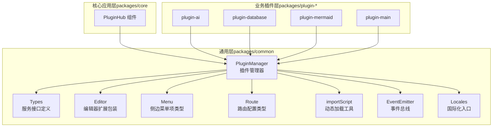
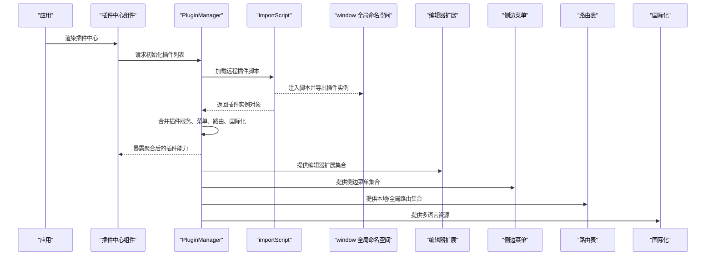
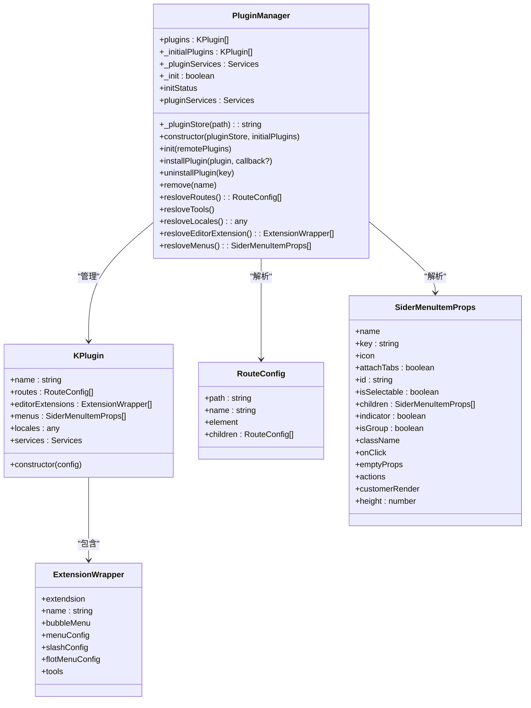
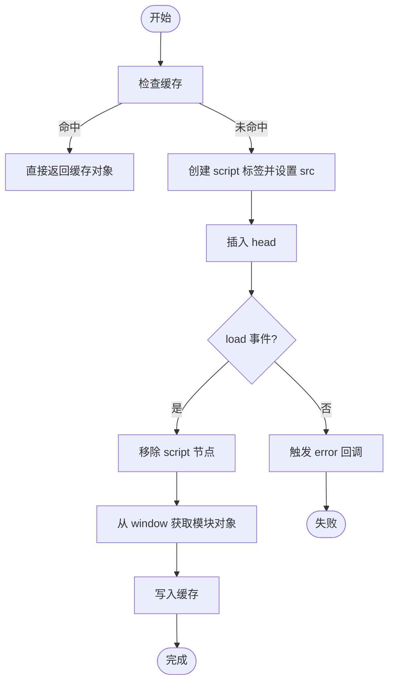
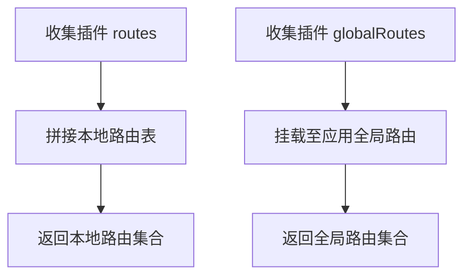
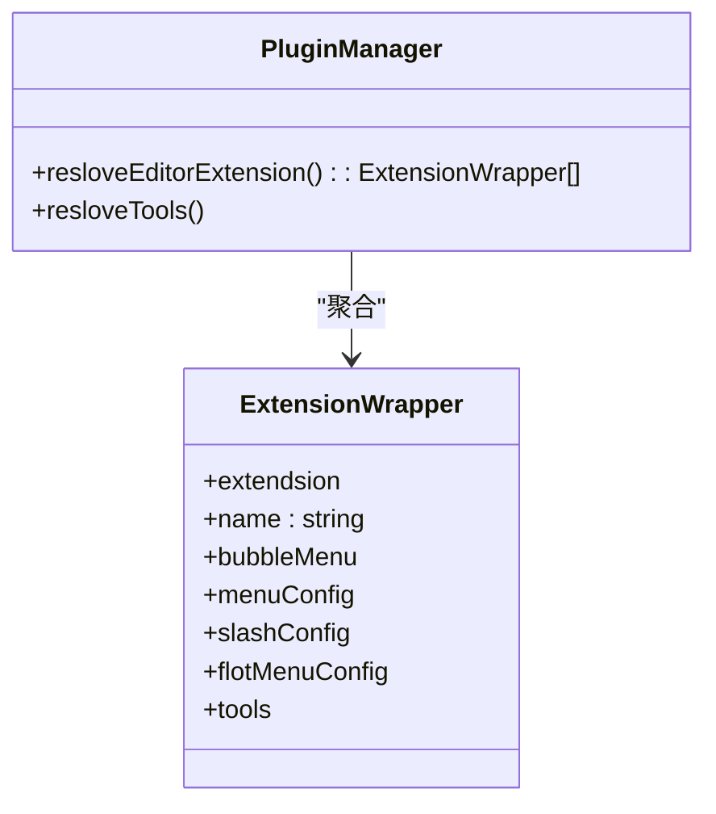
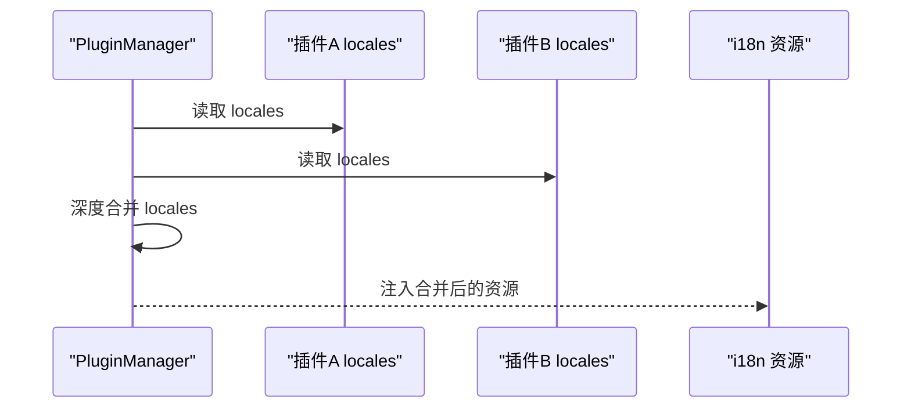
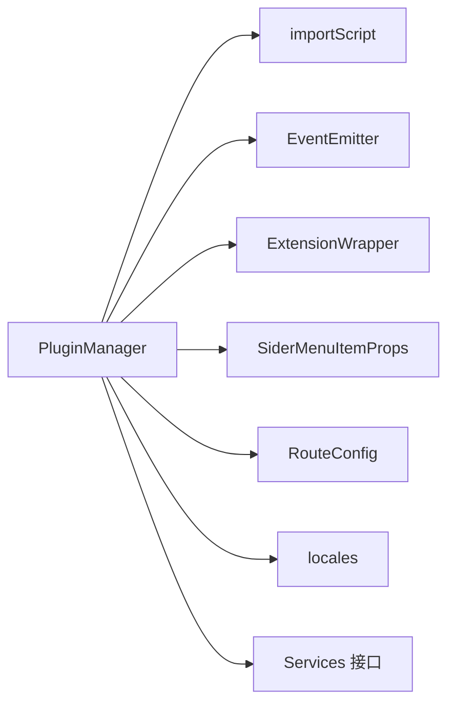

# 插件系统架构

<cite>
**本文引用的文件**
- [packages/common/src/core/PluginManager.ts](file://packages/common/src/core/PluginManager.ts)
- [packages/common/src/core/types.ts](file://packages/common/src/core/types.ts)
- [packages/common/src/core/editor.ts](file://packages/common/src/core/editor.ts)
- [packages/common/src/core/menu.ts](file://packages/common/src/core/menu.ts)
- [packages/common/src/core/route.ts](file://packages/common/src/core/route.ts)
- [packages/common/src/utils/import-util.ts](file://packages/common/src/utils/import-util.ts)
- [packages/common/src/event/event.ts](file://packages/common/src/event/event.ts)
- [packages/common/src/locales/index.ts](file://packages/common/src/locales/index.ts)
- [packages/common/src/locales/supported-language.ts](file://packages/common/src/locales/supported-language.ts)
- [packages/core/src/components/PluginHub/index.tsx](file://packages/core/src/components/PluginHub/index.tsx)
- [packages/plugin-ai/src/index.tsx](file://packages/plugin-ai/src/index.tsx)
- [packages/plugin-database/src/index.tsx](file://packages/plugin-database/src/index.tsx)
- [packages/plugin-mermaid/src/index.tsx](file://packages/plugin-mermaid/src/index.tsx)
- [packages/plugin-main/src/index.tsx](file://packages/plugin-main/src/index.tsx)
</cite>

## 目录
1. [引言](#引言)
2. [项目结构](#项目结构)
3. [核心组件](#核心组件)
4. [架构总览](#架构总览)
5. [详细组件分析](#详细组件分析)
6. [依赖关系分析](#依赖关系分析)
7. [性能考量](#性能考量)
8. [故障排查指南](#故障排查指南)
9. [结论](#结论)
10. [附录](#附录)

## 引言
本文件面向知识库管理系统中的插件系统，围绕 PluginManager 的核心工作机制进行系统化梳理，涵盖插件的动态加载、生命周期管理、服务注册、路由解析、编辑器扩展集成与工具栏菜单生成、国际化支持与多语言资源合并策略，并给出插件开发最佳实践、扩展点设计与调试指南。目标是帮助开发者快速理解并高效扩展插件生态。

## 项目结构
插件系统由“通用层”和“业务插件层”组成：
- 通用层（packages/common）：定义插件配置结构、插件运行时管理器、编辑器扩展包装、菜单与路由类型、脚本动态加载工具、事件总线以及国际化基础能力。
- 业务插件层（packages/plugin-*）：各功能插件以独立包形式提供，遵循通用接口规范，向系统注入路由、菜单、编辑器扩展、国际化资源与服务。
- 核心应用层（packages/core）：承载插件中心等界面组件，负责调用 PluginManager 并渲染插件生态。

图示来源
- [packages/common/src/core/PluginManager.ts](file://packages/common/src/core/PluginManager.ts#L63-L170)
- [packages/common/src/utils/import-util.ts](file://packages/common/src/utils/import-util.ts#L1-L23)
- [packages/common/src/event/event.ts](file://packages/common/src/event/event.ts#L1-L44)
- [packages/common/src/core/types.ts](file://packages/common/src/core/types.ts#L1-L4)
- [packages/common/src/core/editor.ts](file://packages/common/src/core/editor.ts#L1-L31)
- [packages/common/src/core/menu.ts](file://packages/common/src/core/menu.ts#L1-L25)
- [packages/common/src/core/route.ts](file://packages/common/src/core/route.ts#L1-L8)
- [packages/common/src/locales/index.ts](file://packages/common/src/locales/index.ts#L1-L6)
- [packages/core/src/components/PluginHub/index.tsx](file://packages/core/src/components/PluginHub/index.tsx#L1-L6)

章节来源
- [packages/common/src/core/PluginManager.ts](file://packages/common/src/core/PluginManager.ts#L63-L170)
- [packages/common/src/utils/import-util.ts](file://packages/common/src/utils/import-util.ts#L1-L23)
- [packages/common/src/event/event.ts](file://packages/common/src/event/event.ts#L1-L44)
- [packages/common/src/core/types.ts](file://packages/common/src/core/types.ts#L1-L4)
- [packages/common/src/core/editor.ts](file://packages/common/src/core/editor.ts#L1-L31)
- [packages/common/src/core/menu.ts](file://packages/common/src/core/menu.ts#L1-L25)
- [packages/common/src/core/route.ts](file://packages/common/src/core/route.ts#L1-L8)
- [packages/common/src/locales/index.ts](file://packages/common/src/locales/index.ts#L1-L6)
- [packages/core/src/components/PluginHub/index.tsx](file://packages/core/src/components/PluginHub/index.tsx#L1-L6)

## 核心组件
- 插件配置结构（PluginConfig）
  - 字段：名称、状态、本地路由、全局路由、菜单、编辑器扩展、国际化资源、服务。
  - 作用：统一描述插件能力边界，供 PluginManager 解析与注册。
- KPlugin 类
  - 封装插件实例的只读访问器，暴露 routes、editorExtensions、menus、locales、services 等。
  - 设计要点：通过私有字段隔离内部状态，提供稳定的对外属性访问。
- PluginManager 类
  - 负责插件初始化、远程插件动态加载、卸载、安装、服务合并、路由与菜单聚合、国际化资源合并、编辑器扩展聚合。
  - 关键方法：init、installPlugin、uninstallPlugin、resloveRoutes、resloveMenus、resloveLocales、resloveEditorExtension、remove、pluginServices。
- 动态加载工具（importScript）
  - 基于 script 标签异步加载外部脚本，带缓存与错误回调，返回全局命名空间中的模块对象。
- 事件总线（EventEmitter）
  - 提供 on/emit/off/destroy，用于插件安装/卸载后的刷新通知。
- 国际化基础（locales）
  - 导出 i18n、LanguageDetector、useTranslation、supportedLngs，支撑多语言资源合并与检测。

章节来源
- [packages/common/src/core/PluginManager.ts](file://packages/common/src/core/PluginManager.ts#L9-L61)
- [packages/common/src/core/PluginManager.ts](file://packages/common/src/core/PluginManager.ts#L63-L170)
- [packages/common/src/utils/import-util.ts](file://packages/common/src/utils/import-util.ts#L1-L23)
- [packages/common/src/event/event.ts](file://packages/common/src/event/event.ts#L1-L44)
- [packages/common/src/locales/index.ts](file://packages/common/src/locales/index.ts#L1-L6)
- [packages/common/src/locales/supported-language.ts](file://packages/common/src/locales/supported-language.ts#L1-L2)

## 架构总览
下图展示从应用到插件的调用链路与数据流：

图示来源
- [packages/common/src/core/PluginManager.ts](file://packages/common/src/core/PluginManager.ts#L78-L112)
- [packages/common/src/utils/import-util.ts](file://packages/common/src/utils/import-util.ts#L1-L23)
- [packages/common/src/core/editor.ts](file://packages/common/src/core/editor.ts#L1-L31)
- [packages/common/src/core/menu.ts](file://packages/common/src/core/menu.ts#L1-L25)
- [packages/common/src/core/route.ts](file://packages/common/src/core/route.ts#L1-L8)
- [packages/common/src/locales/index.ts](file://packages/common/src/locales/index.ts#L1-L6)

## 详细组件分析

### PluginManager 核心机制
- 初始化流程
  - 若无远程插件，直接使用内置插件集合；否则通过 importScript 并发加载远程插件，完成后合并服务、菜单、路由与国际化资源。
- 生命周期管理
  - 安装：动态加载并加入插件列表，合并服务，触发刷新事件。
  - 卸载：移除指定插件，触发刷新事件。
  - 移除：从内存中剔除插件实例（不触发刷新）。
- 路由解析
  - 本地路由：遍历所有插件的 routes 字段，拼接为本地路由表。
  - 全局路由：在插件配置中提供 globalRoutes 字段，由上层应用统一接入。
- 编辑器扩展与工具栏
  - 通过 editorExtensions 聚合扩展集合；tools 字段用于生成工具栏菜单。
- 国际化资源合并
  - 对每个插件的 locales 进行深度合并，形成全局可用的语言资源。
- 服务注册
  - 将各插件的服务对象合并到统一的服务字典中，供应用层按需调用。

图示来源
- [packages/common/src/core/PluginManager.ts](file://packages/common/src/core/PluginManager.ts#L63-L170)
- [packages/common/src/core/editor.ts](file://packages/common/src/core/editor.ts#L1-L31)
- [packages/common/src/core/route.ts](file://packages/common/src/core/route.ts#L1-L8)
- [packages/common/src/core/menu.ts](file://packages/common/src/core/menu.ts#L1-L25)

章节来源
- [packages/common/src/core/PluginManager.ts](file://packages/common/src/core/PluginManager.ts#L63-L170)

### 动态加载与脚本注入
- 机制概述
  - 使用 script 标签异步加载插件脚本，监听 load/error 事件，成功后从 window 全局命名空间取回模块对象并缓存。
- 关键点
  - URL 增加 cache 参数，便于浏览器缓存与二次加载。
  - 成功后移除 script 节点，避免污染 DOM。
  - 错误回调用于上层捕获加载失败。

图示来源
- [packages/common/src/utils/import-util.ts](file://packages/common/src/utils/import-util.ts#L1-L23)

章节来源
- [packages/common/src/utils/import-util.ts](file://packages/common/src/utils/import-util.ts#L1-L23)

### 路由解析机制（本地与全局）
- 本地路由
  - PluginManager 遍历所有插件的 routes 属性，拼接为本地路由表，供应用内部页面或侧边导航使用。
- 全局路由
  - 插件配置提供 globalRoutes 字段，通常由应用顶层路由系统统一挂载，实现跨域或全局页面级扩展。
- 处理逻辑
  - 本地路由优先用于应用内部导航；全局路由用于与应用主路由体系对接。

图示来源
- [packages/common/src/core/PluginManager.ts](file://packages/common/src/core/PluginManager.ts#L122-L130)
- [packages/common/src/core/route.ts](file://packages/common/src/core/route.ts#L1-L8)

章节来源
- [packages/common/src/core/PluginManager.ts](file://packages/common/src/core/PluginManager.ts#L122-L130)
- [packages/common/src/core/route.ts](file://packages/common/src/core/route.ts#L1-L8)

### 编辑器扩展集成与工具栏菜单生成
- 扩展集成
  - 插件通过 editorExtensions 注入扩展集合；ExtensionWrapper 支持 bubbleMenu、menuConfig、slashConfig、flotMenuConfig、tools 等字段，覆盖气泡菜单、斜杠菜单、浮动菜单与工具集。
- 工具栏菜单
  - tools 字段提供工具描述、输入模式与执行函数，PluginManager 聚合后可生成工具栏菜单项。
- 使用建议
  - 将扩展与菜单解耦，通过 group 字段归类，便于编辑器统一渲染。

图示来源
- [packages/common/src/core/editor.ts](file://packages/common/src/core/editor.ts#L1-L31)
- [packages/common/src/core/PluginManager.ts](file://packages/common/src/core/PluginManager.ts#L132-L154)

章节来源
- [packages/common/src/core/editor.ts](file://packages/common/src/core/editor.ts#L1-L31)
- [packages/common/src/core/PluginManager.ts](file://packages/common/src/core/PluginManager.ts#L132-L154)

### 国际化支持与多语言资源合并
- 能力基础
  - 导出 i18n、LanguageDetector、useTranslation、supportedLngs，支持语言检测与资源加载。
- 资源合并
  - PluginManager 将各插件的 locales 进行深度合并，形成全局语言资源，供应用层统一使用。
- 实践建议
  - 插件内按语言目录组织资源，避免 key 冲突；在插件卸载时注意资源清理。

图示来源
- [packages/common/src/core/PluginManager.ts](file://packages/common/src/core/PluginManager.ts#L136-L144)
- [packages/common/src/locales/index.ts](file://packages/common/src/locales/index.ts#L1-L6)
- [packages/common/src/locales/supported-language.ts](file://packages/common/src/locales/supported-language.ts#L1-L2)

章节来源
- [packages/common/src/core/PluginManager.ts](file://packages/common/src/core/PluginManager.ts#L136-L144)
- [packages/common/src/locales/index.ts](file://packages/common/src/locales/index.ts#L1-L6)
- [packages/common/src/locales/supported-language.ts](file://packages/common/src/locales/supported-language.ts#L1-L2)

### 插件开发最佳实践与扩展点设计
- 配置设计
  - 明确 name、status、routes/globalRoutes、menus、editorExtension、locales、services 字段职责，保持最小必要配置。
- 动态加载
  - 插件打包产物需暴露在 window 全局命名空间，确保 importScript 可正确取回模块对象。
- 菜单与路由
  - 菜单使用 SiderMenuItemProps 规范字段；路由使用 RouteConfig，避免路径冲突。
- 编辑器扩展
  - 通过 ExtensionWrapper 的 menuConfig/slashConfig/flotMenuConfig/tools 字段清晰表达交互意图。
- 国际化
  - 按语言划分资源目录，避免 key 冲突；提供默认英文与中文资源。
- 服务注册
  - 将服务方法收敛到 services 对象，便于统一合并与调用。
- 生命周期
  - 在卸载时清理副作用（如事件监听、定时器），并在安装/卸载后触发刷新事件。

章节来源
- [packages/common/src/core/PluginManager.ts](file://packages/common/src/core/PluginManager.ts#L9-L61)
- [packages/common/src/core/editor.ts](file://packages/common/src/core/editor.ts#L1-L31)
- [packages/common/src/core/menu.ts](file://packages/common/src/core/menu.ts#L1-L25)
- [packages/common/src/core/route.ts](file://packages/common/src/core/route.ts#L1-L8)
- [packages/common/src/locales/index.ts](file://packages/common/src/locales/index.ts#L1-L6)

### 插件开发示例与调试指南
- 示例参考
  - AI 插件：提供编辑器扩展与工具栏菜单，参考 [packages/plugin-ai/src/index.tsx](file://packages/plugin-ai/src/index.tsx)。
  - 数据库插件：提供数据库视图与菜单，参考 [packages/plugin-database/src/index.tsx](file://packages/plugin-database/src/index.tsx)。
  - Mermaid 插件：提供图表视图与编辑器扩展，参考 [packages/plugin-mermaid/src/index.tsx](file://packages/plugin-mermaid/src/index.tsx)。
  - 主插件：提供页面与服务，参考 [packages/plugin-main/src/index.tsx](file://packages/plugin-main/src/index.tsx)。
- 调试步骤
  - 确认插件构建产物已发布到可访问的静态资源地址，并能被 importScript 正常加载。
  - 在浏览器控制台观察 importScript 的 load/error 事件与 window 全局命名空间是否包含插件对象。
  - 使用 PluginManager 的 init/installPlugin 流程，确认插件实例被正确加入并合并服务与菜单。
  - 若出现路由冲突或菜单异常，检查 routes/menus 的 key 与 path 是否唯一。
  - 国际化问题可通过合并后的 locales 对比定位缺失或重复 key。

章节来源
- [packages/plugin-ai/src/index.tsx](file://packages/plugin-ai/src/index.tsx)
- [packages/plugin-database/src/index.tsx](file://packages/plugin-database/src/index.tsx)
- [packages/plugin-mermaid/src/index.tsx](file://packages/plugin-mermaid/src/index.tsx)
- [packages/plugin-main/src/index.tsx](file://packages/plugin-main/src/index.tsx)
- [packages/common/src/utils/import-util.ts](file://packages/common/src/utils/import-util.ts#L1-L23)
- [packages/common/src/core/PluginManager.ts](file://packages/common/src/core/PluginManager.ts#L78-L112)

## 依赖关系分析
- 组件耦合
  - PluginManager 与 importScript、EventEmitter、editor、menu、route、locales 等模块存在松耦合依赖，通过接口与类型约束降低耦合度。
- 依赖可视化

图示来源
- [packages/common/src/core/PluginManager.ts](file://packages/common/src/core/PluginManager.ts#L63-L170)
- [packages/common/src/utils/import-util.ts](file://packages/common/src/utils/import-util.ts#L1-L23)
- [packages/common/src/event/event.ts](file://packages/common/src/event/event.ts#L1-L44)
- [packages/common/src/core/editor.ts](file://packages/common/src/core/editor.ts#L1-L31)
- [packages/common/src/core/menu.ts](file://packages/common/src/core/menu.ts#L1-L25)
- [packages/common/src/core/route.ts](file://packages/common/src/core/route.ts#L1-L8)
- [packages/common/src/locales/index.ts](file://packages/common/src/locales/index.ts#L1-L6)
- [packages/common/src/core/types.ts](file://packages/common/src/core/types.ts#L1-L4)

章节来源
- [packages/common/src/core/PluginManager.ts](file://packages/common/src/core/PluginManager.ts#L63-L170)
- [packages/common/src/utils/import-util.ts](file://packages/common/src/utils/import-util.ts#L1-L23)
- [packages/common/src/event/event.ts](file://packages/common/src/event/event.ts#L1-L44)
- [packages/common/src/core/editor.ts](file://packages/common/src/core/editor.ts#L1-L31)
- [packages/common/src/core/menu.ts](file://packages/common/src/core/menu.ts#L1-L25)
- [packages/common/src/core/route.ts](file://packages/common/src/core/route.ts#L1-L8)
- [packages/common/src/locales/index.ts](file://packages/common/src/locales/index.ts#L1-L6)
- [packages/common/src/core/types.ts](file://packages/common/src/core/types.ts#L1-L4)

## 性能考量
- 动态加载优化
  - 利用 importScript 的缓存机制减少重复请求；对大型插件采用分包与懒加载策略。
- 并发加载
  - 使用 Promise.all 并发加载远程插件，缩短初始化时间。
- 资源合并
  - 合并 locales 与服务时避免深层嵌套导致的性能问题，建议按插件维度拆分资源。
- 事件驱动刷新
  - 通过事件总线触发刷新，避免全量重渲染，提升交互响应速度。

## 故障排查指南
- 插件未加载
  - 检查 importScript 的 URL 是否正确、网络是否可达、window 全局命名空间是否存在插件对象。
- 插件卸载后 UI 未更新
  - 确认 uninstallPlugin 是否触发了 REFRESH_PLUSINS 事件，以及订阅方是否正确处理刷新逻辑。
- 路由冲突
  - 校验 routes 与 globalRoutes 的 path 是否唯一，避免重复注册。
- 国际化资源缺失
  - 对比合并后的 locales，确认插件是否提供对应语言资源，避免 key 冲突。
- 编辑器扩展异常
  - 检查 ExtensionWrapper 的 menuConfig/slashConfig/flotMenuConfig/tools 字段是否完整，group 分类是否正确。

章节来源
- [packages/common/src/utils/import-util.ts](file://packages/common/src/utils/import-util.ts#L1-L23)
- [packages/common/src/event/event.ts](file://packages/common/src/event/event.ts#L1-L44)
- [packages/common/src/core/PluginManager.ts](file://packages/common/src/core/PluginManager.ts#L99-L112)
- [packages/common/src/core/route.ts](file://packages/common/src/core/route.ts#L1-L8)
- [packages/common/src/core/editor.ts](file://packages/common/src/core/editor.ts#L1-L31)

## 结论
该插件系统通过 PluginManager 实现了插件的动态加载、生命周期管理与能力聚合，结合 importScript、EventEmitter、国际化与编辑器扩展包装，形成了可扩展、可维护的插件生态。开发者可依据本文档的最佳实践与扩展点设计，快速开发高质量插件并稳定集成到知识库系统中。

## 附录
- 插件中心组件
  - 插件中心组件作为入口，负责调用 PluginManager 并渲染插件生态，参考 [packages/core/src/components/PluginHub/index.tsx](file://packages/core/src/components/PluginHub/index.tsx)。

章节来源
- [packages/core/src/components/PluginHub/index.tsx](file://packages/core/src/components/PluginHub/index.tsx#L1-L6)