# 插件系统架构

<cite>
**本文引用的文件**
- [packages/common/src/core/PluginManager.ts](file://packages/common/src/core/PluginManager.ts)
- [packages/common/src/core/types.ts](file://packages/common/src/core/types.ts)
- [packages/common/src/core/editor.ts](file://packages/common/src/core/editor.ts)
- [packages/common/src/core/menu.ts](file://packages/common/src/core/menu.ts)
- [packages/common/src/core/route.ts](file://packages/common/src/core/route.ts)
- [packages/common/src/utils/import-util.ts](file://packages/common/src/utils/import-util.ts)
- [packages/common/src/event/event.ts](file://packages/common/src/event/event.ts)
- [packages/common/src/locales/index.ts](file://packages/common/src/locales/index.ts)
- [packages/common/src/locales/supported-language.ts](file://packages/common/src/locales/supported-language.ts)
- [packages/core/src/components/PluginHub/index.tsx](file://packages/core/src/components/PluginHub/index.tsx)
- [packages/core/src/components/Shop/Marketplace/index.tsx](file://packages/core/src/components/Shop/Marketplace/index.tsx)
- [packages/core/src/components/Shop/PluginManager/PluginList.tsx](file://packages/core/src/components/Shop/PluginManager/PluginList.tsx)
- [packages/core/src/components/Shop/PluginManager/index.tsx](file://packages/core/src/components/Shop/PluginManager/index.tsx)
- [packages/core/src/components/Shop/PluginDetail/index.tsx](file://packages/core/src/components/Shop/PluginDetail/index.tsx)
- [packages/core/src/components/Shop/PluginUploader/index.tsx](file://packages/core/src/components/Shop/PluginUploader/index.tsx)
- [packages/core/src/components/Shop/index.tsx](file://packages/core/src/components/Shop/index.tsx)
- [packages/core/src/App.tsx](file://packages/core/src/App.tsx)
- [apps/landing-page-vite/src/App.tsx](file://apps/landing-page-vite/src/App.tsx)
- [apps/landing-page-vite/src/pages/Home/index.tsx](file://apps/landing-page-vite/src/pages/Home/index.tsx)
- [apps/landing-page-vite/src/pages/Plugins/index.tsx](file://apps/landing-page-vite/src/pages/Plugins/index.tsx)
- [apps/landing-page-vite/src/pages/Templates/index.tsx](file://apps/landing-page-vite/src/pages/Templates/index.tsx)
- [packages/plugin-ai/src/index.tsx](file://packages/plugin-ai/src/index.tsx)
- [packages/plugin-database/src/index.tsx](file://packages/plugin-database/src/index.tsx)
- [packages/plugin-mermaid/src/index.tsx](file://packages/plugin-mermaid/src/index.tsx)
- [packages/plugin-main/src/index.tsx](file://packages/plugin-main/src/index.tsx)
- [packages/ui/src/components/ui/accordion.tsx](file://packages/ui/src/components/ui/accordion.tsx)
- [packages/core/src/locales/resources.ts](file://packages/core/src/locales/resources.ts)
- [apps/landing-page-vite/src/locales/resources.ts](file://apps/landing-page-vite/src/locales/resources.ts)
- [apps/landing-page-vite/src/locales/LanguageToggle.tsx](file://apps/landing-page-vite/src/locales/LanguageToggle.tsx)
- [apps/vite/src/main.tsx](file://apps/vite/src/main.tsx)
- [packages/plugin-weaver-oa/src/index.tsx](file://packages/plugin-weaver-oa/src/index.tsx)
- [packages/plugin-bilibili/src/index.tsx](file://packages/plugin-bilibili/src/index.tsx)
- [packages/plugin-github/src/index.tsx](file://packages/plugin-github/src/index.tsx)
- [packages/plugin-github/src/extension/nodes/github-repo-node.tsx](file://packages/plugin-github/src/extension/nodes/github-repo-node.tsx)
- [packages/plugin-github/src/extension/nodes/github-issue-node.tsx](file://packages/plugin-github/src/extension/nodes/github-issue-node.tsx)
- [packages/plugin-netease-music/src/index.tsx](file://packages/plugin-netease-music/src/index.tsx)
- [packages/plugin-office/src/index.tsx](file://packages/plugin-office/src/index.tsx)
- [packages/plugin-office/src/spreadsheet/index.tsx](file://packages/plugin-office/src/spreadsheet/index.tsx)
- [packages/plugin-office/src/spreadsheet/tools.ts](file://packages/plugin-office/src/spreadsheet/tools.ts)
- [packages/plugin-office/src/spreadsheet/skills.ts](file://packages/plugin-office/src/spreadsheet/skills.ts)
- [packages/plugin-bitable/src/index.tsx](file://packages/plugin-bitable/src/index.tsx)
- [packages/plugin-bitable/src/bitable/bitable-tools.ts](file://packages/plugin-bitable/src/bitable/bitable-tools.ts)
</cite>

## 更新摘要
**所做更改**
- 新增GitHub插件的集成模式，支持Issue、PR、仓库和代码片段的嵌入
- 新增网易云音乐插件，提供音乐嵌入和设置配置功能
- 新增Office插件，集成Excel导入和电子表格编辑能力
- 增强Bitable插件功能，提供完整的多维表格管理和AI代理工具集
- 更新插件生态系统架构，体现新的集成模式和增强功能

## 目录
1. [引言](#引言)
2. [项目结构](#项目结构)
3. [核心组件](#核心组件)
4. [架构总览](#架构总览)
5. [详细组件分析](#详细组件分析)
6. [插件商店生态系统](#插件商店生态系统)
7. [国际化支持扩展](#国际化支持扩展)
8. [UI重构详解](#ui重构详解)
9. [依赖关系分析](#依赖关系分析)
10. [性能考量](#性能考量)
11. [故障排查指南](#故障排查指南)
12. [结论](#结论)
13. [附录](#附录)

## 引言
本文件面向知识库管理系统中的插件系统，围绕 PluginManager 的核心工作机制进行系统化梳理，涵盖插件的动态加载、生命周期管理、服务注册、路由解析、编辑器扩展集成与工具栏菜单生成、国际化支持与多语言资源合并策略，并给出插件开发最佳实践、扩展点设计与调试指南。目标是帮助开发者快速理解并高效扩展插件生态。

**更新** 本次更新反映了插件系统架构的重大演进：新增GitHub、网易云音乐、Office插件的集成模式，以及Bitable插件的增强功能，体现了更加丰富和完整的插件生态系统。

## 项目结构
插件系统由"通用层"、"业务插件层"、"核心应用层"、"插件商店层"和"应用入口层"组成：
- 通用层（packages/common）：定义插件配置结构、插件运行时管理器、编辑器扩展包装、菜单与路由类型、脚本动态加载工具、事件总线以及国际化基础能力。
- 业务插件层（packages/plugin-*）：各功能插件以独立包形式提供，遵循通用接口规范，向系统注入路由、菜单、编辑器扩展、国际化资源与服务。
- 核心应用层（packages/core）：承载插件中心、插件商店等界面组件，负责调用 PluginManager 并渲染插件生态。
- 插件商店层（packages/core/components/Shop）：提供完整的插件市场、模板市场、插件管理功能，采用现代化UI设计。
- 应用入口层（apps/*）：各应用实例通过App组件传入插件数组，实现插件的动态配置和管理。

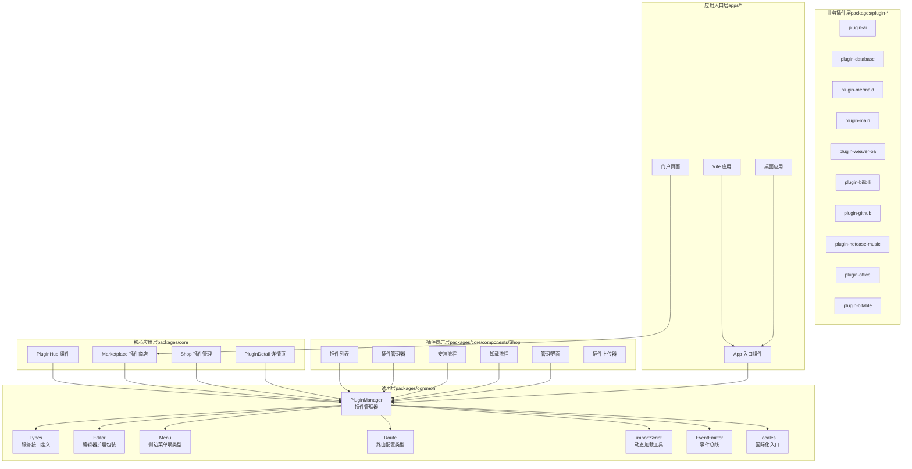
```mermaid
graph TB
subgraph "通用层packages/common"
PM["PluginManager<br/>插件管理器"]
Types["Types<br/>服务接口定义"]
Editor["Editor<br/>编辑器扩展包装"]
Menu["Menu<br/>侧边菜单项类型"]
Route["Route<br/>路由配置类型"]
ImportUtil["importScript<br/>动态加载工具"]
Event["EventEmitter<br/>事件总线"]
Locales["Locales<br/>国际化入口"]
end
subgraph "业务插件层packages/plugin-*"
PluginAI["plugin-ai"]
PluginDB["plugin-database"]
PluginMermaid["plugin-mermaid"]
PluginMain["plugin-main"]
PluginWeaverOA["plugin-weaver-oa"]
PluginBilibili["plugin-bilibili"]
PluginGitHub["plugin-github"]
PluginNetEase["plugin-netease-music"]
PluginOffice["plugin-office"]
PluginBitable["plugin-bitable"]
end
subgraph "核心应用层packages/core"
PluginHub["PluginHub 组件"]
Marketplace["Marketplace 插件商店"]
Shop["Shop 插件管理"]
PluginDetail["PluginDetail 详情页"]
end
subgraph "插件商店层packages/core/components/Shop"
Install["安装流程"]
Uninstall["卸载流程"]
Manage["管理界面"]
PluginList["插件列表"]
PluginManagerComp["插件管理器"]
PluginUploader["插件上传器"]
end
subgraph "应用入口层apps/*"
AppEntry["App 入口组件"]
ViteApp["Vite 应用"]
DesktopApp["桌面应用"]
LandingPage["门户页面"]
end
PM --> ImportUtil
PM --> Event
PM --> Types
PM --> Editor
PM --> Menu
PM --> Route
PM --> Locales
PluginHub --> PM
Marketplace --> PM
Shop --> PM
PluginDetail --> PM
PluginList --> PM
PluginManagerComp --> PM
Install --> PM
Uninstall --> PM
Manage --> PM
AppEntry --> PM
ViteApp --> AppEntry
DesktopApp --> AppEntry
LandingPage --> Marketplace
```

**图示来源**
- [packages/common/src/core/PluginManager.ts](file://packages/common/src/core/PluginManager.ts#L99-L489)
- [packages/common/src/utils/import-util.ts](file://packages/common/src/utils/import-util.ts#L12-L39)
- [packages/common/src/event/event.ts](file://packages/common/src/event/event.ts#L1-L44)
- [packages/common/src/core/types.ts](file://packages/common/src/core/types.ts#L1-L4)
- [packages/common/src/core/editor.ts](file://packages/common/src/core/editor.ts#L1-L31)
- [packages/common/src/core/menu.ts](file://packages/common/src/core/menu.ts#L1-L25)
- [packages/common/src/core/route.ts](file://packages/common/src/core/route.ts#L1-L8)
- [packages/common/src/locales/index.ts](file://packages/common/src/locales/index.ts#L1-L6)
- [packages/core/src/components/Shop/Marketplace/index.tsx](file://packages/core/src/components/Shop/Marketplace/index.tsx#L62-L74)
- [apps/vite/src/main.tsx](file://apps/vite/src/main.tsx#L17-L18)
- [apps/vite/src/main.tsx](file://apps/vite/src/main.tsx#L21-L22)

**章节来源**
- [packages/common/src/core/PluginManager.ts](file://packages/common/src/core/PluginManager.ts#L99-L489)
- [packages/common/src/utils/import-util.ts](file://packages/common/src/utils/import-util.ts#L12-L39)
- [packages/common/src/event/event.ts](file://packages/common/src/event/event.ts#L1-L44)
- [packages/common/src/core/types.ts](file://packages/common/src/core/types.ts#L1-L4)
- [packages/common/src/core/editor.ts](file://packages/common/src/core/editor.ts#L1-L31)
- [packages/common/src/core/menu.ts](file://packages/common/src/core/menu.ts#L1-L25)
- [packages/common/src/core/route.ts](file://packages/common/src/core/route.ts#L1-L8)
- [packages/common/src/locales/index.ts](file://packages/common/src/locales/index.ts#L1-L6)
- [packages/core/src/components/Shop/Marketplace/index.tsx](file://packages/core/src/components/Shop/Marketplace/index.tsx#L62-L74)
- [apps/vite/src/main.tsx](file://apps/vite/src/main.tsx#L17-L18)
- [apps/vite/src/main.tsx](file://apps/vite/src/main.tsx#L21-L22)

## 核心组件
- 插件配置结构（PluginConfig）
  - 字段：名称、状态、本地路由、全局路由、菜单、编辑器扩展、国际化资源、服务。
  - 作用：统一描述插件能力边界，供 PluginManager 解析与注册。
- KPlugin 类
  - 封装插件实例的只读访问器，暴露 routes、editorExtensions、menus、locales、services 等。
  - 设计要点：通过私有字段隔离内部状态，提供稳定的对外属性访问。
- PluginManager 类
  - 负责插件初始化、远程插件动态加载、卸载、安装、服务合并、路由与菜单聚合、国际化资源合并、编辑器扩展聚合。
  - 关键方法：init、installPlugin、uninstallPlugin、resolveRoutes、resolveMenus、resolveLocales、resolveEditorExtension、remove、pluginServices。
- 动态加载工具（importScript）
  - 基于 script 标签异步加载外部脚本，带缓存与错误回调，返回全局命名空间中的模块对象。
- 事件总线（EventEmitter）
  - 提供 on/emit/off/destroy，用于插件安装/卸载后的刷新通知。
- 国际化基础（locales）
  - 导出 i18n、LanguageDetector、useTranslation、supportedLngs，支撑多语言资源合并与检测。
- 插件商店（Marketplace）
  - 提供插件发现、安装、管理功能，支持插件列表获取、安装状态管理、卸载操作。
- 插件管理器（PluginManager）
  - 新增增强功能：插件分类筛选、类型过滤、批量操作、详情面板、统计概览等。
- 插件详情页（PluginDetail）
  - 提供插件详细信息展示，包括版本描述、功能介绍、统计数据等。
- 应用入口组件（App）
  - 通过AppProps接收插件数组，支持完全动态的插件配置和管理。

**更新** 新增了GitHub、网易云音乐、Office、Bitable等插件的集成能力，体现了插件系统的多样化扩展。

**章节来源**
- [packages/common/src/core/PluginManager.ts](file://packages/common/src/core/PluginManager.ts#L34-L97)
- [packages/common/src/core/PluginManager.ts](file://packages/common/src/core/PluginManager.ts#L99-L489)
- [packages/common/src/utils/import-util.ts](file://packages/common/src/utils/import-util.ts#L12-L39)
- [packages/common/src/event/event.ts](file://packages/common/src/event/event.ts#L1-L44)
- [packages/common/src/locales/index.ts](file://packages/common/src/locales/index.ts#L1-L6)
- [packages/common/src/locales/supported-language.ts](file://packages/common/src/locales/supported-language.ts#L1-L2)
- [packages/core/src/components/Shop/Marketplace/index.tsx](file://packages/core/src/components/Shop/Marketplace/index.tsx#L62-L74)
- [packages/core/src/components/Shop/PluginManager/index.tsx](file://packages/core/src/components/Shop/PluginManager/index.tsx#L1-L214)
- [packages/core/src/components/Shop/PluginDetail/index.tsx](file://packages/core/src/components/Shop/PluginDetail/index.tsx#L1-L229)
- [packages/core/src/App.tsx](file://packages/core/src/App.tsx#L51-L53)
- [apps/vite/src/main.tsx](file://apps/vite/src/main.tsx#L17-L18)
- [apps/vite/src/main.tsx](file://apps/vite/src/main.tsx#L21-L22)

## 架构总览
下图展示从应用到插件的调用链路与数据流，反映了新的动态加载模式：

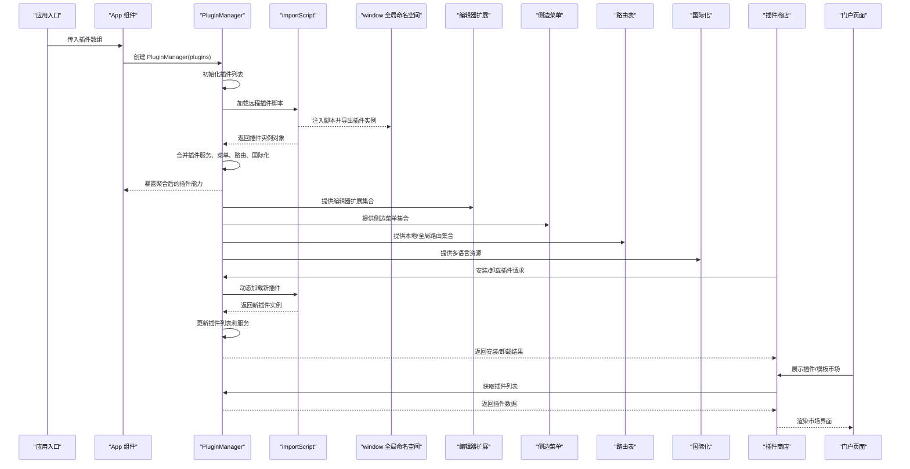
```mermaid
sequenceDiagram
participant App as "应用入口"
participant AppComp as "App 组件"
participant PM as "PluginManager"
participant Loader as "importScript"
participant Win as "window 全局命名空间"
participant Ext as "编辑器扩展"
participant Menu as "侧边菜单"
participant Routes as "路由表"
participant I18N as "国际化"
participant Store as "插件商店"
participant Portal as "门户页面"
App->>AppComp : 传入插件数组
AppComp->>PM : 创建 PluginManager(plugins)
PM->>PM : 初始化插件列表
PM->>Loader : 加载远程插件脚本
Loader-->>Win : 注入脚本并导出插件实例
Loader-->>PM : 返回插件实例对象
PM->>PM : 合并插件服务、菜单、路由、国际化
PM-->>AppComp : 暴露聚合后的插件能力
PM->>Ext : 提供编辑器扩展集合
PM->>Menu : 提供侧边菜单集合
PM->>Routes : 提供本地/全局路由集合
PM->>I18N : 提供多语言资源
Store->>PM : 安装/卸载插件请求
PM->>Loader : 动态加载新插件
Loader-->>PM : 返回新插件实例
PM->>PM : 更新插件列表和服务
PM-->>Store : 返回安装/卸载结果
Portal->>Store : 展示插件/模板市场
Store->>PM : 获取插件列表
PM-->>Store : 返回插件数据
Store-->>Portal : 渲染市场界面
```

**图示来源**
- [packages/common/src/core/PluginManager.ts](file://packages/common/src/core/PluginManager.ts#L150-L218)
- [packages/common/src/utils/import-util.ts](file://packages/common/src/utils/import-util.ts#L12-L39)
- [packages/common/src/core/editor.ts](file://packages/common/src/core/editor.ts#L1-L31)
- [packages/common/src/core/menu.ts](file://packages/common/src/core/menu.ts#L1-L25)
- [packages/common/src/core/route.ts](file://packages/common/src/core/route.ts#L1-L8)
- [packages/common/src/locales/index.ts](file://packages/common/src/locales/index.ts#L1-L6)
- [packages/core/src/components/Shop/Marketplace/index.tsx](file://packages/core/src/components/Shop/Marketplace/index.tsx#L62-L74)
- [packages/core/src/App.tsx](file://packages/core/src/App.tsx#L56-L60)
- [apps/vite/src/main.tsx](file://apps/vite/src/main.tsx#L21-L22)

## 详细组件分析

### PluginManager 核心机制
- 初始化流程
  - 接收外部传入的插件数组作为初始插件集合，不再依赖硬编码的默认插件配置。
  - 通过 importScript 并发加载远程插件，完成后合并服务、菜单、路由与国际化资源。
- 生命周期管理
  - 安装：动态加载并加入插件列表，合并服务，触发刷新事件。
  - 卸载：移除指定插件，触发刷新事件。
  - 移除：从内存中剔除插件实例（不触发刷新）。
- 路由解析
  - 本地路由：遍历所有插件的 routes 字段，拼接为本地路由表。
  - 全局路由：在插件配置中提供 globalRoutes 字段，由上层应用统一接入。
- 编辑器扩展与工具栏
  - 通过 editorExtensions 聚合扩展集合；tools 字段用于生成工具栏菜单。
- 国际化资源合并
  - 对每个插件的 locales 进行深度合并，形成全局可用的语言资源。
- 服务注册
  - 将各插件的服务对象合并到统一的服务字典中，供应用层按需调用。

**更新** 移除了对DefaultPluginInstance的硬编码依赖，现在完全基于外部传入的插件数组，支持运行时插件安装和卸载的完全动态模式。

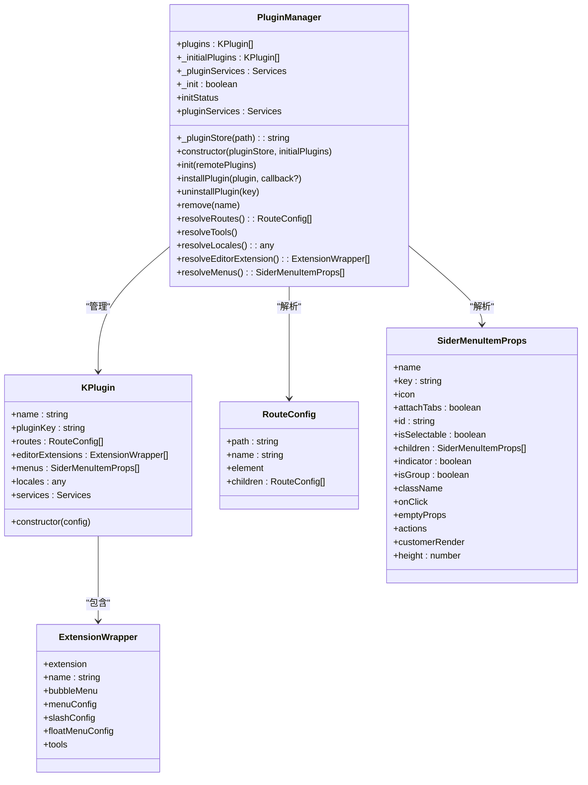
```mermaid
classDiagram
class PluginManager {
+plugins : KPlugin[]
+_initialPlugins : KPlugin[]
+_pluginServices : Services
+_pluginStore(path) : string
+_init : boolean
+constructor(pluginStore, initialPlugins)
+init(remotePlugins)
+installPlugin(plugin, callback?)
+uninstallPlugin(key)
+remove(name)
+initStatus
+resolveRoutes() : RouteConfig[]
+resolveTools()
+resolveLocales() : any
+resolveEditorExtension() : ExtensionWrapper[]
+resolveMenus() : SiderMenuItemProps[]
+pluginServices : Services
}
class KPlugin {
+name : string
+pluginKey : string
+constructor(config)
+routes : RouteConfig[]
+editorExtensions : ExtensionWrapper[]
+menus : SiderMenuItemProps[]
+locales : any
+services : Services
}
class ExtensionWrapper {
+extension
+name : string
+bubbleMenu
+menuConfig
+slashConfig
+floatMenuConfig
+tools
}
class RouteConfig {
+path : string
+name : string
+element
+children : RouteConfig[]
}
class SiderMenuItemProps {
+name
+key : string
+icon
+attachTabs : boolean
+id : string
+isSelectable : boolean
+children : SiderMenuItemProps[]
+indicator : boolean
+isGroup : boolean
+className
+onClick
+emptyProps
+actions
+customerRender
+height : number
}
PluginManager --> KPlugin : "管理"
KPlugin --> ExtensionWrapper : "包含"
PluginManager --> RouteConfig : "解析"
PluginManager --> SiderMenuItemProps : "解析"
```

**图示来源**
- [packages/common/src/core/PluginManager.ts](file://packages/common/src/core/PluginManager.ts#L99-L489)
- [packages/common/src/core/editor.ts](file://packages/common/src/core/editor.ts#L1-L31)
- [packages/common/src/core/route.ts](file://packages/common/src/core/route.ts#L1-L8)
- [packages/common/src/core/menu.ts](file://packages/common/src/core/menu.ts#L1-L25)

**章节来源**
- [packages/common/src/core/PluginManager.ts](file://packages/common/src/core/PluginManager.ts#L99-L489)

### 动态加载与脚本注入
- 机制概述
  - 使用 script 标签异步加载插件脚本，监听 load/error 事件，成功后从 window 全局命名空间取回模块对象并缓存。
- 关键点
  - URL 增加 cache 参数，便于浏览器缓存与二次加载。
  - 成功后移除 script 节点，避免污染 DOM。
  - 错误回调用于上层捕获加载失败。

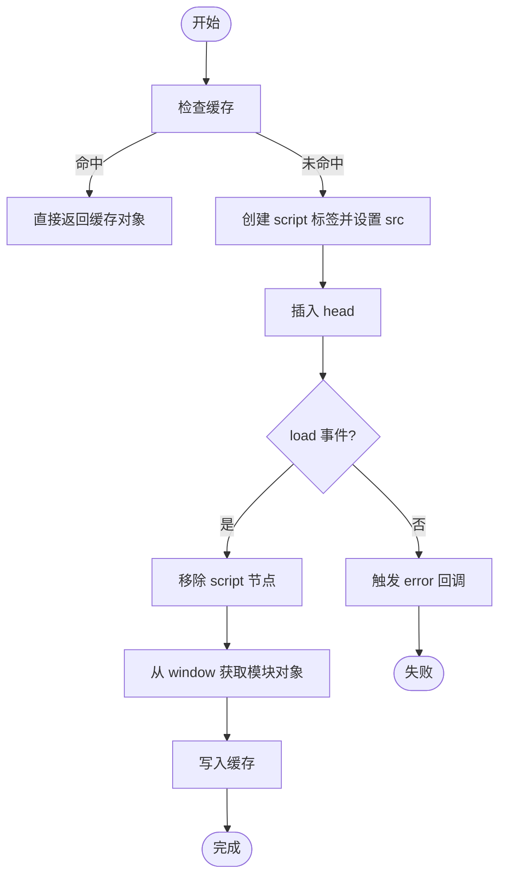
```mermaid
flowchart TD
Start(["开始"]) --> CheckCache["检查缓存"]
CheckCache --> |命中| Resolve["直接返回缓存对象"]
CheckCache --> |未命中| CreateScript["创建 script 标签并设置 src"]
CreateScript --> AppendHead["插入 head"]
AppendHead --> WaitLoad{"load 事件?"}
WaitLoad --> |是| RemoveNode["移除 script 节点"]
RemoveNode --> GetModule["从 window 获取模块对象"]
GetModule --> Cache["写入缓存"]
Cache --> Done(["完成"])
WaitLoad --> |否| OnError["触发 error 回调"]
OnError --> Fail(["失败"])
```

**图示来源**
- [packages/common/src/utils/import-util.ts](file://packages/common/src/utils/import-util.ts#L12-L39)

**章节来源**
- [packages/common/src/utils/import-util.ts](file://packages/common/src/utils/import-util.ts#L12-L39)

### 路由解析机制（本地与全局）
- 本地路由
  - PluginManager 遍历所有插件的 routes 属性，拼接为本地路由表，供应用内部页面或侧边导航使用。
- 全局路由
  - 插件配置提供 globalRoutes 字段，通常由应用顶层路由系统统一挂载，实现跨域或全局页面级扩展。
- 处理逻辑
  - 本地路由优先用于应用内部导航；全局路由用于与应用主路由体系对接。

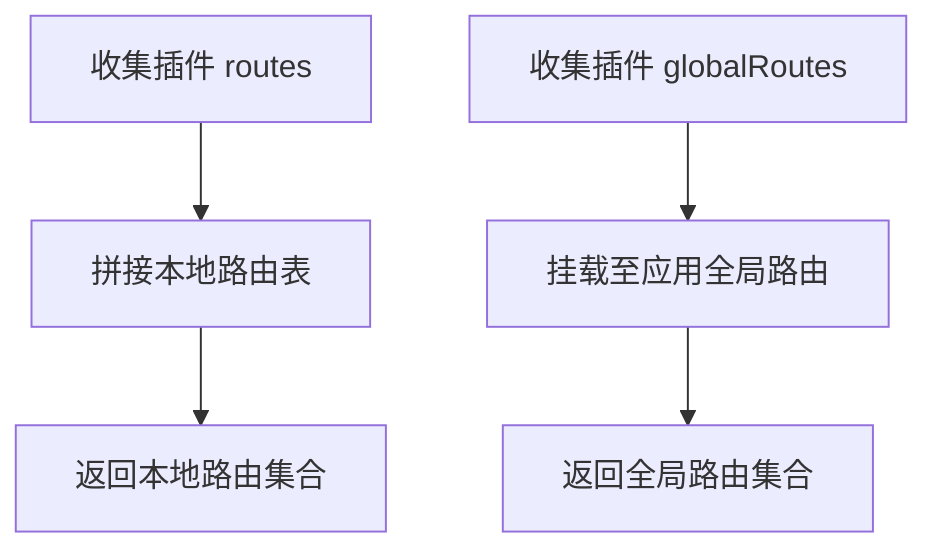
```mermaid
flowchart TD
A["收集插件 routes"] --> B["拼接本地路由表"]
C["收集插件 globalRoutes"] --> D["挂载至应用全局路由"]
B --> E["返回本地路由集合"]
D --> F["返回全局路由集合"]
```

**图示来源**
- [packages/common/src/core/PluginManager.ts](file://packages/common/src/core/PluginManager.ts#L319-L333)
- [packages/common/src/core/route.ts](file://packages/common/src/core/route.ts#L1-L8)

**章节来源**
- [packages/common/src/core/PluginManager.ts](file://packages/common/src/core/PluginManager.ts#L319-L333)
- [packages/common/src/core/route.ts](file://packages/common/src/core/route.ts#L1-L8)

### 编辑器扩展集成与工具栏菜单生成
- 扩展集成
  - 插件通过 editorExtensions 注入扩展集合；ExtensionWrapper 支持 bubbleMenu、menuConfig、slashConfig、floatMenuConfig、tools 等字段，覆盖气泡菜单、斜杠菜单、浮动菜单与工具集。
- 工具栏菜单
  - tools 字段提供工具描述、输入模式与执行函数，PluginManager 聚合后可生成工具栏菜单项。
- 使用建议
  - 将扩展与菜单解耦，通过 group 字段归类，便于编辑器统一渲染。

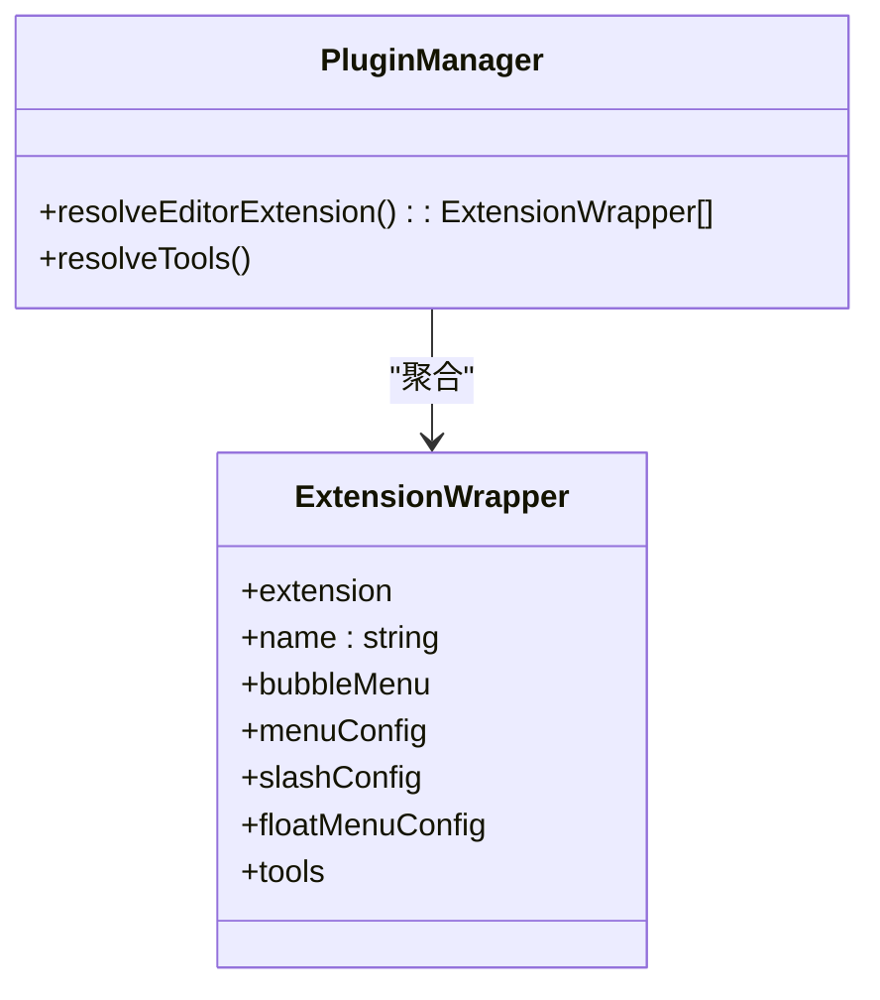
```mermaid
classDiagram
class ExtensionWrapper {
+extension
+name : string
+bubbleMenu
+menuConfig
+slashConfig
+floatMenuConfig
+tools
}
class PluginManager {
+resolveEditorExtension() : ExtensionWrapper[]
+resolveTools()
}
PluginManager --> ExtensionWrapper : "聚合"
```

**图示来源**
- [packages/common/src/core/editor.ts](file://packages/common/src/core/editor.ts#L1-L31)
- [packages/common/src/core/PluginManager.ts](file://packages/common/src/core/PluginManager.ts#L335-L365)

**章节来源**
- [packages/common/src/core/editor.ts](file://packages/common/src/core/editor.ts#L1-L31)
- [packages/common/src/core/PluginManager.ts](file://packages/common/src/core/PluginManager.ts#L335-L365)

### 国际化支持与多语言资源合并
- 能力基础
  - 导出 i18n、LanguageDetector、useTranslation、supportedLngs，支持语言检测与资源加载。
- 资源合并
  - PluginManager 将各插件的 locales 进行深度合并，形成全局语言资源，供应用层统一使用。
- 实践建议
  - 插件内按语言目录组织资源，避免 key 冲突；在插件卸载时注意资源清理。

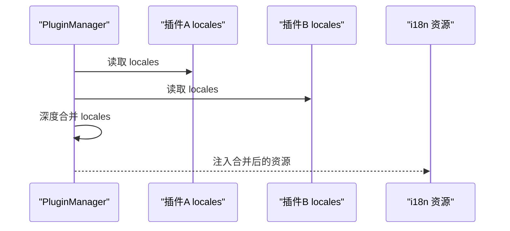
```mermaid
sequenceDiagram
participant PM as "PluginManager"
participant P1 as "插件A locales"
participant P2 as "插件B locales"
participant I18N as "i18n 资源"
PM->>P1 : 读取 locales
PM->>P2 : 读取 locales
PM->>PM : 深度合并 locales
PM-->>I18N : 注入合并后的资源
```

**图示来源**
- [packages/common/src/core/PluginManager.ts](file://packages/common/src/core/PluginManager.ts#L367-L381)
- [packages/common/src/locales/index.ts](file://packages/common/src/locales/index.ts#L1-L6)
- [packages/common/src/locales/supported-language.ts](file://packages/common/src/locales/supported-language.ts#L1-L2)

**章节来源**
- [packages/common/src/core/PluginManager.ts](file://packages/common/src/core/PluginManager.ts#L367-L381)
- [packages/common/src/locales/index.ts](file://packages/common/src/locales/index.ts#L1-L6)
- [packages/common/src/locales/supported-language.ts](file://packages/common/src/locales/supported-language.ts#L1-L2)

### 插件商店与生命周期管理
- 插件商店功能
  - 提供插件发现、安装、管理界面，支持插件分类、搜索、评分等功能。
- 安装流程
  - 用户点击安装按钮，调用 API 获取插件版本信息，然后通过 PluginManager.installPlugin 动态加载插件。
- 卸载流程
  - 通过 PluginManager.uninstallPlugin 移除插件，更新插件列表和服务缓存。
- 事件驱动
  - 安装/卸载完成后触发 REFRESH_PLUSINS 事件，通知所有订阅者更新界面。

**更新** 新增了完整的插件商店实现，支持插件的在线安装和管理，实现了插件生态的完整生命周期管理。

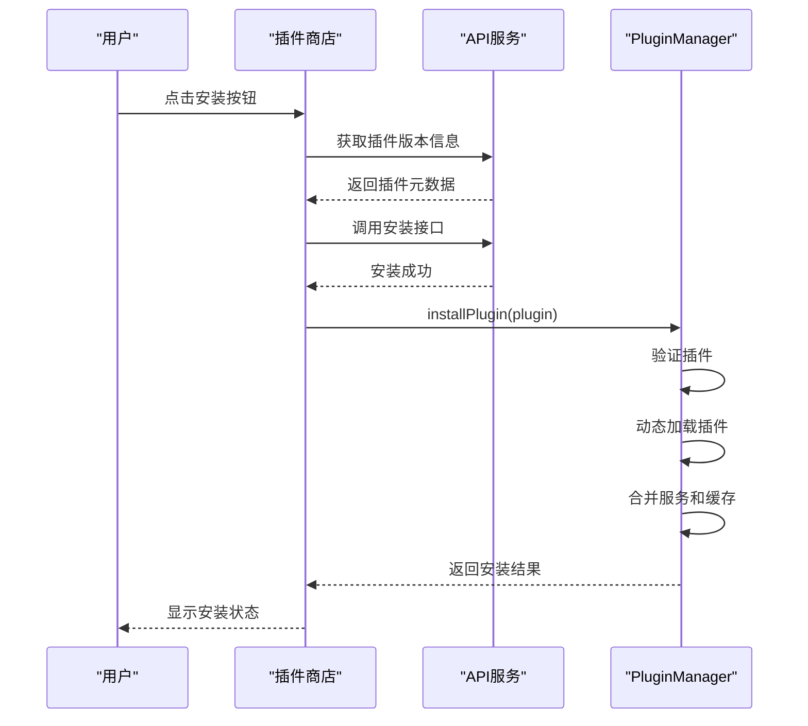
```mermaid
sequenceDiagram
participant User as "用户"
participant Store as "插件商店"
participant API as "API服务"
participant PM as "PluginManager"
User->>Store : 点击安装按钮
Store->>API : 获取插件版本信息
API-->>Store : 返回插件元数据
Store->>API : 调用安装接口
API-->>Store : 安装成功
Store->>PM : installPlugin(plugin)
PM->>PM : 验证插件
PM->>PM : 动态加载插件
PM->>PM : 合并服务和缓存
PM-->>Store : 返回安装结果
Store-->>User : 显示安装状态
```

**图示来源**
- [packages/core/src/components/Shop/Marketplace/index.tsx](file://packages/core/src/components/Shop/Marketplace/index.tsx#L62-L74)
- [packages/common/src/core/PluginManager.ts](file://packages/common/src/core/PluginManager.ts#L250-L290)

**章节来源**
- [packages/core/src/components/Shop/Marketplace/index.tsx](file://packages/core/src/components/Shop/Marketplace/index.tsx#L62-L74)
- [packages/common/src/core/PluginManager.ts](file://packages/common/src/core/PluginManager.ts#L230-L290)

### 应用入口配置与插件管理
- 应用入口组件
  - App 组件通过 AppProps 接收 plugins 数组，支持完全动态的插件配置。
  - 插件数组可以包含任意数量的插件实例，包括默认插件、文件管理器、数据库插件、AI插件等。
- 插件配置示例
  - Vite 应用入口展示了移除weaverOA和bilibili插件后的配置模式。
  - 当前配置包含：DefaultPluginInstance、fileManager、bitable、blockReference、ai。

**更新** 主应用入口完全移除了weaverOA和bilibili插件的硬编码配置，体现了插件系统的完全动态化管理。

**章节来源**
- [packages/core/src/App.tsx](file://packages/core/src/App.tsx#L51-L53)
- [apps/vite/src/main.tsx](file://apps/vite/src/main.tsx#L17-L18)
- [apps/vite/src/main.tsx](file://apps/vite/src/main.tsx#L21-L22)

### 插件开发最佳实践与扩展点设计
- 配置设计
  - 明确 name、status、routes/globalRoutes、menus、editorExtension、locales、services 字段职责，保持最小必要配置。
- 动态加载
  - 插件打包产物需暴露在 window 全局命名空间，确保 importScript 可正确取回模块对象。
- 菜单与路由
  - 菜单使用 SiderMenuItemProps 规范字段；路由使用 RouteConfig，避免路径冲突。
- 编辑器扩展
  - 通过 ExtensionWrapper 的 menuConfig/slashConfig/floatMenuConfig/tools 字段清晰表达交互意图。
- 国际化
  - 按语言划分资源目录，避免 key 冲突；提供默认英文与中文资源。
- 服务注册
  - 将服务方法收敛到 services 对象，便于统一合并与调用。
- 生命周期
  - 在卸载时清理副作用（如事件监听、定时器），并在安装/卸载后触发刷新事件。
- 插件商店集成
  - 提供插件图标、描述、分类、评分等元数据，支持在线安装和版本管理。
- 动态配置
  - 支持运行时插件安装和卸载，无需重启应用。

**更新** 新增了动态配置的最佳实践，包括运行时插件管理、插件商店集成等要求。

**章节来源**
- [packages/common/src/core/PluginManager.ts](file://packages/common/src/core/PluginManager.ts#L34-L97)
- [packages/common/src/core/editor.ts](file://packages/common/src/core/editor.ts#L1-L31)
- [packages/common/src/core/menu.ts](file://packages/common/src/core/menu.ts#L1-L25)
- [packages/common/src/core/route.ts](file://packages/common/src/core/route.ts#L1-L8)
- [packages/common/src/locales/index.ts](file://packages/common/src/locales/index.ts#L1-L6)
- [packages/plugin-ai/src/index.tsx](file://packages/plugin-ai/src/index.tsx#L29-L84)
- [packages/plugin-database/src/index.tsx](file://packages/plugin-database/src/index.tsx#L13-L17)
- [packages/plugin-mermaid/src/index.tsx](file://packages/plugin-mermaid/src/index.tsx#L13-L17)
- [packages/plugin-main/src/index.tsx](file://packages/plugin-main/src/index.tsx#L27-L319)
- [apps/vite/src/main.tsx](file://apps/vite/src/main.tsx#L21-L22)

### 插件开发示例与调试指南
- 示例参考
  - AI 插件：提供编辑器扩展与工具栏菜单，参考 [packages/plugin-ai/src/index.tsx](file://packages/plugin-ai/src/index.tsx)。
  - 数据库插件：提供数据库视图与菜单，参考 [packages/plugin-database/src/index.tsx](file://packages/plugin-database/src/index.tsx)。
  - Mermaid 插件：提供图表视图与编辑器扩展，参考 [packages/plugin-mermaid/src/index.tsx](file://packages/plugin-mermaid/src/index.tsx)。
  - 主插件：提供页面与服务，参考 [packages/plugin-main/src/index.tsx](file://packages/plugin-main/src/index.tsx)。
  - Weaver OA 插件：提供OA系统集成，参考 [packages/plugin-weaver-oa/src/index.tsx](file://packages/plugin-weaver-oa/src/index.tsx)。
  - Bilibili 插件：提供视频嵌入功能，参考 [packages/plugin-bilibili/src/index.tsx](file://packages/plugin-bilibili/src/index.tsx)。
  - GitHub 插件：提供GitHub集成与设置配置，参考 [packages/plugin-github/src/index.tsx](file://packages/plugin-github/src/index.tsx)。
  - 网易云音乐插件：提供音乐嵌入功能，参考 [packages/plugin-netease-music/src/index.tsx](file://packages/plugin-netease-music/src/index.tsx)。
  - Office插件：提供电子表格编辑能力，参考 [packages/plugin-office/src/index.tsx](file://packages/plugin-office/src/index.tsx)。
  - Bitable插件：提供多维表格管理功能，参考 [packages/plugin-bitable/src/index.tsx](file://packages/plugin-bitable/src/index.tsx)。
- 调试步骤
  - 确认插件构建产物已发布到可访问的静态资源地址，并能被 importScript 正常加载。
  - 在浏览器控制台观察 importScript 的 load/error 事件与 window 全局命名空间是否包含插件对象。
  - 使用 PluginManager 的 init/installPlugin 流程，确认插件实例被正确加入并合并服务与菜单。
  - 若出现路由冲突或菜单异常，检查 routes/menus 的 key 与 path 是否唯一。
  - 国际化问题可通过合并后的 locales 对比定位缺失或重复 key。
- 插件商店调试
  - 检查插件元数据格式是否符合要求，包括图标、描述、分类等字段。
  - 验证插件安装接口的响应格式和状态码。
  - 确认 REFRESH_PLUSINS 事件的触发时机和订阅方的处理逻辑。
- 应用入口调试
  - 检查插件数组的传递是否正确，确保所有插件实例都能被 PluginManager 正确识别。
  - 验证插件的加载顺序和依赖关系。
- 新插件调试
  - 确保插件导出正确的 KPlugin 实例和配置。
  - 验证编辑器扩展的正确性和工具函数的可用性。
  - 检查国际化资源的完整性和语言切换功能。

**更新** 新增了GitHub、网易云音乐、Office、Bitable等新插件的调试指南。

**章节来源**
- [packages/plugin-ai/src/index.tsx](file://packages/plugin-ai/src/index.tsx)
- [packages/plugin-database/src/index.tsx](file://packages/plugin-database/src/index.tsx)
- [packages/plugin-mermaid/src/index.tsx](file://packages/plugin-mermaid/src/index.tsx)
- [packages/plugin-main/src/index.tsx](file://packages/plugin-main/src/index.tsx)
- [packages/plugin-weaver-oa/src/index.tsx](file://packages/plugin-weaver-oa/src/index.tsx)
- [packages/plugin-bilibili/src/index.tsx](file://packages/plugin-bilibili/src/index.tsx)
- [packages/plugin-github/src/index.tsx](file://packages/plugin-github/src/index.tsx)
- [packages/plugin-netease-music/src/index.tsx](file://packages/plugin-netease-music/src/index.tsx)
- [packages/plugin-office/src/index.tsx](file://packages/plugin-office/src/index.tsx)
- [packages/plugin-bitable/src/index.tsx](file://packages/plugin-bitable/src/index.tsx)
- [packages/common/src/utils/import-util.ts](file://packages/common/src/utils/import-util.ts#L12-L39)
- [packages/common/src/core/PluginManager.ts](file://packages/common/src/core/PluginManager.ts#L150-L218)
- [packages/core/src/components/Shop/Marketplace/index.tsx](file://packages/core/src/components/Shop/Marketplace/index.tsx#L62-L74)
- [apps/vite/src/main.tsx](file://apps/vite/src/main.tsx#L21-L22)

### 新插件集成模式

#### GitHub插件集成
GitHub插件提供了完整的GitHub资源嵌入能力：
- Issue嵌入：支持嵌入GitHub Issue卡片，包含标题、状态、标签、评论数等信息
- PR嵌入：支持嵌入Pull Request卡片，展示代码变更信息
- 仓库嵌入：支持嵌入GitHub仓库信息卡片
- 代码片段嵌入：支持嵌入代码片段展示
- 设置配置：支持PAT令牌配置、默认仓库设置、缓存管理

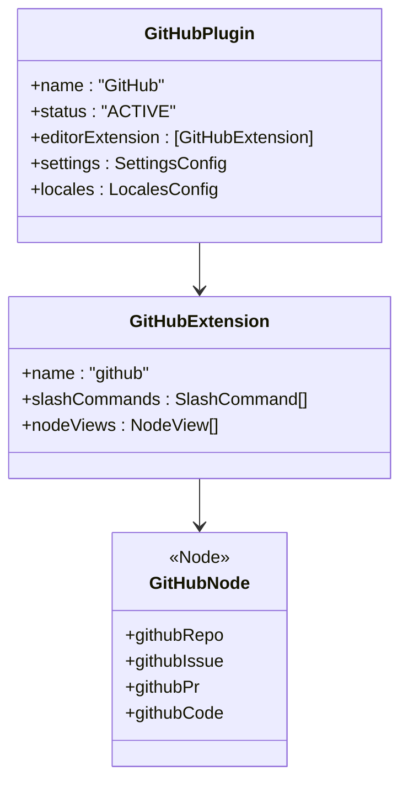
```mermaid
classDiagram
class GitHubPlugin {
+name : "GitHub"
+status : "ACTIVE"
+editorExtension : [GitHubExtension]
+settings : SettingsConfig
+locales : LocalesConfig
}
class GitHubExtension {
+name : "github"
+slashCommands : SlashCommand[]
+nodeViews : NodeView[]
}
class GitHubNode {
<<Node>>
+githubRepo
+githubIssue
+githubPr
+githubCode
}
GitHubPlugin --> GitHubExtension
GitHubExtension --> GitHubNode
```

**图示来源**
- [packages/plugin-github/src/index.tsx](file://packages/plugin-github/src/index.tsx#L11-L48)
- [packages/plugin-github/src/extension/nodes/github-repo-node.tsx](file://packages/plugin-github/src/extension/nodes/github-repo-node.tsx#L4-L39)
- [packages/plugin-github/src/extension/nodes/github-issue-node.tsx](file://packages/plugin-github/src/extension/nodes/github-issue-node.tsx#L4-L40)

**章节来源**
- [packages/plugin-github/src/index.tsx](file://packages/plugin-github/src/index.tsx#L11-L48)
- [packages/plugin-github/src/extension/nodes/github-repo-node.tsx](file://packages/plugin-github/src/extension/nodes/github-repo-node.tsx#L4-L39)
- [packages/plugin-github/src/extension/nodes/github-issue-node.tsx](file://packages/plugin-github/src/extension/nodes/github-issue-node.tsx#L4-L40)

#### 网易云音乐插件
网易云音乐插件提供了音乐嵌入和播放功能：
- 音乐嵌入：支持嵌入网易云音乐歌曲卡片
- 设置配置：提供账号配置和API服务设置
- 图标集成：使用Music图标组件

**章节来源**
- [packages/plugin-netease-music/src/index.tsx](file://packages/plugin-netease-music/src/index.tsx#L9-L41)

#### Office插件
Office插件集成了Excel导入和电子表格编辑能力：
- 电子表格节点：支持在文档中插入和编辑电子表格
- 斜杠命令：提供/spreadsheet、/excel、/import-excel等命令
- 工具函数：提供插入、读取、更新、删除、调整大小等工具
- AI代理技能：提供专业的电子表格专家技能

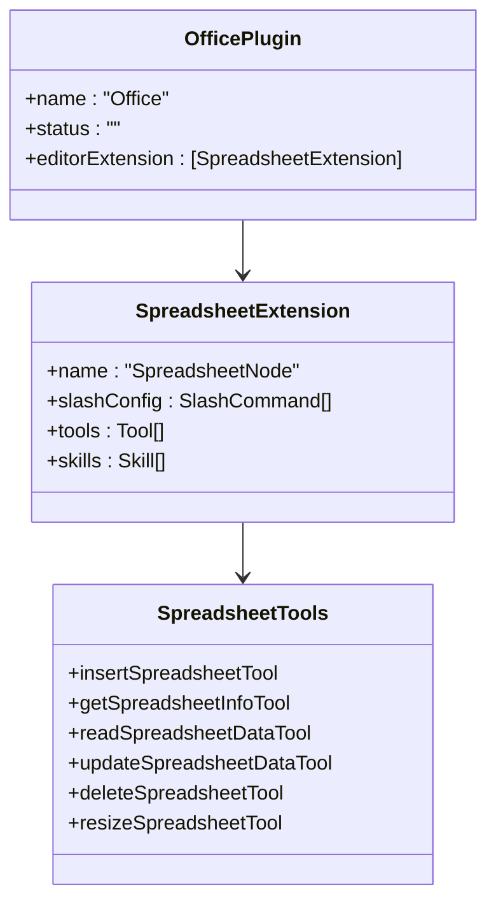
```mermaid
classDiagram
class OfficePlugin {
+name : "Office"
+status : ""
+editorExtension : [SpreadsheetExtension]
}
class SpreadsheetExtension {
+name : "SpreadsheetNode"
+slashConfig : SlashCommand[]
+tools : Tool[]
+skills : Skill[]
}
class SpreadsheetTools {
+insertSpreadsheetTool
+getSpreadsheetInfoTool
+readSpreadsheetDataTool
+updateSpreadsheetDataTool
+deleteSpreadsheetTool
+resizeSpreadsheetTool
}
OfficePlugin --> SpreadsheetExtension
SpreadsheetExtension --> SpreadsheetTools
```

**图示来源**
- [packages/plugin-office/src/index.tsx](file://packages/plugin-office/src/index.tsx#L8-L15)
- [packages/plugin-office/src/spreadsheet/index.tsx](file://packages/plugin-office/src/spreadsheet/index.tsx#L16-L59)
- [packages/plugin-office/src/spreadsheet/tools.ts](file://packages/plugin-office/src/spreadsheet/tools.ts#L87-L166)

**章节来源**
- [packages/plugin-office/src/index.tsx](file://packages/plugin-office/src/index.tsx#L8-L15)
- [packages/plugin-office/src/spreadsheet/index.tsx](file://packages/plugin-office/src/spreadsheet/index.tsx#L16-L59)
- [packages/plugin-office/src/spreadsheet/tools.ts](file://packages/plugin-office/src/spreadsheet/tools.ts#L87-L166)
- [packages/plugin-office/src/spreadsheet/skills.ts](file://packages/plugin-office/src/spreadsheet/skills.ts#L8-L48)

#### Bitable插件增强
Bitable插件提供了完整的多维表格管理功能：
- AI代理工具集：提供查询、插入、更新、删除等工具
- 字段管理：支持字段类型、选项、描述等配置
- 视图管理：支持表格、看板、画廊、日历、甘特图、图表等多种视图
- 记录管理：支持CRUD操作和批量管理
- 数据导入：支持Excel文件导入功能

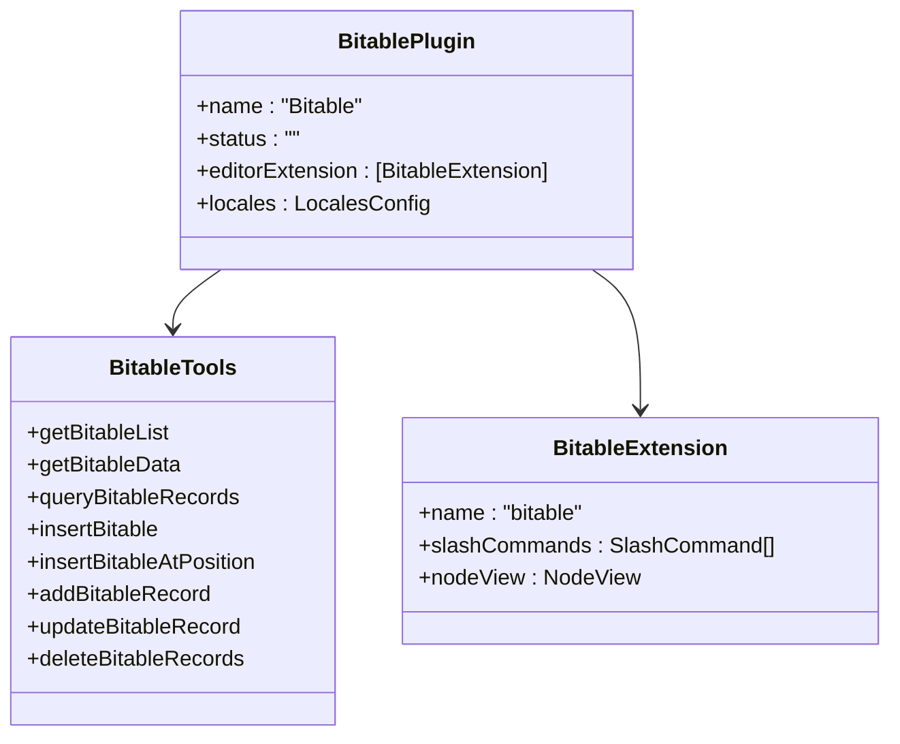
```mermaid
classDiagram
class BitablePlugin {
+name : "Bitable"
+status : ""
+editorExtension : [BitableExtension]
+locales : LocalesConfig
}
class BitableTools {
+getBitableList
+getBitableData
+queryBitableRecords
+insertBitable
+insertBitableAtPosition
+addBitableRecord
+updateBitableRecord
+deleteBitableRecords
}
class BitableExtension {
+name : "bitable"
+slashCommands : SlashCommand[]
+nodeView : NodeView
}
BitablePlugin --> BitableTools
BitablePlugin --> BitableExtension
```

**图示来源**
- [packages/plugin-bitable/src/index.tsx](file://packages/plugin-bitable/src/index.tsx#L10-L698)
- [packages/plugin-bitable/src/bitable/bitable-tools.ts](file://packages/plugin-bitable/src/bitable/bitable-tools.ts#L107-L280)

**章节来源**
- [packages/plugin-bitable/src/index.tsx](file://packages/plugin-bitable/src/index.tsx#L10-L698)
- [packages/plugin-bitable/src/bitable/bitable-tools.ts](file://packages/plugin-bitable/src/bitable/bitable-tools.ts#L107-L280)

## 插件商店生态系统

### Home页面插件展示
门户首页提供了插件生态的精彩展示，包含：
- 插件商店横幅：突出显示插件生态的重要性
- 热门插件展示：AI插件、Mermaid图表、数据库插件、绘图插件等
- 评分系统：星级评分和下载量统计
- 探索按钮：引导用户前往完整的插件市场

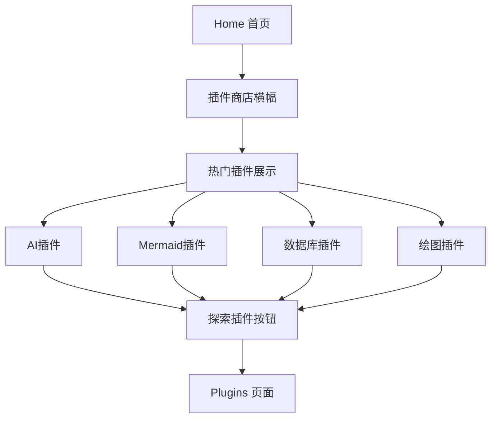
```mermaid
graph TB
Home["Home 首页"] --> PluginStore["插件商店横幅"]
PluginStore --> HotPlugins["热门插件展示"]
HotPlugins --> AIPlugin["AI插件"]
HotPlugins --> MermaidPlugin["Mermaid插件"]
HotPlugins --> DBPlugin["数据库插件"]
HotPlugins --> DrawPlugin["绘图插件"]
AIPlugin --> ExploreBtn["探索插件按钮"]
MermaidPlugin --> ExploreBtn
DBPlugin --> ExploreBtn
DrawPlugin --> ExploreBtn
ExploreBtn --> PluginsPage["Plugins 页面"]
```

**图示来源**
- [apps/landing-page-vite/src/pages/Home/index.tsx](file://apps/landing-page-vite/src/pages/Home/index.tsx#L397-L536)
- [apps/landing-page-vite/src/pages/Home/index.tsx](file://apps/landing-page-vite/src/pages/Home/index.tsx#L528-L535)

**章节来源**
- [apps/landing-page-vite/src/pages/Home/index.tsx](file://apps/landing-page-vite/src/pages/Home/index.tsx#L397-L536)
- [apps/landing-page-vite/src/pages/Home/index.tsx](file://apps/landing-page-vite/src/pages/Home/index.tsx#L528-L535)

### Plugins页面完整插件市场
完整的插件市场页面提供了丰富的功能：
- 搜索功能：支持按名称、描述搜索插件
- 分类筛选：按功能、应用、连接器等分类
- 排序选项：按流行度、最新、评分排序
- 插件卡片：展示插件图标、名称、开发者、评分、下载量
- 详情弹窗：展示插件详细信息和功能特性
- 安装功能：一键安装到Kotion平台

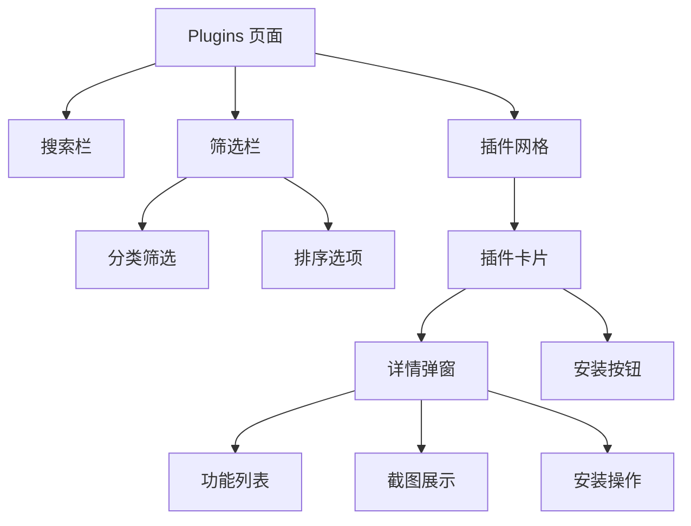
```mermaid
flowchart TD
PluginsPage["Plugins 页面"] --> SearchBar["搜索栏"]
PluginsPage --> FilterBar["筛选栏"]
FilterBar --> CategoryFilter["分类筛选"]
FilterBar --> SortOptions["排序选项"]
PluginsPage --> PluginGrid["插件网格"]
PluginGrid --> PluginCard["插件卡片"]
PluginCard --> DetailDialog["详情弹窗"]
PluginCard --> InstallButton["安装按钮"]
DetailDialog --> FeatureList["功能列表"]
DetailDialog --> Screenshots["截图展示"]
DetailDialog --> InstallAction["安装操作"]
```

**图示来源**
- [apps/landing-page-vite/src/pages/Plugins/index.tsx](file://apps/landing-page-vite/src/pages/Plugins/index.tsx#L72-L328)
- [apps/landing-page-vite/src/pages/Plugins/index.tsx](file://apps/landing-page-vite/src/pages/Plugins/index.tsx#L180-L325)

**章节来源**
- [apps/landing-page-vite/src/pages/Plugins/index.tsx](file://apps/landing-page-vite/src/pages/Plugins/index.tsx#L72-L328)
- [apps/landing-page-vite/src/pages/Plugins/index.tsx](file://apps/landing-page-vite/src/pages/Plugins/index.tsx#L180-L325)

### Templates页面模板市场
模板市场页面提供了模板生态的完整展示：
- 模板分类：按效率、工作、个人、学习、健康、财务等分类
- 搜索功能：支持按名称、描述搜索模板
- 排序选项：按流行度、最新、趋势排序
- 模板预览：多种风格的模板预览展示
- 使用功能：一键使用模板
- 创作者功能：支持模板创作者功能

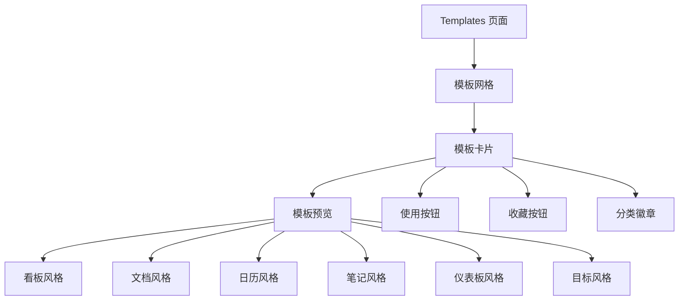
```mermaid
graph TB
TemplatesPage["Templates 页面"] --> TemplateGrid["模板网格"]
TemplateGrid --> TemplateCard["模板卡片"]
TemplateCard --> Preview["模板预览"]
TemplateCard --> UseButton["使用按钮"]
TemplateCard --> FavoriteButton["收藏按钮"]
TemplateCard --> CategoryBadge["分类徽章"]
Preview --> Style1["看板风格"]
Preview --> Style2["文档风格"]
Preview --> Style3["日历风格"]
Preview --> Style4["笔记风格"]
Preview --> Style5["仪表板风格"]
Preview --> Style6["目标风格"]
```

**图示来源**
- [apps/landing-page-vite/src/pages/Templates/index.tsx](file://apps/landing-page-vite/src/pages/Templates/index.tsx#L158-L331)
- [apps/landing-page-vite/src/pages/Templates/index.tsx](file://apps/landing-page-vite/src/pages/Templates/index.tsx#L266-L329)

**章节来源**
- [apps/landing-page-vite/src/pages/Templates/index.tsx](file://apps/landing-page-vite/src/pages/Templates/index.tsx#L158-L331)
- [apps/landing-page-vite/src/pages/Templates/index.tsx](file://apps/landing-page-vite/src/pages/Templates/index.tsx#L266-L329)

### 插件详情页面
PluginDetail组件提供了插件的详细信息展示：
- 基本信息：插件图标、名称、开发者、评分、下载量
- 版本描述：支持多标签页展示不同版本的详细信息
- 功能特性：详细的插件功能介绍
- 统计数据：评分、下载量等统计数据
- 资源链接：仓库链接、主页链接等

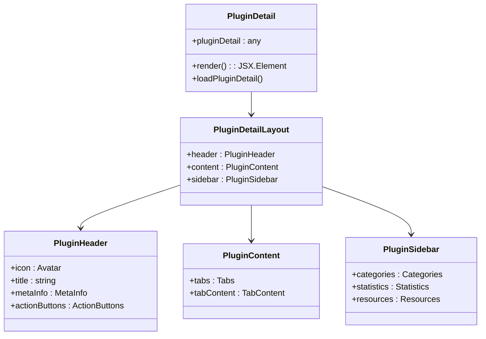
```mermaid
classDiagram
class PluginDetail {
+pluginDetail : any
+render() : JSX.Element
+loadPluginDetail()
}
class PluginDetailLayout {
+header : PluginHeader
+content : PluginContent
+sidebar : PluginSidebar
}
class PluginHeader {
+icon : Avatar
+title : string
+metaInfo : MetaInfo
+actionButtons : ActionButtons
}
class PluginContent {
+tabs : Tabs
+tabContent : TabContent
}
class PluginSidebar {
+categories : Categories
+statistics : Statistics
+resources : Resources
}
PluginDetail --> PluginDetailLayout
PluginDetailLayout --> PluginHeader
PluginDetailLayout --> PluginContent
PluginDetailLayout --> PluginSidebar
```

**图示来源**
- [packages/core/src/components/Shop/PluginDetail/index.tsx](file://packages/core/src/components/Shop/PluginDetail/index.tsx#L26-L227)

**章节来源**
- [packages/core/src/components/Shop/PluginDetail/index.tsx](file://packages/core/src/components/Shop/PluginDetail/index.tsx#L26-L227)

## 国际化支持扩展

### 多语言资源结构
插件系统支持中英文双语环境，资源结构如下：
- 核心应用国际化：packages/core/src/locales/resources.ts
- 门户页面国际化：apps/landing-page-vite/src/locales/resources.ts  
- 支持语言配置：packages/common/src/locales/supported-language.ts

### 门户页面国际化实现
门户页面提供了完整的国际化支持：
- 语言切换组件：LanguageToggle，支持中英语言切换
- 多语言资源：Home、Plugins、Templates页面的完整翻译
- 语言检测：基于浏览器语言偏好自动检测
- 本地存储：用户选择的语言会保存在localStorage中

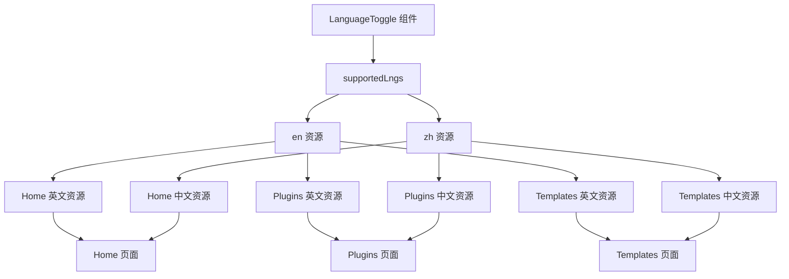
```mermaid
graph TB
LanguageToggle["LanguageToggle 组件"] --> SupportedLngs["supportedLngs"]
SupportedLngs --> EN["en 资源"]
SupportedLngs --> ZH["zh 资源"]
EN --> HomeEN["Home 英文资源"]
EN --> PluginsEN["Plugins 英文资源"]
EN --> TemplatesEN["Templates 英文资源"]
ZH --> HomeZH["Home 中文资源"]
ZH --> PluginsZH["Plugins 中文资源"]
ZH --> TemplatesZH["Templates 中文资源"]
HomeEN --> HomePage["Home 页面"]
PluginsEN --> PluginsPage["Plugins 页面"]
TemplatesEN --> TemplatesPage["Templates 页面"]
HomeZH --> HomePage
PluginsZH --> PluginsPage
TemplatesZH --> TemplatesPage
```

**图示来源**
- [apps/landing-page-vite/src/locales/LanguageToggle.tsx](file://apps/landing-page-vite/src/locales/LanguageToggle.tsx#L1-L44)
- [apps/landing-page-vite/src/locales/resources.ts](file://apps/landing-page-vite/src/locales/resources.ts#L1-L444)
- [packages/common/src/locales/supported-language.ts](file://packages/common/src/locales/supported-language.ts#L1-L2)

**章节来源**
- [apps/landing-page-vite/src/locales/LanguageToggle.tsx](file://apps/landing-page-vite/src/locales/LanguageToggle.tsx#L1-L44)
- [apps/landing-page-vite/src/locales/resources.ts](file://apps/landing-page-vite/src/locales/resources.ts#L1-L444)
- [packages/common/src/locales/supported-language.ts](file://packages/common/src/locales/supported-language.ts#L1-L2)

### 插件市场国际化
插件市场页面也实现了完整的国际化支持：
- Marketplace组件：支持多语言插件列表展示
- 插件详情：支持多语言插件描述和版本信息
- 操作按钮：安装、查看详情等按钮的多语言显示
- 状态信息：搜索结果、分类筛选等界面元素的多语言

**章节来源**
- [packages/core/src/components/Shop/Marketplace/index.tsx](file://packages/core/src/components/Shop/Marketplace/index.tsx#L102-L107)
- [packages/core/src/components/Shop/PluginDetail/index.tsx](file://packages/core/src/components/Shop/PluginDetail/index.tsx#L86-L92)

## UI重构详解

### Shop组件重大UI重构
**更新** Shop组件经历了重大UI重构，引入了现代化的设计理念和交互体验：

#### 新的卡片布局设计
- 采用卡片式设计，每个插件以卡片形式展示
- 支持悬停效果：`hover:shadow-xl` 和 `hover:-translate-y-1` 实现立体悬浮效果
- 渐变背景：`bg-gradient-to-b from-background to-muted/20` 提供视觉层次感
- 响应式网格：支持不同屏幕尺寸的自适应布局

#### 侧边栏头部设计
- 渐变背景：`bg-gradient-to-br from-purple-500 to-blue-500` 的圆形徽标
- 搜索功能：集成搜索输入框，支持实时过滤插件
- 工具栏：包含刷新、上传、管理等操作按钮
- 插件计数：显示已安装插件数量

#### 手风琴插件列表
- 使用 Radix UI Accordion 组件实现展开/折叠功能
- 支持多选展开：`type="multiple"` 允许同时展开多个面板
- 默认展开：`defaultValue={["installed"]}` 设置默认展开状态
- 悬停效果：鼠标悬停时显示操作按钮

#### 交互增强功能
- 工具提示：使用 TooltipProvider 提供上下文相关的帮助信息
- 对话框：使用 AlertDialog 实现安全的卸载确认
- 加载状态：使用 EmptyState 和 Skeleton 提供友好的加载体验
- 动画效果：使用 CSS transition 和 transform 实现流畅的动画

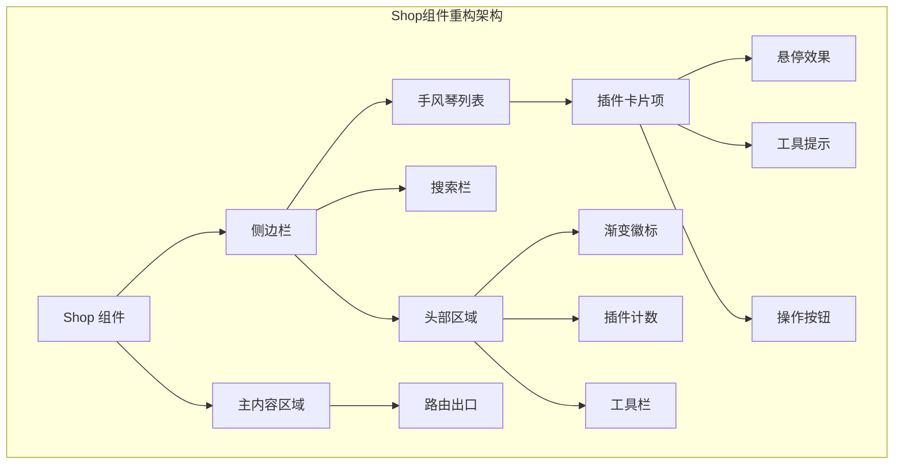
```mermaid
graph TB
subgraph "Shop组件重构架构"
Shop["Shop 组件"] --> Sidebar["侧边栏"]
Sidebar --> Header["头部区域"]
Sidebar --> Search["搜索栏"]
Sidebar --> Accordion["手风琴列表"]
Accordion --> Item["插件卡片项"]
Shop --> MainContent["主内容区域"]
MainContent --> Outlet["路由出口"]
Header --> Logo["渐变徽标"]
Header --> Count["插件计数"]
Header --> Tools["工具栏"]
Item --> Hover["悬停效果"]
Item --> Tooltip["工具提示"]
Item --> Actions["操作按钮"]
end
```

**图示来源**
- [packages/core/src/components/Shop/index.tsx](file://packages/core/src/components/Shop/index.tsx#L136-L338)
- [packages/ui/src/components/ui/accordion.tsx](file://packages/ui/src/components/ui/accordion.tsx#L1-L56)

**章节来源**
- [packages/core/src/components/Shop/index.tsx](file://packages/core/src/components/Shop/index.tsx#L1-L338)
- [packages/ui/src/components/ui/accordion.tsx](file://packages/ui/src/components/ui/accordion.tsx#L1-L56)

### Marketplace组件视觉设计
**更新** Marketplace组件采用了全新的视觉设计，提供现代化的插件浏览体验：

#### 渐变背景与标题设计
- 渐变背景：`from-background to-muted/20` 提供柔和的视觉过渡
- 大标题设计：使用渐变文字效果，增强品牌识别度
- 英雄区域：居中布局，提供清晰的视觉焦点

#### 卡片网格布局
- 响应式网格：支持从移动端到超大屏的自适应布局
- 卡片设计：每个插件以卡片形式展示，包含图标、名称、开发者信息、评分等
- 悬停效果：`hover:shadow-xl` 和 `hover:-translate-y-1` 提供立体感
- 动画效果：使用 `animate-in fade-in-50 duration-500` 实现淡入效果

#### 加载状态优化
- 骨架屏：使用 Skeleton 组件提供占位符动画
- 延迟显示：通过 `setTimeout` 避免快速加载时的闪烁
- 并行动画：卡片按序号延迟显示，创造有序的加载体验

#### 交互元素增强
- 分类标签：使用圆角按钮实现分类筛选
- 排序功能：支持按相关性、流行度、最近添加、最高评分排序
- 操作按钮：提供安装和查看详情按钮
- CTA区域：专门的创作引导区域，鼓励用户创建插件

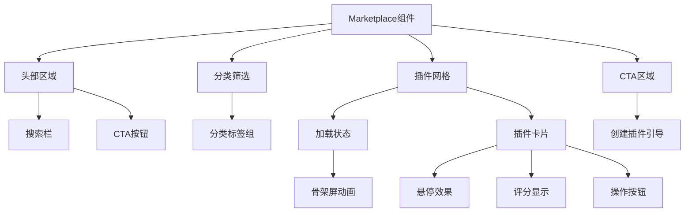
```mermaid
flowchart TD
A["Marketplace组件"] --> B["头部区域"]
B --> C["搜索栏"]
B --> D["CTA按钮"]
A --> E["分类筛选"]
E --> F["分类标签组"]
A --> G["插件网格"]
G --> H["加载状态"]
H --> I["骨架屏动画"]
G --> J["插件卡片"]
J --> K["悬停效果"]
J --> L["评分显示"]
J --> M["操作按钮"]
A --> N["CTA区域"]
N --> O["创建插件引导"]
```

**图示来源**
- [packages/core/src/components/Shop/Marketplace/index.tsx](file://packages/core/src/components/Shop/Marketplace/index.tsx#L1-L290)

**章节来源**
- [packages/core/src/components/Shop/Marketplace/index.tsx](file://packages/core/src/components/Shop/Marketplace/index.tsx#L1-L290)

### 插件管理器增强功能
**更新** 插件管理器新增了多项增强功能，提供更强大的插件管理能力：

#### 统计概览
- 总计插件数：显示插件总数
- 状态分布：分别显示已启用、已禁用、待审核插件数量
- 颜色编码：使用不同颜色区分插件状态

#### 分类筛选系统
- 状态分类：支持按全部、已启用、已禁用、待审核筛选
- 类型分类：支持按功能、界面增强、集成、工具筛选
- 实时更新：筛选结果即时反映在右侧列表中

#### 批量操作功能
- 复选框选择：支持多选插件进行批量操作
- 全选功能：一键选择所有可见插件
- 批量启用/禁用：支持批量修改插件状态
- 批量删除：支持批量删除插件

#### 详情面板
- 侧边详情：点击插件显示详细信息面板
- 快捷操作：提供启用/禁用、发布、设置、删除等快捷操作
- 版本历史：显示插件版本历史信息
- 开发者信息：显示插件开发者和维护者信息

#### 高级搜索与排序
- 搜索功能：支持按名称、开发者、维护者、描述搜索
- 排序选项：支持按名称、状态、最后更新、创建时间排序
- 排序方向：支持升序/降序切换

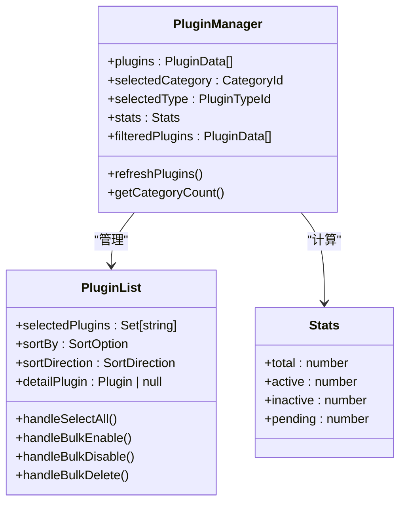
```mermaid
classDiagram
class PluginManager {
+plugins : PluginData[]
+selectedCategory : CategoryId
+selectedType : PluginTypeId
+stats : Stats
+filteredPlugins : PluginData[]
+refreshPlugins()
+getCategoryCount()
}
class PluginList {
+selectedPlugins : Set[string]
+sortBy : SortOption
+sortDirection : SortDirection
+detailPlugin : Plugin | null
+handleSelectAll()
+handleBulkEnable()
+handleBulkDisable()
+handleBulkDelete()
}
class Stats {
+total : number
+active : number
+inactive : number
+pending : number
}
PluginManager --> PluginList : "管理"
PluginManager --> Stats : "计算"
```

**图示来源**
- [packages/core/src/components/Shop/PluginManager/index.tsx](file://packages/core/src/components/Shop/PluginManager/index.tsx#L1-L214)
- [packages/core/src/components/Shop/PluginManager/PluginList.tsx](file://packages/core/src/components/Shop/PluginManager/PluginList.tsx#L1-L952)

**章节来源**
- [packages/core/src/components/Shop/PluginManager/index.tsx](file://packages/core/src/components/Shop/PluginManager/index.tsx#L1-L214)
- [packages/core/src/components/Shop/PluginManager/PluginList.tsx](file://packages/core/src/components/Shop/PluginManager/PluginList.tsx#L1-L952)

## 依赖关系分析
- 组件耦合
  - PluginManager 与 importScript、EventEmitter、editor、menu、route、locales 等模块存在松耦合依赖，通过接口与类型约束降低耦合度。
  - Shop组件与UI组件库（@kn/ui）和图标库（@kn/icon）紧密集成。
  - 插件管理器依赖Radix UI的Accordion组件实现手风琴功能。
  - 门户页面与插件商店通过API接口进行数据交互。
  - 国际化系统通过LanguageDetector实现语言自动检测。
  - 应用入口通过App组件接收插件数组，实现完全动态的插件配置。
  - 新增插件依赖：GitHub插件依赖@kn/editor和自定义组件，Office插件依赖Univer电子表格引擎，Bitable插件依赖复杂的类型定义和工具集。
- 依赖可视化

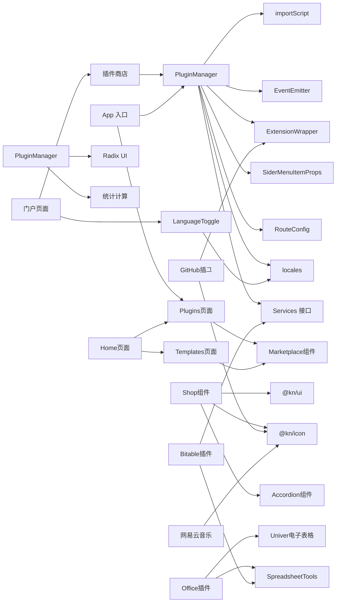
```mermaid
graph LR
PM["PluginManager"] --> Import["importScript"]
PM --> Event["EventEmitter"]
PM --> Editor["ExtensionWrapper"]
PM --> Menu["SiderMenuItemProps"]
PM --> Route["RouteConfig"]
PM --> Locales["locales"]
PM --> Types["Services 接口"]
Store["插件商店"] --> PM
AppEntry["App 入口"] --> PM
AppEntry --> Plugins["插件数组"]
Shop["Shop组件"] --> UI["@kn/ui"]
Shop --> Icons["@kn/icon"]
Shop --> Accordion["Accordion组件"]
PluginManager --> RadixUI["Radix UI"]
PluginManager --> Stats["统计计算"]
Portal["门户页面"] --> Store
Portal --> LanguageToggle["LanguageToggle"]
LanguageToggle --> Locales
Home["Home页面"] --> Plugins["Plugins页面"]
Home --> Templates["Templates页面"]
Plugins --> Marketplace["Marketplace组件"]
Templates --> Marketplace
GitHub["GitHub插그"] --> Editor
GitHub --> Icons
Office["Office插件"] --> Univer["Univer电子表格"]
Office --> Tools["SpreadsheetTools"]
Bitable["Bitable插件"] --> Tools
Bitable --> Types
NetEase["网易云音乐"] --> Icons
```

**图示来源**
- [packages/common/src/core/PluginManager.ts](file://packages/common/src/core/PluginManager.ts#L99-L489)
- [packages/common/src/utils/import-util.ts](file://packages/common/src/utils/import-util.ts#L12-L39)
- [packages/common/src/event/event.ts](file://packages/common/src/event/event.ts#L1-L44)
- [packages/common/src/core/editor.ts](file://packages/common/src/core/editor.ts#L1-L31)
- [packages/common/src/core/menu.ts](file://packages/common/src/core/menu.ts#L1-L25)
- [packages/common/src/core/route.ts](file://packages/common/src/core/route.ts#L1-L8)
- [packages/common/src/locales/index.ts](file://packages/common/src/locales/index.ts#L1-L6)
- [packages/common/src/core/types.ts](file://packages/common/src/core/types.ts#L1-L4)
- [packages/core/src/components/Shop/Marketplace/index.tsx](file://packages/core/src/components/Shop/Marketplace/index.tsx#L62-L74)
- [packages/core/src/App.tsx](file://packages/core/src/App.tsx#L55-L59)
- [packages/core/src/components/Shop/index.tsx](file://packages/core/src/components/Shop/index.tsx#L1-L338)
- [packages/ui/src/components/ui/accordion.tsx](file://packages/ui/src/components/ui/accordion.tsx#L1-L56)
- [apps/landing-page-vite/src/pages/Home/index.tsx](file://apps/landing-page-vite/src/pages/Home/index.tsx#L528-L551)
- [apps/landing-page-vite/src/locales/LanguageToggle.tsx](file://apps/landing-page-vite/src/locales/LanguageToggle.tsx#L1-L44)
- [apps/vite/src/main.tsx](file://apps/vite/src/main.tsx#L21-L22)
- [packages/plugin-github/src/index.tsx](file://packages/plugin-github/src/index.tsx#L1-L51)
- [packages/plugin-office/src/index.tsx](file://packages/plugin-office/src/index.tsx#L1-L16)
- [packages/plugin-bitable/src/index.tsx](file://packages/plugin-bitable/src/index.tsx#L1-L699)
- [packages/plugin-netease-music/src/index.tsx](file://packages/plugin-netease-music/src/index.tsx#L1-L42)

**章节来源**
- [packages/common/src/core/PluginManager.ts](file://packages/common/src/core/PluginManager.ts#L99-L489)
- [packages/common/src/utils/import-util.ts](file://packages/common/src/utils/import-util.ts#L12-L39)
- [packages/common/src/event/event.ts](file://packages/common/src/event/event.ts#L1-L44)
- [packages/common/src/core/editor.ts](file://packages/common/src/core/editor.ts#L1-L31)
- [packages/common/src/core/menu.ts](file://packages/common/src/core/menu.ts#L1-L25)
- [packages/common/src/core/route.ts](file://packages/common/src/core/route.ts#L1-L8)
- [packages/common/src/locales/index.ts](file://packages/common/src/locales/index.ts#L1-L6)
- [packages/common/src/core/types.ts](file://packages/common/src/core/types.ts#L1-L4)
- [packages/core/src/components/Shop/Marketplace/index.tsx](file://packages/core/src/components/Shop/Marketplace/index.tsx#L62-L74)
- [packages/core/src/App.tsx](file://packages/core/src/App.tsx#L55-L59)
- [packages/core/src/components/Shop/index.tsx](file://packages/core/src/components/Shop/index.tsx#L1-L338)
- [packages/ui/src/components/ui/accordion.tsx](file://packages/ui/src/components/ui/accordion.tsx#L1-L56)
- [apps/landing-page-vite/src/pages/Home/index.tsx](file://apps/landing-page-vite/src/pages/Home/index.tsx#L528-L551)
- [apps/landing-page-vite/src/locales/LanguageToggle.tsx](file://apps/landing-page-vite/src/locales/LanguageToggle.tsx#L1-L44)
- [apps/vite/src/main.tsx](file://apps/vite/src/main.tsx#L21-L22)
- [packages/plugin-github/src/index.tsx](file://packages/plugin-github/src/index.tsx#L1-L51)
- [packages/plugin-office/src/index.tsx](file://packages/plugin-office/src/index.tsx#L1-L16)
- [packages/plugin-bitable/src/index.tsx](file://packages/plugin-bitable/src/index.tsx#L1-L699)
- [packages/plugin-netease-music/src/index.tsx](file://packages/plugin-netease-music/src/index.tsx#L1-L42)

## 性能考量
- 动态加载优化
  - 利用 importScript 的缓存机制减少重复请求；对大型插件采用分包与懒加载策略。
- 并发加载
  - 使用 Promise.allSettled 并发加载远程插件，缩短初始化时间。
- 资源合并
  - 合并 locales 与服务时避免深层嵌套导致的性能问题，建议按插件维度拆分资源。
- 事件驱动刷新
  - 通过事件总线触发刷新，避免全量重渲染，提升交互响应速度。
- 插件商店性能
  - 使用虚拟滚动和分页加载插件列表，避免一次性加载过多插件造成性能问题。
  - 实施插件安装状态缓存，减少重复的 API 调用。
  - 骨架屏加载优化，改善用户体验。
- UI性能优化
  - 使用CSS动画替代JavaScript动画，提升渲染性能。
  - 实现骨架屏加载，改善用户体验。
  - 使用React.memo和useMemo优化组件重渲染。
- 国际化性能
  - 门户页面的国际化资源按需加载，避免不必要的资源传输。
  - 语言切换时使用缓存机制，减少重复的资源加载。
- 应用入口性能
  - 插件数组的传递和处理采用优化算法，避免重复计算。
  - 插件实例的缓存和复用提升应用启动性能。
- 新插件性能
  - GitHub插件的节点渲染需要优化，避免大量DOM节点造成的性能问题。
  - Office插件的电子表格操作需要节流处理，防止频繁的DOM更新。
  - Bitable插件的数据操作需要批量处理，减少多次状态更新。

**更新** 新增了GitHub、网易云音乐、Office、Bitable等新插件的性能考量。

## 故障排查指南
- 插件未加载
  - 检查 importScript 的 URL 是否正确、网络是否可达、window 全局命名空间是否存在插件对象。
- 插件卸载后 UI 未更新
  - 确认 uninstallPlugin 是否触发了 REFRESH_PLUSINS 事件，以及订阅方是否正确处理刷新逻辑。
- 路由冲突
  - 校验 routes 与 globalRoutes 的 path 是否唯一，避免重复注册。
- 国际化资源缺失
  - 对比合并后的 locales，确认插件是否提供对应语言资源，避免 key 冲突。
- 编辑器扩展异常
  - 检查 ExtensionWrapper 的 menuConfig/slashConfig/floatMenuConfig/tools 字段是否完整，group 分类是否正确。
- 插件商店问题
  - 检查插件元数据格式是否符合要求，验证 API 响应格式和状态码。
  - 确认插件安装过程中的错误处理和用户反馈机制。
- UI组件问题
  - 检查@kn/ui和@kn/icon库的版本兼容性。
  - 确认Radix UI Accordion组件的正确使用。
  - 验证CSS类名和样式是否正确应用。
- 门户页面国际化问题
  - 检查LanguageToggle组件的语言切换功能是否正常。
  - 确认localStorage中的语言设置是否正确保存。
  - 验证门户页面的多语言资源是否完整加载。
- 应用入口问题
  - 检查插件数组的传递是否正确，确保所有插件实例都能被 PluginManager 正确识别。
  - 验证插件的加载顺序和依赖关系。
  - 确认插件实例的构造参数和配置是否正确。
- 新插件问题
  - GitHub插件：检查节点渲染是否正常，斜杠命令是否可用，设置配置是否生效。
  - 网易云音乐插件：验证音乐嵌入功能，检查设置组件的交互。
  - Office插件：确认电子表格节点的插入、读取、更新操作正常。
  - Bitable插件：验证AI代理工具的调用和数据处理功能。
- 性能问题
  - 检查插件列表渲染性能，考虑使用虚拟滚动。
  - 确认动画效果不会影响页面性能。
  - 验证骨架屏加载逻辑是否正常工作。
  - 检查门户页面的国际化资源加载性能。
  - 验证应用入口的插件数组处理性能。
  - 优化新插件的性能瓶颈，如GitHub节点的大量DOM操作、Office插件的频繁状态更新、Bitable插件的数据处理等。

**更新** 新增了GitHub、网易云音乐、Office、Bitable等新插件的故障排查指南。

**章节来源**
- [packages/common/src/utils/import-util.ts](file://packages/common/src/utils/import-util.ts#L12-L39)
- [packages/common/src/event/event.ts](file://packages/common/src/event/event.ts#L1-L44)
- [packages/common/src/core/PluginManager.ts](file://packages/common/src/core/PluginManager.ts#L230-L290)
- [packages/common/src/core/route.ts](file://packages/common/src/core/route.ts#L1-L8)
- [packages/common/src/core/editor.ts](file://packages/common/src/core/editor.ts#L1-L31)
- [packages/core/src/components/Shop/Marketplace/index.tsx](file://packages/core/src/components/Shop/Marketplace/index.tsx#L62-L74)
- [packages/core/src/App.tsx](file://packages/core/src/App.tsx#L64-L75)
- [packages/core/src/components/Shop/index.tsx](file://packages/core/src/components/Shop/index.tsx#L1-L338)
- [packages/ui/src/components/ui/accordion.tsx](file://packages/ui/src/components/ui/accordion.tsx#L1-L56)
- [apps/landing-page-vite/src/locales/LanguageToggle.tsx](file://apps/landing-page-vite/src/locales/LanguageToggle.tsx#L1-L44)
- [apps/vite/src/main.tsx](file://apps/vite/src/main.tsx#L21-L22)
- [packages/plugin-github/src/index.tsx](file://packages/plugin-github/src/index.tsx#L1-L51)
- [packages/plugin-netease-music/src/index.tsx](file://packages/plugin-netease-music/src/index.tsx#L1-L42)
- [packages/plugin-office/src/index.tsx](file://packages/plugin-office/src/index.tsx#L1-L16)
- [packages/plugin-bitable/src/index.tsx](file://packages/plugin-bitable/src/index.tsx#L1-L699)

## 结论
该插件系统通过 PluginManager 实现了插件的动态加载、生命周期管理与能力聚合，结合 importScript、EventEmitter、国际化与编辑器扩展包装，形成了可扩展、可维护的插件生态。**更新** 本次重大更新反映了插件系统架构的完全演进：新增GitHub、网易云音乐、Office插件的集成模式，以及Bitable插件的增强功能，体现了更加丰富和完整的插件生态系统。GitHub插件提供了GitHub资源的嵌入能力，网易云音乐插件支持音乐内容的嵌入和配置，Office插件集成了Excel导入和电子表格编辑功能，Bitable插件提供了完整的多维表格管理和AI代理工具集。这些新功能的加入使得插件系统能够更好地满足用户在代码协作、媒体内容、办公自动化和数据管理等方面的需求。插件商店的完善、国际化支持的增强、UI设计的现代化，都为插件开发者和用户提供了更好的开发和使用体验。开发者可依据本文档的最佳实践与扩展点设计，快速开发高质量插件并稳定集成到知识库系统中。

## 附录
- 插件中心组件
  - 插件中心组件作为入口，负责调用 PluginManager 并渲染插件生态，参考 [packages/core/src/components/PluginHub/index.tsx](file://packages/core/src/components/PluginHub/index.tsx)。
- 插件商店组件
  - 插件商店提供插件发现、安装、管理功能，参考 [packages/core/src/components/Shop/Marketplace/index.tsx](file://packages/core/src/components/Shop/Marketplace/index.tsx)。
- 插件管理器组件
  - 提供插件的高级管理功能，包括分类筛选、批量操作、详情面板等，参考 [packages/core/src/components/Shop/PluginManager/index.tsx](file://packages/core/src/components/Shop/PluginManager/index.tsx)。
- 插件详情组件
  - 提供插件详细信息展示和版本描述，参考 [packages/core/src/components/Shop/PluginDetail/index.tsx](file://packages/core/src/components/Shop/PluginDetail/index.tsx)。
- 门户页面组件
  - Home、Plugins、Templates页面提供完整的生态展示，参考 [apps/landing-page-vite/src/pages/Home/index.tsx](file://apps/landing-page-vite/src/pages/Home/index.tsx)、[apps/landing-page-vite/src/pages/Plugins/index.tsx](file://apps/landing-page-vite/src/pages/Plugins/index.tsx)、[apps/landing-page-vite/src/pages/Templates/index.tsx](file://apps/landing-page-vite/src/pages/Templates/index.tsx)。
- 应用入口配置
  - 应用入口通过 App.tsx 初始化 PluginManager，参考 [packages/core/src/App.tsx](file://packages/core/src/App.tsx)。
- 插件实例示例
  - Weaver OA 插件实例，参考 [packages/plugin-weaver-oa/src/index.tsx](file://packages/plugin-weaver-oa/src/index.tsx)。
  - Bilibili 插件实例，参考 [packages/plugin-bilibili/src/index.tsx](file://packages/plugin-bilibili/src/index.tsx)。
  - GitHub 插件实例，参考 [packages/plugin-github/src/index.tsx](file://packages/plugin-github/src/index.tsx)。
  - 网易云音乐插件实例，参考 [packages/plugin-netease-music/src/index.tsx](file://packages/plugin-netease-music/src/index.tsx)。
  - Office插件实例，参考 [packages/plugin-office/src/index.tsx](file://packages/plugin-office/src/index.tsx)。
  - Bitable插件实例，参考 [packages/plugin-bitable/src/index.tsx](file://packages/plugin-bitable/src/index.tsx)。

**章节来源**
- [packages/core/src/components/PluginHub/index.tsx](file://packages/core/src/components/PluginHub/index.tsx#L1-L6)
- [packages/core/src/components/Shop/Marketplace/index.tsx](file://packages/core/src/components/Shop/Marketplace/index.tsx#L1-L290)
- [packages/core/src/components/Shop/PluginManager/index.tsx](file://packages/core/src/components/Shop/PluginManager/index.tsx#L1-L214)
- [packages/core/src/components/Shop/PluginDetail/index.tsx](file://packages/core/src/components/Shop/PluginDetail/index.tsx#L1-L229)
- [apps/landing-page-vite/src/pages/Home/index.tsx](file://apps/landing-page-vite/src/pages/Home/index.tsx#L1-L1039)
- [apps/landing-page-vite/src/pages/Plugins/index.tsx](file://apps/landing-page-vite/src/pages/Plugins/index.tsx#L1-L427)
- [apps/landing-page-vite/src/pages/Templates/index.tsx](file://apps/landing-page-vite/src/pages/Templates/index.tsx#L1-L432)
- [packages/core/src/App.tsx](file://packages/core/src/App.tsx#L55-L59)
- [packages/plugin-weaver-oa/src/index.tsx](file://packages/plugin-weaver-oa/src/index.tsx#L33-L36)
- [packages/plugin-bilibili/src/index.tsx](file://packages/plugin-bilibili/src/index.tsx#L29-L33)
- [packages/plugin-github/src/index.tsx](file://packages/plugin-github/src/index.tsx#L1-L51)
- [packages/plugin-netease-music/src/index.tsx](file://packages/plugin-netease-music/src/index.tsx#L1-L42)
- [packages/plugin-office/src/index.tsx](file://packages/plugin-office/src/index.tsx#L1-L16)
- [packages/plugin-bitable/src/index.tsx](file://packages/plugin-bitable/src/index.tsx#L1-L699)