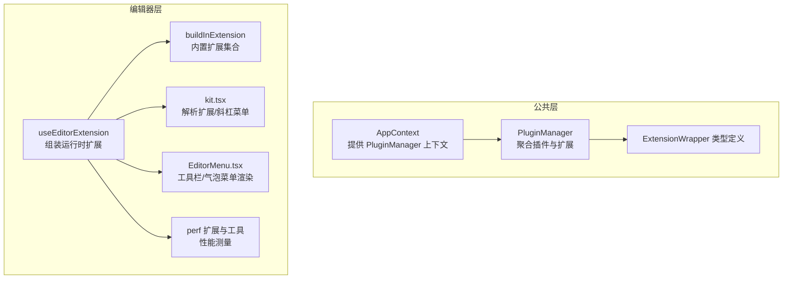
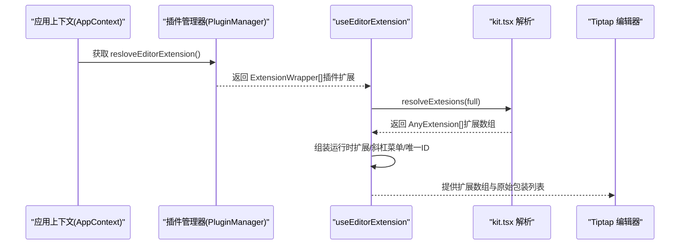
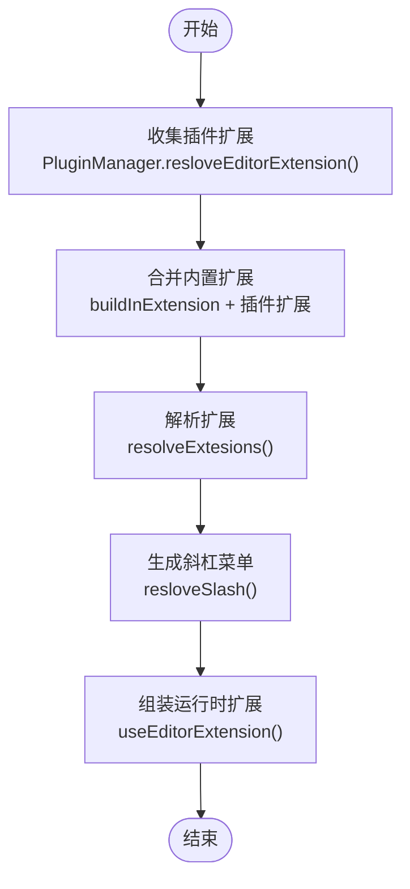
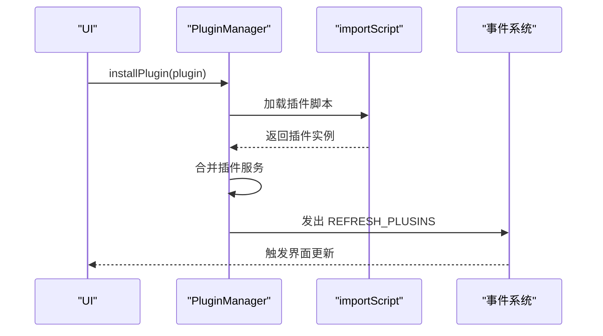
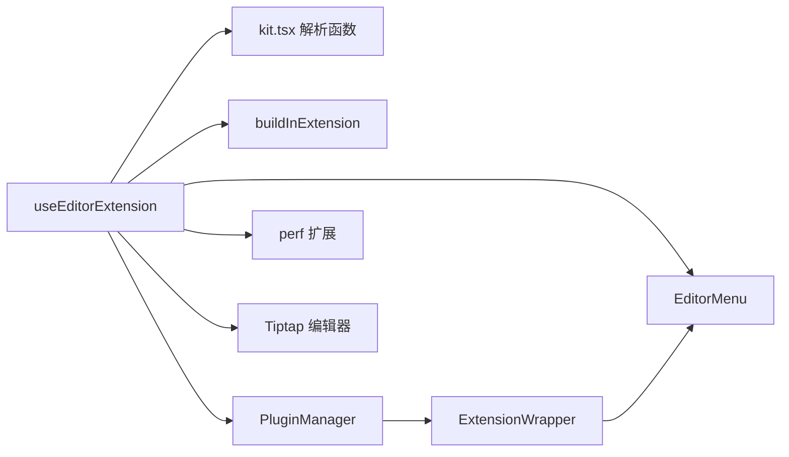

# 插件编辑器集成

<cite>
**本文引用的文件**
- [packages/common/src/core/editor.ts](file://packages/common/src/core/editor.ts)
- [packages/common/src/core/PluginManager.ts](file://packages/common/src/core/PluginManager.ts)
- [packages/common/src/core/AppContext.ts](file://packages/common/src/core/AppContext.ts)
- [packages/editor/src/editor/use-extension.ts](file://packages/editor/src/editor/use-extension.ts)
- [packages/editor/src/editor/build-in-extension.ts](file://packages/editor/src/editor/build-in-extension.ts)
- [packages/editor/src/editor/kit.tsx](file://packages/editor/src/editor/kit.tsx)
- [packages/editor/src/editor/EditorMenu.tsx](file://packages/editor/src/editor/EditorMenu.tsx)
- [packages/editor/src/extensions/link/link.ts](file://packages/editor/src/extensions/link/link.ts)
- [packages/editor/src/extensions/ident/ident.ts](file://packages/editor/src/extensions/ident/ident.ts)
- [packages/editor/src/extensions/perf/utilities.ts](file://packages/editor/src/extensions/perf/utilities.ts)
- [packages/editor/src/extensions/perf/perf.ts](file://packages/editor/src/extensions/perf/perf.ts)
- [packages/core/tsconfig.json](file://packages/core/tsconfig.json)
</cite>

## 目录
1. [引言](#引言)
2. [项目结构](#项目结构)
3. [核心组件](#核心组件)
4. [架构总览](#架构总览)
5. [详细组件分析](#详细组件分析)
6. [依赖关系分析](#依赖关系分析)
7. [性能考虑](#性能考虑)
8. [故障排查指南](#故障排查指南)
9. [结论](#结论)
10. [附录：自定义扩展开发指南](#附录自定义扩展开发指南)

## 引言
本文件围绕“插件编辑器集成”主题，系统性梳理了 ExtensionWrapper 接口设计、编辑器扩展配置结构（扩展类型、工具栏配置、快捷键绑定）、resloveEditorExtension 的扩展解析与合并策略、插件扩展与 Tiptap 编辑器的集成方式与生命周期管理、动态加载与卸载机制，以及调试与性能监控策略，并提供自定义扩展开发的最佳实践。

## 项目结构
该功能横跨公共层与编辑器包，关键位置如下：
- 公共层定义扩展包装器与插件管理器，负责扩展聚合与动态加载
- 编辑器层负责扩展解析、工具栏渲染、快捷键与斜杠菜单集成、性能监控等

图表来源
- [packages/common/src/core/AppContext.ts](file://packages/common/src/core/AppContext.ts#L1-L13)
- [packages/common/src/core/PluginManager.ts](file://packages/common/src/core/PluginManager.ts#L146-L154)
- [packages/common/src/core/editor.ts](file://packages/common/src/core/editor.ts#L1-L30)
- [packages/editor/src/editor/use-extension.ts](file://packages/editor/src/editor/use-extension.ts#L1-L63)
- [packages/editor/src/editor/build-in-extension.ts](file://packages/editor/src/editor/build-in-extension.ts#L1-L56)
- [packages/editor/src/editor/kit.tsx](file://packages/editor/src/editor/kit.tsx#L1-L87)
- [packages/editor/src/editor/EditorMenu.tsx](file://packages/editor/src/editor/EditorMenu.tsx#L1-L89)
- [packages/editor/src/extensions/perf/perf.ts](file://packages/editor/src/extensions/perf/perf.ts#L1-L41)

章节来源
- [packages/common/src/core/AppContext.ts](file://packages/common/src/core/AppContext.ts#L1-L13)
- [packages/common/src/core/PluginManager.ts](file://packages/common/src/core/PluginManager.ts#L1-L170)
- [packages/common/src/core/editor.ts](file://packages/common/src/core/editor.ts#L1-L30)
- [packages/editor/src/editor/use-extension.ts](file://packages/editor/src/editor/use-extension.ts#L1-L63)
- [packages/editor/src/editor/build-in-extension.ts](file://packages/editor/src/editor/build-in-extension.ts#L1-L56)
- [packages/editor/src/editor/kit.tsx](file://packages/editor/src/editor/kit.tsx#L1-L87)
- [packages/editor/src/editor/EditorMenu.tsx](file://packages/editor/src/editor/EditorMenu.tsx#L1-L89)
- [packages/editor/src/extensions/perf/perf.ts](file://packages/editor/src/extensions/perf/perf.ts#L1-L41)

## 核心组件
- ExtensionWrapper：统一承载扩展元信息与 UI 配置（菜单、气泡菜单、浮动菜单、斜杠菜单、工具）
- PluginManager：聚合各插件的 editorExtension 列表，支持动态安装/卸载与服务合并
- useEditorExtension：组装运行时扩展、解析插件扩展、生成斜杠菜单、注入唯一 ID 等
- buildInExtension：内置扩展集合，作为默认扩展基线
- kit.tsx：扩展解析与斜杠菜单生成的核心逻辑
- EditorMenu：根据 ExtensionWrapper 渲染工具栏、气泡菜单与浮动菜单

章节来源
- [packages/common/src/core/editor.ts](file://packages/common/src/core/editor.ts#L1-L30)
- [packages/common/src/core/PluginManager.ts](file://packages/common/src/core/PluginManager.ts#L146-L154)
- [packages/editor/src/editor/use-extension.ts](file://packages/editor/src/editor/use-extension.ts#L1-L63)
- [packages/editor/src/editor/build-in-extension.ts](file://packages/editor/src/editor/build-in-extension.ts#L1-L56)
- [packages/editor/src/editor/kit.tsx](file://packages/editor/src/editor/kit.tsx#L1-L87)
- [packages/editor/src/editor/EditorMenu.tsx](file://packages/editor/src/editor/EditorMenu.tsx#L1-L89)

## 架构总览
以下序列图展示了从应用上下文到编辑器扩展装配的关键流程：

图表来源
- [packages/common/src/core/AppContext.ts](file://packages/common/src/core/AppContext.ts#L1-L13)
- [packages/common/src/core/PluginManager.ts](file://packages/common/src/core/PluginManager.ts#L146-L154)
- [packages/editor/src/editor/use-extension.ts](file://packages/editor/src/editor/use-extension.ts#L1-L63)
- [packages/editor/src/editor/kit.tsx](file://packages/editor/src/editor/kit.tsx#L1-L87)

## 详细组件分析

### ExtensionWrapper 接口与配置结构
- 字段说明
  - extendsion：可为单个扩展或扩展数组
  - name：扩展名称
  - menuConfig：工具栏分组与菜单组件配置
  - bubbleMenu：气泡菜单组件（单个或数组）
  - flotMenuConfig：浮动菜单组件数组
  - slashConfig：斜杠菜单项数组（含图标、文本、触发符、动作、渲染器或分隔符）
  - tools：工具定义（描述、输入模式、执行函数）

- 工具栏分组
  - Group 类型包含 block、inline、mark、custom 四类，用于组织工具栏布局

章节来源
- [packages/common/src/core/editor.ts](file://packages/common/src/core/editor.ts#L1-L30)

### 插件扩展聚合与解析：resloveEditorExtension 与 resolveExtesions
- 聚合策略
  - PluginManager 将所有插件的 editorExtensions 合并为一个 ExtensionWrapper[] 列表
- 解析策略
  - resolveExtesions 将 ExtensionWrapper[].extendsion 展开为 AnyExtension[]（数组或单个）
- 斜杠菜单
  - resloveSlash 收集所有 slashConfig 并生成统一的斜杠菜单扩展

图表来源
- [packages/common/src/core/PluginManager.ts](file://packages/common/src/core/PluginManager.ts#L146-L154)
- [packages/editor/src/editor/build-in-extension.ts](file://packages/editor/src/editor/build-in-extension.ts#L1-L56)
- [packages/editor/src/editor/kit.tsx](file://packages/editor/src/editor/kit.tsx#L1-L87)
- [packages/editor/src/editor/use-extension.ts](file://packages/editor/src/editor/use-extension.ts#L1-L63)

章节来源
- [packages/common/src/core/PluginManager.ts](file://packages/common/src/core/PluginManager.ts#L146-L154)
- [packages/editor/src/editor/kit.tsx](file://packages/editor/src/editor/kit.tsx#L1-L87)
- [packages/editor/src/editor/use-extension.ts](file://packages/editor/src/editor/use-extension.ts#L1-L63)

### 编辑器扩展与 Tiptap 集成及生命周期
- 集成点
  - 运行时扩展：由 useEditorExtension 组装，包含文档、段落、文本、撤销重做、占位符、尾随节点、性能插件、气泡菜单等
  - 唯一 ID：在最终阶段注入 UniqueID，过滤协作变更来源的事务
- 生命周期
  - 初始化：通过 useEditorExtension 汇总扩展并传入编辑器 Provider
  - 运行期：扩展在编辑器实例化后生效；工具栏与菜单组件随扩展注册而渲染
  - 卸载：通过过滤指定扩展名实现按需移除（如 ext 参数）

章节来源
- [packages/editor/src/editor/use-extension.ts](file://packages/editor/src/editor/use-extension.ts#L1-L63)
- [packages/editor/src/editor/build-in-extension.ts](file://packages/editor/src/editor/build-in-extension.ts#L1-L56)

### 动态加载与卸载机制
- 动态加载
  - PluginManager.init 支持远程插件脚本的异步加载与实例化，随后合并插件服务
- 安装/卸载
  - installPlugin：动态导入并注册新插件
  - uninstallPlugin：移除插件并发出刷新事件
- 触发刷新
  - 通过事件系统通知 UI 更新（例如工具栏与菜单）

图表来源
- [packages/common/src/core/PluginManager.ts](file://packages/common/src/core/PluginManager.ts#L78-L112)

章节来源
- [packages/common/src/core/PluginManager.ts](file://packages/common/src/core/PluginManager.ts#L78-L112)

### 工具栏与菜单渲染：EditorMenu
- 菜单收集
  - 遍历 ExtensionWrapper，按 group 归类 menuConfig，累积 bubbleMenu 与 flotMenuConfig
- 渲染策略
  - 工具栏：按 mark/inline/block/custom 分区渲染
  - 气泡菜单：在选中非空文本且非代码块时显示
  - 浮动菜单：在节点周围以气泡形式呈现

章节来源
- [packages/editor/src/editor/EditorMenu.tsx](file://packages/editor/src/editor/EditorMenu.tsx#L1-L89)

### 快捷键绑定示例：缩进扩展
- 键盘映射
  - Tab：增加缩进
  - Shift-Tab：减少缩进
- 实现要点
  - 在扩展的 addKeyboardShortcuts 中返回命令映射
  - 命令内部通过编辑器命令调用缩进相关逻辑

章节来源
- [packages/editor/src/extensions/ident/ident.ts](file://packages/editor/src/extensions/ident/ident.ts#L80-L130)

### 输入规则与属性增强：链接扩展
- 输入规则
  - 支持 Markdown 链接语法与 URL 自动识别的输入规则
- 属性与行为
  - 扩展 Link 的选项与属性，控制点击行为与粘贴处理

章节来源
- [packages/editor/src/extensions/link/link.ts](file://packages/editor/src/extensions/link/link.ts#L1-L66)

## 依赖关系分析
- 组件耦合
  - useEditorExtension 依赖 AppContext 获取 PluginManager，依赖 kit.tsx 的解析函数
  - EditorMenu 依赖 ExtensionWrapper 的菜单配置进行渲染
  - PluginManager 与 tsconfig 的 include 显示其被核心包消费
- 外部依赖
  - Tiptap 核心与扩展生态
  - 性能 API（浏览器 performance/observer）

图表来源
- [packages/editor/src/editor/use-extension.ts](file://packages/editor/src/editor/use-extension.ts#L1-L63)
- [packages/editor/src/editor/kit.tsx](file://packages/editor/src/editor/kit.tsx#L1-L87)
- [packages/editor/src/editor/build-in-extension.ts](file://packages/editor/src/editor/build-in-extension.ts#L1-L56)
- [packages/common/src/core/PluginManager.ts](file://packages/common/src/core/PluginManager.ts#L146-L154)
- [packages/common/src/core/editor.ts](file://packages/common/src/core/editor.ts#L1-L30)
- [packages/editor/src/editor/EditorMenu.tsx](file://packages/editor/src/editor/EditorMenu.tsx#L1-L89)
- [packages/editor/src/extensions/perf/perf.ts](file://packages/editor/src/extensions/perf/perf.ts#L1-L41)

章节来源
- [packages/core/tsconfig.json](file://packages/core/tsconfig.json#L1-L28)

## 性能考虑
- 性能测量工具
  - isPerformanceAPIAvailable/isPerformanceObserverAvailable：检测可用性
  - measureRender/startMeasure/stopMeasure/clearMeasure：帧渲染与任务测量
- 性能插件
  - Perf 扩展监听事务中的分析负载，在文档变化时对特定操作进行渲染时长测量
- 使用建议
  - 在开发环境启用 Perf 插件，结合浏览器性能面板定位卡顿
  - 对复杂扩展使用 measureRender 包裹关键渲染路径
  - 避免在事务回调中频繁创建大对象，减少不必要的重绘

章节来源
- [packages/editor/src/extensions/perf/utilities.ts](file://packages/editor/src/extensions/perf/utilities.ts#L1-L133)
- [packages/editor/src/extensions/perf/perf.ts](file://packages/editor/src/extensions/perf/perf.ts#L1-L41)

## 故障排查指南
- 扩展未生效
  - 检查是否正确返回 ExtensionWrapper[] 并通过 PluginManager 聚合
  - 确认 useEditorExtension 是否调用 resolveExtesions 与 resloveSlash
- 工具栏不显示
  - 确认 menuConfig 的 group 与 menu 是否正确设置
  - 检查 EditorMenu 是否接收到了扩展包装器列表
- 快捷键无效
  - 确认扩展的 addKeyboardShortcuts 返回值与命令映射正确
  - 检查是否有更高优先级的命令覆盖
- 动态安装/卸载无反应
  - 确认 uninstallPlugin/installPlugin 是否触发 REFRESH_PLUSINS 事件
  - 检查 UI 是否订阅并响应该事件

章节来源
- [packages/common/src/core/PluginManager.ts](file://packages/common/src/core/PluginManager.ts#L99-L112)
- [packages/editor/src/editor/EditorMenu.tsx](file://packages/editor/src/editor/EditorMenu.tsx#L1-L89)
- [packages/editor/src/extensions/ident/ident.ts](file://packages/editor/src/extensions/ident/ident.ts#L80-L130)

## 结论
通过统一的 ExtensionWrapper 接口与 PluginManager 的聚合能力，结合 useEditorExtension 的解析与装配流程，系统实现了插件扩展与 Tiptap 的深度集成。内置扩展与插件扩展的合并策略清晰，工具栏、气泡菜单与斜杠菜单的配置结构一致，动态加载/卸载机制完善。配合性能测量与调试手段，能够有效保障扩展的稳定性与性能表现。

## 附录：自定义扩展开发指南
- 设计扩展包装器
  - 提供 extendsion（单个或数组）与 name
  - 可选：menuConfig（按 group 分类）、bubbleMenu、flotMenuConfig、slashConfig、tools
- 开发扩展
  - 基于 Tiptap 扩展封装，必要时添加 addKeyboardShortcuts 与输入规则
  - 示例参考链接扩展的输入规则与属性增强
- 注册与发布
  - 将 ExtensionWrapper[] 挂载至插件配置的 editorExtension 字段
  - 通过 PluginManager 的安装/卸载接口动态管理
- 调试与优化
  - 在开发阶段启用 Perf 插件观察渲染耗时
  - 使用 measureRender 对关键路径进行测量
  - 避免在事务回调中做重型计算，保持命令幂等与可回放

章节来源
- [packages/common/src/core/editor.ts](file://packages/common/src/core/editor.ts#L1-L30)
- [packages/editor/src/extensions/link/link.ts](file://packages/editor/src/extensions/link/link.ts#L1-L66)
- [packages/editor/src/extensions/perf/utilities.ts](file://packages/editor/src/extensions/perf/utilities.ts#L1-L133)
- [packages/common/src/core/PluginManager.ts](file://packages/common/src/core/PluginManager.ts#L78-L112)