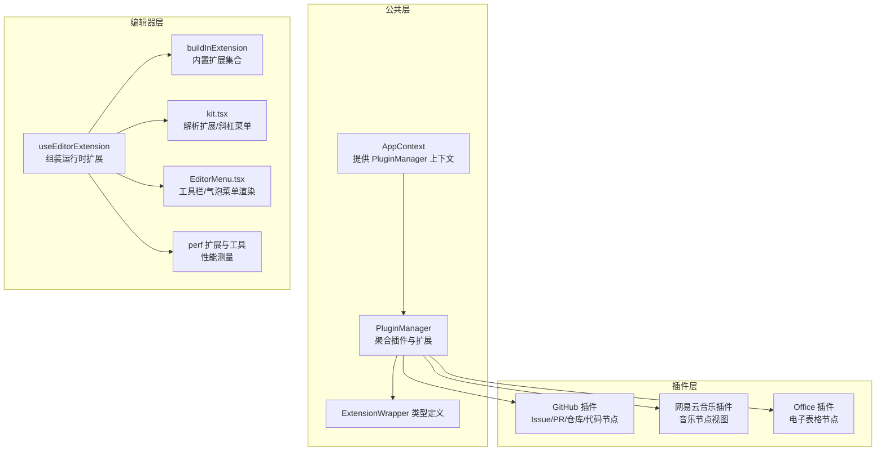
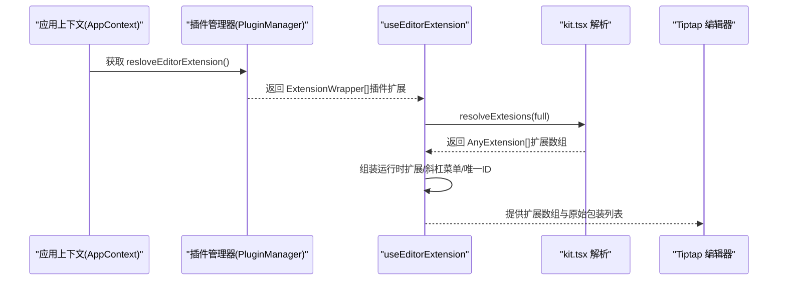
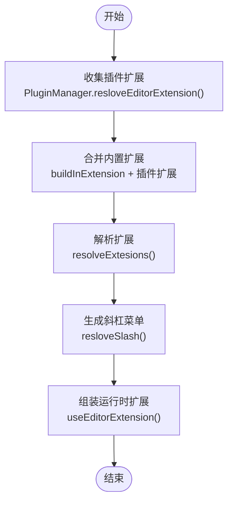
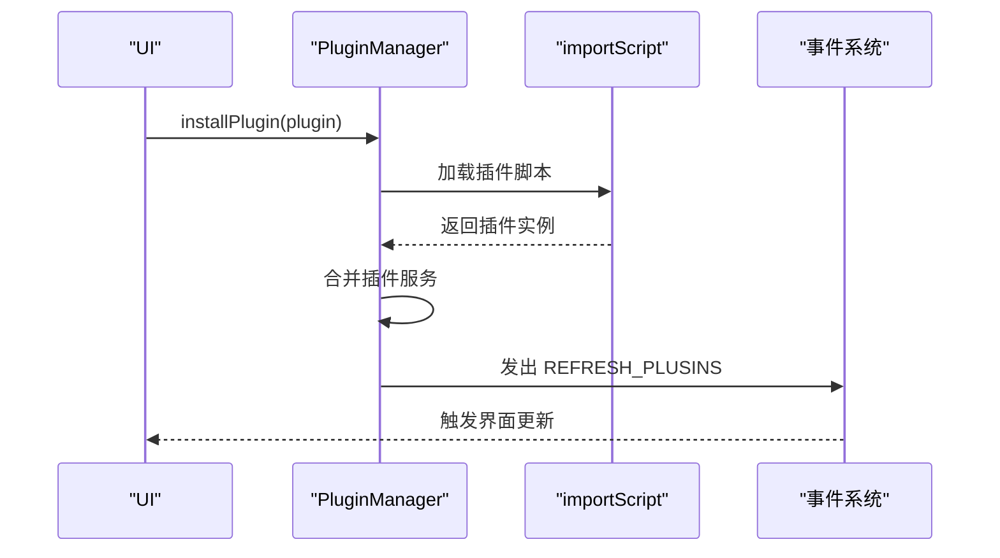
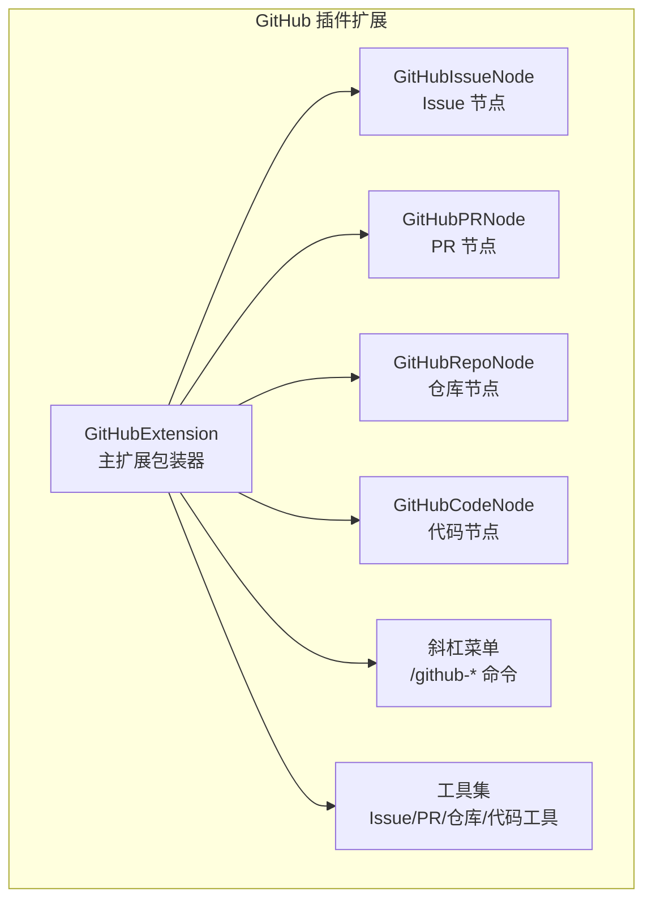
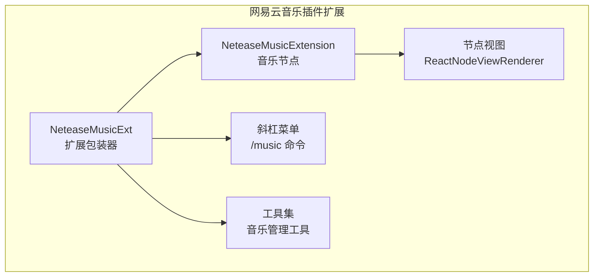
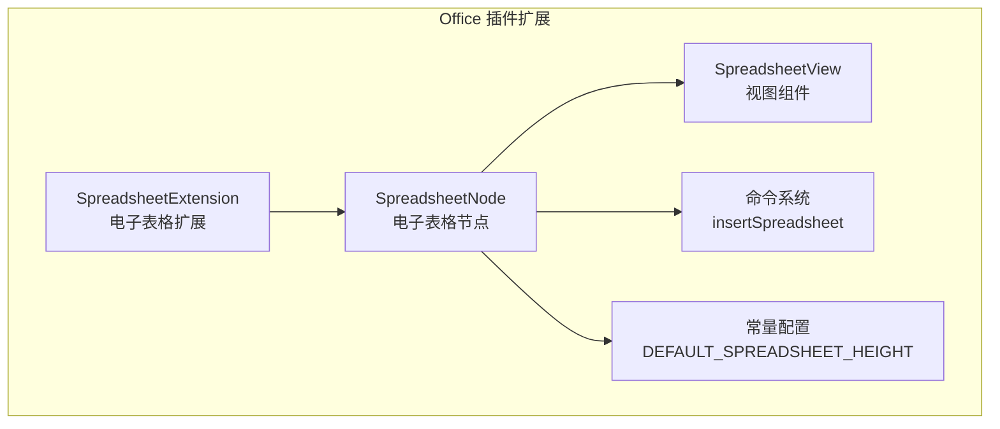

# 插件编辑器集成

<cite>
**本文引用的文件**
- [packages/common/src/core/editor.ts](file://packages/common/src/core/editor.ts)
- [packages/common/src/core/PluginManager.ts](file://packages/common/src/core/PluginManager.ts)
- [packages/common/src/core/AppContext.ts](file://packages/common/src/core/AppContext.ts)
- [packages/editor/src/editor/use-extension.ts](file://packages/editor/src/editor/use-extension.ts)
- [packages/editor/src/editor/build-in-extension.ts](file://packages/editor/src/editor/build-in-extension.ts)
- [packages/editor/src/editor/kit.tsx](file://packages/editor/src/editor/kit.tsx)
- [packages/editor/src/editor/EditorMenu.tsx](file://packages/editor/src/editor/EditorMenu.tsx)
- [packages/editor/src/extensions/link/link.ts](file://packages/editor/src/extensions/link/link.ts)
- [packages/editor/src/extensions/ident/ident.ts](file://packages/editor/src/extensions/ident/ident.ts)
- [packages/editor/src/extensions/perf/utilities.ts](file://packages/editor/src/extensions/perf/utilities.ts)
- [packages/editor/src/extensions/perf/perf.ts](file://packages/editor/src/extensions/perf/perf.ts)
- [packages/plugin-github/src/index.tsx](file://packages/plugin-github/src/index.tsx)
- [packages/plugin-github/src/extension/index.tsx](file://packages/plugin-github/src/extension/index.tsx)
- [packages/plugin-github/src/extension/nodes/github-issue-node.tsx](file://packages/plugin-github/src/extension/nodes/github-issue-node.tsx)
- [packages/plugin-github/src/extension/tools/issue-tools.ts](file://packages/plugin-github/src/extension/tools/issue-tools.ts)
- [packages/plugin-netease-music/src/index.tsx](file://packages/plugin-netease-music/src/index.tsx)
- [packages/plugin-netease-music/src/extension/index.tsx](file://packages/plugin-netease-music/src/extension/index.tsx)
- [packages/plugin-office/src/index.tsx](file://packages/plugin-office/src/index.tsx)
- [packages/plugin-office/src/spreadsheet/spreadsheet-node.ts](file://packages/plugin-office/src/spreadsheet/spreadsheet-node.ts)
- [packages/core/tsconfig.json](file://packages/core/tsconfig.json)
</cite>

## 更新摘要
**所做更改**
- 新增 GitHub 插件编辑器扩展集成章节，包含 Issue/PR/仓库/代码片段节点扩展
- 新增 网易云音乐 插件编辑器扩展集成章节，包含音乐节点视图和工具
- 新增 Office 插件编辑器扩展集成章节，包含电子表格节点扩展
- 更新插件类型集成模式分析，展示不同插件类型的扩展集成差异
- 增强扩展解析与合并策略说明，体现多插件协同工作机制

## 目录
1. [引言](#引言)
2. [项目结构](#项目结构)
3. [核心组件](#核心组件)
4. [架构总览](#架构总览)
5. [详细组件分析](#详细组件分析)
6. [插件类型集成模式](#插件类型集成模式)
7. [依赖关系分析](#依赖关系分析)
8. [性能考虑](#性能考虑)
9. [故障排查指南](#故障排查指南)
10. [结论](#结论)
11. [附录：自定义扩展开发指南](#附录自定义扩展开发指南)

## 引言
本文件围绕"插件编辑器集成"主题，系统性梳理了 ExtensionWrapper 接口设计、编辑器扩展配置结构（扩展类型、工具栏配置、快捷键绑定）、resloveEditorExtension 的扩展解析与合并策略、插件扩展与 Tiptap 编辑器的集成方式与生命周期管理、动态加载与卸载机制，以及调试与性能监控策略。本次更新特别增加了 GitHub、网易云音乐、Office 等新插件类型的集成模式分析，为开发者提供完整的插件扩展开发指导。

## 项目结构
该功能横跨公共层与编辑器包，关键位置如下：
- 公共层定义扩展包装器与插件管理器，负责扩展聚合与动态加载
- 编辑器层负责扩展解析、工具栏渲染、快捷键与斜杠菜单集成、性能监控等
- 插件层提供具体的功能扩展，包括 GitHub 集成、音乐嵌入、办公套件支持等

```mermaid
graph TB
subgraph "公共层"
A["AppContext<br/>提供 PluginManager 上下文"]
B["PluginManager<br/>聚合插件与扩展"]
C["ExtensionWrapper 类型定义"]
end
subgraph "编辑器层"
D["useEditorExtension<br/>组装运行时扩展"]
E["buildInExtension<br/>内置扩展集合"]
F["kit.tsx<br/>解析扩展/斜杠菜单"]
G["EditorMenu.tsx<br/>工具栏/气泡菜单渲染"]
H["perf 扩展与工具<br/>性能测量"]
end
subgraph "插件层"
I["GitHub 插件<br/>Issue/PR/仓库/代码节点"]
J["网易云音乐插件<br/>音乐节点视图"]
K["Office 插件<br/>电子表格节点"]
end
A --> B
B --> C
D --> E
D --> F
D --> G
D --> H
B --> I
B --> J
B --> K
```

**图表来源**
- [packages/common/src/core/AppContext.ts](file://packages/common/src/core/AppContext.ts#L1-L13)
- [packages/common/src/core/PluginManager.ts](file://packages/common/src/core/PluginManager.ts#L146-L154)
- [packages/common/src/core/editor.ts](file://packages/common/src/core/editor.ts#L1-L30)
- [packages/editor/src/editor/use-extension.ts](file://packages/editor/src/editor/use-extension.ts#L1-L63)
- [packages/editor/src/editor/build-in-extension.ts](file://packages/editor/src/editor/build-in-extension.ts#L1-L56)
- [packages/editor/src/editor/kit.tsx](file://packages/editor/src/editor/kit.tsx#L1-L87)
- [packages/editor/src/editor/EditorMenu.tsx](file://packages/editor/src/editor/EditorMenu.tsx#L1-L89)
- [packages/editor/src/extensions/perf/perf.ts](file://packages/editor/src/extensions/perf/perf.ts#L1-L41)
- [packages/plugin-github/src/index.tsx](file://packages/plugin-github/src/index.tsx#L1-L51)
- [packages/plugin-netease-music/src/index.tsx](file://packages/plugin-netease-music/src/index.tsx#L1-L42)
- [packages/plugin-office/src/index.tsx](file://packages/plugin-office/src/index.tsx#L1-L16)

**章节来源**
- [packages/common/src/core/AppContext.ts](file://packages/common/src/core/AppContext.ts#L1-L13)
- [packages/common/src/core/PluginManager.ts](file://packages/common/src/core/PluginManager.ts#L1-L170)
- [packages/common/src/core/editor.ts](file://packages/common/src/core/editor.ts#L1-L30)
- [packages/editor/src/editor/use-extension.ts](file://packages/editor/src/editor/use-extension.ts#L1-L63)
- [packages/editor/src/editor/build-in-extension.ts](file://packages/editor/src/editor/build-in-extension.ts#L1-L56)
- [packages/editor/src/editor/kit.tsx](file://packages/editor/src/editor/kit.tsx#L1-L87)
- [packages/editor/src/editor/EditorMenu.tsx](file://packages/editor/src/editor/EditorMenu.tsx#L1-L89)
- [packages/editor/src/extensions/perf/perf.ts](file://packages/editor/src/extensions/perf/perf.ts#L1-L41)

## 核心组件
- ExtensionWrapper：统一承载扩展元信息与 UI 配置（菜单、气泡菜单、浮动菜单、斜杠菜单、工具）
- PluginManager：聚合各插件的 editorExtension 列表，支持动态安装/卸载与服务合并
- useEditorExtension：组装运行时扩展、解析插件扩展、生成斜杠菜单、注入唯一 ID 等
- buildInExtension：内置扩展集合，作为默认扩展基线
- kit.tsx：扩展解析与斜杠菜单生成的核心逻辑
- EditorMenu：根据 ExtensionWrapper 渲染工具栏、气泡菜单与浮动菜单

**章节来源**
- [packages/common/src/core/editor.ts](file://packages/common/src/core/editor.ts#L1-L30)
- [packages/common/src/core/PluginManager.ts](file://packages/common/src/core/PluginManager.ts#L146-L154)
- [packages/editor/src/editor/use-extension.ts](file://packages/editor/src/editor/use-extension.ts#L1-L63)
- [packages/editor/src/editor/build-in-extension.ts](file://packages/editor/src/editor/build-in-extension.ts#L1-L56)
- [packages/editor/src/editor/kit.tsx](file://packages/editor/src/editor/kit.tsx#L1-L87)
- [packages/editor/src/editor/EditorMenu.tsx](file://packages/editor/src/editor/EditorMenu.tsx#L1-L89)

## 架构总览
以下序列图展示了从应用上下文到编辑器扩展装配的关键流程：

```mermaid
sequenceDiagram
participant App as "应用上下文(AppContext)"
participant PM as "插件管理器(PluginManager)"
participant UE as "useEditorExtension"
participant KIT as "kit.tsx 解析"
participant TIPTAP as "Tiptap 编辑器"
App->>PM : 获取 resloveEditorExtension()
PM-->>UE : 返回 ExtensionWrapper[]插件扩展
UE->>KIT : resolveExtesions(full)
KIT-->>UE : 返回 AnyExtension[]扩展数组
UE->>UE : 组装运行时扩展/斜杠菜单/唯一ID
UE-->>TIPTAP : 提供扩展数组与原始包装列表
```

**图表来源**
- [packages/common/src/core/AppContext.ts](file://packages/common/src/core/AppContext.ts#L1-L13)
- [packages/common/src/core/PluginManager.ts](file://packages/common/src/core/PluginManager.ts#L146-L154)
- [packages/editor/src/editor/use-extension.ts](file://packages/editor/src/editor/use-extension.ts#L1-L63)
- [packages/editor/src/editor/kit.tsx](file://packages/editor/src/editor/kit.tsx#L1-L87)

## 详细组件分析

### ExtensionWrapper 接口与配置结构
- 字段说明
  - extendsion：可为单个扩展或扩展数组
  - name：扩展名称
  - menuConfig：工具栏分组与菜单组件配置
  - bubbleMenu：气泡菜单组件（单个或数组）
  - flotMenuConfig：浮动菜单组件数组
  - slashConfig：斜杠菜单项数组（含图标、文本、触发符、动作、渲染器或分隔符）
  - tools：工具定义（描述、输入模式、执行函数）
  - skills：AI 技能定义

- 工具栏分组
  - Group 类型包含 block、inline、mark、custom 四类，用于组织工具栏布局

**章节来源**
- [packages/common/src/core/editor.ts](file://packages/common/src/core/editor.ts#L1-L30)

### 插件扩展聚合与解析：resloveEditorExtension 与 resolveExtesions
- 聚合策略
  - PluginManager 将所有插件的 editorExtensions 合并为一个 ExtensionWrapper[] 列表
- 解析策略
  - resolveExtesions 将 ExtensionWrapper[].extendsion 展开为 AnyExtension[]（数组或单个）
- 斜杠菜单
  - resloveSlash 收集所有 slashConfig 并生成统一的斜杠菜单扩展

```mermaid
flowchart TD
Start(["开始"]) --> Collect["收集插件扩展<br/>PluginManager.resloveEditorExtension()"]
Collect --> Merge["合并内置扩展<br/>buildInExtension + 插件扩展"]
Merge --> Resolve["解析扩展<br/>resolveExtesions()"]
Resolve --> Slash["生成斜杠菜单<br/>resloveSlash()"]
Slash --> Assemble["组装运行时扩展<br/>useEditorExtension()"]
Assemble --> End(["结束"])
```

**图表来源**
- [packages/common/src/core/PluginManager.ts](file://packages/common/src/core/PluginManager.ts#L146-L154)
- [packages/editor/src/editor/build-in-extension.ts](file://packages/editor/src/editor/build-in-extension.ts#L1-L56)
- [packages/editor/src/editor/kit.tsx](file://packages/editor/src/editor/kit.tsx#L1-L87)
- [packages/editor/src/editor/use-extension.ts](file://packages/editor/src/editor/use-extension.ts#L1-L63)

**章节来源**
- [packages/common/src/core/PluginManager.ts](file://packages/common/src/core/PluginManager.ts#L146-L154)
- [packages/editor/src/editor/kit.tsx](file://packages/editor/src/editor/kit.tsx#L1-L87)
- [packages/editor/src/editor/use-extension.ts](file://packages/editor/src/editor/use-extension.ts#L1-L63)

### 编辑器扩展与 Tiptap 集成及生命周期
- 集成点
  - 运行时扩展：由 useEditorExtension 组装，包含文档、段落、文本、撤销重做、占位符、尾随节点、性能插件、气泡菜单等
  - 唯一 ID：在最终阶段注入 UniqueID，过滤协作变更来源的事务
- 生命周期
  - 初始化：通过 useEditorExtension 汇总扩展并传入编辑器 Provider
  - 运行期：扩展在编辑器实例化后生效；工具栏与菜单组件随扩展注册而渲染
  - 卸载：通过过滤指定扩展名实现按需移除（如 ext 参数）

**章节来源**
- [packages/editor/src/editor/use-extension.ts](file://packages/editor/src/editor/use-extension.ts#L1-L63)
- [packages/editor/src/editor/build-in-extension.ts](file://packages/editor/src/editor/build-in-extension.ts#L1-L56)

### 动态加载与卸载机制
- 动态加载
  - PluginManager.init 支持远程插件脚本的异步加载与实例化，随后合并插件服务
- 安装/卸载
  - installPlugin：动态导入并注册新插件
  - uninstallPlugin：移除插件并发出刷新事件
- 触发刷新
  - 通过事件系统通知 UI 更新（例如工具栏与菜单）

```mermaid
sequenceDiagram
participant UI as "UI"
participant PM as "PluginManager"
participant Loader as "importScript"
participant EVT as "事件系统"
UI->>PM : installPlugin(plugin)
PM->>Loader : 加载插件脚本
Loader-->>PM : 返回插件实例
PM->>PM : 合并插件服务
PM->>EVT : 发出 REFRESH_PLUSINS
EVT-->>UI : 触发界面更新
```

**图表来源**
- [packages/common/src/core/PluginManager.ts](file://packages/common/src/core/PluginManager.ts#L78-L112)

**章节来源**
- [packages/common/src/core/PluginManager.ts](file://packages/common/src/core/PluginManager.ts#L78-L112)

### 工具栏与菜单渲染：EditorMenu
- 菜单收集
  - 遍历 ExtensionWrapper，按 group 归类 menuConfig，累积 bubbleMenu 与 flotMenuConfig
- 渲染策略
  - 工具栏：按 mark/inline/block/custom 分区渲染
  - 气泡菜单：在选中非空文本且非代码块时显示
  - 浮动菜单：在节点周围以气泡形式呈现

**章节来源**
- [packages/editor/src/editor/EditorMenu.tsx](file://packages/editor/src/editor/EditorMenu.tsx#L1-L89)

### 快捷键绑定示例：缩进扩展
- 键盘映射
  - Tab：增加缩进
  - Shift-Tab：减少缩进
- 实现要点
  - 在扩展的 addKeyboardShortcuts 中返回命令映射
  - 命令内部通过编辑器命令调用缩进相关逻辑

**章节来源**
- [packages/editor/src/extensions/ident/ident.ts](file://packages/editor/src/extensions/ident/ident.ts#L80-L130)

### 输入规则与属性增强：链接扩展
- 输入规则
  - 支持 Markdown 链接语法与 URL 自动识别的输入规则
- 属性与行为
  - 扩展 Link 的选项与属性，控制点击行为与粘贴处理

**章节来源**
- [packages/editor/src/extensions/link/link.ts](file://packages/editor/src/extensions/link/link.ts#L1-L66)

## 插件类型集成模式

### GitHub 插件集成模式
GitHub 插件采用多节点扩展集成模式，提供完整的 GitHub 生态系统集成：

- **节点扩展类型**
  - GitHubIssueNode：Issue 卡片节点，支持完整的 Issue 信息展示
  - GitHubPRNode：Pull Request 节点，支持 PR 状态和信息展示
  - GitHubRepoNode：仓库节点，支持仓库基本信息展示
  - GitHubCodeNode：代码片段节点，支持代码高亮和复制功能

- **斜杠菜单集成**
  - 提供四个专用斜杠命令：/github-issue、/github-pr、/github-repo、/github-code
  - 每个命令对应相应的节点插入操作

- **工具集集成**
  - Issue 管理工具：创建、更新、查询、评论等完整工作流
  - PR 管理工具：PR 查询和状态管理
  - 仓库工具：仓库信息查询和管理
  - 代码工具：代码片段管理和搜索
  - 搜索工具：多维度的 GitHub 资源搜索

```mermaid
graph TB
subgraph "GitHub 插件扩展"
A["GitHubExtension<br/>主扩展包装器"]
B["GitHubIssueNode<br/>Issue 节点"]
C["GitHubPRNode<br/>PR 节点"]
D["GitHubRepoNode<br/>仓库节点"]
E["GitHubCodeNode<br/>代码节点"]
F["斜杠菜单<br/>/github-* 命令"]
G["工具集<br/>Issue/PR/仓库/代码工具"]
end
A --> B
A --> C
A --> D
A --> E
A --> F
A --> G
```

**图表来源**
- [packages/plugin-github/src/extension/index.tsx](file://packages/plugin-github/src/extension/index.tsx#L16-L81)
- [packages/plugin-github/src/extension/nodes/github-issue-node.tsx](file://packages/plugin-github/src/extension/nodes/github-issue-node.tsx#L4-L41)
- [packages/plugin-github/src/extension/tools/issue-tools.ts](file://packages/plugin-github/src/extension/tools/issue-tools.ts#L27-L62)

**章节来源**
- [packages/plugin-github/src/index.tsx](file://packages/plugin-github/src/index.tsx#L11-L48)
- [packages/plugin-github/src/extension/index.tsx](file://packages/plugin-github/src/extension/index.tsx#L16-L81)
- [packages/plugin-github/src/extension/nodes/github-issue-node.tsx](file://packages/plugin-github/src/extension/nodes/github-issue-node.tsx#L4-L41)
- [packages/plugin-github/src/extension/tools/issue-tools.ts](file://packages/plugin-github/src/extension/tools/issue-tools.ts#L27-L62)

### 网易云音乐插件集成模式
网易云音乐插件专注于音乐资源的嵌入和播放体验：

- **节点扩展特性**
  - 单一音乐节点：neteaseMusic，支持歌曲、歌单、专辑三种类型
  - 响应式节点视图：提供完整的音乐播放界面
  - 属性管理：支持音乐 ID、类型、标题、艺术家、封面等属性

- **命令系统**
  - setNeteaseMusic 命令：用于插入和更新音乐节点
  - 支持多种音乐类型参数配置

- **工具集成**
  - 提供音乐资源管理和播放控制工具
  - 支持音乐信息的动态更新

```mermaid
graph TB
subgraph "网易云音乐插件扩展"
A["NeteaseMusicExt<br/>扩展包装器"]
B["NeteaseMusicExtension<br/>音乐节点"]
C["斜杠菜单<br/>/music 命令"]
D["工具集<br/>音乐管理工具"]
E["节点视图<br/>ReactNodeViewRenderer"]
end
A --> B
A --> C
A --> D
B --> E
```

**图表来源**
- [packages/plugin-netease-music/src/extension/index.tsx](file://packages/plugin-netease-music/src/extension/index.tsx#L22-L101)
- [packages/plugin-netease-music/src/extension/index.tsx](file://packages/plugin-netease-music/src/extension/index.tsx#L103-L118)

**章节来源**
- [packages/plugin-netease-music/src/index.tsx](file://packages/plugin-netease-music/src/index.tsx#L30-L41)
- [packages/plugin-netease-music/src/extension/index.tsx](file://packages/plugin-netease-music/src/extension/index.tsx#L22-L101)
- [packages/plugin-netease-music/src/extension/index.tsx](file://packages/plugin-netease-music/src/extension/index.tsx#L103-L118)

### Office 插件集成模式
Office 插件专注于办公场景的电子表格集成：

- **电子表格节点**
  - SpreadsheetNode：专门的电子表格节点扩展
  - 支持工作簿数据的存储和渲染
  - 可配置的高度设置，适应不同显示需求

- **节点视图集成**
  - ReactNodeViewRenderer：提供完整的电子表格视图
  - 支持交互式电子表格操作
  - 事件处理机制：stopEvent 设置为 true，防止事件冒泡

- **命令系统**
  - insertSpreadsheet 命令：用于插入电子表格节点
  - 支持可选的工作簿数据参数

```mermaid
graph TB
subgraph "Office 插件扩展"
A["SpreadsheetExtension<br/>电子表格扩展"]
B["SpreadsheetNode<br/>电子表格节点"]
C["SpreadsheetView<br/>视图组件"]
D["命令系统<br/>insertSpreadsheet"]
E["常量配置<br/>DEFAULT_SPREADSHEET_HEIGHT"]
end
A --> B
B --> C
B --> D
B --> E
```

**图表来源**
- [packages/plugin-office/src/spreadsheet/spreadsheet-node.ts](file://packages/plugin-office/src/spreadsheet/spreadsheet-node.ts#L14-L59)

**章节来源**
- [packages/plugin-office/src/index.tsx](file://packages/plugin-office/src/index.tsx#L11-L16)
- [packages/plugin-office/src/spreadsheet/spreadsheet-node.ts](file://packages/plugin-office/src/spreadsheet/spreadsheet-node.ts#L14-L59)

## 依赖关系分析
- 组件耦合
  - useEditorExtension 依赖 AppContext 获取 PluginManager，依赖 kit.tsx 的解析函数
  - EditorMenu 依赖 ExtensionWrapper 的菜单配置进行渲染
  - PluginManager 与 tsconfig 的 include 显示其被核心包消费
  - 各插件扩展依赖 @kn/editor 的 PMNode 和 ReactNodeViewRenderer
- 外部依赖
  - Tiptap 核心与扩展生态
  - 性能 API（浏览器 performance/observer）
  - 第三方服务：Octokit（GitHub API）、网易云音乐 API

```mermaid
graph LR
UE["useEditorExtension"] --> KIT["kit.tsx 解析函数"]
UE --> BI["buildInExtension"]
UE --> PM["PluginManager"]
UE --> EM["EditorMenu"]
UE --> PERF["perf 扩展"]
PM --> EC["ExtensionWrapper"]
EC --> EM
UE --> TIPTAP["Tiptap 编辑器"]
subgraph "插件依赖"
GH["@kn/plugin-github"] --> EDITOR["@kn/editor"]
NM["@kn/plugin-netease-music"] --> EDITOR
OFF["@kn/plugin-office"] --> EDITOR
END
```

**图表来源**
- [packages/editor/src/editor/use-extension.ts](file://packages/editor/src/editor/use-extension.ts#L1-L63)
- [packages/editor/src/editor/kit.tsx](file://packages/editor/src/editor/kit.tsx#L1-L87)
- [packages/editor/src/editor/build-in-extension.ts](file://packages/editor/src/editor/build-in-extension.ts#L1-L56)
- [packages/common/src/core/PluginManager.ts](file://packages/common/src/core/PluginManager.ts#L146-L154)
- [packages/common/src/core/editor.ts](file://packages/common/src/core/editor.ts#L1-L30)
- [packages/editor/src/editor/EditorMenu.tsx](file://packages/editor/src/editor/EditorMenu.tsx#L1-L89)
- [packages/editor/src/extensions/perf/perf.ts](file://packages/editor/src/extensions/perf/perf.ts#L1-L41)

**章节来源**
- [packages/core/tsconfig.json](file://packages/core/tsconfig.json#L1-L28)

## 性能考虑
- 性能测量工具
  - isPerformanceAPIAvailable/isPerformanceObserverAvailable：检测可用性
  - measureRender/startMeasure/stopMeasure/clearMeasure：帧渲染与任务测量
- 性能插件
  - Perf 扩展监听事务中的分析负载，在文档变化时对特定操作进行渲染时长测量
- 使用建议
  - 在开发环境启用 Perf 插件，结合浏览器性能面板定位卡顿
  - 对复杂扩展使用 measureRender 包裹关键渲染路径
  - 避免在事务回调中频繁创建大对象，减少不必要的重绘

**章节来源**
- [packages/editor/src/extensions/perf/utilities.ts](file://packages/editor/src/extensions/perf/utilities.ts#L1-L133)
- [packages/editor/src/extensions/perf/perf.ts](file://packages/editor/src/extensions/perf/perf.ts#L1-L41)

## 故障排查指南
- 扩展未生效
  - 检查是否正确返回 ExtensionWrapper[] 并通过 PluginManager 聚合
  - 确认 useEditorExtension 是否调用 resolveExtesions 与 resloveSlash
- 工具栏不显示
  - 确认 menuConfig 的 group 与 menu 是否正确设置
  - 检查 EditorMenu 是否接收到了扩展包装器列表
- 快捷键无效
  - 确认扩展的 addKeyboardShortcuts 返回值与命令映射正确
  - 检查是否有更高优先级的命令覆盖
- 动态安装/卸载无反应
  - 确认 uninstallPlugin/installPlugin 是否触发 REFRESH_PLUSINS 事件
  - 检查 UI 是否订阅并响应该事件
- 插件扩展问题
  - 检查插件的 editorExtension 数组是否正确导出
  - 确认插件依赖是否正确安装和构建
  - 验证插件配置中的 settings 和 locales 是否正确设置

**章节来源**
- [packages/common/src/core/PluginManager.ts](file://packages/common/src/core/PluginManager.ts#L99-L112)
- [packages/editor/src/editor/EditorMenu.tsx](file://packages/editor/src/editor/EditorMenu.tsx#L1-L89)
- [packages/editor/src/extensions/ident/ident.ts](file://packages/editor/src/extensions/ident/ident.ts#L80-L130)

## 结论
通过统一的 ExtensionWrapper 接口与 PluginManager 的聚合能力，结合 useEditorExtension 的解析与装配流程，系统实现了插件扩展与 Tiptap 的深度集成。新增的 GitHub、网易云音乐、Office 插件展示了不同的插件类型集成模式：GitHub 采用多节点扩展的完整生态系统集成，网易云音乐专注于单一资源类型的深度集成，Office 插件提供专业办公场景的集成方案。内置扩展与插件扩展的合并策略清晰，工具栏、气泡菜单与斜杠菜单的配置结构一致，动态加载/卸载机制完善。配合性能测量与调试手段，能够有效保障扩展的稳定性与性能表现。

## 附录：自定义扩展开发指南
- 设计扩展包装器
  - 提供 extendsion（单个或数组）与 name
  - 可选：menuConfig（按 group 分类）、bubbleMenu、flotMenuConfig、slashConfig、tools、skills
- 开发扩展
  - 基于 Tiptap 扩展封装，必要时添加 addKeyboardShortcuts 与输入规则
  - 示例参考链接扩展的输入规则与属性增强
  - 对于复杂 UI，使用 ReactNodeViewRenderer 创建节点视图
- 插件集成模式
  - 单节点模式：适用于单一资源类型的集成（如网易云音乐）
  - 多节点模式：适用于完整生态系统的集成（如 GitHub）
  - 专业工具模式：适用于特定场景的专业功能（如 Office 电子表格）
- 注册与发布
  - 将 ExtensionWrapper[] 挂载至插件配置的 editorExtension 字段
  - 通过 PluginManager 的安装/卸载接口动态管理
- 调试与优化
  - 在开发阶段启用 Perf 插件观察渲染耗时
  - 使用 measureRender 对关键路径进行测量
  - 避免在事务回调中做重型计算，保持命令幂等与可回放
- 最佳实践
  - 合理设计扩展的职责边界，避免过度复杂的单个扩展
  - 提供完善的错误处理和用户反馈机制
  - 考虑插件的国际化支持和本地化配置
  - 为插件提供清晰的配置界面和设置项

**章节来源**
- [packages/common/src/core/editor.ts](file://packages/common/src/core/editor.ts#L1-L30)
- [packages/editor/src/extensions/link/link.ts](file://packages/editor/src/extensions/link/link.ts#L1-L66)
- [packages/editor/src/extensions/perf/utilities.ts](file://packages/editor/src/extensions/perf/utilities.ts#L1-L133)
- [packages/common/src/core/PluginManager.ts](file://packages/common/src/core/PluginManager.ts#L78-L112)
- [packages/plugin-github/src/extension/index.tsx](file://packages/plugin-github/src/extension/index.tsx#L16-L81)
- [packages/plugin-netease-music/src/extension/index.tsx](file://packages/plugin-netease-music/src/extension/index.tsx#L22-L101)
- [packages/plugin-office/src/spreadsheet/spreadsheet-node.ts](file://packages/plugin-office/src/spreadsheet/spreadsheet-node.ts#L14-L59)