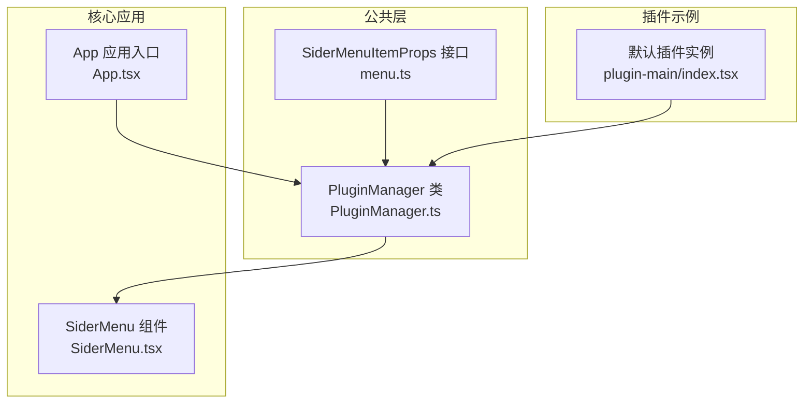
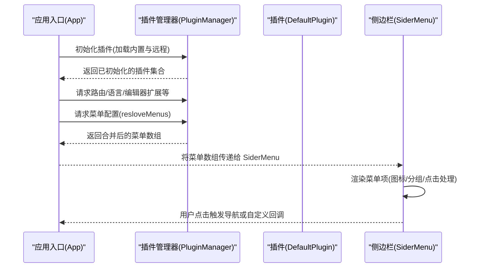
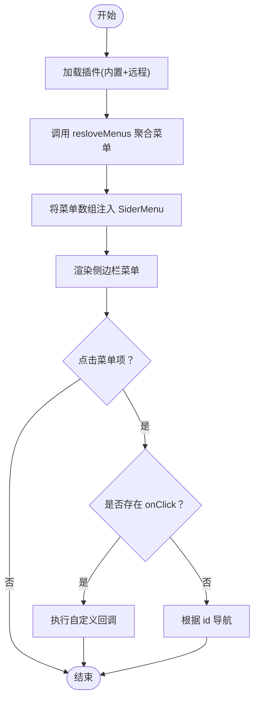
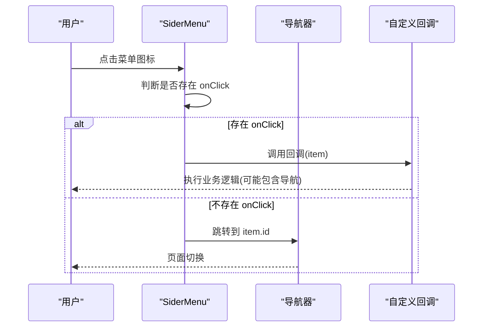
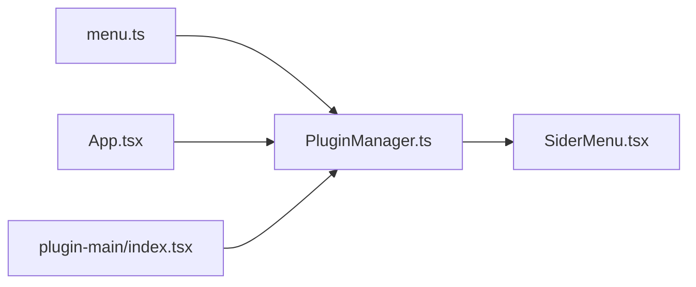

# 插件菜单系统

<cite>
**本文引用的文件**
- [packages/common/src/core/menu.ts](file://packages/common/src/core/menu.ts)
- [packages/common/src/core/PluginManager.ts](file://packages/common/src/core/PluginManager.ts)
- [packages/core/src/components/SiderMenu.tsx](file://packages/core/src/components/SiderMenu.tsx)
- [packages/core/src/App.tsx](file://packages/core/src/App.tsx)
- [packages/plugin-main/src/index.tsx](file://packages/plugin-main/src/index.tsx)
- [packages/core/src/components/Shop/Marketplace/index.tsx](file://packages/core/src/components/Shop/Marketplace/index.tsx)
- [packages/core/src/components/Shop/index.tsx](file://packages/core/src/components/Shop/index.tsx)
</cite>

## 目录
1. [引言](#引言)
2. [项目结构](#项目结构)
3. [核心组件](#核心组件)
4. [架构总览](#架构总览)
5. [详细组件分析](#详细组件分析)
6. [依赖分析](#依赖分析)
7. [性能考虑](#性能考虑)
8. [故障排查指南](#故障排查指南)
9. [结论](#结论)
10. [附录：扩展与自定义指南](#附录扩展与自定义指南)

## 引言
本文件面向“插件菜单系统”的设计与实现，围绕 SiderMenuItemProps 接口、菜单配置结构、动态生成机制（resloveMenus 方法）、菜单与插件功能的关联关系、权限控制机制、侧边栏菜单渲染流程与交互行为、样式定制与主题适配策略，以及扩展与自定义开发指南进行系统化说明。目标是帮助开发者快速理解并高效扩展菜单体系。

## 项目结构
插件菜单系统由三部分协同构成：
- 菜单接口与类型定义：位于公共包中，统一约束菜单项结构。
- 插件管理器：聚合各插件提供的菜单配置，并在运行时动态注入到侧边栏。
- 侧边栏组件：消费插件管理器返回的菜单列表，渲染并响应用户交互。

图表来源
- [packages/common/src/core/menu.ts](file://packages/common/src/core/menu.ts#L1-L25)
- [packages/common/src/core/PluginManager.ts](file://packages/common/src/core/PluginManager.ts#L1-L170)
- [packages/core/src/components/SiderMenu.tsx](file://packages/core/src/components/SiderMenu.tsx#L1-L171)
- [packages/core/src/App.tsx](file://packages/core/src/App.tsx#L129-L159)
- [packages/plugin-main/src/index.tsx](file://packages/plugin-main/src/index.tsx#L1-L118)

章节来源
- [packages/common/src/core/menu.ts](file://packages/common/src/core/menu.ts#L1-L25)
- [packages/common/src/core/PluginManager.ts](file://packages/common/src/core/PluginManager.ts#L1-L170)
- [packages/core/src/components/SiderMenu.tsx](file://packages/core/src/components/SiderMenu.tsx#L1-L171)
- [packages/core/src/App.tsx](file://packages/core/src/App.tsx#L129-L159)
- [packages/plugin-main/src/index.tsx](file://packages/plugin-main/src/index.tsx#L1-L118)

## 核心组件
- SiderMenuItemProps：定义菜单项的属性集合，包括名称、唯一键、图标、路由标识、分组标记、子菜单、点击回调等，支持通过 className 自定义样式与通过 actions/customerRender 扩展渲染。
- PluginManager：负责加载、安装、卸载插件，并提供 resloveMenus 聚合各插件的菜单配置；同时维护插件服务与国际化资源。
- SiderMenu：消费插件管理器返回的菜单数组，渲染侧边栏图标按钮，优先执行菜单项自带的 onClick，否则按 id 使用导航器跳转。

章节来源
- [packages/common/src/core/menu.ts](file://packages/common/src/core/menu.ts#L1-L25)
- [packages/common/src/core/PluginManager.ts](file://packages/common/src/core/PluginManager.ts#L1-L170)
- [packages/core/src/components/SiderMenu.tsx](file://packages/core/src/components/SiderMenu.tsx#L1-L171)

## 架构总览
下图展示从应用启动到侧边栏菜单渲染的关键路径，以及插件菜单如何被注入与生效。

图表来源
- [packages/core/src/App.tsx](file://packages/core/src/App.tsx#L129-L159)
- [packages/common/src/core/PluginManager.ts](file://packages/common/src/core/PluginManager.ts#L78-L112)
- [packages/common/src/core/PluginManager.ts](file://packages/common/src/core/PluginManager.ts#L157-L165)
- [packages/core/src/components/SiderMenu.tsx](file://packages/core/src/components/SiderMenu.tsx#L56-L105)

## 详细组件分析

### SiderMenuItemProps 接口与菜单配置结构
- 字段职责概览
  - name：菜单显示名称（ReactNode），可为纯文本或复杂组件。
  - key：菜单键值，用于标识与匹配。
  - icon：菜单图标（ReactNode），可内嵌交互式组件（如下拉、气泡）。
  - attachTabs：是否附加标签页行为（用于路由切换场景）。
  - id：菜单对应的路由路径或标识，作为点击后导航的目标。
  - isSelectable：是否可选中（用于状态指示）。
  - children：子菜单（递归结构），支持层级菜单。
  - indicator：指示器（用于徽标或状态提示）。
  - isGroup：是否为分组容器（用于组织菜单项）。
  - className：自定义样式类名。
  - onClick：点击回调，优先于默认导航。
  - emptyProps/actions/customerRender/height：扩展渲染与布局参数。

- 图标设置
  - 支持直接传入任意 ReactNode，可在 icon 中组合 UI 组件（如下拉菜单、气泡框等），实现丰富的交互体验。
  - 示例参考：消息盒子与用户信息区域使用了 Popover/Dropdown 等组件包裹图标。

- 点击事件处理
  - 优先执行 item.onClick；若未提供，则使用导航器跳转至 item.id。
  - 该策略确保插件可完全接管点击行为，或沿用默认路由导航。

章节来源
- [packages/common/src/core/menu.ts](file://packages/common/src/core/menu.ts#L1-L25)
- [packages/core/src/components/SiderMenu.tsx](file://packages/core/src/components/SiderMenu.tsx#L152-L171)

### 动态生成机制与 resloveMenus 实现
- 聚合策略
  - 遍历插件管理器中的所有插件，收集其 menus 字段，拼接为最终菜单数组。
  - 该过程不进行去重或排序，遵循“先到先得”的顺序原则。
- 触发刷新
  - 安装/卸载插件会通过事件系统发出刷新信号，驱动侧边栏重新计算菜单列表。
- 运行时机
  - 在应用初始化阶段，App 会调用 resloveMenus 获取菜单配置并传递给 SiderMenu。
  - SiderMenu 使用 useMemo 缓存菜单结果，依赖插件列表与刷新标志位以触发更新。

图表来源
- [packages/common/src/core/PluginManager.ts](file://packages/common/src/core/PluginManager.ts#L78-L112)
- [packages/common/src/core/PluginManager.ts](file://packages/common/src/core/PluginManager.ts#L157-L165)
- [packages/core/src/App.tsx](file://packages/core/src/App.tsx#L129-L159)
- [packages/core/src/components/SiderMenu.tsx](file://packages/core/src/components/SiderMenu.tsx#L56-L105)

章节来源
- [packages/common/src/core/PluginManager.ts](file://packages/common/src/core/PluginManager.ts#L78-L112)
- [packages/common/src/core/PluginManager.ts](file://packages/common/src/core/PluginManager.ts#L157-L165)
- [packages/core/src/App.tsx](file://packages/core/src/App.tsx#L129-L159)
- [packages/core/src/components/SiderMenu.tsx](file://packages/core/src/components/SiderMenu.tsx#L56-L105)

### 菜单与插件功能的关联关系与权限控制
- 关联关系
  - 插件通过 KPlugin 的 menus 字段声明菜单项，PluginManager 负责聚合。
  - App 在初始化时调用 resloveMenus 并将其传递给 SiderMenu，形成“插件 -> 管理器 -> 组件”的链路。
- 权限控制
  - 当前仓库未提供显式的菜单级权限校验逻辑。建议在插件层面通过条件判断决定是否注册某菜单项，或在 onClick 回调中进行访问控制。
  - 若需全局权限控制，可在 SiderMenu 渲染前对菜单数组进行过滤，仅保留当前用户有权限的项。

章节来源
- [packages/common/src/core/PluginManager.ts](file://packages/common/src/core/PluginManager.ts#L1-L170)
- [packages/core/src/App.tsx](file://packages/core/src/App.tsx#L129-L159)
- [packages/plugin-main/src/index.tsx](file://packages/plugin-main/src/index.tsx#L53-L62)

### 侧边栏菜单的渲染流程与交互行为
- 渲染流程
  - SiderMenu 基于插件管理器提供的菜单数组逐项渲染，每个菜单项为一个可点击的图标容器。
  - 通过 className 可实现悬停、选中态等视觉反馈。
- 交互行为
  - 点击优先执行菜单项自带的 onClick；若未提供，则根据 id 使用导航器跳转。
  - 顶部包含主题切换与语言切换入口，便于在菜单区统一管理。

图表来源
- [packages/core/src/components/SiderMenu.tsx](file://packages/core/src/components/SiderMenu.tsx#L152-L171)

章节来源
- [packages/core/src/components/SiderMenu.tsx](file://packages/core/src/components/SiderMenu.tsx#L1-L171)

### 样式定制与主题适配策略
- 内置样式
  - SiderMenu 使用通用 UI 库的工具类实现基础样式（如圆角、悬停背景、过渡动画）。
- 自定义样式
  - 通过 SiderMenuItemProps 的 className 字段为单个菜单项注入自定义类名。
  - 通过 actions/customerRender 可实现更复杂的渲染定制（例如徽标、操作按钮等）。
- 主题适配
  - 侧边栏包含主题切换组件，可在菜单区统一切换明暗主题。
  - 建议插件图标采用与主题一致的颜色策略，避免在深色模式下不可见。

章节来源
- [packages/core/src/components/SiderMenu.tsx](file://packages/core/src/components/SiderMenu.tsx#L152-L171)

## 依赖分析
- 组件耦合
  - SiderMenu 依赖 PluginManager 提供的菜单数组；App 负责初始化与注入。
  - 插件通过 KPlugin 的 menus 字段参与菜单构建。
- 外部依赖
  - 使用通用 UI 库组件（如 Popover、Dropdown、Empty 等）实现菜单交互与占位。
  - 使用导航器进行页面跳转。
- 循环依赖
  - 未发现循环依赖迹象；各模块职责清晰：类型定义（common）、管理器（common）、渲染（core）。

图表来源
- [packages/common/src/core/menu.ts](file://packages/common/src/core/menu.ts#L1-L25)
- [packages/common/src/core/PluginManager.ts](file://packages/common/src/core/PluginManager.ts#L1-L170)
- [packages/core/src/components/SiderMenu.tsx](file://packages/core/src/components/SiderMenu.tsx#L1-L171)
- [packages/core/src/App.tsx](file://packages/core/src/App.tsx#L129-L159)
- [packages/plugin-main/src/index.tsx](file://packages/plugin-main/src/index.tsx#L1-L118)

章节来源
- [packages/common/src/core/menu.ts](file://packages/common/src/core/menu.ts#L1-L25)
- [packages/common/src/core/PluginManager.ts](file://packages/common/src/core/PluginManager.ts#L1-L170)
- [packages/core/src/components/SiderMenu.tsx](file://packages/core/src/components/SiderMenu.tsx#L1-L171)
- [packages/core/src/App.tsx](file://packages/core/src/App.tsx#L129-L159)
- [packages/plugin-main/src/index.tsx](file://packages/plugin-main/src/index.tsx#L1-L118)

## 性能考虑
- 菜单缓存
  - SiderMenu 使用 useMemo 对菜单数组进行缓存，依赖插件列表与刷新标志位，减少不必要的重渲染。
- 动态加载
  - 插件通过脚本动态导入，安装/卸载后通过事件触发刷新，避免全量重建。
- 渲染优化
  - 仅渲染必要的图标与交互组件；对于复杂图标（如气泡/下拉），建议按需挂载或延迟渲染。

章节来源
- [packages/core/src/components/SiderMenu.tsx](file://packages/core/src/components/SiderMenu.tsx#L56-L105)
- [packages/common/src/core/PluginManager.ts](file://packages/common/src/core/PluginManager.ts#L78-L112)

## 故障排查指南
- 菜单未显示
  - 检查插件是否正确导出 menus 字段，且插件已被初始化。
  - 确认 App 已调用 resloveMenus 并将结果传递给 SiderMenu。
- 点击无反应
  - 若菜单项提供了 onClick，请确认回调逻辑是否正确执行。
  - 若未提供 onClick，检查 id 是否有效且存在对应路由。
- 插件安装/卸载后菜单未刷新
  - 确认安装/卸载流程是否触发了刷新事件，SiderMenu 是否监听到刷新标志位变化。

章节来源
- [packages/plugin-main/src/index.tsx](file://packages/plugin-main/src/index.tsx#L53-L62)
- [packages/core/src/App.tsx](file://packages/core/src/App.tsx#L129-L159)
- [packages/core/src/components/SiderMenu.tsx](file://packages/core/src/components/SiderMenu.tsx#L56-L105)
- [packages/common/src/core/PluginManager.ts](file://packages/common/src/core/PluginManager.ts#L99-L112)

## 结论
插件菜单系统通过统一的接口定义、插件管理器聚合与侧边栏组件渲染，实现了灵活、可扩展的菜单生态。开发者可通过插件声明菜单项，利用 onClick 与 id 实现丰富交互，并结合事件系统实现动态刷新。建议在插件层面进行权限控制，并通过 className 与自定义渲染满足多样化的样式需求。

## 附录：扩展与自定义指南

### 开发步骤
- 在插件中声明菜单项
  - 在插件配置中提供 menus 数组，包含 name、key、icon、id 等字段。
  - 如需复杂交互，可在 icon 中嵌套 UI 组件。
- 注册插件
  - 将插件实例注册到应用初始化流程，确保 PluginManager 能够加载并聚合其菜单。
- 处理点击事件
  - 若需要自定义行为，在 onClick 中实现；否则保持 id 与路由一致以便自动导航。
- 安装/卸载插件
  - 通过商店或管理界面安装/卸载插件，系统会自动触发刷新，菜单随之更新。

章节来源
- [packages/plugin-main/src/index.tsx](file://packages/plugin-main/src/index.tsx#L53-L62)
- [packages/common/src/core/PluginManager.ts](file://packages/common/src/core/PluginManager.ts#L99-L112)
- [packages/core/src/components/Shop/Marketplace/index.tsx](file://packages/core/src/components/Shop/Marketplace/index.tsx#L33-L61)
- [packages/core/src/components/Shop/index.tsx](file://packages/core/src/components/Shop/index.tsx#L110-L131)