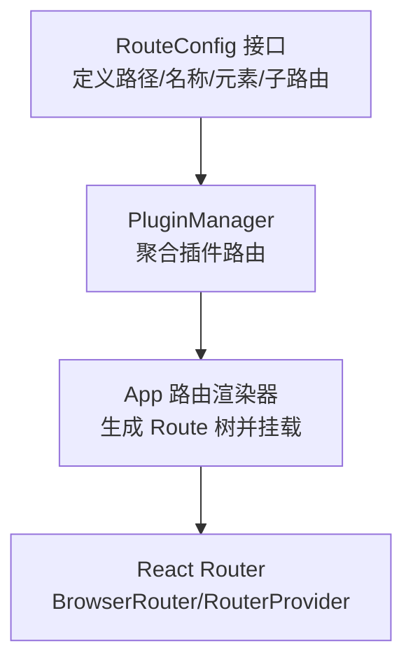
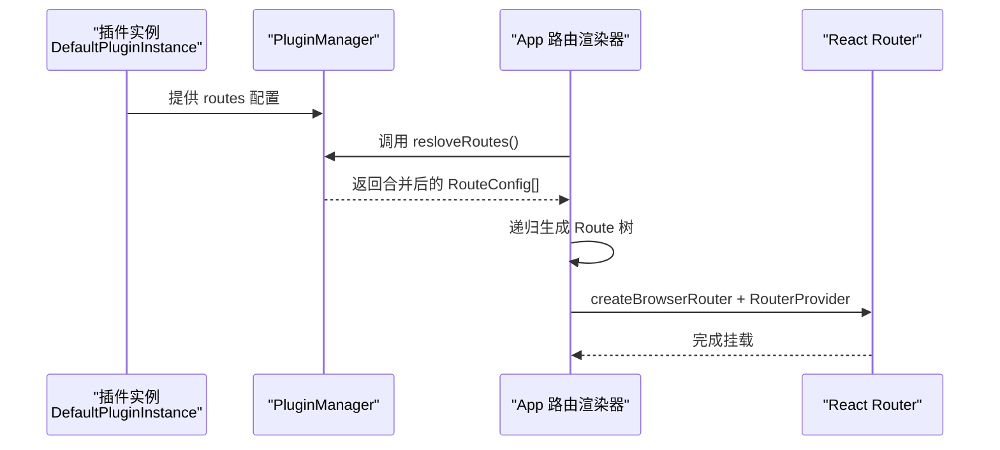
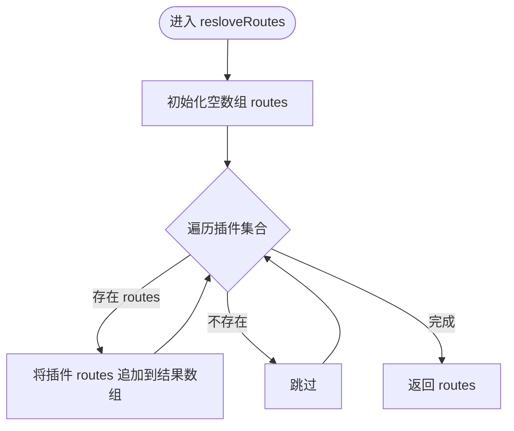
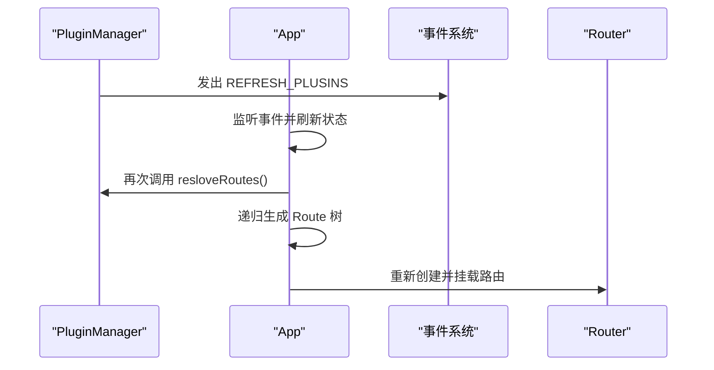

# 插件路由系统

<cite>
**本文引用的文件**
- [packages/common/src/core/route.ts](file://packages/common/src/core/route.ts)
- [packages/common/src/core/PluginManager.ts](file://packages/common/src/core/PluginManager.ts)
- [packages/core/src/App.tsx](file://packages/core/src/App.tsx)
- [packages/core/src/hooks/use-navigator.ts](file://packages/core/src/hooks/use-navigator.ts)
- [packages/plugin-main/src/index.tsx](file://packages/plugin-main/src/index.tsx)
</cite>

## 目录
1. [引言](#引言)
2. [项目结构](#项目结构)
3. [核心组件](#核心组件)
4. [架构总览](#架构总览)
5. [详细组件分析](#详细组件分析)
6. [依赖分析](#依赖分析)
7. [性能考虑](#性能考虑)
8. [故障排除指南](#故障排除指南)
9. [结论](#结论)

## 引言
本文件面向插件路由系统，围绕 RouteConfig 接口、路由配置规则、本地与全局路由差异、resloveRoutes 解析流程、插件绑定与动态路由生成、权限控制与导航守卫、最佳实践与性能优化以及调试与排障进行系统化说明。目标是帮助开发者在不直接阅读源码的情况下，也能快速理解并正确使用该路由体系。

## 项目结构
插件路由系统由三部分协同构成：
- 路由配置定义：RouteConfig 接口定义了路径、名称与嵌套子路由等基础字段。
- 路由聚合器：PluginManager 负责收集各插件的路由配置，并提供 resloveRoutes 统一输出。
- 路由渲染器：应用层通过 App.tsx 将聚合后的路由配置转换为 React Router 的 Route 树并挂载到浏览器路由。

图表来源
- [packages/common/src/core/route.ts](file://packages/common/src/core/route.ts#L1-L8)
- [packages/common/src/core/PluginManager.ts](file://packages/common/src/core/PluginManager.ts#L122-L130)
- [packages/core/src/App.tsx](file://packages/core/src/App.tsx#L45-L187)

章节来源
- [packages/common/src/core/route.ts](file://packages/common/src/core/route.ts#L1-L8)
- [packages/common/src/core/PluginManager.ts](file://packages/common/src/core/PluginManager.ts#L122-L130)
- [packages/core/src/App.tsx](file://packages/core/src/App.tsx#L45-L187)

## 核心组件
- RouteConfig 接口
  - 字段：path（字符串）、name（字符串）、element（可选 ReactNode）、children（可选 RouteConfig[]）。
  - 作用：统一描述单条路由及其子路由树，支撑路径匹配、组件映射与参数传递。
- PluginManager
  - 职责：收集插件路由配置，提供 resloveRoutes 汇总输出；同时负责插件安装/卸载与事件通知。
  - 关键方法：resloveRoutes、installPlugin、uninstallPlugin、resloveLocales 等。
- App 路由渲染器
  - 职责：初始化 PluginManager，调用 resloveRoutes 获取路由配置，递归生成 Route 树，创建并挂载浏览器路由。
  - 关键流程：监听 REFRESH_PLUSINS 事件触发刷新；在国际化与路由构建完成后发出 PLUGIN_INIT_SUCCESS 事件。

章节来源
- [packages/common/src/core/route.ts](file://packages/common/src/core/route.ts#L1-L8)
- [packages/common/src/core/PluginManager.ts](file://packages/common/src/core/PluginManager.ts#L122-L170)
- [packages/core/src/App.tsx](file://packages/core/src/App.tsx#L45-L187)

## 架构总览
下图展示从插件配置到最终渲染的端到端流程：

图表来源
- [packages/plugin-main/src/index.tsx](file://packages/plugin-main/src/index.tsx#L23-L76)
- [packages/common/src/core/PluginManager.ts](file://packages/common/src/core/PluginManager.ts#L122-L130)
- [packages/core/src/App.tsx](file://packages/core/src/App.tsx#L129-L169)

## 详细组件分析

### RouteConfig 接口与路由配置规则
- 结构设计
  - path：用于 React Router 的路径匹配，支持静态路径与带参数占位符（如 :id）。
  - name：路由标识，便于菜单或导航映射。
  - element：对应页面组件，可为任意 ReactNode。
  - children：嵌套路由，形成父子层级关系，支持多级嵌套。
- 路径匹配与参数传递
  - 使用 React Router 的路径语法，参数通过 URL 占位符传入组件。
  - 子路由通常作为父路由的“内部页面”存在，便于在同一布局下切换不同视图。
- 配置示例参考
  - 主插件 DefaultPluginInstance 中包含多条静态路由与含参数的子路由，展示了典型用法。

章节来源
- [packages/common/src/core/route.ts](file://packages/common/src/core/route.ts#L1-L8)
- [packages/plugin-main/src/index.tsx](file://packages/plugin-main/src/index.tsx#L23-L76)

### 本地路由与全局路由
- 本地路由（routes）
  - 由具体插件自行声明，仅在该插件生效。
  - 通过 PluginManager 收集后参与 resloveRoutes 合并。
- 全局路由（globalRoutes）
  - 在 PluginConfig 中预留字段，当前 PluginManager 未对 globalRoutes 进行专门处理。
  - 若需扩展，可在 PluginManager 中新增对 globalRoutes 的聚合逻辑，并在 App 渲染阶段将其与本地路由合并。
- 使用建议
  - 优先使用 routes 表达插件内路由；若确有需要跨插件共享的顶层路由，可评估引入 globalRoutes 并补充解析逻辑。

章节来源
- [packages/common/src/core/PluginManager.ts](file://packages/common/src/core/PluginManager.ts#L9-L18)
- [packages/common/src/core/PluginManager.ts](file://packages/common/src/core/PluginManager.ts#L122-L130)

### resloveRoutes 方法的路由解析逻辑
- 聚合策略
  - 遍历已加载插件列表，收集每个插件的 routes 字段，拼接为单一 RouteConfig[]。
  - 不做去重或冲突检查，遵循“后加入者覆盖先加入者”的原则（由上层调用顺序决定）。
- 输出形态
  - 返回扁平化的路由数组，App 层再通过递归函数将其转为 Route 树。
- 复杂度
  - 时间复杂度 O(N)，N 为已加载插件数量；空间复杂度与路由总数线性相关。

图表来源
- [packages/common/src/core/PluginManager.ts](file://packages/common/src/core/PluginManager.ts#L122-L130)

章节来源
- [packages/common/src/core/PluginManager.ts](file://packages/common/src/core/PluginManager.ts#L122-L130)

### 路由与插件的绑定关系与动态路由生成
- 绑定关系
  - 插件通过构造函数注入 routes，PluginManager 以只读属性暴露给上层使用。
  - 插件安装/卸载会触发 REFRESH_PLUSINS 事件，App 监听后重新渲染路由。
- 动态路由生成
  - App 在初始化时调用 resloveRoutes，随后将 RouteConfig[] 递归映射为 React Router 的 Route 树。
  - 通过 RouterProvider 完成挂载，实现运行时动态路由注入与更新。

图表来源
- [packages/common/src/core/PluginManager.ts](file://packages/common/src/core/PluginManager.ts#L99-L112)
- [packages/core/src/App.tsx](file://packages/core/src/App.tsx#L72-L79)
- [packages/core/src/App.tsx](file://packages/core/src/App.tsx#L129-L169)

章节来源
- [packages/common/src/core/PluginManager.ts](file://packages/common/src/core/PluginManager.ts#L99-L112)
- [packages/core/src/App.tsx](file://packages/core/src/App.tsx#L72-L79)
- [packages/core/src/App.tsx](file://packages/core/src/App.tsx#L129-L169)

### 路由权限控制与导航守卫
- 当前实现
  - 仓库中未发现内置的路由守卫或权限拦截逻辑。
  - App.tsx 在初始化过程中存在登录校验分支（当未就绪时重定向至登录页），但这属于应用启动阶段的兜底逻辑，非针对路由级别的守卫。
- 实施建议
  - 在 App 层增加通用的路由守卫（例如基于用户状态与路由元信息），在 resloveRoutes 之后、创建 Route 树之前插入鉴权判断。
  - 对于细粒度权限，可在路由 element 内部结合业务服务进行二次校验。
  - 若需全局拦截，可利用 React Router 的组织能力在根路由处统一处理。

章节来源
- [packages/core/src/App.tsx](file://packages/core/src/App.tsx#L108-L127)

### 参数传递机制
- URL 参数
  - 通过 RouteConfig.path 中的占位符（如 :id）传递参数，组件可通过路由库提供的钩子读取。
- 组件间通信
  - 通过 use-navigator 工具在跳转时携带附加参数（如附加标签页信息），实现页面级交互增强。
- 注意事项
  - 参数命名需与路由定义一致；避免与已有全局路由冲突。

章节来源
- [packages/core/src/hooks/use-navigator.ts](file://packages/core/src/hooks/use-navigator.ts#L1-L33)
- [packages/plugin-main/src/index.tsx](file://packages/plugin-main/src/index.tsx#L23-L76)

## 依赖分析
- 组件耦合
  - RouteConfig 是纯数据结构，低耦合，被 PluginManager 与 App 共同消费。
  - PluginManager 与 App 之间通过事件与方法调用解耦，便于扩展与替换。
- 外部依赖
  - React Router：负责路由解析、导航与渲染。
  - 事件系统：用于插件安装/卸载后的刷新通知。

图表来源
- [packages/common/src/core/route.ts](file://packages/common/src/core/route.ts#L1-L8)
- [packages/common/src/core/PluginManager.ts](file://packages/common/src/core/PluginManager.ts#L122-L130)
- [packages/core/src/App.tsx](file://packages/core/src/App.tsx#L45-L187)

章节来源
- [packages/common/src/core/route.ts](file://packages/common/src/core/route.ts#L1-L8)
- [packages/common/src/core/PluginManager.ts](file://packages/common/src/core/PluginManager.ts#L122-L130)
- [packages/core/src/App.tsx](file://packages/core/src/App.tsx#L45-L187)

## 性能考虑
- 路由聚合成本低
  - resloveRoutes 为线性扫描，开销与插件数量线性相关；建议限制同时加载的插件数量或采用按需加载策略。
- 渲染与刷新
  - 插件变更触发 REFRESH_PLUSINS 后，App 会重建路由树；尽量减少不必要的插件安装/卸载操作。
- 导航性能
  - 使用 use-navigator 统一跳转，避免重复创建导航上下文；必要时可结合缓存策略减少重复渲染。

## 故障排除指南
- 路由不生效
  - 检查插件是否正确注入 routes；确认 PluginManager 是否已收集到该插件。
  - 确认 App 是否调用了 resloveRoutes 并成功生成 Route 树。
- 参数无法获取
  - 检查 RouteConfig.path 的占位符是否与组件读取的参数名一致。
  - 确认跳转时未遗漏参数。
- 插件安装/卸载后路由未更新
  - 确认 REFRESH_PLUSINS 事件是否正常触发与监听。
  - 检查 App 的刷新逻辑是否执行。
- 登录校验导致白屏
  - 若初始化阶段未就绪，App 会重定向至登录页；确保登录流程完成后再次进入主路由。

章节来源
- [packages/common/src/core/PluginManager.ts](file://packages/common/src/core/PluginManager.ts#L99-L112)
- [packages/core/src/App.tsx](file://packages/core/src/App.tsx#L72-L79)
- [packages/core/src/App.tsx](file://packages/core/src/App.tsx#L108-L127)

## 结论
该插件路由系统以 RouteConfig 为核心数据模型，借助 PluginManager 的聚合与 App 的渲染，实现了灵活的插件化路由管理。当前系统具备良好的扩展性与动态性，但缺少全局路由字段与路由守卫机制。建议后续补全 globalRoutes 字段与权限守卫，并在路由聚合阶段加入冲突检测与去重策略，以进一步提升稳定性与可维护性。