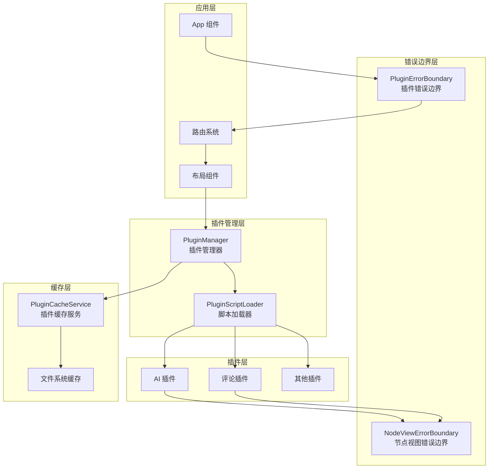
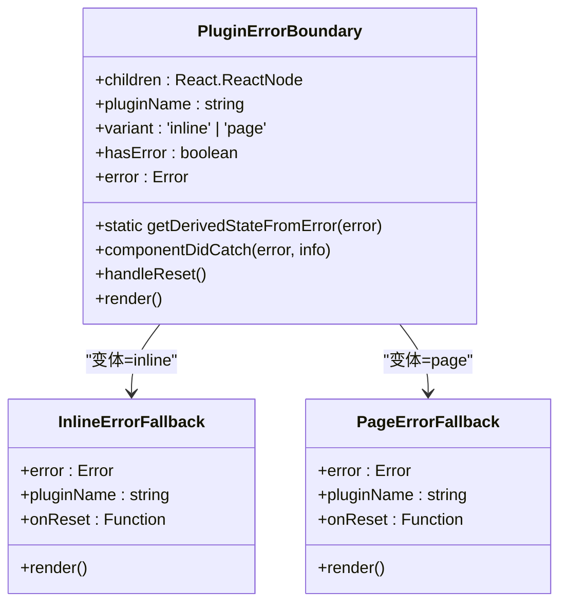
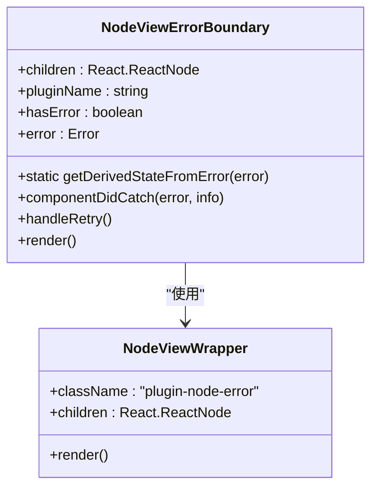
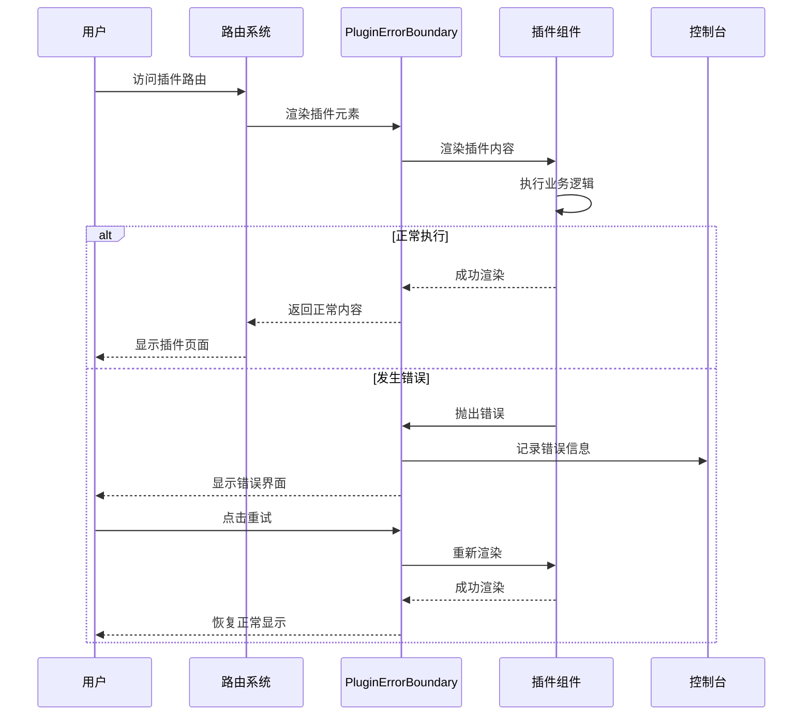
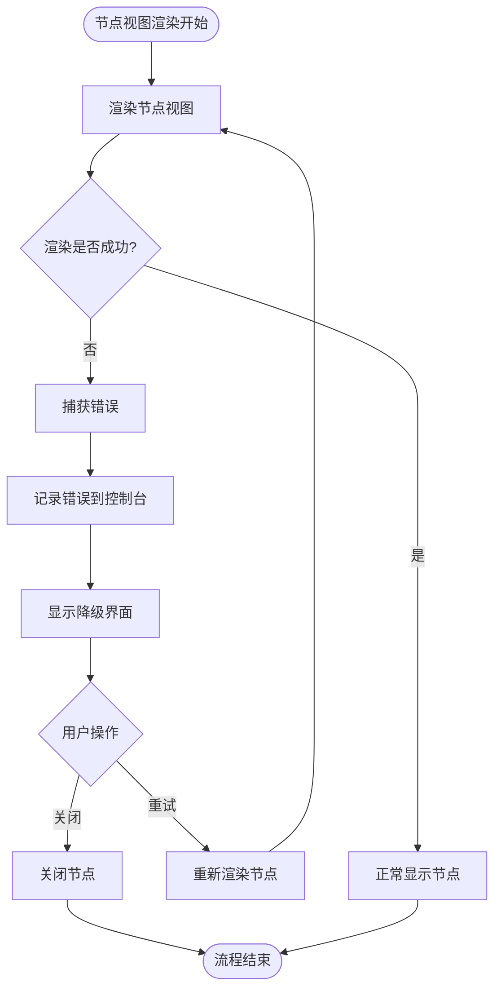
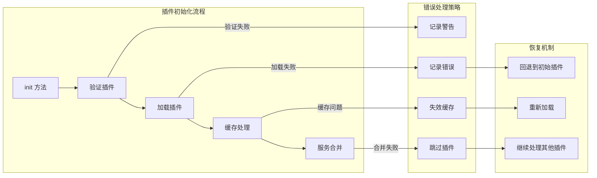
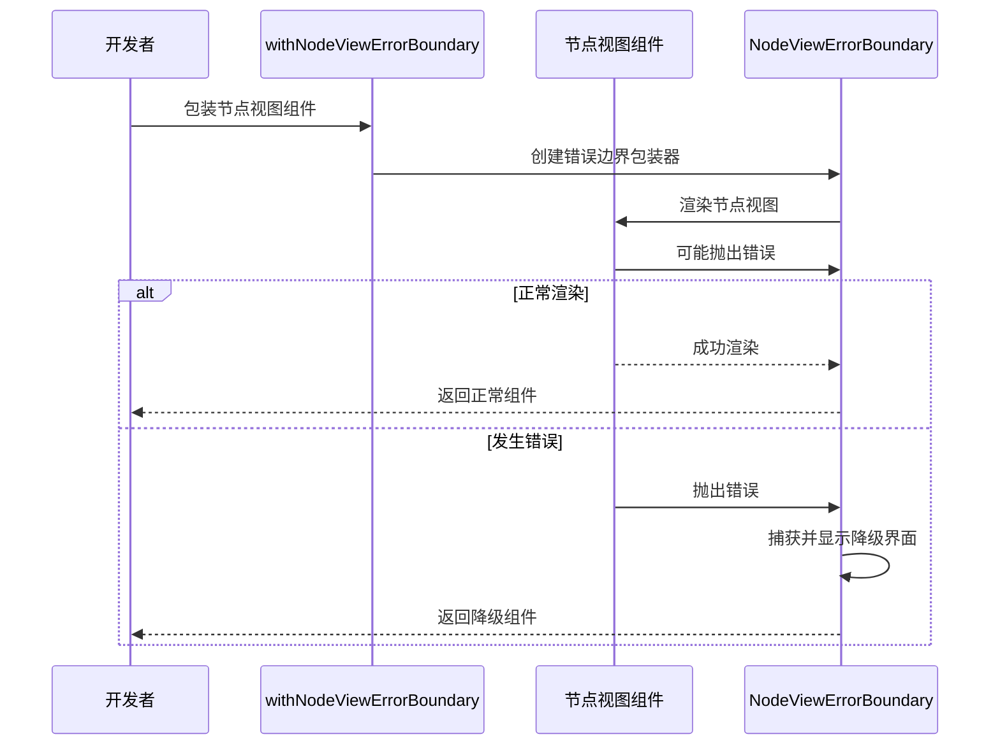
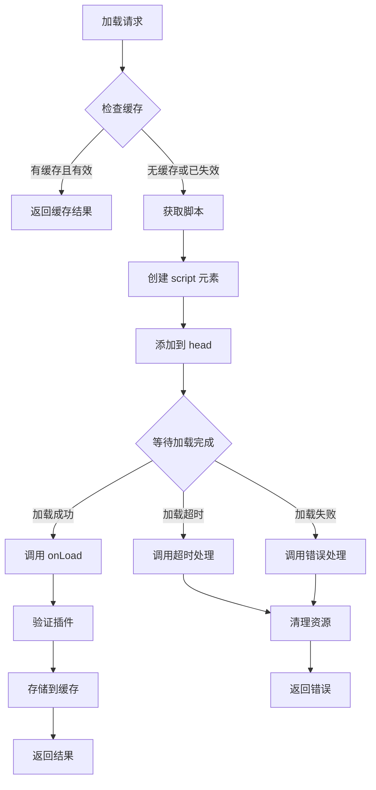
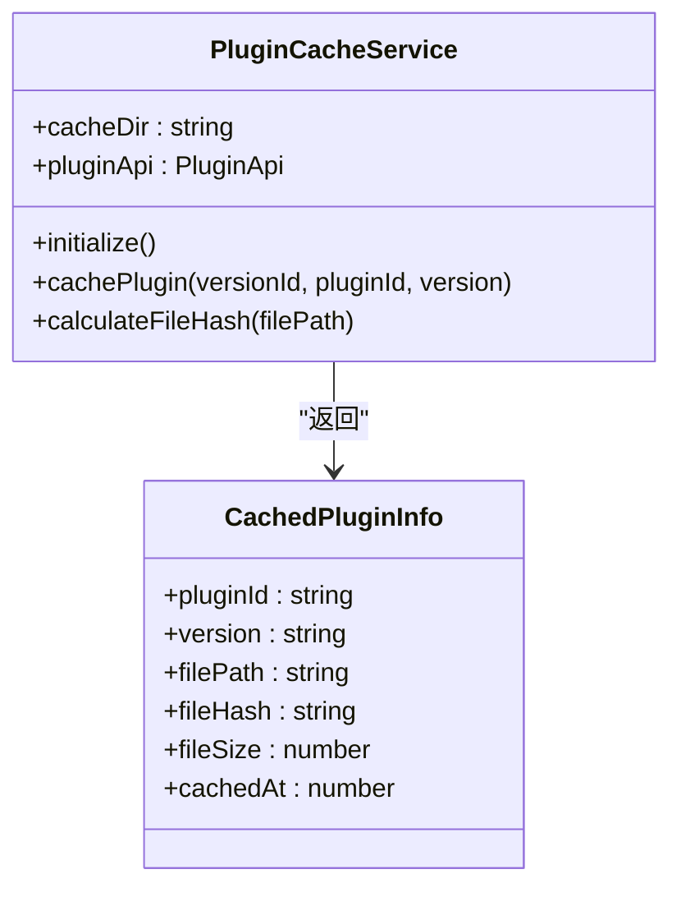
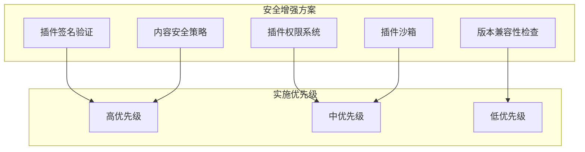

# 插件错误边界系统

<cite>
**本文档引用的文件**
- [PluginErrorBoundary.tsx](file://packages/core/src/components/PluginErrorBoundary.tsx)
- [NodeViewErrorBoundary.tsx](file://packages/editor/src/components/NodeViewErrorBoundary.tsx)
- [PluginManager.ts](file://packages/common/src/core/PluginManager.ts)
- [App.tsx](file://packages/core/src/App.tsx)
- [import-util.ts](file://packages/common/src/utils/import-util.ts)
- [plugin-cache-service.ts](file://packages/electron-adapter/src/plugin/plugin-cache-service.ts)
- [index.tsx](file://packages/plugin-ai/src/index.tsx)
- [index.tsx](file://packages/plugin-comment/src/index.tsx)
- [client.ts](file://packages/electron-adapter/src/http/client.ts)
</cite>

## 目录
1. [简介](#简介)
2. [系统架构概览](#系统架构概览)
3. [核心组件分析](#核心组件分析)
4. [错误边界工作流程](#错误边界工作流程)
5. [插件管理与错误处理](#插件管理与错误处理)
6. [编辑器节点视图错误处理](#编辑器节点视图错误处理)
7. [缓存与脚本加载机制](#缓存与脚本加载机制)
8. [安全考虑与改进建议](#安全考虑与改进建议)
9. [故障排除指南](#故障排除指南)
10. [总结](#总结)

## 简介

插件错误边界系统是知识平台项目中的一个关键特性，旨在确保单个插件的错误不会影响整个应用程序的稳定性。该系统通过多层次的错误捕获机制，为插件路由页面和编辑器节点视图提供隔离的错误处理能力。

系统的核心目标是在插件开发和部署过程中提供健壮的错误隔离，确保用户界面的连续性和数据的安全性。通过将错误限制在特定的插件范围内，系统能够维持整体应用的可用性。

## 系统架构概览

**图表来源**
- [App.tsx:32-48](file://packages/core/src/App.tsx#L32-L48)
- [PluginErrorBoundary.tsx:18-24](file://packages/core/src/components/PluginErrorBoundary.tsx#L18-L24)
- [PluginManager.ts:100-129](file://packages/common/src/core/PluginManager.ts#L100-L129)

## 核心组件分析

### PluginErrorBoundary 组件

PluginErrorBoundary 是系统中最核心的错误边界组件，负责捕获和处理插件相关的错误。

**图表来源**
- [PluginErrorBoundary.tsx:5-16](file://packages/core/src/components/PluginErrorBoundary.tsx#L5-L16)
- [PluginErrorBoundary.tsx:68-99](file://packages/core/src/components/PluginErrorBoundary.tsx#L68-L99)

该组件具有以下关键特性：

1. **双模式支持**：支持内联模式（用于节点视图）和页面模式（用于路由页面）
2. **错误状态管理**：维护错误状态和错误信息
3. **自动重试机制**：提供重试按钮让用户重新加载插件
4. **详细错误信息**：显示具体的错误消息供开发者调试

**章节来源**
- [PluginErrorBoundary.tsx:18-63](file://packages/core/src/components/PluginErrorBoundary.tsx#L18-L63)

### NodeViewErrorBoundary 组件

NodeViewErrorBoundary 专门针对 ProseMirror 编辑器的节点视图组件设计，提供更精细的错误处理。

**图表来源**
- [NodeViewErrorBoundary.tsx:4-12](file://packages/editor/src/components/NodeViewErrorBoundary.tsx#L4-L12)
- [NodeViewErrorBoundary.tsx:41-63](file://packages/editor/src/components/NodeViewErrorBoundary.tsx#L41-L63)

**章节来源**
- [NodeViewErrorBoundary.tsx:14-68](file://packages/editor/src/components/NodeViewErrorBoundary.tsx#L14-L68)

## 错误边界工作流程

### 路由级错误处理流程

**图表来源**
- [App.tsx:32-48](file://packages/core/src/App.tsx#L32-L48)
- [PluginErrorBoundary.tsx:31-41](file://packages/core/src/components/PluginErrorBoundary.tsx#L31-L41)

### 节点视图错误处理流程

**图表来源**
- [NodeViewErrorBoundary.tsx:26-36](file://packages/editor/src/components/NodeViewErrorBoundary.tsx#L26-L36)

**章节来源**
- [App.tsx:32-48](file://packages/core/src/App.tsx#L32-L48)
- [NodeViewErrorBoundary.tsx:30-36](file://packages/editor/src/components/NodeViewErrorBoundary.tsx#L30-L36)

## 插件管理与错误处理

### PluginManager 的错误处理机制

PluginManager 作为插件系统的中央协调者，实现了多层错误处理策略：

**图表来源**
- [PluginManager.ts:202-278](file://packages/common/src/core/PluginManager.ts#L202-L278)
- [PluginManager.ts:315-358](file://packages/common/src/core/PluginManager.ts#L315-L358)

**章节来源**
- [PluginManager.ts:186-278](file://packages/common/src/core/PluginManager.ts#L186-L278)

### 插件安装和卸载的错误处理

系统提供了完整的插件生命周期错误处理：

- **安装验证**：检查插件名称、重复安装等问题
- **动态加载**：使用脚本加载器处理远程插件
- **缓存管理**：支持缓存失效和重新加载
- **服务注册**：安全地注册和注销插件服务

**章节来源**
- [PluginManager.ts:291-358](file://packages/common/src/core/PluginManager.ts#L291-L358)

## 编辑器节点视图错误处理

### withNodeViewErrorBoundary 高阶组件

系统提供了专门的高阶组件来包装节点视图组件：

**图表来源**
- [NodeViewErrorBoundary.tsx:83-94](file://packages/editor/src/components/NodeViewErrorBoundary.tsx#L83-L94)

**章节来源**
- [NodeViewErrorBoundary.tsx:70-94](file://packages/editor/src/components/NodeViewErrorBoundary.tsx#L70-L94)

## 缓存与脚本加载机制

### 插件脚本加载器

系统使用专用的脚本加载器来处理插件的动态加载：

**图表来源**
- [import-util.ts:51-114](file://packages/common/src/utils/import-util.ts#L51-L114)

**章节来源**
- [import-util.ts:43-179](file://packages/common/src/utils/import-util.ts#L43-L179)

### 本地插件缓存服务

Electron 适配器提供了本地插件缓存功能：

**图表来源**
- [plugin-cache-service.ts:15-58](file://packages/electron-adapter/src/plugin/plugin-cache-service.ts#L15-L58)

**章节来源**
- [plugin-cache-service.ts:21-58](file://packages/electron-adapter/src/plugin/plugin-cache-service.ts#L21-L58)

## 安全考虑与改进建议

### 当前安全状况

根据项目审查报告，当前存在以下安全风险：

1. **插件签名验证缺失**：无法验证插件来源的真实性
2. **动态脚本加载风险**：从远程源加载脚本存在注入风险
3. **缺乏沙箱隔离**：插件代码在主进程中直接运行
4. **权限控制系统缺失**：插件可能访问超出预期的资源

### 改进建议

**章节来源**
- [PROJECT_REVIEW_REPORT.md:370-382](file://PROJECT_REVIEW_REPORT.md#L370-L382)

## 故障排除指南

### 常见错误场景及解决方案

#### 插件加载失败

**症状**：插件页面显示错误界面，控制台出现加载错误

**排查步骤**：
1. 检查网络连接和插件服务器状态
2. 验证插件 URL 和访问权限
3. 查看浏览器开发者工具的网络面板
4. 检查插件缓存是否需要清理

**解决方法**：
- 使用重试按钮重新加载插件
- 清除浏览器缓存后重试
- 检查插件依赖项是否完整

#### 编辑器节点崩溃

**症状**：文档中的特定节点显示错误占位符

**排查步骤**：
1. 确认节点视图组件的实现是否正确
2. 检查插件的依赖包版本兼容性
3. 查看控制台中的具体错误信息

**解决方法**：
- 在节点视图组件中添加适当的错误边界
- 更新插件到最新版本
- 检查插件与编辑器版本的兼容性

#### 插件冲突问题

**症状**：多个插件同时使用时出现功能异常

**排查步骤**：
1. 禁用其他插件单独测试
2. 检查插件间的服务冲突
3. 验证插件的全局状态共享

**解决方法**：
- 使用插件管理器的卸载功能移除冲突插件
- 更新插件以修复已知的兼容性问题
- 联系插件开发者获取支持

**章节来源**
- [PluginErrorBoundary.tsx:110-141](file://packages/core/src/components/PluginErrorBoundary.tsx#L110-L141)
- [NodeViewErrorBoundary.tsx:40-65](file://packages/editor/src/components/NodeViewErrorBoundary.tsx#L40-L65)

## 总结

插件错误边界系统通过多层次的设计实现了插件级别的错误隔离，确保了整个应用的稳定性和用户体验。系统的主要优势包括：

1. **完整的错误隔离**：路由级和节点视图级的双重保护
2. **优雅的降级处理**：提供友好的错误界面和重试机制
3. **灵活的配置选项**：支持不同类型的插件和使用场景
4. **完善的缓存机制**：优化插件加载性能和可靠性

尽管系统在错误处理方面表现优秀，但仍需关注安全性方面的改进，特别是在插件签名验证、沙箱隔离和权限控制等方面。通过持续的安全加固和功能完善，插件错误边界系统将为知识平台提供更加稳健和安全的插件生态。