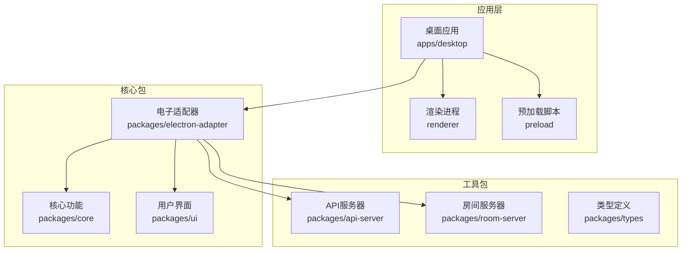
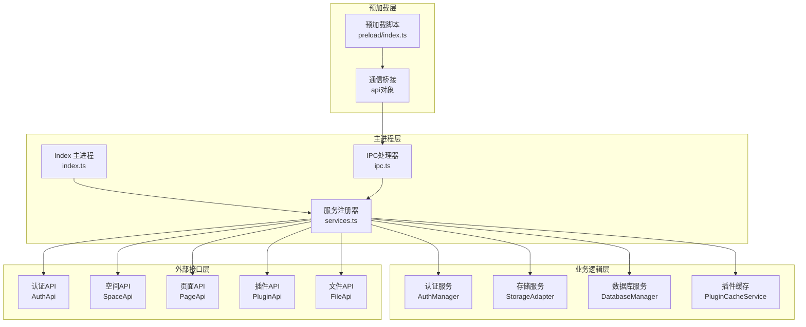
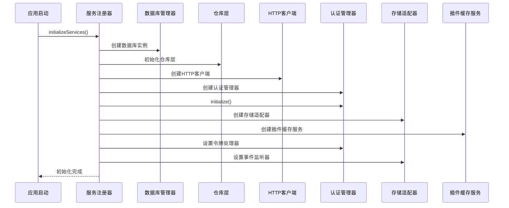
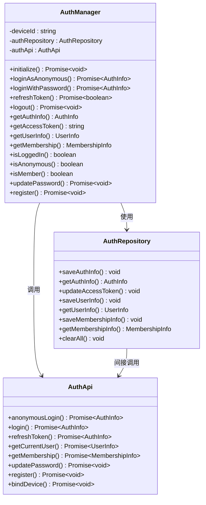
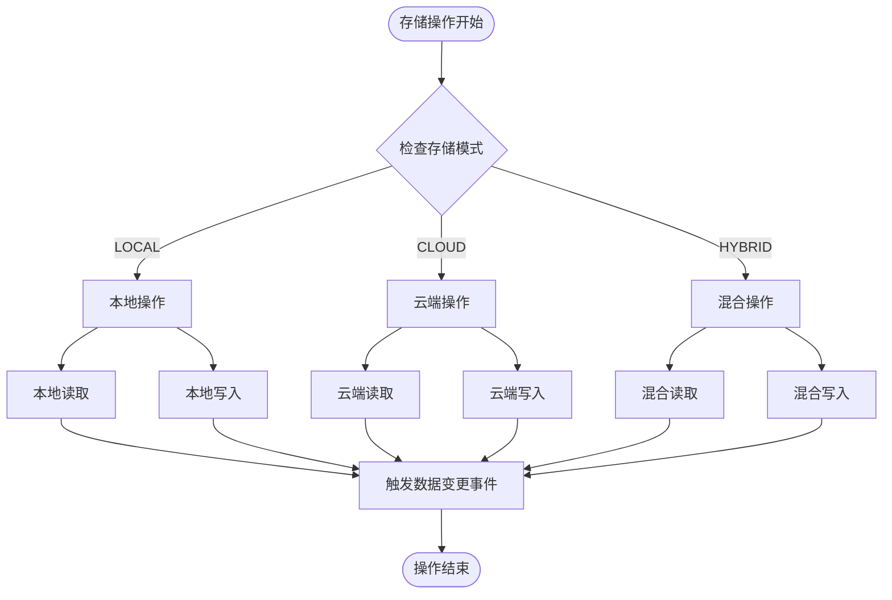
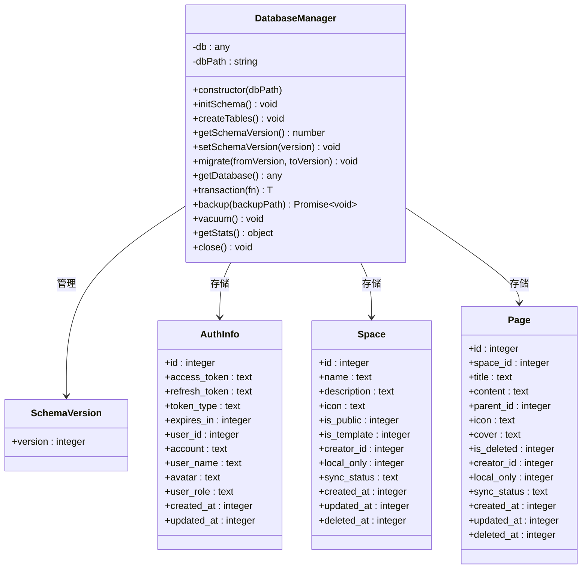
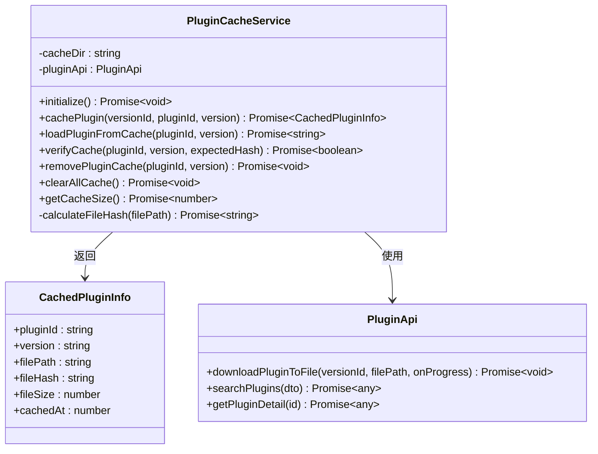
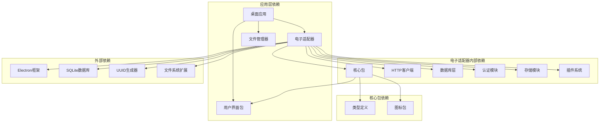

# 服务注册系统

<cite>
**本文档引用的文件**
- [services.ts](file://apps/desktop/src/main/services.ts)
- [index.ts](file://apps/desktop/src/main/index.ts)
- [ipc.ts](file://apps/desktop/src/main/ipc.ts)
- [index.ts](file://apps/desktop/src/preload/index.ts)
- [package.json](file://apps/desktop/package.json)
- [auth-manager.ts](file://packages/electron-adapter/src/auth/auth-manager.ts)
- [storage-adapter.ts](file://packages/electron-adapter/src/storage/storage-adapter.ts)
- [manager.ts](file://packages/electron-adapter/src/database/manager.ts)
- [plugin-cache-service.ts](file://packages/electron-adapter/src/plugin/plugin-cache-service.ts)
- [index.ts](file://packages/electron-adapter/src/index.ts)
- [package.json](file://package.json)
- [turbo.json](file://turbo.json)
- [pnpm-workspace.yaml](file://pnpm-workspace.yaml)
</cite>

## 目录
1. [简介](#简介)
2. [项目结构](#项目结构)
3. [核心组件](#核心组件)
4. [架构概览](#架构概览)
5. [详细组件分析](#详细组件分析)
6. [依赖关系分析](#依赖关系分析)
7. [性能考虑](#性能考虑)
8. [故障排除指南](#故障排除指南)
9. [结论](#结论)

## 简介

服务注册系统是知识库桌面应用程序的核心基础设施，负责管理应用启动时的服务初始化、依赖注入和生命周期管理。该系统采用模块化设计，通过统一的服务注册机制为整个应用提供认证、存储、数据库、插件缓存等核心服务。

系统基于 Electron 框架构建，实现了桌面应用特有的服务架构，包括主进程服务管理、渲染进程通信桥接和跨进程数据同步机制。

## 项目结构

该项目采用 Monorepo 架构，使用 Turborepo 进行多包管理。桌面应用位于 `apps/desktop` 目录下，核心功能封装在 `packages` 目录中的各个包中。

**图表来源**
- [pnpm-workspace.yaml:1-4](file://pnpm-workspace.yaml#L1-L4)
- [package.json:1-125](file://package.json#L1-L125)

**章节来源**
- [pnpm-workspace.yaml:1-4](file://pnpm-workspace.yaml#L1-L4)
- [package.json:1-125](file://package.json#L1-L125)
- [turbo.json:1-27](file://turbo.json#L1-L27)

## 核心组件

服务注册系统由以下核心组件构成：

### 主进程服务管理器
- **initializeServices**: 应用启动时初始化所有服务
- **cleanupServices**: 应用退出时清理资源
- **服务获取器**: 提供全局服务访问接口

### 认证管理系统
- **AuthManager**: 处理用户认证、会话管理和权限控制
- 支持匿名登录和密码登录两种认证模式
- 自动处理令牌刷新和过期事件

### 存储适配器
- **StorageAdapter**: 统一管理本地、云端和混合存储模式
- 支持空间(Space)和页面(Page)的 CRUD 操作
- 实现数据同步和冲突解决机制

### 数据库管理器
- **DatabaseManager**: SQLite 数据库的初始化、迁移和管理
- 提供事务支持和数据库备份功能
- 管理应用的所有本地数据存储

### 插件缓存服务
- **PluginCacheService**: 管理插件的下载、缓存和验证
- 支持插件版本管理和增量更新
- 提供缓存清理和大小监控功能

**章节来源**
- [services.ts:44-133](file://apps/desktop/src/main/services.ts#L44-L133)
- [auth-manager.ts:25-319](file://packages/electron-adapter/src/auth/auth-manager.ts#L25-L319)
- [storage-adapter.ts:23-677](file://packages/electron-adapter/src/storage/storage-adapter.ts#L23-L677)
- [manager.ts:5-360](file://packages/electron-adapter/src/database/manager.ts#L5-L360)
- [plugin-cache-service.ts:15-148](file://packages/electron-adapter/src/plugin/plugin-cache-service.ts#L15-L148)

## 架构概览

服务注册系统采用分层架构设计，实现了清晰的关注点分离和依赖管理。

**图表来源**
- [index.ts:67-107](file://apps/desktop/src/main/index.ts#L67-L107)
- [services.ts:44-133](file://apps/desktop/src/main/services.ts#L44-L133)
- [ipc.ts:18-800](file://apps/desktop/src/main/ipc.ts#L18-L800)
- [index.ts:1-29](file://apps/desktop/src/preload/index.ts#L1-L29)

## 详细组件分析

### 服务初始化流程

服务注册系统采用渐进式初始化策略，确保服务之间的依赖关系得到正确处理。

**图表来源**
- [services.ts:44-133](file://apps/desktop/src/main/services.ts#L44-L133)

### 认证管理器架构

认证管理器实现了完整的用户身份验证和会话管理功能。

**图表来源**
- [auth-manager.ts:25-319](file://packages/electron-adapter/src/auth/auth-manager.ts#L25-L319)

**章节来源**
- [auth-manager.ts:25-319](file://packages/electron-adapter/src/auth/auth-manager.ts#L25-L319)

### 存储适配器工作流程

存储适配器提供了统一的数据访问接口，支持多种存储模式。

**图表来源**
- [storage-adapter.ts:45-481](file://packages/electron-adapter/src/storage/storage-adapter.ts#L45-L481)

**章节来源**
- [storage-adapter.ts:23-677](file://packages/electron-adapter/src/storage/storage-adapter.ts#L23-L677)

### 数据库管理器功能

数据库管理器负责 SQLite 数据库的初始化、迁移和维护。

**图表来源**
- [manager.ts:5-360](file://packages/electron-adapter/src/database/manager.ts#L5-L360)

**章节来源**
- [manager.ts:5-360](file://packages/electron-adapter/src/database/manager.ts#L5-L360)

### 插件缓存服务架构

插件缓存服务实现了高效的插件管理和版本控制机制。

**图表来源**
- [plugin-cache-service.ts:15-148](file://packages/electron-adapter/src/plugin/plugin-cache-service.ts#L15-L148)

**章节来源**
- [plugin-cache-service.ts:15-148](file://packages/electron-adapter/src/plugin/plugin-cache-service.ts#L15-L148)

## 依赖关系分析

服务注册系统展现了清晰的依赖层次结构，体现了良好的软件工程实践。

**图表来源**
- [package.json:18-40](file://apps/desktop/package.json#L18-L40)
- [index.ts:1-9](file://packages/electron-adapter/src/index.ts#L1-L9)

**章节来源**
- [package.json:18-40](file://apps/desktop/package.json#L18-L40)
- [index.ts:1-9](file://packages/electron-adapter/src/index.ts#L1-L9)

## 性能考虑

服务注册系统在设计时充分考虑了性能优化：

### 内存管理
- 采用单例模式管理全局服务实例
- 及时清理不再使用的数据库连接
- 合理使用事件监听器，避免内存泄漏

### 数据库优化
- 使用索引优化常用查询操作
- 支持事务批量操作减少磁盘 I/O
- 提供数据库压缩功能释放存储空间

### 缓存策略
- 插件文件缓存减少网络请求
- 文件哈希验证确保缓存完整性
- 支持缓存清理和大小监控

### 异步处理
- 所有网络请求采用异步模式
- 并行处理多个认证信息获取
- 非阻塞的文件操作

## 故障排除指南

### 常见问题及解决方案

**服务初始化失败**
- 检查数据库文件权限
- 验证用户数据目录可写性
- 确认网络连接正常

**认证相关错误**
- 检查令牌是否过期
- 验证服务器端点可达性
- 查看认证日志获取详细错误信息

**存储同步问题**
- 检查网络连接状态
- 验证用户权限级别
- 清理本地缓存后重试

**插件加载失败**
- 检查插件缓存目录权限
- 验证插件文件完整性
- 确认插件版本兼容性

**章节来源**
- [services.ts:117-133](file://apps/desktop/src/main/services.ts#L117-L133)
- [auth-manager.ts:103-126](file://packages/electron-adapter/src/auth/auth-manager.ts#L103-L126)
- [storage-adapter.ts:469-481](file://packages/electron-adapter/src/storage/storage-adapter.ts#L469-L481)

## 结论

服务注册系统通过模块化设计和清晰的架构层次，为知识库桌面应用提供了稳定可靠的服务基础设施。系统实现了完整的认证、存储、数据库和插件管理功能，支持多种部署场景和用户需求。

该系统的设计体现了现代桌面应用开发的最佳实践，包括：
- 清晰的职责分离和依赖管理
- 完善的错误处理和恢复机制
- 高效的性能优化策略
- 良好的可扩展性和维护性

通过统一的服务注册机制，开发者可以轻松地添加新的功能模块，同时保持系统的稳定性和一致性。这为知识库应用的持续发展奠定了坚实的基础。