# 语音转文字插件

<cite>
**本文档引用的文件**
- [packages/plugin-speech-to-text/src/index.tsx](file://packages/plugin-speech-to-text/src/index.tsx)
- [packages/plugin-speech-to-text/src/extension/index.tsx](file://packages/plugin-speech-to-text/src/extension/index.tsx)
- [packages/plugin-speech-to-text/src/extension/menu/static.tsx](file://packages/plugin-speech-to-text/src/extension/menu/static.tsx)
- [packages/plugin-speech-to-text/src/extension/menu/MeetingMinutesPanel.tsx](file://packages/plugin-speech-to-text/src/extension/menu/MeetingMinutesPanel.tsx)
- [packages/plugin-speech-to-text/src/extension/menu/MeetingMinutesStaticMenu.tsx](file://packages/plugin-speech-to-text/src/extension/menu/MeetingMinutesStaticMenu.tsx)
- [packages/plugin-speech-to-text/src/extension/menu/SpeechToTextPanel.tsx](file://packages/plugin-speech-to-text/src/extension/menu/SpeechToTextPanel.tsx)
- [packages/plugin-speech-to-text/src/extension/meeting-minutes/MeetingMinutesView.tsx](file://packages/plugin-speech-to-text/src/extension/meeting-minutes/MeetingMinutesView.tsx)
- [packages/plugin-speech-to-text/src/extension/meeting-minutes/meeting-minutes.ts](file://packages/plugin-speech-to-text/src/extension/meeting-minutes/meeting-minutes.ts)
- [packages/plugin-speech-to-text/src/hooks/useSpeechRecognition.ts](file://packages/plugin-speech-to-text/src/hooks/useSpeechRecognition.ts)
- [packages/plugin-speech-to-text/src/hooks/useMeetingRecorder.ts](file://packages/plugin-speech-to-text/src/hooks/useMeetingRecorder.ts)
- [packages/plugin-speech-to-text/src/types/index.ts](file://packages/plugin-speech-to-text/src/types/index.ts)
- [packages/plugin-speech-to-text/package.json](file://packages/plugin-speech-to-text/package.json)
- [packages/plugin-speech-to-text/rollup.config.mjs](file://packages/plugin-speech-to-text/rollup.config.mjs)
- [packages/plugin-speech-to-text/tailwind.config.js](file://packages/plugin-speech-to-text/tailwind.config.js)
- [packages/plugin-speech-to-text/postcss.config.js](file://packages/plugin-speech-to-text/postcss.config.js)
- [packages/plugin-speech-to-text/tsconfig.json](file://packages/plugin-speech-to-text/tsconfig.json)
</cite>

## 更新摘要
**变更内容**
- 新增完整的会议记录功能模块
- 添加 MeetingMinutesView、MeetingMinutesPanel、MeetingMinutesStaticMenu 组件
- 新增 useMeetingRecorder Hook 实现录音和转录功能
- 扩展 MeetingMinutesNode 支持会议纪要节点
- 增强编辑器块引用系统集成
- 支持实时语音识别、自动转录处理和 AI 摘要生成

## 目录
1. [简介](#简介)
2. [项目结构](#项目结构)
3. [核心组件](#核心组件)
4. [架构概览](#架构概览)
5. [详细组件分析](#详细组件分析)
6. [会议记录功能](#会议记录功能)
7. [依赖关系分析](#依赖关系分析)
8. [性能考虑](#性能考虑)
9. [故障排除指南](#故障排除指南)
10. [结论](#结论)

## 简介

语音转文字插件是一个基于 Web Speech API 的浏览器扩展插件，为知识仓库编辑器提供实时语音转文本功能。该插件现已升级为完整的会议记录解决方案，支持实时语音识别、自动转录处理、AI 摘要生成和编辑器块引用系统集成。

该插件采用模块化设计，主要包含以下特性：
- 支持多种语言的语音识别（英语、中文、西班牙语、法语、德语、日语）
- 实时语音转文本显示
- 完整的会议记录功能（录音、转录、摘要生成）
- 响应式用户界面设计
- 完整的错误处理机制
- 跨浏览器兼容性支持
- AI 摘要生成和智能编辑器集成

## 项目结构

语音转文字插件采用清晰的模块化组织结构，现已扩展为包含会议记录功能的完整系统：

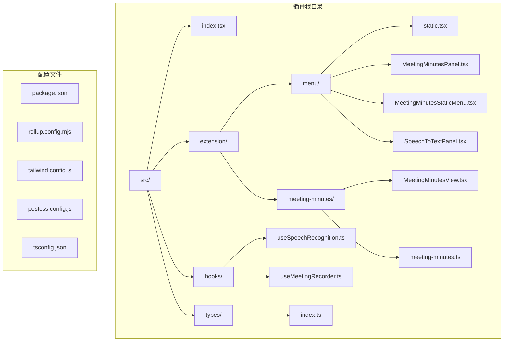

**图表来源**
- [packages/plugin-speech-to-text/src/index.tsx:1-36](file://packages/plugin-speech-to-text/src/index.tsx#L1-L36)
- [packages/plugin-speech-to-text/src/extension/index.tsx:1-32](file://packages/plugin-speech-to-text/src/extension/index.tsx#L1-L32)
- [packages/plugin-speech-to-text/src/hooks/useMeetingRecorder.ts:1-247](file://packages/plugin-speech-to-text/src/hooks/useMeetingRecorder.ts#L1-L247)

**章节来源**
- [packages/plugin-speech-to-text/src/index.tsx:1-36](file://packages/plugin-speech-to-text/src/index.tsx#L1-L36)
- [packages/plugin-speech-to-text/package.json:1-38](file://packages/plugin-speech-to-text/package.json#L1-L38)

## 核心组件

### 插件主入口

插件的核心入口文件定义了完整的插件配置和导出接口，现已包含会议记录扩展：

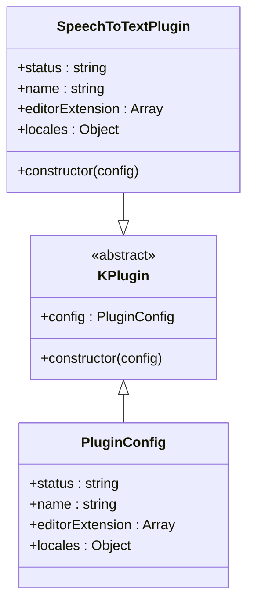

**图表来源**
- [packages/plugin-speech-to-text/src/index.tsx:4-6](file://packages/plugin-speech-to-text/src/index.tsx#L4-L6)

### 扩展系统

插件使用 Tiptap 编辑器的扩展系统来集成语音识别和会议记录功能：

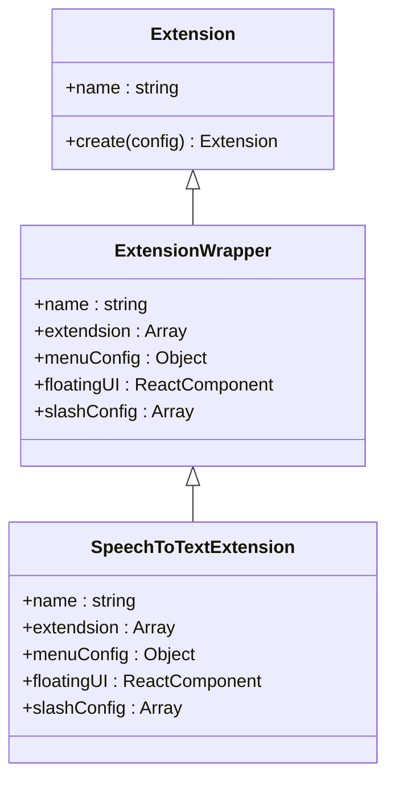

**图表来源**
- [packages/plugin-speech-to-text/src/extension/index.tsx:13-31](file://packages/plugin-speech-to-text/src/extension/index.tsx#L13-L31)

**章节来源**
- [packages/plugin-speech-to-text/src/index.tsx:1-36](file://packages/plugin-speech-to-text/src/index.tsx#L1-L36)
- [packages/plugin-speech-to-text/src/extension/index.tsx:1-32](file://packages/plugin-speech-to-text/src/extension/index.tsx#L1-L32)

## 架构概览

语音转文字插件采用分层架构设计，从底层的 Web Speech API 到上层的用户界面组件，现已扩展为完整的会议记录系统：

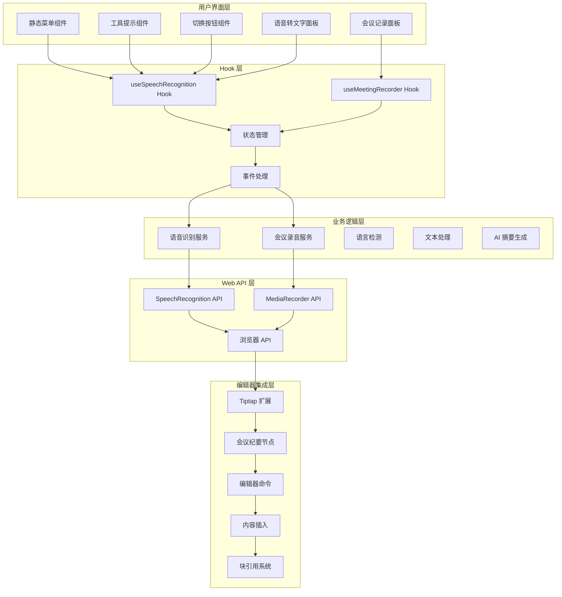

**图表来源**
- [packages/plugin-speech-to-text/src/extension/menu/static.tsx:8-22](file://packages/plugin-speech-to-text/src/extension/menu/static.tsx#L8-L22)
- [packages/plugin-speech-to-text/src/extension/menu/MeetingMinutesStaticMenu.tsx:8-33](file://packages/plugin-speech-to-text/src/extension/menu/MeetingMinutesStaticMenu.tsx#L8-L33)
- [packages/plugin-speech-to-text/src/hooks/useMeetingRecorder.ts:19-247](file://packages/plugin-speech-to-text/src/hooks/useMeetingRecorder.ts#L19-L247)

## 详细组件分析

### 语音识别 Hook 分析

`useSpeechRecognition` 是插件的核心 Hook，负责管理语音识别的所有状态和生命周期：

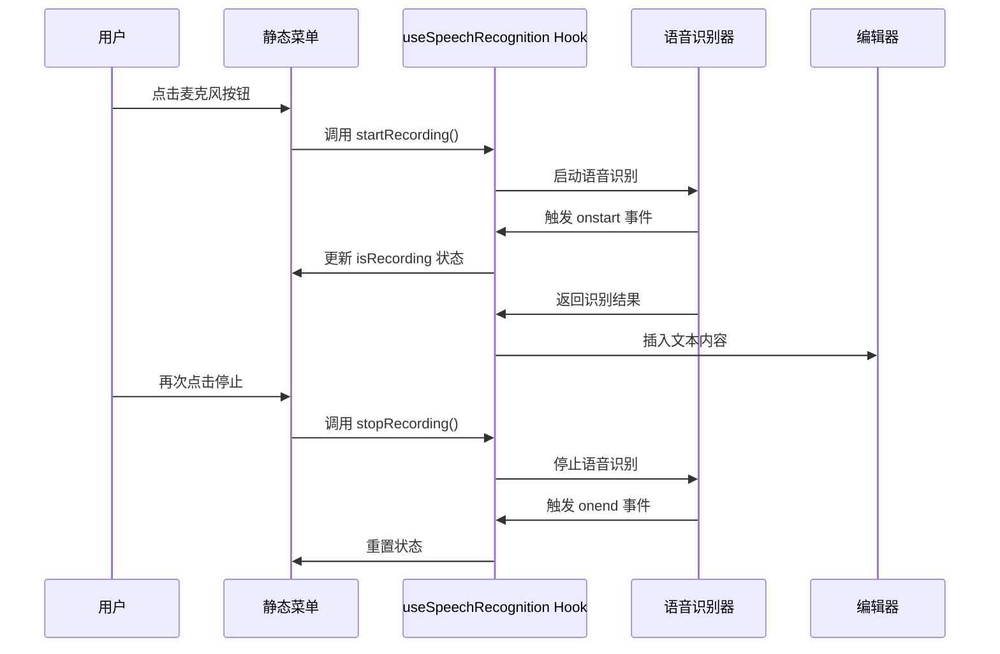

**图表来源**
- [packages/plugin-speech-to-text/src/hooks/useSpeechRecognition.ts:54-72](file://packages/plugin-speech-to-text/src/hooks/useSpeechRecognition.ts#L54-L72)
- [packages/plugin-speech-to-text/src/extension/menu/static.tsx:16-22](file://packages/plugin-speech-to-text/src/extension/menu/static.tsx#L16-L22)

#### 状态管理流程


**图表来源**
- [packages/plugin-speech-to-text/src/hooks/useSpeechRecognition.ts:39-127](file://packages/plugin-speech-to-text/src/hooks/useSpeechRecognition.ts#L39-L127)

**章节来源**
- [packages/plugin-speech-to-text/src/hooks/useSpeechRecognition.ts:1-160](file://packages/plugin-speech-to-text/src/hooks/useSpeechRecognition.ts#L1-L160)

### 静态菜单组件分析

静态菜单组件提供了用户交互界面，集成了完整的语音识别控制功能：

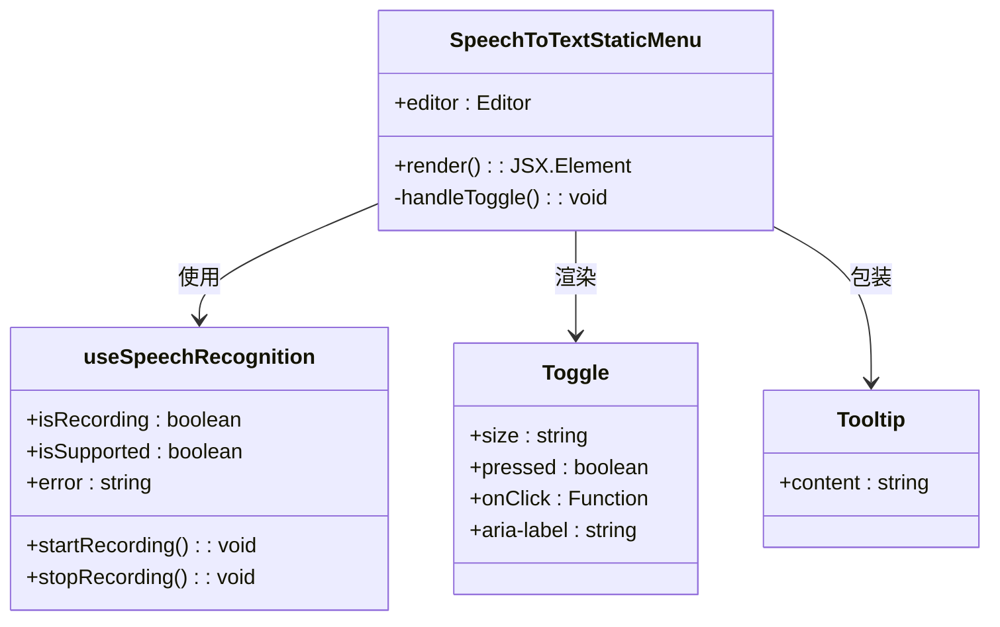

**图表来源**
- [packages/plugin-speech-to-text/src/extension/menu/static.tsx:8-22](file://packages/plugin-speech-to-text/src/extension/menu/static.tsx#L8-L22)

#### 错误处理机制

插件实现了完善的错误处理机制，针对不同的语音识别错误类型提供相应的用户反馈：

| 错误类型 | 处理方式 | 用户提示 |
|---------|---------|---------|
| no-speech | 提示重新尝试 | "未检测到语音，请重试" |
| audio-capture | 检查麦克风连接 | "未找到麦克风，请确保已安装" |
| not-allowed | 引导用户授权 | "麦克风权限被拒绝，请允许访问" |
| network | 建议检查网络连接 | "发生网络错误，请检查连接" |
| 其他错误 | 记录详细错误信息 | "语音识别发生错误" |

**章节来源**
- [packages/plugin-speech-to-text/src/extension/menu/static.tsx:1-55](file://packages/plugin-speech-to-text/src/extension/menu/static.tsx#L1-L55)

### 类型定义分析

插件使用 TypeScript 定义了完整的类型系统，确保代码的类型安全性和可维护性：

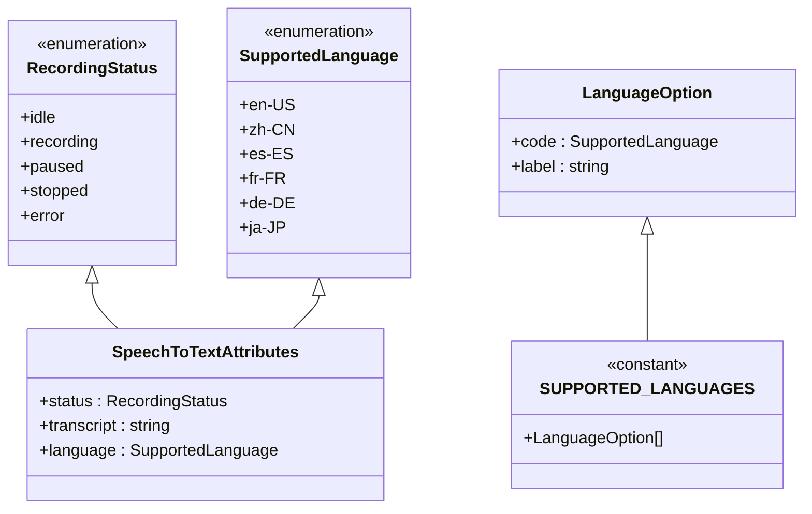

**图表来源**
- [packages/plugin-speech-to-text/src/types/index.ts:1-24](file://packages/plugin-speech-to-text/src/types/index.ts#L1-L24)

**章节来源**
- [packages/plugin-speech-to-text/src/types/index.ts:1-24](file://packages/plugin-speech-to-text/src/types/index.ts#L1-L24)

## 会议记录功能

### MeetingMinutesView 组件

MeetingMinutesView 是会议记录功能的核心组件，提供了完整的会议纪要界面：

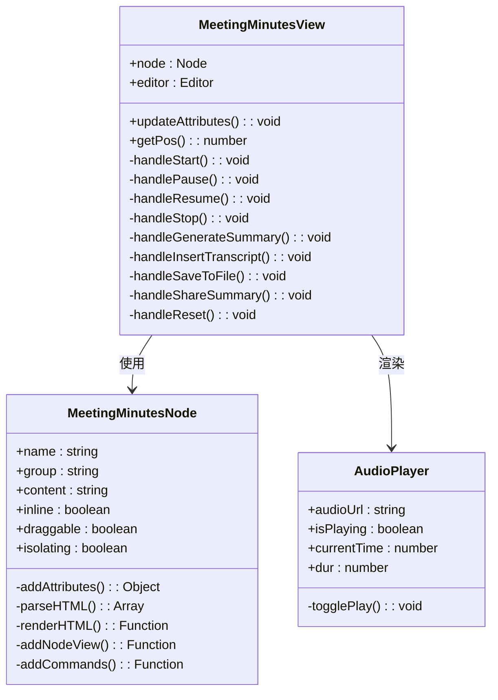

**图表来源**
- [packages/plugin-speech-to-text/src/extension/meeting-minutes/MeetingMinutesView.tsx:100-608](file://packages/plugin-speech-to-text/src/extension/meeting-minutes/MeetingMinutesView.tsx#L100-L608)
- [packages/plugin-speech-to-text/src/extension/meeting-minutes/meeting-minutes.ts:14-104](file://packages/plugin-speech-to-text/src/extension/meeting-minutes/meeting-minutes.ts#L14-L104)

#### 会议记录状态管理

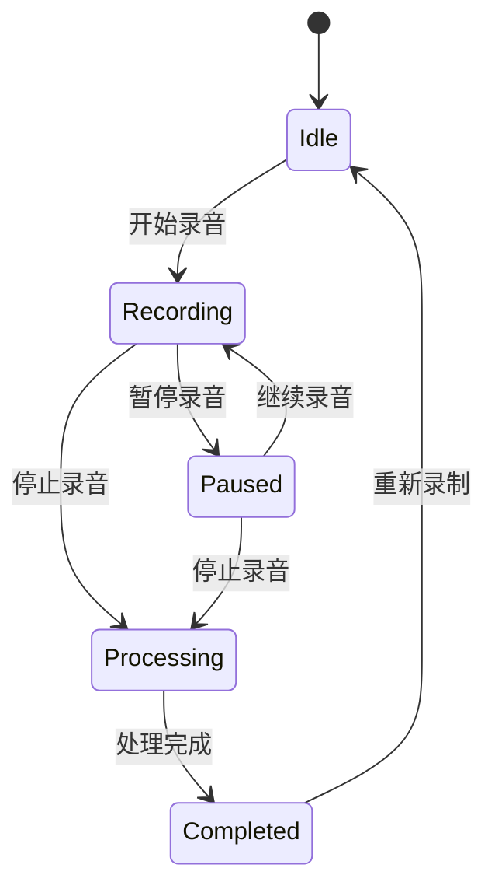

**图表来源**
- [packages/plugin-speech-to-text/src/extension/meeting-minutes/MeetingMinutesView.tsx:95-127](file://packages/plugin-speech-to-text/src/extension/meeting-minutes/MeetingMinutesView.tsx#L95-L127)

### MeetingMinutesPanel 组件

MeetingMinutesPanel 提供了浮动的会议记录面板，支持完整的录音和转录流程：

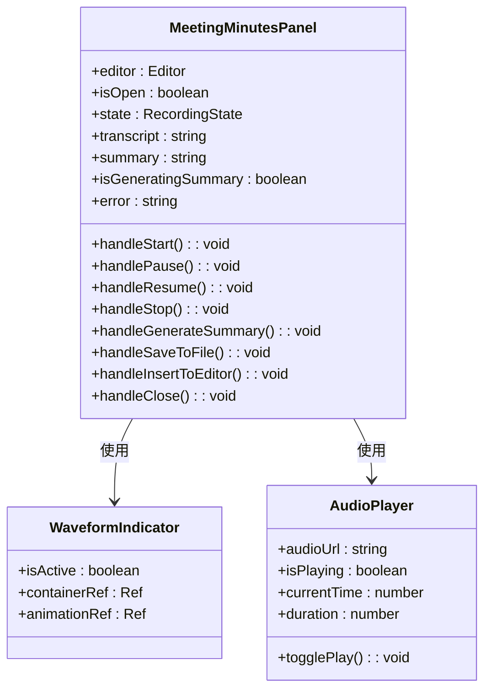

**图表来源**
- [packages/plugin-speech-to-text/src/extension/menu/MeetingMinutesPanel.tsx:168-589](file://packages/plugin-speech-to-text/src/extension/menu/MeetingMinutesPanel.tsx#L168-L589)

### MeetingMinutesStaticMenu 组件

MeetingMinutesStaticMenu 提供了静态的会议记录菜单项，与编辑器集成：

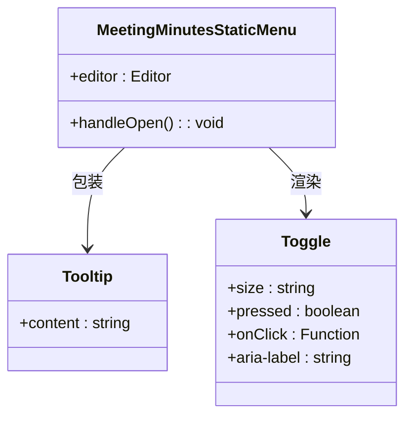

**图表来源**
- [packages/plugin-speech-to-text/src/extension/menu/MeetingMinutesStaticMenu.tsx:8-33](file://packages/plugin-speech-to-text/src/extension/menu/MeetingMinutesStaticMenu.tsx#L8-L33)

### useMeetingRecorder Hook

useMeetingRecorder 是会议记录功能的核心 Hook，负责管理录音和转录的所有状态：

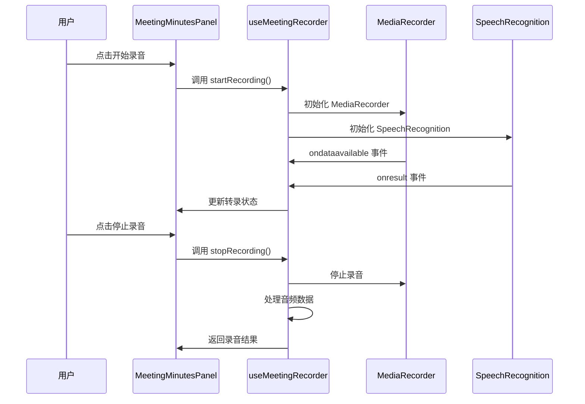

**图表来源**
- [packages/plugin-speech-to-text/src/hooks/useMeetingRecorder.ts:95-223](file://packages/plugin-speech-to-text/src/hooks/useMeetingRecorder.ts#L95-L223)

**章节来源**
- [packages/plugin-speech-to-text/src/extension/meeting-minutes/MeetingMinutesView.tsx:1-608](file://packages/plugin-speech-to-text/src/extension/meeting-minutes/MeetingMinutesView.tsx#L1-L608)
- [packages/plugin-speech-to-text/src/extension/menu/MeetingMinutesPanel.tsx:1-589](file://packages/plugin-speech-to-text/src/extension/menu/MeetingMinutesPanel.tsx#L1-L589)
- [packages/plugin-speech-to-text/src/extension/menu/MeetingMinutesStaticMenu.tsx:1-34](file://packages/plugin-speech-to-text/src/extension/menu/MeetingMinutesStaticMenu.tsx#L1-L34)
- [packages/plugin-speech-to-text/src/hooks/useMeetingRecorder.ts:1-247](file://packages/plugin-speech-to-text/src/hooks/useMeetingRecorder.ts#L1-L247)

## 依赖关系分析

插件的依赖关系体现了清晰的模块化设计和松耦合架构，现已扩展为包含会议记录功能的完整系统：

```mermaid
graph TB
subgraph "外部依赖"
A[@kn/common]
B[@kn/editor]
C[@kn/ui]
D[@kn/icon]
E[React]
F[@kn/core]
G[@kn/file-service]
H[@kn/editor-agent]
end
subgraph "内部包"
I[plugin-speech-to-text]
J[plugin-main]
K[plugin-ui]
end
subgraph "构建工具"
L[Rollup]
M[Tailwind CSS]
N[TypeScript]
end
I --> A
I --> B
I --> C
I --> D
I --> E
I --> F
I --> G
I --> H
I --> J
I --> K
I --> L
I --> M
I --> N
```

**图表来源**
- [packages/plugin-speech-to-text/package.json:24-36](file://packages/plugin-speech-to-text/package.json#L24-L36)

### 构建配置分析

插件使用 Rollup 进行打包，配置继承自共享的基础配置：

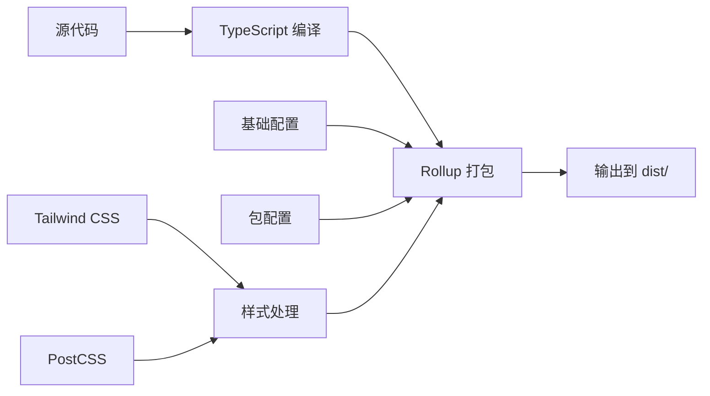

**图表来源**
- [packages/plugin-speech-to-text/rollup.config.mjs:1-5](file://packages/plugin-speech-to-text/rollup.config.mjs#L1-L5)

**章节来源**
- [packages/plugin-speech-to-text/package.json:1-38](file://packages/plugin-speech-to-text/package.json#L1-L38)
- [packages/plugin-speech-to-text/rollup.config.mjs:1-5](file://packages/plugin-speech-to-text/rollup.config.mjs#L1-L5)

## 性能考虑

### 浏览器兼容性优化

插件通过检测浏览器对 Web Speech API 和 MediaRecorder API 的支持情况，提供渐进增强的用户体验：

- **前缀支持**：同时检查标准 `SpeechRecognition` 和 `webkitSpeechRecognition` 接口
- **降级策略**：在不支持的环境中优雅地隐藏功能
- **内存管理**：及时清理语音识别器实例和事件监听器
- **录音优化**：使用 MediaRecorder API 进行高效的音频录制

### 实时性能优化

- **异步处理**：语音识别结果通过异步回调处理，避免阻塞主线程
- **状态更新**：使用 React 的状态管理系统，最小化不必要的重渲染
- **资源释放**：组件卸载时自动清理语音识别器和录音器，防止内存泄漏
- **AI 摘要优化**：使用流式处理技术，逐步生成和显示摘要内容

### 会议记录性能优化

- **音频流处理**：使用 MediaRecorder API 实时收集音频数据
- **转录缓存**：智能缓存转录结果，避免重复计算
- **UI 响应性**：使用虚拟滚动和懒加载优化大文档显示
- **文件上传优化**：支持断点续传和进度显示

## 故障排除指南

### 常见问题诊断

| 问题症状 | 可能原因 | 解决方案 |
|---------|---------|---------|
| 功能按钮不可见 | 浏览器不支持 Web Speech API | 更新到支持的浏览器版本 |
| 录音无响应 | 微型麦克风权限被拒绝 | 在浏览器设置中允许麦克风访问 |
| 识别结果不准确 | 网络连接不稳定 | 检查网络连接质量 |
| 文本插入异常 | 编辑器实例无效 | 确保编辑器正确初始化 |
| 会议录音失败 | MediaRecorder API 不支持 | 检查浏览器兼容性 |
| AI 摘要生成失败 | AI 服务不可用 | 检查网络连接和 AI 服务状态 |
| 文件保存失败 | 文件服务异常 | 检查文件服务配置 |

### 开发者调试技巧

1. **浏览器控制台**：检查语音识别和录音相关的错误信息
2. **状态监控**：通过 React DevTools 观察组件状态变化
3. **网络检查**：确认语音识别和 AI 服务的网络连接
4. **权限验证**：测试麦克风设备和文件服务的正常工作
5. **性能分析**：使用浏览器性能工具分析录音和转录性能

**章节来源**
- [packages/plugin-speech-to-text/src/hooks/useSpeechRecognition.ts:74-109](file://packages/plugin-speech-to-text/src/hooks/useSpeechRecognition.ts#L74-L109)
- [packages/plugin-speech-to-text/src/hooks/useMeetingRecorder.ts:143-157](file://packages/plugin-speech-to-text/src/hooks/useMeetingRecorder.ts#L143-L157)

## 结论

语音转文字插件现已发展为功能完整的会议记录解决方案，展现了优秀的模块化设计和工程实践：

### 主要优势

1. **架构清晰**：采用分层架构，职责分离明确
2. **用户体验优秀**：提供直观的语音控制界面和完整的会议记录功能
3. **错误处理完善**：覆盖各种异常情况的处理
4. **国际化支持**：内置多语言本地化支持
5. **性能优化**：合理的资源管理和内存控制
6. **AI 集成**：支持智能摘要生成和编辑器集成
7. **文件管理**：完整的录音文件保存和分享功能

### 技术亮点

- 基于 Web Speech API 和 MediaRecorder API 的原生实现
- React Hooks 的现代化状态管理模式
- TypeScript 提供的类型安全保障
- Tailwind CSS 的响应式设计支持
- AI 摘要生成和智能编辑器集成
- 完整的会议记录工作流

### 改进建议

1. **增强离线支持**：考虑添加本地语音识别选项
2. **提高准确性**：集成更高级的语音识别算法
3. **扩展功能**：支持更多语音控制指令和会议管理功能
4. **性能监控**：添加详细的性能指标收集和分析
5. **协作功能**：支持多人实时会议记录和协作编辑
6. **移动端优化**：适配移动设备的录音和播放功能

该插件为知识仓库系统提供了强大的语音输入能力和完整的会议记录解决方案，显著提升了用户的创作效率和体验质量，特别是在会议记录、远程协作和知识管理场景中具有重要价值。