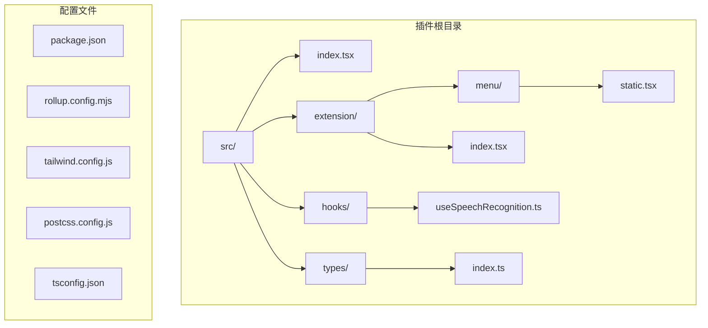
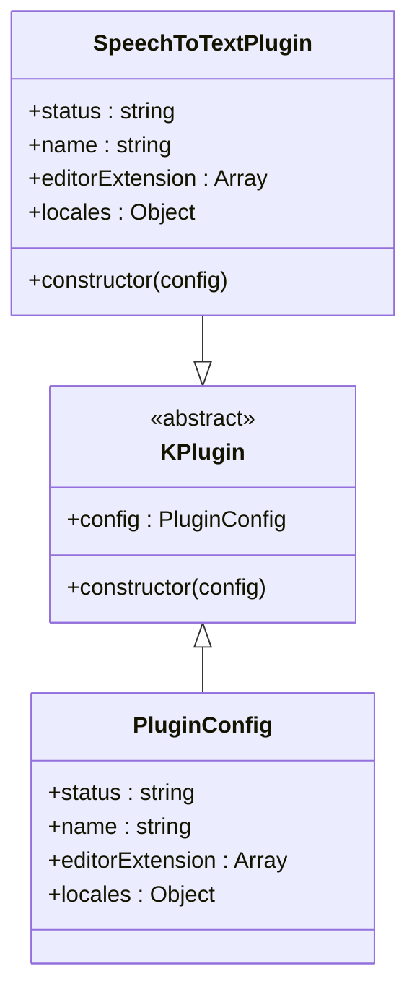
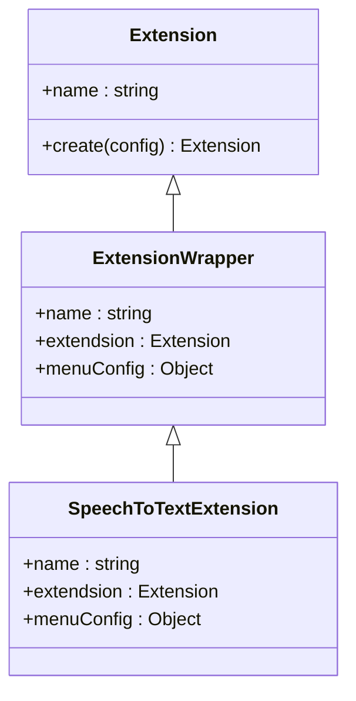
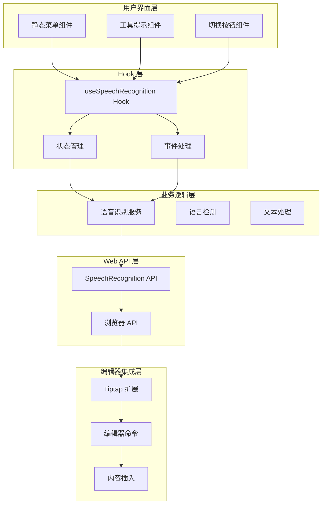
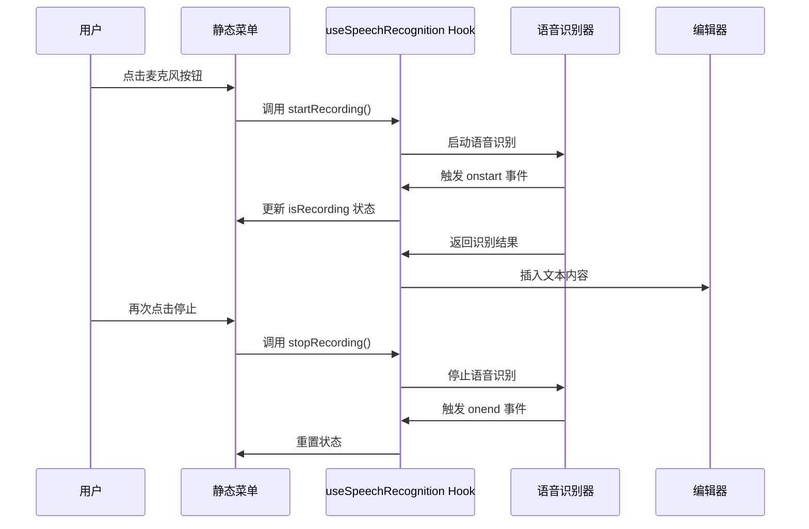
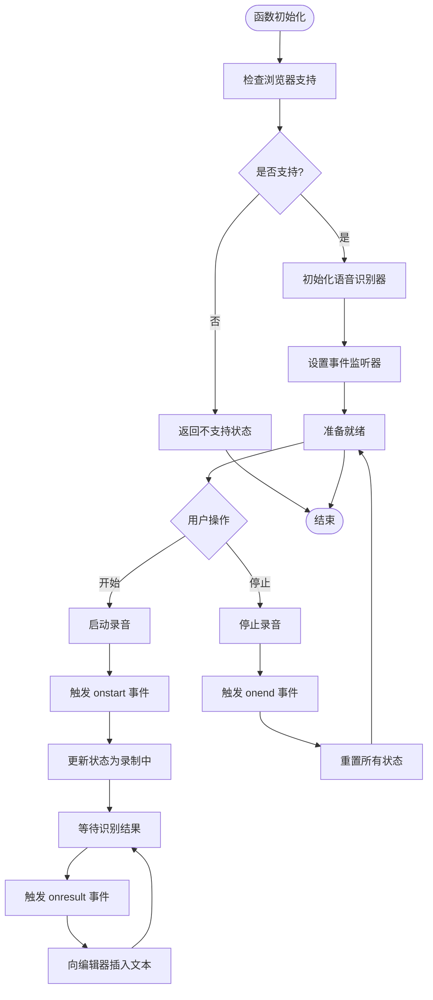
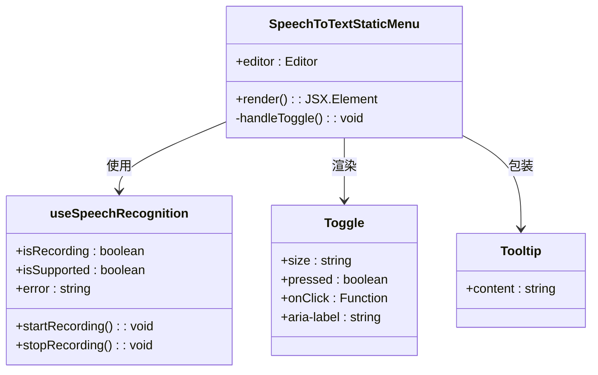
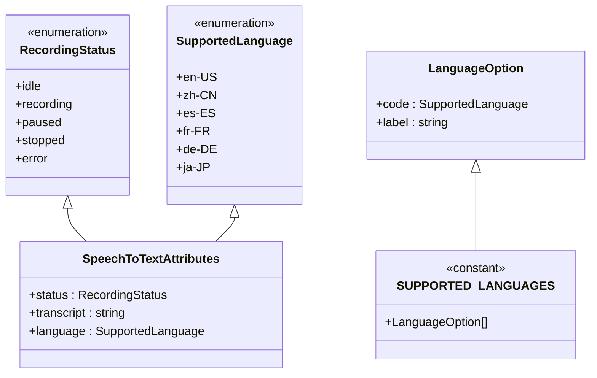
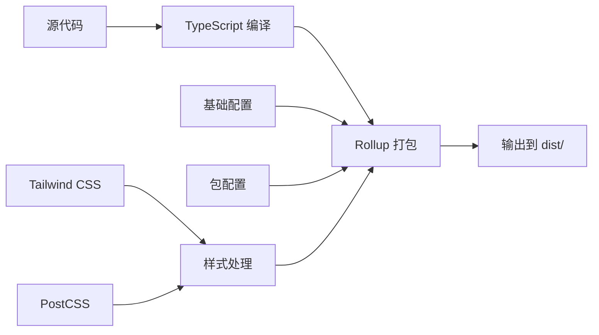

# 语音转文字插件

<cite>
**本文档引用的文件**
- [packages/plugin-speech-to-text/src/index.tsx](file://packages/plugin-speech-to-text/src/index.tsx)
- [packages/plugin-speech-to-text/src/extension/index.tsx](file://packages/plugin-speech-to-text/src/extension/index.tsx)
- [packages/plugin-speech-to-text/src/extension/menu/static.tsx](file://packages/plugin-speech-to-text/src/extension/menu/static.tsx)
- [packages/plugin-speech-to-text/src/hooks/useSpeechRecognition.ts](file://packages/plugin-speech-to-text/src/hooks/useSpeechRecognition.ts)
- [packages/plugin-speech-to-text/src/types/index.ts](file://packages/plugin-speech-to-text/src/types/index.ts)
- [packages/plugin-speech-to-text/package.json](file://packages/plugin-speech-to-text/package.json)
- [packages/plugin-speech-to-text/rollup.config.mjs](file://packages/plugin-speech-to-text/rollup.config.mjs)
- [packages/plugin-speech-to-text/tailwind.config.js](file://packages/plugin-speech-to-text/tailwind.config.js)
- [packages/plugin-speech-to-text/postcss.config.js](file://packages/plugin-speech-to-text/postcss.config.js)
- [packages/plugin-speech-to-text/tsconfig.json](file://packages/plugin-speech-to-text/tsconfig.json)
</cite>

## 目录
1. [简介](#简介)
2. [项目结构](#项目结构)
3. [核心组件](#核心组件)
4. [架构概览](#架构概览)
5. [详细组件分析](#详细组件分析)
6. [依赖关系分析](#依赖关系分析)
7. [性能考虑](#性能考虑)
8. [故障排除指南](#故障排除指南)
9. [结论](#结论)

## 简介

语音转文字插件是一个基于 Web Speech API 的浏览器扩展插件，为知识仓库编辑器提供实时语音转文本功能。该插件允许用户通过麦克风输入语音，系统会自动将语音转换为文本并插入到编辑器中。

该插件采用模块化设计，主要包含以下特性：
- 支持多种语言的语音识别（英语、中文、西班牙语、法语、德语、日语）
- 实时语音转文本显示
- 响应式用户界面设计
- 完整的错误处理机制
- 跨浏览器兼容性支持

## 项目结构

语音转文字插件采用清晰的模块化组织结构，主要分为以下几个核心目录：



**图表来源**
- [packages/plugin-speech-to-text/src/index.tsx](file://packages/plugin-speech-to-text/src/index.tsx#L1-L36)
- [packages/plugin-speech-to-text/src/extension/index.tsx](file://packages/plugin-speech-to-text/src/extension/index.tsx#L1-L21)
- [packages/plugin-speech-to-text/src/hooks/useSpeechRecognition.ts](file://packages/plugin-speech-to-text/src/hooks/useSpeechRecognition.ts#L1-L160)

**章节来源**
- [packages/plugin-speech-to-text/src/index.tsx](file://packages/plugin-speech-to-text/src/index.tsx#L1-L36)
- [packages/plugin-speech-to-text/package.json](file://packages/plugin-speech-to-text/package.json#L1-L38)

## 核心组件

### 插件主入口

插件的核心入口文件定义了完整的插件配置和导出接口：



**图表来源**
- [packages/plugin-speech-to-text/src/index.tsx](file://packages/plugin-speech-to-text/src/index.tsx#L4-L6)

### 扩展系统

插件使用 Tiptap 编辑器的扩展系统来集成语音识别功能：



**图表来源**
- [packages/plugin-speech-to-text/src/extension/index.tsx](file://packages/plugin-speech-to-text/src/extension/index.tsx#L13-L20)

**章节来源**
- [packages/plugin-speech-to-text/src/index.tsx](file://packages/plugin-speech-to-text/src/index.tsx#L1-L36)
- [packages/plugin-speech-to-text/src/extension/index.tsx](file://packages/plugin-speech-to-text/src/extension/index.tsx#L1-L21)

## 架构概览

语音转文字插件采用分层架构设计，从底层的 Web Speech API 到上层的用户界面组件：



**图表来源**
- [packages/plugin-speech-to-text/src/extension/menu/static.tsx](file://packages/plugin-speech-to-text/src/extension/menu/static.tsx#L8-L22)
- [packages/plugin-speech-to-text/src/hooks/useSpeechRecognition.ts](file://packages/plugin-speech-to-text/src/hooks/useSpeechRecognition.ts#L19-L21)

## 详细组件分析

### 语音识别 Hook 分析

`useSpeechRecognition` 是插件的核心 Hook，负责管理语音识别的所有状态和生命周期：



**图表来源**
- [packages/plugin-speech-to-text/src/hooks/useSpeechRecognition.ts](file://packages/plugin-speech-to-text/src/hooks/useSpeechRecognition.ts#L54-L72)
- [packages/plugin-speech-to-text/src/extension/menu/static.tsx](file://packages/plugin-speech-to-text/src/extension/menu/static.tsx#L16-L22)

#### 状态管理流程



**图表来源**
- [packages/plugin-speech-to-text/src/hooks/useSpeechRecognition.ts](file://packages/plugin-speech-to-text/src/hooks/useSpeechRecognition.ts#L39-L127)

**章节来源**
- [packages/plugin-speech-to-text/src/hooks/useSpeechRecognition.ts](file://packages/plugin-speech-to-text/src/hooks/useSpeechRecognition.ts#L1-L160)

### 静态菜单组件分析

静态菜单组件提供了用户交互界面，集成了完整的语音识别控制功能：



**图表来源**
- [packages/plugin-speech-to-text/src/extension/menu/static.tsx](file://packages/plugin-speech-to-text/src/extension/menu/static.tsx#L8-L22)

#### 错误处理机制

插件实现了完善的错误处理机制，针对不同的语音识别错误类型提供相应的用户反馈：

| 错误类型 | 处理方式 | 用户提示 |
|---------|---------|---------|
| no-speech | 提示重新尝试 | "未检测到语音，请重试" |
| audio-capture | 检查麦克风连接 | "未找到麦克风，请确保已安装" |
| not-allowed | 引导用户授权 | "麦克风权限被拒绝，请允许访问" |
| network | 建议检查网络连接 | "发生网络错误，请检查连接" |
| 其他错误 | 记录详细错误信息 | "语音识别发生错误" |

**章节来源**
- [packages/plugin-speech-to-text/src/extension/menu/static.tsx](file://packages/plugin-speech-to-text/src/extension/menu/static.tsx#L1-L52)

### 类型定义分析

插件使用 TypeScript 定义了完整的类型系统，确保代码的类型安全性和可维护性：



**图表来源**
- [packages/plugin-speech-to-text/src/types/index.ts](file://packages/plugin-speech-to-text/src/types/index.ts#L1-L24)

**章节来源**
- [packages/plugin-speech-to-text/src/types/index.ts](file://packages/plugin-speech-to-text/src/types/index.ts#L1-L24)

## 依赖关系分析

插件的依赖关系体现了清晰的模块化设计和松耦合架构：

```mermaid
graph TB
subgraph "外部依赖"
A[@kn/common]
B[@kn/editor]
C[@kn/ui]
D[@kn/icon]
E[React]
end
subgraph "内部包"
F[plugin-speech-to-text]
G[plugin-main]
H[plugin-ui]
end
subgraph "构建工具"
I[Rollup]
J[Tailwind CSS]
K[TypeScript]
end
F --> A
F --> B
F --> C
F --> D
F --> E
F --> G
F --> H
F --> I
F --> J
F --> K
```

**图表来源**
- [packages/plugin-speech-to-text/package.json](file://packages/plugin-speech-to-text/package.json#L24-L36)

### 构建配置分析

插件使用 Rollup 进行打包，配置继承自共享的基础配置：



**图表来源**
- [packages/plugin-speech-to-text/rollup.config.mjs](file://packages/plugin-speech-to-text/rollup.config.mjs#L1-L5)

**章节来源**
- [packages/plugin-speech-to-text/package.json](file://packages/plugin-speech-to-text/package.json#L1-L38)
- [packages/plugin-speech-to-text/rollup.config.mjs](file://packages/plugin-speech-to-text/rollup.config.mjs#L1-L5)

## 性能考虑

### 浏览器兼容性优化

插件通过检测浏览器对 Web Speech API 的支持情况，提供渐进增强的用户体验：

- **前缀支持**：同时检查标准 `SpeechRecognition` 和 `webkitSpeechRecognition` 接口
- **降级策略**：在不支持的环境中优雅地隐藏功能
- **内存管理**：及时清理语音识别器实例和事件监听器

### 实时性能优化

- **异步处理**：语音识别结果通过异步回调处理，避免阻塞主线程
- **状态更新**：使用 React 的状态管理系统，最小化不必要的重渲染
- **资源释放**：组件卸载时自动清理语音识别器，防止内存泄漏

## 故障排除指南

### 常见问题诊断

| 问题症状 | 可能原因 | 解决方案 |
|---------|---------|---------|
| 功能按钮不可见 | 浏览器不支持 Web Speech API | 更新到支持的浏览器版本 |
| 录音无响应 | 微型麦克风权限被拒绝 | 在浏览器设置中允许麦克风访问 |
| 识别结果不准确 | 网络连接不稳定 | 检查网络连接质量 |
| 文本插入异常 | 编辑器实例无效 | 确保编辑器正确初始化 |

### 开发者调试技巧

1. **浏览器控制台**：检查语音识别相关的错误信息
2. **状态监控**：通过 React DevTools 观察组件状态变化
3. **网络检查**：确认语音识别服务的网络连接
4. **权限验证**：测试麦克风设备的正常工作

**章节来源**
- [packages/plugin-speech-to-text/src/hooks/useSpeechRecognition.ts](file://packages/plugin-speech-to-text/src/hooks/useSpeechRecognition.ts#L74-L109)

## 结论

语音转文字插件展现了优秀的模块化设计和工程实践：

### 主要优势

1. **架构清晰**：采用分层架构，职责分离明确
2. **用户体验优秀**：提供直观的语音控制界面
3. **错误处理完善**：覆盖各种异常情况的处理
4. **国际化支持**：内置多语言本地化支持
5. **性能优化**：合理的资源管理和内存控制

### 技术亮点

- 基于 Web Speech API 的原生实现
- React Hooks 的现代化状态管理模式
- TypeScript 提供的类型安全保障
- Tailwind CSS 的响应式设计支持

### 改进建议

1. **增强离线支持**：考虑添加本地语音识别选项
2. **提高准确性**：集成更高级的语音识别算法
3. **扩展功能**：支持更多语音控制指令
4. **性能监控**：添加详细的性能指标收集

该插件为知识仓库系统提供了强大的语音输入能力，显著提升了用户的创作效率和体验质量。