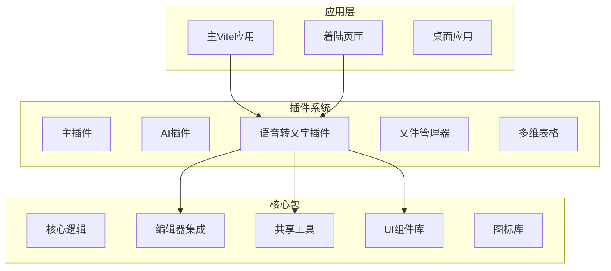
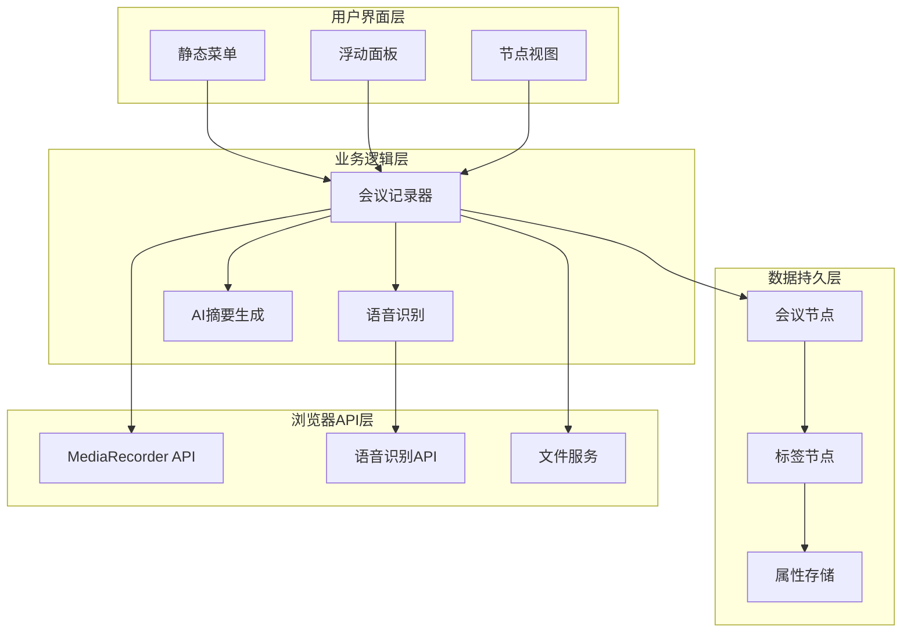
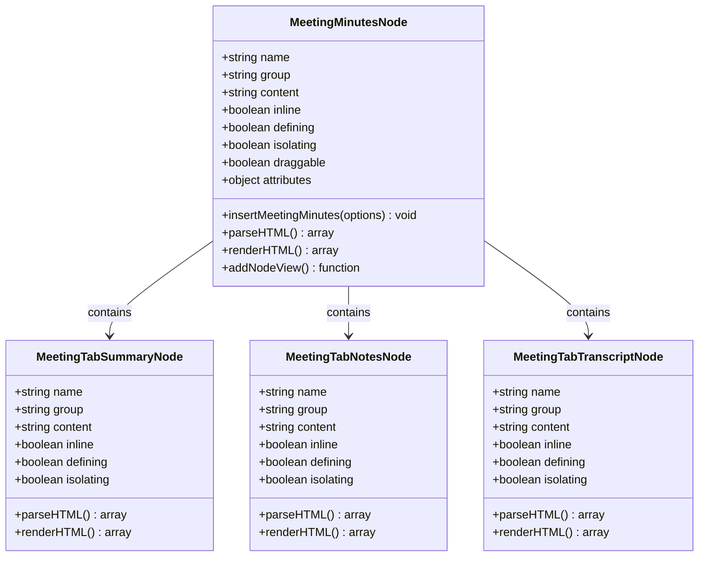
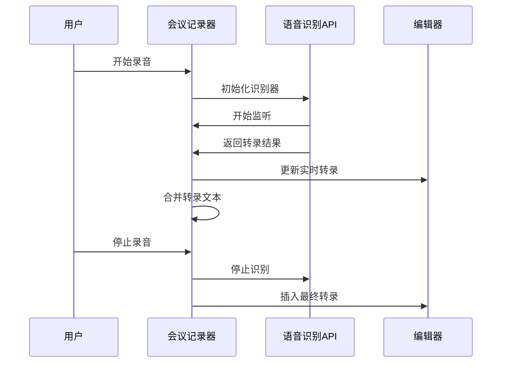
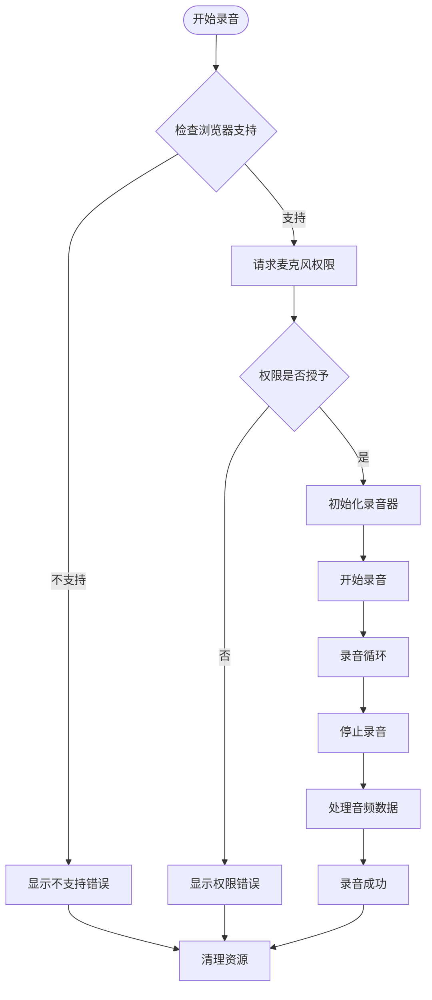
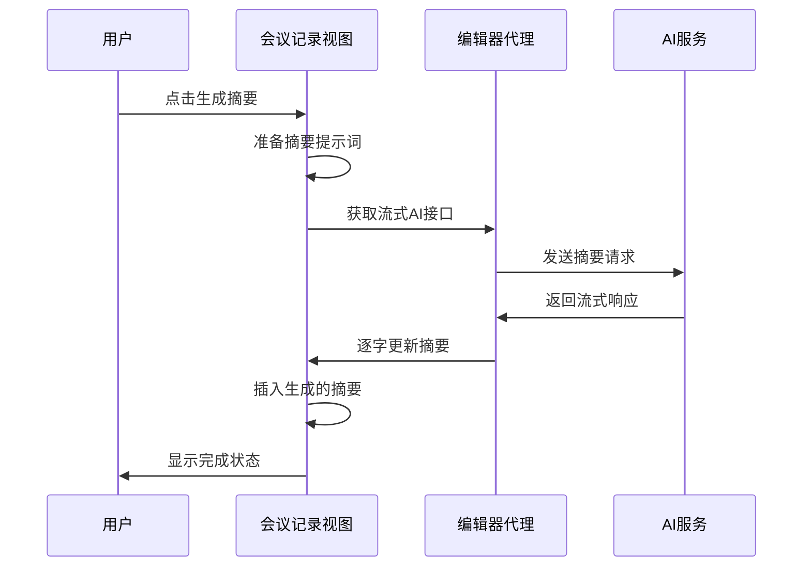
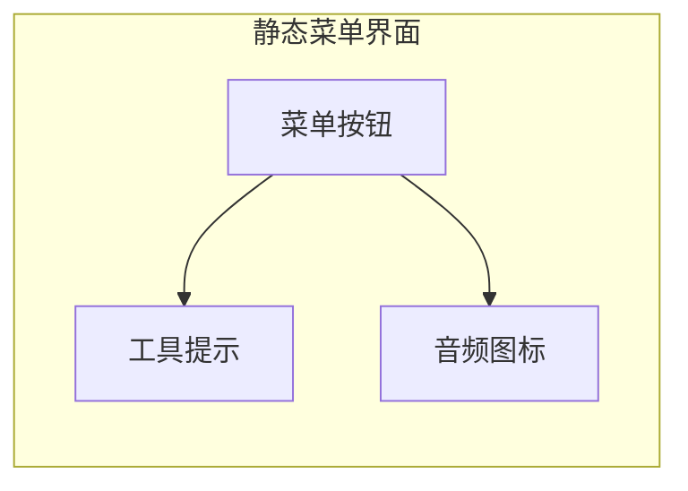
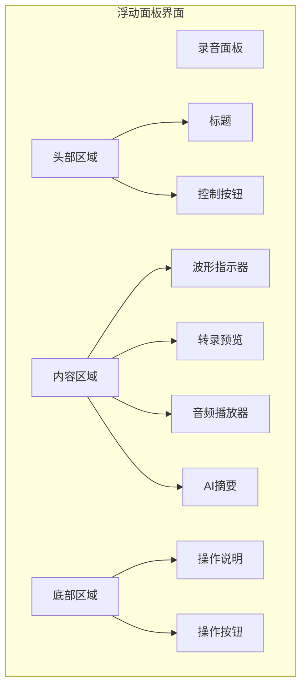
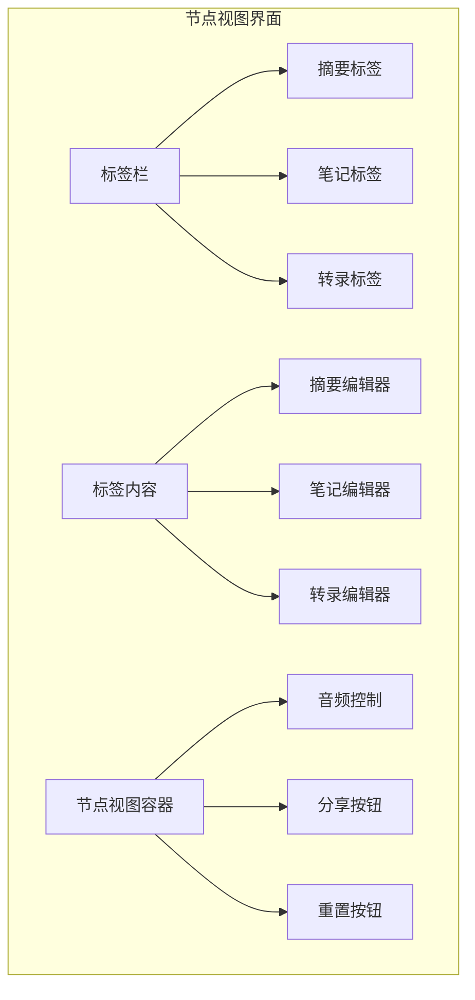

# 会议记录功能增强

<cite>
**本文档引用的文件**
- [README.md](file://README.md)
- [package.json](file://package.json)
- [meeting-minutes.ts](file://packages/plugin-speech-to-text/src/extension/meeting-minutes/meeting-minutes.ts)
- [MeetingMinutesView.tsx](file://packages/plugin-speech-to-text/src/extension/meeting-minutes/MeetingMinutesView.tsx)
- [useMeetingRecorder.ts](file://packages/plugin-speech-to-text/src/hooks/useMeetingRecorder.ts)
- [useSpeechRecognition.ts](file://packages/plugin-speech-to-text/src/hooks/useSpeechRecognition.ts)
- [MeetingMinutesPanel.tsx](file://packages/plugin-speech-to-text/src/extension/menu/MeetingMinutesPanel.tsx)
- [MeetingMinutesStaticMenu.tsx](file://packages/plugin-speech-to-text/src/extension/menu/MeetingMinutesStaticMenu.tsx)
- [index.tsx](file://packages/plugin-speech-to-text/src/index.tsx)
- [package.json](file://packages/plugin-speech-to-text/package.json)
</cite>

## 目录
1. [简介](#简介)
2. [项目结构](#项目结构)
3. [核心组件](#核心组件)
4. [架构概览](#架构概览)
5. [详细组件分析](#详细组件分析)
6. [依赖关系分析](#依赖关系分析)
7. [性能考虑](#性能考虑)
8. [故障排除指南](#故障排除指南)
9. [结论](#结论)

## 简介

会议记录功能是知识仓库项目中的一个强大特性，它集成了语音转文字、实时转录、AI摘要生成和多标签页管理等功能。该功能通过Web Speech API实现语音识别，结合MediaRecorder API进行音频录制，并利用AI技术生成会议摘要。

该项目基于现代前端技术栈构建，采用Monorepo架构，包含多个包和插件系统。会议记录功能作为语音转文字插件的一部分，提供了完整的会议记录解决方案。

## 项目结构

知识仓库项目采用Monorepo架构，主要包含以下关键目录：



**图表来源**
- [README.md:66-97](file://README.md#L66-L97)
- [package.json:1-124](file://package.json#L1-L124)

**章节来源**
- [README.md:66-97](file://README.md#L66-L97)
- [package.json:1-124](file://package.json#L1-L124)

## 核心组件

会议记录功能由多个核心组件协同工作，提供完整的语音转文字体验：

### 主要功能模块

1. **会议记录节点系统**：基于ProseMirror的自定义节点结构
2. **实时语音识别**：Web Speech API集成
3. **音频录制管理**：MediaRecorder API实现
4. **AI摘要生成**：智能内容总结
5. **多标签页界面**：分功能区域管理

### 技术架构特点

- **响应式设计**：支持多种屏幕尺寸
- **国际化支持**：多语言界面和语音识别
- **错误处理**：完善的异常情况处理机制
- **状态管理**：集中化的组件状态控制

**章节来源**
- [meeting-minutes.ts:14-171](file://packages/plugin-speech-to-text/src/extension/meeting-minutes/meeting-minutes.ts#L14-L171)
- [MeetingMinutesView.tsx:179-856](file://packages/plugin-speech-to-text/src/extension/meeting-minutes/MeetingMinutesView.tsx#L179-L856)

## 架构概览

会议记录功能的整体架构采用分层设计，从底层的浏览器API到上层的用户界面：



**图表来源**
- [MeetingMinutesPanel.tsx:180-692](file://packages/plugin-speech-to-text/src/extension/menu/MeetingMinutesPanel.tsx#L180-L692)
- [MeetingMinutesView.tsx:181-856](file://packages/plugin-speech-to-text/src/extension/meeting-minutes/MeetingMinutesView.tsx#L181-L856)
- [useMeetingRecorder.ts:21-247](file://packages/plugin-speech-to-text/src/hooks/useMeetingRecorder.ts#L21-L247)

## 详细组件分析

### 会议记录节点系统

会议记录功能的核心是基于ProseMirror的自定义节点系统，包含父节点和三个子标签节点：



**图表来源**
- [meeting-minutes.ts:72-171](file://packages/plugin-speech-to-text/src/extension/meeting-minutes/meeting-minutes.ts#L72-L171)

#### 属性管理系统

会议记录节点包含丰富的属性配置：

| 属性名称 | 类型 | 默认值 | 描述 |
|---------|------|--------|------|
| isRecording | boolean | false | 录音状态标志 |
| isPaused | boolean | false | 暂停状态标志 |
| duration | number | 0 | 录音时长（秒） |
| audioPath | string/null | null | 音频文件路径 |
| audioUrl | string/null | null | 音频URL |
| transcript | string | '' | 原始转录文本 |
| activeTab | string | 'notes' | 当前激活的标签页 |
| title | string | '' | 会议标题 |
| createdAt | number/null | null | 创建时间戳 |
| updatedAt | number/null | null | 更新时间戳 |

**章节来源**
- [meeting-minutes.ts:86-124](file://packages/plugin-speech-to-text/src/extension/meeting-minutes/meeting-minutes.ts#L86-L124)

### 实时语音识别系统

语音识别系统基于Web Speech API实现，提供实时的语音转文字功能：



**图表来源**
- [useMeetingRecorder.ts:95-223](file://packages/plugin-speech-to-text/src/hooks/useMeetingRecorder.ts#L95-L223)
- [useSpeechRecognition.ts:19-160](file://packages/plugin-speech-to-text/src/hooks/useSpeechRecognition.ts#L19-L160)

#### 错误处理机制

系统实现了完善的错误处理机制：



**图表来源**
- [useMeetingRecorder.ts:95-247](file://packages/plugin-speech-to-text/src/hooks/useMeetingRecorder.ts#L95-L247)

**章节来源**
- [useMeetingRecorder.ts:95-247](file://packages/plugin-speech-to-text/src/hooks/useMeetingRecorder.ts#L95-L247)
- [useSpeechRecognition.ts:19-160](file://packages/plugin-speech-to-text/src/hooks/useSpeechRecognition.ts#L19-L160)

### AI摘要生成功能

AI摘要生成功能利用编辑器代理优化器生成高质量的会议摘要：



**图表来源**
- [MeetingMinutesView.tsx:290-340](file://packages/plugin-speech-to-text/src/extension/meeting-minutes/MeetingMinutesView.tsx#L290-L340)

#### 多语言支持

系统支持多种语言的语音识别：

| 语言代码 | 语言名称 | 语音识别支持 |
|---------|----------|-------------|
| zh-CN | 中文 (简体) | ✅ 完全支持 |
| en-US | 英语 (美国) | ✅ 完全支持 |
| es-ES | 西班牙语 | ✅ 部分支持 |
| fr-FR | 法语 | ✅ 部分支持 |
| de-DE | 德语 | ✅ 部分支持 |
| ja-JP | 日语 | ✅ 部分支持 |

**章节来源**
- [MeetingMinutesView.tsx:290-340](file://packages/plugin-speech-to-text/src/extension/meeting-minutes/MeetingMinutesView.tsx#L290-L340)
- [types/index.ts:16-24](file://packages/plugin-speech-to-text/src/types/index.ts#L16-L24)

### 用户界面组件

会议记录功能提供了三种不同的用户界面模式：

#### 1. 静态菜单界面

静态菜单提供快速访问入口，适合在编辑器工具栏中使用：



**图表来源**
- [MeetingMinutesStaticMenu.tsx:8-34](file://packages/plugin-speech-to-text/src/extension/menu/MeetingMinutesStaticMenu.tsx#L8-L34)

#### 2. 浮动面板界面

浮动面板提供完整的录音和转录功能：



**图表来源**
- [MeetingMinutesPanel.tsx:397-692](file://packages/plugin-speech-to-text/src/extension/menu/MeetingMinutesPanel.tsx#L397-L692)

#### 3. 节点视图界面

节点视图提供嵌入式编辑体验：



**图表来源**
- [MeetingMinutesView.tsx:711-856](file://packages/plugin-speech-to-text/src/extension/meeting-minutes/MeetingMinutesView.tsx#L711-L856)

**章节来源**
- [MeetingMinutesStaticMenu.tsx:8-34](file://packages/plugin-speech-to-text/src/extension/menu/MeetingMinutesStaticMenu.tsx#L8-L34)
- [MeetingMinutesPanel.tsx:397-692](file://packages/plugin-speech-to-text/src/extension/menu/MeetingMinutesPanel.tsx#L397-L692)
- [MeetingMinutesView.tsx:711-856](file://packages/plugin-speech-to-text/src/extension/meeting-minutes/MeetingMinutesView.tsx#L711-L856)

## 依赖关系分析

会议记录功能的依赖关系展现了清晰的模块化架构：

```mermaid
graph TB
subgraph "外部依赖"
React[React 18]
Tiptap[Tiptap编辑器]
WebSpeech[Web Speech API]
MediaRecorder[MediaRecorder API]
end
subgraph "内部包依赖"
Common[@kn/common]
Editor[@kn/editor]
UI[@kn/ui]
Icon[@kn/icon]
end
subgraph "插件依赖"
SpeechToText[@kn/plugin-speech-to-text]
MainPlugin[@kn/plugin-main]
AIPlugin[@kn/plugin-ai]
end
SpeechToText --> React
SpeechToText --> Tiptap
SpeechToText --> Common
SpeechToText --> Editor
SpeechToText --> UI
SpeechToText --> Icon
MainPlugin --> SpeechToText
AIPlugin --> SpeechToText
```

**图表来源**
- [package.json:24-28](file://packages/plugin-speech-to-text/package.json#L24-L28)
- [README.md:43-60](file://README.md#L43-L60)

### 核心依赖包

| 依赖包 | 版本 | 用途 |
|-------|------|-----|
| @kn/common | workspace:* | 共享工具和服务 |
| @kn/editor | workspace:* | Tiptap编辑器集成 |
| @kn/ui | workspace:* | UI组件库 |
| @kn/icon | workspace:* | 图标库 |
| react | ^18.3.1 | 用户界面框架 |
| react-dom | ^18.3.1 | DOM渲染 |

**章节来源**
- [package.json:24-37](file://packages/plugin-speech-to-text/package.json#L24-L37)
- [README.md:43-60](file://README.md#L43-L60)

## 性能考虑

会议记录功能在设计时充分考虑了性能优化：

### 内存管理

- **及时清理**：录音结束后自动释放媒体流和音频URL
- **垃圾回收**：使用URL.revokeObjectURL()释放临时URL
- **状态同步**：避免不必要的状态更新触发重渲染

### 网络优化

- **流式传输**：AI摘要生成使用流式API减少等待时间
- **本地处理**：大部分操作在客户端完成，减少服务器负载
- **缓存策略**：合理使用浏览器缓存机制

### 用户体验优化

- **实时反馈**：提供录音状态的即时视觉反馈
- **渐进式加载**：摘要生成过程显示进度指示器
- **错误恢复**：网络异常时提供重试机制

## 故障排除指南

### 常见问题及解决方案

#### 1. 麦克风权限问题

**症状**：无法开始录音，显示权限被拒绝

**解决方案**：
- 检查浏览器设置中的麦克风权限
- 确认网站具有麦克风访问权限
- 尝试刷新页面重新获取权限

#### 2. 浏览器兼容性问题

**症状**：语音识别功能不可用

**解决方案**：
- 确保使用Chrome或Edge浏览器
- 检查Web Speech API支持情况
- 更新浏览器到最新版本

#### 3. 音频录制问题

**症状**：录音无法保存或播放

**解决方案**：
- 检查音频格式支持（WebM）
- 确认文件服务配置正确
- 验证网络连接稳定性

#### 4. AI摘要生成失败

**症状**：摘要生成过程中出现错误

**解决方案**：
- 检查AI服务连接状态
- 验证API密钥配置
- 确认网络连接稳定

**章节来源**
- [useMeetingRecorder.ts:143-156](file://packages/plugin-speech-to-text/src/hooks/useMeetingRecorder.ts#L143-L156)
- [useSpeechRecognition.ts:84-108](file://packages/plugin-speech-to-text/src/hooks/useSpeechRecognition.ts#L84-L108)

## 结论

会议记录功能作为知识仓库项目的重要组成部分，展现了现代Web应用的技术实力。该功能通过精心设计的架构和完善的用户体验，为用户提供了便捷的会议记录解决方案。

### 主要优势

1. **技术先进性**：充分利用Web Speech API和MediaRecorder API
2. **用户体验优秀**：提供直观易用的界面和流畅的操作体验
3. **功能完整性**：涵盖从录音到摘要生成的完整流程
4. **可扩展性强**：基于插件架构，便于功能扩展和定制

### 发展方向

未来可以考虑的功能增强包括：
- 支持更多语言的语音识别
- 增强AI摘要的准确性
- 添加会议参与者识别功能
- 提供离线录音能力
- 集成更多协作功能

该功能的成功实现为知识仓库项目奠定了坚实的技术基础，也为未来的功能扩展提供了良好的平台支撑。