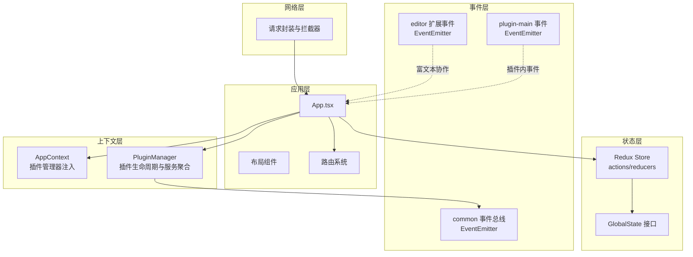
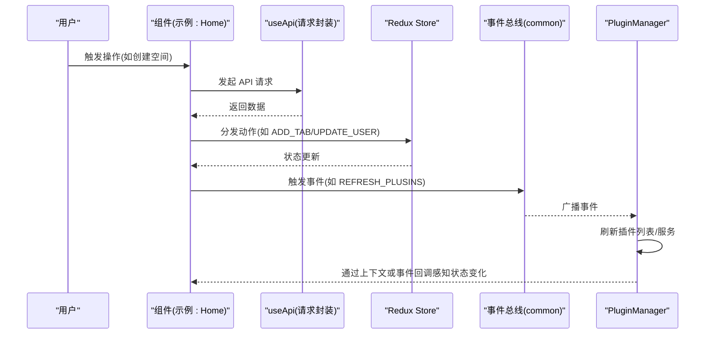
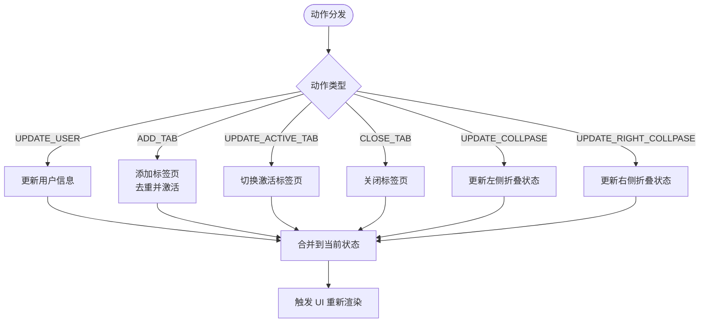
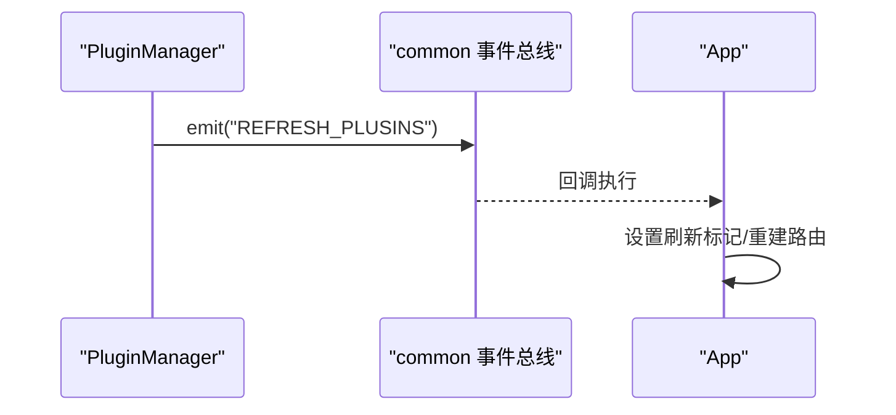
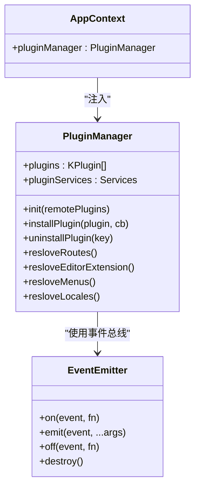
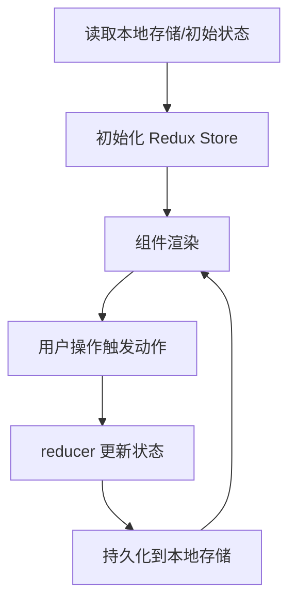
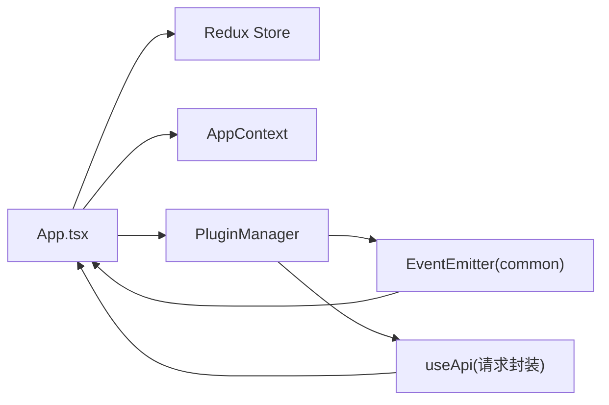

# 数据流架构

<cite>
**本文引用的文件**
- [packages/core/src/store/GlobalState.ts](file://packages/core/src/store/GlobalState.ts)
- [packages/core/src/store/index.ts](file://packages/core/src/store/index.ts)
- [packages/common/src/event/event.ts](file://packages/common/src/event/event.ts)
- [packages/common/src/event/index.ts](file://packages/common/src/event/index.ts)
- [packages/common/src/core/AppContext.ts](file://packages/common/src/core/AppContext.ts)
- [packages/common/src/core/PluginManager.ts](file://packages/common/src/core/PluginManager.ts)
- [packages/core/src/App.tsx](file://packages/core/src/App.tsx)
- [packages/core/src/hooks/use-service.ts](file://packages/core/src/hooks/use-service.ts)
- [packages/core/src/utils/request.tsx](file://packages/core/src/utils/request.tsx)
- [packages/editor/src/extensions/event/event-emitter.ts](file://packages/editor/src/extensions/event/event-emitter.ts)
- [packages/editor/src/extensions/event/event.ts](file://packages/editor/src/extensions/event/event.ts)
- [packages/editor/src/extensions/event/index.ts](file://packages/editor/src/extensions/event/index.ts)
- [packages/plugin-main/src/utils/event.ts](file://packages/plugin-main/src/utils/event.ts)
- [packages/plugin-main/src/pages/Home/index.tsx](file://packages/plugin-main/src/pages/Home/index.tsx)
- [packages/plugin-main/src/pages/PageRoom/index.tsx](file://packages/plugin-main/src/pages/PageRoom/index.tsx)
</cite>

## 目录
1. [引言](#引言)
2. [项目结构](#项目结构)
3. [核心组件](#核心组件)
4. [架构总览](#架构总览)
5. [详细组件分析](#详细组件分析)
6. [依赖关系分析](#依赖关系分析)
7. [性能考量](#性能考量)
8. [故障排查指南](#故障排查指南)
9. [结论](#结论)
10. [附录](#附录)

## 引言
本文件面向知识库管理系统，系统性梳理其数据流架构与状态管理方案。重点覆盖以下方面：
- 全局状态管理：状态提升、Redux Store 的动作分发与 reducer 处理、状态持久化与同步策略
- 事件驱动架构：EventEmitter 的使用、事件传播与跨模块解耦
- 单向数据流与副作用：从用户交互到状态更新再到 UI 响应的路径控制
- 跨组件通信：Context API、事件总线、回调函数的组合使用
- 序列化与反序列化：编辑器内容与本地存储的数据转换
- 最佳实践：状态结构设计、性能优化、调试方法
- 监控与错误处理：网络拦截器、事件日志与错误提示

## 项目结构
系统采用多包（monorepo）组织，核心与通用能力分布在 packages 下的不同子包中。前端应用通过 Redux 管理全局状态，通过 Context 提供插件上下文，通过事件总线实现跨模块通信；编辑器扩展层引入事件发射器以支持富文本协作场景。

图表来源
- [packages/core/src/App.tsx](file://packages/core/src/App.tsx#L1-L187)
- [packages/core/src/store/index.ts](file://packages/core/src/store/index.ts#L1-L71)
- [packages/core/src/store/GlobalState.ts](file://packages/core/src/store/GlobalState.ts#L1-L32)
- [packages/common/src/event/event.ts](file://packages/common/src/event/event.ts#L1-L44)
- [packages/common/src/core/AppContext.ts](file://packages/common/src/core/AppContext.ts#L1-L13)
- [packages/common/src/core/PluginManager.ts](file://packages/common/src/core/PluginManager.ts#L1-L170)
- [packages/core/src/utils/request.tsx](file://packages/core/src/utils/request.tsx#L1-L118)
- [packages/editor/src/extensions/event/event-emitter.ts](file://packages/editor/src/extensions/event/event-emitter.ts#L1-L42)
- [packages/plugin-main/src/utils/event.ts](file://packages/plugin-main/src/utils/event.ts#L1-L44)

章节来源
- [packages/core/src/App.tsx](file://packages/core/src/App.tsx#L1-L187)
- [packages/core/src/store/index.ts](file://packages/core/src/store/index.ts#L1-L71)
- [packages/common/src/event/index.ts](file://packages/common/src/event/index.ts#L1-L19)

## 核心组件
- 全局状态模型与 Store
  - GlobalState 定义了用户信息、应用信息、标签页、折叠状态等字段，作为 Redux 状态树的基础结构。
  - Redux Store 提供统一的动作分发与 reducer 处理，涵盖用户信息更新、标签页增删改、侧边栏折叠状态变更等。
- 事件总线
  - common 包提供全局事件总线，用于跨模块解耦通知（如插件刷新、消息、业务主题事件）。
  - 编辑器扩展层引入事件发射器，支持富文本协作场景下的事件传播。
  - 插件包内也提供独立的 EventEmitter，便于插件内部通信。
- 上下文与插件管理
  - AppContext 通过 React Context 注入插件管理器，使各页面与组件可按需访问插件服务。
  - PluginManager 负责插件初始化、安装/卸载、路由与菜单解析、服务合并等。
- 请求与拦截器
  - 统一封装 Axios 实例，设置基础 URL、鉴权头、参数序列化与响应拦截，统一处理 401、500 等错误并触发重定向或提示。

章节来源
- [packages/core/src/store/GlobalState.ts](file://packages/core/src/store/GlobalState.ts#L1-L32)
- [packages/core/src/store/index.ts](file://packages/core/src/store/index.ts#L1-L71)
- [packages/common/src/event/event.ts](file://packages/common/src/event/event.ts#L1-L44)
- [packages/common/src/core/AppContext.ts](file://packages/common/src/core/AppContext.ts#L1-L13)
- [packages/common/src/core/PluginManager.ts](file://packages/common/src/core/PluginManager.ts#L1-L170)
- [packages/core/src/utils/request.tsx](file://packages/core/src/utils/request.tsx#L1-L118)

## 架构总览
系统遵循“单向数据流 + 事件驱动”的混合架构：
- 单向数据流：用户操作 -> 动作分发 -> reducer 更新 -> 状态变化 -> UI 重新渲染
- 事件驱动：跨模块解耦通过事件总线传播，如插件安装/卸载触发 UI 刷新
- 上下文通信：通过 AppContext 注入插件管理器，组件通过 hooks 获取服务
- 序列化/反序列化：编辑器内容以 JSON 存储，渲染前进行解析

图表来源
- [packages/plugin-main/src/pages/Home/index.tsx](file://packages/plugin-main/src/pages/Home/index.tsx#L1-L132)
- [packages/core/src/utils/request.tsx](file://packages/core/src/utils/request.tsx#L1-L118)
- [packages/core/src/store/index.ts](file://packages/core/src/store/index.ts#L1-L71)
- [packages/common/src/event/index.ts](file://packages/common/src/event/index.ts#L1-L19)
- [packages/common/src/core/PluginManager.ts](file://packages/common/src/core/PluginManager.ts#L1-L170)

## 详细组件分析

### 全局状态管理（Redux）
- 设计要点
  - 使用 Redux 管理全局可序列化状态，避免在组件内部维护复杂共享状态
  - 动作类型集中定义，reducer 内部保持不可变更新，便于调试与回放
- 关键动作与处理
  - 用户信息更新：UPDATE_USER
  - 标签页管理：ADD_TAB、UPDATE_ACTIVE_TAB、CLOSE_TAB
  - 折叠状态：UPDATE_COLLPASE、UPDATE_RIGHT_COLLPASE
- 状态持久化与同步
  - 可结合浏览器存储或中间件实现持久化（例如在应用启动时读取本地存储并初始化状态）
  - 对于实时协作场景，可通过事件总线同步远端状态变更

图表来源
- [packages/core/src/store/index.ts](file://packages/core/src/store/index.ts#L1-L71)
- [packages/core/src/store/GlobalState.ts](file://packages/core/src/store/GlobalState.ts#L1-L32)

章节来源
- [packages/core/src/store/index.ts](file://packages/core/src/store/index.ts#L1-L71)
- [packages/core/src/store/GlobalState.ts](file://packages/core/src/store/GlobalState.ts#L1-L32)

### 事件驱动架构（EventEmitter）
- 组件职责
  - common.EventEmitter：全局事件总线，用于跨模块广播（如插件刷新）
  - editor.EventEmitter：编辑器扩展事件发射器，支持富文本协作
  - plugin-main.EventEmitter：插件内部事件，便于模块内通信
- 事件传播机制
  - on 注册监听器，emit 触发回调，off 取消监听，destroy 清空回调表
  - 插件安装/卸载通过事件触发 UI 刷新，避免直接耦合
- 使用示例
  - 插件管理器在安装/卸载后发出 REFRESH_PLUSINS，App 监听后刷新路由与上下文

图表来源
- [packages/common/src/event/event.ts](file://packages/common/src/event/event.ts#L1-L44)
- [packages/common/src/event/index.ts](file://packages/common/src/event/index.ts#L1-L19)
- [packages/common/src/core/PluginManager.ts](file://packages/common/src/core/PluginManager.ts#L1-L170)
- [packages/core/src/App.tsx](file://packages/core/src/App.tsx#L1-L187)

章节来源
- [packages/common/src/event/event.ts](file://packages/common/src/event/event.ts#L1-L44)
- [packages/common/src/event/index.ts](file://packages/common/src/event/index.ts#L1-L19)
- [packages/common/src/core/PluginManager.ts](file://packages/common/src/core/PluginManager.ts#L1-L170)
- [packages/core/src/App.tsx](file://packages/core/src/App.tsx#L1-L187)

### 跨组件通信（Context API、事件总线、回调函数）
- Context API
  - AppContext 注入插件管理器，组件通过 hooks 获取插件服务，实现跨层级通信
- 事件总线
  - 用于弱耦合广播，如插件安装/卸载、页面刷新等
- 回调函数
  - 在 UI 交互中传递回调（如创建空间后的刷新），保证局部副作用可控

图表来源
- [packages/common/src/core/AppContext.ts](file://packages/common/src/core/AppContext.ts#L1-L13)
- [packages/common/src/core/PluginManager.ts](file://packages/common/src/core/PluginManager.ts#L1-L170)
- [packages/common/src/event/event.ts](file://packages/common/src/event/event.ts#L1-L44)

章节来源
- [packages/common/src/core/AppContext.ts](file://packages/common/src/core/AppContext.ts#L1-L13)
- [packages/common/src/core/PluginManager.ts](file://packages/common/src/core/PluginManager.ts#L1-L170)
- [packages/core/src/hooks/use-service.ts](file://packages/core/src/hooks/use-service.ts#L1-L15)

### 数据序列化与反序列化
- 编辑器内容
  - 页面渲染时对内容进行 JSON 解析，确保富文本结构正确加载
- 参数序列化
  - 请求拦截器对 GET 参数进行序列化，避免重复拼接与格式问题
- 本地存储
  - 可结合 Redux 中间件或应用启动逻辑实现状态持久化（建议在现有基础上扩展）

图表来源
- [packages/plugin-main/src/pages/PageRoom/index.tsx](file://packages/plugin-main/src/pages/PageRoom/index.tsx#L103-L120)
- [packages/core/src/utils/request.tsx](file://packages/core/src/utils/request.tsx#L1-L118)
- [packages/core/src/store/index.ts](file://packages/core/src/store/index.ts#L1-L71)

章节来源
- [packages/plugin-main/src/pages/PageRoom/index.tsx](file://packages/plugin-main/src/pages/PageRoom/index.tsx#L103-L120)
- [packages/core/src/utils/request.tsx](file://packages/core/src/utils/request.tsx#L1-L118)

## 依赖关系分析
- 组件耦合与内聚
  - App 依赖 PluginManager、Redux Store、路由与上下文，承担应用初始化与路由装配职责
  - PluginManager 聚合插件服务，通过事件总线与外部通信
  - 请求封装统一处理鉴权与错误，降低各页面的副作用
- 外部依赖
  - Redux 作为状态容器，React Router 作为导航框架
  - Axios 作为 HTTP 客户端，配合拦截器实现统一认证与错误处理

图表来源
- [packages/core/src/App.tsx](file://packages/core/src/App.tsx#L1-L187)
- [packages/core/src/store/index.ts](file://packages/core/src/store/index.ts#L1-L71)
- [packages/common/src/core/PluginManager.ts](file://packages/common/src/core/PluginManager.ts#L1-L170)
- [packages/common/src/event/index.ts](file://packages/common/src/event/index.ts#L1-L19)
- [packages/core/src/utils/request.tsx](file://packages/core/src/utils/request.tsx#L1-L118)

章节来源
- [packages/core/src/App.tsx](file://packages/core/src/App.tsx#L1-L187)
- [packages/common/src/core/PluginManager.ts](file://packages/common/src/core/PluginManager.ts#L1-L170)

## 性能考量
- 状态更新
  - reducer 保持不可变更新，避免不必要的重渲染；对大数组/对象更新可考虑选择性浅比较
- 事件监听
  - 合理使用 off 取消监听，防止内存泄漏；批量事件合并减少重复渲染
- 插件加载
  - 插件脚本异步加载，避免阻塞主线程；可引入缓存与预加载策略
- 请求优化
  - GET 参数序列化避免冗余查询；对高频请求增加节流/防抖
- 编辑器渲染
  - 大文档分段渲染，延迟初始化非关键区域；事件发射器回调尽量轻量化

## 故障排查指南
- 登录态失效
  - 响应拦截器检测 401，弹出提示并跳转登录；确认本地存储中的令牌键名一致
- 网络错误
  - 根据错误类型映射为用户可理解的消息，如网络异常、超时、后端返回码异常
- 事件未触发
  - 检查事件名称是否一致、监听是否注册、作用域是否正确；必要时打印日志定位
- 插件安装/卸载不生效
  - 确认事件广播是否发出、App 是否监听并刷新、插件服务是否合并成功

章节来源
- [packages/core/src/utils/request.tsx](file://packages/core/src/utils/request.tsx#L1-L118)
- [packages/common/src/event/index.ts](file://packages/common/src/event/index.ts#L1-L19)
- [packages/common/src/core/PluginManager.ts](file://packages/common/src/core/PluginManager.ts#L1-L170)
- [packages/core/src/App.tsx](file://packages/core/src/App.tsx#L1-L187)

## 结论
本系统通过 Redux 实现全局状态的单向数据流，借助事件总线实现跨模块解耦，结合 Context API 与回调函数完成跨组件通信。编辑器扩展层引入事件发射器，满足协作场景下的事件传播需求。整体架构清晰、职责分离明确，具备良好的扩展性与可维护性。建议后续完善状态持久化与调试工具链，进一步提升可观测性与开发体验。

## 附录
- 最佳实践清单
  - 状态结构设计：扁平化、可序列化、最小必要字段
  - 动作命名：语义化、幂等、粒度适中
  - 事件命名：全局唯一、语义明确、避免硬编码字符串
  - 错误处理：统一拦截、用户友好提示、必要时记录上下文
  - 性能优化：按需渲染、事件节流、插件懒加载、缓存策略