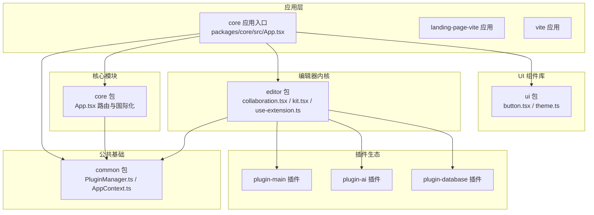
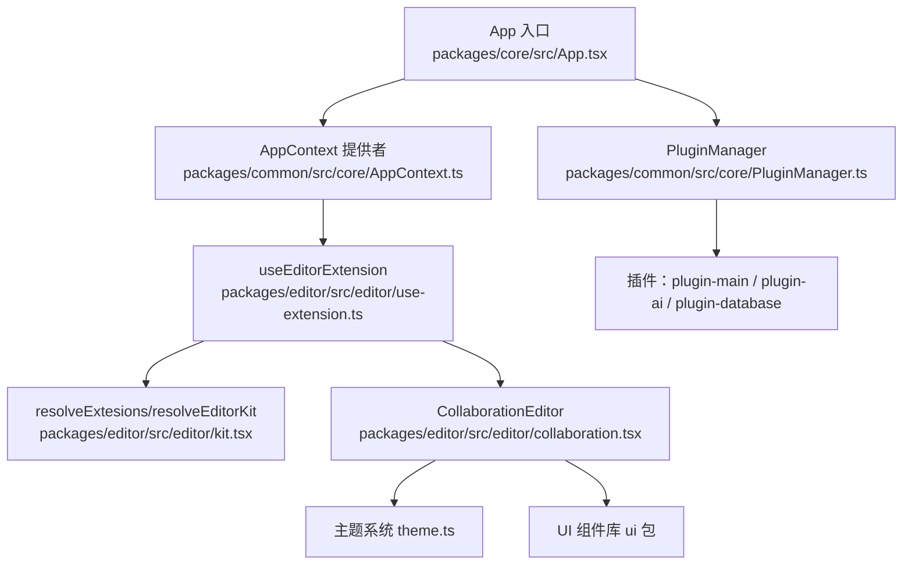
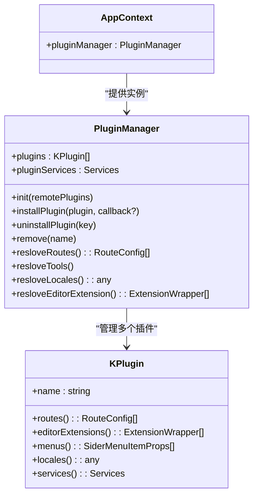
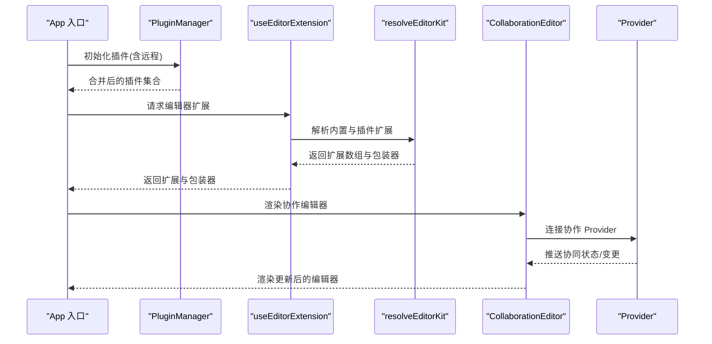
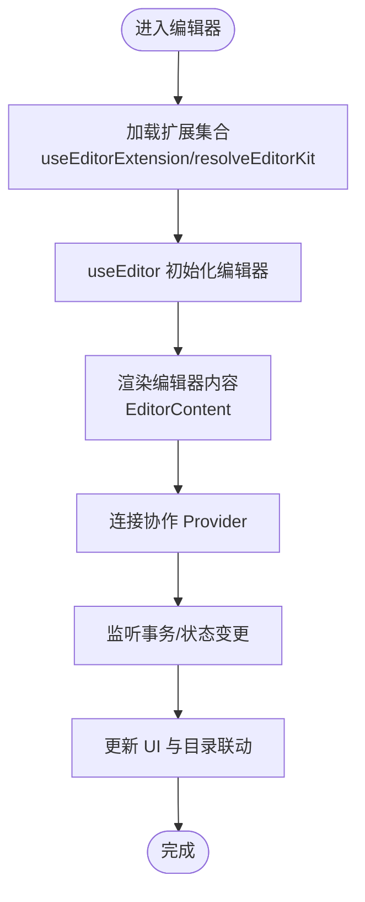
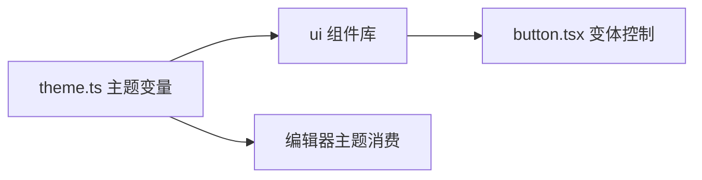
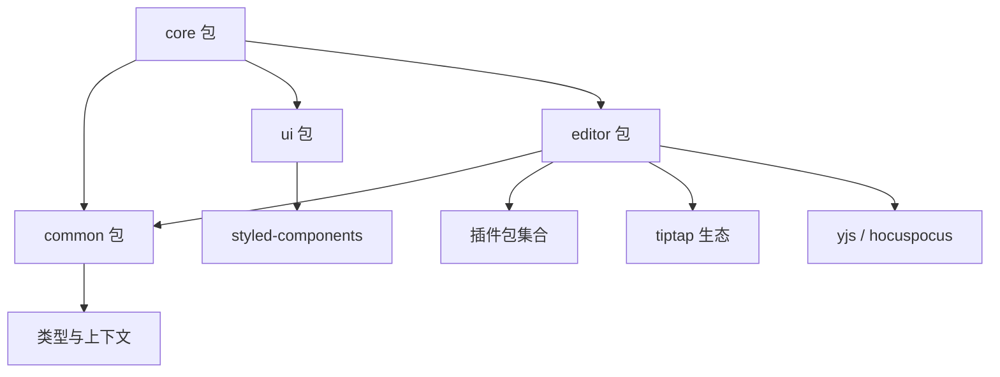

# 架构设计

<cite>
**本文引用的文件**
- [package.json](file://package.json)
- [pnpm-workspace.yaml](file://pnpm-workspace.yaml)
- [turbo.json](file://turbo.json)
- [packages/common/src/core/PluginManager.ts](file://packages/common/src/core/PluginManager.ts)
- [packages/common/src/core/AppContext.ts](file://packages/common/src/core/AppContext.ts)
- [packages/editor/src/editor/collaboration.tsx](file://packages/editor/src/editor/collaboration.tsx)
- [packages/editor/src/index.ts](file://packages/editor/src/index.ts)
- [packages/editor/src/editor/kit.tsx](file://packages/editor/src/editor/kit.tsx)
- [packages/editor/src/editor/use-extension.ts](file://packages/editor/src/editor/use-extension.ts)
- [packages/core/src/App.tsx](file://packages/core/src/App.tsx)
- [packages/ui/src/index.ts](file://packages/ui/src/index.ts)
- [packages/editor/src/styles/theme.ts](file://packages/editor/src/styles/theme.ts)
- [packages/plugin-main/src/index.tsx](file://packages/plugin-main/src/index.tsx)
- [packages/ui/src/components/ui/button.tsx](file://packages/ui/src/components/ui/button.tsx)
- [packages/editor/src/components/bubble-menu.tsx](file://packages/editor/src/components/bubble-menu.tsx)
- [packages/common/src/entity/Page.ts](file://packages/common/src/entity/Page.ts)
- [packages/editor/src/extensions/title/title.ts](file://packages/editor/src/extensions/title/title.ts)
</cite>

## 目录
1. [引言](#引言)
2. [项目结构](#项目结构)
3. [核心组件](#核心组件)
4. [架构总览](#架构总览)
5. [详细组件分析](#详细组件分析)
6. [依赖分析](#依赖分析)
7. [性能考虑](#性能考虑)
8. [故障排查指南](#故障排查指南)
9. [结论](#结论)
10. [附录](#附录)

## 引言
本架构设计文档面向“知识库管理系统”，聚焦于以下目标：
- 整体系统采用 Monorepo 结构，通过工作区与构建编排统一管理多应用与多包。
- 插件系统以 PluginManager 为核心，提供插件发现、加载、合并路由与菜单、国际化资源与服务的能力。
- 实时协作基于 Tiptap 与 Yjs/Hocuspocus，支持多人在线协作、感知用户状态与内容同步。
- 编辑器内核围绕 Tiptap 集成，提供扩展系统、工具栏与气泡菜单、标题节点等能力，并支持协作编辑。
- UI 组件库采用设计系统风格，结合主题系统与样式变量，保证一致性与可定制性。

## 项目结构
系统采用 pnpm workspaces + Turbo 的 Monorepo 策略，按功能域拆分应用与包：
- 应用层：landing-page、landing-page-vite、vite（前端应用）
- 公共基础：common（插件管理、上下文、类型等）
- 核心模块：core（应用入口、路由、国际化、全局状态）
- 编辑器内核：editor（Tiptap 集成、协作、扩展、导出、主题）
- 插件生态：plugin-xxx（如 plugin-main、plugin-ai、plugin-database 等）
- UI 组件库：ui（基于 shadcn/ui 风格的组件与主题）

图表来源
- [packages/core/src/App.tsx](file://packages/core/src/App.tsx#L64-L187)
- [packages/common/src/core/PluginManager.ts](file://packages/common/src/core/PluginManager.ts#L63-L170)
- [packages/editor/src/editor/collaboration.tsx](file://packages/editor/src/editor/collaboration.tsx#L1-L142)
- [packages/editor/src/editor/kit.tsx](file://packages/editor/src/editor/kit.tsx#L1-L87)
- [packages/editor/src/editor/use-extension.ts](file://packages/editor/src/editor/use-extension.ts#L1-L63)
- [packages/plugin-main/src/index.tsx](file://packages/plugin-main/src/index.tsx#L1-L118)
- [packages/ui/src/components/ui/button.tsx](file://packages/ui/src/components/ui/button.tsx#L1-L57)

章节来源
- [pnpm-workspace.yaml](file://pnpm-workspace.yaml#L1-L4)
- [turbo.json](file://turbo.json#L1-L27)
- [package.json](file://package.json#L1-L103)

## 核心组件
- 插件管理器（PluginManager）：负责插件初始化、远程插件动态加载、插件服务合并、路由/菜单/国际化/编辑器扩展解析。
- 应用上下文（AppContext）：向编辑器与业务组件提供插件管理器实例。
- 编辑器协作（CollaborationEditor）：封装 Tiptap 编辑器、协作 Provider、菜单与目录联动。
- 编辑器扩展（use-extension/kit）：统一解析内置与插件扩展，生成运行时扩展集合与 Slash 菜单。
- 应用入口（App）：根据登录态决定初始化流程，合并插件路由与国际化，挂载全局 Provider。
- UI 组件库（ui）：提供设计系统组件与主题变量，支撑一致的视觉与交互体验。

章节来源
- [packages/common/src/core/PluginManager.ts](file://packages/common/src/core/PluginManager.ts#L63-L170)
- [packages/common/src/core/AppContext.ts](file://packages/common/src/core/AppContext.ts#L1-L13)
- [packages/editor/src/editor/collaboration.tsx](file://packages/editor/src/editor/collaboration.tsx#L1-L142)
- [packages/editor/src/editor/kit.tsx](file://packages/editor/src/editor/kit.tsx#L1-L87)
- [packages/editor/src/editor/use-extension.ts](file://packages/editor/src/editor/use-extension.ts#L1-L63)
- [packages/core/src/App.tsx](file://packages/core/src/App.tsx#L64-L187)
- [packages/ui/src/index.ts](file://packages/ui/src/index.ts#L1-L18)

## 架构总览
系统采用“应用入口 + 插件中心 + 编辑器内核 + UI 组件库”的分层架构：
- 应用入口负责路由、国际化、全局 Provider 与事件总线。
- 插件中心负责插件生命周期与能力聚合（路由、菜单、国际化、服务、编辑器扩展）。
- 编辑器内核负责内容模型、协作协议、扩展系统与 UI 交互。
- UI 组件库提供一致的设计语言与主题体系。

图表来源
- [packages/core/src/App.tsx](file://packages/core/src/App.tsx#L64-L187)
- [packages/common/src/core/PluginManager.ts](file://packages/common/src/core/PluginManager.ts#L63-L170)
- [packages/common/src/core/AppContext.ts](file://packages/common/src/core/AppContext.ts#L1-L13)
- [packages/editor/src/editor/use-extension.ts](file://packages/editor/src/editor/use-extension.ts#L1-L63)
- [packages/editor/src/editor/kit.tsx](file://packages/editor/src/editor/kit.tsx#L1-L87)
- [packages/editor/src/editor/collaboration.tsx](file://packages/editor/src/editor/collaboration.tsx#L1-L142)
- [packages/editor/src/styles/theme.ts](file://packages/editor/src/styles/theme.ts#L1-L55)
- [packages/ui/src/index.ts](file://packages/ui/src/index.ts#L1-L18)
- [packages/plugin-main/src/index.tsx](file://packages/plugin-main/src/index.tsx#L1-L118)

## 详细组件分析

### 插件系统架构
- 设计理念
  - 以 KPlugin 为最小单元，集中声明路由、菜单、编辑器扩展、国际化与服务。
  - PluginManager 聚合初始插件与远程插件，动态加载并合并能力。
  - 通过 AppContext 将插件管理器注入到编辑器与业务组件，实现解耦与可扩展。
- 生命周期
  - 初始化：根据本地 token 决定是否拉取已安装插件列表，随后合并初始插件与远程插件。
  - 安装/卸载：支持动态安装与卸载，触发刷新事件以更新路由与菜单。
  - 能力解析：按需解析路由、菜单、国际化与编辑器扩展。
- 关键接口路径
  - 插件配置与实例化：[packages/plugin-main/src/index.tsx](file://packages/plugin-main/src/index.tsx#L1-L118)
  - 插件管理器类与方法：[packages/common/src/core/PluginManager.ts](file://packages/common/src/core/PluginManager.ts#L63-L170)
  - 应用上下文提供者：[packages/common/src/core/AppContext.ts](file://packages/common/src/core/AppContext.ts#L1-L13)

图表来源
- [packages/common/src/core/PluginManager.ts](file://packages/common/src/core/PluginManager.ts#L21-L170)
- [packages/common/src/core/AppContext.ts](file://packages/common/src/core/AppContext.ts#L1-L13)
- [packages/plugin-main/src/index.tsx](file://packages/plugin-main/src/index.tsx#L1-L118)

章节来源
- [packages/common/src/core/PluginManager.ts](file://packages/common/src/core/PluginManager.ts#L63-L170)
- [packages/common/src/core/AppContext.ts](file://packages/common/src/core/AppContext.ts#L1-L13)
- [packages/plugin-main/src/index.tsx](file://packages/plugin-main/src/index.tsx#L1-L118)

### 实时协作架构
- 协作原理
  - 基于 Tiptap 与 Yjs/Hocuspocus Provider，实现结构化文档的实时协作。
  - 编辑器在初始化时加载扩展集合，支持目录联动与内容渲染。
- 冲突解决与状态同步
  - 使用 Yjs 的事务模型与变更来源过滤，避免本地事务被回放导致的循环。
  - 通过 UniqueID 扩展确保节点唯一标识，配合过滤逻辑减少不必要重绘。
- 关键接口路径
  - 协作编辑器封装：[packages/editor/src/editor/collaboration.tsx](file://packages/editor/src/editor/collaboration.tsx#L1-L142)
  - 扩展解析与运行时组装：[packages/editor/src/editor/kit.tsx](file://packages/editor/src/editor/kit.tsx#L1-L87)
  - 扩展加载与合并：[packages/editor/src/editor/use-extension.ts](file://packages/editor/src/editor/use-extension.ts#L1-L63)
  - 导出与 Provider 类型：[packages/editor/src/index.ts](file://packages/editor/src/index.ts#L1-L23)

图表来源
- [packages/core/src/App.tsx](file://packages/core/src/App.tsx#L64-L187)
- [packages/common/src/core/PluginManager.ts](file://packages/common/src/core/PluginManager.ts#L63-L170)
- [packages/editor/src/editor/use-extension.ts](file://packages/editor/src/editor/use-extension.ts#L1-L63)
- [packages/editor/src/editor/kit.tsx](file://packages/editor/src/editor/kit.tsx#L1-L87)
- [packages/editor/src/editor/collaboration.tsx](file://packages/editor/src/editor/collaboration.tsx#L1-L142)
- [packages/editor/src/index.ts](file://packages/editor/src/index.ts#L1-L23)

章节来源
- [packages/editor/src/editor/collaboration.tsx](file://packages/editor/src/editor/collaboration.tsx#L1-L142)
- [packages/editor/src/editor/kit.tsx](file://packages/editor/src/editor/kit.tsx#L1-L87)
- [packages/editor/src/editor/use-extension.ts](file://packages/editor/src/editor/use-extension.ts#L1-L63)
- [packages/editor/src/index.ts](file://packages/editor/src/index.ts#L1-L23)

### 编辑器内核架构
- Tiptap 集成
  - 使用 useEditor 创建编辑器实例，加载扩展集合与内容重写逻辑。
  - 支持目录联动、标题节点视图、占位符与性能监控等扩展。
- 扩展系统设计
  - 内置扩展与插件扩展统一解析，支持按需过滤与动态追加。
  - Slash 菜单由扩展包装器汇总生成，提升命令式输入体验。
- 协作编辑实现
  - 通过 Provider 连接协作服务，结合 UniqueID 与事务过滤，保障一致性。
- 关键接口路径
  - 协作编辑器：[packages/editor/src/editor/collaboration.tsx](file://packages/editor/src/editor/collaboration.tsx#L1-L142)
  - 扩展解析与运行时组装：[packages/editor/src/editor/kit.tsx](file://packages/editor/src/editor/kit.tsx#L1-L87)
  - 扩展加载与合并：[packages/editor/src/editor/use-extension.ts](file://packages/editor/src/editor/use-extension.ts#L1-L63)
  - 标题节点扩展：[packages/editor/src/extensions/title/title.ts](file://packages/editor/src/extensions/title/title.ts#L1-L91)

图表来源
- [packages/editor/src/editor/use-extension.ts](file://packages/editor/src/editor/use-extension.ts#L1-L63)
- [packages/editor/src/editor/kit.tsx](file://packages/editor/src/editor/kit.tsx#L1-L87)
- [packages/editor/src/editor/collaboration.tsx](file://packages/editor/src/editor/collaboration.tsx#L1-L142)

章节来源
- [packages/editor/src/editor/collaboration.tsx](file://packages/editor/src/editor/collaboration.tsx#L1-L142)
- [packages/editor/src/editor/kit.tsx](file://packages/editor/src/editor/kit.tsx#L1-L87)
- [packages/editor/src/editor/use-extension.ts](file://packages/editor/src/editor/use-extension.ts#L1-L63)
- [packages/editor/src/extensions/title/title.ts](file://packages/editor/src/extensions/title/title.ts#L1-L91)

### UI 组件库与主题系统
- 设计模式
  - 采用设计系统风格，使用 class-variance-authority 控制变体，统一按钮等组件的尺寸与风格。
  - 通过 styled-components 与主题变量实现主题切换与样式复用。
- 主题系统
  - 提供 base/light/dark 主题变量，统一颜色、边框、阴影、表格与菜单等视觉属性。
- 关键接口路径
  - 组件导出与工具：[packages/ui/src/index.ts](file://packages/ui/src/index.ts#L1-L18)
  - 按钮组件与变体：[packages/ui/src/components/ui/button.tsx](file://packages/ui/src/components/ui/button.tsx#L1-L57)
  - 主题变量：[packages/editor/src/styles/theme.ts](file://packages/editor/src/styles/theme.ts#L1-L55)

图表来源
- [packages/ui/src/index.ts](file://packages/ui/src/index.ts#L1-L18)
- [packages/ui/src/components/ui/button.tsx](file://packages/ui/src/components/ui/button.tsx#L1-L57)
- [packages/editor/src/styles/theme.ts](file://packages/editor/src/styles/theme.ts#L1-L55)

章节来源
- [packages/ui/src/index.ts](file://packages/ui/src/index.ts#L1-L18)
- [packages/ui/src/components/ui/button.tsx](file://packages/ui/src/components/ui/button.tsx#L1-L57)
- [packages/editor/src/styles/theme.ts](file://packages/editor/src/styles/theme.ts#L1-L55)

## 依赖分析
- 工作区与构建
  - pnpm workspaces 统一管理应用与包；Turbo 作为构建编排，定义任务依赖与缓存策略。
- 包间依赖
  - core 依赖 common、ui、editor；editor 依赖 common 并消费插件扩展；插件依赖 common 提供的 KPlugin 与 ExtensionWrapper。
- 外部依赖
  - 编辑器内核依赖 @tiptap/*、@hocuspocus/provider、yjs；UI 依赖 styled-components、class-variance-authority 等。

图表来源
- [pnpm-workspace.yaml](file://pnpm-workspace.yaml#L1-L4)
- [turbo.json](file://turbo.json#L1-L27)
- [package.json](file://package.json#L1-L103)
- [packages/core/src/App.tsx](file://packages/core/src/App.tsx#L64-L187)
- [packages/common/src/core/PluginManager.ts](file://packages/common/src/core/PluginManager.ts#L63-L170)
- [packages/editor/src/index.ts](file://packages/editor/src/index.ts#L1-L23)

章节来源
- [pnpm-workspace.yaml](file://pnpm-workspace.yaml#L1-L4)
- [turbo.json](file://turbo.json#L1-L27)
- [package.json](file://package.json#L1-L103)

## 性能考虑
- 构建与缓存
  - Turbo 任务配置开启持久化与缓存，减少重复构建时间。
- 编辑器渲染
  - useEditor 的立即渲染与事务监听优化，避免不必要的重渲染。
  - UniqueID 与事务过滤减少回放导致的无效更新。
- 插件加载
  - 动态脚本加载与事件驱动刷新，避免全量重载应用。

## 故障排查指南
- 插件未生效
  - 检查 PluginManager 是否正确合并插件扩展与路由；确认 REFRESH_PLUSINS 事件是否触发。
  - 参考路径：[packages/common/src/core/PluginManager.ts](file://packages/common/src/core/PluginManager.ts#L99-L112)
- 编辑器无协作
  - 确认 Provider 已连接且未提前销毁；检查事务过滤与 UniqueID 配置。
  - 参考路径：[packages/editor/src/editor/collaboration.tsx](file://packages/editor/src/editor/collaboration.tsx#L106-L113)
- 国际化缺失
  - 确认插件国际化资源已合并至 i18n；检查资源键是否存在。
  - 参考路径：[packages/core/src/App.tsx](file://packages/core/src/App.tsx#L130-L152)
- UI 样式异常
  - 检查主题变量与 styled-components Provider 是否正确注入。
  - 参考路径：[packages/editor/src/styles/theme.ts](file://packages/editor/src/styles/theme.ts#L1-L55)

章节来源
- [packages/common/src/core/PluginManager.ts](file://packages/common/src/core/PluginManager.ts#L99-L112)
- [packages/editor/src/editor/collaboration.tsx](file://packages/editor/src/editor/collaboration.tsx#L106-L113)
- [packages/core/src/App.tsx](file://packages/core/src/App.tsx#L130-L152)
- [packages/editor/src/styles/theme.ts](file://packages/editor/src/styles/theme.ts#L1-L55)

## 结论
本系统通过 Monorepo 与插件中心实现了高内聚、低耦合的扩展架构；借助 Tiptap 与 Yjs 的协作能力，提供了稳定高效的实时编辑体验；UI 组件库与主题系统保障了设计一致性与可维护性。建议后续持续完善插件生态与协作边界场景测试，以进一步提升稳定性与扩展性。

## 附录
- 数据模型（分页）
  - Page<T> 用于通用分页结构，便于插件与服务层复用。
  - 参考路径：[packages/common/src/entity/Page.ts](file://packages/common/src/entity/Page.ts#L1-L8)

章节来源
- [packages/common/src/entity/Page.ts](file://packages/common/src/entity/Page.ts#L1-L8)