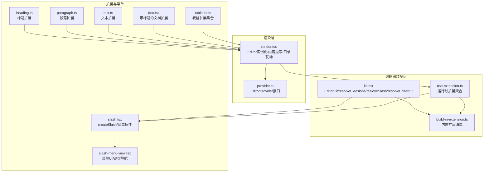
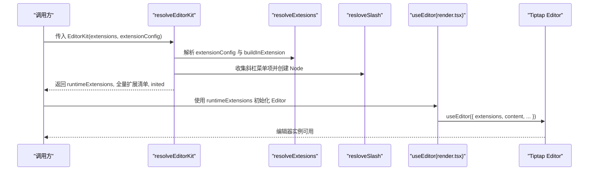
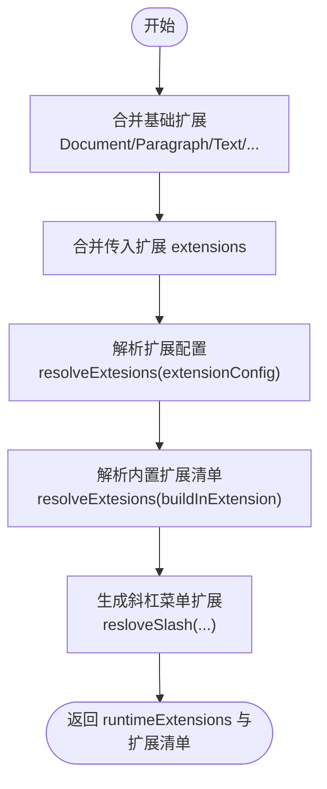
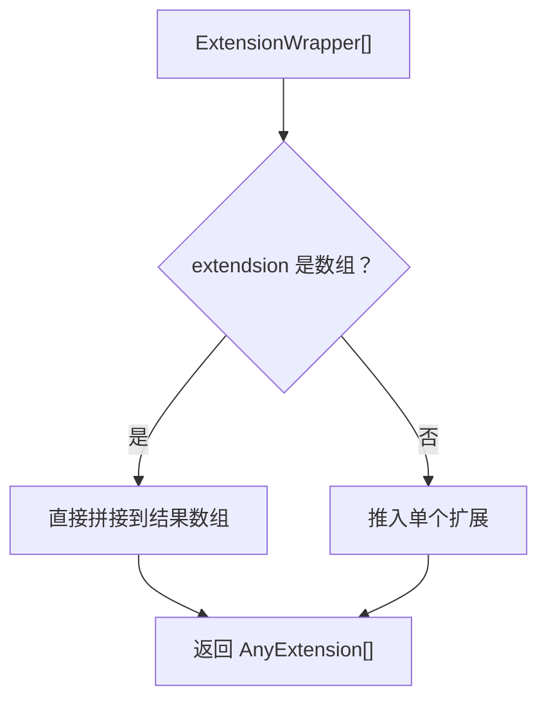
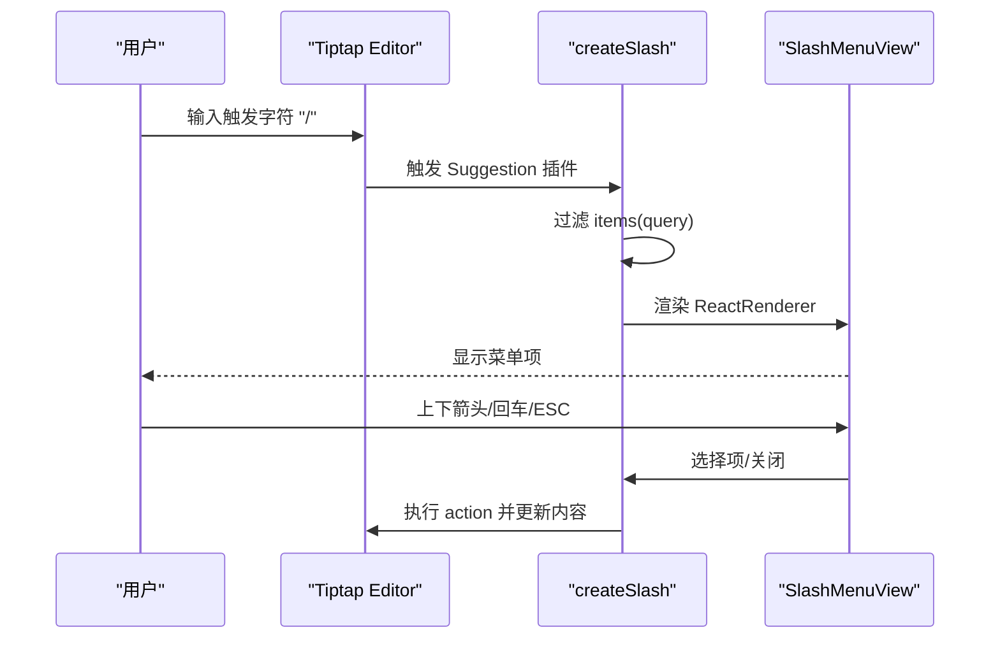
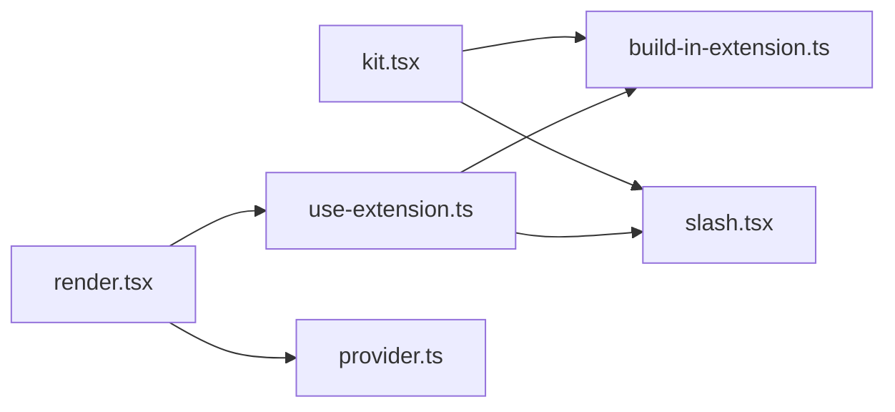

# Tiptap编辑器集成

<cite>
**本文引用的文件**
- [packages/editor/src/editor/kit.tsx](file://packages/editor/src/editor/kit.tsx)
- [packages/editor/src/editor/build-in-extension.ts](file://packages/editor/src/editor/build-in-extension.ts)
- [packages/editor/src/editor/use-extension.ts](file://packages/editor/src/editor/use-extension.ts)
- [packages/editor/src/editor/render.tsx](file://packages/editor/src/editor/render.tsx)
- [packages/editor/src/editor/provider.ts](file://packages/editor/src/editor/provider.ts)
- [packages/editor/src/extensions/slash/slash.tsx](file://packages/editor/src/extensions/slash/slash.tsx)
- [packages/editor/src/extensions/slash/slash-menu-view.tsx](file://packages/editor/src/extensions/slash/slash-menu-view.tsx)
- [packages/editor/src/extensions/paragraph/paragraph.ts](file://packages/editor/src/extensions/paragraph/paragraph.ts)
- [packages/editor/src/extensions/text/text.ts](file://packages/editor/src/extensions/text/text.ts)
- [packages/editor/src/extensions/doc/doc.tsx](file://packages/editor/src/extensions/doc/doc.tsx)
- [packages/editor/src/extensions/heading/heading.ts](file://packages/editor/src/extensions/heading/heading.ts)
- [packages/editor/src/extensions/table/table-kit.ts](file://packages/editor/src/extensions/table/table-kit.ts)
</cite>

## 目录
1. [简介](#简介)
2. [项目结构](#项目结构)
3. [核心组件](#核心组件)
4. [架构总览](#架构总览)
5. [详细组件分析](#详细组件分析)
6. [依赖关系分析](#依赖关系分析)
7. [性能考量](#性能考量)
8. [故障排查指南](#故障排查指南)
9. [结论](#结论)
10. [附录](#附录)

## 简介
本文件面向知识库系统的Tiptap编辑器集成，系统性阐述编辑器Kit的设计模式、扩展组合策略、内置扩展管理与解析机制、斜杠菜单（Slash Commands）的实现与动态扩展解析流程，并给出扩展开发最佳实践与性能优化建议。读者无需深入前端即可理解编辑器的装配方式与扩展生态。

## 项目结构
编辑器相关代码集中在 packages/editor 包中，围绕“编辑器装配（Kit）—扩展解析（resolveExtesions）—斜杠菜单（Slash）—渲染与上下文（Render/Provider）”四个维度组织：
- 编辑器装配与解析：kit.tsx 提供 EditorKit 接口、resolveExtesions、resloveSlash 与 resolveEditorKit
- 内置扩展清单：build-in-extension.ts 汇总所有内置 ExtensionWrapper
- 扩展解析与装配：use-extension.ts 聚合运行时扩展、插件扩展与斜杠菜单
- 渲染与上下文：render.tsx 负责 Editor 实例化、内容重写与目录联动；provider.ts 定义外部能力注入接口
- 斜杠菜单：slash.tsx 与 slash-menu-view.tsx 实现菜单项、过滤、定位与交互

图表来源
- [packages/editor/src/editor/kit.tsx](file://packages/editor/src/editor/kit.tsx#L1-L87)
- [packages/editor/src/editor/build-in-extension.ts](file://packages/editor/src/editor/build-in-extension.ts#L1-L56)
- [packages/editor/src/editor/use-extension.ts](file://packages/editor/src/editor/use-extension.ts#L1-L63)
- [packages/editor/src/editor/render.tsx](file://packages/editor/src/editor/render.tsx#L1-L115)
- [packages/editor/src/editor/provider.ts](file://packages/editor/src/editor/provider.ts#L1-L53)
- [packages/editor/src/extensions/slash/slash.tsx](file://packages/editor/src/extensions/slash/slash.tsx#L1-L192)
- [packages/editor/src/extensions/slash/slash-menu-view.tsx](file://packages/editor/src/extensions/slash/slash-menu-view.tsx#L1-L150)
- [packages/editor/src/extensions/paragraph/paragraph.ts](file://packages/editor/src/extensions/paragraph/paragraph.ts#L1-L4)
- [packages/editor/src/extensions/text/text.ts](file://packages/editor/src/extensions/text/text.ts#L1-L4)
- [packages/editor/src/extensions/doc/doc.tsx](file://packages/editor/src/extensions/doc/doc.tsx#L1-L28)
- [packages/editor/src/extensions/heading/heading.ts](file://packages/editor/src/extensions/heading/heading.ts#L1-L216)
- [packages/editor/src/extensions/table/table-kit.ts](file://packages/editor/src/extensions/table/table-kit.ts#L1-L17)

章节来源
- [packages/editor/src/editor/kit.tsx](file://packages/editor/src/editor/kit.tsx#L1-L87)
- [packages/editor/src/editor/build-in-extension.ts](file://packages/editor/src/editor/build-in-extension.ts#L1-L56)
- [packages/editor/src/editor/use-extension.ts](file://packages/editor/src/editor/use-extension.ts#L1-L63)
- [packages/editor/src/editor/render.tsx](file://packages/editor/src/editor/render.tsx#L1-L115)
- [packages/editor/src/editor/provider.ts](file://packages/editor/src/editor/provider.ts#L1-L53)

## 核心组件
- EditorKit 接口与装配
  - EditorKit 定义了扩展数组与扩展配置数组（ExtensionWrapper[]），用于统一装配入口
  - resolveEditorKit 负责组装运行时扩展数组，合并基础扩展、传入扩展、内置扩展与解析后的扩展配置
- 扩展解析器
  - resolveExtesions 将 ExtensionWrapper[] 展开为 AnyExtension[]，支持数组或单个扩展
  - resloveSlash 从扩展配置中收集斜杠菜单项，生成一个基于 Suggestion 的 Node 扩展
- 内置扩展清单
  - buildInExtension 汇总所有内置扩展（如 Heading、Bold、Table、CodeBlock、Emoji、Math 等），作为默认装配来源
- 运行时扩展聚合
  - useEditorExtension 在运行时组合基础扩展、占位符、尾随节点、性能监控、气泡菜单等，并通过插件管理器动态注入插件扩展与斜杠菜单

章节来源
- [packages/editor/src/editor/kit.tsx](file://packages/editor/src/editor/kit.tsx#L1-L87)
- [packages/editor/src/editor/build-in-extension.ts](file://packages/editor/src/editor/build-in-extension.ts#L1-L56)
- [packages/editor/src/editor/use-extension.ts](file://packages/editor/src/editor/use-extension.ts#L1-L63)

## 架构总览
编辑器的装配采用“配置驱动 + 动态解析”的设计模式：
- 基础扩展（Document、Paragraph、Text、HardBreak、TrailingNode、Perf、UniqueID 等）作为稳定基座
- 内置扩展清单与插件扩展通过 ExtensionWrapper 统一包装，经 resolveExtesions 解析后注入
- 斜杠菜单通过 resloveSlash 动态收集 items 并创建 Node 扩展，结合 Suggestion 插件实现输入触发、过滤与 UI 定位
- 渲染层使用 useEditor 初始化编辑器，合并扩展并启用目录联动

图表来源
- [packages/editor/src/editor/kit.tsx](file://packages/editor/src/editor/kit.tsx#L52-L87)
- [packages/editor/src/editor/use-extension.ts](file://packages/editor/src/editor/use-extension.ts#L20-L63)
- [packages/editor/src/editor/render.tsx](file://packages/editor/src/editor/render.tsx#L61-L89)

## 详细组件分析

### 编辑器Kit与扩展装配
- 设计要点
  - EditorKit 抽象扩展输入，支持静态扩展数组与动态扩展配置
  - resolveEditorKit 将 Document、Paragraph、Text、HardBreak、Focus、Loading、TrailingNode、Perf、UniqueID 等基础扩展与传入扩展、解析后的扩展配置、内置扩展合并为最终扩展数组
  - 通过 useState 管理初始化状态，便于后续扩展的动态注入与更新
- 关键函数
  - resolveExtesions：遍历 ExtensionWrapper[]，展开 extendsion 字段，支持数组或单个扩展
  - resloveSlash：收集 slashConfig，创建 Node 扩展，设置 char、pluginKey 与 items
  - resolveEditorKit：组装运行时扩展数组，返回扩展清单与初始化状态

图表来源
- [packages/editor/src/editor/kit.tsx](file://packages/editor/src/editor/kit.tsx#L52-L87)

章节来源
- [packages/editor/src/editor/kit.tsx](file://packages/editor/src/editor/kit.tsx#L1-L87)

### 内置扩展管理与解析机制
- 内置扩展清单
  - buildInExtension 汇总大量扩展（Heading、Bold、Italic、Underline、Strike、Code、CodeBlock、Table、Columns、Color、Link、Emoji、Date、Math、TaskList、PageContent、Markdown、Ident、LineHeight、Comment、FormatPainter、Event、Selection、UnknownNode、Highlight、Details 等），作为默认装配来源
- 解析流程
  - resolveExtesions 遍历 ExtensionWrapper[]，将每个条目的 extendsion 字段（可能是数组或单个扩展）展开为 AnyExtension[]
  - useEditorExtension 在运行时将 buildInExtension 与插件管理器提供的扩展合并，再经 resolveExtesions 展开

图表来源
- [packages/editor/src/editor/kit.tsx](file://packages/editor/src/editor/kit.tsx#L23-L34)
- [packages/editor/src/editor/build-in-extension.ts](file://packages/editor/src/editor/build-in-extension.ts#L1-L56)
- [packages/editor/src/editor/use-extension.ts](file://packages/editor/src/editor/use-extension.ts#L47-L54)

章节来源
- [packages/editor/src/editor/build-in-extension.ts](file://packages/editor/src/editor/build-in-extension.ts#L1-L56)
- [packages/editor/src/editor/kit.tsx](file://packages/editor/src/editor/kit.tsx#L23-L34)
- [packages/editor/src/editor/use-extension.ts](file://packages/editor/src/editor/use-extension.ts#L47-L54)

### 斜杠菜单系统（Slash Commands）
- 菜单扩展创建
  - createSlash(name, options) 创建一个 Node 扩展，内部通过 Suggestion 插件实现触发字符、命令执行、菜单项过滤与 UI 渲染
  - 选项包含 items（菜单项数组）、pluginKey、char 等
- 菜单项结构
  - SlashMenuItem 支持普通项（icon、text、slash、render、action）与分隔项（divider + title）
- 过滤与交互
  - items 回调根据查询词过滤，支持按 text 或 slash 包含匹配
  - 键盘事件处理：Esc 关闭、上下箭头切换、Enter 选择
- UI 定位
  - 使用 computePosition 基于选区位置计算菜单定位，适配单元格选择场景

图表来源
- [packages/editor/src/extensions/slash/slash.tsx](file://packages/editor/src/extensions/slash/slash.tsx#L41-L192)
- [packages/editor/src/extensions/slash/slash-menu-view.tsx](file://packages/editor/src/extensions/slash/slash-menu-view.tsx#L53-L150)

章节来源
- [packages/editor/src/extensions/slash/slash.tsx](file://packages/editor/src/extensions/slash/slash.tsx#L1-L192)
- [packages/editor/src/extensions/slash/slash-menu-view.tsx](file://packages/editor/src/extensions/slash/slash-menu-view.tsx#L1-L150)

### 扩展配置对象 ExtensionWrapper 结构与作用
- 结构
  - extendsion：可为单个扩展或扩展数组，经 resolveExtesions 展开
  - slashConfig：可选的斜杠菜单项数组，经 resloveSlash 收集
- 作用
  - 统一扩展包装，便于动态注入、条件装配与斜杠菜单收集
  - 与插件管理器协作，实现插件扩展的按需加载与合并

章节来源
- [packages/editor/src/editor/kit.tsx](file://packages/editor/src/editor/kit.tsx#L23-L49)

### 编辑器渲染与上下文
- EditorRender
  - 使用 useEditorExtension 获取扩展数组，合并传入扩展与运行时扩展
  - 对内容进行重写（rewriteUnknownContent），确保未知节点安全渲染
  - 启用目录联动 TableOfContents，实时更新层级索引
- EditorProvider
  - 定义用户、文件等外部能力接口，通过 editor.options.editorProps 注入

章节来源
- [packages/editor/src/editor/render.tsx](file://packages/editor/src/editor/render.tsx#L1-L115)
- [packages/editor/src/editor/provider.ts](file://packages/editor/src/editor/provider.ts#L1-L53)

### 典型扩展示例与组合
- 基础扩展
  - Paragraph、Text：来自 @tiptap/extension-*，作为内容树的基础节点
- 文档模型
  - Doc：扩展 Document，限定 content 为 'title block*'，并添加属性（creator、title、cover、comment、createDate、updateDate）
- 标题扩展
  - Heading：扩展 BuiltInHeading，增加 levels、offset、HTMLAttributes 等选项，支持折叠/展开逻辑（部分功能已注释）
- 表格扩展
  - TableExtensions：组合 Table、TableCell、TableHeader、TableRow，并开启可调整列宽与最小宽度

章节来源
- [packages/editor/src/extensions/paragraph/paragraph.ts](file://packages/editor/src/extensions/paragraph/paragraph.ts#L1-L4)
- [packages/editor/src/extensions/text/text.ts](file://packages/editor/src/extensions/text/text.ts#L1-L4)
- [packages/editor/src/extensions/doc/doc.tsx](file://packages/editor/src/extensions/doc/doc.tsx#L1-L28)
- [packages/editor/src/extensions/heading/heading.ts](file://packages/editor/src/extensions/heading/heading.ts#L1-L216)
- [packages/editor/src/extensions/table/table-kit.ts](file://packages/editor/src/extensions/table/table-kit.ts#L1-L17)

## 依赖关系分析
- 组件耦合
  - kit.tsx 与 build-in-extension.ts 通过 resolveExtesions 解耦，便于扩展清单集中管理
  - use-extension.ts 依赖 AppContext 中的插件管理器，实现插件扩展的动态注入
  - render.tsx 依赖 useEditorExtension 与 provider.ts 的 EditorProvider 接口
- 外部依赖
  - @tiptap/*、@tiptap/react、@tiptap/suggestion、@floating-ui/dom 等
- 潜在循环依赖
  - 当前模块间通过接口与函数解耦，未见直接循环导入

图表来源
- [packages/editor/src/editor/kit.tsx](file://packages/editor/src/editor/kit.tsx#L1-L87)
- [packages/editor/src/editor/build-in-extension.ts](file://packages/editor/src/editor/build-in-extension.ts#L1-L56)
- [packages/editor/src/editor/use-extension.ts](file://packages/editor/src/editor/use-extension.ts#L1-L63)
- [packages/editor/src/editor/render.tsx](file://packages/editor/src/editor/render.tsx#L1-L115)
- [packages/editor/src/editor/provider.ts](file://packages/editor/src/editor/provider.ts#L1-L53)

章节来源
- [packages/editor/src/editor/kit.tsx](file://packages/editor/src/editor/kit.tsx#L1-L87)
- [packages/editor/src/editor/use-extension.ts](file://packages/editor/src/editor/use-extension.ts#L1-L63)
- [packages/editor/src/editor/render.tsx](file://packages/editor/src/editor/render.tsx#L1-L115)

## 性能考量
- 扩展数量控制
  - 仅在必要时启用扩展，避免一次性加载过多扩展导致初始化与渲染开销增大
- 内容重写与回退
  - 使用 rewriteUnknownContent 与 fallbackToParagraph，减少未知节点引发的异常与重排
- 斜杠菜单过滤
  - items 过滤逻辑应尽量轻量，避免复杂字符串匹配；必要时对菜单项进行预处理与缓存
- UI 定位
  - computePosition 会触发布局计算，建议在高频滚动场景下限制更新频率或使用防抖
- 目录联动
  - TableOfContents 的 onUpdate 应避免频繁 setState，可通过节流/去抖优化

## 故障排查指南
- 斜杠菜单不显示
  - 检查 extensionConfig 是否正确提供 slashConfig，确认 resloveSlash 已被调用
  - 确认触发字符与 pluginKey 设置一致
- 菜单项无响应
  - 检查 SlashMenuItem 的 action 是否存在且可执行
  - 确认键盘事件链路（上下箭头/回车）是否被拦截
- 内容渲染异常
  - 检查 rewriteUnknownContent 的调用时机与 schema 一致性
  - 确保扩展顺序合理，避免冲突扩展覆盖关键行为
- 目录不同步
  - 检查 TableOfContents 的 onUpdate 回调是否被触发
  - 确认 getHierarchicalIndexes 的实现与文档结构匹配

章节来源
- [packages/editor/src/editor/kit.tsx](file://packages/editor/src/editor/kit.tsx#L36-L49)
- [packages/editor/src/extensions/slash/slash.tsx](file://packages/editor/src/extensions/slash/slash.tsx#L41-L192)
- [packages/editor/src/editor/render.tsx](file://packages/editor/src/editor/render.tsx#L61-L89)

## 结论
本集成方案通过 EditorKit 与 ExtensionWrapper 实现扩展装配的标准化与可扩展性，借助 resolveExtesions 与 resloveSlash 完成内置扩展与斜杠菜单的动态解析与注入。渲染层以 useEditor 为核心，结合内容重写与目录联动，形成完整的知识库编辑体验。遵循本文最佳实践与性能建议，可在保证功能完整性的同时提升稳定性与用户体验。

## 附录
- 最佳实践
  - 使用 ExtensionWrapper 统一封装扩展与菜单配置，便于插件化与动态注入
  - 将常用扩展放入内置清单，按需启用；避免一次性加载全部扩展
  - 斜杠菜单项应清晰分组与命名，提供简洁的 slash 与 text 字段，便于搜索
  - 对重型扩展（如数学、表格、数据库视图）采用懒加载或按需注册
- 开发建议
  - 扩展选项尽量可配置，默认值合理，避免硬编码
  - 为扩展提供稳定的键盘快捷键与无障碍访问支持
  - 对复杂 UI（如菜单、工具栏）采用受控组件与最小化重渲染