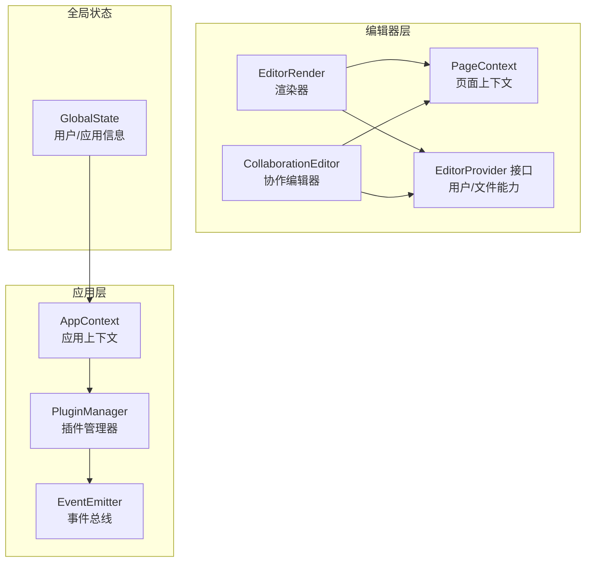
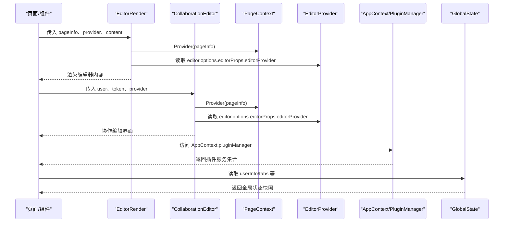
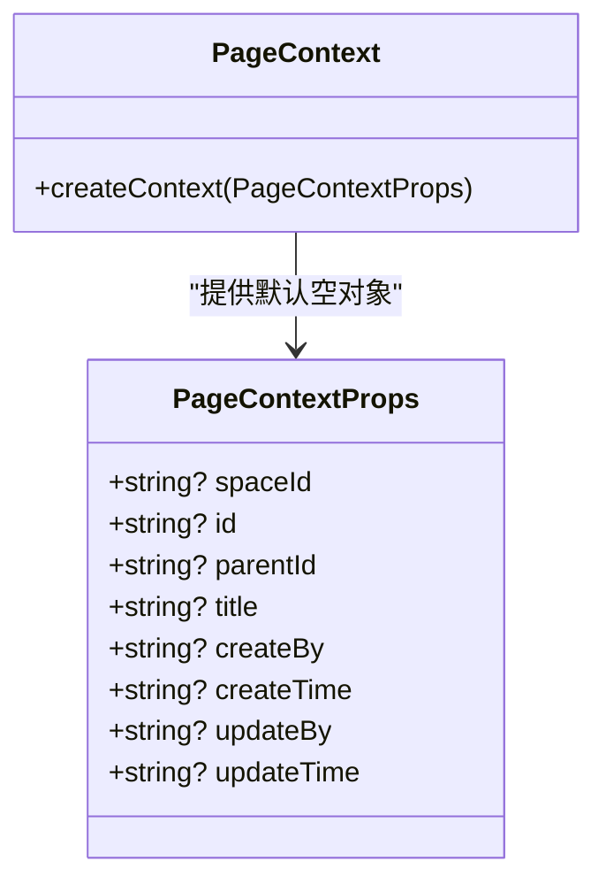
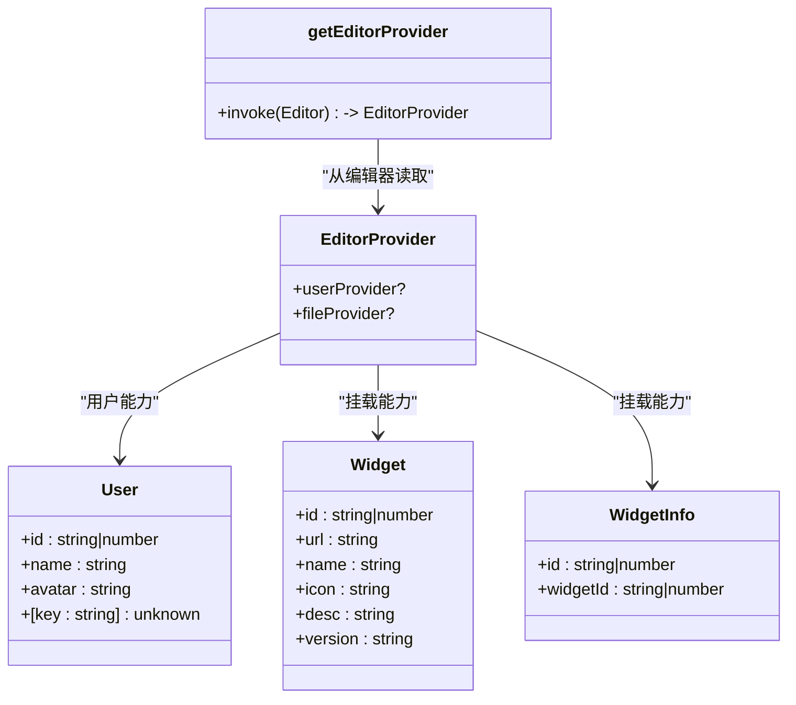
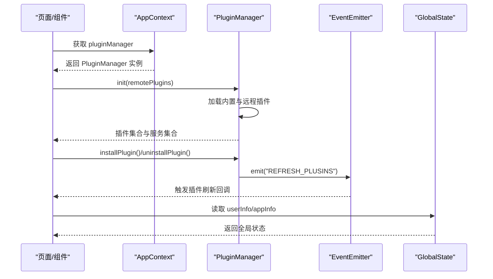
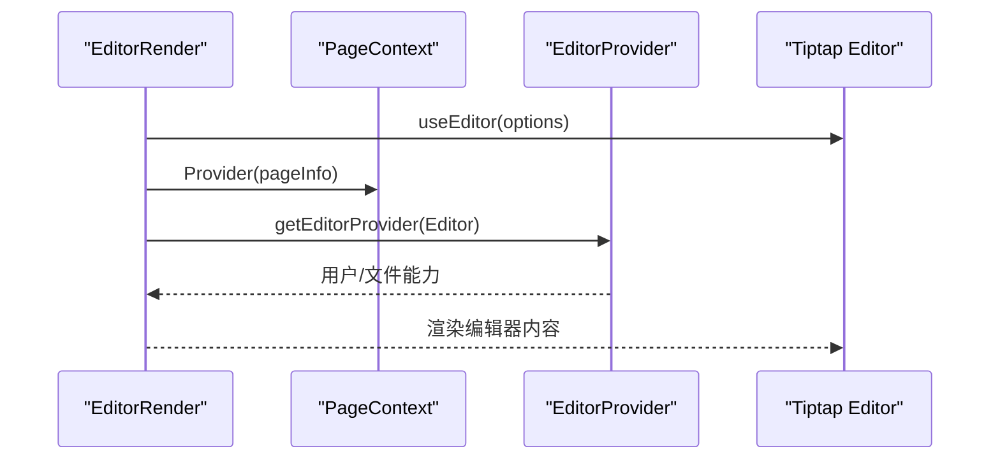
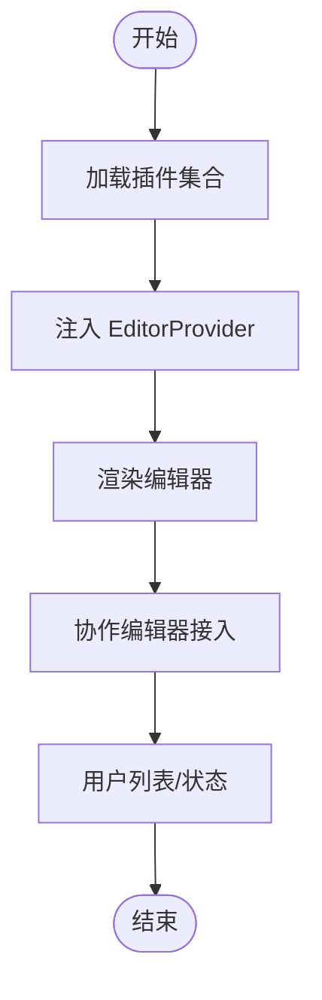
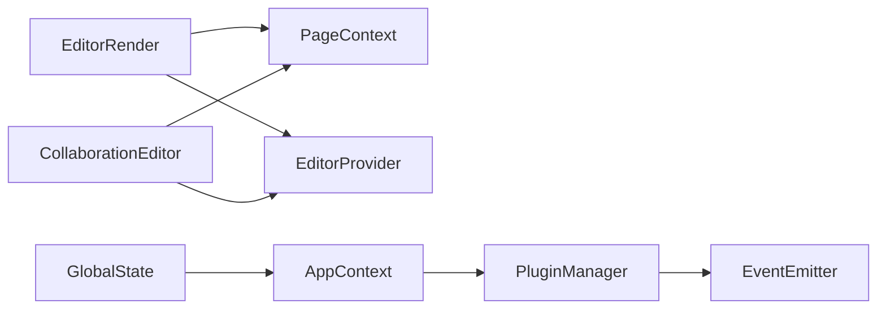

# 上下文管理系统

<cite>
**本文引用的文件**
- [packages/editor/src/editor/context.tsx](file://packages/editor/src/editor/context.tsx)
- [packages/editor/src/editor/provider.ts](file://packages/editor/src/editor/provider.ts)
- [packages/editor/src/editor/render.tsx](file://packages/editor/src/editor/render.tsx)
- [packages/editor/src/editor/collaboration.tsx](file://packages/editor/src/editor/collaboration.tsx)
- [packages/common/src/core/AppContext.ts](file://packages/common/src/core/AppContext.ts)
- [packages/common/src/core/PluginManager.ts](file://packages/common/src/core/PluginManager.ts)
- [packages/common/src/event/event.ts](file://packages/common/src/event/event.ts)
- [packages/core/src/store/GlobalState.ts](file://packages/core/src/store/GlobalState.ts)
- [packages/core/src/hooks/use-service.ts](file://packages/core/src/hooks/use-service.ts)
- [packages/plugin-main/src/pages/Journals/JournalEditor/index.tsx](file://packages/plugin-main/src/pages/Journals/JournalEditor/index.tsx)
- [packages/plugin-main/src/pages/PageRoom/index.tsx](file://packages/plugin-main/src/pages/PageRoom/index.tsx)
</cite>

## 目录
1. [引言](#引言)
2. [项目结构](#项目结构)
3. [核心组件](#核心组件)
4. [架构总览](#架构总览)
5. [详细组件分析](#详细组件分析)
6. [依赖关系分析](#依赖关系分析)
7. [性能考虑](#性能考虑)
8. [故障排查指南](#故障排查指南)
9. [结论](#结论)
10. [附录](#附录)

## 引言
本文件面向“编辑器上下文管理系统”，系统性梳理编辑器中的全局状态、事件传播与配置继承机制，重点说明 Provider 组件如何通过 React Context 提供编辑器实例与配置信息；阐述上下文数据结构（用户信息、协作状态、插件配置等）；解释上下文更新的触发机制与性能优化策略；并给出与其他系统组件（插件系统、协作系统）的集成方式、最佳实践与调试方法。

## 项目结构
围绕编辑器上下文管理的关键文件分布于以下模块：
- 编辑器上下文定义：页面上下文、编辑器 Provider 接口
- 应用级上下文：应用上下文与插件管理器
- 全局状态：用户信息与应用状态
- 使用示例：渲染器、协作编辑器、页面房间等

图表来源
- [packages/editor/src/editor/context.tsx](file://packages/editor/src/editor/context.tsx#L1-L14)
- [packages/editor/src/editor/provider.ts](file://packages/editor/src/editor/provider.ts#L1-L53)
- [packages/editor/src/editor/render.tsx](file://packages/editor/src/editor/render.tsx#L1-L114)
- [packages/editor/src/editor/collaboration.tsx](file://packages/editor/src/editor/collaboration.tsx#L1-L141)
- [packages/common/src/core/AppContext.ts](file://packages/common/src/core/AppContext.ts#L1-L13)
- [packages/common/src/core/PluginManager.ts](file://packages/common/src/core/PluginManager.ts#L1-L170)
- [packages/common/src/event/event.ts](file://packages/common/src/event/event.ts#L1-L44)
- [packages/core/src/store/GlobalState.ts](file://packages/core/src/store/GlobalState.ts#L1-L32)

章节来源
- [packages/editor/src/editor/context.tsx](file://packages/editor/src/editor/context.tsx#L1-L14)
- [packages/editor/src/editor/provider.ts](file://packages/editor/src/editor/provider.ts#L1-L53)
- [packages/editor/src/editor/render.tsx](file://packages/editor/src/editor/render.tsx#L1-L114)
- [packages/editor/src/editor/collaboration.tsx](file://packages/editor/src/editor/collaboration.tsx#L1-L141)
- [packages/common/src/core/AppContext.ts](file://packages/common/src/core/AppContext.ts#L1-L13)
- [packages/common/src/core/PluginManager.ts](file://packages/common/src/core/PluginManager.ts#L1-L170)
- [packages/common/src/event/event.ts](file://packages/common/src/event/event.ts#L1-L44)
- [packages/core/src/store/GlobalState.ts](file://packages/core/src/store/GlobalState.ts#L1-L32)

## 核心组件
- 页面上下文（PageContext）
  - 作用：在编辑器内部传递页面元信息（如空间 ID、页面 ID、标题、创建者与时间等），供菜单、工具栏、TOC 等消费。
  - 结构：键值对形式，支持可选字段。
- 编辑器 Provider 接口（EditorProvider）
  - 作用：通过编辑器选项注入“用户能力”和“文件能力”，使扩展与组件可在运行时访问这些服务。
  - 能力：获取当前用户、查询用户列表；上传/下载文件等。
- 应用上下文（AppContext）与插件管理器（PluginManager）
  - 作用：在应用层面提供插件管理器，统一加载、安装、卸载插件，并合并插件的服务与扩展。
  - 事件：通过事件总线对外广播插件刷新等事件。
- 全局状态（GlobalState）
  - 作用：承载用户信息、应用信息、标签页状态等，供业务页面与编辑器共同使用。

章节来源
- [packages/editor/src/editor/context.tsx](file://packages/editor/src/editor/context.tsx#L1-L14)
- [packages/editor/src/editor/provider.ts](file://packages/editor/src/editor/provider.ts#L1-L53)
- [packages/common/src/core/AppContext.ts](file://packages/common/src/core/AppContext.ts#L1-L13)
- [packages/common/src/core/PluginManager.ts](file://packages/common/src/core/PluginManager.ts#L1-L170)
- [packages/core/src/store/GlobalState.ts](file://packages/core/src/store/GlobalState.ts#L1-L32)

## 架构总览
编辑器上下文管理由“页面上下文”“编辑器 Provider”“应用上下文/插件管理器”三层构成，配合“全局状态”与“事件总线”形成完整的配置继承与事件传播体系。

图表来源
- [packages/editor/src/editor/render.tsx](file://packages/editor/src/editor/render.tsx#L1-L114)
- [packages/editor/src/editor/collaboration.tsx](file://packages/editor/src/editor/collaboration.tsx#L1-L141)
- [packages/editor/src/editor/context.tsx](file://packages/editor/src/editor/context.tsx#L1-L14)
- [packages/editor/src/editor/provider.ts](file://packages/editor/src/editor/provider.ts#L1-L53)
- [packages/common/src/core/AppContext.ts](file://packages/common/src/core/AppContext.ts#L1-L13)
- [packages/common/src/core/PluginManager.ts](file://packages/common/src/core/PluginManager.ts#L1-L170)
- [packages/core/src/store/GlobalState.ts](file://packages/core/src/store/GlobalState.ts#L1-L32)

## 详细组件分析

### 页面上下文（PageContext）
- 设计理念
  - 以最小必要字段承载页面元信息，避免过度耦合。
  - 通过 React Context 在编辑器树内向下传递，便于多层级组件共享。
- 数据结构
  - 字段：空间 ID、页面 ID、父 ID、标题、创建者、创建/更新时间等。
- 使用方式
  - 渲染器与协作编辑器均在根部提供该上下文，确保子组件可读取。
- 性能与更新
  - 建议以稳定对象引用或浅拷贝策略传递，避免不必要的重渲染。
  - 对频繁变化的字段（如标题）建议在上层做节流/防抖处理。

图表来源
- [packages/editor/src/editor/context.tsx](file://packages/editor/src/editor/context.tsx#L1-L14)

章节来源
- [packages/editor/src/editor/context.tsx](file://packages/editor/src/editor/context.tsx#L1-L14)
- [packages/editor/src/editor/render.tsx](file://packages/editor/src/editor/render.tsx#L1-L114)
- [packages/editor/src/editor/collaboration.tsx](file://packages/editor/src/editor/collaboration.tsx#L1-L141)

### 编辑器 Provider（EditorProvider）
- 设计理念
  - 将“用户能力”和“文件能力”抽象为接口，通过编辑器选项注入，实现运行时可替换与按需扩展。
- 能力清单
  - 用户能力：获取当前用户、查询用户列表。
  - 文件能力：上传、下载、生成下载路径。
- 读取方式
  - 通过编辑器选项的 editor.options.editorProps.editorProvider 获取。
- 集成点
  - 渲染器与协作编辑器均可读取该 Provider，用于菜单、协作光标、附件上传等场景。

图表来源
- [packages/editor/src/editor/provider.ts](file://packages/editor/src/editor/provider.ts#L1-L53)

章节来源
- [packages/editor/src/editor/provider.ts](file://packages/editor/src/editor/provider.ts#L1-L53)
- [packages/editor/src/editor/render.tsx](file://packages/editor/src/editor/render.tsx#L1-L114)
- [packages/editor/src/editor/collaboration.tsx](file://packages/editor/src/editor/collaboration.tsx#L1-L141)

### 应用上下文与插件管理（AppContext / PluginManager）
- 设计理念
  - 应用上下文集中暴露插件管理器，插件管理器负责动态加载、安装、卸载插件，并聚合插件的服务与扩展。
- 关键流程
  - 初始化：合并内置插件与远程插件。
  - 安装/卸载：动态导入脚本并更新插件集合与服务集合。
  - 事件：通过事件总线广播插件刷新事件，驱动 UI 刷新。
- 与全局状态的关系
  - 全局状态中包含用户信息与应用信息，应用上下文通过插件管理器间接影响编辑器扩展与工具栏。

图表来源
- [packages/common/src/core/AppContext.ts](file://packages/common/src/core/AppContext.ts#L1-L13)
- [packages/common/src/core/PluginManager.ts](file://packages/common/src/core/PluginManager.ts#L1-L170)
- [packages/common/src/event/event.ts](file://packages/common/src/event/event.ts#L1-L44)
- [packages/core/src/store/GlobalState.ts](file://packages/core/src/store/GlobalState.ts#L1-L32)

章节来源
- [packages/common/src/core/AppContext.ts](file://packages/common/src/core/AppContext.ts#L1-L13)
- [packages/common/src/core/PluginManager.ts](file://packages/common/src/core/PluginManager.ts#L1-L170)
- [packages/common/src/event/event.ts](file://packages/common/src/event/event.ts#L1-L44)
- [packages/core/src/store/GlobalState.ts](file://packages/core/src/store/GlobalState.ts#L1-L32)
- [packages/core/src/hooks/use-service.ts](file://packages/core/src/hooks/use-service.ts#L1-L15)

### 全局状态（GlobalState）
- 设计理念
  - 将用户信息、应用信息、标签页状态等集中管理，避免分散在各处导致状态不一致。
- 关键字段
  - 用户信息：名称、头像、账号、组织、邮箱、权限等。
  - 应用信息：应用 ID、密钥、名称、图标等。
  - 标签页：路径、名称、键值等。
- 使用方式
  - 通过全局状态钩子或上下文读取，供页面与编辑器共享。

章节来源
- [packages/core/src/store/GlobalState.ts](file://packages/core/src/store/GlobalState.ts#L1-L32)

### Provider 组件与上下文提供
- 渲染器（EditorRender）
  - 在根部提供 PageContext，注入 pageInfo。
  - 通过 editor.options.editorProps.editorProvider 注入编辑器能力。
- 协作编辑器（CollaborationEditor）
  - 同样提供 PageContext，并注入用户、令牌与协作 Provider。
  - 通过 useUnmount 清理协作连接，避免内存泄漏。

图表来源
- [packages/editor/src/editor/render.tsx](file://packages/editor/src/editor/render.tsx#L1-L114)
- [packages/editor/src/editor/provider.ts](file://packages/editor/src/editor/provider.ts#L1-L53)
- [packages/editor/src/editor/context.tsx](file://packages/editor/src/editor/context.tsx#L1-L14)

章节来源
- [packages/editor/src/editor/render.tsx](file://packages/editor/src/editor/render.tsx#L1-L114)
- [packages/editor/src/editor/collaboration.tsx](file://packages/editor/src/editor/collaboration.tsx#L1-L141)
- [packages/editor/src/editor/provider.ts](file://packages/editor/src/editor/provider.ts#L1-L53)
- [packages/editor/src/editor/context.tsx](file://packages/editor/src/editor/context.tsx#L1-L14)

### 上下文更新触发机制与性能优化
- 更新触发
  - 页面上下文：当 pageInfo 变化时，重新提供上下文。
  - 编辑器 Provider：通过编辑器选项注入，随编辑器初始化或重建而生效。
  - 插件管理器：安装/卸载插件后通过事件总线广播，驱动 UI 重新解析插件集合。
- 性能优化
  - 使用稳定的上下文值引用，避免不必要的重渲染。
  - 对高频更新字段（如标题）进行节流/防抖。
  - 协作编辑器在卸载时断开连接并销毁资源，防止内存泄漏。

章节来源
- [packages/editor/src/editor/collaboration.tsx](file://packages/editor/src/editor/collaboration.tsx#L1-L141)
- [packages/common/src/core/PluginManager.ts](file://packages/common/src/core/PluginManager.ts#L1-L170)
- [packages/common/src/event/event.ts](file://packages/common/src/event/event.ts#L1-L44)

### 与其他系统组件的集成
- 与插件系统的交互
  - 通过 AppContext 暴露的 PluginManager，统一加载/卸载插件，聚合服务与扩展。
  - 使用事件总线触发 UI 刷新，保证插件变更即时生效。
- 与协作系统的交互
  - 协作编辑器接收用户、令牌与 Provider，提供 PageContext 并在卸载时清理连接。
  - 页面房间示例中，将 userInfo 与 provider 传入协作编辑器，实现用户列表与同步状态展示。

图表来源
- [packages/plugin-main/src/pages/Journals/JournalEditor/index.tsx](file://packages/plugin-main/src/pages/Journals/JournalEditor/index.tsx#L1-L18)
- [packages/plugin-main/src/pages/PageRoom/index.tsx](file://packages/plugin-main/src/pages/PageRoom/index.tsx#L103-L120)
- [packages/editor/src/editor/collaboration.tsx](file://packages/editor/src/editor/collaboration.tsx#L1-L141)
- [packages/common/src/core/PluginManager.ts](file://packages/common/src/core/PluginManager.ts#L1-L170)

章节来源
- [packages/plugin-main/src/pages/Journals/JournalEditor/index.tsx](file://packages/plugin-main/src/pages/Journals/JournalEditor/index.tsx#L1-L18)
- [packages/plugin-main/src/pages/PageRoom/index.tsx](file://packages/plugin-main/src/pages/PageRoom/index.tsx#L103-L120)
- [packages/editor/src/editor/collaboration.tsx](file://packages/editor/src/editor/collaboration.tsx#L1-L141)
- [packages/common/src/core/PluginManager.ts](file://packages/common/src/core/PluginManager.ts#L1-L170)

## 依赖关系分析
- 组件耦合
  - 渲染器与协作编辑器均依赖 PageContext 与 EditorProvider。
  - 应用上下文依赖插件管理器，插件管理器依赖事件总线。
  - 全局状态为业务页面与编辑器共享的数据源。
- 外部依赖
  - 编辑器框架（Tiptap）与协作库（Hocuspocus）。
  - React Context 与 Hooks。

图表来源
- [packages/editor/src/editor/render.tsx](file://packages/editor/src/editor/render.tsx#L1-L114)
- [packages/editor/src/editor/collaboration.tsx](file://packages/editor/src/editor/collaboration.tsx#L1-L141)
- [packages/editor/src/editor/context.tsx](file://packages/editor/src/editor/context.tsx#L1-L14)
- [packages/editor/src/editor/provider.ts](file://packages/editor/src/editor/provider.ts#L1-L53)
- [packages/common/src/core/AppContext.ts](file://packages/common/src/core/AppContext.ts#L1-L13)
- [packages/common/src/core/PluginManager.ts](file://packages/common/src/core/PluginManager.ts#L1-L170)
- [packages/common/src/event/event.ts](file://packages/common/src/event/event.ts#L1-L44)
- [packages/core/src/store/GlobalState.ts](file://packages/core/src/store/GlobalState.ts#L1-L32)

章节来源
- [packages/editor/src/editor/render.tsx](file://packages/editor/src/editor/render.tsx#L1-L114)
- [packages/editor/src/editor/collaboration.tsx](file://packages/editor/src/editor/collaboration.tsx#L1-L141)
- [packages/editor/src/editor/context.tsx](file://packages/editor/src/editor/context.tsx#L1-L14)
- [packages/editor/src/editor/provider.ts](file://packages/editor/src/editor/provider.ts#L1-L53)
- [packages/common/src/core/AppContext.ts](file://packages/common/src/core/AppContext.ts#L1-L13)
- [packages/common/src/core/PluginManager.ts](file://packages/common/src/core/PluginManager.ts#L1-L170)
- [packages/common/src/event/event.ts](file://packages/common/src/event/event.ts#L1-L44)
- [packages/core/src/store/GlobalState.ts](file://packages/core/src/store/GlobalState.ts#L1-L32)

## 性能考虑
- 减少上下文重渲染
  - 保持上下文值引用稳定，避免每次渲染都产生新对象。
  - 对频繁更新的字段采用节流/防抖策略。
- 编辑器事务与渲染
  - 合理设置编辑器选项，减少不必要的重渲染与事务处理。
- 协作连接生命周期
  - 在组件卸载时断开协作连接并销毁资源，避免内存泄漏与后台任务堆积。

## 故障排查指南
- 协作编辑器无法断开连接
  - 检查卸载逻辑是否调用 Provider 的断开与销毁方法。
  - 确认 Provider 实例是否正确传入协作编辑器。
- 插件未生效或 UI 不刷新
  - 确认事件总线是否发出“插件刷新”事件。
  - 检查插件管理器的安装/卸载流程是否成功合并服务集合。
- 用户信息与协作状态不同步
  - 确认页面房间示例中是否正确传入 userInfo 与 provider。
  - 检查 onAwarenessUpdate 回调是否被正确触发与处理。

章节来源
- [packages/editor/src/editor/collaboration.tsx](file://packages/editor/src/editor/collaboration.tsx#L1-L141)
- [packages/common/src/core/PluginManager.ts](file://packages/common/src/core/PluginManager.ts#L1-L170)
- [packages/plugin-main/src/pages/PageRoom/index.tsx](file://packages/plugin-main/src/pages/PageRoom/index.tsx#L103-L120)

## 结论
编辑器上下文管理系统通过“页面上下文”“编辑器 Provider”“应用上下文/插件管理器”三层结构，实现了全局状态、事件传播与配置继承的解耦与扩展。结合协作编辑器与插件系统的集成，系统具备良好的可维护性与可扩展性。遵循稳定性与性能优化原则，可进一步提升用户体验与开发效率。

## 附录
- 最佳实践
  - 状态订阅：通过全局状态钩子或上下文读取用户与应用信息，避免重复请求。
  - 事件监听：使用事件总线监听插件刷新事件，及时更新 UI。
  - 清理机制：在组件卸载时断开协作连接、注销事件监听，释放资源。
- 调试方法
  - 打印协作状态与用户列表，确认 onStatus 与 onAwarenessUpdate 是否正常工作。
  - 观察事件总线日志，确认插件安装/卸载后是否发出刷新事件。