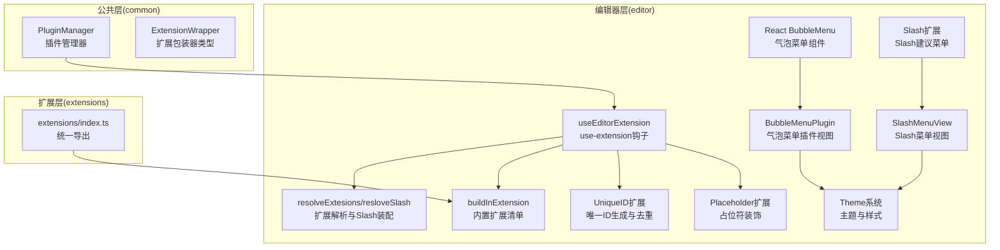
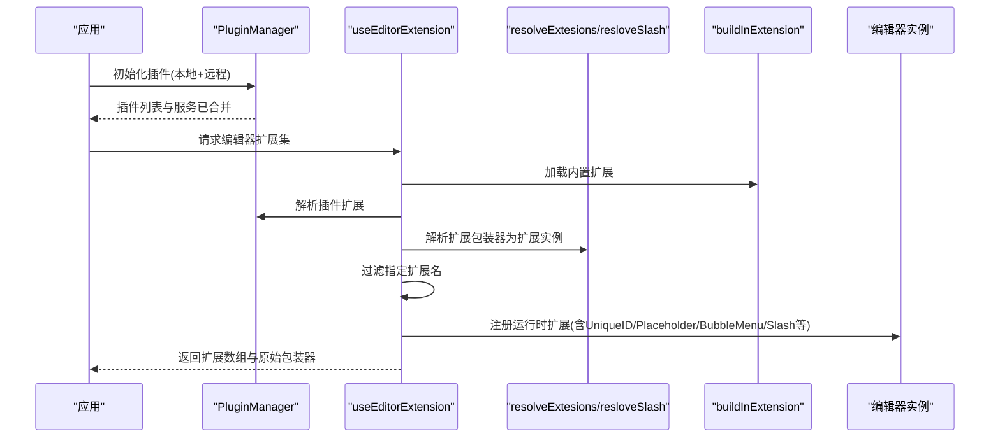
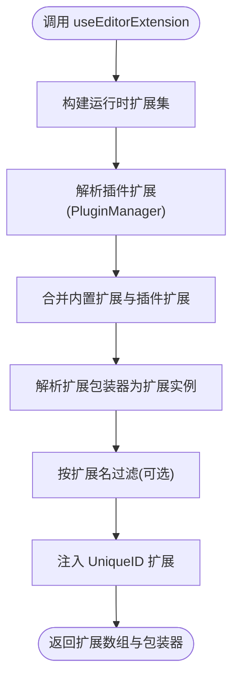
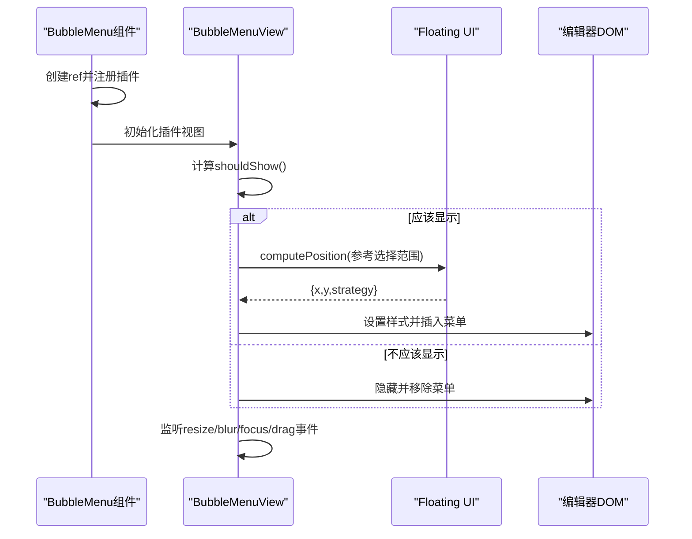
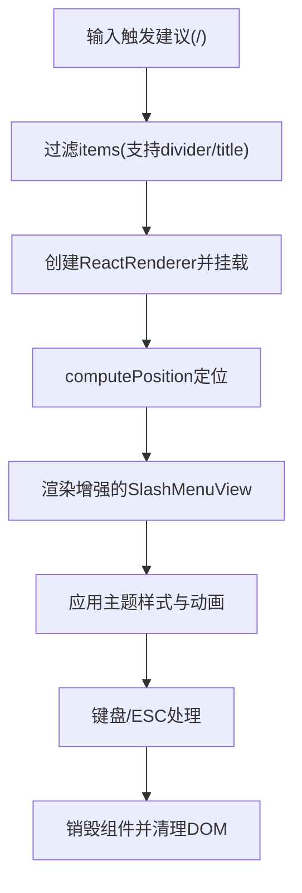
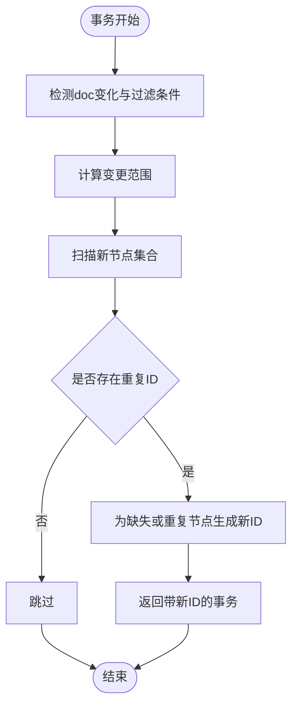
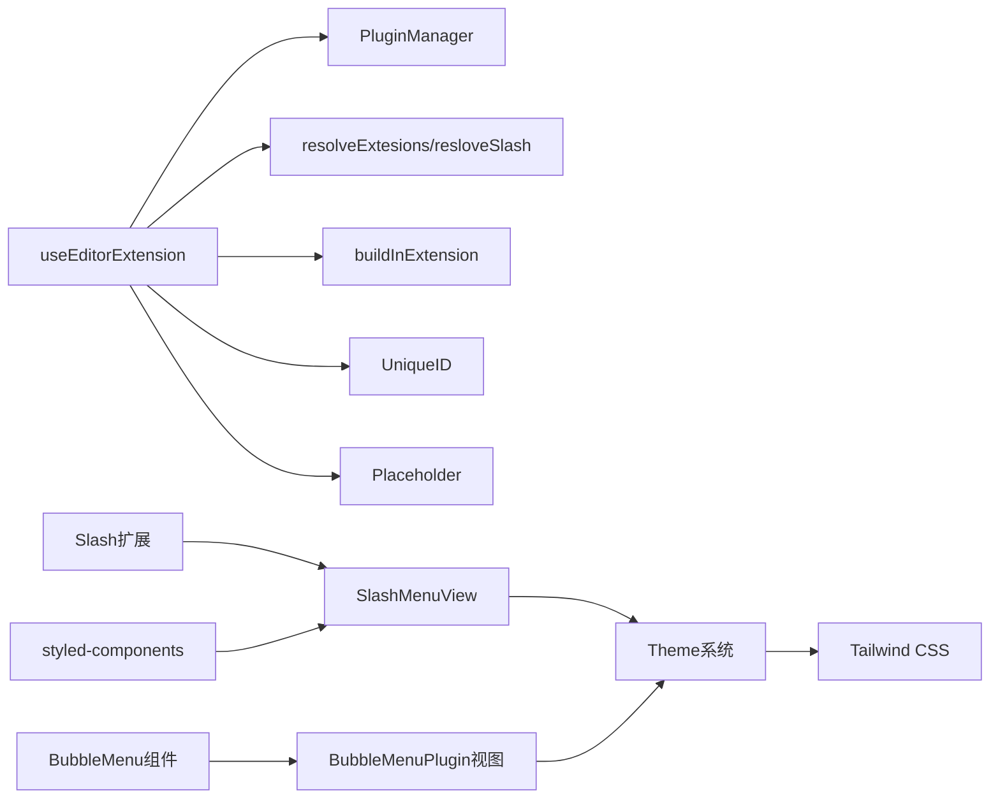

# 扩展系统架构

<cite>
**本文引用的文件**
- [packages/editor/src/editor/use-extension.ts](file://packages/editor/src/editor/use-extension.ts)
- [packages/editor/src/editor/kit.tsx](file://packages/editor/src/editor/kit.tsx)
- [packages/editor/src/editor/build-in-extension.ts](file://packages/editor/src/editor/build-in-extension.ts)
- [packages/common/src/core/PluginManager.ts](file://packages/common/src/core/PluginManager.ts)
- [packages/common/src/core/editor.ts](file://packages/common/src/core/editor.ts)
- [packages/editor/src/components/react-bubble-menu/index.tsx](file://packages/editor/src/components/react-bubble-menu/index.tsx)
- [packages/editor/src/components/react-bubble-menu/bubble-menu-pluin/bubble-menu-plugin.ts](file://packages/editor/src/components/react-bubble-menu/bubble-menu-pluin/bubble-menu-plugin.ts)
- [packages/editor/src/extensions/slash/slash.tsx](file://packages/editor/src/extensions/slash/slash.tsx)
- [packages/editor/src/extensions/slash/slash-menu-view.tsx](file://packages/editor/src/extensions/slash/slash-menu-view.tsx)
- [packages/editor/src/extensions/unique-id/unique-id.ts](file://packages/editor/src/extensions/unique-id/unique-id.ts)
- [packages/editor/src/extensions/placeholder/placeholder.ts](file://packages/editor/src/extensions/placeholder/placeholder.ts)
- [packages/editor/src/extensions/index.ts](file://packages/editor/src/extensions/index.ts)
- [packages/editor/src/styles/editor.css](file://packages/editor/src/styles/editor.css)
- [packages/editor/src/styles/theme.ts](file://packages/editor/src/styles/theme.ts)
- [packages/ui/globals.css](file://packages/ui/globals.css)
</cite>

## 更新摘要
**变更内容**
- 更新Slash菜单视图的视觉增强部分，包括容器尺寸、自定义滚动条、字体排版和悬停动画效果
- 新增主题系统和Tailwind CSS变量的使用说明
- 增强视觉设计和用户体验相关的内容

## 目录
1. [引言](#引言)
2. [项目结构](#项目结构)
3. [核心组件](#核心组件)
4. [架构总览](#架构总览)
5. [详细组件分析](#详细组件分析)
6. [依赖分析](#依赖分析)
7. [性能考虑](#性能考虑)
8. [故障排查指南](#故障排查指南)
9. [结论](#结论)
10. [附录：扩展开发指南](#附录扩展开发指南)

## 引言
本文件面向编辑器扩展系统的架构与实现，围绕以下目标展开：
- 解释扩展系统的整体设计，包括扩展生命周期管理与动态加载机制
- 深入说明 use-extension 钩子的实现原理，以及如何在运行时动态添加、移除与配置扩展
- 阐述气泡菜单（Bubble Menu）扩展的实现，包括菜单定位算法与交互逻辑
- 解释扩展之间的依赖关系与优先级管理
- 描述扩展的配置验证与错误处理机制
- 提供扩展开发指南，包括自定义扩展的创建步骤、测试方法与调试技巧
- 总结扩展性能监控与内存泄漏防护的最佳实践

## 项目结构
编辑器扩展系统主要由以下层次构成：
- 公共层（common）：提供插件模型、扩展包装器类型与插件管理器等基础能力
- 编辑器层（editor）：提供扩展集合、动态装配工具、use-extension 钩子、内置扩展清单与 UI 组件（如气泡菜单）
- 扩展层（extensions）：按功能拆分的扩展模块，统一通过包装器导出，支持菜单、Slash 建议、唯一 ID 等能力

```mermaid
graph TB
subgraph "公共层(common)"
PM["PluginManager<br/>插件管理器"]
EW["ExtensionWrapper<br/>扩展包装器类型"]
end
subgraph "编辑器层(editor)"
UE["useEditorExtension<br/>use-extension钩子"]
KIT["resolveExtesions/resloveSlash<br/>扩展解析与Slash装配"]
BI["buildInExtension<br/>内置扩展清单"]
BM["React BubbleMenu<br/>气泡菜单组件"]
BMP["BubbleMenuPlugin<br/>气泡菜单插件视图"]
SL["Slash扩展<br/>Slash建议菜单"]
SLMV["SlashMenuView<br/>Slash菜单视图"]
UID["UniqueID扩展<br/>唯一ID生成与去重"]
PH["Placeholder扩展<br/>占位符装饰"]
THEME["Theme系统<br/>主题与样式"]
end
subgraph "扩展层(extensions)"
EXIDX["extensions/index.ts<br/>统一导出"]
end
PM --> UE
UE --> KIT
UE --> BI
UE --> UID
UE --> PH
BM --> BMP
SL --> SLMV
SLMV --> THEME
BMP --> THEME
EXIDX --> BI
```

**图表来源**
- [packages/common/src/core/PluginManager.ts](file://packages/common/src/core/PluginManager.ts#L63-L170)
- [packages/common/src/core/editor.ts](file://packages/common/src/core/editor.ts#L1-L31)
- [packages/editor/src/editor/use-extension.ts](file://packages/editor/src/editor/use-extension.ts#L20-L63)
- [packages/editor/src/editor/kit.tsx](file://packages/editor/src/editor/kit.tsx#L18-L87)
- [packages/editor/src/editor/build-in-extension.ts](file://packages/editor/src/editor/build-in-extension.ts#L1-L56)
- [packages/editor/src/components/react-bubble-menu/index.tsx](file://packages/editor/src/components/react-bubble-menu/index.tsx#L1-L61)
- [packages/editor/src/components/react-bubble-menu/bubble-menu-pluin/bubble-menu-plugin.ts](file://packages/editor/src/components/react-bubble-menu/bubble-menu-pluin/bubble-menu-plugin.ts#L515-L520)
- [packages/editor/src/extensions/slash/slash.tsx](file://packages/editor/src/extensions/slash/slash.tsx#L41-L192)
- [packages/editor/src/extensions/slash/slash-menu-view.tsx](file://packages/editor/src/extensions/slash/slash-menu-view.tsx#L24-L131)
- [packages/editor/src/extensions/unique-id/unique-id.ts](file://packages/editor/src/extensions/unique-id/unique-id.ts#L1-L259)
- [packages/editor/src/extensions/placeholder/placeholder.ts](file://packages/editor/src/extensions/placeholder/placeholder.ts#L1-L100)
- [packages/editor/src/extensions/index.ts](file://packages/editor/src/extensions/index.ts#L1-L64)

**章节来源**
- [packages/editor/src/editor/use-extension.ts](file://packages/editor/src/editor/use-extension.ts#L20-L63)
- [packages/editor/src/editor/kit.tsx](file://packages/editor/src/editor/kit.tsx#L18-L87)
- [packages/editor/src/editor/build-in-extension.ts](file://packages/editor/src/editor/build-in-extension.ts#L1-L56)
- [packages/common/src/core/PluginManager.ts](file://packages/common/src/core/PluginManager.ts#L63-L170)
- [packages/common/src/core/editor.ts](file://packages/common/src/core/editor.ts#L1-L31)
- [packages/editor/src/extensions/index.ts](file://packages/editor/src/extensions/index.ts#L1-L64)

## 核心组件
- 插件管理器（PluginManager）
  - 负责插件初始化、远程插件动态加载、卸载与服务合并
  - 提供路由、菜单、国际化与编辑器扩展的解析接口
- 扩展包装器（ExtensionWrapper）
  - 统一扩展声明格式，支持扩展主体、名称、菜单配置、Slash 配置、浮动菜单组件等
- use-extension 钩子（useEditorExtension）
  - 将内置扩展与插件扩展进行解析与合并，注入运行时扩展集与 UniqueID 等基础扩展
- 扩展解析工具（resolveExtesions/resloveSlash）
  - 将扩展包装器转换为 ProseMirror/Tiptap 可用的扩展实例，并装配 Slash 建议菜单
- 内置扩展清单（buildInExtension）
  - 收敛所有内置扩展，作为默认扩展集参与装配
- 气泡菜单（BubbleMenu）
  - React 包装组件，负责注册/注销插件、挂载/卸载 DOM、延迟更新与定位计算
- Slash 扩展与菜单视图
  - 基于 @tiptap/suggestion 的命令式建议菜单，支持过滤、渲染与位置计算
  - **新增**：经过视觉增强的菜单视图，包含容器尺寸调整、自定义滚动条、改进的字体排版和悬停动画效果
- UniqueID 扩展
  - 为指定节点类型生成唯一属性，处理事务合并、粘贴与拖拽场景下的重复性问题
- Placeholder 扩展
  - 通过 ProseMirror 插件为空节点或编辑器添加占位符装饰
- 主题系统（Theme System）
  - **新增**：基于Tailwind CSS变量和HSL颜色系统的主题适配，支持明暗主题切换
  - **新增**：Slash菜单的视觉样式集成到主题系统中

**章节来源**
- [packages/common/src/core/PluginManager.ts](file://packages/common/src/core/PluginManager.ts#L63-L170)
- [packages/common/src/core/editor.ts](file://packages/common/src/core/editor.ts#L1-L31)
- [packages/editor/src/editor/use-extension.ts](file://packages/editor/src/editor/use-extension.ts#L20-L63)
- [packages/editor/src/editor/kit.tsx](file://packages/editor/src/editor/kit.tsx#L23-L49)
- [packages/editor/src/editor/build-in-extension.ts](file://packages/editor/src/editor/build-in-extension.ts#L1-L56)
- [packages/editor/src/components/react-bubble-menu/index.tsx](file://packages/editor/src/components/react-bubble-menu/index.tsx#L1-L61)
- [packages/editor/src/extensions/slash/slash.tsx](file://packages/editor/src/extensions/slash/slash.tsx#L41-L192)
- [packages/editor/src/extensions/slash/slash-menu-view.tsx](file://packages/editor/src/extensions/slash/slash-menu-view.tsx#L24-L131)
- [packages/editor/src/extensions/unique-id/unique-id.ts](file://packages/editor/src/extensions/unique-id/unique-id.ts#L1-L259)
- [packages/editor/src/extensions/placeholder/placeholder.ts](file://packages/editor/src/extensions/placeholder/placeholder.ts#L1-L100)
- [packages/editor/src/styles/theme.ts](file://packages/editor/src/styles/theme.ts#L1-L92)
- [packages/ui/globals.css](file://packages/ui/globals.css#L1-L140)

## 架构总览
下图展示从"插件管理器"到"编辑器扩展装配"的端到端流程，以及"气泡菜单"与"Slash 菜单"的运行时交互。

```mermaid
sequenceDiagram
participant App as "应用"
participant PM as "PluginManager"
participant UE as "useEditorExtension"
participant KIT as "resolveExtesions/resloveSlash"
participant BI as "buildInExtension"
participant ED as "编辑器实例"
App->>PM : 初始化插件(本地+远程)
PM-->>App : 插件列表与服务已合并
App->>UE : 请求编辑器扩展集
UE->>BI : 加载内置扩展
UE->>PM : 解析插件扩展
UE->>KIT : 解析扩展包装器为扩展实例
UE->>UE : 过滤指定扩展名
UE->>ED : 注册运行时扩展(含UniqueID/Placeholder/BubbleMenu/Slash等)
UE-->>App : 返回扩展数组与原始包装器
```

**图表来源**
- [packages/common/src/core/PluginManager.ts](file://packages/common/src/core/PluginManager.ts#L78-L112)
- [packages/editor/src/editor/use-extension.ts](file://packages/editor/src/editor/use-extension.ts#L47-L63)
- [packages/editor/src/editor/kit.tsx](file://packages/editor/src/editor/kit.tsx#L23-L49)
- [packages/editor/src/editor/build-in-extension.ts](file://packages/editor/src/editor/build-in-extension.ts#L1-L56)

## 详细组件分析

### use-extension 钩子实现原理
- 输入输出
  - 输入：可选的排除扩展名与标题模式开关
  - 输出：编辑器扩展数组与原始扩展包装器数组
- 关键步骤
  - 构建运行时扩展集（文档根、段落、文本、撤销/重做、占位符、尾随节点、性能插桩、气泡菜单等）
  - 从插件管理器解析插件扩展并合并到内置扩展
  - 对扩展进行解析（扁平化数组/对象）、装配 Slash 建议菜单
  - 过滤指定扩展名后追加 UniqueID 扩展（基于当前扩展类型列表）
- 生命周期与动态性
  - 通过上下文中的插件管理器在运行时动态解析插件扩展
  - 可根据传入参数临时移除某个扩展，便于调试或按需裁剪

```mermaid
flowchart TD
Start(["调用 useEditorExtension"]) --> BuildRT["构建运行时扩展集"]
BuildRT --> ResolvePM["解析插件扩展(PluginManager)"]
ResolvePM --> Merge["合并内置扩展与插件扩展"]
Merge --> ParseExt["解析扩展包装器为扩展实例"]
ParseExt --> Filter["按扩展名过滤(可选)"]
Filter --> AddUID["注入 UniqueID 扩展"]
AddUID --> Return(["返回扩展数组与包装器"])
```

**图表来源**
- [packages/editor/src/editor/use-extension.ts](file://packages/editor/src/editor/use-extension.ts#L20-L63)
- [packages/editor/src/editor/kit.tsx](file://packages/editor/src/editor/kit.tsx#L23-L49)
- [packages/common/src/core/PluginManager.ts](file://packages/common/src/core/PluginManager.ts#L146-L154)

**章节来源**
- [packages/editor/src/editor/use-extension.ts](file://packages/editor/src/editor/use-extension.ts#L20-L63)

### 气泡菜单（Bubble Menu）实现
- React 包装组件职责
  - 在挂载时创建并注册 BubbleMenuPlugin，卸载时注销插件
  - 通过 ref 获取容器元素，设置初始样式（隐藏），等待插件视图更新定位
- 插件视图（BubbleMenuView）核心逻辑
  - 显示条件：编辑器有焦点且非空选择、非纯文本空块、可编辑状态
  - 定位算法：使用 Floating UI 计算位置，支持偏移、翻转、移动、尺寸、自动放置、隐藏与内联等中间件
  - 更新策略：选择变化或文档变化时进行防抖更新；窗口 resize 使用独立防抖
  - 交互事件：mousedown 防止失焦隐藏；dragstart 隐藏；focus/blur 管理显示；destroy 清理事件与 DOM
- 与 Slash 菜单的对比
  - Slash 菜单基于 @tiptap/suggestion，采用 ReactRenderer 动态挂载并使用 computePosition 定位
  - 气泡菜单直接以 DOM 元素作为参考，更贴近编辑器原生插件模型

```mermaid
sequenceDiagram
participant Comp as "BubbleMenu组件"
participant View as "BubbleMenuView"
participant UI as "Floating UI"
participant DOM as "编辑器DOM"
Comp->>Comp : 创建ref并注册插件
Comp->>View : 初始化插件视图
View->>View : 计算shouldShow()
alt 应该显示
View->>UI : computePosition(参考选择范围)
UI-->>View : {x,y,strategy}
View->>DOM : 设置样式并插入菜单
else 不应该显示
View->>DOM : 隐藏并移除菜单
end
View->>View : 监听resize/blur/focus/drag事件
```

**图表来源**
- [packages/editor/src/components/react-bubble-menu/index.tsx](file://packages/editor/src/components/react-bubble-menu/index.tsx#L1-L61)
- [packages/editor/src/components/react-bubble-menu/bubble-menu-pluin/bubble-menu-plugin.ts](file://packages/editor/src/components/react-bubble-menu/bubble-menu-pluin/bubble-menu-plugin.ts#L136-L520)

**章节来源**
- [packages/editor/src/components/react-bubble-menu/index.tsx](file://packages/editor/src/components/react-bubble-menu/index.tsx#L1-L61)
- [packages/editor/src/components/react-bubble-menu/bubble-menu-pluin/bubble-menu-plugin.ts](file://packages/editor/src/components/react-bubble-menu/bubble-menu-pluin/bubble-menu-plugin.ts#L136-L520)

### Slash 建议菜单与视觉增强
- 装配方式
  - 通过扩展包装器的 slashConfig 聚合项，使用 createSlash 装配建议菜单
  - 命令执行时删除前缀并调用扩展提供的 action
- 交互与定位
  - 基于 posToDOMRect 获取参考矩形，结合 Floating UI flip 中间件进行右起定位
  - 销毁时移除 DOM 并释放资源
- **视觉增强特性**（新增）
  - **容器尺寸**：固定宽度320px，最大高度420px，提供一致的视觉体验
  - **自定义滚动条**：使用CSS伪元素实现细滚动条（6px宽），支持悬停高亮效果
  - **字体排版**：使用改进的字体大小和行高（14px字体，1.4行高），提升可读性
  - **悬停动画**：使用cubic-bezier(0.4, 0, 0.2, 1)缓动函数，提供流畅的200ms过渡效果
  - **主题适配**：集成Tailwind CSS变量（hsl(var(--primary)/0.12)），支持明暗主题切换
  - **图标缩放**：选中状态下图标放大110%，添加阴影效果，突出当前选择
  - **分割线样式**：使用11px字体，大写转换，0.5px字母间距，提升分组清晰度

```mermaid
flowchart TD
Query["输入触发建议(/)"] --> Items["过滤items(支持divider/title)"]
Items --> Render["创建ReactRenderer并挂载"]
Render --> Pos["computePosition定位"]
Pos --> Menu["渲染增强的SlashMenuView"]
Menu --> Style["应用主题样式与动画"]
Style --> Interact["键盘/ESC处理"]
Interact --> Exit["销毁组件并清理DOM"]
```

**图表来源**
- [packages/editor/src/extensions/slash/slash.tsx](file://packages/editor/src/extensions/slash/slash.tsx#L41-L192)
- [packages/editor/src/extensions/slash/slash-menu-view.tsx](file://packages/editor/src/extensions/slash/slash-menu-view.tsx#L24-L131)
- [packages/editor/src/editor/kit.tsx](file://packages/editor/src/editor/kit.tsx#L36-L49)

**章节来源**
- [packages/editor/src/extensions/slash/slash.tsx](file://packages/editor/src/extensions/slash/slash.tsx#L41-L192)
- [packages/editor/src/extensions/slash/slash-menu-view.tsx](file://packages/editor/src/extensions/slash/slash-menu-view.tsx#L24-L131)
- [packages/editor/src/editor/kit.tsx](file://packages/editor/src/editor/kit.tsx#L36-L49)

### UniqueID 扩展与事务去重
- 设计要点
  - 在 onCreate 与 appendTransaction 中对指定类型的节点进行唯一 ID 补齐与去重
  - 结合事务映射与变更范围，避免重复生成与覆盖
  - 处理拖拽与粘贴场景，确保新内容拥有新 ID
- 与编辑器协作
  - 通过全局属性注入 data-* 属性，便于查询与调试
  - 与协作编辑的变更来源过滤配合，避免外部变更引发的 ID 冲突

```mermaid
flowchart TD
Start(["事务开始"]) --> Detect["检测doc变化与过滤条件"]
Detect --> Range["计算变更范围"]
Range --> Scan["扫描新节点集合"]
Scan --> Dup{"是否存在重复ID"}
Dup --> |是| Gen["为缺失或重复节点生成新ID"]
Dup --> |否| Skip["跳过"]
Gen --> Dispatch["返回带新ID的事务"]
Skip --> End(["结束"])
Dispatch --> End
```

**图表来源**
- [packages/editor/src/extensions/unique-id/unique-id.ts](file://packages/editor/src/extensions/unique-id/unique-id.ts#L77-L256)

**章节来源**
- [packages/editor/src/extensions/unique-id/unique-id.ts](file://packages/editor/src/extensions/unique-id/unique-id.ts#L1-L259)

### Placeholder 扩展与装饰
- 实现机制
  - 通过 ProseMirror 插件在 decorations 中为空节点添加占位符类与数据属性
  - 支持仅当前节点、可 editable 状态、最大内容大小等选项
- 与气泡菜单的关系
  - 占位符不影响气泡菜单显示逻辑，但会影响 shouldShow 的判断（例如编辑器为空时）

**章节来源**
- [packages/editor/src/extensions/placeholder/placeholder.ts](file://packages/editor/src/extensions/placeholder/placeholder.ts#L1-L100)

### 主题系统与视觉设计
- **新增**：基于Tailwind CSS变量的颜色系统
  - 使用hsl(var(--primary)/0.12)等变量，支持明暗主题自动切换
  - 集成到Slash菜单的背景色、边框色和文本色
- **新增**：Slash菜单的视觉样式
  - 容器：p-2内边距，rounded-xl圆角，backdrop-blur-sm模糊效果
  - 边框：border border-border/60半透明边框
  - 阴影：shadow-xl明亮阴影，dark:shadow-2xl深色阴影
  - 背景：bg-popover，text-popover-foreground
- **新增**：主题变量定义
  - 定义primary、muted、accent等颜色变量
  - 支持slashMenu相关的颜色配置
  - 与UI库的Tailwind变量保持一致

**章节来源**
- [packages/editor/src/styles/theme.ts](file://packages/editor/src/styles/theme.ts#L1-L92)
- [packages/editor/src/styles/editor.css](file://packages/editor/src/styles/editor.css#L1-L166)
- [packages/ui/globals.css](file://packages/ui/globals.css#L1-L140)

## 依赖分析
- 组件耦合
  - useEditorExtension 依赖 PluginManager 与 buildInExtension，同时与 resolveExtesions/resloveSlash 紧密耦合
  - BubbleMenu 组件与 BubbleMenuPlugin 视图强绑定，事件与 DOM 生命周期由插件视图接管
  - UniqueID 与事务系统深度集成，依赖 ProseMirror 的事务与映射
  - **新增**：SlashMenuView 依赖主题系统和Tailwind CSS变量
- 外部依赖
  - Floating UI 用于气泡菜单与 Slash 菜单的定位
  - @tiptap/* 生态提供扩展、插件与建议菜单能力
  - lodash 用于服务与配置的合并
  - **新增**：styled-components 用于组件样式封装
  - **新增**：Tailwind CSS 用于主题变量和实用类

```mermaid
graph LR
UE["useEditorExtension"] --> PM["PluginManager"]
UE --> KIT["resolveExtesions/resloveSlash"]
UE --> BI["buildInExtension"]
UE --> UID["UniqueID"]
UE --> PH["Placeholder"]
BM["BubbleMenu组件"] --> BMP["BubbleMenuPlugin视图"]
SL["Slash扩展"] --> SLMV["SlashMenuView"]
SLMV --> THEME["Theme系统"]
BMP --> THEME
THEME --> TWCSS["Tailwind CSS"]
SC["styled-components"] --> SLMV
```

**图表来源**
- [packages/editor/src/editor/use-extension.ts](file://packages/editor/src/editor/use-extension.ts#L20-L63)
- [packages/editor/src/editor/kit.tsx](file://packages/editor/src/editor/kit.tsx#L23-L49)
- [packages/editor/src/components/react-bubble-menu/index.tsx](file://packages/editor/src/components/react-bubble-menu/index.tsx#L1-L61)
- [packages/editor/src/components/react-bubble-menu/bubble-menu-pluin/bubble-menu-plugin.ts](file://packages/editor/src/components/react-bubble-menu/bubble-menu-pluin/bubble-menu-plugin.ts#L515-L520)
- [packages/editor/src/extensions/slash/slash.tsx](file://packages/editor/src/extensions/slash/slash.tsx#L41-L192)
- [packages/editor/src/extensions/slash/slash-menu-view.tsx](file://packages/editor/src/extensions/slash/slash-menu-view.tsx#L24-L131)

**章节来源**
- [packages/editor/src/editor/use-extension.ts](file://packages/editor/src/editor/use-extension.ts#L20-L63)
- [packages/editor/src/editor/kit.tsx](file://packages/editor/src/editor/kit.tsx#L23-L49)
- [packages/editor/src/components/react-bubble-menu/index.tsx](file://packages/editor/src/components/react-bubble-menu/index.tsx#L1-L61)
- [packages/editor/src/components/react-bubble-menu/bubble-menu-pluin/bubble-menu-plugin.ts](file://packages/editor/src/components/react-bubble-menu/bubble-menu-pluin/bubble-menu-plugin.ts#L515-L520)
- [packages/editor/src/extensions/slash/slash.tsx](file://packages/editor/src/extensions/slash/slash.tsx#L41-L192)
- [packages/editor/src/extensions/slash/slash-menu-view.tsx](file://packages/editor/src/extensions/slash/slash-menu-view.tsx#L24-L131)

## 性能考虑
- 更新节流与防抖
  - 气泡菜单与 Slash 菜单均提供 updateDelay 与 resizeDelay，避免高频更新导致的性能问题
- 选择与文档变更检测
  - 仅在 selection 或 doc 发生变化时触发更新，composition 状态下跳过
- 定位中间件
  - 合理启用 flip/shift/size/autoPlacement/hide/inline 等中间件，减少溢出与重绘
- 事务批处理
  - UniqueID 在 appendTransaction 中合并多步事务，降低多次重排风险
- 资源清理
  - 插件视图 destroy 时移除事件监听与 DOM，防止内存泄漏
- **新增**：视觉增强的性能优化
  - 使用transform替代position变更，利用GPU加速
  - 优化CSS过渡效果，使用cubic-bezier缓动函数
  - 合理使用backdrop-blur，避免过度的视觉效果影响性能

**章节来源**
- [packages/editor/src/components/react-bubble-menu/bubble-menu-pluin/bubble-menu-plugin.ts](file://packages/editor/src/components/react-bubble-menu/bubble-menu-pluin/bubble-menu-plugin.ts#L286-L336)
- [packages/editor/src/components/react-bubble-menu/bubble-menu-pluin/bubble-menu-plugin.ts](file://packages/editor/src/components/react-bubble-menu/bubble-menu-pluin/bubble-menu-plugin.ts#L337-L390)
- [packages/editor/src/components/react-bubble-menu/bubble-menu-pluin/bubble-menu-plugin.ts](file://packages/editor/src/components/react-bubble-menu/bubble-menu-pluin/bubble-menu-plugin.ts#L424-L466)
- [packages/editor/src/components/react-bubble-menu/bubble-menu-pluin/bubble-menu-plugin.ts](file://packages/editor/src/components/react-bubble-menu/bubble-menu-pluin/bubble-menu-plugin.ts#L501-L513)
- [packages/editor/src/extensions/slash/slash.tsx](file://packages/editor/src/extensions/slash/slash.tsx#L100-L130)
- [packages/editor/src/extensions/unique-id/unique-id.ts](file://packages/editor/src/extensions/unique-id/unique-id.ts#L81-L161)

## 故障排查指南
- 气泡菜单不显示
  - 检查 shouldShow 条件：是否为空选择、是否可编辑、是否聚焦
  - 确认插件已正确注册与注销，组件卸载时是否调用 unregisterPlugin
- 定位异常
  - 检查 Floating UI 中间件配置与 getReferenceClientRect 回调
  - 窗口 resize 是否触发了防抖更新
- Slash 菜单无响应
  - 确认扩展包装器的 slashConfig 是否正确装配
  - 检查命令执行是否删除了前缀并调用了 action
- **新增**：Slash菜单视觉问题
  - 检查主题变量是否正确加载（hsl(var(--primary)/0.12)等）
  - 确认Tailwind CSS变量在全局样式中定义
  - 验证自定义滚动条样式是否生效
  - 检查transform过渡动画是否正常工作
- UniqueID 冲突
  - 检查 filterTransaction 与协作编辑来源过滤
  - 粘贴/拖拽后是否清除了旧 ID 并重新生成
- 插件动态安装/卸载无效
  - 确认 PluginManager 的 install/uninstall 是否触发了 REFRESH_PLUSINS 事件
  - useEditorExtension 是否重新解析并注入了新的扩展集

**章节来源**
- [packages/editor/src/components/react-bubble-menu/index.tsx](file://packages/editor/src/components/react-bubble-menu/index.tsx#L1-L61)
- [packages/editor/src/components/react-bubble-menu/bubble-menu-pluin/bubble-menu-plugin.ts](file://packages/editor/src/components/react-bubble-menu/bubble-menu-pluin/bubble-menu-plugin.ts#L174-L195)
- [packages/editor/src/components/react-bubble-menu/bubble-menu-pluin/bubble-menu-plugin.ts](file://packages/editor/src/components/react-bubble-menu/bubble-menu-pluin/bubble-menu-plugin.ts#L424-L466)
- [packages/editor/src/extensions/slash/slash.tsx](file://packages/editor/src/extensions/slash/slash.tsx#L60-L90)
- [packages/editor/src/extensions/unique-id/unique-id.ts](file://packages/editor/src/extensions/unique-id/unique-id.ts#L162-L256)
- [packages/common/src/core/PluginManager.ts](file://packages/common/src/core/PluginManager.ts#L99-L112)

## 结论
本扩展系统通过"插件管理器 + 扩展包装器 + use-extension 钩子"的组合，实现了扩展的统一声明、动态解析与运行时装配。气泡菜单与 Slash 菜单分别采用插件视图与 ReactRenderer 的方式，结合 Floating UI 实现稳定可靠的定位与交互。**最新的视觉增强**包括容器尺寸调整、自定义滚动条、改进的字体排版和悬停动画效果，显著提升了编辑器的交互体验。UniqueID 扩展通过事务级去重与粘贴/拖拽处理，保障了内容一致性。整体架构具备良好的扩展性、可维护性与性能表现。

## 附录：扩展开发指南
- 创建步骤
  - 定义扩展：遵循 @tiptap/core 的 Extension.create 或 Node.create
  - 包装导出：通过 ExtensionWrapper 暴露 name、extendsion 与菜单/Slash 配置
  - 注册到插件：在插件配置中提供 editorExtension 字段，指向扩展包装器
- 动态加载
  - 使用 PluginManager.init/ installPlugin 动态加载远程插件脚本
  - 确保插件导出的 KPlugin 实例被正确合并到插件列表
- 配置验证与错误处理
  - 在 useEditorExtension 中对扩展进行解析与过滤，避免重复或冲突
  - 对占位符、唯一 ID 等关键扩展进行边界检查（如内容大小、可编辑状态）
- **新增**：视觉设计最佳实践
  - 使用Tailwind CSS变量而非硬编码颜色值
  - 合理使用transform进行动画，避免影响布局性能
  - 为交互元素提供适当的过渡时间和缓动函数
  - 确保明暗主题的一致性，使用hsl(var(--variable))格式
  - 自定义滚动条时提供hover状态反馈
- 测试与调试
  - 利用 shouldShow/updateDelay/resizeDelay 参数进行行为验证
  - 通过 destroy 事件确认事件与 DOM 已清理，避免内存泄漏
  - **新增**：验证主题切换时的视觉效果一致性
- 性能监控与最佳实践
  - 合理设置 updateDelay/resizeDelay，避免频繁重排
  - 仅在必要时启用复杂中间件，减少计算开销
  - 对事务型扩展（如 UniqueID）进行批处理与范围扫描优化
  - **新增**：监控视觉效果的性能影响，避免过度的动画和模糊效果

**章节来源**
- [packages/common/src/core/PluginManager.ts](file://packages/common/src/core/PluginManager.ts#L78-L112)
- [packages/common/src/core/editor.ts](file://packages/common/src/core/editor.ts#L1-L31)
- [packages/editor/src/editor/use-extension.ts](file://packages/editor/src/editor/use-extension.ts#L20-L63)
- [packages/editor/src/components/react-bubble-menu/bubble-menu-pluin/bubble-menu-plugin.ts](file://packages/editor/src/components/react-bubble-menu/bubble-menu-pluin/bubble-menu-plugin.ts#L501-L513)
- [packages/editor/src/extensions/unique-id/unique-id.ts](file://packages/editor/src/extensions/unique-id/unique-id.ts#L81-L161)
- [packages/editor/src/styles/theme.ts](file://packages/editor/src/styles/theme.ts#L1-L92)
- [packages/ui/globals.css](file://packages/ui/globals.css#L1-L140)