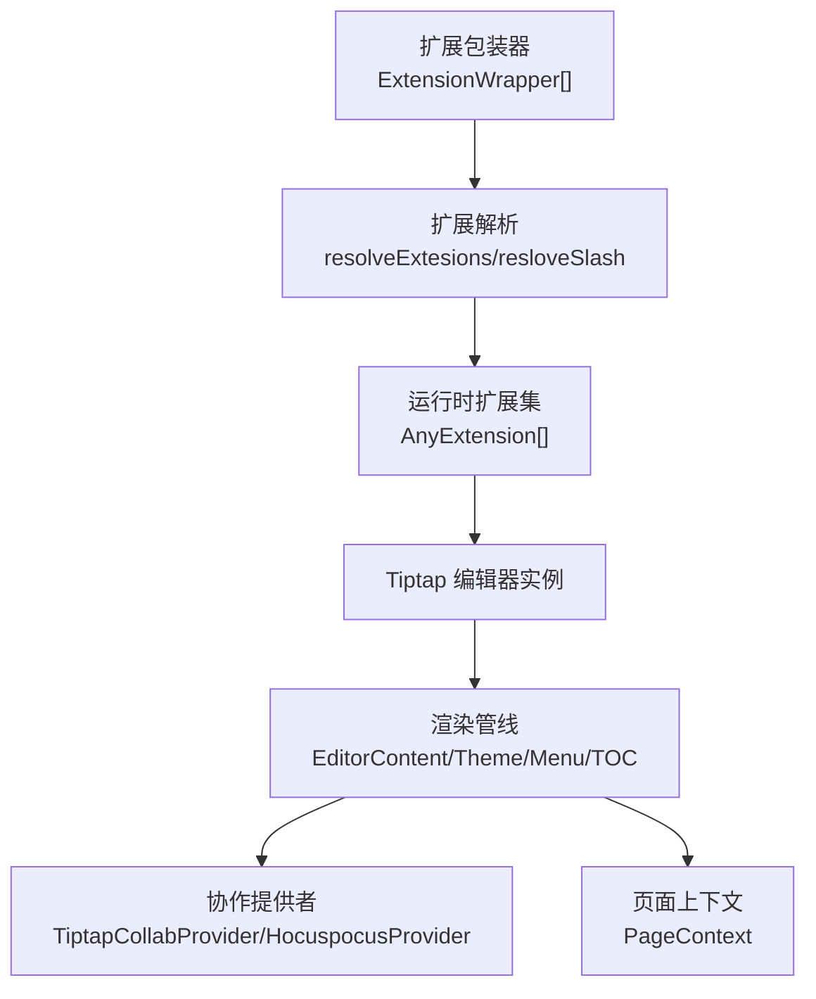
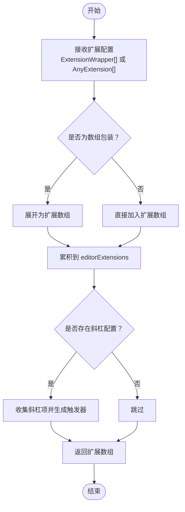
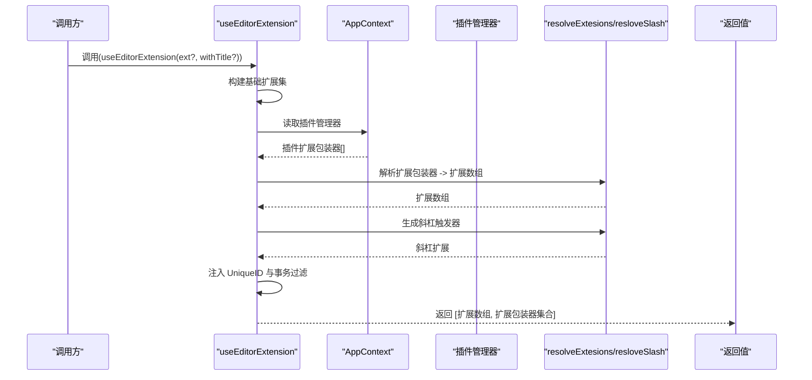
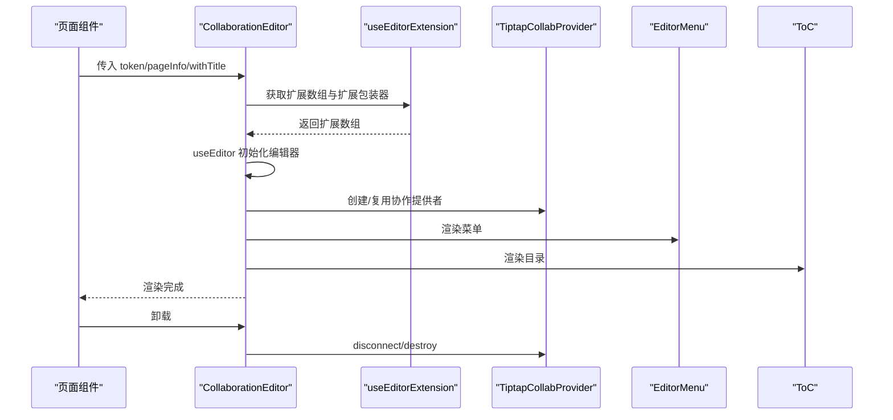
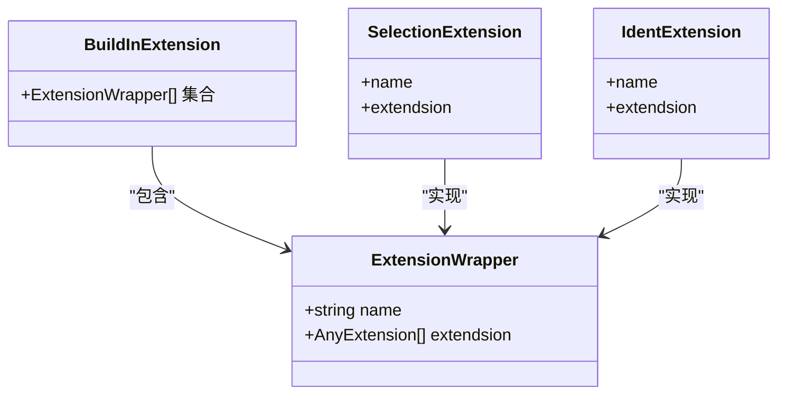
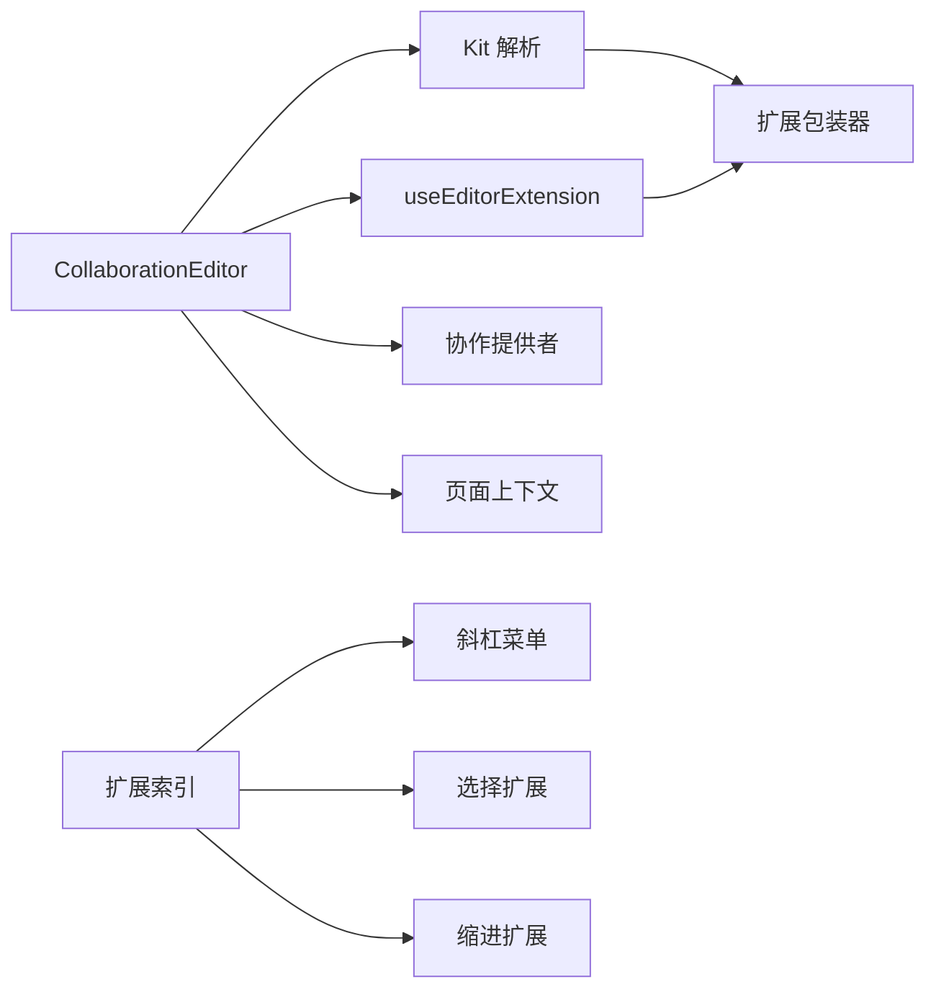

# 编辑器内核架构

<cite>
**本文引用的文件**
- [packages/editor/src/index.ts](file://packages/editor/src/index.ts)
- [packages/editor/src/editor/index.tsx](file://packages/editor/src/editor/index.tsx)
- [packages/editor/src/editor/kit.tsx](file://packages/editor/src/editor/kit.tsx)
- [packages/editor/src/editor/provider.ts](file://packages/editor/src/editor/provider.ts)
- [packages/editor/src/editor/context.tsx](file://packages/editor/src/editor/context.tsx)
- [packages/editor/src/editor/build-in-extension.ts](file://packages/editor/src/editor/build-in-extension.ts)
- [packages/editor/src/editor/use-extension.ts](file://packages/editor/src/editor/use-extension.ts)
- [packages/editor/src/editor/collaboration.tsx](file://packages/editor/src/editor/collaboration.tsx)
- [packages/editor/src/editor/render.tsx](file://packages/editor/src/editor/render.tsx)
- [packages/editor/src/editor/rewriteUnknowContent.ts](file://packages/editor/src/editor/rewriteUnknowContent.ts)
- [packages/editor/src/editor/ToC.tsx](file://packages/editor/src/editor/ToC.tsx)
- [packages/editor/src/editor/EditorMenu.tsx](file://packages/editor/src/editor/EditorMenu.tsx)
- [packages/editor/src/components/editor-wrapper.tsx](file://packages/editor/src/components/editor-wrapper.tsx)
- [packages/editor/src/components/bubble-menu.tsx](file://packages/editor/src/components/bubble-menu.tsx)
- [packages/editor/src/extensions/index.ts](file://packages/editor/src/extensions/index.ts)
- [packages/editor/src/extensions/slash/index.ts](file://packages/editor/src/extensions/slash/index.ts)
- [packages/editor/src/extensions/selection/index.tsx](file://packages/editor/src/extensions/selection/index.tsx)
- [packages/editor/src/extensions/ident/index.tsx](file://packages/editor/src/extensions/ident/index.tsx)
- [packages/editor/src/extensions/sync-block/SyncBlock.tsx](file://packages/editor/src/extensions/sync-block/SyncBlock.tsx)
- [packages/common/src/core/types.ts](file://packages/common/src/core/types.ts)
- [packages/plugin-main/src/pages/Journals/JournalEditor/index.tsx](file://packages/plugin-main/src/pages/Journals/JournalEditor/index.tsx)
- [packages/plugin-main/src/pages/SpaceDetail/PageEditor/index.tsx](file://packages/plugin-main/src/pages/SpaceDetail/PageEditor/index.tsx)
</cite>

## 目录
1. [引言](#引言)
2. [项目结构](#项目结构)
3. [核心组件](#核心组件)
4. [架构总览](#架构总览)
5. [详细组件分析](#详细组件分析)
6. [依赖关系分析](#依赖关系分析)
7. [性能考虑](#性能考虑)
8. [故障排查指南](#故障排查指南)
9. [结论](#结论)
10. [附录：扩展开发与集成指南](#附录扩展开发与集成指南)

## 引言
本文件面向知识库管理系统中的编辑器内核，系统性阐述基于 Tiptap 的编辑器框架集成方式、扩展体系与插件机制、编辑器 Kit 设计模式、上下文管理（状态提升、事件传播、配置传递）、扩展包装器 ExtensionWrapper 的作用与实现原理、编辑器提供者初始化与依赖注入流程，并给出扩展开发与第三方功能集成的实践指南及性能优化与内存管理最佳实践。

## 项目结构
编辑器内核位于 packages/editor，围绕“扩展体系 + 编辑器 Kit + 提供者 + 上下文”的分层组织：
- 入口导出：统一对外暴露编辑器能力与工具函数，便于上层应用按需引入。
- 编辑器内核：包含 Kit 解析扩展、构建内置扩展集合、协作渲染、上下文与菜单等。
- 扩展体系：以 ExtensionWrapper 为统一包装，聚合各类富文本能力（如标题、列表、表格、数学公式、图表示例等）。
- 组件层：编辑器容器、气泡菜单、TOC 等 UI 组合。
- 提供者与上下文：用户、文件、协作提供者接口与页面上下文。

```mermaid
graph TB
subgraph "入口与导出"
IDX["packages/editor/src/index.ts"]
end
subgraph "编辑器内核"
KIT["packages/editor/src/editor/kit.tsx"]
USEEXT["packages/editor/src/editor/use-extension.ts"]
BIL["packages/editor/src/editor/build-in-extension.ts"]
COLLAB["packages/editor/src/editor/collaboration.tsx"]
RENDER["packages/editor/src/editor/render.tsx"]
CTX["packages/editor/src/editor/context.tsx"]
PROVIDER["packages/editor/src/editor/provider.ts"]
TOC["packages/editor/src/editor/ToC.tsx"]
MENU["packages/editor/src/editor/EditorMenu.tsx"]
end
subgraph "扩展体系"
EXTIDX["packages/editor/src/extensions/index.ts"]
SLASHIDX["packages/editor/src/extensions/slash/index.ts"]
SELIDX["packages/editor/src/extensions/selection/index.tsx"]
IDNTIDX["packages/editor/src/extensions/ident/index.tsx"]
end
subgraph "组件层"
WRAP["packages/editor/src/components/editor-wrapper.tsx"]
BMENU["packages/editor/src/components/bubble-menu.tsx"]
end
subgraph "通用类型"
COMMON["packages/common/src/core/types.ts"]
end
IDX --> KIT
IDX --> USEEXT
IDX --> BIL
IDX --> COLLAB
IDX --> RENDER
IDX --> CTX
IDX --> PROVIDER
IDX --> TOC
IDX --> MENU
IDX --> EXTIDX
IDX --> WRAP
IDX --> BMENU
KIT --> BIL
USEEXT --> BIL
USEEXT --> COMMON
COLLAB --> RENDER
COLLAB --> CTX
COLLAB --> PROVIDER
COLLAB --> TOC
COLLAB --> MENU
EXTIDX --> SLASHIDX
EXTIDX --> SELIDX
EXTIDX --> IDNTIDX
```

图表来源
- [packages/editor/src/index.ts](file://packages/editor/src/index.ts#L1-L23)
- [packages/editor/src/editor/kit.tsx](file://packages/editor/src/editor/kit.tsx#L1-L87)
- [packages/editor/src/editor/use-extension.ts](file://packages/editor/src/editor/use-extension.ts#L1-L63)
- [packages/editor/src/editor/build-in-extension.ts](file://packages/editor/src/editor/build-in-extension.ts#L1-L56)
- [packages/editor/src/editor/collaboration.tsx](file://packages/editor/src/editor/collaboration.tsx#L1-L141)
- [packages/editor/src/editor/render.tsx](file://packages/editor/src/editor/render.tsx)
- [packages/editor/src/editor/context.tsx](file://packages/editor/src/editor/context.tsx#L1-L14)
- [packages/editor/src/editor/provider.ts](file://packages/editor/src/editor/provider.ts#L1-L53)
- [packages/editor/src/editor/ToC.tsx](file://packages/editor/src/editor/ToC.tsx)
- [packages/editor/src/editor/EditorMenu.tsx](file://packages/editor/src/editor/EditorMenu.tsx)
- [packages/editor/src/extensions/index.ts](file://packages/editor/src/extensions/index.ts#L1-L64)
- [packages/editor/src/extensions/slash/index.ts](file://packages/editor/src/extensions/slash/index.ts#L1-L3)
- [packages/editor/src/extensions/selection/index.tsx](file://packages/editor/src/extensions/selection/index.tsx#L1-L8)
- [packages/editor/src/extensions/ident/index.tsx](file://packages/editor/src/extensions/ident/index.tsx#L1-L9)
- [packages/editor/src/components/editor-wrapper.tsx](file://packages/editor/src/components/editor-wrapper.tsx#L1-L18)
- [packages/editor/src/components/bubble-menu.tsx](file://packages/editor/src/components/bubble-menu.tsx#L1-L84)
- [packages/common/src/core/types.ts](file://packages/common/src/core/types.ts#L1-L4)

章节来源
- [packages/editor/src/index.ts](file://packages/editor/src/index.ts#L1-L23)
- [packages/editor/src/editor/index.tsx](file://packages/editor/src/editor/index.tsx#L1-L7)

## 核心组件
- 编辑器 Kit 与扩展解析
  - resolveExtesions：将 ExtensionWrapper[] 展开为 Tiptap 扩展数组。
  - resloveSlash：从扩展配置中收集斜杠菜单项并生成斜杠触发器。
  - resolveEditorKit：组装运行时扩展集，合并内置扩展、外部扩展与动态扩展配置。
- 内置扩展集合
  - buildInExtension：集中导出所有内置扩展包装器，形成默认能力集。
- 扩展装配钩子
  - useEditorExtension：在运行时根据上下文与插件管理器装配扩展，支持过滤与唯一 ID 配置。
- 协作渲染与提供者
  - CollaborationEditor：封装协作渲染、菜单、目录、主题与上下文，负责生命周期与销毁。
  - Provider 接口：抽象用户、文件与协作提供者，通过 editor.options.editorProps.editorProvider 注入。
- 上下文
  - PageContext：页面级上下文，用于跨组件传递空间、页面与标题等信息。
- 组件层
  - EditorWrapper：编辑器容器包装，承载样式与布局。
  - BubbleMenu：对 Tiptap 气泡菜单的二次封装，增强拖拽场景下的可用性。

章节来源
- [packages/editor/src/editor/kit.tsx](file://packages/editor/src/editor/kit.tsx#L1-L87)
- [packages/editor/src/editor/build-in-extension.ts](file://packages/editor/src/editor/build-in-extension.ts#L1-L56)
- [packages/editor/src/editor/use-extension.ts](file://packages/editor/src/editor/use-extension.ts#L1-L63)
- [packages/editor/src/editor/collaboration.tsx](file://packages/editor/src/editor/collaboration.tsx#L1-L141)
- [packages/editor/src/editor/provider.ts](file://packages/editor/src/editor/provider.ts#L1-L53)
- [packages/editor/src/editor/context.tsx](file://packages/editor/src/editor/context.tsx#L1-L14)
- [packages/editor/src/components/editor-wrapper.tsx](file://packages/editor/src/components/editor-wrapper.tsx#L1-L18)
- [packages/editor/src/components/bubble-menu.tsx](file://packages/editor/src/components/bubble-menu.tsx#L1-L84)

## 架构总览
编辑器内核采用“扩展包装 + 动态装配 + 协作渲染”的三层架构：
- 扩展层：以 ExtensionWrapper 为统一接口，聚合内置与插件扩展，支持菜单、视图、行为等多形态能力。
- 装配层：Kit 与 useEditorExtension 负责将扩展包装器展开为 Tiptap 扩展实例，并注入斜杠菜单、唯一 ID、事务过滤等通用能力。
- 渲染层：CollaborationEditor 将扩展注入编辑器实例，挂载菜单、目录与主题，管理协作提供者与上下文，输出最终可交互的编辑器界面。

图表来源
- [packages/editor/src/editor/kit.tsx](file://packages/editor/src/editor/kit.tsx#L23-L87)
- [packages/editor/src/editor/use-extension.ts](file://packages/editor/src/editor/use-extension.ts#L20-L63)
- [packages/editor/src/editor/collaboration.tsx](file://packages/editor/src/editor/collaboration.tsx#L35-L137)
- [packages/editor/src/editor/provider.ts](file://packages/editor/src/editor/provider.ts#L24-L53)
- [packages/editor/src/editor/context.tsx](file://packages/editor/src/editor/context.tsx#L1-L14)

## 详细组件分析

### 编辑器 Kit 与扩展解析
- 设计要点
  - 使用 ExtensionWrapper 统一扩展声明，便于动态装配与菜单收集。
  - resolveExtesions 将包装器展开为扩展数组；resloveSlash 收集斜杠菜单项并生成触发器。
  - resolveEditorKit 在运行时拼装扩展集，确保内置扩展优先、可叠加外部扩展与动态扩展配置。
- 复杂度与性能
  - 展开与合并操作为线性复杂度 O(n)，其中 n 为扩展数量；斜杠收集同为 O(m)，m 为配置项数。
  - 建议避免重复展开与重复注入，减少不必要的渲染与重算。

图表来源
- [packages/editor/src/editor/kit.tsx](file://packages/editor/src/editor/kit.tsx#L23-L49)

章节来源
- [packages/editor/src/editor/kit.tsx](file://packages/editor/src/editor/kit.tsx#L1-L87)

### 扩展装配钩子 useEditorExtension
- 设计要点
  - 在运行时构建基础扩展集（文档、段落、文本、占位符、尾随节点、性能统计等），并注入气泡菜单。
  - 从 AppContext 中获取插件管理器，合并插件扩展，再统一解析为扩展数组。
  - 生成斜杠菜单触发器，并注入 UniqueID 以保证事务一致性。
  - 可选过滤指定扩展名称，避免冲突或重复。
- 生命周期与副作用
  - 通过上下文与插件管理器动态获取扩展，适合插件热加载场景。
  - 返回扩展数组与扩展包装器集合，便于菜单与工具栏联动。

图表来源
- [packages/editor/src/editor/use-extension.ts](file://packages/editor/src/editor/use-extension.ts#L20-L63)
- [packages/editor/src/editor/kit.tsx](file://packages/editor/src/editor/kit.tsx#L23-L49)
- [packages/common/src/core/types.ts](file://packages/common/src/core/types.ts#L1-L4)

章节来源
- [packages/editor/src/editor/use-extension.ts](file://packages/editor/src/editor/use-extension.ts#L1-L63)

### 协作渲染与提供者初始化
- 设计要点
  - CollaborationEditor 负责装配扩展、渲染编辑器内容、挂载菜单与目录、提供页面上下文与主题。
  - 通过 editorProps.editorProvider 注入用户、文件与协作提供者，支持多端协作与感知。
  - 生命周期内处理连接、断开与销毁，确保资源释放。
- 初始化流程
  - 读取扩展配置，构建编辑器实例。
  - 设置 editorProps.attributes 与可编辑属性，绑定菜单与目录。
  - 在卸载时断开协作连接并销毁提供者。

图表来源
- [packages/editor/src/editor/collaboration.tsx](file://packages/editor/src/editor/collaboration.tsx#L35-L137)
- [packages/editor/src/editor/provider.ts](file://packages/editor/src/editor/provider.ts#L24-L53)
- [packages/plugin-main/src/pages/Journals/JournalEditor/index.tsx](file://packages/plugin-main/src/pages/Journals/JournalEditor/index.tsx#L20-L54)
- [packages/plugin-main/src/pages/SpaceDetail/PageEditor/index.tsx](file://packages/plugin-main/src/pages/SpaceDetail/PageEditor/index.tsx#L133-L159)

章节来源
- [packages/editor/src/editor/collaboration.tsx](file://packages/editor/src/editor/collaboration.tsx#L1-L141)
- [packages/editor/src/editor/provider.ts](file://packages/editor/src/editor/provider.ts#L1-L53)
- [packages/plugin-main/src/pages/Journals/JournalEditor/index.tsx](file://packages/plugin-main/src/pages/Journals/JournalEditor/index.tsx#L20-L54)
- [packages/plugin-main/src/pages/SpaceDetail/PageEditor/index.tsx](file://packages/plugin-main/src/pages/SpaceDetail/PageEditor/index.tsx#L133-L159)

### 扩展包装器 ExtensionWrapper
- 作用与实现原理
  - 作为统一扩展声明载体，包含扩展名称与扩展实例（单个或数组），便于 Kit 与 useEditorExtension 进行批量展开与装配。
  - 内置扩展集合 buildInExtension 即由若干 ExtensionWrapper 组成，形成默认能力矩阵。
  - 示例：SelectionExtension、IdentExtension 等均以 ExtensionWrapper 形式导出，供装配使用。
- 与插件生态的衔接
  - 通过 AppContext 插件管理器提供的 resloveEditorExtension 方法，动态合并插件扩展，实现插件化扩展装配。

图表来源
- [packages/editor/src/editor/build-in-extension.ts](file://packages/editor/src/editor/build-in-extension.ts#L1-L56)
- [packages/editor/src/extensions/selection/index.tsx](file://packages/editor/src/extensions/selection/index.tsx#L1-L8)
- [packages/editor/src/extensions/ident/index.tsx](file://packages/editor/src/extensions/ident/index.tsx#L1-L9)
- [packages/editor/src/extensions/index.ts](file://packages/editor/src/extensions/index.ts#L1-L64)

章节来源
- [packages/editor/src/editor/build-in-extension.ts](file://packages/editor/src/editor/build-in-extension.ts#L1-L56)
- [packages/editor/src/extensions/selection/index.tsx](file://packages/editor/src/extensions/selection/index.tsx#L1-L8)
- [packages/editor/src/extensions/ident/index.tsx](file://packages/editor/src/extensions/ident/index.tsx#L1-L9)
- [packages/editor/src/extensions/index.ts](file://packages/editor/src/extensions/index.ts#L1-L64)

### 编辑器上下文管理
- 页面上下文 PageContext
  - 提供 spaceId、id、parentId、title、创建/更新人与时间等字段，贯穿编辑器各子组件。
  - 在 CollaborationEditor 中通过 React Context.Provider 注入，供菜单、目录与扩展视图使用。
- 状态提升与事件传播
  - 编辑器状态通过 useEditor 实例管理；菜单与目录通过 props 与上下文进行状态传播。
  - 协作提供者通过 editorProps.editorProvider 注入，实现用户列表、同步状态等事件的跨组件传播。
- 配置传递
  - 通过 editor.options.editorProps 传递 editorProvider、属性与回调，确保扩展与组件可访问全局配置。

章节来源
- [packages/editor/src/editor/context.tsx](file://packages/editor/src/editor/context.tsx#L1-L14)
- [packages/editor/src/editor/collaboration.tsx](file://packages/editor/src/editor/collaboration.tsx#L116-L137)
- [packages/editor/src/editor/provider.ts](file://packages/editor/src/editor/provider.ts#L24-L53)

### 同步块与嵌套编辑器
- 设计要点
  - SyncBlockView 作为节点视图，内部再次调用 useEditorExtension 生成子编辑器，结合独立的协作提供者实现块级同步。
  - 通过 PageContext 获取空间与页面信息，格式化块级协作键，确保隔离与一致性。
- 生命周期与资源管理
  - 子编辑器在挂载时创建提供者并监听同步状态；卸载时断开连接与销毁提供者，避免内存泄漏。

章节来源
- [packages/editor/src/extensions/sync-block/SyncBlock.tsx](file://packages/editor/src/extensions/sync-block/SyncBlock.tsx#L1-L87)

## 依赖关系分析
- 组件耦合与内聚
  - CollaborationEditor 对扩展装配、菜单、目录与提供者存在强依赖，但通过参数化与上下文解耦具体实现细节。
  - useEditorExtension 与 AppContext 耦合，便于插件生态扩展；Kit 与扩展包装器解耦，便于统一装配。
- 外部依赖与集成点
  - Tiptap 生态（@tiptap/react、@tiptap/core、@tiptap/pm）提供编辑器核心能力。
  - 协作提供者（@hocuspocus/provider）提供实时协作与感知。
  - UI 与主题（styled-components、@kn/ui）提供样式与主题支持。
- 循环依赖风险
  - 扩展包装器与装配逻辑通过统一接口解耦，未见循环依赖迹象；建议保持扩展包装器仅声明不引入装配逻辑。

图表来源
- [packages/editor/src/editor/kit.tsx](file://packages/editor/src/editor/kit.tsx#L23-L87)
- [packages/editor/src/editor/use-extension.ts](file://packages/editor/src/editor/use-extension.ts#L20-L63)
- [packages/editor/src/editor/collaboration.tsx](file://packages/editor/src/editor/collaboration.tsx#L35-L137)
- [packages/editor/src/extensions/index.ts](file://packages/editor/src/extensions/index.ts#L1-L64)
- [packages/editor/src/extensions/slash/index.ts](file://packages/editor/src/extensions/slash/index.ts#L1-L3)
- [packages/editor/src/extensions/selection/index.tsx](file://packages/editor/src/extensions/selection/index.tsx#L1-L8)
- [packages/editor/src/extensions/ident/index.tsx](file://packages/editor/src/extensions/ident/index.tsx#L1-L9)

章节来源
- [packages/editor/src/editor/kit.tsx](file://packages/editor/src/editor/kit.tsx#L1-L87)
- [packages/editor/src/editor/use-extension.ts](file://packages/editor/src/editor/use-extension.ts#L1-L63)
- [packages/editor/src/editor/collaboration.tsx](file://packages/editor/src/editor/collaboration.tsx#L1-L141)
- [packages/editor/src/extensions/index.ts](file://packages/editor/src/extensions/index.ts#L1-L64)

## 性能考虑
- 扩展装配优化
  - 避免重复解析与重复注入扩展，缓存 resolveExtesions 结果；仅在扩展配置变更时重建扩展数组。
  - 合理拆分扩展，按需启用，减少初始渲染负担。
- 渲染与主题
  - 使用 React.memo 化昂贵组件（如目录），减少重渲染。
  - 控制 editorProps.attributes 与类名，避免过度样式计算。
- 协作与网络
  - 在断开连接前清理提供者与观察者，防止内存泄漏。
  - 合理设置同步状态回调频率，避免频繁重绘。
- 事务与唯一 ID
  - 使用 UniqueID 与事务过滤减少无效重绘与冲突，提升协作稳定性。

## 故障排查指南
- 协作连接问题
  - 确认 provider 参数（baseUrl、name、token、document）正确；检查 onSynced 回调是否触发。
  - 卸载时务必调用 disconnect 与 destroy，避免后台连接占用。
- 扩展冲突
  - 若出现光标异常或渲染错位，检查扩展顺序与 UniqueID 配置；必要时过滤冲突扩展名称。
- 斜杠菜单无效
  - 确认 ExtensionWrapper 中存在 slashConfig，且 resloveSlash 已被装配到编辑器扩展数组。
- 气泡菜单显示异常
  - 拖拽场景下优先使用 NodeBubbleMenu；检查 shouldShow 条件与 getReferenceClientRect 计算。
- 上下文缺失
  - 确保在 CollaborationEditor 中已通过 PageContext.Provider 注入 pageInfo；否则扩展视图无法获取上下文。

章节来源
- [packages/editor/src/editor/collaboration.tsx](file://packages/editor/src/editor/collaboration.tsx#L93-L113)
- [packages/editor/src/editor/use-extension.ts](file://packages/editor/src/editor/use-extension.ts#L55-L63)
- [packages/editor/src/components/bubble-menu.tsx](file://packages/editor/src/components/bubble-menu.tsx#L38-L84)
- [packages/editor/src/editor/context.tsx](file://packages/editor/src/editor/context.tsx#L1-L14)

## 结论
本编辑器内核以 ExtensionWrapper 为统一接口，结合 Kit 与 useEditorExtension 实现了灵活的扩展装配与协作渲染；通过 Provider 与上下文实现配置与状态的贯通；通过组件层增强用户体验。整体架构具备良好的扩展性与可维护性，适合在知识库系统中承载丰富的富文本编辑与协作需求。

## 附录：扩展开发与集成指南
- 开发自定义扩展
  - 定义扩展：参考现有扩展（如 SelectionExtension、IdentExtension）以 ExtensionWrapper 形式导出，包含 name 与 extendsion 字段。
  - 菜单与视图：为扩展提供静态菜单、气泡菜单或节点视图，确保与编辑器上下文兼容。
  - 装配与发布：通过插件管理器的 resloveEditorExtension 暴露扩展包装器，使其参与 Kit 解析与装配。
- 集成第三方功能
  - 将第三方扩展封装为 ExtensionWrapper，确保其扩展实例可被 resolveExtesions 正确展开。
  - 如需斜杠菜单，提供 slashConfig 并由 resloveSlash 生成触发器。
  - 通过 editorProps.editorProvider 注入用户与文件提供者，实现第三方协作与资源管理。
- 最佳实践
  - 保持扩展职责单一，避免在同一扩展中混入过多功能。
  - 使用事务过滤与唯一 ID，减少冲突与无效重绘。
  - 对昂贵组件进行 memo 化，控制渲染范围。
  - 在卸载时清理提供者与观察者，保障内存安全。

章节来源
- [packages/editor/src/extensions/selection/index.tsx](file://packages/editor/src/extensions/selection/index.tsx#L1-L8)
- [packages/editor/src/extensions/ident/index.tsx](file://packages/editor/src/extensions/ident/index.tsx#L1-L9)
- [packages/editor/src/editor/kit.tsx](file://packages/editor/src/editor/kit.tsx#L23-L49)
- [packages/editor/src/editor/use-extension.ts](file://packages/editor/src/editor/use-extension.ts#L20-L63)
- [packages/editor/src/editor/provider.ts](file://packages/editor/src/editor/provider.ts#L24-L53)