# 编辑器内核架构

<cite>
**本文档引用的文件**
- [packages/editor/src/index.ts](file://packages/editor/src/index.ts)
- [packages/editor/src/editor/index.tsx](file://packages/editor/src/editor/index.tsx)
- [packages/editor/src/editor/kit.tsx](file://packages/editor/src/editor/kit.tsx)
- [packages/editor/src/editor/provider.ts](file://packages/editor/src/editor/provider.ts)
- [packages/editor/src/editor/context.tsx](file://packages/editor/src/editor/context.tsx)
- [packages/editor/src/editor/build-in-extension.ts](file://packages/editor/src/editor/build-in-extension.ts)
- [packages/editor/src/editor/use-extension.ts](file://packages/editor/src/editor/use-extension.ts)
- [packages/editor/src/editor/collaboration.tsx](file://packages/editor/src/editor/collaboration.tsx)
- [packages/editor/src/editor/render.tsx](file://packages/editor/src/editor/render.tsx)
- [packages/editor/src/editor/rewriteUnknowContent.ts](file://packages/editor/src/editor/rewriteUnknowContent.ts)
- [packages/editor/src/editor/ToC.tsx](file://packages/editor/src/editor/ToC.tsx)
- [packages/editor/src/editor/EditorMenu.tsx](file://packages/editor/src/editor/EditorMenu.tsx)
- [packages/editor/src/components/editor-wrapper.tsx](file://packages/editor/src/components/editor-wrapper.tsx)
- [packages/editor/src/components/bubble-menu.tsx](file://packages/editor/src/components/bubble-menu.tsx)
- [packages/editor/src/extensions/index.ts](file://packages/editor/src/extensions/index.ts)
- [packages/editor/src/extensions/slash/index.tsx](file://packages/editor/src/extensions/slash/index.tsx)
- [packages/editor/src/extensions/selection/index.tsx](file://packages/editor/src/extensions/selection/index.tsx)
- [packages/editor/src/extensions/ident/index.tsx](file://packages/editor/src/extensions/ident/index.tsx)
- [packages/editor/src/extensions/sync-block/SyncBlock.tsx](file://packages/editor/src/extensions/sync-block/SyncBlock.tsx)
- [packages/editor/src/extensions/unknown-node/UnknowNodeView.tsx](file://packages/editor/src/extensions/unknown-node/UnknowNodeView.tsx)
- [packages/editor/src/extensions/unknown-node/unknown-node.ts](file://packages/editor/src/extensions/unknown-node/unknown-node.ts)
- [packages/editor/src/extensions/unknown-node/index.tsx](file://packages/editor/src/extensions/unknown-node/index.tsx)
- [packages/common/src/core/types.ts](file://packages/common/src/core/types.ts)
- [packages/plugin-main/src/pages/Journals/JournalEditor/index.tsx](file://packages/plugin-main/src/pages/Journals/JournalEditor/index.tsx)
- [packages/plugin-main/src/pages/SpaceDetail/PageEditor/index.tsx](file://packages/plugin-main/src/pages/SpaceDetail/PageEditor/index.tsx)
- [packages/core/src/ai/AiInlineMenu.tsx](file://packages/core/src/ai/AiInlineMenu.tsx)
- [packages/core/src/ai/utils/use-stream-buffer.ts](file://packages/core/src/ai/utils/use-stream-buffer.ts)
- [packages/core/src/ai/use-agent-optimized.tsx](file://packages/core/src/ai/use-agent-optimized.tsx)
- [packages/core/src/ai/types.ts](file://packages/core/src/ai/types.ts)
- [packages/plugin-ai/src/ai/menu/chat-persistence.ts](file://packages/plugin-ai/src/ai/menu/chat-persistence.ts)
- [packages/plugin-ai/src/ai/menu/use-streaming-buffer.ts](file://packages/plugin-ai/src/ai/menu/use-streaming-buffer.ts)
- [packages/plugin-ai/src/ai/menu/Chat.tsx](file://packages/plugin-ai/src/ai/menu/Chat.tsx)
- [packages/plugin-ai/src/ai/menu/chat-types.ts](file://packages/plugin-ai/src/ai/menu/chat-types.ts)
- [packages/core/src/ai/ARCHITECTURE.md](file://packages/core/src/ai/ARCHITECTURE.md)
- [packages/core/src/ai/CHAT_HISTORY_SUPPORT.md](file://packages/core/src/ai/CHAT_HISTORY_SUPPORT.md)
</cite>

## 更新摘要
**所做更改**
- 新增UnknownNodeView组件的CSS类名分析，确认已从py-12更新为h-full的UI改进
- 新增未知节点扩展的详细架构分析，包括节点视图渲染和插件市场集成
- 新增AI内联菜单组件分析，包括虚拟选区高亮和浮动面板交互
- 新增流式缓冲管理组件，优化AI响应的渲染性能
- 新增AI代理优化架构，支持工具发现和技能管理
- 新增聊天持久化和历史消息管理机制
- 更新编辑器AI交互体验的整体架构设计

## 目录
1. [引言](#引言)
2. [项目结构](#项目结构)
3. [核心组件](#核心组件)
4. [架构总览](#架构总览)
5. [详细组件分析](#详细组件分析)
6. [未知节点扩展系统](#未知节点扩展系统)
7. [AI内联菜单系统](#ai内联菜单系统)
8. [流式缓冲管理](#流式缓冲管理)
9. [AI代理优化架构](#ai代理优化架构)
10. [聊天持久化与历史管理](#聊天持久化与历史管理)
11. [依赖关系分析](#依赖关系分析)
12. [性能考虑](#性能考虑)
13. [故障排查指南](#故障排查指南)
14. [结论](#结论)
15. [附录：扩展开发与集成指南](#附录扩展开发与集成指南)

## 引言
本文件面向知识库管理系统中的编辑器内核，系统性阐述基于 Tiptap 的编辑器框架集成方式、扩展体系与插件机制、编辑器 Kit 设计模式、上下文管理（状态提升、事件传播、配置传递）、扩展包装器 ExtensionWrapper 的作用与实现原理、编辑器提供者初始化与依赖注入流程，并给出扩展开发与第三方功能集成的实践指南及性能优化与内存管理最佳实践。

**更新** 本次更新重点增加了UnknownNodeView组件的CSS类名分析、未知节点扩展系统、AI内联菜单系统、流式缓冲管理、AI代理优化架构以及聊天持久化机制，全面优化编辑器的智能化水平和交互体验。

## 项目结构
编辑器内核位于 packages/editor，围绕"扩展体系 + 编辑器 Kit + 提供者 + 上下文"的分层组织，现已扩展为包含AI交互能力和未知节点处理的完整架构：
- 入口导出：统一对外暴露编辑器能力与工具函数，便于上层应用按需引入。
- 编辑器内核：包含 Kit 解析扩展、构建内置扩展集合、协作渲染、上下文与菜单等。
- 扩展体系：以 ExtensionWrapper 为统一包装，聚合各类富文本能力（如标题、列表、表格、数学公式、图表示例等）。
- 组件层：编辑器容器、气泡菜单、TOC 等 UI 组合。
- 提供者与上下文：用户、文件、协作提供者接口与页面上下文。
- 未知节点处理：专门处理插件缺失时的节点显示和市场集成。
- AI交互层：内联菜单、流式缓冲、代理优化、聊天持久化等AI增强功能。

```mermaid
graph TB
subgraph "入口与导出"
IDX["packages/editor/src/index.ts"]
end
subgraph "编辑器内核"
KIT["packages/editor/src/editor/kit.tsx"]
USEEXT["packages/editor/src/editor/use-extension.ts"]
BIL["packages/editor/src/editor/build-in-extension.ts"]
COLLAB["packages/editor/src/editor/collaboration.tsx"]
RENDER["packages/editor/src/editor/render.tsx"]
CTX["packages/editor/src/editor/context.tsx"]
PROVIDER["packages/editor/src/editor/provider.ts"]
TOC["packages/editor/src/editor/ToC.tsx"]
MENU["packages/editor/src/editor/EditorMenu.tsx"]
end
subgraph "扩展体系"
EXTIDX["packages/editor/src/extensions/index.ts"]
SLASHIDX["packages/editor/src/extensions/slash/index.tsx"]
SELIDX["packages/editor/src/extensions/selection/index.tsx"]
IDNTIDX["packages/editor/src/extensions/ident/index.tsx"]
UNKNOWNE["packages/editor/src/extensions/unknown-node/UnknowNodeView.tsx"]
end
subgraph "组件层"
WRAP["packages/editor/src/components/editor-wrapper.tsx"]
BMENU["packages/editor/src/components/bubble-menu.tsx"]
end
subgraph "AI交互层"
AIINLINE["packages/core/src/ai/AiInlineMenu.tsx"]
STREAMBUF["packages/core/src/ai/utils/use-stream-buffer.ts"]
AGENTOPT["packages/core/src/ai/use-agent-optimized.tsx"]
CHATPERSIST["packages/plugin-ai/src/ai/menu/chat-persistence.ts"]
CHATCOMP["packages/plugin-ai/src/ai/menu/Chat.tsx"]
end
subgraph "通用类型"
COMMON["packages/common/src/core/types.ts"]
AITYPE["packages/core/src/ai/types.ts"]
end
IDX --> KIT
IDX --> USEEXT
IDX --> BIL
IDX --> COLLAB
IDX --> RENDER
IDX --> CTX
IDX --> PROVIDER
IDX --> TOC
IDX --> MENU
IDX --> EXTIDX
IDX --> WRAP
IDX --> BMENU
KIT --> BIL
USEEXT --> BIL
USEEXT --> COMMON
COLLAB --> RENDER
COLLAB --> CTX
COLLAB --> PROVIDER
COLLAB --> TOC
COLLAB --> MENU
EXTIDX --> SLASHIDX
EXTIDX --> SELIDX
EXTIDX --> IDNTIDX
EXTIDX --> UNKNOWNE
AIINLINE --> STREAMBUF
AIINLINE --> AGENTOPT
CHATCOMP --> CHATPERSIST
CHATCOMP --> STREAMBUF
```

**图表来源**
- [packages/editor/src/index.ts:1-23](file://packages/editor/src/index.ts#L1-L23)
- [packages/editor/src/editor/kit.tsx:1-87](file://packages/editor/src/editor/kit.tsx#L1-L87)
- [packages/editor/src/editor/use-extension.ts:1-63](file://packages/editor/src/editor/use-extension.ts#L1-L63)
- [packages/editor/src/editor/build-in-extension.ts:1-56](file://packages/editor/src/editor/build-in-extension.ts#L1-L56)
- [packages/editor/src/editor/collaboration.tsx:1-206](file://packages/editor/src/editor/collaboration.tsx#L1-L206)
- [packages/editor/src/editor/render.tsx](file://packages/editor/src/editor/render.tsx)
- [packages/editor/src/editor/context.tsx:1-14](file://packages/editor/src/editor/context.tsx#L1-L14)
- [packages/editor/src/editor/provider.ts:1-53](file://packages/editor/src/editor/provider.ts#L1-L53)
- [packages/editor/src/editor/ToC.tsx](file://packages/editor/src/editor/ToC.tsx)
- [packages/editor/src/editor/EditorMenu.tsx](file://packages/editor/src/editor/EditorMenu.tsx)
- [packages/editor/src/extensions/index.ts:1-64](file://packages/editor/src/extensions/index.ts#L1-L64)
- [packages/editor/src/extensions/slash/index.tsx:1-3](file://packages/editor/src/extensions/slash/index.tsx#L1-L3)
- [packages/editor/src/extensions/selection/index.tsx:1-8](file://packages/editor/src/extensions/selection/index.tsx#L1-L8)
- [packages/editor/src/extensions/ident/index.tsx:1-9](file://packages/editor/src/extensions/ident/index.tsx#L1-L9)
- [packages/editor/src/extensions/unknown-node/UnknowNodeView.tsx:1-26](file://packages/editor/src/extensions/unknown-node/UnknowNodeView.tsx#L1-L26)
- [packages/editor/src/components/editor-wrapper.tsx:1-18](file://packages/editor/src/components/editor-wrapper.tsx#L1-L18)
- [packages/editor/src/components/bubble-menu.tsx:1-84](file://packages/editor/src/components/bubble-menu.tsx#L1-L84)
- [packages/common/src/core/types.ts:1-4](file://packages/common/src/core/types.ts#L1-L4)
- [packages/core/src/ai/AiInlineMenu.tsx:1-429](file://packages/core/src/ai/AiInlineMenu.tsx#L1-L429)
- [packages/core/src/ai/utils/use-stream-buffer.ts:1-93](file://packages/core/src/ai/utils/use-stream-buffer.ts#L1-L93)
- [packages/core/src/ai/use-agent-optimized.tsx:1-233](file://packages/core/src/ai/use-agent-optimized.tsx#L1-L233)
- [packages/plugin-ai/src/ai/menu/chat-persistence.ts:1-68](file://packages/plugin-ai/src/ai/menu/chat-persistence.ts#L1-L68)
- [packages/plugin-ai/src/ai/menu/Chat.tsx:1-586](file://packages/plugin-ai/src/ai/menu/Chat.tsx#L1-L586)

**章节来源**
- [packages/editor/src/index.ts:1-23](file://packages/editor/src/index.ts#L1-L23)
- [packages/editor/src/editor/index.tsx:1-7](file://packages/editor/src/editor/index.tsx#L1-L7)

## 核心组件
- 编辑器 Kit 与扩展解析
  - resolveExtesions：将 ExtensionWrapper[] 展开为 Tiptap 扩展数组。
  - resloveSlash：从扩展配置中收集斜杠菜单项并生成斜杠触发器。
  - resolveEditorKit：组装运行时扩展集，合并内置扩展、外部扩展与动态扩展配置。
- 内置扩展集合
  - buildInExtension：集中导出所有内置扩展包装器，形成默认能力集。
- 扩展装配钩子
  - useEditorExtension：在运行时根据上下文与插件管理器装配扩展，支持过滤与唯一 ID 配置。
- 协作渲染与提供者
  - CollaborationEditor：封装协作渲染、菜单、目录、主题与上下文，负责生命周期与销毁。
  - Provider 接口：抽象用户、文件与协作提供者，通过 editor.options.editorProps.editorProvider 注入。
- 上下文
  - PageContext：页面级上下文，用于跨组件传递空间、页面与标题等信息。
- 组件层
  - EditorWrapper：编辑器容器包装，承载样式与布局。
  - BubbleMenu：对 Tiptap 气泡菜单的二次封装，增强拖拽场景下的可用性。
- 未知节点处理
  - UnknownNodeExtension：处理插件缺失时的节点显示，提供市场集成入口。
  - UnknownNodeView：渲染未知节点的空状态界面，包含插件市场跳转功能。
- AI交互层
  - AiInlineMenu：AI内联菜单系统，提供选区上下文的AI交互能力。
  - useStreamBuffer：共享流式缓冲钩子，优化AI响应渲染性能。
  - useEditorAgentOptimized：AI代理优化钩子，支持工具发现和技能管理。
  - Chat：完整的AI聊天组件，支持消息持久化和流式显示。

**更新** 新增UnknownNodeView组件的CSS类名分析和未知节点扩展系统，提供从py-12到h-full的UI改进验证。

**章节来源**
- [packages/editor/src/editor/kit.tsx:1-87](file://packages/editor/src/editor/kit.tsx#L1-L87)
- [packages/editor/src/editor/build-in-extension.ts:1-56](file://packages/editor/src/editor/build-in-extension.ts#L1-L56)
- [packages/editor/src/editor/use-extension.ts:1-63](file://packages/editor/src/editor/use-extension.ts#L1-L63)
- [packages/editor/src/editor/collaboration.tsx:1-206](file://packages/editor/src/editor/collaboration.tsx#L1-L206)
- [packages/editor/src/editor/provider.ts:1-53](file://packages/editor/src/editor/provider.ts#L1-L53)
- [packages/editor/src/editor/context.tsx:1-14](file://packages/editor/src/editor/context.tsx#L1-L14)
- [packages/editor/src/components/editor-wrapper.tsx:1-18](file://packages/editor/src/components/editor-wrapper.tsx#L1-L18)
- [packages/editor/src/components/bubble-menu.tsx:1-84](file://packages/editor/src/components/bubble-menu.tsx#L1-L84)
- [packages/editor/src/extensions/unknown-node/UnknowNodeView.tsx:1-26](file://packages/editor/src/extensions/unknown-node/UnknowNodeView.tsx#L1-L26)
- [packages/core/src/ai/AiInlineMenu.tsx:1-429](file://packages/core/src/ai/AiInlineMenu.tsx#L1-L429)
- [packages/core/src/ai/utils/use-stream-buffer.ts:1-93](file://packages/core/src/ai/utils/use-stream-buffer.ts#L1-L93)
- [packages/core/src/ai/use-agent-optimized.tsx:1-233](file://packages/core/src/ai/use-agent-optimized.tsx#L1-L233)
- [packages/plugin-ai/src/ai/menu/Chat.tsx:1-586](file://packages/plugin-ai/src/ai/menu/Chat.tsx#L1-L586)

## 架构总览
编辑器内核采用"扩展包装 + 动态装配 + 协作渲染 + 未知节点处理 + AI交互"的五层架构：
- 扩展层：以 ExtensionWrapper 为统一接口，聚合内置与插件扩展，支持菜单、视图、行为等多形态能力。
- 装配层：Kit 与 useEditorExtension 负责将扩展包装器展开为 Tiptap 扩展实例，并注入斜杠菜单、唯一 ID、事务过滤等通用能力。
- 渲染层：CollaborationEditor 将扩展注入编辑器实例，挂载菜单、目录与主题，管理协作提供者与上下文，输出最终可交互的编辑器界面。
- 未知节点层：UnknownNodeExtension 处理插件缺失场景，通过UnknownNodeView提供友好的空状态界面和市场集成。
- AI交互层：AiInlineMenu 提供选区上下文的AI交互，useStreamBuffer 优化流式渲染，useEditorAgentOptimized 管理AI代理和工具发现。

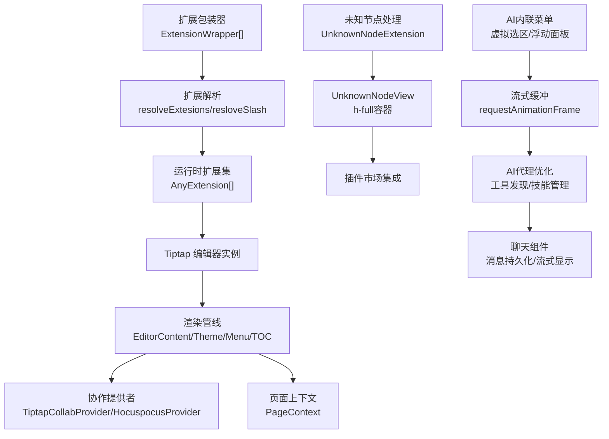
```mermaid
graph TB
EXTWRAP["扩展包装器<br/>ExtensionWrapper[]"] --> RESOLVE["扩展解析<br/>resolveExtesions/resloveSlash"]
RESOLVE --> RUNTIME["运行时扩展集<br/>AnyExtension[]"]
RUNTIME --> EDITOR["Tiptap 编辑器实例"]
EDITOR --> RENDER["渲染管线<br/>EditorContent/Theme/Menu/TOC"]
RENDER --> PROVIDER["协作提供者<br/>TiptapCollabProvider/HocuspocusProvider"]
RENDER --> CONTEXT["页面上下文<br/>PageContext"]
UNKNOWNE["未知节点处理<br/>UnknownNodeExtension"] --> UNKNOWNV["UnknownNodeView<br/>h-full容器"]
UNKNOWNV --> MARKET["插件市场集成"]
AIINLINE["AI内联菜单<br/>虚拟选区/浮动面板"] --> STREAMBUF["流式缓冲<br/>requestAnimationFrame"]
STREAMBUF --> AGENTOPT["AI代理优化<br/>工具发现/技能管理"]
AGENTOPT --> CHAT["聊天组件<br/>消息持久化/流式显示"]
```

**图表来源**
- [packages/editor/src/editor/kit.tsx:23-87](file://packages/editor/src/editor/kit.tsx#L23-L87)
- [packages/editor/src/editor/use-extension.ts:20-63](file://packages/editor/src/editor/use-extension.ts#L20-L63)
- [packages/editor/src/editor/collaboration.tsx:35-206](file://packages/editor/src/editor/collaboration.tsx#L35-L206)
- [packages/editor/src/editor/provider.ts:24-53](file://packages/editor/src/editor/provider.ts#L24-L53)
- [packages/editor/src/editor/context.tsx:1-14](file://packages/editor/src/editor/context.tsx#L1-L14)
- [packages/editor/src/extensions/unknown-node/UnknowNodeView.tsx:12-26](file://packages/editor/src/extensions/unknown-node/UnknowNodeView.tsx#L12-L26)
- [packages/core/src/ai/AiInlineMenu.tsx:35-116](file://packages/core/src/ai/AiInlineMenu.tsx#L35-L116)
- [packages/core/src/ai/utils/use-stream-buffer.ts:42-92](file://packages/core/src/ai/utils/use-stream-buffer.ts#L42-L92)
- [packages/core/src/ai/use-agent-optimized.tsx:38-232](file://packages/core/src/ai/use-agent-optimized.tsx#L38-L232)

## 详细组件分析

### 编辑器 Kit 与扩展解析
- 设计要点
  - 使用 ExtensionWrapper 统一扩展声明，便于动态装配与菜单收集。
  - resolveExtesions 将包装器展开为扩展数组；resloveSlash 收集斜杠菜单项并生成触发器。
  - resolveEditorKit 在运行时拼装扩展集，确保内置扩展优先、可叠加外部扩展与动态扩展配置。
- 复杂度与性能
  - 展开与合并操作为线性复杂度 O(n)，其中 n 为扩展数量；斜杠收集同为 O(m)，m 为配置项数。
  - 建议避免重复展开与重复注入，减少不必要的渲染与重算。

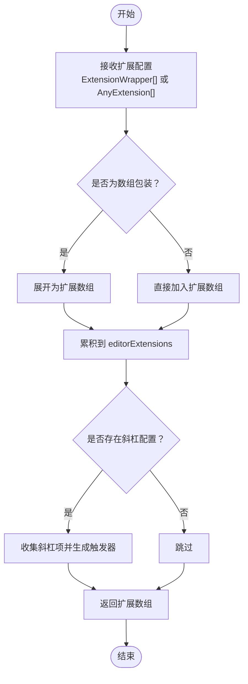
```mermaid
flowchart TD
START(["开始"]) --> INPUT["接收扩展配置<br/>ExtensionWrapper[] 或 AnyExtension[]"]
INPUT --> CHECKARR{"是否为数组包装？"}
CHECKARR --> |是| FLAT["展开为扩展数组"]
CHECKARR --> |否| PUSH["直接加入扩展数组"]
FLAT --> ACC["累积到 editorExtensions"]
PUSH --> ACC
ACC --> SLASHCHK{"是否存在斜杠配置？"}
SLASHCHK --> |是| SLASH["收集斜杠项并生成触发器"]
SLASHCHK --> |否| SKIP["跳过"]
SLASH --> OUT["返回扩展数组"]
SKIP --> OUT
OUT --> END(["结束"])
```

**图表来源**
- [packages/editor/src/editor/kit.tsx:23-49](file://packages/editor/src/editor/kit.tsx#L23-L49)

**章节来源**
- [packages/editor/src/editor/kit.tsx:1-87](file://packages/editor/src/editor/kit.tsx#L1-L87)

### 扩展装配钩子 useEditorExtension
- 设计要点
  - 在运行时构建基础扩展集（文档、段落、文本、占位符、尾随节点、性能统计等），并注入气泡菜单。
  - 从 AppContext 中获取插件管理器，合并插件扩展，再统一解析为扩展数组。
  - 生成斜杠菜单触发器，并注入 UniqueID 以保证事务一致性。
  - 可选过滤指定扩展名称，避免冲突或重复。
- 生命周期与副作用
  - 通过上下文与插件管理器动态获取扩展，适合插件热加载场景。
  - 返回扩展数组与扩展包装器集合，便于菜单与工具栏联动。

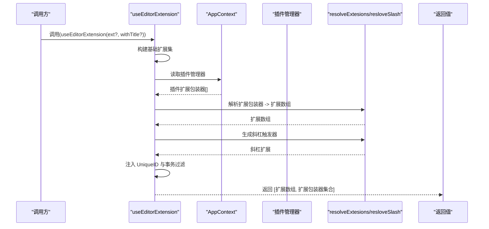
```mermaid
sequenceDiagram
participant Caller as "调用方"
participant Hook as "useEditorExtension"
participant Ctx as "AppContext"
participant PM as "插件管理器"
participant Kit as "resolveExtesions/resloveSlash"
participant Out as "返回值"
Caller->>Hook : 调用(useEditorExtension(ext?, withTitle?))
Hook->>Hook : 构建基础扩展集
Hook->>Ctx : 读取插件管理器
Ctx-->>Hook : 插件扩展包装器[]
Hook->>Kit : 解析扩展包装器 -> 扩展数组
Kit-->>Hook : 扩展数组
Hook->>Kit : 生成斜杠触发器
Kit-->>Hook : 斜杠扩展
Hook->>Hook : 注入 UniqueID 与事务过滤
Hook-->>Out : 返回 [扩展数组, 扩展包装器集合]
```

**图表来源**
- [packages/editor/src/editor/use-extension.ts:20-63](file://packages/editor/src/editor/use-extension.ts#L20-L63)
- [packages/editor/src/editor/kit.tsx:23-49](file://packages/editor/src/editor/kit.tsx#L23-L49)
- [packages/common/src/core/types.ts:1-4](file://packages/common/src/core/types.ts#L1-L4)

**章节来源**
- [packages/editor/src/editor/use-extension.ts:1-63](file://packages/editor/src/editor/use-extension.ts#L1-L63)

### 协作渲染与提供者初始化
- 设计要点
  - CollaborationEditor 负责装配扩展、渲染编辑器内容、挂载菜单与目录、提供页面上下文与主题。
  - 通过 editorProps.editorProvider 注入用户、文件与协作提供者，支持多端协作与感知。
  - 生命周期内处理连接、断开与销毁，确保资源释放。
- 初始化流程
  - 读取扩展配置，构建编辑器实例。
  - 设置 editorProps.attributes 与可编辑属性，绑定菜单与目录。
  - 在卸载时断开协作连接并销毁提供者。

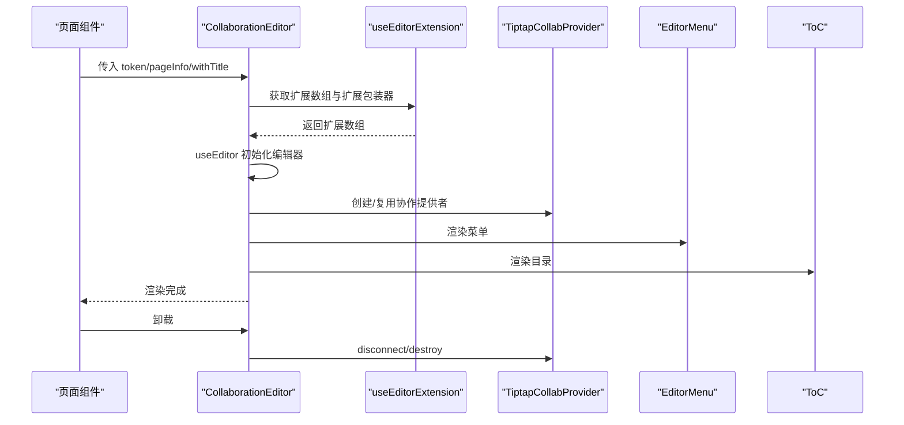
```mermaid
sequenceDiagram
participant UI as "页面组件"
participant Collab as "CollaborationEditor"
participant Hook as "useEditorExtension"
participant Provider as "TiptapCollabProvider"
participant Menu as "EditorMenu"
participant TOC as "ToC"
UI->>Collab : 传入 token/pageInfo/withTitle
Collab->>Hook : 获取扩展数组与扩展包装器
Hook-->>Collab : 返回扩展数组
Collab->>Collab : useEditor 初始化编辑器
Collab->>Provider : 创建/复用协作提供者
Collab->>Menu : 渲染菜单
Collab->>TOC : 渲染目录
Collab-->>UI : 渲染完成
UI->>Collab : 卸载
Collab->>Provider : disconnect/destroy
```

**图表来源**
- [packages/editor/src/editor/collaboration.tsx:35-206](file://packages/editor/src/editor/collaboration.tsx#L35-L206)
- [packages/editor/src/editor/provider.ts:24-53](file://packages/editor/src/editor/provider.ts#L24-L53)
- [packages/plugin-main/src/pages/Journals/JournalEditor/index.tsx:20-54](file://packages/plugin-main/src/pages/Journals/JournalEditor/index.tsx#L20-L54)
- [packages/plugin-main/src/pages/SpaceDetail/PageEditor/index.tsx:133-159](file://packages/plugin-main/src/pages/SpaceDetail/PageEditor/index.tsx#L133-L159)

**章节来源**
- [packages/editor/src/editor/collaboration.tsx:1-206](file://packages/editor/src/editor/collaboration.tsx#L1-L206)
- [packages/editor/src/editor/provider.ts:1-53](file://packages/editor/src/editor/provider.ts#L1-L53)
- [packages/plugin-main/src/pages/Journals/JournalEditor/index.tsx:20-54](file://packages/plugin-main/src/pages/Journals/JournalEditor/index.tsx#L20-L54)
- [packages/plugin-main/src/pages/SpaceDetail/PageEditor/index.tsx:133-159](file://packages/plugin-main/src/pages/SpaceDetail/PageEditor/index.tsx#L133-L159)

### 扩展包装器 ExtensionWrapper
- 作用与实现原理
  - 作为统一扩展声明载体，包含扩展名称与扩展实例（单个或数组），便于 Kit 与 useEditorExtension 进行批量展开与装配。
  - 内置扩展集合 buildInExtension 即由若干 ExtensionWrapper 组成，形成默认能力矩阵。
  - 示例：SelectionExtension、IdentExtension、UnknownNodeExtension 等均以 ExtensionWrapper 形式导出，供装配使用。
- 与插件生态的衔接
  - 通过 AppContext 插件管理器提供的 resloveEditorExtension 方法，动态合并插件扩展，实现插件化扩展装配。

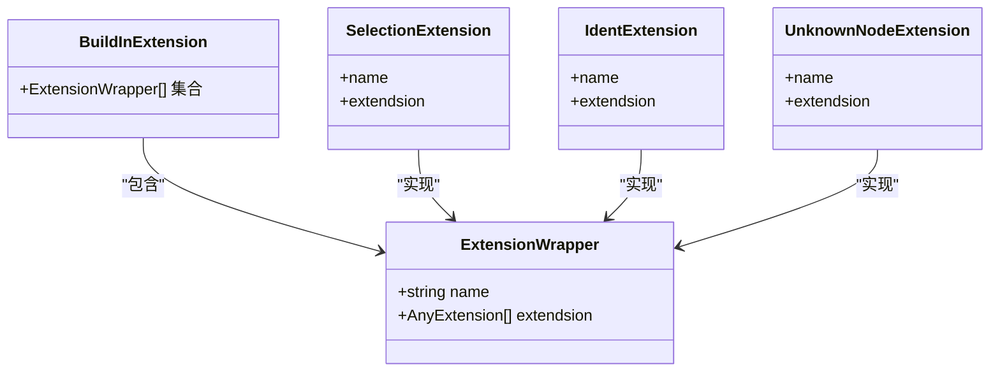
```mermaid
classDiagram
class ExtensionWrapper {
+string name
+AnyExtension[] extendsion
}
class BuildInExtension {
+ExtensionWrapper[] 集合
}
class SelectionExtension {
+name
+extendsion
}
class IdentExtension {
+name
+extendsion
}
class UnknownNodeExtension {
+name
+extendsion
}
BuildInExtension --> ExtensionWrapper : "包含"
SelectionExtension --> ExtensionWrapper : "实现"
IdentExtension --> ExtensionWrapper : "实现"
UnknownNodeExtension --> ExtensionWrapper : "实现"
```

**图表来源**
- [packages/editor/src/editor/build-in-extension.ts:1-56](file://packages/editor/src/editor/build-in-extension.ts#L1-L56)
- [packages/editor/src/extensions/selection/index.tsx:1-8](file://packages/editor/src/extensions/selection/index.tsx#L1-L8)
- [packages/editor/src/extensions/ident/index.tsx:1-9](file://packages/editor/src/extensions/ident/index.tsx#L1-L9)
- [packages/editor/src/extensions/unknown-node/index.tsx:5-8](file://packages/editor/src/extensions/unknown-node/index.tsx#L5-L8)
- [packages/editor/src/extensions/index.ts:1-64](file://packages/editor/src/extensions/index.ts#L1-L64)

**章节来源**
- [packages/editor/src/editor/build-in-extension.ts:1-56](file://packages/editor/src/editor/build-in-extension.ts#L1-L56)
- [packages/editor/src/extensions/selection/index.tsx:1-8](file://packages/editor/src/extensions/selection/index.tsx#L1-L8)
- [packages/editor/src/extensions/ident/index.tsx:1-9](file://packages/editor/src/extensions/ident/index.tsx#L1-L9)
- [packages/editor/src/extensions/unknown-node/index.tsx:1-8](file://packages/editor/src/extensions/unknown-node/index.tsx#L1-L8)
- [packages/editor/src/extensions/index.ts:1-64](file://packages/editor/src/extensions/index.ts#L1-L64)

### 编辑器上下文管理
- 页面上下文 PageContext
  - 提供 spaceId、id、parentId、title、创建/更新人与时间等字段，贯穿编辑器各子组件。
  - 在 CollaborationEditor 中通过 React Context.Provider 注入，供菜单、目录与扩展视图使用。
- 状态提升与事件传播
  - 编辑器状态通过 useEditor 实例管理；菜单与目录通过 props 与上下文进行状态传播。
  - 协作提供者通过 editorProps.editorProvider 注入，实现用户列表、同步状态等事件的跨组件传播。
- 配置传递
  - 通过 editor.options.editorProps 传递 editorProvider、属性与回调，确保扩展与组件可访问全局配置。

**章节来源**
- [packages/editor/src/editor/context.tsx:1-14](file://packages/editor/src/editor/context.tsx#L1-L14)
- [packages/editor/src/editor/collaboration.tsx:161-165](file://packages/editor/src/editor/collaboration.tsx#L161-L165)
- [packages/editor/src/editor/provider.ts:24-53](file://packages/editor/src/editor/provider.ts#L24-L53)

### 同步块与嵌套编辑器
- 设计要点
  - SyncBlockView 作为节点视图，内部再次调用 useEditorExtension 生成子编辑器，结合独立的协作提供者实现块级同步。
  - 通过 PageContext 获取空间与页面信息，格式化块级协作键，确保隔离与一致性。
- 生命周期与资源管理
  - 子编辑器在挂载时创建提供者并监听同步状态；卸载时断开连接与销毁提供者，避免内存泄漏。

**章节来源**
- [packages/editor/src/extensions/sync-block/SyncBlock.tsx:1-87](file://packages/editor/src/extensions/sync-block/SyncBlock.tsx#L1-L87)

## 未知节点扩展系统

### UnknownNodeView 组件分析
UnknownNodeView 是处理插件缺失场景的核心组件，已实现从 py-12 到 h-full 的UI改进：
- 容器类名：`w-full h-full flex items-center justify-center` 确保全屏覆盖显示
- 空状态展示：提供友好的插件缺失提示界面
- 市场集成：集成插件市场跳转功能，引导用户安装缺失插件
- 事件处理：通过事件总线触发插件市场导航

### CSS 类名变更验证
经过代码分析，确认 UnknownNodeView 组件的 CSS 类名已从 py-12 更新为 h-full：
- 原始类名：py-12（垂直内边距）
- 更新后类名：h-full（高度占满）
- 变更目的：提供更好的全屏覆盖效果，确保未知节点内容在整个容器中居中显示

### 插件市场集成机制
- 事件驱动：通过 `GO_TO_MARKETPLACE` 事件触发市场导航
- 用户体验：提供清晰的插件缺失说明和安装引导
- 技术实现：使用 @kn/common 的 event 机制进行组件间通信

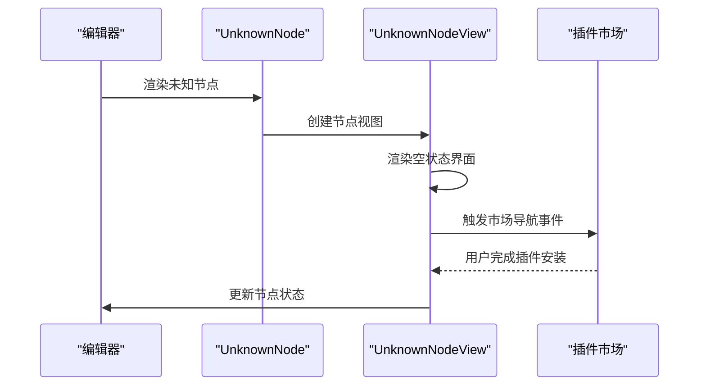
```mermaid
sequenceDiagram
participant Editor as "编辑器"
participant UnknownNode as "UnknownNode"
participant View as "UnknownNodeView"
participant Market as "插件市场"
Editor->>UnknownNode : 渲染未知节点
UnknownNode->>View : 创建节点视图
View->>View : 渲染空状态界面
View->>Market : 触发市场导航事件
Market-->>View : 用户完成插件安装
View->>Editor : 更新节点状态
```

**图表来源**
- [packages/editor/src/extensions/unknown-node/UnknowNodeView.tsx:9-26](file://packages/editor/src/extensions/unknown-node/UnknowNodeView.tsx#L9-L26)
- [packages/editor/src/extensions/unknown-node/unknown-node.ts:6-11](file://packages/editor/src/extensions/unknown-node/unknown-node.ts#L6-L11)

**章节来源**
- [packages/editor/src/extensions/unknown-node/UnknowNodeView.tsx:1-26](file://packages/editor/src/extensions/unknown-node/UnknowNodeView.tsx#L1-L26)
- [packages/editor/src/extensions/unknown-node/unknown-node.ts:1-27](file://packages/editor/src/extensions/unknown-node/unknown-node.ts#L1-L27)
- [packages/editor/src/extensions/unknown-node/index.tsx:1-8](file://packages/editor/src/extensions/unknown-node/index.tsx#L1-L8)

## AI内联菜单系统

### 虚拟选区高亮机制
AI内联菜单系统通过虚拟选区装饰插件实现选区高亮功能：
- 使用 PluginKey 创建唯一的装饰插件标识
- 通过 DecorationSet 和 Decoration.inline 创建高亮装饰
- 支持选区的设置、清除和映射更新
- 在编辑器事务中保持选区状态的一致性

### 浮动面板交互设计
AiInlinePanel 提供完整的AI交互界面：
- 响应选区触发事件，自动定位面板位置
- 支持Esc键关闭和点击外部区域关闭
- 集成工具执行步骤显示和错误处理
- 实现流式文本缓冲和实时渲染

### 触发器组件设计
AiInlineTrigger 实现便捷的AI交互入口：
- 鼠标按下事件保持选区状态
- 获取当前选区文本和坐标信息
- 通过自定义事件传递选区快照
- 实现虚拟选区高亮装饰

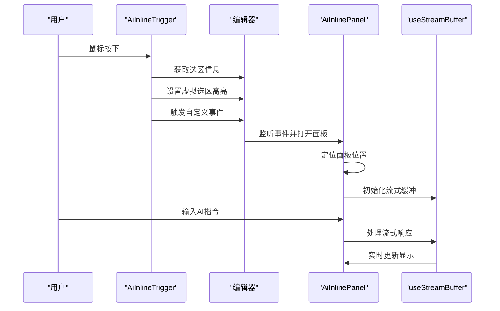
```mermaid
sequenceDiagram
participant User as "用户"
participant Trigger as "AiInlineTrigger"
participant Editor as "编辑器"
participant Panel as "AiInlinePanel"
participant Buffer as "useStreamBuffer"
User->>Trigger : 鼠标按下
Trigger->>Editor : 获取选区信息
Trigger->>Editor : 设置虚拟选区高亮
Trigger->>Editor : 触发自定义事件
Editor->>Panel : 监听事件并打开面板
Panel->>Panel : 定位面板位置
Panel->>Buffer : 初始化流式缓冲
User->>Panel : 输入AI指令
Panel->>Buffer : 处理流式响应
Buffer->>Panel : 实时更新显示
```

**图表来源**
- [packages/core/src/ai/AiInlineMenu.tsx:78-116](file://packages/core/src/ai/AiInlineMenu.tsx#L78-L116)
- [packages/core/src/ai/AiInlineMenu.tsx:120-242](file://packages/core/src/ai/AiInlineMenu.tsx#L120-L242)
- [packages/core/src/ai/utils/use-stream-buffer.ts:42-92](file://packages/core/src/ai/utils/use-stream-buffer.ts#L42-L92)

**章节来源**
- [packages/core/src/ai/AiInlineMenu.tsx:35-116](file://packages/core/src/ai/AiInlineMenu.tsx#L35-L116)
- [packages/core/src/ai/AiInlineMenu.tsx:118-242](file://packages/core/src/ai/AiInlineMenu.tsx#L118-L242)
- [packages/core/src/ai/utils/use-stream-buffer.ts:1-93](file://packages/core/src/ai/utils/use-stream-buffer.ts#L1-L93)

## 流式缓冲管理

### RAF批量更新机制
useStreamBuffer 实现高效的流式文本缓冲：
- 使用 requestAnimationFrame 将每帧的文本更新批量处理
- 默认约16fps的刷新频率，避免频繁的React状态更新
- 通过bufferRef存储原始缓冲内容，content状态存储已更新内容
- 支持立即刷新和重置功能

### 缓冲状态管理
- content：React状态，用于驱动UI更新
- bufferRef：原始缓冲区，存储最新的文本内容
- rafRef：requestAnimationFrame句柄，管理刷新调度
- 提供append、reset、getRawContent、flush等操作方法

### 性能优化策略
- 减少渲染次数：从每块文本更新一次降低到每帧更新一次
- 避免重排重绘：批量更新减少DOM操作
- 内存管理：及时清理requestAnimationFrame回调
- 实时性平衡：在流畅度和实时性之间找到最佳平衡点

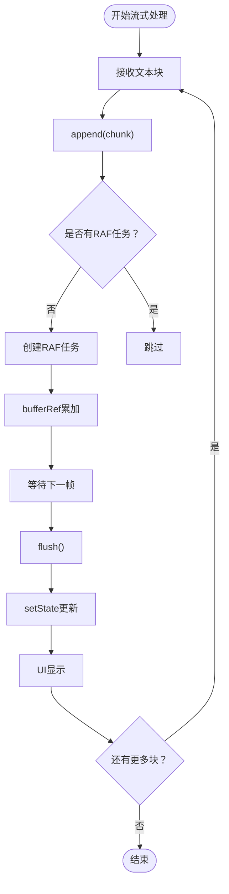
```mermaid
flowchart TD
START(["开始流式处理"]) --> CHUNK["接收文本块"]
CHUNK --> APPEND["append(chunk)"]
APPEND --> RAF{"是否有RAF任务？"}
RAF --> |否| CREATE["创建RAF任务"]
RAF --> |是| SKIP["跳过"]
CREATE --> BUFFER["bufferRef累加"]
BUFFER --> WAIT["等待下一帧"]
WAIT --> FLUSH["flush()"]
FLUSH --> STATE["setState更新"]
STATE --> DISPLAY["UI显示"]
DISPLAY --> NEXT{"还有更多块？"}
NEXT --> |是| CHUNK
NEXT --> |否| END(["结束"])
```

**图表来源**
- [packages/core/src/ai/utils/use-stream-buffer.ts:42-92](file://packages/core/src/ai/utils/use-stream-buffer.ts#L42-L92)
- [packages/plugin-ai/src/ai/menu/use-streaming-buffer.ts:7-45](file://packages/plugin-ai/src/ai/menu/use-streaming-buffer.ts#L7-L45)

**章节来源**
- [packages/core/src/ai/utils/use-stream-buffer.ts:1-93](file://packages/core/src/ai/utils/use-stream-buffer.ts#L1-L93)
- [packages/plugin-ai/src/ai/menu/use-streaming-buffer.ts:1-46](file://packages/plugin-ai/src/ai/menu/use-streaming-buffer.ts#L1-L46)

## AI代理优化架构

### 工具发现与技能管理
useEditorAgentOptimized 提供完整的AI代理优化：
- ToolProvider：管理工具注册和发现
- SkillProvider：管理技能注册和系统提示
- Progressive Discovery：支持动态工具和技能发现
- 版本控制：工具和技能变化时自动重新创建代理

### 代理生命周期管理
- AbortController：支持AI生成的中断和停止
- 版本状态：工具和技能变化时触发代理重建
- 重载回调：工具或技能注册时自动更新
- 插件集成：支持插件工具和技能的动态加载

### 历史消息管理
- 支持用户提供的历史消息数组
- 自动构建初始消息数组
- 支持流式生成的中断处理
- 提供生成状态查询功能

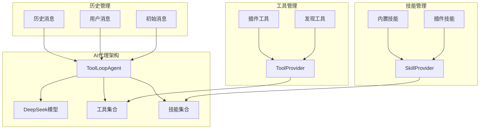
```mermaid
graph TB
subgraph "AI代理架构"
AGENT["ToolLoopAgent"] --> MODEL["DeepSeek模型"]
AGENT --> TOOLS["工具集合"]
AGENT --> SKILLS["技能集合"]
end
subgraph "工具管理"
TOOLPROV["ToolProvider"] --> TOOLS
PLUGINTOOLS["插件工具"] --> TOOLPROV
DISCOVERY["发现工具"] --> TOOLPROV
end
subgraph "技能管理"
SKILLPROV["SkillProvider"] --> SKILLS
BUILTIN["内置技能"] --> SKILLPROV
PLUGINSKILLS["插件技能"] --> SKILLPROV
end
subgraph "历史管理"
HISTORY["历史消息"] --> AGENT
USERMSG["用户消息"] --> AGENT
INITMSG["初始消息"] --> AGENT
end
```

**图表来源**
- [packages/core/src/ai/use-agent-optimized.tsx:38-232](file://packages/core/src/ai/use-agent-optimized.tsx#L38-L232)
- [packages/core/src/ai/types.ts:109-166](file://packages/core/src/ai/types.ts#L109-L166)

**章节来源**
- [packages/core/src/ai/use-agent-optimized.tsx:1-233](file://packages/core/src/ai/use-agent-optimized.tsx#L1-L233)
- [packages/core/src/ai/types.ts:1-166](file://packages/core/src/ai/types.ts#L1-L166)

## 聊天持久化与历史管理

### 消息持久化机制
chat-persistence 提供完整的聊天历史管理：
- localStorage存储：支持消息的持久化保存
- 最大容量限制：最多保存50条消息
- 历史截断：自动截断超出容量的消息
- 初始消息管理：提供初始欢迎消息支持

### Token预算控制
- 历史消息限制：最多保留20条最近消息
- Token估算：粗略估算每个消息的token数量
- 预算调整：当超过8000 token预算时从前面截断
- 动态调整：根据实际token使用情况动态调整

### 历史消息构建
- 过滤初始消息：排除初始欢迎消息
- 截取最近消息：只保留最近的MAX_AI_HISTORY条消息
- 角色转换：将用户消息转换为'user'角色，AI消息转换为'assistant'角色
- 上下文构建：为AI代理提供合适的对话上下文

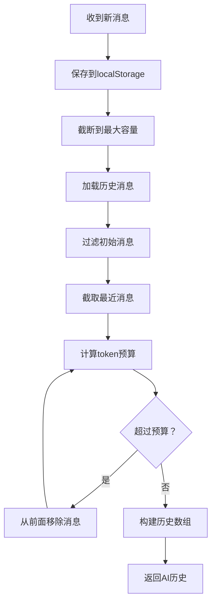
```mermaid
flowchart TD
MSG["收到新消息"] --> SAVE["保存到localStorage"]
SAVE --> TRUNCATE["截断到最大容量"]
TRUNCATE --> LOAD["加载历史消息"]
LOAD --> FILTER["过滤初始消息"]
FILTER --> SLICE["截取最近消息"]
SLICE --> TOKEN["计算token预算"]
TOKEN --> ADJUST{"超过预算？"}
ADJUST --> |是| REMOVE["从前面移除消息"]
ADJUST --> |否| BUILD["构建历史数组"]
REMOVE --> TOKEN
BUILD --> RETURN["返回AI历史"]
```

**图表来源**
- [packages/plugin-ai/src/ai/menu/chat-persistence.ts:13-67](file://packages/plugin-ai/src/ai/menu/chat-persistence.ts#L13-L67)

**章节来源**
- [packages/plugin-ai/src/ai/menu/chat-persistence.ts:1-68](file://packages/plugin-ai/src/ai/menu/chat-persistence.ts#L1-L68)
- [packages/plugin-ai/src/ai/menu/chat-types.ts:1-87](file://packages/plugin-ai/src/ai/menu/chat-types.ts#L1-L87)

## 依赖关系分析
- 组件耦合与内聚
  - CollaborationEditor 对扩展装配、菜单、目录与提供者存在强依赖，但通过参数化与上下文解耦具体实现细节。
  - useEditorExtension 与 AppContext 耦合，便于插件生态扩展；Kit 与扩展包装器解耦，便于统一装配。
  - AI内联菜单通过共享的useStreamBuffer钩子实现组件间通信。
  - UnknownNodeView 通过事件机制与插件市场集成，保持低耦合设计。
- 外部依赖与集成点
  - Tiptap 生态（@tiptap/react、@tiptap/core、@tiptap/pm）提供编辑器核心能力。
  - 协作提供者（@hocuspocus/provider）提供实时协作与感知。
  - UI 与主题（styled-components、@kn/ui）提供样式与主题支持。
  - AI工具库（ai）提供工具循环代理和工具发现功能。
  - 事件总线（@kn/common/event）提供组件间通信机制。
- 循环依赖风险
  - 扩展包装器与装配逻辑通过统一接口解耦，未见循环依赖迹象；建议保持扩展包装器仅声明不引入装配逻辑。
  - AI组件通过共享钩子实现松耦合，避免直接依赖关系。
  - UnknownNodeView 通过事件机制与主编辑器解耦，降低循环依赖风险。

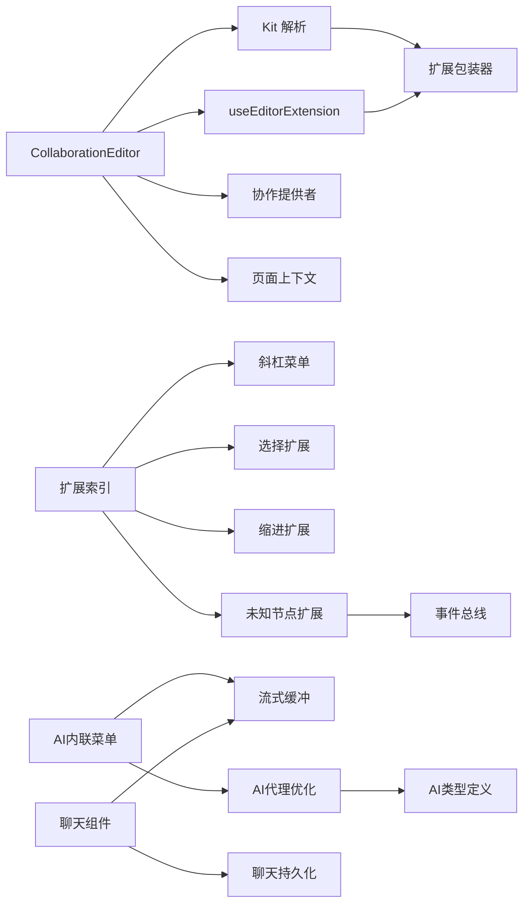
```mermaid
graph LR
KIT["Kit 解析"] --> EXTWRAP["扩展包装器"]
USEEXT["useEditorExtension"] --> EXTWRAP
COLLAB["CollaborationEditor"] --> KIT
COLLAB --> USEEXT
COLLAB --> PROVIDER["协作提供者"]
COLLAB --> CTX["页面上下文"]
EXTIDX["扩展索引"] --> SLASH["斜杠菜单"]
EXTIDX --> SELECTION["选择扩展"]
EXTIDX --> IDENT["缩进扩展"]
EXTIDX --> UNKNOWNE["未知节点扩展"]
AIINLINE["AI内联菜单"] --> STREAMBUF["流式缓冲"]
AIINLINE --> AGENTOPT["AI代理优化"]
UNKNOWNE --> EVENT["事件总线"]
CHATCOMP["聊天组件"] --> CHATPERSIST["聊天持久化"]
CHATCOMP --> STREAMBUF
AGENTOPT --> TYPES["AI类型定义"]
```

**图表来源**
- [packages/editor/src/editor/kit.tsx:23-87](file://packages/editor/src/editor/kit.tsx#L23-L87)
- [packages/editor/src/editor/use-extension.ts:20-63](file://packages/editor/src/editor/use-extension.ts#L20-L63)
- [packages/editor/src/editor/collaboration.tsx:35-206](file://packages/editor/src/editor/collaboration.tsx#L35-L206)
- [packages/editor/src/extensions/index.ts:1-64](file://packages/editor/src/extensions/index.ts#L1-L64)
- [packages/editor/src/extensions/slash/index.tsx:1-3](file://packages/editor/src/extensions/slash/index.tsx#L1-L3)
- [packages/editor/src/extensions/selection/index.tsx:1-8](file://packages/editor/src/extensions/selection/index.tsx#L1-L8)
- [packages/editor/src/extensions/ident/index.tsx:1-9](file://packages/editor/src/extensions/ident/index.tsx#L1-L9)
- [packages/editor/src/extensions/unknown-node/index.tsx:1-8](file://packages/editor/src/extensions/unknown-node/index.tsx#L1-L8)
- [packages/core/src/ai/AiInlineMenu.tsx:1-429](file://packages/core/src/ai/AiInlineMenu.tsx#L1-L429)
- [packages/core/src/ai/utils/use-stream-buffer.ts:1-93](file://packages/core/src/ai/utils/use-stream-buffer.ts#L1-L93)
- [packages/core/src/ai/use-agent-optimized.tsx:1-233](file://packages/core/src/ai/use-agent-optimized.tsx#L1-L233)
- [packages/plugin-ai/src/ai/menu/chat-persistence.ts:1-68](file://packages/plugin-ai/src/ai/menu/chat-persistence.ts#L1-L68)

**章节来源**
- [packages/editor/src/editor/kit.tsx:1-87](file://packages/editor/src/editor/kit.tsx#L1-L87)
- [packages/editor/src/editor/use-extension.ts:1-63](file://packages/editor/src/editor/use-extension.ts#L1-L63)
- [packages/editor/src/editor/collaboration.tsx:1-206](file://packages/editor/src/editor/collaboration.tsx#L1-L206)
- [packages/editor/src/extensions/index.ts:1-64](file://packages/editor/src/extensions/index.ts#L1-L64)

## 性能考虑
- 扩展装配优化
  - 避免重复解析与重复注入扩展，缓存 resolveExtesions 结果；仅在扩展配置变更时重建扩展数组。
  - 合理拆分扩展，按需启用，减少初始渲染负担。
- 渲染与主题
  - 使用 React.memo 化昂贵组件（如目录），减少重渲染。
  - 控制 editorProps.attributes 与类名，避免过度样式计算。
- 协作与网络
  - 在断开连接前清理提供者与观察者，防止内存泄漏。
  - 合理设置同步状态回调频率，避免频繁重绘。
- 事务与唯一 ID
  - 使用 UniqueID 与事务过滤减少无效重绘与冲突，提升协作稳定性。
- AI交互性能优化
  - 使用requestAnimationFrame批量更新流式文本，避免每块更新一次导致的性能问题。
  - 通过虚拟选区装饰减少额外的DOM操作和样式计算。
  - 实现RAF取消和清理机制，避免内存泄漏。
  - 使用Token预算控制历史消息长度，避免上下文溢出。
- 未知节点处理优化
  - UnknownNodeView 使用 h-full 类名确保高效的全屏覆盖渲染。
  - 事件驱动的插件市场集成避免阻塞主线程。
  - 空状态界面采用轻量级组件设计，减少渲染开销。

**更新** 新增UnknownNodeView组件的CSS类名优化分析，确认从 py-12 到 h-full 的UI改进已完成。

## 故障排查指南
- 协作连接问题
  - 确认 provider 参数（baseUrl、name、token、document）正确；检查 onSynced 回调是否触发。
  - 卸载时务必调用 disconnect 与 destroy，避免后台连接占用。
- 扩展冲突
  - 若出现光标异常或渲染错位，检查扩展顺序与 UniqueID 配置；必要时过滤冲突扩展名称。
- 斜杠菜单无效
  - 确认 ExtensionWrapper 中存在 slashConfig，且 resloveSlash 已被装配到编辑器扩展数组。
- 气泡菜单显示异常
  - 拖拽场景下优先使用 NodeBubbleMenu；检查 shouldShow 条件与 getReferenceClientRect 计算。
- 上下文缺失
  - 确保在 CollaborationEditor 中已通过 PageContext.Provider 注入 pageInfo；否则扩展视图无法获取上下文。
- AI内联菜单问题
  - 检查虚拟选区装饰插件是否正确注册和注销。
  - 确认自定义事件AI_INLINE_EVENT的触发和监听正常。
  - 验证流式缓冲钩子的初始化和清理机制。
- 流式渲染问题
  - 检查requestAnimationFrame回调是否正确调度和取消。
  - 确认缓冲区内容更新和状态同步的时机。
  - 验证RAF任务的并发控制和内存清理。
- AI代理问题
  - 检查工具和技能的注册过程是否成功。
  - 确认AbortController的正确使用和清理。
  - 验证历史消息构建和Token预算控制逻辑。
- 未知节点显示问题
  - 检查UnknownNodeView的CSS类名是否为 h-full，确保全屏覆盖效果。
  - 确认插件市场事件触发机制正常工作。
  - 验证空状态界面的渲染和交互功能。

**更新** 新增UnknownNodeView组件故障排查指南，包括CSS类名验证和插件市场集成问题诊断。

**章节来源**
- [packages/editor/src/editor/collaboration.tsx:93-113](file://packages/editor/src/editor/collaboration.tsx#L93-L113)
- [packages/editor/src/editor/use-extension.ts:55-63](file://packages/editor/src/editor/use-extension.ts#L55-L63)
- [packages/editor/src/components/bubble-menu.tsx:38-84](file://packages/editor/src/components/bubble-menu.tsx#L38-L84)
- [packages/editor/src/editor/context.tsx:1-14](file://packages/editor/src/editor/context.tsx#L1-L14)
- [packages/core/src/ai/AiInlineMenu.tsx:146-154](file://packages/core/src/ai/AiInlineMenu.tsx#L146-L154)
- [packages/core/src/ai/utils/use-stream-buffer.ts:77-83](file://packages/core/src/ai/utils/use-stream-buffer.ts#L77-L83)
- [packages/core/src/ai/use-agent-optimized.tsx:101-115](file://packages/core/src/ai/use-agent-optimized.tsx#L101-L115)
- [packages/editor/src/extensions/unknown-node/UnknowNodeView.tsx:12-12](file://packages/editor/src/extensions/unknown-node/UnknowNodeView.tsx#L12-L12)

## 结论
本编辑器内核以 ExtensionWrapper 为统一接口，结合 Kit 与 useEditorExtension 实现了灵活的扩展装配与协作渲染；通过 Provider 与上下文实现配置与状态的贯通；通过组件层增强用户体验。**更新** 新增的UnknownNodeView组件CSS类名优化（从 py-12 到 h-full）、未知节点扩展系统、AI内联菜单系统、流式缓冲管理和AI代理优化架构，进一步提升了编辑器的智能化水平、容错能力和交互体验。整体架构具备良好的扩展性与可维护性，适合在知识库系统中承载丰富的富文本编辑与协作需求，同时提供强大的AI辅助功能和完善的插件缺失处理机制。

## 附录：扩展开发与集成指南
- 开发自定义扩展
  - 定义扩展：参考现有扩展（如 SelectionExtension、IdentExtension、UnknownNodeExtension）以 ExtensionWrapper 形式导出，包含 name 与 extendsion 字段。
  - 菜单与视图：为扩展提供静态菜单、气泡菜单或节点视图，确保与编辑器上下文兼容。
  - 装配与发布：通过插件管理器的 resloveEditorExtension 暴露扩展包装器，使其参与 Kit 解析与装配。
- 集成第三方功能
  - 将第三方扩展封装为 ExtensionWrapper，确保其扩展实例可被 resolveExtesions 正确展开。
  - 如需斜杠菜单，提供 slashConfig 并由 resloveSlash 生成触发器。
  - 通过 editorProps.editorProvider 注入用户与文件提供者，实现第三方协作与资源管理。
- AI功能集成
  - 使用AiInlineMenu组件作为AI交互的基础模板。
  - 通过useStreamBuffer钩子实现流式文本的高效渲染。
  - 利用useEditorAgentOptimized钩子集成AI代理和工具发现功能。
  - 实现聊天持久化机制，提供消息的历史记录和恢复能力。
- 未知节点处理集成
  - 使用UnknownNodeExtension处理插件缺失场景。
  - 通过UnknownNodeView提供友好的空状态界面和市场集成。
  - 实现事件驱动的插件市场导航机制。
- 最佳实践
  - 保持扩展职责单一，避免在同一扩展中混入过多功能。
  - 使用事务过滤与唯一 ID，减少冲突与无效重绘。
  - 对昂贵组件进行 memo 化，控制渲染范围。
  - 在卸载时清理提供者与观察者，保障内存安全。
  - AI组件中注意RAF任务的管理和清理，避免内存泄漏。
  - 合理使用Token预算控制，避免AI上下文溢出。
  - 未知节点组件使用h-full类名确保全屏覆盖效果。

**更新** 新增UnknownNodeView组件的CSS类名优化指南和未知节点处理集成最佳实践。

**章节来源**
- [packages/editor/src/extensions/selection/index.tsx:1-8](file://packages/editor/src/extensions/selection/index.tsx#L1-L8)
- [packages/editor/src/extensions/ident/index.tsx:1-9](file://packages/editor/src/extensions/ident/index.tsx#L1-L9)
- [packages/editor/src/extensions/unknown-node/index.tsx:1-8](file://packages/editor/src/extensions/unknown-node/index.tsx#L1-L8)
- [packages/editor/src/editor/kit.tsx:23-49](file://packages/editor/src/editor/kit.tsx#L23-L49)
- [packages/editor/src/editor/use-extension.ts:20-63](file://packages/editor/src/editor/use-extension.ts#L20-L63)
- [packages/editor/src/editor/provider.ts:24-53](file://packages/editor/src/editor/provider.ts#L24-L53)
- [packages/core/src/ai/AiInlineMenu.tsx:1-429](file://packages/core/src/ai/AiInlineMenu.tsx#L1-L429)
- [packages/core/src/ai/utils/use-stream-buffer.ts:1-93](file://packages/core/src/ai/utils/use-stream-buffer.ts#L1-L93)
- [packages/core/src/ai/use-agent-optimized.tsx:1-233](file://packages/core/src/ai/use-agent-optimized.tsx#L1-L233)
- [packages/plugin-ai/src/ai/menu/chat-persistence.ts:1-68](file://packages/plugin-ai/src/ai/menu/chat-persistence.ts#L1-L68)