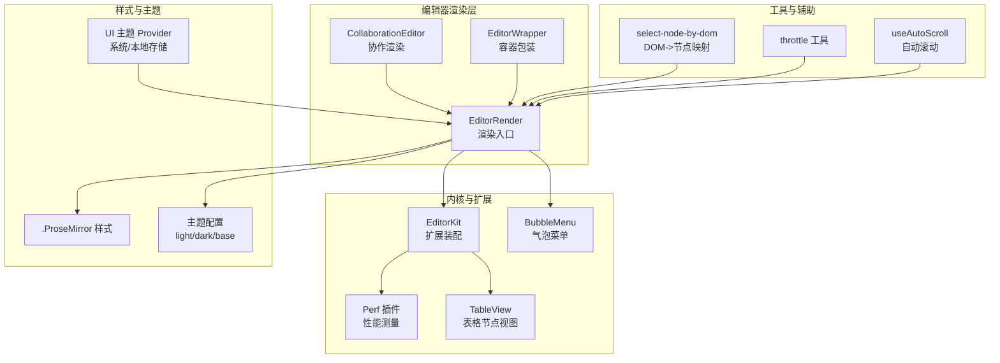
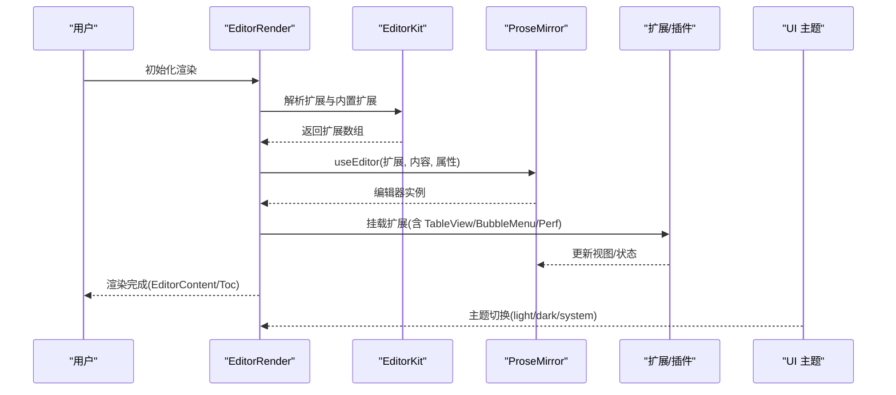
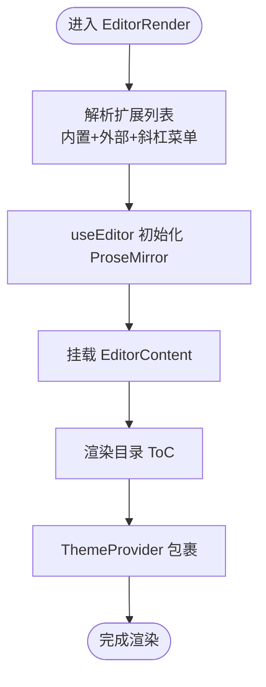
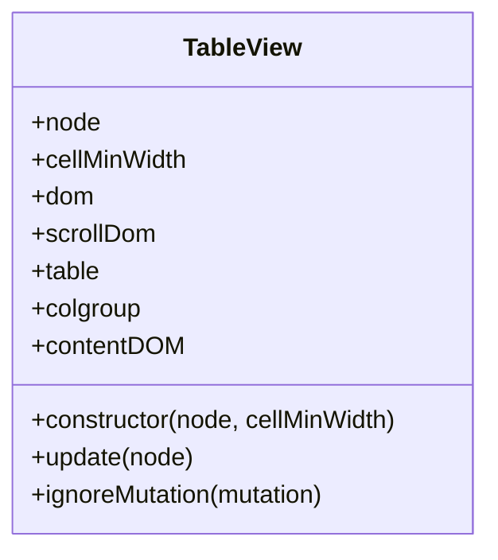
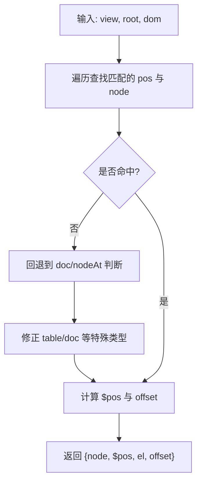
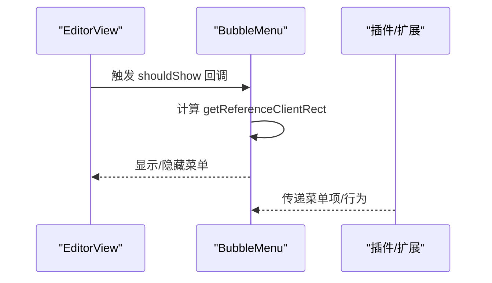
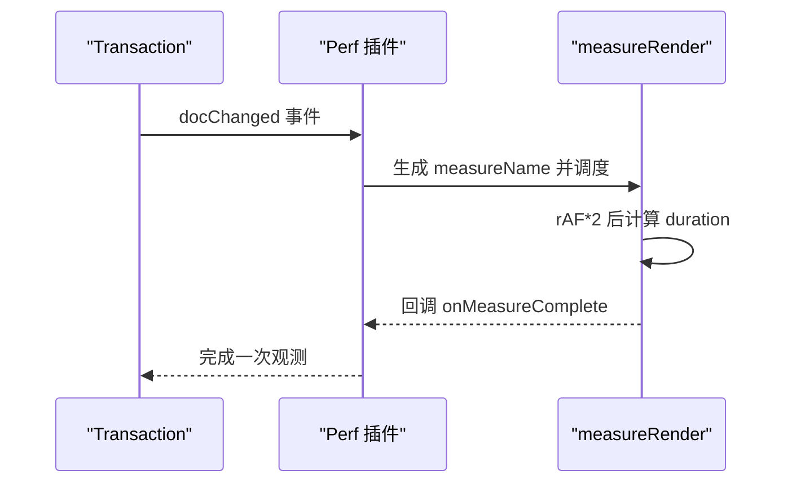
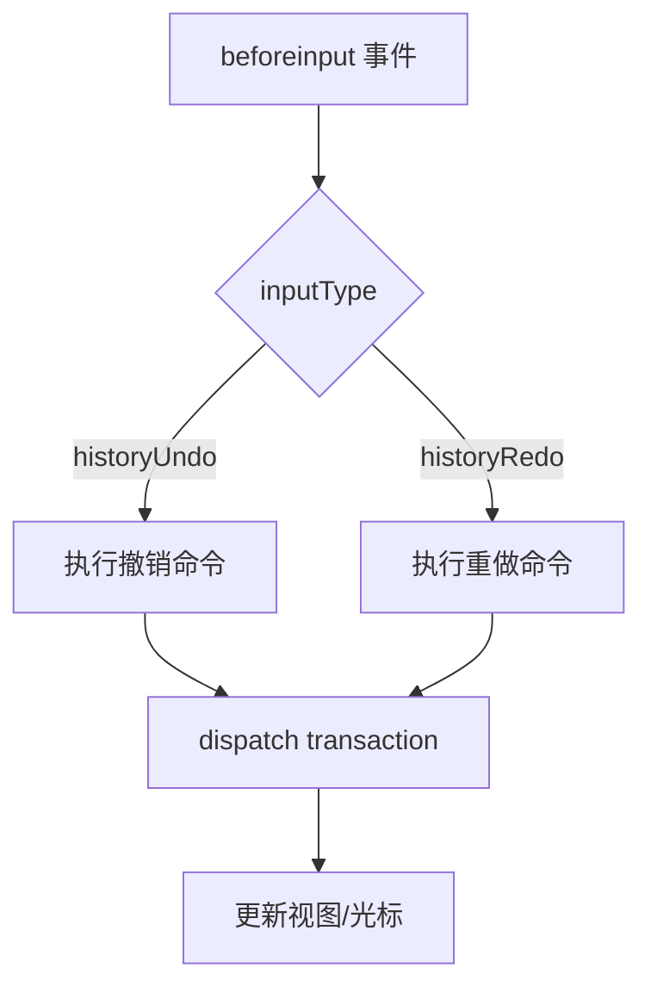
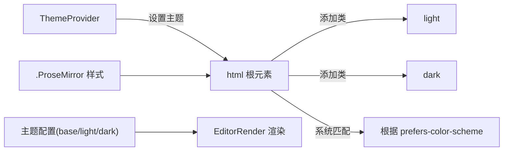
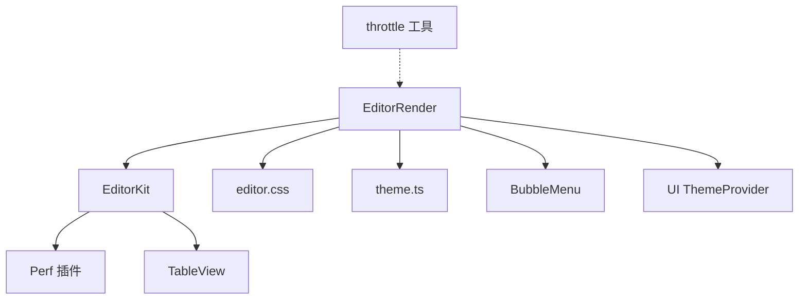

# 编辑器渲染机制

<cite>
**本文引用的文件**
- [packages/editor/src/editor/render.tsx](file://packages/editor/src/editor/render.tsx)
- [packages/editor/src/editor/collaboration.tsx](file://packages/editor/src/editor/collaboration.tsx)
- [packages/editor/src/components/editor-wrapper.tsx](file://packages/editor/src/components/editor-wrapper.tsx)
- [packages/editor/src/editor/kit.tsx](file://packages/editor/src/editor/kit.tsx)
- [packages/editor/src/styles/editor.css](file://packages/editor/src/styles/editor.css)
- [packages/editor/src/styles/theme.ts](file://packages/editor/src/styles/theme.ts)
- [packages/editor/src/utilities/select-node-by-dom.ts](file://packages/editor/src/utilities/select-node-by-dom.ts)
- [packages/editor/src/extensions/table/table/table-view.ts](file://packages/editor/src/extensions/table/table/table-view.ts)
- [packages/editor/src/extensions/perf/perf.ts](file://packages/editor/src/extensions/perf/perf.ts)
- [packages/editor/src/extensions/perf/utilities.ts](file://packages/editor/src/extensions/perf/utilities.ts)
- [packages/editor/src/components/bubble-menu.tsx](file://packages/editor/src/components/bubble-menu.tsx)
- [packages/editor/src/utilities/throttle.ts](file://packages/editor/src/utilities/throttle.ts)
- [packages/ui/src/components/theme/index.tsx](file://packages/ui/src/components/theme/index.tsx)
- [packages/ui/src/components/theme/ModeToggle.tsx](file://packages/ui/src/components/theme/ModeToggle.tsx)
- [packages/ui/src/hooks/use-auto-scrokk.ts](file://packages/ui/src/hooks/use-auto-scrokk.ts)
- [packages/plugin-block-reference/src/extension/block-reference/inde.tsx](file://packages/plugin-block-reference/src/extension/block-reference/inde.tsx)
- [packages/editor/src/extensions/undo-redo/history.ts](file://packages/editor/src/extensions/undo-redo/history.ts)
</cite>

## 目录
1. [引言](#引言)
2. [项目结构](#项目结构)
3. [核心组件](#核心组件)
4. [架构总览](#架构总览)
5. [详细组件分析](#详细组件分析)
6. [依赖关系分析](#依赖关系分析)
7. [性能考量](#性能考量)
8. [故障排查指南](#故障排查指南)
9. [结论](#结论)
10. [附录](#附录)

## 引言
本文件系统化梳理编辑器的渲染机制与实现细节，覆盖以下关键主题：
- 渲染架构：DOM 树构建、节点映射与视图更新策略
- 包装器组件：编辑器实例的创建、销毁与容器管理
- 样式系统：主题切换、CSS 变量与响应式布局
- 性能优化：虚拟滚动、懒加载与增量更新
- 事件处理：用户输入、焦点管理与键盘快捷键
- 调试与分析：渲染性能测量与可观测性
- 兼容性与无障碍：跨浏览器与可访问性实践

## 项目结构
编辑器相关代码主要位于 packages/editor 与 packages/ui 中：
- 渲染入口与 Provider：render.tsx、collaboration.tsx
- 编辑器内核与扩展：kit.tsx、extensions/*
- 样式与主题：styles/editor.css、styles/theme.ts
- 工具与辅助：utilities/*、components/bubble-menu.tsx
- UI 主题系统：packages/ui/src/components/theme/*

图表来源
- [packages/editor/src/editor/render.tsx](file://packages/editor/src/editor/render.tsx#L1-L115)
- [packages/editor/src/editor/collaboration.tsx](file://packages/editor/src/editor/collaboration.tsx#L93-L141)
- [packages/editor/src/components/editor-wrapper.tsx](file://packages/editor/src/components/editor-wrapper.tsx#L1-L18)
- [packages/editor/src/editor/kit.tsx](file://packages/editor/src/editor/kit.tsx#L1-L87)
- [packages/editor/src/styles/editor.css](file://packages/editor/src/styles/editor.css#L1-L39)
- [packages/editor/src/styles/theme.ts](file://packages/editor/src/styles/theme.ts#L1-L55)
- [packages/ui/src/components/theme/index.tsx](file://packages/ui/src/components/theme/index.tsx#L1-L75)
- [packages/editor/src/utilities/select-node-by-dom.ts](file://packages/editor/src/utilities/select-node-by-dom.ts#L108-L166)
- [packages/editor/src/extensions/table/table/table-view.ts](file://packages/editor/src/extensions/table/table/table-view.ts#L62-L115)
- [packages/editor/src/extensions/perf/perf.ts](file://packages/editor/src/extensions/perf/perf.ts#L1-L41)
- [packages/editor/src/components/bubble-menu.tsx](file://packages/editor/src/components/bubble-menu.tsx#L1-L84)

章节来源
- [packages/editor/src/editor/render.tsx](file://packages/editor/src/editor/render.tsx#L1-L115)
- [packages/editor/src/editor/collaboration.tsx](file://packages/editor/src/editor/collaboration.tsx#L93-L141)
- [packages/editor/src/components/editor-wrapper.tsx](file://packages/editor/src/components/editor-wrapper.tsx#L1-L18)
- [packages/editor/src/editor/kit.tsx](file://packages/editor/src/editor/kit.tsx#L1-L87)
- [packages/editor/src/styles/editor.css](file://packages/editor/src/styles/editor.css#L1-L39)
- [packages/editor/src/styles/theme.ts](file://packages/editor/src/styles/theme.ts#L1-L55)
- [packages/ui/src/components/theme/index.tsx](file://packages/ui/src/components/theme/index.tsx#L1-L75)

## 核心组件
- 渲染入口 EditorRender：负责装配扩展、初始化编辑器、挂载内容与侧边目录，并通过 ThemeProvider 提供主题上下文。
- 协作渲染 CollaborationEditor：在 EditorRender 基础上增加协作 Provider 的生命周期管理（连接/断开/销毁）。
- 编辑器包装器 EditorWrapper：提供基础容器与背景样式，承载子组件。
- 内核装配 EditorKit：集中解析扩展、内置扩展、斜杠菜单等，统一注入到编辑器实例。
- 样式与主题：.ProseMirror 样式定义占位符、选区隐藏等；主题配置提供 light/dark/base；UI 层提供系统主题切换与持久化。

章节来源
- [packages/editor/src/editor/render.tsx](file://packages/editor/src/editor/render.tsx#L1-L115)
- [packages/editor/src/editor/collaboration.tsx](file://packages/editor/src/editor/collaboration.tsx#L93-L141)
- [packages/editor/src/components/editor-wrapper.tsx](file://packages/editor/src/components/editor-wrapper.tsx#L1-L18)
- [packages/editor/src/editor/kit.tsx](file://packages/editor/src/editor/kit.tsx#L1-L87)
- [packages/editor/src/styles/editor.css](file://packages/editor/src/styles/editor.css#L1-L39)
- [packages/editor/src/styles/theme.ts](file://packages/editor/src/styles/theme.ts#L1-L55)
- [packages/ui/src/components/theme/index.tsx](file://packages/ui/src/components/theme/index.tsx#L1-L75)

## 架构总览
编辑器采用“入口渲染 + 扩展装配 + 视图更新”的分层架构：
- 入口层：EditorRender/CollaborationEditor 负责创建/销毁编辑器实例，挂载 EditorContent 并渲染侧边目录。
- 内核层：EditorKit 解析扩展列表，注入基础扩展（段落、文本、硬回车、尾随节点、唯一 ID、性能插件等），并支持动态扩展与斜杠菜单。
- 视图层：各扩展提供 NodeView 或插件，如 TableView 封装表格 DOM 结构；BubbleMenu 提供上下文菜单；Perf 插件在事务变更时进行渲染耗时测量。
- 样式层：基于 styled-components 的 ThemeProvider 与 .ProseMirror 样式，结合 UI 主题系统实现明暗主题与系统跟随。

图表来源
- [packages/editor/src/editor/render.tsx](file://packages/editor/src/editor/render.tsx#L1-L115)
- [packages/editor/src/editor/kit.tsx](file://packages/editor/src/editor/kit.tsx#L1-L87)
- [packages/editor/src/extensions/table/table/table-view.ts](file://packages/editor/src/extensions/table/table/table-view.ts#L62-L115)
- [packages/editor/src/components/bubble-menu.tsx](file://packages/editor/src/components/bubble-menu.tsx#L1-L84)
- [packages/editor/src/extensions/perf/perf.ts](file://packages/editor/src/extensions/perf/perf.ts#L1-L41)
- [packages/ui/src/components/theme/index.tsx](file://packages/ui/src/components/theme/index.tsx#L1-L75)

## 详细组件分析

### 渲染入口与容器包装
- EditorRender
  - 功能：装配扩展、初始化编辑器、设置可编辑属性、配置 DOM 属性（类名、拼写检查、警告抑制）、挂载 EditorContent 与目录。
  - 关键点：通过 useEditor 创建实例；使用 StyledEditor 容器；在 ThemeProvider 下渲染；支持 onBlur 回调。
- CollaborationEditor
  - 功能：在协作场景下管理 Provider 生命周期，确保卸载时断开连接与销毁资源。
- EditorWrapper
  - 功能：提供基础容器与背景样式，承载子组件。

图表来源
- [packages/editor/src/editor/render.tsx](file://packages/editor/src/editor/render.tsx#L1-L115)
- [packages/editor/src/editor/collaboration.tsx](file://packages/editor/src/editor/collaboration.tsx#L93-L141)
- [packages/editor/src/components/editor-wrapper.tsx](file://packages/editor/src/components/editor-wrapper.tsx#L1-L18)

章节来源
- [packages/editor/src/editor/render.tsx](file://packages/editor/src/editor/render.tsx#L1-L115)
- [packages/editor/src/editor/collaboration.tsx](file://packages/editor/src/editor/collaboration.tsx#L93-L141)
- [packages/editor/src/components/editor-wrapper.tsx](file://packages/editor/src/components/editor-wrapper.tsx#L1-L18)

### 扩展与视图：表格节点视图
- TableView
  - 功能：封装表格 DOM 结构（wrapper、scrollWrapper、table、colgroup、tbody），维护 contentDOM；在 update 中根据节点属性更新列宽与块 ID；忽略特定属性变更以减少重绘。
  - 影响：对表格渲染性能与交互（滚动、列宽）有直接影响。

图表来源
- [packages/editor/src/extensions/table/table/table-view.ts](file://packages/editor/src/extensions/table/table/table-view.ts#L62-L115)

章节来源
- [packages/editor/src/extensions/table/table/table-view.ts](file://packages/editor/src/extensions/table/table/table-view.ts#L62-L115)

### 节点映射与选择
- select-node-by-dom
  - 功能：从 DOM 节点定位到 ProseMirror 节点，处理特殊节点类型（如 doc、table）与偏移修正，返回节点、位置与 DOM 元素。
  - 应用：用于点击/拖拽选择、上下文菜单触发等场景。

图表来源
- [packages/editor/src/utilities/select-node-by-dom.ts](file://packages/editor/src/utilities/select-node-by-dom.ts#L108-L166)

章节来源
- [packages/editor/src/utilities/select-node-by-dom.ts](file://packages/editor/src/utilities/select-node-by-dom.ts#L108-L166)

### 气泡菜单与上下文操作
- BubbleMenu
  - 功能：基于 Tiptap 内置气泡菜单或自定义 NodeBubbleMenu，支持按条件显示、定位参考矩形、避免拖拽过程消失等。
  - 集成：在 EditorRender 中作为编辑器子树的一部分被渲染。

图表来源
- [packages/editor/src/components/bubble-menu.tsx](file://packages/editor/src/components/bubble-menu.tsx#L1-L84)

章节来源
- [packages/editor/src/components/bubble-menu.tsx](file://packages/editor/src/components/bubble-menu.tsx#L1-L84)

### 性能测量与渲染观测
- Perf 插件
  - 功能：监听事务变更，提取分析负载，触发 measureRender 进行帧级渲染耗时测量，并输出日志。
- measureRender 工具
  - 功能：利用 performance.mark/measure 与 requestAnimationFrame 在下一帧测量渲染耗时，清理标记与度量。
- 使用建议：在高频编辑场景（如长文档、复杂表格）启用，结合浏览器性能面板进行分析。

图表来源
- [packages/editor/src/extensions/perf/perf.ts](file://packages/editor/src/extensions/perf/perf.ts#L1-L41)
- [packages/editor/src/extensions/perf/utilities.ts](file://packages/editor/src/extensions/perf/utilities.ts#L1-L133)

章节来源
- [packages/editor/src/extensions/perf/perf.ts](file://packages/editor/src/extensions/perf/perf.ts#L1-L41)
- [packages/editor/src/extensions/perf/utilities.ts](file://packages/editor/src/extensions/perf/utilities.ts#L1-L133)

### 事件处理：输入、焦点与撤销重做
- 输入与撤销重做
  - 通过扩展中的 handleDOMEvents 捕获 beforeinput，区分 historyUndo/historyRedo 并执行相应命令，保证可编辑状态下的撤销重做一致性。
- 焦点管理
  - EditorKit 中启用 Focus 扩展，配置模式为浅层优先，有助于在复杂嵌套结构中正确聚焦最近的可编辑节点。

图表来源
- [packages/editor/src/extensions/undo-redo/history.ts](file://packages/editor/src/extensions/undo-redo/history.ts#L409-L449)
- [packages/editor/src/editor/kit.tsx](file://packages/editor/src/editor/kit.tsx#L1-L87)

章节来源
- [packages/editor/src/extensions/undo-redo/history.ts](file://packages/editor/src/extensions/undo-redo/history.ts#L409-L449)
- [packages/editor/src/editor/kit.tsx](file://packages/editor/src/editor/kit.tsx#L1-L87)

### 样式系统与主题切换
- .ProseMirror 样式
  - 定义占位符、隐藏选区高亮、焦点阴影等视觉行为，确保一致的编辑体验。
- 主题配置
  - 提供 base/light/dark 颜色体系，统一表格、气泡菜单、斜杠菜单等组件的主题变量。
- UI 主题系统
  - 通过 ThemeProvider 支持 light/dark/system 三种模式，使用 localStorage 持久化用户选择；ModeToggle 提供切换入口。

图表来源
- [packages/editor/src/styles/editor.css](file://packages/editor/src/styles/editor.css#L1-L39)
- [packages/editor/src/styles/theme.ts](file://packages/editor/src/styles/theme.ts#L1-L55)
- [packages/ui/src/components/theme/index.tsx](file://packages/ui/src/components/theme/index.tsx#L1-L75)
- [packages/ui/src/components/theme/ModeToggle.tsx](file://packages/ui/src/components/theme/ModeToggle.tsx#L1-L37)

章节来源
- [packages/editor/src/styles/editor.css](file://packages/editor/src/styles/editor.css#L1-L39)
- [packages/editor/src/styles/theme.ts](file://packages/editor/src/styles/theme.ts#L1-L55)
- [packages/ui/src/components/theme/index.tsx](file://packages/ui/src/components/theme/index.tsx#L1-L75)
- [packages/ui/src/components/theme/ModeToggle.tsx](file://packages/ui/src/components/theme/ModeToggle.tsx#L1-L37)

### 响应式布局与自动滚动
- useAutoScroll
  - 自动滚动至底部、检测用户滚动中断、ResizeObserver 监听尺寸变化后的滚动行为，适合聊天/日志/实时内容场景。
- 与编辑器结合
  - 可用于编辑器内容区域的自动滚动，避免频繁手动滚动；通过禁用开关避免打断用户阅读。

章节来源
- [packages/ui/src/hooks/use-auto-scrokk.ts](file://packages/ui/src/hooks/use-auto-scrokk.ts#L1-L135)

### 跨浏览器兼容性与无障碍支持
- 兼容性
  - 通过性能 API 检查（performance/mark/measure/now）与 PerformanceObserver 能力检测，确保在不支持的环境中优雅降级。
- 无障碍
  - .ProseMirror 样式中包含隐藏选区高亮与透明光标等可访问性相关设置；UI 主题系统提供系统主题跟随能力，便于屏幕阅读器识别。
- 实践建议
  - 在关键交互处提供键盘可达性提示；为复杂视图（如表格）提供语义化标签与行标题；确保颜色对比度满足 WCAG 要求。

章节来源
- [packages/editor/src/extensions/perf/utilities.ts](file://packages/editor/src/extensions/perf/utilities.ts#L1-L31)
- [packages/editor/src/styles/editor.css](file://packages/editor/src/styles/editor.css#L1-L39)
- [packages/ui/src/components/theme/index.tsx](file://packages/ui/src/components/theme/index.tsx#L1-L75)

## 依赖关系分析
- 组件耦合
  - EditorRender 依赖 EditorKit 与样式模块；CollaborationEditor 在其基础上增加 Provider 生命周期；TableView 与 BubbleMenu 作为扩展参与视图更新。
- 外部依赖
  - @tiptap/react/@tiptap/core 提供编辑器内核；styled-components 提供主题；lodash.throttle 提供节流工具；UI 主题系统来自 @kn/ui。
- 循环依赖
  - 当前结构未见明显循环依赖；扩展通过插件/NodeView 注入，避免直接互相引用。

图表来源
- [packages/editor/src/editor/render.tsx](file://packages/editor/src/editor/render.tsx#L1-L115)
- [packages/editor/src/editor/kit.tsx](file://packages/editor/src/editor/kit.tsx#L1-L87)
- [packages/editor/src/styles/editor.css](file://packages/editor/src/styles/editor.css#L1-L39)
- [packages/editor/src/styles/theme.ts](file://packages/editor/src/styles/theme.ts#L1-L55)
- [packages/editor/src/components/bubble-menu.tsx](file://packages/editor/src/components/bubble-menu.tsx#L1-L84)
- [packages/editor/src/extensions/perf/perf.ts](file://packages/editor/src/extensions/perf/perf.ts#L1-L41)
- [packages/editor/src/extensions/table/table/table-view.ts](file://packages/editor/src/extensions/table/table/table-view.ts#L62-L115)
- [packages/editor/src/utilities/throttle.ts](file://packages/editor/src/utilities/throttle.ts#L1-L5)
- [packages/ui/src/components/theme/index.tsx](file://packages/ui/src/components/theme/index.tsx#L1-L75)

章节来源
- [packages/editor/src/editor/render.tsx](file://packages/editor/src/editor/render.tsx#L1-L115)
- [packages/editor/src/editor/kit.tsx](file://packages/editor/src/editor/kit.tsx#L1-L87)
- [packages/editor/src/styles/editor.css](file://packages/editor/src/styles/editor.css#L1-L39)
- [packages/editor/src/styles/theme.ts](file://packages/editor/src/styles/theme.ts#L1-L55)
- [packages/editor/src/components/bubble-menu.tsx](file://packages/editor/src/components/bubble-menu.tsx#L1-L84)
- [packages/editor/src/extensions/perf/perf.ts](file://packages/editor/src/extensions/perf/perf.ts#L1-L41)
- [packages/editor/src/extensions/table/table/table-view.ts](file://packages/editor/src/extensions/table/table/table-view.ts#L62-L115)
- [packages/editor/src/utilities/throttle.ts](file://packages/editor/src/utilities/throttle.ts#L1-L5)
- [packages/ui/src/components/theme/index.tsx](file://packages/ui/src/components/theme/index.tsx#L1-L75)

## 性能考量
- 虚拟滚动
  - 对于超长文档，建议在 EditorRender 外层容器引入虚拟滚动方案，仅渲染可视区域节点，减少 DOM 数量与重排压力。
- 懒加载
  - 图片、表格、嵌入视图等可通过惰性加载策略，仅在进入视口时渲染，降低初始渲染成本。
- 增量更新
  - 利用 TableView.ignoreMutation 与 BubbleMenu 的条件显示，避免不必要的重绘；在 Perf 插件监控下识别热点操作。
- 节流与防抖
  - 使用 throttle 工具对高频事件（如滚动、窗口大小变化）进行节流，配合 useAutoScroll 的自动滚动策略，平衡用户体验与性能。

章节来源
- [packages/editor/src/utilities/throttle.ts](file://packages/editor/src/utilities/throttle.ts#L1-L5)
- [packages/editor/src/extensions/table/table/table-view.ts](file://packages/editor/src/extensions/table/table/table-view.ts#L62-L115)
- [packages/ui/src/hooks/use-auto-scrokk.ts](file://packages/ui/src/hooks/use-auto-scrokk.ts#L1-L135)
- [packages/editor/src/extensions/perf/perf.ts](file://packages/editor/src/extensions/perf/perf.ts#L1-L41)

## 故障排查指南
- 渲染卡顿
  - 使用 Perf 插件与 measureRender 输出的测量结果定位耗时阶段；结合浏览器性能面板查看主线程占用。
- 表格渲染异常
  - 检查 TableView.update 是否正确更新列宽与块 ID；确认 ignoreMutation 是否导致属性变更未生效。
- 选择/定位错误
  - 使用 select-node-by-dom 辅助定位 DOM 与节点映射问题，关注 doc/table 特殊分支。
- 协作断连
  - 在 CollaborationEditor 卸载钩子中确认 Provider 断开与销毁流程是否执行。
- 主题不生效
  - 检查 ThemeProvider 的根元素类名切换逻辑与 localStorage 存储键值；确认系统主题偏好设置。

章节来源
- [packages/editor/src/extensions/perf/utilities.ts](file://packages/editor/src/extensions/perf/utilities.ts#L1-L133)
- [packages/editor/src/extensions/table/table/table-view.ts](file://packages/editor/src/extensions/table/table/table-view.ts#L62-L115)
- [packages/editor/src/utilities/select-node-by-dom.ts](file://packages/editor/src/utilities/select-node-by-dom.ts#L108-L166)
- [packages/editor/src/editor/collaboration.tsx](file://packages/editor/src/editor/collaboration.tsx#L93-L141)
- [packages/ui/src/components/theme/index.tsx](file://packages/ui/src/components/theme/index.tsx#L1-L75)

## 结论
本编辑器渲染机制以 Tiptap/ProseMirror 为核心，通过 EditorRender 与 EditorKit 实现扩展装配与视图渲染；借助 TableView、BubbleMenu、Perf 插件等组件形成完整的渲染链路。样式系统与 UI 主题提供一致的外观与可访问性保障；性能工具与策略（虚拟滚动、懒加载、增量更新、节流）共同提升复杂场景下的可用性与稳定性。建议在实际项目中结合业务需求进一步定制扩展与性能策略。

## 附录
- 相关实现路径
  - 渲染入口与协作：[packages/editor/src/editor/render.tsx](file://packages/editor/src/editor/render.tsx#L1-L115)、[packages/editor/src/editor/collaboration.tsx](file://packages/editor/src/editor/collaboration.tsx#L93-L141)
  - 扩展装配与内核：[packages/editor/src/editor/kit.tsx](file://packages/editor/src/editor/kit.tsx#L1-L87)
  - 表格视图：[packages/editor/src/extensions/table/table/table-view.ts](file://packages/editor/src/extensions/table/table/table-view.ts#L62-L115)
  - 节点映射：[packages/editor/src/utilities/select-node-by-dom.ts](file://packages/editor/src/utilities/select-node-by-dom.ts#L108-L166)
  - 气泡菜单：[packages/editor/src/components/bubble-menu.tsx](file://packages/editor/src/components/bubble-menu.tsx#L1-L84)
  - 性能测量：[packages/editor/src/extensions/perf/perf.ts](file://packages/editor/src/extensions/perf/perf.ts#L1-L41)、[packages/editor/src/extensions/perf/utilities.ts](file://packages/editor/src/extensions/perf/utilities.ts#L1-L133)
  - 主题系统：[packages/editor/src/styles/theme.ts](file://packages/editor/src/styles/theme.ts#L1-L55)、[packages/ui/src/components/theme/index.tsx](file://packages/ui/src/components/theme/index.tsx#L1-L75)
  - 自动滚动：[packages/ui/src/hooks/use-auto-scrokk.ts](file://packages/ui/src/hooks/use-auto-scrokk.ts#L1-L135)
  - 事件处理：[packages/editor/src/extensions/undo-redo/history.ts](file://packages/editor/src/extensions/undo-redo/history.ts#L409-L449)
  - 插件示例（块引用）：[packages/plugin-block-reference/src/extension/block-reference/inde.tsx](file://packages/plugin-block-reference/src/extension/block-reference/inde.tsx#L51-L69)