# 编辑器渲染机制

<cite>
**本文引用的文件**
- [packages/editor/src/editor/render.tsx](file://packages/editor/src/editor/render.tsx)
- [packages/editor/src/editor/collaboration.tsx](file://packages/editor/src/editor/collaboration.tsx)
- [packages/editor/src/components/editor-wrapper.tsx](file://packages/editor/src/components/editor-wrapper.tsx)
- [packages/editor/src/editor/kit.tsx](file://packages/editor/src/editor/kit.tsx)
- [packages/editor/src/styles/editor.css](file://packages/editor/src/styles/editor.css)
- [packages/editor/src/styles/editor.ts](file://packages/editor/src/styles/editor.ts)
- [packages/editor/src/styles/theme.ts](file://packages/editor/src/styles/theme.ts)
- [packages/editor/src/utilities/select-node-by-dom.ts](file://packages/editor/src/utilities/select-node-by-dom.ts)
- [packages/editor/src/extensions/table/table/table-view.ts](file://packages/editor/src/extensions/table/table/table-view.ts)
- [packages/editor/src/extensions/table/table-cell/index.tsx](file://packages/editor/src/extensions/table/table-cell/index.tsx)
- [packages/editor/src/extensions/columns/style/index.css](file://packages/editor/src/extensions/columns/style/index.css)
- [packages/editor/src/extensions/perf/perf.ts](file://packages/editor/src/extensions/perf/perf.ts)
- [packages/editor/src/extensions/perf/utilities.ts](file://packages/editor/src/extensions/perf/utilities.ts)
- [packages/editor/src/components/bubble-menu.tsx](file://packages/editor/src/components/bubble-menu.tsx)
- [packages/editor/src/utilities/throttle.ts](file://packages/editor/src/utilities/throttle.ts)
- [packages/ui/src/components/theme/index.tsx](file://packages/ui/src/components/theme/index.tsx)
- [packages/ui/src/components/theme/ModeToggle.tsx](file://packages/ui/src/components/theme/ModeToggle.tsx)
- [packages/ui/src/hooks/use-auto-scroll.ts](file://packages/ui/src/hooks/use-auto-scroll.ts)
- [packages/plugin-block-reference/src/extension/block-reference/index.tsx](file://packages/plugin-block-reference/src/extension/block-reference/index.tsx)
- [packages/editor/src/extensions/undo-redo/history.ts](file://packages/editor/src/extensions/undo-redo/history.ts)
- [packages/editor/src/extensions/hightline/index.ts](file://packages/editor/src/extensions/hightline/index.ts)
- [packages/editor/src/extensions/hightline/style.css](file://packages/editor/src/extensions/hightline/style.css)
- [packages/editor/src/extensions/hightline/static-menu.tsx](file://packages/editor/src/extensions/hightline/static-menu.tsx)
- [packages/editor/src/extensions/selection/selection.ts](file://packages/editor/src/extensions/selection/selection.ts)
- [packages/editor/src/extensions/selection/index.tsx](file://packages/editor/src/extensions/selection/index.tsx)
- [packages/editor/src/extensions/dropcursor/prosemirror-dropcursor.ts](file://packages/editor/src/extensions/dropcursor/prosemirror-dropcursor.ts)
- [packages/editor/src/extensions/collaboration-cursor/collaboration-cursor.ts](file://packages/editor/src/extensions/collaboration-cursor/collaboration-cursor.ts)
- [packages/editor/src/extensions/collaboration-cursor/index.ts](file://packages/editor/src/extensions/collaboration-cursor/index.ts)
- [packages/editor/src/editor/provider.ts](file://packages/editor/src/editor/provider.ts)
- [packages/ui/src/components/ui/avatar.tsx](file://packages/ui/src/components/ui/avatar.tsx)
- [packages/core/src/components/UserAvatar.tsx](file://packages/core/src/components/UserAvatar.tsx)
- [packages/editor/src/utilities/table.ts](file://packages/editor/src/utilities/table.ts)
</cite>

## 更新摘要
**所做更改**
- 新增完整的表格样式系统章节，涵盖现代设计、边框半径处理、悬停效果和响应式设计
- 更新表格交互元素部分，包括列调整手柄、行抓取、表格选择器控制的详细实现
- 新增主题变量系统和CSS自定义属性的完整说明
- 增强表格主题适配和现代设计规范
- 更新协作光标扩展的详细说明，包括节点选择协作渲染机制

## 目录
1. [引言](#引言)
2. [项目结构](#项目结构)
3. [核心组件](#核心组件)
4. [架构总览](#架构总览)
5. [详细组件分析](#详细组件分析)
6. [依赖关系分析](#依赖关系分析)
7. [性能考量](#性能考量)
8. [故障排查指南](#故障排查指南)
9. [结论](#结论)
10. [附录](#附录)

## 引言
本文件系统化梳理编辑器的渲染机制与实现细节，覆盖以下关键主题：
- 渲染架构：DOM 树构建、节点映射与视图更新策略
- 包装器组件：编辑器实例的创建、销毁与容器管理
- 样式系统：主题切换、CSS 变量与响应式布局
- 性能优化：虚拟滚动、懒加载与增量更新
- 事件处理：用户输入、焦点管理与键盘快捷键
- 协作渲染：多人协作光标、标签显示、实时同步和节点选择可视化
- 高亮系统：多色彩高亮、选择高亮和装饰渲染
- 表格样式现代化：现代表格设计、悬停效果、选择状态、交互元素
- 调试与分析：渲染性能测量与可观测性
- 兼容性与无障碍：跨浏览器与可访问性实践

## 项目结构
编辑器相关代码主要位于 packages/editor 与 packages/ui 中：
- 渲染入口与 Provider：render.tsx、collaboration.tsx
- 编辑器内核与扩展：kit.tsx、extensions/*
- 样式与主题：styles/editor.css、styles/editor.ts、styles/theme.ts
- 工具与辅助：utilities/*、components/bubble-menu.tsx
- UI 主题系统：packages/ui/src/components/theme/*
- 协作与高亮扩展：extensions/hightline/*、extensions/selection/*、extensions/collaboration-cursor/*

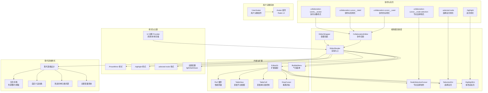
```mermaid
graph TB
subgraph "编辑器渲染层"
ER["EditorRender<br/>渲染入口"]
EC["CollaborationEditor<br/>协作渲染"]
EW["EditorWrapper<br/>容器包装"]
NSC["NodeSelectionCursor<br/>节点选择协作"]
END["SelectionExt<br/>选择高亮"]
END2["HighlightExt<br/>多色彩高亮"]
end
subgraph "内核与扩展"
KIT["EditorKit<br/>扩展装配"]
PERF["Perf 插件<br/>性能测量"]
TABLEVIEW["TableView<br/>表格节点视图"]
TABLECELL["TableCell<br/>表格单元格控制"]
BMENU["BubbleMenu<br/>气泡菜单"]
DROP["DropCursor<br/>拖拽光标"]
end
subgraph "样式与主题"
CSS[".ProseMirror 样式"]
CSS2[".highlight 样式"]
CSS3[".selected-node 样式"]
THEME["主题配置<br/>light/dark/base"]
UITHEME["UI 主题 Provider<br/>系统/本地存储"]
end
subgraph "协作与高亮"
CURSOR[".collaboration-cursor__caret<br/>协作光标样式"]
LABEL[".collaboration-cursor__label<br/>协作标签样式"]
AVATAR[".collaboration-carets__avatar<br/>协作头像样式"]
NODESEL[".collaboration-cursor__node-selection<br/>节点选择样式"]
HIGHLIGHT[".highlight<br/>高亮样式"]
SELECTION[".selected-node<br/>选择高亮样式"]
end
subgraph "用户头像系统"
USERAV["UserAvatar<br/>用户头像组件"]
AVCOMP["Avatar 组件<br/>Radix UI"]
end
subgraph "现代表格样式"
MODERN["现代表格设计"]
GRIPS["交互手柄<br/>列调整/行抓取"]
SCROLL["自定义滚动条"]
CELLSPACING["改进的单元格间距"]
THEMEVARS["主题变量系统"]
end
ER --> KIT
EC --> ER
EW --> ER
KIT --> PERF
KIT --> TABLEVIEW
KIT --> TABLECELL
KIT --> END
KIT --> END2
KIT --> NSC
KIT --> DROP
ER --> BMENU
ER --> CSS
ER --> CSS2
ER --> CSS3
ER --> THEME
ER --> MODERN
MODERN --> GRIPS
MODERN --> SCROLL
MODERN --> CELLSPACING
MODERN --> THEMEVARS
UITHEME --> ER
CURSOR --> EC
LABEL --> EC
AVATAR --> EC
NODESEL --> NSC
HIGHLIGHT --> END2
SELECTION --> END
USERAV --> AVCOMP
```

**图表来源**
- [packages/editor/src/editor/render.tsx](file://packages/editor/src/editor/render.tsx#L1-L115)
- [packages/editor/src/editor/collaboration.tsx](file://packages/editor/src/editor/collaboration.tsx#L93-L141)
- [packages/editor/src/components/editor-wrapper.tsx](file://packages/editor/src/components/editor-wrapper.tsx#L1-L18)
- [packages/editor/src/editor/kit.tsx](file://packages/editor/src/editor/kit.tsx#L1-L87)
- [packages/editor/src/styles/editor.css](file://packages/editor/src/styles/editor.css#L1-L166)
- [packages/editor/src/styles/editor.ts](file://packages/editor/src/styles/editor.ts#L793-L862)
- [packages/editor/src/extensions/hightline/style.css](file://packages/editor/src/extensions/hightline/style.css#L1-L92)
- [packages/editor/src/extensions/selection/selection.ts](file://packages/editor/src/extensions/selection/selection.ts#L49-L75)
- [packages/editor/src/extensions/collaboration-cursor/collaboration-cursor.ts](file://packages/editor/src/extensions/collaboration-cursor/collaboration-cursor.ts#L1-L230)
- [packages/ui/src/components/ui/avatar.tsx](file://packages/ui/src/components/ui/avatar.tsx#L1-L48)
- [packages/core/src/components/UserAvatar.tsx](file://packages/core/src/components/UserAvatar.tsx#L1-L28)

**章节来源**
- [packages/editor/src/editor/render.tsx](file://packages/editor/src/editor/render.tsx#L1-L115)
- [packages/editor/src/editor/collaboration.tsx](file://packages/editor/src/editor/collaboration.tsx#L93-L141)
- [packages/editor/src/components/editor-wrapper.tsx](file://packages/editor/src/components/editor-wrapper.tsx#L1-L18)
- [packages/editor/src/editor/kit.tsx](file://packages/editor/src/editor/kit.tsx#L1-L87)
- [packages/editor/src/styles/editor.css](file://packages/editor/src/styles/editor.css#L1-L166)
- [packages/editor/src/styles/editor.ts](file://packages/editor/src/styles/editor.ts#L793-L862)
- [packages/editor/src/styles/theme.ts](file://packages/editor/src/styles/theme.ts#L1-L55)
- [packages/ui/src/components/theme/index.tsx](file://packages/ui/src/components/theme/index.tsx#L1-L75)

## 核心组件
- 渲染入口 EditorRender：负责装配扩展、初始化编辑器、挂载内容与侧边目录，并通过 ThemeProvider 提供主题上下文。
- 协作渲染 CollaborationEditor：在 EditorRender 基础上增加协作 Provider 的生命周期管理（连接/断开/销毁），支持多人协作光标渲染，包括头像支持。
- 编辑器包装器 EditorWrapper：提供基础容器与背景样式，承载子组件。
- 内核装配 EditorKit：集中解析扩展、内置扩展、斜杠菜单等，统一注入到编辑器实例。
- 节点选择协作 NodeSelectionCursor：扩展协作光标功能，专门处理节点级别的选择可视化，避免与光标字段冲突。
- 选择高亮扩展 SelectionExt：通过装饰系统实现智能选择高亮，支持节点级选择和范围选择。
- 多色彩高亮扩展 HighlightExt：提供丰富的高亮颜色选择，支持主题适配和交互式菜单。
- 现代表格系统：包含表格节点视图、表格单元格控制、交互手柄、自定义滚动条和改进的单元格间距。
- 样式与主题：.ProseMirror 样式定义占位符、选区隐藏等；主题配置提供 light/dark/base；UI 层提供系统主题切换与持久化。

**章节来源**
- [packages/editor/src/editor/render.tsx](file://packages/editor/src/editor/render.tsx#L1-L115)
- [packages/editor/src/editor/collaboration.tsx](file://packages/editor/src/editor/collaboration.tsx#L93-L141)
- [packages/editor/src/components/editor-wrapper.tsx](file://packages/editor/src/components/editor-wrapper.tsx#L1-L18)
- [packages/editor/src/editor/kit.tsx](file://packages/editor/src/editor/kit.tsx#L1-L87)
- [packages/editor/src/extensions/selection/selection.ts](file://packages/editor/src/extensions/selection/selection.ts#L77-L222)
- [packages/editor/src/extensions/hightline/index.ts](file://packages/editor/src/extensions/hightline/index.ts#L54-L63)
- [packages/editor/src/extensions/collaboration-cursor/collaboration-cursor.ts](file://packages/editor/src/extensions/collaboration-cursor/collaboration-cursor.ts#L103-L227)
- [packages/editor/src/styles/editor.css](file://packages/editor/src/styles/editor.css#L1-L166)
- [packages/editor/src/styles/theme.ts](file://packages/editor/src/styles/theme.ts#L1-L55)
- [packages/ui/src/components/theme/index.tsx](file://packages/ui/src/components/theme/index.tsx#L1-L75)

## 架构总览
编辑器采用"入口渲染 + 扩展装配 + 视图更新"的分层架构：
- 入口层：EditorRender/CollaborationEditor 负责创建/销毁编辑器实例，挂载 EditorContent 并渲染侧边目录。
- 内核层：EditorKit 解析扩展列表，注入基础扩展（段落、文本、硬回车、尾随节点、唯一 ID、性能插件等），并支持动态扩展与斜杠菜单。
- 视图层：各扩展提供 NodeView 或插件，如 TableView 封装表格 DOM 结构；BubbleMenu 提供上下文菜单；Perf 插件在事务变更时进行渲染耗时测量。
- 协作层：CollaborationCursor 扩展提供实时协作光标渲染，支持用户名标签、颜色标识和动画效果；NodeSelectionCursor 扩展提供节点选择协作可视化。
- 高亮层：Highlight 扩展提供多色彩高亮功能，Selection 扩展提供智能选择高亮装饰。
- 现代表格层：TableCell 扩展提供交互手柄控制，包括列调整手柄、行抓取、表格选择器控制；自定义滚动条样式和改进的单元格间距。
- 样式层：基于 styled-components 的 ThemeProvider 与 .ProseMirror 样式，结合 UI 主题系统实现明暗主题与系统跟随。

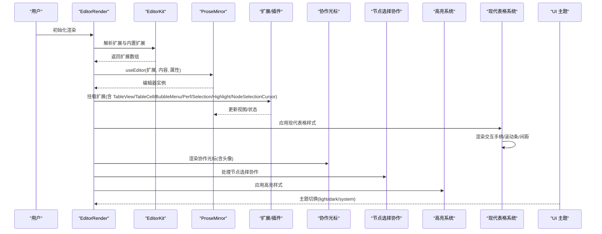
```mermaid
sequenceDiagram
participant U as "用户"
participant ER as "EditorRender"
participant KIT as "EditorKit"
participant PM as "ProseMirror"
participant EXT as "扩展/插件"
participant COL as "协作光标"
participant NSC as "节点选择协作"
participant HL as "高亮系统"
participant MODERN as "现代表格系统"
participant UI as "UI 主题"
U->>ER : 初始化渲染
ER->>KIT : 解析扩展与内置扩展
KIT-->>ER : 返回扩展数组
ER->>PM : useEditor(扩展, 内容, 属性)
PM-->>ER : 编辑器实例
ER->>EXT : 挂载扩展(含 TableView/TableCell/BubbleMenu/Perf/Selection/Highlight/NodeSelectionCursor)
EXT-->>PM : 更新视图/状态
ER->>MODERN : 应用现代表格样式
MODERN->>MODERN : 渲染交互手柄/滚动条/间距
ER->>COL : 渲染协作光标(含头像)
ER->>NSC : 处理节点选择协作
ER->>HL : 应用高亮样式
UI-->>ER : 主题切换(light/dark/system)
```

**图表来源**
- [packages/editor/src/editor/render.tsx](file://packages/editor/src/editor/render.tsx#L1-L115)
- [packages/editor/src/editor/kit.tsx](file://packages/editor/src/editor/kit.tsx#L1-L87)
- [packages/editor/src/extensions/table/table/table-view.ts](file://packages/editor/src/extensions/table/table/table-view.ts#L62-L115)
- [packages/editor/src/extensions/table/table-cell/index.tsx](file://packages/editor/src/extensions/table/table-cell/index.tsx#L149-L250)
- [packages/editor/src/components/bubble-menu.tsx](file://packages/editor/src/components/bubble-menu.tsx#L1-L84)
- [packages/editor/src/extensions/perf/perf.ts](file://packages/editor/src/extensions/perf/perf.ts#L1-L41)
- [packages/editor/src/editor/collaboration.tsx](file://packages/editor/src/editor/collaboration.tsx#L74-L77)
- [packages/editor/src/extensions/hightline/index.ts](file://packages/editor/src/extensions/hightline/index.ts#L54-L63)
- [packages/editor/src/extensions/selection/selection.ts](file://packages/editor/src/extensions/selection/selection.ts#L77-L222)
- [packages/editor/src/extensions/collaboration-cursor/collaboration-cursor.ts](file://packages/editor/src/extensions/collaboration-cursor/collaboration-cursor.ts#L103-L227)
- [packages/ui/src/components/theme/index.tsx](file://packages/ui/src/components/theme/index.tsx#L1-L75)

## 详细组件分析

### 渲染入口与容器包装
- EditorRender
  - 功能：装配扩展、初始化编辑器、设置可编辑属性、配置 DOM 属性（类名、拼写检查、警告抑制）、挂载 EditorContent 与目录。
  - 关键点：通过 useEditor 创建实例；使用 StyledEditor 容器；在 ThemeProvider 下渲染；支持 onBlur 回调。
- CollaborationEditor
  - 功能：在协作场景下管理 Provider 生命周期，确保卸载时断开连接与销毁资源。新增协作光标扩展配置，支持头像渲染。
- EditorWrapper
  - 功能：提供基础容器与背景样式，承载子组件。

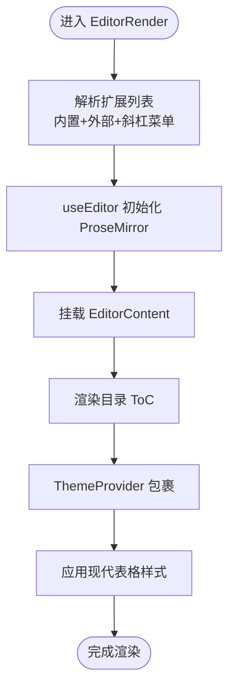
```mermaid
flowchart TD
Start(["进入 EditorRender"]) --> ParseExt["解析扩展列表<br/>内置+外部+斜杠菜单"]
ParseExt --> InitPM["useEditor 初始化 ProseMirror"]
InitPM --> MountContent["挂载 EditorContent"]
MountContent --> RenderToc["渲染目录 ToC"]
RenderToc --> ThemeWrap["ThemeProvider 包裹"]
ThemeWrap --> ModernTable["应用现代表格样式"]
ModernTable --> End(["完成渲染"])
```

**图表来源**
- [packages/editor/src/editor/render.tsx](file://packages/editor/src/editor/render.tsx#L1-L115)
- [packages/editor/src/editor/collaboration.tsx](file://packages/editor/src/editor/collaboration.tsx#L93-L141)
- [packages/editor/src/components/editor-wrapper.tsx](file://packages/editor/src/components/editor-wrapper.tsx#L1-L18)

**章节来源**
- [packages/editor/src/editor/render.tsx](file://packages/editor/src/editor/render.tsx#L1-L115)
- [packages/editor/src/editor/collaboration.tsx](file://packages/editor/src/editor/collaboration.tsx#L93-L141)
- [packages/editor/src/components/editor-wrapper.tsx](file://packages/editor/src/components/editor-wrapper.tsx#L1-L18)

### 协作光标渲染机制
- CollaborationCursor 扩展
  - 功能：提供实时协作光标渲染，支持用户名标签、颜色标识和动画效果。
  - 头像支持：在 render 函数中动态创建头像元素，支持用户头像 URL 渲染。
  - 样式系统：.collaboration-cursor__caret 和 .collaboration-cursor__label 类定义光标样式和标签显示；.collaboration-carets__avatar 定义头像样式。
  - 动画效果：光标闪烁动画（cursor-blink）和标签出现动画（cursor-label-appear）。
  - 主题适配：深色模式下的标签阴影和颜色调整。
- NodeSelectionCursor 扩展
  - 功能：专门处理节点级别的协作选择可视化，避免与光标字段冲突。
  - 设计原理：使用 awareness 的单独 'nodeSelection' 字段存储节点选择状态，避免与 yCursorPlugin 冲突。
  - 装饰系统：通过 createNodeSelectionDecorations 为远程用户的节点选择创建装饰。
  - 位置验证：确保选择位置的有效性，处理边界情况。
  - 回退机制：当节点装饰失败时提供回退样式。

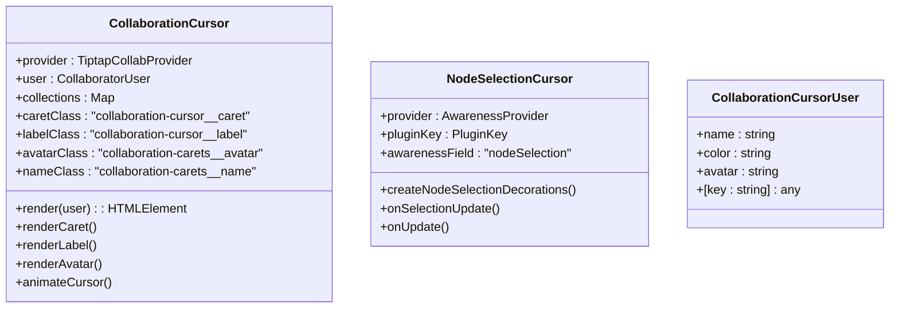
```mermaid
classDiagram
class CollaborationCursor {
+provider : TiptapCollabProvider
+user : CollaboratorUser
+render(user) : HTMLElement
+collections : Map
+caretClass : "collaboration-cursor__caret"
+labelClass : "collaboration-cursor__label"
+avatarClass : "collaboration-carets__avatar"
+nameClass : "collaboration-carets__name"
+renderCaret()
+renderLabel()
+renderAvatar()
+animateCursor()
}
class NodeSelectionCursor {
+provider : AwarenessProvider
+pluginKey : PluginKey
+createNodeSelectionDecorations()
+onSelectionUpdate()
+onUpdate()
+awarenessField : "nodeSelection"
}
class CollaborationCursorUser {
+name : string
+color : string
+avatar : string
+[key : string] : any
}
```

**图表来源**
- [packages/editor/src/editor/collaboration.tsx](file://packages/editor/src/editor/collaboration.tsx#L82-L112)
- [packages/editor/src/extensions/collaboration-cursor/collaboration-cursor.ts](file://packages/editor/src/extensions/collaboration-cursor/collaboration-cursor.ts#L5-L25)
- [packages/editor/src/extensions/collaboration-cursor/collaboration-cursor.ts](file://packages/editor/src/extensions/collaboration-cursor/collaboration-cursor.ts#L103-L227)

**章节来源**
- [packages/editor/src/editor/collaboration.tsx](file://packages/editor/src/editor/collaboration.tsx#L82-L112)
- [packages/editor/src/extensions/collaboration-cursor/collaboration-cursor.ts](file://packages/editor/src/extensions/collaboration-cursor/collaboration-cursor.ts#L30-L94)
- [packages/editor/src/extensions/collaboration-cursor/collaboration-cursor.ts](file://packages/editor/src/extensions/collaboration-cursor/collaboration-cursor.ts#L103-L227)
- [packages/editor/src/styles/editor.css](file://packages/editor/src/styles/editor.css#L119-L166)

### 多色彩高亮系统
- Highlight 扩展
  - 功能：提供多色彩高亮功能，支持 8 种预定义颜色（黄色、绿色、蓝色、粉色、紫色、橙色、红色、灰色）。
  - 颜色系统：HIGHLIGHT_COLORS 数组定义每种颜色的明暗主题变体。
  - 主题适配：深色模式下的颜色转换和文本对比度优化。
  - 交互菜单：HighlightStaticMenu 提供颜色选择界面和移除功能。
- 样式系统
  - 基础样式：.highlight 类定义高亮的基本外观和过渡效果。
  - 默认颜色：未指定颜色时使用黄色高亮。
  - 深色适配：针对每种颜色提供深色模式的精确转换。
  - 选择样式：高亮文本被选中时的半透明背景效果。

```mermaid
classDiagram
class HighlightExtension {
+colors : HIGHLIGHT_COLORS
+multicolor : true
+HTMLAttributes : {class : "highlight"}
+configure()
}
class HighlightStaticMenu {
+currentColor : string
+isHighlightActive : boolean
+setHighlight()
+removeHighlight()
+renderColorPalette()
}
class HIGHLIGHT_COLORS {
+name : string
+light : {bg : string, text : string}
+dark : {bg : string, text : string}
}
```

**图表来源**
- [packages/editor/src/extensions/hightline/index.ts](file://packages/editor/src/extensions/hightline/index.ts#L8-L49)
- [packages/editor/src/extensions/hightline/static-menu.tsx](file://packages/editor/src/extensions/hightline/static-menu.tsx#L74-L166)
- [packages/editor/src/extensions/hightline/style.css](file://packages/editor/src/extensions/hightline/style.css#L4-L92)

**章节来源**
- [packages/editor/src/extensions/hightline/index.ts](file://packages/editor/src/extensions/hightline/index.ts#L54-L63)
- [packages/editor/src/extensions/hightline/static-menu.tsx](file://packages/editor/src/extensions/hightline/static-menu.tsx#L74-L166)
- [packages/editor/src/extensions/hightline/style.css](file://packages/editor/src/extensions/hightline/style.css#L1-L92)

### 选择高亮装饰系统
- SelectionExt 扩展
  - 功能：通过装饰系统实现智能选择高亮，支持节点级选择和范围选择。
  - 装饰系统：getDecorations 函数根据当前选择生成 DecorationSet。
  - 节点选择：NodeSelection 时对整个节点应用 selected-node 类。
  - 范围选择：TextSelection 和 AllSelection 时对顶级块级节点应用高亮。
  - 键盘处理：支持 Ctrl+A/Command+A 的自定义全选行为。
  - 交互保护：在只读模式下防止所有交互事件。
- 样式系统
  - 基础样式：.selected-node 类定义选择高亮的轮廓和圆角。
  - 主题适配：深色模式下的不同轮廓颜色和悬停效果。
  - 动画效果：0.15秒的轮廓过渡动画。

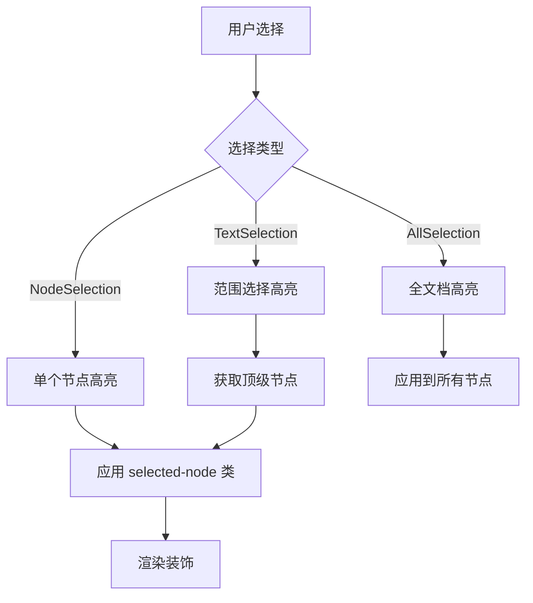
```mermaid
flowchart TD
Selection["用户选择"] --> Type{"选择类型"}
Type --> |NodeSelection| SingleNode["单个节点高亮"]
Type --> |TextSelection| RangeSelect["范围选择高亮"]
Type --> |AllSelection| FullSelect["全文档高亮"]
SingleNode --> Decorations["应用 selected-node 类"]
RangeSelect --> TopLevel["获取顶级节点"]
TopLevel --> Decorations
FullSelect --> AllNodes["应用到所有节点"]
Decorations --> Render["渲染装饰"]
```

**图表来源**
- [packages/editor/src/extensions/selection/selection.ts](file://packages/editor/src/extensions/selection/selection.ts#L49-L75)
- [packages/editor/src/styles/editor.css](file://packages/editor/src/styles/editor.css#L42-L60)

**章节来源**
- [packages/editor/src/extensions/selection/selection.ts](file://packages/editor/src/extensions/selection/selection.ts#L77-L222)
- [packages/editor/src/styles/editor.css](file://packages/editor/src/styles/editor.css#L42-L60)

### 扩展与视图：表格节点视图与现代样式
- TableView
  - 功能：封装表格 DOM 结构（wrapper、scrollWrapper、table、colgroup、tbody），维护 contentDOM；在 update 中根据节点属性更新列宽与块 ID；忽略特定属性变更以减少重绘。
  - 影响：对表格渲染性能与交互（滚动、列宽）有直接影响。
- TableCell 扩展
  - 功能：提供表格单元格的交互控制，包括列调整手柄、行抓取、表格选择器控制。
  - 交互手柄：通过装饰系统动态创建交互元素，支持悬停效果和选择状态。
  - React 集成：使用 React Root 管理交互元素的生命周期。
  - 事件处理：支持鼠标事件和键盘快捷键。
- 现代表格样式
  - 设计理念：采用圆角边框、分离式边框、改进的悬停效果和选择状态。
  - 主题变量：通过 CSS 自定义属性实现主题适配，包括边框颜色、背景色、悬停效果等。
  - 交互反馈：悬停时的渐变过渡、选择时的轮廓效果和阴影动画。
  - 自定义滚动条：针对表格内容的自定义滚动条样式，提升滚动体验。

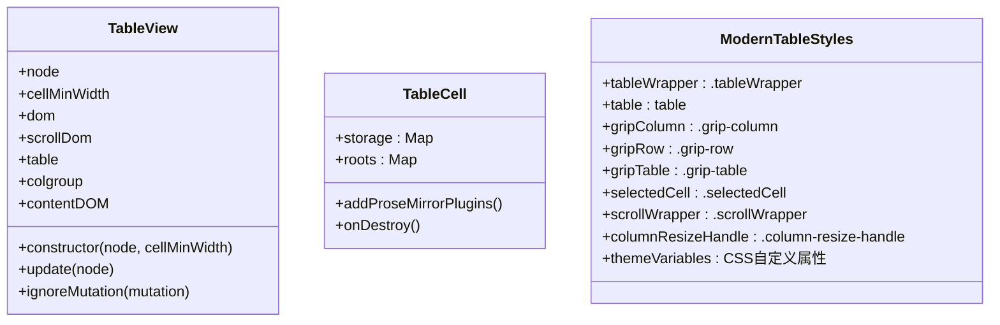
```mermaid
classDiagram
class TableView {
+node
+cellMinWidth
+dom
+scrollDom
+table
+colgroup
+contentDOM
+constructor(node, cellMinWidth)
+update(node)
+ignoreMutation(mutation)
}
class TableCell {
+addProseMirrorPlugins()
+storage : Map
+roots : Map
+onDestroy()
}
class ModernTableStyles {
+tableWrapper : .tableWrapper
+table : table
+gripColumn : .grip-column
+gripRow : .grip-row
+gripTable : .grip-table
+selectedCell : .selectedCell
+scrollWrapper : .scrollWrapper
+columnResizeHandle : .column-resize-handle
+themeVariables : CSS自定义属性
}
```

**图表来源**
- [packages/editor/src/extensions/table/table/table-view.ts](file://packages/editor/src/extensions/table/table/table-view.ts#L62-L115)
- [packages/editor/src/extensions/table/table-cell/index.tsx](file://packages/editor/src/extensions/table/table-cell/index.tsx#L149-L250)
- [packages/editor/src/styles/editor.ts](file://packages/editor/src/styles/editor.ts#L164-L526)

**章节来源**
- [packages/editor/src/extensions/table/table/table-view.ts](file://packages/editor/src/extensions/table/table/table-view.ts#L62-L115)
- [packages/editor/src/extensions/table/table-cell/index.tsx](file://packages/editor/src/extensions/table/table-cell/index.tsx#L149-L250)
- [packages/editor/src/styles/editor.ts](file://packages/editor/src/styles/editor.ts#L164-L526)

### 现代表格样式系统详解
**更新** 新增完整的表格样式系统，涵盖现代设计、边框半径处理、悬停效果和响应式设计

- 现代表格设计规范
  - 圆角边框：表格和表头使用 8px 边框半径，提供现代感的视觉效果
  - 分离式边框：使用 border-collapse: separate 确保边框分离，避免合并边框的复杂性
  - 边框半径处理：表头使用 7px 半径，确保与表格主体的视觉一致性
  - 背景颜色：表头使用浅色背景，单元格使用透明背景，支持主题适配
- 悬停效果系统
  - 行悬停：鼠标悬停时整行背景色渐变，提供清晰的选择指示
  - 控制手柄悬停：列调整手柄和行抓取在悬停时显示不同的视觉反馈
  - 选中状态：使用 2px 边框突出显示选中单元格，支持主题颜色
- 主题变量系统
  - CSS 自定义属性：通过 --table-* 变量实现主题适配
  - 轻色主题：浅色边框、浅灰背景、深色文字
  - 深色主题：深色边框、深灰背景、浅色文字
  - 动态颜色：支持运行时主题切换的颜色变化
- 交互手柄设计
  - 列调整手柄：位于表头上方，显示半透明圆点和加号图标
  - 行抓取：位于表格左侧，覆盖整行高度，显示垂直居中的圆点
  - 表格选择器：位于左上角，作为整体选择的控制点
- 响应式设计考虑
  - 水平滚动：表格容器支持水平滚动，避免内容溢出
  - 自适应宽度：单元格最小宽度 100px，支持内容自适应
  - 移动端优化：在移动设备上提供合适的触摸交互

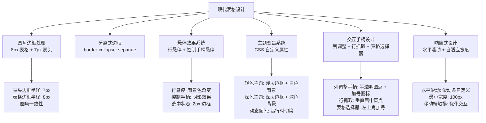
```mermaid
flowchart TD
ModernTable["现代表格设计"] --> BorderRadius["圆角边框处理<br/>8px 表格 + 7px 表头"]
ModernTable --> BorderSeparation["分离式边框<br/>border-collapse: separate"]
ModernTable --> HoverEffects["悬停效果系统<br/>行悬停 + 控制手柄悬停"]
ModernTable --> ThemeVars["主题变量系统<br/>CSS 自定义属性"]
ModernTable --> GripDesign["交互手柄设计<br/>列调整 + 行抓取 + 表格选择器"]
ModernTable --> Responsive["响应式设计<br/>水平滚动 + 自适应宽度"]
BorderRadius --> BorderRadiusDetails["表头边框半径: 7px<br/>表格边框半径: 8px<br/>圆角一致性"]
HoverEffects --> HoverDetails["行悬停: 背景色渐变<br/>控制手柄: 阴影效果<br/>选中状态: 2px 边框"]
ThemeVars --> ThemeDetails["轻色主题: 浅灰边框 + 白色背景<br/>深色主题: 深灰边框 + 深色背景<br/>动态颜色: 运行时切换"]
GripDesign --> GripDetails["列调整手柄: 半透明圆点 + 加号图标<br/>行抓取: 垂直居中圆点<br/>表格选择器: 左上角加号"]
Responsive --> ResponsiveDetails["水平滚动: 滚动条自定义<br/>最小宽度: 100px<br/>移动端触摸: 优化交互"]
```

**图表来源**
- [packages/editor/src/styles/editor.ts](file://packages/editor/src/styles/editor.ts#L218-L529)
- [packages/editor/src/styles/theme.ts](file://packages/editor/src/styles/theme.ts#L43-L96)

**章节来源**
- [packages/editor/src/styles/editor.ts](file://packages/editor/src/styles/editor.ts#L218-L529)
- [packages/editor/src/styles/theme.ts](file://packages/editor/src/styles/theme.ts#L43-L96)

### 现代表格交互元素详解
- 列调整手柄（Column Grip）
  - 位置：位于表头上方，垂直居中显示。
  - 视觉效果：悬停时显示半透明圆点，点击时显示加号图标。
  - 交互状态：普通状态、悬停状态、选中状态，分别对应不同的背景色和阴影效果。
  - 动画过渡：使用 CSS 过渡效果实现平滑的状态切换。
- 行抓取（Row Grip）
  - 位置：位于表格左侧，覆盖整行高度。
  - 视觉效果：垂直居中的圆点图标，支持首行和末行的特殊样式。
  - 交互状态：与列手柄相同的三态设计，支持选中状态的高亮效果。
  - React 集成：使用 React Root 渲染图标组件，支持图标状态的动态更新。
- 表格选择器（Table Grip）
  - 位置：位于表格左上角，作为整体选择的控制点。
  - 视觉效果：小尺寸的加号图标，支持悬停和选中状态。
  - 交互行为：点击时选择整个表格，支持与其他选择操作的协调。
- 选择状态管理
  - 单元格选择：.selectedCell 类提供选中单元格的轮廓效果。
  - 行选择：通过 isRowSelected 函数检测行选择状态，动态应用样式。
  - 表格选择：通过 isTableSelected 函数检测表格选择状态，更新控制点样式。

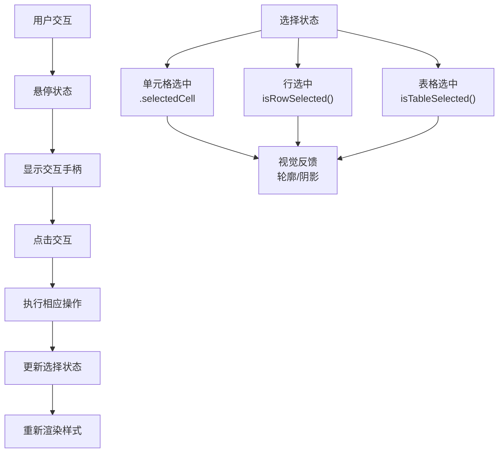
```mermaid
flowchart TD
Interaction["用户交互"] --> Hover["悬停状态"]
Hover --> ShowGrip["显示交互手柄"]
ShowGrip --> Click["点击交互"]
Click --> Action["执行相应操作"]
Action --> UpdateState["更新选择状态"]
UpdateState --> Render["重新渲染样式"]
State["选择状态"] --> CellSelected["单元格选中<br/>.selectedCell"]
State --> RowSelected["行选中<br/>isRowSelected()"]
State --> TableSelected["表格选中<br/>isTableSelected()"]
CellSelected --> VisualFeedback["视觉反馈<br/>轮廓/阴影"]
RowSelected --> VisualFeedback
TableSelected --> VisualFeedback
```

**图表来源**
- [packages/editor/src/extensions/table/table-cell/index.tsx](file://packages/editor/src/extensions/table/table-cell/index.tsx#L170-L242)
- [packages/editor/src/styles/editor.ts](file://packages/editor/src/styles/editor.ts#L260-L474)

**章节来源**
- [packages/editor/src/extensions/table/table-cell/index.tsx](file://packages/editor/src/extensions/table/table-cell/index.tsx#L170-L242)
- [packages/editor/src/styles/editor.ts](file://packages/editor/src/styles/editor.ts#L260-L474)

### 自定义滚动条样式
- 表格滚动条
  - 设计目标：为表格内容提供细小的水平滚动条，不影响整体布局。
  - 样式实现：使用 ::-webkit-scrollbar 系列伪元素定义滚动条外观。
  - 主题适配：滚动条颜色根据当前主题自动调整，保持视觉一致性。
  - 交互反馈：悬停时滚动条颜色加深，提供明确的交互提示。
- 滚动区域设计
  - 边界处理：通过 padding 和 margin 调整滚动区域的可见边界。
  - 边框效果：滚动区域的左右边框在滚动时显示，提供视觉引导。
  - 过渡动画：边框颜色的过渡效果提升用户体验的流畅性。
- 通用滚动条
  - 应用范围：影响整个编辑器的滚动条样式，保持一致的视觉体验。
  - 移动端优化：在移动设备上隐藏滚动条，避免误触操作。

**章节来源**
- [packages/editor/src/styles/editor.ts](file://packages/editor/src/styles/editor.ts#L478-L526)
- [packages/ui/globals.css](file://packages/ui/globals.css#L92-L130)

### 改进的单元格间距
- 间距规范
  - 内边距：单元格内边距设置为 4px 8px，提供舒适的文本阅读空间。
  - 最小宽度：设置最小宽度为 100px，确保内容的可读性和布局稳定性。
  - 分隔线：使用 1px 边框实现清晰的行列分隔，支持主题颜色适配。
- 悬停效果
  - 背景色：悬停时单元格背景色渐变，提供明确的交互反馈。
  - 过渡动画：0.15秒的过渡时间，确保动画的自然流畅。
- 选择状态
  - 选中效果：.selectedCell 类提供选中单元格的轮廓效果和半透明背景。
  - 边框样式：选中时的 2px 边框突出显示选择状态，支持主题颜色。
  - 层级管理：选中效果的 z-index 确保在其他元素之上显示。

**章节来源**
- [packages/editor/src/styles/editor.ts](file://packages/editor/src/styles/editor.ts#L229-L258)

### 节点映射与选择
- select-node-by-dom
  - 功能：从 DOM 节点定位到 ProseMirror 节点，处理特殊节点类型（如 doc、table）与偏移修正，返回节点、位置与 DOM 元素。
  - 应用：用于点击/拖拽选择、上下文菜单触发等场景。

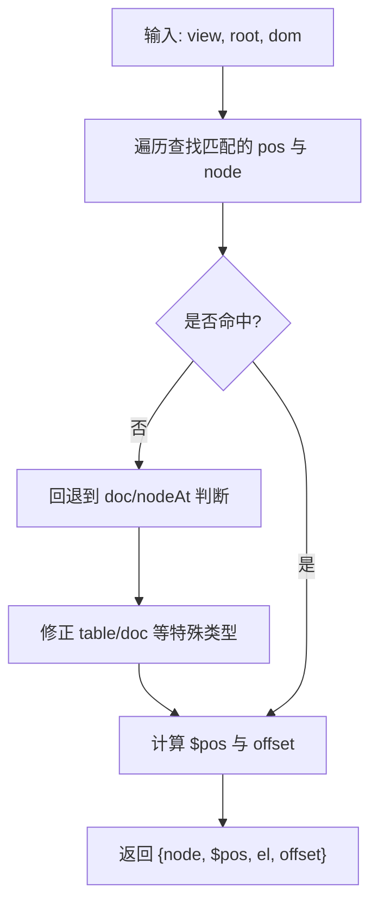
```mermaid
flowchart TD
A["输入: view, root, dom"] --> B["遍历查找匹配的 pos 与 node"]
B --> C{"是否命中?"}
C -- 否 --> D["回退到 doc/nodeAt 判断"]
D --> E["修正 table/doc 等特殊类型"]
E --> F["计算 $pos 与 offset"]
C -- 是 --> F
F --> G["返回 {node, $pos, el, offset}"]
```

**图表来源**
- [packages/editor/src/utilities/select-node-by-dom.ts](file://packages/editor/src/utilities/select-node-by-dom.ts#L108-L166)

**章节来源**
- [packages/editor/src/utilities/select-node-by-dom.ts](file://packages/editor/src/utilities/select-node-by-dom.ts#L108-L166)

### 气泡菜单与上下文操作
- BubbleMenu
  - 功能：基于 Tiptap 内置气泡菜单或自定义 NodeBubbleMenu，支持按条件显示、定位参考矩形、避免拖拽过程消失等。
  - 集成：在 EditorRender 中作为编辑器子树的一部分被渲染。

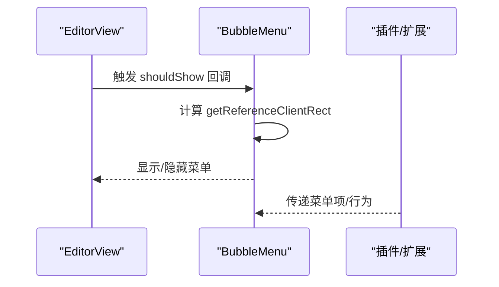
```mermaid
sequenceDiagram
participant V as "EditorView"
participant BM as "BubbleMenu"
participant P as "插件/扩展"
V->>BM : 触发 shouldShow 回调
BM->>BM : 计算 getReferenceClientRect
BM-->>V : 显示/隐藏菜单
P-->>BM : 传递菜单项/行为
```

**图表来源**
- [packages/editor/src/components/bubble-menu.tsx](file://packages/editor/src/components/bubble-menu.tsx#L1-L84)

**章节来源**
- [packages/editor/src/components/bubble-menu.tsx](file://packages/editor/src/components/bubble-menu.tsx#L1-L84)

### 性能测量与渲染观测
- Perf 插件
  - 功能：监听事务变更，提取分析负载，触发 measureRender 进行帧级渲染耗时测量，并输出日志。
- measureRender 工具
  - 功能：利用 performance.mark/measure 与 requestAnimationFrame 在下一帧测量渲染耗时，清理标记与度量。
- 使用建议：在高频编辑场景（如长文档、复杂表格）启用，结合浏览器性能面板进行分析。

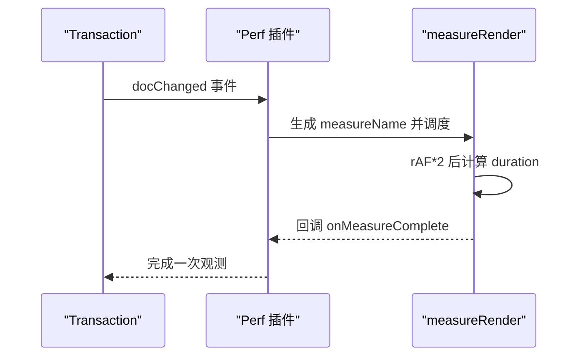
```mermaid
sequenceDiagram
participant TR as "Transaction"
participant PL as "Perf 插件"
participant UT as "measureRender"
TR->>PL : docChanged 事件
PL->>UT : 生成 measureName 并调度
UT->>UT : rAF*2 后计算 duration
UT-->>PL : 回调 onMeasureComplete
PL-->>TR : 完成一次观测
```

**图表来源**
- [packages/editor/src/extensions/perf/perf.ts](file://packages/editor/src/extensions/perf/perf.ts#L1-L41)
- [packages/editor/src/extensions/perf/utilities.ts](file://packages/editor/src/extensions/perf/utilities.ts#L1-L133)

**章节来源**
- [packages/editor/src/extensions/perf/perf.ts](file://packages/editor/src/extensions/perf/perf.ts#L1-L41)
- [packages/editor/src/extensions/perf/utilities.ts](file://packages/editor/src/extensions/perf/utilities.ts#L1-L133)

### 事件处理：输入、焦点与撤销重做
- 输入与撤销重做
  - 通过扩展中的 handleDOMEvents 捕获 beforeinput，区分 historyUndo/historyRedo 并执行相应命令，保证可编辑状态下的撤销重做一致性。
- 焦点管理
  - EditorKit 中启用 Focus 扩展，配置模式为浅层优先，有助于在复杂嵌套结构中正确聚焦最近的可编辑节点。
- 拖拽光标
  - DropCursor 扩展提供拖拽时的光标指示，支持自定义颜色、宽度和类名配置。

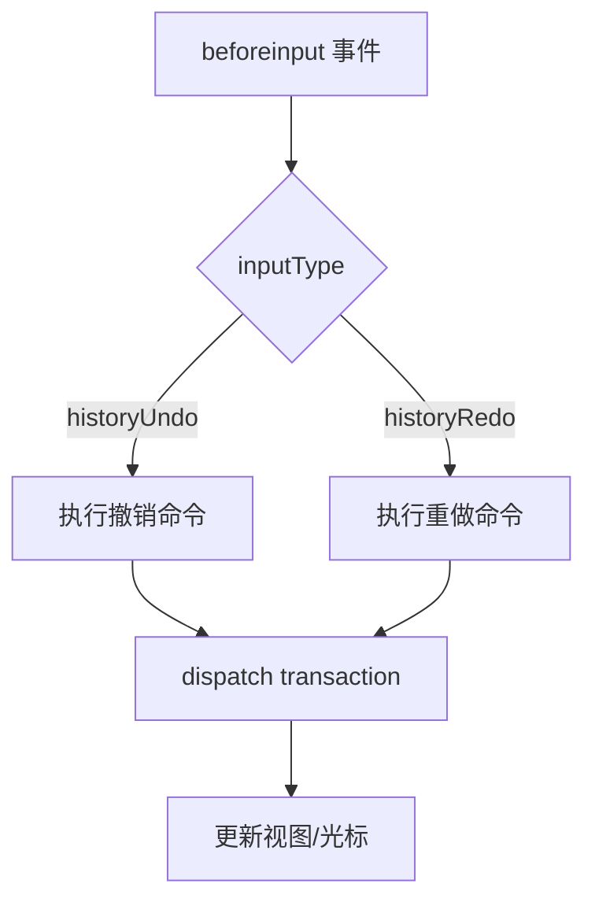
```mermaid
flowchart TD
Evt["beforeinput 事件"] --> Type{"inputType"}
Type -- historyUndo --> Undo["执行撤销命令"]
Type -- historyRedo --> Redo["执行重做命令"]
Undo --> Dispatch["dispatch transaction"]
Redo --> Dispatch
Dispatch --> View["更新视图/光标"]
```

**图表来源**
- [packages/editor/src/extensions/undo-redo/history.ts](file://packages/editor/src/extensions/undo-redo/history.ts#L409-L449)
- [packages/editor/src/editor/kit.tsx](file://packages/editor/src/editor/kit.tsx#L1-L87)
- [packages/editor/src/extensions/dropcursor/prosemirror-dropcursor.ts](file://packages/editor/src/extensions/dropcursor/prosemirror-dropcursor.ts#L11-L160)

**章节来源**
- [packages/editor/src/extensions/undo-redo/history.ts](file://packages/editor/src/extensions/undo-redo/history.ts#L409-L449)
- [packages/editor/src/editor/kit.tsx](file://packages/editor/src/editor/kit.tsx#L1-L87)
- [packages/editor/src/extensions/dropcursor/prosemirror-dropcursor.ts](file://packages/editor/src/extensions/dropcursor/prosemirror-dropcursor.ts#L11-L160)

### 样式系统与主题切换
- .ProseMirror 样式
  - 定义占位符、隐藏选区高亮、焦点阴影等视觉行为，确保一致的编辑体验。
- 主题配置
  - 提供 base/light/dark 颜色体系，统一表格、气泡菜单、斜杠菜单等组件的主题变量。
- UI 主题系统
  - 通过 ThemeProvider 支持 light/dark/system 三种模式，使用 localStorage 持久化用户选择；ModeToggle 提供切换入口。
- 协作样式
  - 新增协作光标和标签的专用样式类，支持动画效果和主题适配；头像样式定义了圆形裁剪、边框和缩放效果。
- 高亮样式
  - 多色彩高亮的完整样式系统，包括默认颜色、深色适配和选择效果。
- 节点选择样式
  - 新增 .collaboration-cursor__node-selection 类定义节点选择的轮廓、圆角和伪元素效果。
- 现代表格样式
  - 新增完整的现代表格设计规范，包括圆角边框、分离式边框、改进的悬停效果和选择状态。
  - 提供详细的 CSS 自定义属性定义，支持主题变量的动态切换。
  - 实现交互手柄的完整视觉设计，包括悬停、选中状态的渐变效果。

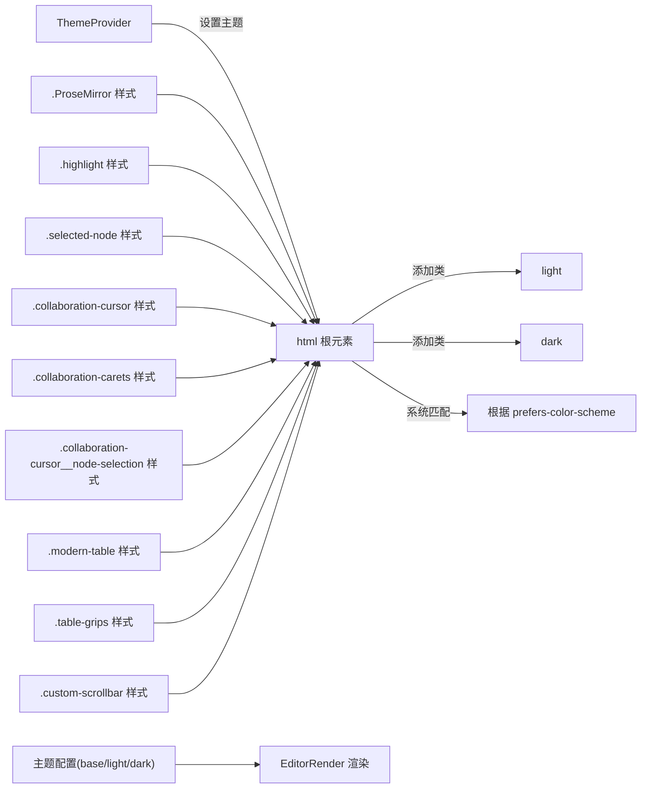
```mermaid
graph LR
Root["html 根元素"] --> |添加类| Light["light"]
Root --> |添加类| Dark["dark"]
Root --> |系统匹配| Sys["根据 prefers-color-scheme"]
ThemeProv["ThemeProvider"] --> |设置主题| Root
CSS[".ProseMirror 样式"] --> Root
CSS2[".highlight 样式"] --> Root
CSS3[".selected-node 样式"] --> Root
CSS4[".collaboration-cursor 样式"] --> Root
CSS5[".collaboration-carets 样式"] --> Root
CSS6[".collaboration-cursor__node-selection 样式"] --> Root
CSS7[".modern-table 样式"] --> Root
CSS8[".table-grips 样式"] --> Root
CSS9[".custom-scrollbar 样式"] --> Root
ThemeCfg["主题配置(base/light/dark)"] --> ER["EditorRender 渲染"]
```

**图表来源**
- [packages/editor/src/styles/editor.css](file://packages/editor/src/styles/editor.css#L1-L166)
- [packages/editor/src/styles/editor.ts](file://packages/editor/src/styles/editor.ts#L793-L862)
- [packages/editor/src/styles/theme.ts](file://packages/editor/src/styles/theme.ts#L1-L55)
- [packages/ui/src/components/theme/index.tsx](file://packages/ui/src/components/theme/index.tsx#L1-L75)

**章节来源**
- [packages/editor/src/styles/editor.css](file://packages/editor/src/styles/editor.css#L1-L166)
- [packages/editor/src/styles/editor.ts](file://packages/editor/src/styles/editor.ts#L793-L862)
- [packages/editor/src/styles/theme.ts](file://packages/editor/src/styles/theme.ts#L1-L55)
- [packages/ui/src/components/theme/index.tsx](file://packages/ui/src/components/theme/index.tsx#L1-L75)
- [packages/ui/src/components/theme/ModeToggle.tsx](file://packages/ui/src/components/theme/ModeToggle.tsx#L1-L37)

### 响应式布局与自动滚动
- useAutoScroll
  - 自动滚动至底部、检测用户滚动中断、ResizeObserver 监听尺寸变化后的滚动行为，适合聊天/日志/实时内容场景。
- 与编辑器结合
  - 可用于编辑器内容区域的自动滚动，避免频繁手动滚动；通过禁用开关避免打断用户阅读。

**章节来源**
- [packages/ui/src/hooks/use-auto-scroll.ts](file://packages/ui/src/hooks/use-auto-scroll.ts#L1-L135)

### 跨浏览器兼容性与无障碍支持
- 兼容性
  - 通过性能 API 检查（performance/mark/measure/now）与 PerformanceObserver 能力检测，确保在不支持的环境中优雅降级。
- 无障碍
  - .ProseMirror 样式中包含隐藏选区高亮与透明光标等可访问性相关设置；UI 主题系统提供系统主题跟随能力，便于屏幕阅读器识别。
- 实践建议
  - 在关键交互处提供键盘可达性提示；为复杂视图（如表格）提供语义化标签与行标题；确保颜色对比度满足 WCAG 要求。

**章节来源**
- [packages/editor/src/extensions/perf/utilities.ts](file://packages/editor/src/extensions/perf/utilities.ts#L1-L31)
- [packages/editor/src/styles/editor.css](file://packages/editor/src/styles/editor.css#L1-L39)
- [packages/ui/src/components/theme/index.tsx](file://packages/ui/src/components/theme/index.tsx#L1-L75)

### 用户头像系统集成
- UserAvatar 组件
  - 功能：集成 Radix UI Avatar 组件，支持头像图片和占位符 fallback。
  - 用户信息：从用户对象获取头像 URL，支持上传文件路径处理。
  - 样式集成：与协作光标头像样式协同工作，提供统一的头像显示体验。
- Avatar 组件
  - 基础组件：提供圆形头像容器、图片展示和占位符功能。
  - 样式定义：支持自定义类名和响应式设计。
- 协作头像集成
  - 在协作光标渲染中动态创建头像元素，支持用户头像 URL 渲染。
  - 头像样式：.collaboration-carets__avatar 定义了 16px 圆形头像，带边框和缩放效果。

**章节来源**
- [packages/core/src/components/UserAvatar.tsx](file://packages/core/src/components/UserAvatar.tsx#L1-L28)
- [packages/ui/src/components/ui/avatar.tsx](file://packages/ui/src/components/ui/avatar.tsx#L1-L48)
- [packages/editor/src/editor/collaboration.tsx](file://packages/editor/src/editor/collaboration.tsx#L93-L110)
- [packages/editor/src/styles/editor.css](file://packages/editor/src/styles/editor.css#L119-L127)

## 依赖关系分析
- 组件耦合
  - EditorRender 依赖 EditorKit 与样式模块；CollaborationEditor 在其基础上增加 Provider 生命周期；TableView 与 BubbleMenu 作为扩展参与视图更新。
  - 新增 SelectionExt、HighlightExt、NodeSelectionCursor 和 TableCell 扩展作为独立模块，通过装饰系统和插件机制集成。
  - 现代表格系统与主题系统紧密耦合，通过 CSS 自定义属性实现动态主题切换。
- 外部依赖
  - @tiptap/react/@tiptap/core 提供编辑器内核；styled-components 提供主题；lodash.throttle 提供节流工具；UI 主题系统来自 @kn/ui。
  - 协作扩展依赖 @tiptap/extension-collaboration 和 @tiptap/extension-collaboration-caret。
  - NodeSelectionCursor 依赖 awareness 状态管理和装饰系统。
  - TableCell 扩展依赖 React DOM Client 用于交互元素的渲染管理。
- 循环依赖
  - 当前结构未见明显循环依赖；扩展通过插件/NodeView 注入，避免直接互相引用。

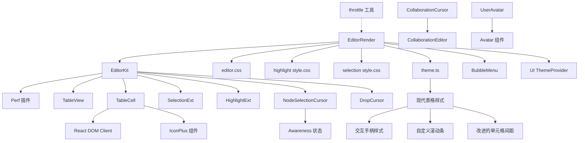
```mermaid
graph TB
ER["EditorRender"] --> KIT["EditorKit"]
ER --> CSS["editor.css"]
ER --> CSS2["highlight style.css"]
ER --> CSS3["selection style.css"]
ER --> THEME["theme.ts"]
ER --> BM["BubbleMenu"]
KIT --> PERF["Perf 插件"]
KIT --> TV["TableView"]
KIT --> TC["TableCell"]
KIT --> SE["SelectionExt"]
KIT --> HE["HighlightExt"]
KIT --> NSC["NodeSelectionCursor"]
KIT --> DC["DropCursor"]
ER --> UI["UI ThemeProvider"]
TH["throttle 工具"] -.-> ER
COL["CollaborationCursor"] --> EC["CollaborationEditor"]
NSC --> AW["Awareness 状态"]
TC --> REACT["React DOM Client"]
TC --> ICONS["IconPlus 组件"]
USERAV["UserAvatar"] --> AV["Avatar 组件"]
THEME --> MODERN["现代表格样式"]
MODERN --> GRIPS["交互手柄样式"]
MODERN --> SCROLLBAR["自定义滚动条"]
MODERN --> CELLSPACING["改进的单元格间距"]
```

**图表来源**
- [packages/editor/src/editor/render.tsx](file://packages/editor/src/editor/render.tsx#L1-L115)
- [packages/editor/src/editor/kit.tsx](file://packages/editor/src/editor/kit.tsx#L1-L87)
- [packages/editor/src/styles/editor.css](file://packages/editor/src/styles/editor.css#L1-L166)
- [packages/editor/src/styles/editor.ts](file://packages/editor/src/styles/editor.ts#L793-L862)
- [packages/editor/src/styles/theme.ts](file://packages/editor/src/styles/theme.ts#L1-L55)
- [packages/editor/src/components/bubble-menu.tsx](file://packages/editor/src/components/bubble-menu.tsx#L1-L84)
- [packages/editor/src/extensions/perf/perf.ts](file://packages/editor/src/extensions/perf/perf.ts#L1-L41)
- [packages/editor/src/extensions/table/table/table-view.ts](file://packages/editor/src/extensions/table/table/table-view.ts#L62-L115)
- [packages/editor/src/extensions/table/table-cell/index.tsx](file://packages/editor/src/extensions/table/table-cell/index.tsx#L1-L252)
- [packages/editor/src/utilities/throttle.ts](file://packages/editor/src/utilities/throttle.ts#L1-L5)
- [packages/ui/src/components/theme/index.tsx](file://packages/ui/src/components/theme/index.tsx#L1-L75)
- [packages/editor/src/editor/collaboration.tsx](file://packages/editor/src/editor/collaboration.tsx#L82-L112)
- [packages/editor/src/extensions/selection/selection.ts](file://packages/editor/src/extensions/selection/selection.ts#L77-L222)
- [packages/editor/src/extensions/hightline/index.ts](file://packages/editor/src/extensions/hightline/index.ts#L54-L63)
- [packages/editor/src/extensions/dropcursor/prosemirror-dropcursor.ts](file://packages/editor/src/extensions/dropcursor/prosemirror-dropcursor.ts#L11-L160)
- [packages/editor/src/editor/provider.ts](file://packages/editor/src/editor/provider.ts#L3-L8)
- [packages/editor/src/extensions/collaboration-cursor/collaboration-cursor.ts](file://packages/editor/src/extensions/collaboration-cursor/collaboration-cursor.ts#L103-L227)
- [packages/core/src/components/UserAvatar.tsx](file://packages/core/src/components/UserAvatar.tsx#L1-L28)
- [packages/ui/src/components/ui/avatar.tsx](file://packages/ui/src/components/ui/avatar.tsx#L1-L48)

**章节来源**
- [packages/editor/src/editor/render.tsx](file://packages/editor/src/editor/render.tsx#L1-L115)
- [packages/editor/src/editor/kit.tsx](file://packages/editor/src/editor/kit.tsx#L1-L87)
- [packages/editor/src/styles/editor.css](file://packages/editor/src/styles/editor.css#L1-L166)
- [packages/editor/src/styles/editor.ts](file://packages/editor/src/styles/editor.ts#L793-L862)
- [packages/editor/src/styles/theme.ts](file://packages/editor/src/styles/theme.ts#L1-L55)
- [packages/editor/src/components/bubble-menu.tsx](file://packages/editor/src/components/bubble-menu.tsx#L1-L84)
- [packages/editor/src/extensions/perf/perf.ts](file://packages/editor/src/extensions/perf/perf.ts#L1-L41)
- [packages/editor/src/extensions/table/table/table-view.ts](file://packages/editor/src/extensions/table/table/table-view.ts#L62-L115)
- [packages/editor/src/extensions/table/table-cell/index.tsx](file://packages/editor/src/extensions/table/table-cell/index.tsx#L1-L252)
- [packages/editor/src/utilities/throttle.ts](file://packages/editor/src/utilities/throttle.ts#L1-L5)
- [packages/ui/src/components/theme/index.tsx](file://packages/ui/src/components/theme/index.tsx#L1-L75)
- [packages/editor/src/editor/collaboration.tsx](file://packages/editor/src/editor/collaboration.tsx#L82-L112)
- [packages/editor/src/extensions/selection/selection.ts](file://packages/editor/src/extensions/selection/selection.ts#L77-L222)
- [packages/editor/src/extensions/hightline/index.ts](file://packages/editor/src/extensions/hightline/index.ts#L54-L63)
- [packages/editor/src/extensions/dropcursor/prosemirror-dropcursor.ts](file://packages/editor/src/extensions/dropcursor/prosemirror-dropcursor.ts#L11-L160)
- [packages/editor/src/editor/provider.ts](file://packages/editor/src/editor/provider.ts#L3-L8)
- [packages/editor/src/extensions/collaboration-cursor/collaboration-cursor.ts](file://packages/editor/src/extensions/collaboration-cursor/collaboration-cursor.ts#L103-L227)
- [packages/core/src/components/UserAvatar.tsx](file://packages/core/src/components/UserAvatar.tsx#L1-L28)
- [packages/ui/src/components/ui/avatar.tsx](file://packages/ui/src/components/ui/avatar.tsx#L1-L48)

## 性能考量
- 虚拟滚动
  - 对于超长文档，建议在 EditorRender 外层容器引入虚拟滚动方案，仅渲染可视区域节点，减少 DOM 数量与重排压力。
- 懒加载
  - 图片、表格、嵌入视图等可通过惰性加载策略，仅在进入视口时渲染，降低初始渲染成本。
- 增量更新
  - 利用 TableView.ignoreMutation 与 BubbleMenu 的条件显示，避免不必要的重绘；在 Perf 插件监控下识别热点操作。
  - SelectionExt 的装饰系统仅在选择状态或文档变更时重新计算，减少不必要的装饰更新。
  - NodeSelectionCursor 使用独立的 awareness 字段，避免与光标字段冲突，提高协作渲染效率。
  - TableCell 扩展的交互手柄使用装饰系统而非 DOM 操作，减少频繁的 DOM 更新。
- 节流与防抖
  - 使用 throttle 工具对高频事件（如滚动、窗口大小变化）进行节流，配合 useAutoScroll 的自动滚动策略，平衡用户体验与性能。
- 协作渲染优化
  - CollaborationCursor 扩展通过 CSS 动画而非 JavaScript 动画实现光标闪烁，减少主线程压力。
  - NodeSelectionCursor 使用装饰系统而非 DOM 操作，避免频繁的 DOM 更新。
  - 高亮系统使用 CSS 变量和预计算的颜色转换，避免运行时计算开销。
  - 头像渲染采用静态图片而非动态生成，减少计算开销。
  - 现代表格样式使用 CSS 过渡动画替代 JavaScript 动画，提升交互性能。
  - 自定义滚动条使用原生 WebKit 滚动条样式，避免额外的 JavaScript 处理。

**章节来源**
- [packages/editor/src/utilities/throttle.ts](file://packages/editor/src/utilities/throttle.ts#L1-L5)
- [packages/editor/src/extensions/table/table/table-view.ts](file://packages/editor/src/extensions/table/table/table-view.ts#L62-L115)
- [packages/ui/src/hooks/use-auto-scroll.ts](file://packages/ui/src/hooks/use-auto-scroll.ts#L1-L135)
- [packages/editor/src/extensions/perf/perf.ts](file://packages/editor/src/extensions/perf/perf.ts#L1-L41)
- [packages/editor/src/editor/collaboration.tsx](file://packages/editor/src/editor/collaboration.tsx#L82-L112)
- [packages/editor/src/extensions/collaboration-cursor/collaboration-cursor.ts](file://packages/editor/src/extensions/collaboration-cursor/collaboration-cursor.ts#L103-L227)
- [packages/editor/src/extensions/hightline/style.css](file://packages/editor/src/extensions/hightline/style.css#L1-L92)
- [packages/editor/src/extensions/table/table-cell/index.tsx](file://packages/editor/src/extensions/table/table-cell/index.tsx#L149-L250)

## 故障排查指南
- 渲染卡顿
  - 使用 Perf 插件与 measureRender 输出的测量结果定位耗时阶段；结合浏览器性能面板查看主线程占用。
- 表格渲染异常
  - 检查 TableView.update 是否正确更新列宽与块 ID；确认 ignoreMutation 是否导致属性变更未生效。
  - 验证现代表格样式是否正确加载，检查 CSS 自定义属性的定义和应用。
  - 确认交互手柄的装饰系统是否正常工作，检查 React Root 的创建和销毁。
- 选择/定位错误
  - 使用 select-node-by-dom 辅助定位 DOM 与节点映射问题，关注 doc/table 特殊分支。
- 协作断连
  - 在 CollaborationEditor 卸载钩子中确认 Provider 断开与销毁流程是否执行。
- 主题不生效
  - 检查 ThemeProvider 的根元素类名切换逻辑与 localStorage 存储键值；确认系统主题偏好设置。
  - 验证 CSS 自定义属性是否正确应用，检查主题变量的继承关系。
- 高亮显示异常
  - 检查 Highlight 扩展的颜色配置和 CSS 样式是否正确加载；确认深色模式下的颜色转换。
- 选择高亮失效
  - 检查 SelectionExt 的装饰系统是否正确应用 selected-node 类；确认只读模式下的交互保护。
- 节点选择协作异常
  - 检查 NodeSelectionCursor 的 awareness 字段是否正确更新；确认节点选择检测逻辑。
- 头像显示问题
  - 检查用户头像 URL 是否有效；确认协作光标头像样式是否正确应用。
- 协作光标冲突
  - 确认 NodeSelectionCursor 使用独立的 'nodeSelection' 字段，避免与 yCursorPlugin 冲突。
- 表格交互问题
  - 检查列调整手柄、行抓取、表格选择器的事件绑定是否正常。
  - 验证 React Root 的生命周期管理，确保交互元素的正确渲染和销毁。
  - 确认 CSS 过渡动画是否正常工作，检查悬停和选中状态的样式应用。

**章节来源**
- [packages/editor/src/extensions/perf/utilities.ts](file://packages/editor/src/extensions/perf/utilities.ts#L1-L133)
- [packages/editor/src/extensions/table/table/table-view.ts](file://packages/editor/src/extensions/table/table/table-view.ts#L62-L115)
- [packages/editor/src/utilities/select-node-by-dom.ts](file://packages/editor/src/utilities/select-node-by-dom.ts#L108-L166)
- [packages/editor/src/editor/collaboration.tsx](file://packages/editor/src/editor/collaboration.tsx#L152-L157)
- [packages/ui/src/components/theme/index.tsx](file://packages/ui/src/components/theme/index.tsx#L1-L75)
- [packages/editor/src/extensions/hightline/style.css](file://packages/editor/src/extensions/hightline/style.css#L1-L92)
- [packages/editor/src/extensions/selection/selection.ts](file://packages/editor/src/extensions/selection/selection.ts#L77-L222)
- [packages/editor/src/extensions/collaboration-cursor/collaboration-cursor.ts](file://packages/editor/src/extensions/collaboration-cursor/collaboration-cursor.ts#L196-L202)
- [packages/editor/src/styles/editor.css](file://packages/editor/src/styles/editor.css#L119-L127)
- [packages/editor/src/extensions/table/table-cell/index.tsx](file://packages/editor/src/extensions/table/table-cell/index.tsx#L149-L250)

## 结论
本编辑器渲染机制以 Tiptap/ProseMirror 为核心，通过 EditorRender 与 EditorKit 实现扩展装配与视图渲染；借助 TableView、BubbleMenu、Perf 插件等组件形成完整的渲染链路。新增的协作光标渲染、多色彩高亮、智能选择高亮和节点选择协作系统显著增强了编辑器的协作能力和用户体验。特别地，NodeSelectionCursor 扩展解决了协作场景中节点选择可视化的问题，而协作光标头像支持功能则提供了更直观的用户识别体验。

**最新更新**：现代表格系统实现了全面的样式现代化改进，包括现代表格设计、悬停效果、选择状态、交互元素（列调整手柄、行抓取、表格选择器控制）、自定义滚动条样式、改进的单元格间距和更好的用户交互反馈。这些改进通过 CSS 自定义属性和装饰系统实现，确保了良好的主题适配和性能表现。

样式系统与 UI 主题提供一致的外观与可访问性保障；性能工具与策略（虚拟滚动、懒加载、增量更新、节流）共同提升复杂场景下的可用性与稳定性。建议在实际项目中结合业务需求进一步定制扩展与性能策略。

## 附录
- 相关实现路径
  - 渲染入口与协作：[packages/editor/src/editor/render.tsx](file://packages/editor/src/editor/render.tsx#L1-L115)、[packages/editor/src/editor/collaboration.tsx](file://packages/editor/src/editor/collaboration.tsx#L93-L141)
  - 扩展装配与内核：[packages/editor/src/editor/kit.tsx](file://packages/editor/src/editor/kit.tsx#L1-L87)
  - 表格视图：[packages/editor/src/extensions/table/table/table-view.ts](file://packages/editor/src/extensions/table/table/table-view.ts#L62-L115)
  - 表格单元格控制：[packages/editor/src/extensions/table/table-cell/index.tsx](file://packages/editor/src/extensions/table/table-cell/index.tsx#L149-L250)
  - 现代表格样式：[packages/editor/src/styles/editor.ts](file://packages/editor/src/styles/editor.ts#L164-L526)
  - 节点映射：[packages/editor/src/utilities/select-node-by-dom.ts](file://packages/editor/src/utilities/select-node-by-dom.ts#L108-L166)
  - 气泡菜单：[packages/editor/src/components/bubble-menu.tsx](file://packages/editor/src/components/bubble-menu.tsx#L1-L84)
  - 性能测量：[packages/editor/src/extensions/perf/perf.ts](file://packages/editor/src/extensions/perf/perf.ts#L1-L41)、[packages/editor/src/extensions/perf/utilities.ts](file://packages/editor/src/extensions/perf/utilities.ts#L1-L133)
  - 主题系统：[packages/editor/src/styles/theme.ts](file://packages/editor/src/styles/theme.ts#L1-L55)、[packages/ui/src/components/theme/index.tsx](file://packages/ui/src/components/theme/index.tsx#L1-L75)
  - 自动滚动：[packages/ui/src/hooks/use-auto-scroll.ts](file://packages/ui/src/hooks/use-auto-scroll.ts#L1-L135)
  - 事件处理：[packages/editor/src/extensions/undo-redo/history.ts](file://packages/editor/src/extensions/undo-redo/history.ts#L409-L449)
  - 协作光标：[packages/editor/src/editor/collaboration.tsx](file://packages/editor/src/editor/collaboration.tsx#L82-L112)、[packages/editor/src/extensions/collaboration-cursor/collaboration-cursor.ts](file://packages/editor/src/extensions/collaboration-cursor/collaboration-cursor.ts#L103-L227)
  - 节点选择协作：[packages/editor/src/extensions/collaboration-cursor/collaboration-cursor.ts](file://packages/editor/src/extensions/collaboration-cursor/collaboration-cursor.ts#L30-L94)
  - 多色彩高亮：[packages/editor/src/extensions/hightline/index.ts](file://packages/editor/src/extensions/hightline/index.ts#L54-L63)、[packages/editor/src/extensions/hightline/style.css](file://packages/editor/src/extensions/hightline/style.css#L1-L92)、[packages/editor/src/extensions/hightline/static-menu.tsx](file://packages/editor/src/extensions/hightline/static-menu.tsx#L74-L166)
  - 选择高亮：[packages/editor/src/extensions/selection/selection.ts](file://packages/editor/src/extensions/selection/selection.ts#L77-L222)
  - 拖拽光标：[packages/editor/src/extensions/dropcursor/prosemirror-dropcursor.ts](file://packages/editor/src/extensions/dropcursor/prosemirror-dropcursor.ts#L11-L160)
  - 用户头像：[packages/core/src/components/UserAvatar.tsx](file://packages/core/src/components/UserAvatar.tsx#L1-L28)、[packages/ui/src/components/ui/avatar.tsx](file://packages/ui/src/components/ui/avatar.tsx#L1-L48)
  - 插件示例（块引用）：[packages/plugin-block-reference/src/extension/block-reference/index.tsx](file://packages/plugin-block-reference/src/extension/block-reference/index.tsx#L51-L69)
  - 表格工具函数：[packages/editor/src/utilities/table.ts](file://packages/editor/src/utilities/table.ts#L1-L284)