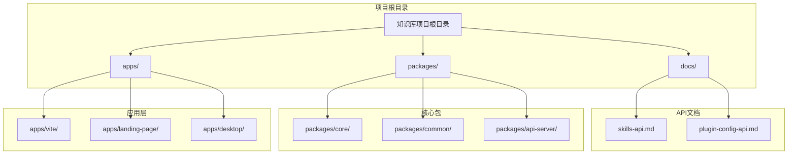
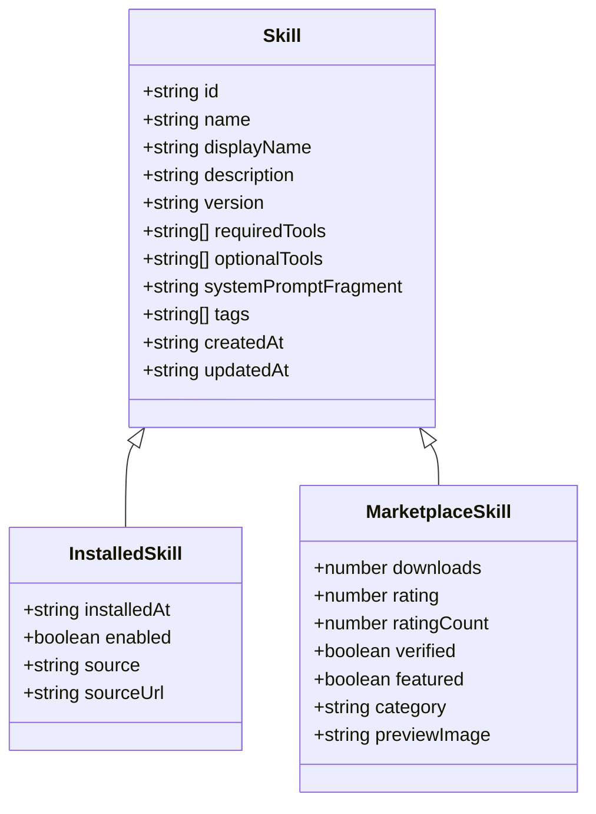
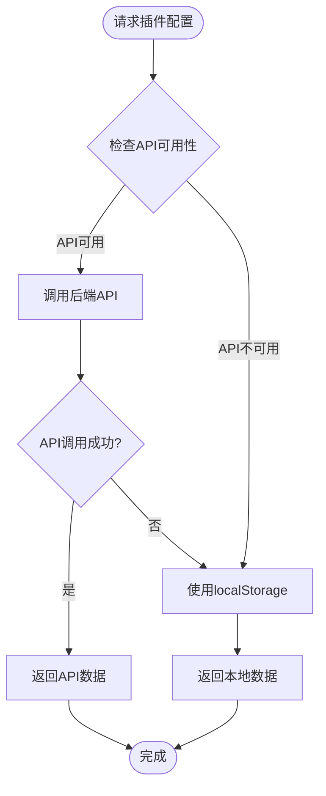
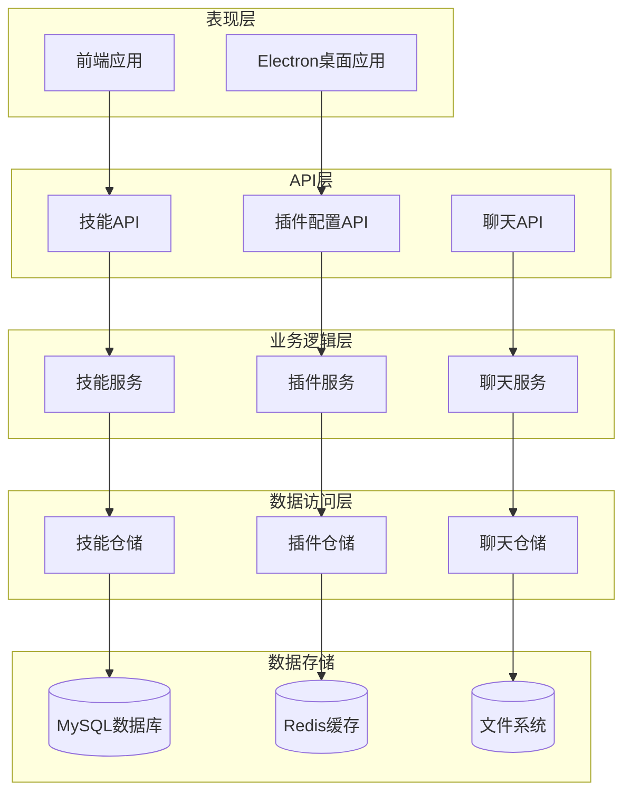
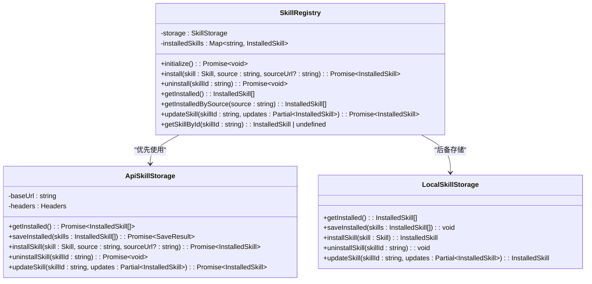
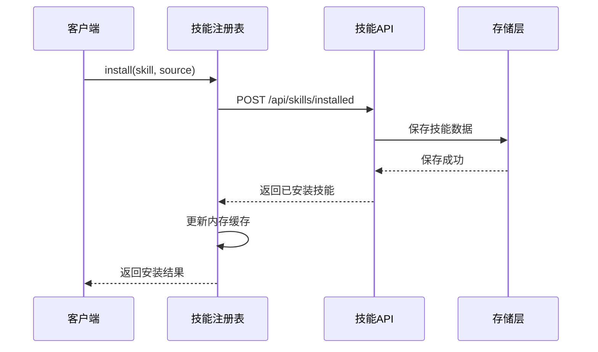
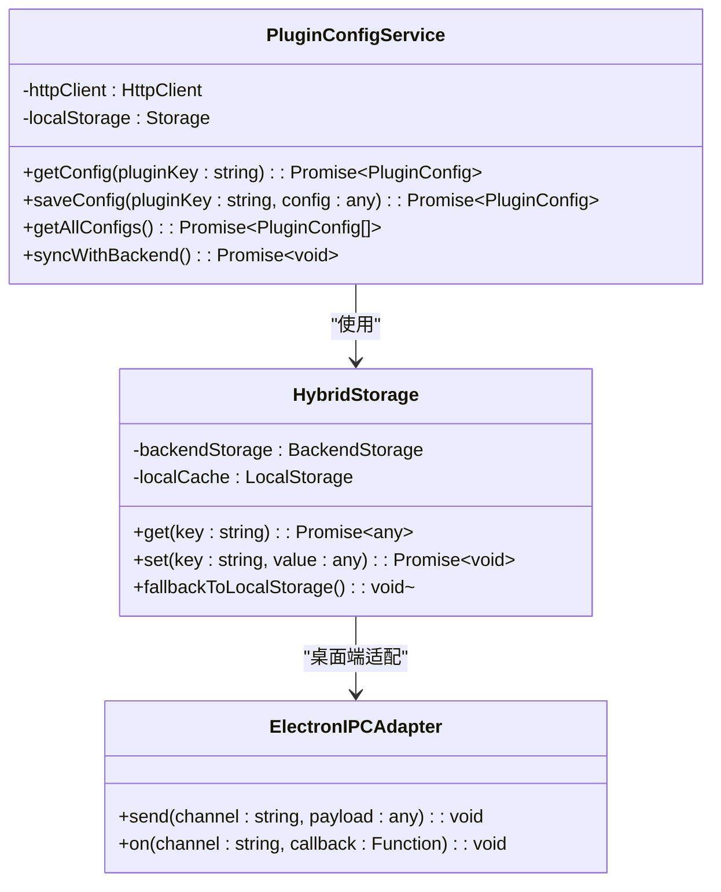
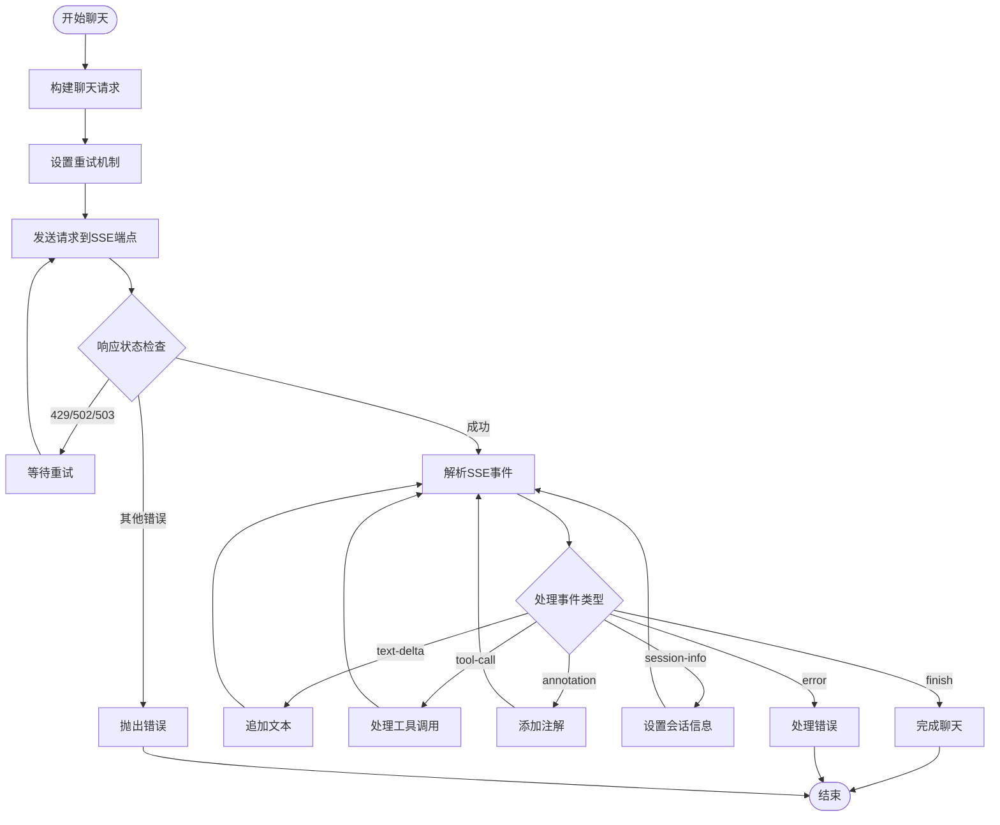

# API定义系统

<cite>
**本文档引用的文件**
- [README.md](file://README.md)
- [package.json](file://package.json)
- [skills-api.md](file://docs/api/skills-api.md)
- [plugin-config-api.md](file://docs/api/plugin-config-api.md)
- [index.ts](file://packages/core/src/index.ts)
- [package.json](file://packages/core/package.json)
- [index.ts](file://packages/common/src/index.ts)
- [index.ts](file://packages/common/src/ai/chat-client/index.ts)
</cite>

## 更新摘要
**所做更改**
- 更新了AI聊天客户端的API基础URL和端点路径
- 修正了插件配置API的端点路径和请求方法
- 更新了核心包的重新导出机制说明
- 修正了项目结构图以反映实际的包组织方式

## 目录
1. [简介](#简介)
2. [项目结构](#项目结构)
3. [核心组件](#核心组件)
4. [架构概览](#架构概览)
5. [详细组件分析](#详细组件分析)
6. [依赖关系分析](#依赖关系分析)
7. [性能考虑](#性能考虑)
8. [故障排除指南](#故障排除指南)
9. [结论](#结论)

## 简介

API定义系统是知识库项目的核心基础设施，负责管理用户自定义技能、插件配置以及AI聊天交互等功能。该系统采用模块化设计，通过清晰的API规范和类型定义，为前端应用提供稳定可靠的服务接口。

系统主要包含三个核心功能模块：
- **技能管理系统**：支持技能的安装、卸载、启用/禁用、分享等操作
- **插件配置管理**：提供插件配置的持久化存储能力
- **AI聊天客户端**：实现与知识库Agent的SSE流式通信

## 项目结构

项目采用Monorepo架构，通过Turborepo进行统一构建管理。API定义系统主要分布在以下目录结构中：



**图表来源**
- [README.md:66-97](file://README.md#L66-L97)
- [package.json:1-125](file://package.json#L1-L125)

**章节来源**
- [README.md:66-97](file://README.md#L66-L97)
- [package.json:1-125](file://package.json#L1-L125)

## 核心组件

### 技能API系统

技能API系统提供了完整的技能生命周期管理功能，包括技能的安装、卸载、状态管理和市场分发。

#### 数据模型

系统定义了三种核心数据模型：



**图表来源**
- [skills-api.md:15-58](file://docs/api/skills-api.md#L15-L58)

#### API端点设计

技能系统提供以下主要API端点：

| 功能类别 | HTTP方法 | 端点路径 | 描述 |
|---------|---------|---------|------|
| 已安装技能管理 | GET | `/api/skills/installed` | 获取已安装技能列表 |
| 已安装技能管理 | PUT | `/api/skills/installed` | 批量保存已安装技能 |
| 已安装技能管理 | POST | `/api/skills/installed` | 安装新技能 |
| 已安装技能管理 | DELETE | `/api/skills/installed/:skillId` | 卸载技能 |
| 已安装技能管理 | PATCH | `/api/skills/installed/:skillId` | 更新技能状态 |
| 技能市场 | GET | `/api/skills/marketplace` | 浏览市场技能 |
| 技能市场 | GET | `/api/skills/marketplace/:skillId` | 获取市场技能详情 |
| 技能市场 | GET | `/api/skills/marketplace/categories` | 获取市场分类 |
| 技能市场 | POST | `/api/skills/marketplace/:skillId/install` | 从市场安装技能 |
| 技能分享 | POST | `/api/skills/share` | 分享技能到市场 |
| 技能分享 | POST | `/api/skills/installed/:skillId/share-link` | 生成分享链接 |
| 技能分享 | GET | `/api/skills/shared/:shareId` | 获取分享的技能 |

**章节来源**
- [skills-api.md:62-494](file://docs/api/skills-api.md#L62-L494)

### 插件配置API系统

插件配置API系统为每个插件提供独立的配置存储空间，支持单个插件配置的获取和更新。

#### 端点设计

**更新** 插件配置API的端点路径已从`/api/plugin-config`更新为`/knowledge-wiki/plugin-config`

| HTTP方法 | 端点路径 | 描述 |
|---------|---------|------|
| GET | `/knowledge-wiki/plugin-config/:pluginKey` | 获取单个插件配置 |
| POST | `/knowledge-wiki/plugin-config/:pluginKey` | 保存/更新单个插件配置 |
| GET | `/knowledge-wiki/plugin-config` | 批量获取当前用户所有插件配置 |

#### 配置存储策略

系统采用Hybrid Storage策略，确保在后端API不可用时前端仍可正常运行：



**图表来源**
- [plugin-config-api.md:7](file://docs/api/plugin-config-api.md#L7)

**章节来源**
- [plugin-config-api.md:11-153](file://docs/api/plugin-config-api.md#L11-L153)

### AI聊天客户端

AI聊天客户端实现了与知识库Agent的SSE流式通信，支持异步消息处理和重试机制。

#### 核心特性

- **SSE流式传输**：基于Server-Sent Events实现实时消息推送
- **智能重试**：指数退避算法处理429、502、503等错误
- **事件解析**：支持text-delta、tool-call、annotation等多种事件类型
- **会话管理**：自动处理sessionId和conversationId

**更新** AI聊天客户端的API基础URL已从`/api/v1`更新为`/api/knowledge-agent/api/v1`

**章节来源**
- [index.ts:1-395](file://packages/common/src/ai/chat-client/index.ts#L1-L395)

## 架构概览

系统采用分层架构设计，通过清晰的职责分离实现高内聚低耦合：



**图表来源**
- [README.md:43-65](file://README.md#L43-L65)
- [package.json:12-53](file://package.json#L12-L53)

## 详细组件分析

### 技能注册表组件

技能注册表是技能管理的核心组件，负责协调技能的安装、卸载和状态管理。



**图表来源**
- [skills-api.md:735-756](file://docs/api/skills-api.md#L735-L756)

#### 技能安装流程



**图表来源**
- [skills-api.md:156-210](file://docs/api/skills-api.md#L156-L210)

### 插件配置存储组件

插件配置存储组件实现了配置的持久化和同步功能。



**图表来源**
- [plugin-config-api.md:205-211](file://docs/api/plugin-config-api.md#L205-L211)

**章节来源**
- [plugin-config-api.md:122-153](file://docs/api/plugin-config-api.md#L122-L153)

### AI聊天客户端组件

AI聊天客户端实现了复杂的流式通信和错误处理机制。



**图表来源**
- [index.ts:52-142](file://packages/common/src/ai/chat-client/index.ts#L52-L142)

**章节来源**
- [index.ts:282-316](file://packages/common/src/ai/chat-client/index.ts#L282-L316)

## 依赖关系分析

系统采用模块化依赖管理，通过workspace机制实现包之间的相互引用。

```mermaid
graph TB
subgraph "核心依赖"
Core[@kn/core]
Common[@kn/common]
UI[@kn/ui]
Editor[@kn/editor]
end
subgraph "AI相关"
AI_SDK[ai]
DeepSeek[@ai-sdk/deepseek]
Anthropic[@ai-sdk/anthropic]
end
subgraph "工具库"
Axios[axios]
Moment[moment]
Lodash[lodash]
Zipson[zipson]
end
subgraph "构建工具"
Rollup[rollup]
Turbo[turbo]
Pnpm[pnpm]
end
Core --> Common
Core --> UI
Core --> Editor
Core --> AI_SDK
Core --> DeepSeek
Core --> Anthropic
Core --> Axios
Core --> Moment
Core --> Lodash
Core --> Zipson
Common --> UI
Common --> Editor
Common --> Axios
Common --> Moment
Common --> Lodash
```

**图表来源**
- [package.json:55-81](file://package.json#L55-L81)
- [packages/core/package.json:17-34](file://packages/core/package.json#L17-L34)

### 包导出结构

**更新** 核心包现在重新导出common包的内容，实现更清晰的模块化架构

核心包通过重新导出机制提供统一的API入口：

```mermaid
graph LR
CoreIndex[packages/core/src/index.ts] --> CommonExport[@kn/common导出]
CoreIndex --> AppExport[App组件导出]
CoreIndex --> SkillsExport[Skills组件导出]
CoreIndex --> MessageBoxExport[MessageBox组件导出]
CoreIndex --> AIExport[AI功能导出]
CommonIndex[packages/common/src/index.ts] --> CoreTypes[核心类型导出]
CommonIndex --> EntityExport[实体导出]
CommonIndex --> UtilsExport[工具函数导出]
CommonIndex --> APIExport[API工具导出]
CommonIndex --> HooksExport[Hooks导出]
CommonIndex --> ServicesExport[服务导出]
CommonIndex --> StoreExport[状态管理导出]
CommonIndex --> AIExport[AI功能导出]
```

**图表来源**
- [index.ts:1-11](file://packages/core/src/index.ts#L1-L11)
- [index.ts:1-39](file://packages/common/src/index.ts#L1-L39)

**章节来源**
- [index.ts:1-11](file://packages/core/src/index.ts#L1-L11)
- [index.ts:1-39](file://packages/common/src/index.ts#L1-L39)

## 性能考虑

### 缓存策略

系统实现了多层次的缓存机制来优化性能：

1. **客户端缓存**：技能列表和插件配置在本地缓存
2. **服务端缓存**：市场列表接口使用Redis缓存
3. **数据库索引**：关键查询字段建立复合索引

### 并发控制

- **请求限流**：AI聊天API实现速率限制防止过载
- **连接池管理**：数据库连接池优化资源使用
- **异步处理**：大量I/O操作采用异步模式

### 数据压缩

- **JSON序列化**：使用高效的JSON序列化库
- **二进制传输**：大文件采用二进制格式传输
- **增量更新**：支持部分数据更新减少传输量

## 故障排除指南

### 常见问题诊断

#### 技能安装失败

**症状**：技能安装返回409状态码

**原因分析**：
- 技能已存在且无法覆盖
- 技能格式不符合要求
- 权限不足

**解决方案**：
1. 检查技能ID是否重复
2. 验证技能定义的完整性
3. 确认用户权限

#### 插件配置同步问题

**症状**：插件配置在不同设备间不同步

**原因分析**：
- 后端API不可用
- 网络连接不稳定
- 本地存储损坏

**解决方案**：
1. 检查API服务状态
2. 验证网络连接
3. 清除本地缓存重新同步

#### AI聊天连接中断

**症状**：SSE连接频繁断开

**原因分析**：
- 服务器负载过高
- 网络不稳定
- 客户端超时设置过短

**解决方案**：
1. 检查服务器资源使用情况
2. 优化网络环境
3. 调整超时参数

**章节来源**
- [skills-api.md:623-649](file://docs/api/skills-api.md#L623-L649)
- [plugin-config-api.md:193-201](file://docs/api/plugin-config-api.md#L193-L201)

## 结论

API定义系统通过清晰的架构设计和完善的API规范，为知识库项目提供了强大的扩展能力和良好的用户体验。系统的主要优势包括：

1. **模块化设计**：各功能模块职责明确，便于维护和扩展
2. **类型安全**：完整的TypeScript类型定义确保代码质量
3. **容错机制**：多重备份和重试机制保证系统稳定性
4. **性能优化**：多层次缓存和异步处理提升响应速度
5. **安全考虑**：认证授权和数据加密保护用户隐私

未来可以进一步优化的方向包括：完善API版本管理、增强监控告警、扩展插件生态、优化移动端体验等。