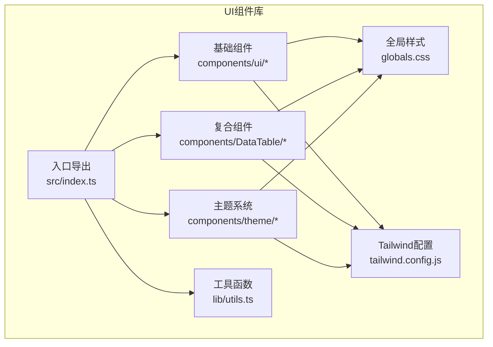
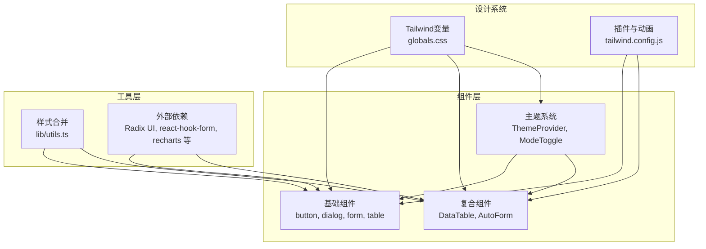
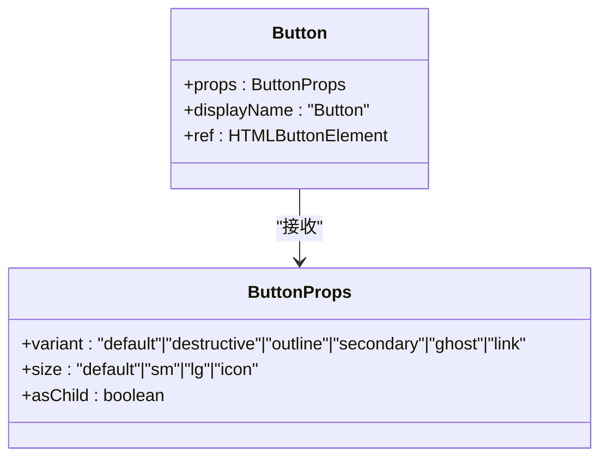
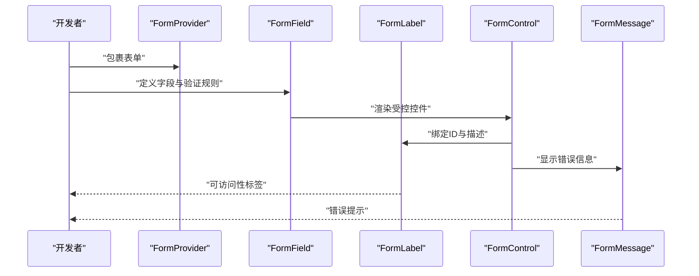
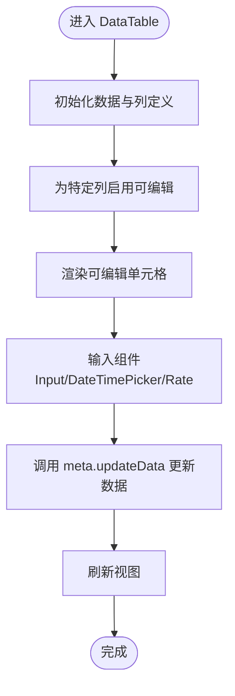
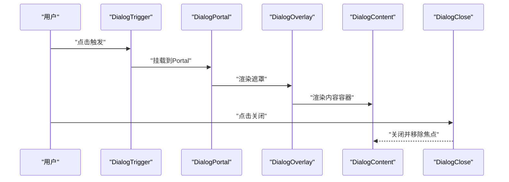
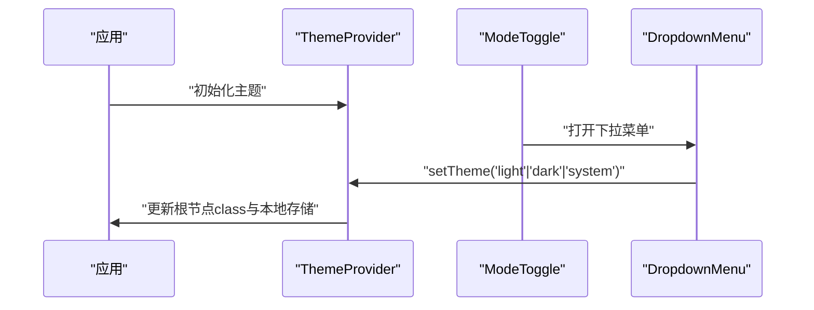
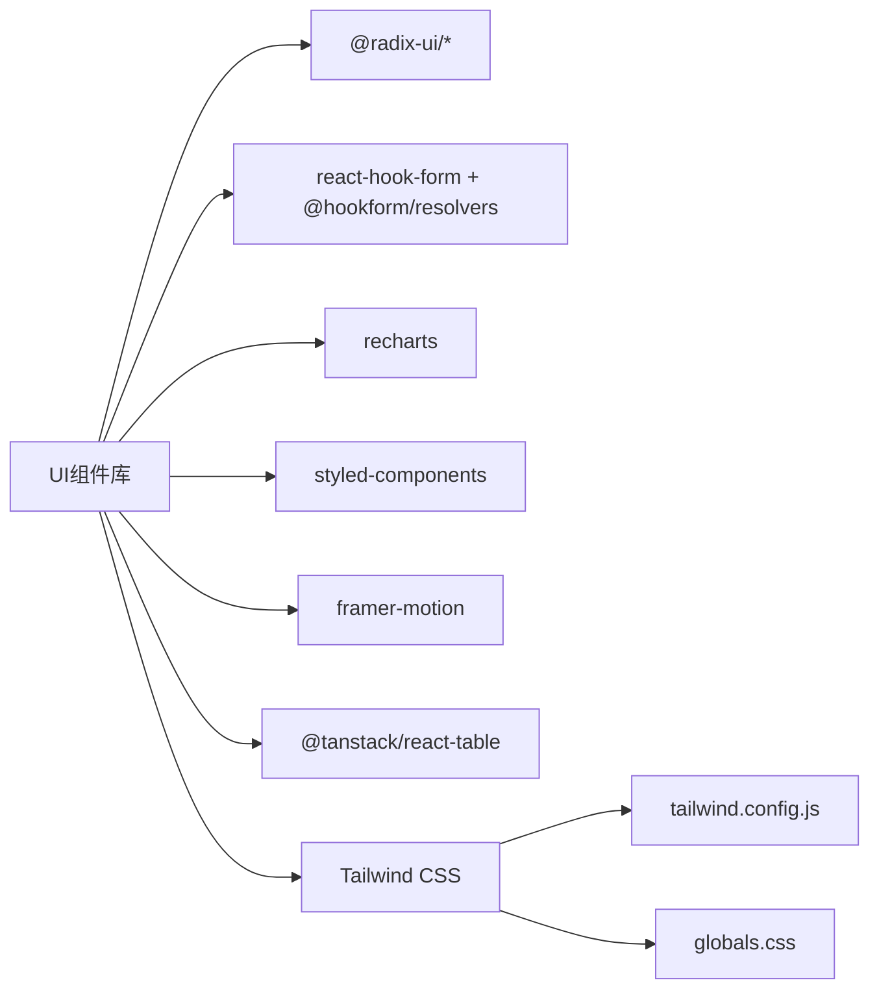

# UI组件库

<cite>
**本文引用的文件**
- [packages/ui/src/index.ts](file://packages/ui/src/index.ts)
- [packages/ui/package.json](file://packages/ui/package.json)
- [packages/ui/tailwind.config.js](file://packages/ui/tailwind.config.js)
- [packages/ui/globals.css](file://packages/ui/globals.css)
- [packages/ui/src/lib/utils.ts](file://packages/ui/src/lib/utils.ts)
- [packages/ui/src/components/ui/button.tsx](file://packages/ui/src/components/ui/button.tsx)
- [packages/ui/src/components/ui/dialog.tsx](file://packages/ui/src/components/ui/dialog.tsx)
- [packages/ui/src/components/ui/form.tsx](file://packages/ui/src/components/ui/form.tsx)
- [packages/ui/src/components/ui/table.tsx](file://packages/ui/src/components/ui/table.tsx)
- [packages/ui/src/components/theme/index.tsx](file://packages/ui/src/components/theme/index.tsx)
- [packages/ui/src/components/theme/ModeToggle.tsx](file://packages/ui/src/components/theme/ModeToggle.tsx)
- [packages/ui/src/components/DataTable/data-table.tsx](file://packages/ui/src/components/DataTable/data-table.tsx)
- [packages/ui/src/components/ui/autoform/AutoForm.tsx](file://packages/ui/src/components/ui/autoform/AutoForm.tsx)
</cite>

## 目录
1. [引言](#引言)
2. [项目结构](#项目结构)
3. [核心组件](#核心组件)
4. [架构总览](#架构总览)
5. [详细组件分析](#详细组件分析)
6. [依赖关系分析](#依赖关系分析)
7. [性能考量](#性能考量)
8. [故障排查指南](#故障排查指南)
9. [结论](#结论)
10. [附录](#附录)

## 引言
本文件为知识库管理系统的UI组件库使用文档，面向开发者与产品团队，系统性介绍组件库的设计理念、主题与无障碍支持、组件分类与组织方式、使用方法与配置选项、开发规范与最佳实践，并结合Tailwind CSS与主题系统给出可落地的集成方案。组件库以“基础组件 + 复合组件 + 业务组件”的分层组织，覆盖表单、数据表格、对话框、主题切换等高频场景，同时提供可扩展的样式与交互能力。

## 项目结构
UI组件库位于 packages/ui，采用按功能域分层的目录组织：
- 组件层：packages/ui/src/components
  - 基础组件：如 button、dialog、form、table 等
  - 复合组件：如 DataTable、AutoForm 等
  - 主题与工具：theme、IconSelector、Onboarding 等
- 工具与通用：packages/ui/src/lib/utils.ts 提供样式合并与格式化工具
- 样式与主题：globals.css 定义CSS变量与基础层；tailwind.config.js 配置主题色板、动画与插件
- 导出入口：packages/ui/src/index.ts 汇总导出组件与外部依赖

图表来源
- [packages/ui/src/index.ts](file://packages/ui/src/index.ts#L1-L18)
- [packages/ui/src/lib/utils.ts](file://packages/ui/src/lib/utils.ts#L1-L25)
- [packages/ui/globals.css](file://packages/ui/globals.css#L1-L122)
- [packages/ui/tailwind.config.js](file://packages/ui/tailwind.config.js#L1-L145)

章节来源
- [packages/ui/src/index.ts](file://packages/ui/src/index.ts#L1-L18)
- [packages/ui/package.json](file://packages/ui/package.json#L1-L90)

## 核心组件
- 基础组件（以按钮为例）
  - 设计要点：通过变体与尺寸的组合实现统一风格；支持 asChild 渲染为任意元素；使用类名合并工具保证样式叠加正确
  - 关键点：变体与尺寸由样式工厂定义；通过上下文与forwardRef提升可访问性与可组合性
- 表单体系（Form Provider + Field + Label + Control）
  - 设计要点：基于 Radix UI 与 react-hook-form 构建受控表单上下文；自动注入 aria 属性；错误状态与描述文本联动
- 数据表格（DataTable）
  - 设计要点：基于 TanStack React Table 的可编辑单元格、日期选择器、评分组件等复合能力；提供虚拟滚动与选择能力的扩展接口
- 对话框（Dialog）
  - 设计要点：基于 Radix UI 的模态层、遮罩与内容容器；内置标题、描述、页脚布局；支持键盘无障碍与焦点管理
- 主题系统（ThemeProvider + ModeToggle）
  - 设计要点：支持 light/dark/system 三态；持久化存储；根节点 class 切换；下拉菜单触发切换

章节来源
- [packages/ui/src/components/ui/button.tsx](file://packages/ui/src/components/ui/button.tsx#L1-L57)
- [packages/ui/src/components/ui/form.tsx](file://packages/ui/src/components/ui/form.tsx#L1-L177)
- [packages/ui/src/components/DataTable/data-table.tsx](file://packages/ui/src/components/DataTable/data-table.tsx#L1-L251)
- [packages/ui/src/components/ui/dialog.tsx](file://packages/ui/src/components/ui/dialog.tsx#L1-L121)
- [packages/ui/src/components/theme/index.tsx](file://packages/ui/src/components/theme/index.tsx#L1-L75)
- [packages/ui/src/components/theme/ModeToggle.tsx](file://packages/ui/src/components/theme/ModeToggle.tsx#L1-L37)

## 架构总览
组件库整体围绕以下原则构建：
- 设计系统：以 Tailwind CSS 变量与 Radix UI 语义为基础，统一色彩、圆角、阴影与动效
- 可组合性：组件通过 forwardRef、asChild、Slot 等模式增强可组合性
- 可访问性：遵循 ARIA 规范，自动注入 aria-* 属性，提供键盘与屏幕阅读器支持
- 主题与无障碍：深浅色主题通过 CSS 变量与 class 切换实现；为视觉障碍用户提供 sr-only 文案与焦点可见性

图表来源
- [packages/ui/globals.css](file://packages/ui/globals.css#L1-L122)
- [packages/ui/tailwind.config.js](file://packages/ui/tailwind.config.js#L1-L145)
- [packages/ui/src/lib/utils.ts](file://packages/ui/src/lib/utils.ts#L1-L25)
- [packages/ui/src/index.ts](file://packages/ui/src/index.ts#L1-L18)

## 详细组件分析

### 基础组件：按钮 Button
- 功能与特性
  - 支持多种变体与尺寸，通过样式工厂生成一致的视觉与交互
  - 支持 asChild 将渲染目标改为任意元素，便于语义化与可访问性
  - 使用类名合并工具确保传入 className 与默认样式的正确叠加
- 典型用法
  - 作为提交按钮、图标按钮、危险操作按钮等
  - 与表单控件或导航链接组合使用
- 可定制项
  - variant/size：通过变体与尺寸参数控制外观
  - className：追加自定义样式
  - asChild：控制渲染元素类型

图表来源
- [packages/ui/src/components/ui/button.tsx](file://packages/ui/src/components/ui/button.tsx#L1-L57)

章节来源
- [packages/ui/src/components/ui/button.tsx](file://packages/ui/src/components/ui/button.tsx#L1-L57)

### 表单体系：Form Provider 与字段上下文
- 功能与特性
  - FormProvider 提供表单上下文；FormField 包裹控制器并注入字段名称
  - FormLabel、FormControl、FormMessage 自动绑定 aria-* 属性与错误状态
  - useFormField 提供字段状态、ID 与描述文本 ID 的访问
- 典型用法
  - 在 AutoForm 或手写表单中组合使用，实现受控与非受控混合场景
- 可定制项
  - 字段组件映射：通过 AutoForm 的 formComponents 覆盖默认字段渲染
  - UI 组件扩展：通过 uiComponents 注入自定义布局与提示

图表来源
- [packages/ui/src/components/ui/form.tsx](file://packages/ui/src/components/ui/form.tsx#L1-L177)
- [packages/ui/src/components/ui/autoform/AutoForm.tsx](file://packages/ui/src/components/ui/autoform/AutoForm.tsx#L1-L54)

章节来源
- [packages/ui/src/components/ui/form.tsx](file://packages/ui/src/components/ui/form.tsx#L1-L177)
- [packages/ui/src/components/ui/autoform/AutoForm.tsx](file://packages/ui/src/components/ui/autoform/AutoForm.tsx#L1-L54)

### 复合组件：数据表格 DataTable
- 功能与特性
  - 基于 TanStack React Table 的列定义与元数据扩展，支持可编辑单元格、日期时间选择、评分组件等
  - 提供虚拟滚动与单元格选择能力的扩展接口（注释中保留）
- 典型用法
  - 快速搭建带编辑能力的数据列表；通过 meta.updateData 实现行内更新
- 可定制项
  - 列定义：title、dataIndex、key、editable 等
  - 单元格渲染：renderValueView/renderInput 自定义展示与输入
  - 高度与滚动：通过 VDataTable 控制可视区域高度

图表来源
- [packages/ui/src/components/DataTable/data-table.tsx](file://packages/ui/src/components/DataTable/data-table.tsx#L1-L251)

章节来源
- [packages/ui/src/components/DataTable/data-table.tsx](file://packages/ui/src/components/DataTable/data-table.tsx#L1-L251)

### 对话框：Dialog
- 功能与特性
  - 基于 Radix UI 的 Root/Portal/Overlay/Content 结构，内置标题、描述、页脚布局
  - 支持键盘关闭、焦点管理与动画过渡
- 典型用法
  - 用于确认、设置、弹窗详情等场景
- 可定制项
  - 内容区样式：通过 className 扩展
  - 布局：DialogHeader/DialogFooter 组合使用

图表来源
- [packages/ui/src/components/ui/dialog.tsx](file://packages/ui/src/components/ui/dialog.tsx#L1-L121)

章节来源
- [packages/ui/src/components/ui/dialog.tsx](file://packages/ui/src/components/ui/dialog.tsx#L1-L121)

### 主题系统：ThemeProvider 与 ModeToggle
- 功能与特性
  - 支持 light/dark/system 三种主题；持久化存储在 localStorage
  - 根节点 class 切换实现主题生效；下拉菜单提供切换入口
- 典型用法
  - 在应用根部包裹 ThemeProvider；在页眉放置 ModeToggle
- 可定制项
  - 默认主题与存储键名：通过 ThemeProviderProps 配置
  - 切换逻辑：通过 useTheme.setTheme 更新主题

图表来源
- [packages/ui/src/components/theme/index.tsx](file://packages/ui/src/components/theme/index.tsx#L1-L75)
- [packages/ui/src/components/theme/ModeToggle.tsx](file://packages/ui/src/components/theme/ModeToggle.tsx#L1-L37)

章节来源
- [packages/ui/src/components/theme/index.tsx](file://packages/ui/src/components/theme/index.tsx#L1-L75)
- [packages/ui/src/components/theme/ModeToggle.tsx](file://packages/ui/src/components/theme/ModeToggle.tsx#L1-L37)

## 依赖关系分析
- 组件库对外部依赖的整合
  - Radix UI：提供语义化与无障碍的基础 UI 原子能力（如 dialog、form、label 等）
  - react-hook-form：提供表单状态管理与验证解析器
  - recharts：提供图表组件导出，便于可视化展示
  - styled-components / framer-motion：提供样式与动画能力
- 样式与主题
  - Tailwind CSS：通过变量与插件实现主题色板、动画与排版
  - globals.css：定义 CSS 变量与基础层样式，确保组件与主题一致

图表来源
- [packages/ui/src/index.ts](file://packages/ui/src/index.ts#L1-L18)
- [packages/ui/package.json](file://packages/ui/package.json#L1-L90)
- [packages/ui/tailwind.config.js](file://packages/ui/tailwind.config.js#L1-L145)
- [packages/ui/globals.css](file://packages/ui/globals.css#L1-L122)

章节来源
- [packages/ui/src/index.ts](file://packages/ui/src/index.ts#L1-L18)
- [packages/ui/package.json](file://packages/ui/package.json#L1-L90)

## 性能考量
- 组件级优化
  - 使用 React.memo 包装表格等重型组件，减少重渲染
  - 使用 forwardRef 与 asChild 降低不必要的 DOM 包装层级
- 样式与主题
  - 通过 CSS 变量与 class 切换实现主题切换，避免运行时样式计算开销
  - Tailwind 仅编译实际使用的类，结合内容扫描与安全列表减少打包体积
- 表格与虚拟化
  - DataTable 提供虚拟滚动与选择能力的扩展接口，建议在大数据量场景启用

章节来源
- [packages/ui/src/components/ui/table.tsx](file://packages/ui/src/components/ui/table.tsx#L1-L137)
- [packages/ui/src/components/DataTable/data-table.tsx](file://packages/ui/src/components/DataTable/data-table.tsx#L1-L251)
- [packages/ui/tailwind.config.js](file://packages/ui/tailwind.config.js#L1-L145)

## 故障排查指南
- 表单相关
  - useFormField 抛错：请确保在 FormField 上下文中使用该 hook
  - 错误未显示：检查 FormControl 是否正确绑定 aria-describedby 与 aria-invalid
- 主题相关
  - 主题不生效：确认根节点 class 是否正确添加；检查 localStorage 中存储键值
  - 切换无效：确认 setTheme 调用是否执行；检查系统主题匹配逻辑
- 样式相关
  - Tailwind 类未生效：确认 tailwind.config.js 的 content 范围与插件已启用
  - 样式冲突：使用类名合并工具确保传入 className 正确叠加

章节来源
- [packages/ui/src/components/ui/form.tsx](file://packages/ui/src/components/ui/form.tsx#L1-L177)
- [packages/ui/src/components/theme/index.tsx](file://packages/ui/src/components/theme/index.tsx#L1-L75)
- [packages/ui/tailwind.config.js](file://packages/ui/tailwind.config.js#L1-L145)

## 结论
本组件库以设计系统为核心，结合 Tailwind CSS、Radix UI 与 react-hook-form，形成从基础到复合再到业务场景的完整组件体系。通过主题系统与无障碍支持，满足多端与多用户需求；通过可组合与可定制的组件设计，兼顾一致性与灵活性。建议在实际项目中优先使用基础组件进行组合，配合 AutoForm 与 DataTable 快速搭建复杂界面。

## 附录

### 组件分类与职责
- 基础组件：提供最小可用的 UI 原子能力（按钮、输入、标签、开关等），强调一致性与可访问性
- 复合组件：在基础组件之上组合形成更高阶的能力（表格、表单、日历等）
- 业务组件：面向具体业务场景（引导流程、主题切换等）

章节来源
- [packages/ui/src/components/ui/button.tsx](file://packages/ui/src/components/ui/button.tsx#L1-L57)
- [packages/ui/src/components/ui/form.tsx](file://packages/ui/src/components/ui/form.tsx#L1-L177)
- [packages/ui/src/components/DataTable/data-table.tsx](file://packages/ui/src/components/DataTable/data-table.tsx#L1-L251)
- [packages/ui/src/components/theme/ModeToggle.tsx](file://packages/ui/src/components/theme/ModeToggle.tsx#L1-L37)

### 设计系统与主题定制
- 主题变量：通过 CSS 变量定义主色、辅助色、背景与前景等
- 动画与插件：Tailwind 插件与 keyframes 实现统一动效
- 主题切换：根节点 class 切换与 localStorage 持久化

章节来源
- [packages/ui/globals.css](file://packages/ui/globals.css#L1-L122)
- [packages/ui/tailwind.config.js](file://packages/ui/tailwind.config.js#L1-L145)
- [packages/ui/src/components/theme/index.tsx](file://packages/ui/src/components/theme/index.tsx#L1-L75)

### 响应式设计与无障碍支持
- 响应式断点：在 Tailwind 配置中扩展了更大屏断点，适配宽屏场景
- 无障碍：表单组件自动注入 aria-* 属性；对话框组件提供键盘关闭与焦点管理
- 可访问性文案：为图标按钮提供 sr-only 文案，提升屏幕阅读器体验

章节来源
- [packages/ui/tailwind.config.js](file://packages/ui/tailwind.config.js#L1-L145)
- [packages/ui/src/components/ui/form.tsx](file://packages/ui/src/components/ui/form.tsx#L1-L177)
- [packages/ui/src/components/ui/dialog.tsx](file://packages/ui/src/components/ui/dialog.tsx#L1-L121)
- [packages/ui/src/components/theme/ModeToggle.tsx](file://packages/ui/src/components/theme/ModeToggle.tsx#L1-L37)

### 组件开发规范与最佳实践
- 组件设计原则
  - 保持单一职责；通过 props 明确行为边界
  - 使用 forwardRef 与 asChild 提升可组合性
  - 严格遵循 ARIA 规范，提供键盘与屏幕阅读器支持
- 代码风格
  - 使用 TypeScript 明确定义 props 与上下文类型
  - 使用类名合并工具确保样式叠加顺序与可维护性
- 测试策略
  - 单元测试：针对交互逻辑与状态变更
  - 可访问性测试：使用自动化工具与人工评审相结合
  - 回归测试：在主题切换与响应式断点变化时重点验证

章节来源
- [packages/ui/src/lib/utils.ts](file://packages/ui/src/lib/utils.ts#L1-L25)
- [packages/ui/src/components/ui/form.tsx](file://packages/ui/src/components/ui/form.tsx#L1-L177)
- [packages/ui/src/components/ui/dialog.tsx](file://packages/ui/src/components/ui/dialog.tsx#L1-L121)