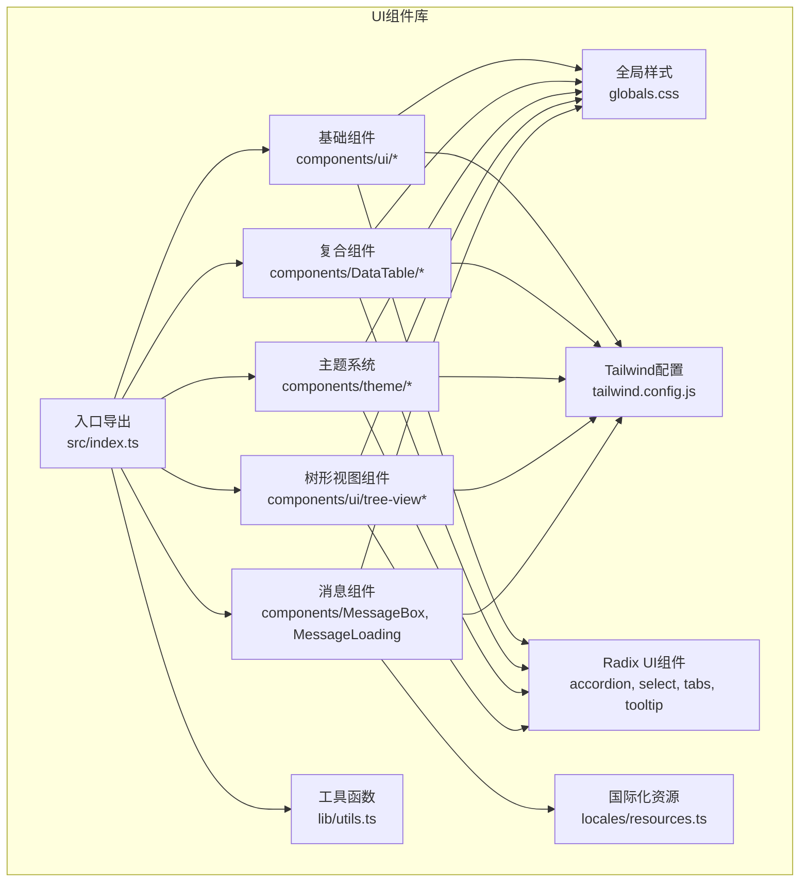
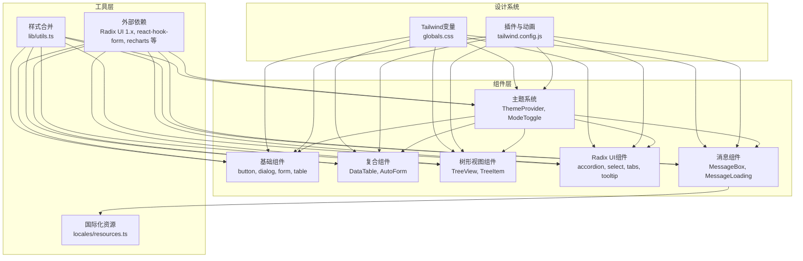
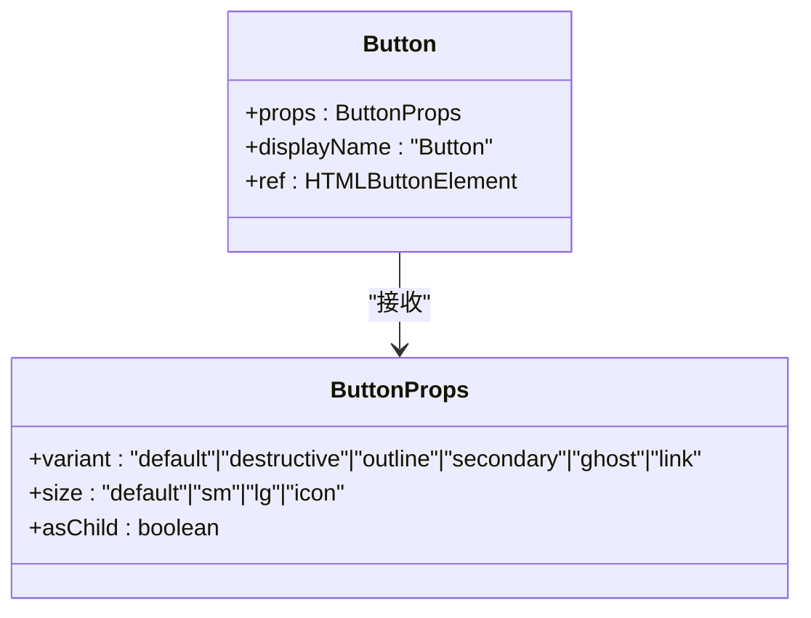
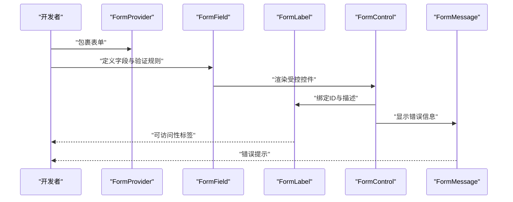
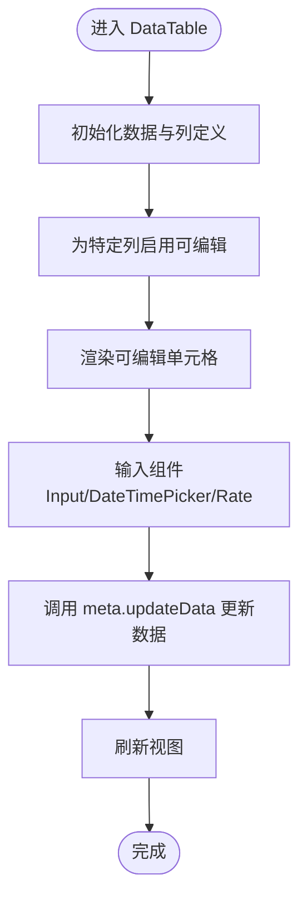
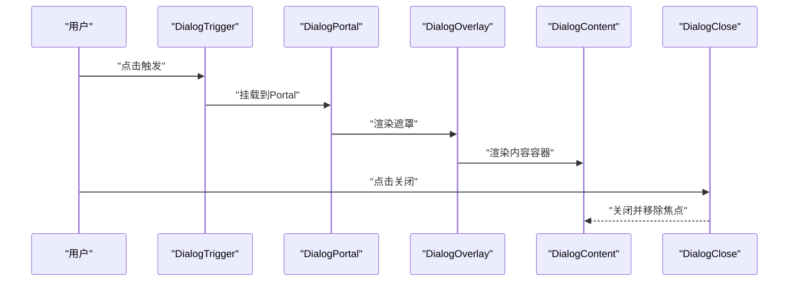
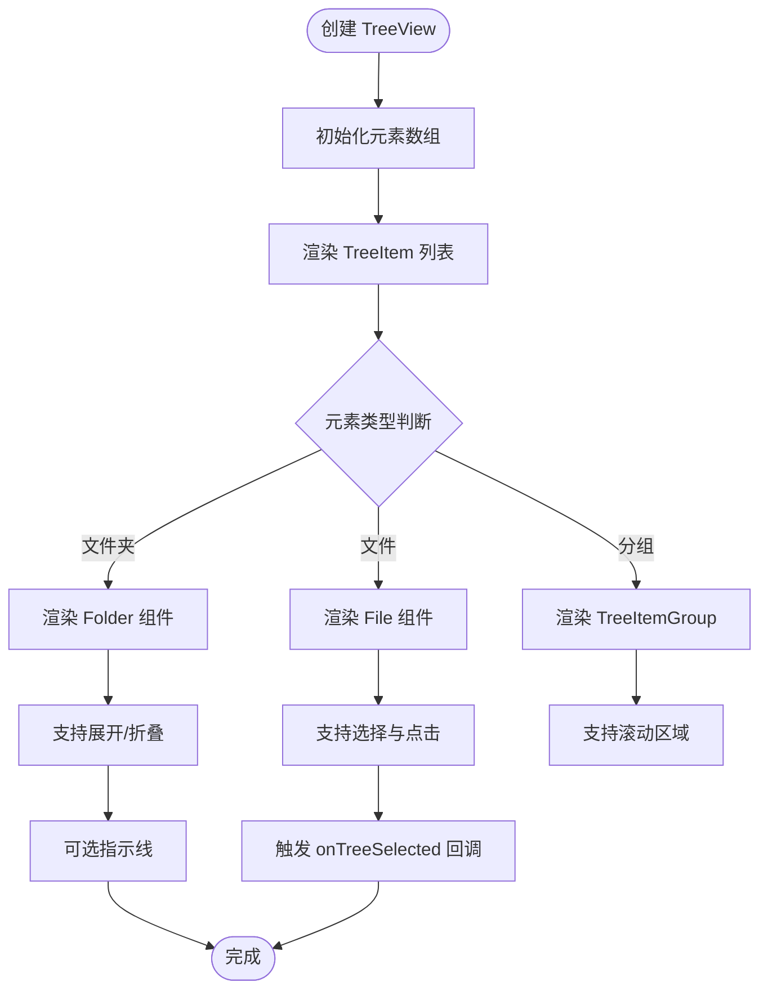
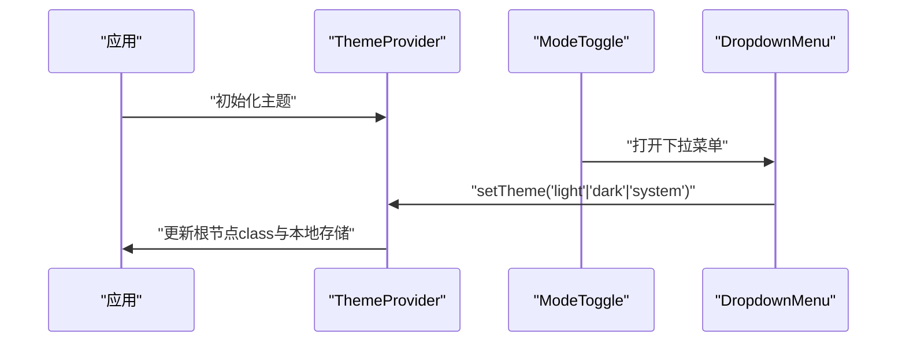
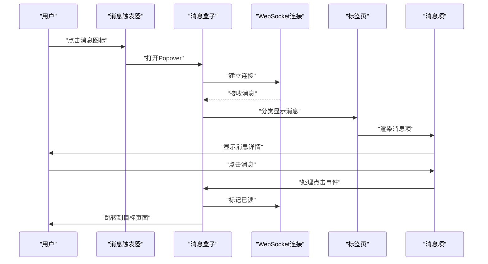
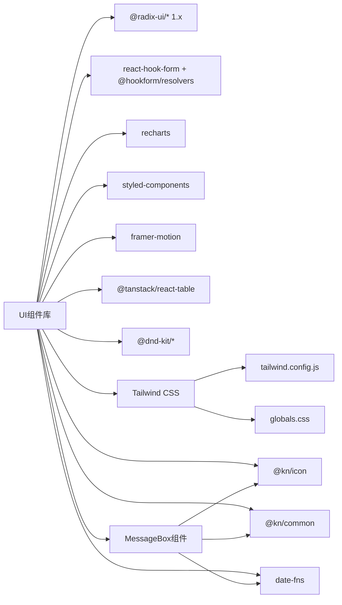

# UI组件库

<cite>
**本文引用的文件**
- [packages/ui/src/index.ts](file://packages/ui/src/index.ts)
- [packages/ui/package.json](file://packages/ui/package.json)
- [packages/ui/tailwind.config.js](file://packages/ui/tailwind.config.js)
- [packages/ui/globals.css](file://packages/ui/globals.css)
- [packages/ui/src/lib/utils.ts](file://packages/ui/src/lib/utils.ts)
- [packages/ui/src/components/ui/button.tsx](file://packages/ui/src/components/ui/button.tsx)
- [packages/ui/src/components/ui/dialog.tsx](file://packages/ui/src/components/ui/dialog.tsx)
- [packages/ui/src/components/ui/form.tsx](file://packages/ui/src/components/ui/form.tsx)
- [packages/ui/src/components/ui/table.tsx](file://packages/ui/src/components/ui/table.tsx)
- [packages/ui/src/components/theme/index.tsx](file://packages/ui/src/components/theme/index.tsx)
- [packages/ui/src/components/theme/ModeToggle.tsx](file://packages/ui/src/components/theme/ModeToggle.tsx)
- [packages/ui/src/components/DataTable/data-table.tsx](file://packages/ui/src/components/DataTable/data-table.tsx)
- [packages/ui/src/components/ui/autoform/AutoForm.tsx](file://packages/ui/src/components/ui/autoform/AutoForm.tsx)
- [packages/ui/src/components/ui/tree-view.tsx](file://packages/ui/src/components/ui/tree-view.tsx)
- [packages/ui/src/components/ui/tree-view-api.tsx](file://packages/ui/src/components/ui/tree-view-api.tsx)
- [packages/ui/src/components/ui/accordion.tsx](file://packages/ui/src/components/ui/accordion.tsx)
- [packages/ui/src/components/ui/select.tsx](file://packages/ui/src/components/ui/select.tsx)
- [packages/ui/src/components/ui/tabs.tsx](file://packages/ui/src/components/ui/tabs.tsx)
- [packages/ui/src/components/ui/tooltip.tsx](file://packages/ui/src/components/ui/tooltip.tsx)
- [packages/ui/src/components/ui/alert-dialog.tsx](file://packages/ui/src/components/ui/alert-dialog.tsx)
- [packages/ui/src/components/ui/context-menu.tsx](file://packages/ui/src/components/ui/context-menu.tsx)
- [packages/ui/src/components/ui/hover-card.tsx](file://packages/ui/src/components/ui/hover-card.tsx)
- [packages/ui/src/components/ui/popover.tsx](file://packages/ui/src/components/ui/popover.tsx)
- [packages/core/src/components/MessageBox/index.tsx](file://packages/core/src/components/MessageBox/index.tsx)
- [packages/ui/src/components/ui/message-loading.tsx](file://packages/ui/src/components/ui/message-loading.tsx)
- [packages/core/src/locales/resources.ts](file://packages/core/src/locales/resources.ts)
</cite>

## 更新摘要
**所做更改**
- 新增MessageBox组件重构的详细说明，包括样式常量系统、消息类型元数据管理、时间格式化工具等改进
- 更新了组件库的消息通知系统架构，增强了国际化支持和可访问性
- 完善了消息盒子的交互设计和状态管理机制
- 新增了消息加载状态组件MessageLoading的使用说明

## 目录
1. [引言](#引言)
2. [项目结构](#项目结构)
3. [核心组件](#核心组件)
4. [架构总览](#架构总览)
5. [详细组件分析](#详细组件分析)
6. [依赖关系分析](#依赖关系分析)
7. [性能考量](#性能考量)
8. [故障排查指南](#故障排查指南)
9. [结论](#结论)
10. [附录](#附录)

## 引言
本文件为知识库管理系统的UI组件库使用文档，面向开发者与产品团队，系统性介绍组件库的设计理念、主题与无障碍支持、组件分类与组织方式、使用方法与配置选项、开发规范与最佳实践，并结合Tailwind CSS与主题系统给出可落地的集成方案。组件库以"基础组件 + 复合组件 + 业务组件"的分层组织，覆盖表单、数据表格、对话框、主题切换、树形视图等高频场景，同时提供可扩展的样式与交互能力。

**更新** 本次更新反映了UI组件库中MessageBox组件的重大重构，引入了全新的样式常量系统、消息类型元数据管理、时间格式化工具等改进，显著提升了组件的可维护性和国际化支持能力。

## 项目结构
UI组件库位于 packages/ui，采用按功能域分层的目录组织：
- 组件层：packages/ui/src/components
  - 基础组件：如 button、dialog、form、table 等
  - 复合组件：如 DataTable、AutoForm 等
  - 主题与工具：theme、IconSelector、Onboarding 等
  - 树形视图组件：TreeView、TreeItem 等
  - Radix UI组件：accordion、select、tabs、tooltip、alert-dialog等
  - 消息组件：MessageBox、MessageLoading等
- 工具与通用：packages/ui/src/lib/utils.ts 提供样式合并与格式化工具
- 样式与主题：globals.css 定义CSS变量与基础层；tailwind.config.js 配置主题色板、动画与插件
- 导出入口：packages/ui/src/index.ts 汇总导出组件与外部依赖

```mermaid
graph TB
subgraph "UI组件库"
A["入口导出<br/>src/index.ts"]
B["基础组件<br/>components/ui/*"]
C["复合组件<br/>components/DataTable/*"]
D["主题系统<br/>components/theme/*"]
E["树形视图组件<br/>components/ui/tree-view*"]
F["消息组件<br/>components/MessageBox, MessageLoading"]
G["工具函数<br/>lib/utils.ts"]
H["全局样式<br/>globals.css"]
I["Tailwind配置<br/>tailwind.config.js"]
J["Radix UI组件<br/>accordion, select, tabs, tooltip"]
K["国际化资源<br/>locales/resources.ts"]
end
A --> B
A --> C
A --> D
A --> E
A --> F
A --> G
B --> H
C --> H
D --> H
E --> H
F --> H
B --> I
C --> I
D --> I
E --> I
F --> I
B --> J
C --> J
D --> J
E --> J
F --> K
```

**图表来源**
- [packages/ui/src/index.ts:1-26](file://packages/ui/src/index.ts#L1-L26)
- [packages/ui/src/lib/utils.ts:1-25](file://packages/ui/src/lib/utils.ts#L1-L25)
- [packages/ui/globals.css:1-122](file://packages/ui/globals.css#L1-L122)
- [packages/ui/tailwind.config.js:1-145](file://packages/ui/tailwind.config.js#L1-L145)
- [packages/core/src/locales/resources.ts:1-640](file://packages/core/src/locales/resources.ts#L1-L640)

**章节来源**
- [packages/ui/src/index.ts:1-26](file://packages/ui/src/index.ts#L1-L26)
- [packages/ui/package.json:1-91](file://packages/ui/package.json#L1-L91)

## 核心组件
- 基础组件（以按钮为例）
  - 设计要点：通过变体与尺寸的组合实现统一风格；支持 asChild 渲染为任意元素；使用类名合并工具保证样式叠加正确
  - 关键点：变体与尺寸由样式工厂定义；通过上下文与forwardRef提升可访问性与可组合性
- 表单体系（Form Provider + Field + Label + Control）
  - 设计要点：基于 Radix UI 与 react-hook-form 构建受控表单上下文；自动注入 aria 属性；错误状态与描述文本联动
- 数据表格（DataTable）
  - 设计要点：基于 TanStack React Table 的可编辑单元格、日期选择器、评分组件等复合能力；提供虚拟滚动与选择能力的扩展接口
- 对话框（Dialog）
  - 设计要点：基于 Radix UI 的模态层、遮罩与内容容器；内置标题、描述、页脚布局；支持键盘无障碍与焦点管理
- 树形视图（TreeView）
  - 设计要点：基于 Radix UI Accordion 的递归树形结构；支持文件夹展开/折叠、文件选择、指示线显示；通过'w-full'类确保文件名正确利用可用宽度空间
- 主题系统（ThemeProvider + ModeToggle）
  - 设计要点：支持 light/dark/system 三态；持久化存储；根节点 class 切换；下拉菜单触发切换
- 消息盒子（MessageBox）
  - 设计要点：基于Popover的实时消息通知系统；支持WebSocket连接、消息分类、时间格式化、国际化；提供标记已读、删除、跳转等功能
- Radix UI组件生态
  - Accordion：基于 @radix-ui/react-accordion 的可折叠面板组件
  - Select：基于 @radix-ui/react-select 的下拉选择组件
  - Tabs：基于 @radix-ui/react-tabs 的标签页组件
  - Tooltip：基于 @radix-ui/react-tooltip 的悬浮提示组件
  - Alert Dialog：基于 @radix-ui/react-alert-dialog 的警告对话框组件
  - Context Menu：基于 @radix-ui/react-context-menu 的上下文菜单组件
  - Hover Card：基于 @radix-ui/react-hover-card 的悬停卡片组件
  - Popover：基于 @radix-ui/react-popover 的弹出层组件

**章节来源**
- [packages/ui/src/components/ui/button.tsx:1-57](file://packages/ui/src/components/ui/button.tsx#L1-L57)
- [packages/ui/src/components/ui/form.tsx:1-177](file://packages/ui/src/components/ui/form.tsx#L1-L177)
- [packages/ui/src/components/DataTable/data-table.tsx:1-251](file://packages/ui/src/components/DataTable/data-table.tsx#L1-L251)
- [packages/ui/src/components/ui/dialog.tsx:1-121](file://packages/ui/src/components/ui/dialog.tsx#L1-L121)
- [packages/ui/src/components/ui/tree-view.tsx:1-204](file://packages/ui/src/components/ui/tree-view.tsx#L1-L204)
- [packages/ui/src/components/ui/tree-view-api.tsx:1-556](file://packages/ui/src/components/ui/tree-view-api.tsx#L1-L556)
- [packages/ui/src/components/theme/index.tsx:1-75](file://packages/ui/src/components/theme/index.tsx#L1-L75)
- [packages/ui/src/components/theme/ModeToggle.tsx:1-37](file://packages/ui/src/components/theme/ModeToggle.tsx#L1-L37)
- [packages/core/src/components/MessageBox/index.tsx:1-479](file://packages/core/src/components/MessageBox/index.tsx#L1-L479)
- [packages/ui/src/components/ui/message-loading.tsx:1-50](file://packages/ui/src/components/ui/message-loading.tsx#L1-L50)
- [packages/ui/src/components/ui/accordion.tsx:1-56](file://packages/ui/src/components/ui/accordion.tsx#L1-L56)
- [packages/ui/src/components/ui/select.tsx:1-159](file://packages/ui/src/components/ui/select.tsx#L1-L159)
- [packages/ui/src/components/ui/tabs.tsx:1-54](file://packages/ui/src/components/ui/tabs.tsx#L1-L54)
- [packages/ui/src/components/ui/tooltip.tsx:1-31](file://packages/ui/src/components/ui/tooltip.tsx#L1-L31)
- [packages/ui/src/components/ui/alert-dialog.tsx:1-140](file://packages/ui/src/components/ui/alert-dialog.tsx#L1-L140)
- [packages/ui/src/components/ui/context-menu.tsx:1-199](file://packages/ui/src/components/ui/context-menu.tsx#L1-L199)
- [packages/ui/src/components/ui/hover-card.tsx:1-28](file://packages/ui/src/components/ui/hover-card.tsx#L1-L28)
- [packages/ui/src/components/ui/popover.tsx:1-32](file://packages/ui/src/components/ui/popover.tsx#L1-L32)

## 架构总览
组件库整体围绕以下原则构建：
- 设计系统：以 Tailwind CSS 变量与 Radix UI 语义为基础，统一色彩、圆角、阴影与动效
- 可组合性：组件通过 forwardRef、asChild、Slot 等模式增强可组合性
- 可访问性：遵循 ARIA 规范，自动注入 aria-* 属性，提供键盘与屏幕阅读器支持
- 主题与无障碍：深浅色主题通过 CSS 变量与 class 切换实现；为视觉障碍用户提供 sr-only 文案与焦点可见性
- 消息系统：基于WebSocket的实时消息通知，支持多类型消息分类、国际化、时间格式化
- Radix UI生态：完整的Radix UI组件生态系统，涵盖对话框、表单、导航、提示等所有核心UI模式

```mermaid
graph TB
subgraph "设计系统"
T["Tailwind变量<br/>globals.css"]
P["插件与动画<br/>tailwind.config.js"]
end
subgraph "组件层"
U["基础组件<br/>button, dialog, form, table"]
V["复合组件<br/>DataTable, AutoForm"]
W["主题系统<br/>ThemeProvider, ModeToggle"]
X["树形视图组件<br/>TreeView, TreeItem"]
Y["Radix UI组件<br/>accordion, select, tabs, tooltip"]
Z["消息组件<br/>MessageBox, MessageLoading"]
end
subgraph "工具层"
L["样式合并<br/>lib/utils.ts"]
R["外部依赖<br/>Radix UI 1.x, react-hook-form, recharts 等"]
I["国际化资源<br/>locales/resources.ts"]
end
T --> U
T --> V
T --> W
T --> X
T --> Y
T --> Z
P --> U
P --> V
P --> W
P --> X
P --> Y
P --> Z
L --> U
L --> V
L --> W
L --> X
L --> Y
L --> Z
R --> U
R --> V
R --> W
R --> X
R --> Y
R --> Z
W --> U
W --> V
W --> X
W --> Y
W --> Z
Z --> I
```

**图表来源**
- [packages/ui/globals.css:1-122](file://packages/ui/globals.css#L1-L122)
- [packages/ui/tailwind.config.js:1-145](file://packages/ui/tailwind.config.js#L1-L145)
- [packages/ui/src/lib/utils.ts:1-25](file://packages/ui/src/lib/utils.ts#L1-L25)
- [packages/ui/src/index.ts:1-26](file://packages/ui/src/index.ts#L1-L26)
- [packages/core/src/locales/resources.ts:1-640](file://packages/core/src/locales/resources.ts#L1-L640)

## 详细组件分析

### 基础组件：按钮 Button
- 功能与特性
  - 支持多种变体与尺寸，通过样式工厂生成一致的视觉与交互
  - 支持 asChild 将渲染目标改为任意元素，便于语义化与可访问性
  - 使用类名合并工具确保传入 className 与默认样式的正确叠加
- 典型用法
  - 作为提交按钮、图标按钮、危险操作按钮等
  - 与表单控件或导航链接组合使用
- 可定制项
  - variant/size：通过变体与尺寸参数控制外观
  - className：追加自定义样式
  - asChild：控制渲染元素类型

```mermaid
classDiagram
class Button {
+props : ButtonProps
+displayName : "Button"
+ref : HTMLButtonElement
}
class ButtonProps {
+variant : "default"|"destructive"|"outline"|"secondary"|"ghost"|"link"
+size : "default"|"sm"|"lg"|"icon"
+asChild : boolean
}
Button --> ButtonProps : "接收"
```

**图表来源**
- [packages/ui/src/components/ui/button.tsx:1-57](file://packages/ui/src/components/ui/button.tsx#L1-L57)

**章节来源**
- [packages/ui/src/components/ui/button.tsx:1-57](file://packages/ui/src/components/ui/button.tsx#L1-L57)

### 表单体系：Form Provider 与字段上下文
- 功能与特性
  - FormProvider 提供表单上下文；FormField 包裹控制器并注入字段名称
  - FormLabel、FormControl、FormMessage 自动绑定 aria-* 属性与错误状态
  - useFormField 提供字段状态、ID 与描述文本 ID 的访问
- 典型用法
  - 在 AutoForm 或手写表单中组合使用，实现受控与非受控混合场景
- 可定制项
  - 字段组件映射：通过 AutoForm 的 formComponents 覆盖默认字段渲染
  - UI 组件扩展：通过 uiComponents 注入自定义布局与提示

```mermaid
sequenceDiagram
participant Dev as "开发者"
participant Provider as "FormProvider"
participant Field as "FormField"
participant Label as "FormLabel"
participant Control as "FormControl"
participant Message as "FormMessage"
Dev->>Provider : "包裹表单"
Dev->>Field : "定义字段与验证规则"
Field->>Control : "渲染受控控件"
Control->>Label : "绑定ID与描述"
Control->>Message : "显示错误信息"
Label-->>Dev : "可访问性标签"
Message-->>Dev : "错误提示"
```

**图表来源**
- [packages/ui/src/components/ui/form.tsx:1-177](file://packages/ui/src/components/ui/form.tsx#L1-L177)
- [packages/ui/src/components/ui/autoform/AutoForm.tsx:1-54](file://packages/ui/src/components/ui/autoform/AutoForm.tsx#L1-L54)

**章节来源**
- [packages/ui/src/components/ui/form.tsx:1-177](file://packages/ui/src/components/ui/form.tsx#L1-L177)
- [packages/ui/src/components/ui/autoform/AutoForm.tsx:1-54](file://packages/ui/src/components/ui/autoform/AutoForm.tsx#L1-L54)

### 复合组件：数据表格 DataTable
- 功能与特性
  - 基于 TanStack React Table 的列定义与元数据扩展，支持可编辑单元格、日期时间选择、评分组件等
  - 提供虚拟滚动与单元格选择能力的扩展接口（注释中保留）
- 典型用法
  - 快速搭建带编辑能力的数据列表；通过 meta.updateData 实现行内更新
- 可定制项
  - 列定义：title、dataIndex、key、editable 等
  - 单元格渲染：renderValueView/renderInput 自定义展示与输入
  - 高度与滚动：通过 VDataTable 控制可视区域高度

```mermaid
flowchart TD
Start(["进入 DataTable"]) --> Init["初始化数据与列定义"]
Init --> Editable["为特定列启用可编辑"]
Editable --> RenderCell["渲染可编辑单元格"]
RenderCell --> Input["输入组件Input/DateTimePicker/Rate"]
Input --> Update["调用 meta.updateData 更新数据"]
Update --> Refresh["刷新视图"]
Refresh --> End(["完成"])
```

**图表来源**
- [packages/ui/src/components/DataTable/data-table.tsx:1-251](file://packages/ui/src/components/DataTable/data-table.tsx#L1-L251)

**章节来源**
- [packages/ui/src/components/DataTable/data-table.tsx:1-251](file://packages/ui/src/components/DataTable/data-table.tsx#L1-L251)

### 对话框：Dialog
- 功能与特性
  - 基于 Radix UI 的 Root/Portal/Overlay/Content 结构，内置标题、描述、页脚布局
  - 支持键盘关闭、焦点管理与动画过渡
- 典型用法
  - 用于确认、设置、弹窗详情等场景
- 可定制项
  - 内容区样式：通过 className 扩展
  - 布局：DialogHeader/DialogFooter 组合使用

```mermaid
sequenceDiagram
participant User as "用户"
participant Trigger as "DialogTrigger"
participant Portal as "DialogPortal"
participant Overlay as "DialogOverlay"
participant Content as "DialogContent"
participant Close as "DialogClose"
User->>Trigger : "点击触发"
Trigger->>Portal : "挂载到Portal"
Portal->>Overlay : "渲染遮罩"
Overlay->>Content : "渲染内容容器"
User->>Close : "点击关闭"
Close-->>Content : "关闭并移除焦点"
```

**图表来源**
- [packages/ui/src/components/ui/dialog.tsx:1-121](file://packages/ui/src/components/ui/dialog.tsx#L1-L121)

**章节来源**
- [packages/ui/src/components/ui/dialog.tsx:1-121](file://packages/ui/src/components/ui/dialog.tsx#L1-L121)

### 树形视图：TreeView 与 TreeItem
- 功能与特性
  - 基于 Radix UI Accordion 的递归树形结构，支持文件夹展开/折叠、文件选择、指示线显示
  - 通过'w-full'类确保文件名正确利用可用宽度空间，改善不同屏幕尺寸和内容长度下的可读性
  - 支持父级选择、指示线、图标、动作按钮等高级功能
- 典型用法
  - 文件管理系统中的目录浏览
  - 设置页面中的配置项导航
  - 空间管理中的资源树形展示
- 可定制项
  - 元素结构：id、name、children、icon、isSelectable、actions 等
  - 视觉样式：size（default/md/sm）、className、indicator
  - 交互行为：selectParent、onTreeSelected、expandAll

```mermaid
flowchart TD
Start(["创建 TreeView"]) --> Init["初始化元素数组"]
Init --> Render["渲染 TreeItem 列表"]
Render --> Item{"元素类型判断"}
Item --> |文件夹| Folder["渲染 Folder 组件"]
Item --> |文件| File["渲染 File 组件"]
Item --> |分组| Group["渲染 TreeItemGroup"]
Folder --> Expand["支持展开/折叠"]
File --> Select["支持选择与点击"]
Group --> Scroll["支持滚动区域"]
Expand --> Indicator["可选指示线"]
Select --> Callback["触发 onTreeSelected 回调"]
Indicator --> End(["完成"])
Callback --> End
```

**图表来源**
- [packages/ui/src/components/ui/tree-view.tsx:1-204](file://packages/ui/src/components/ui/tree-view.tsx#L1-L204)
- [packages/ui/src/components/ui/tree-view-api.tsx:1-556](file://packages/ui/src/components/ui/tree-view-api.tsx#L1-L556)

**章节来源**
- [packages/ui/src/components/ui/tree-view.tsx:1-204](file://packages/ui/src/components/ui/tree-view.tsx#L1-L204)
- [packages/ui/src/components/ui/tree-view-api.tsx:1-556](file://packages/ui/src/components/ui/tree-view-api.tsx#L1-L556)

### 主题系统：ThemeProvider 与 ModeToggle
- 功能与特性
  - 支持 light/dark/system 三种主题；持久化存储在 localStorage
  - 根节点 class 切换实现主题生效；下拉菜单提供切换入口
- 典型用法
  - 在应用根部包裹 ThemeProvider；在页眉放置 ModeToggle
- 可定制项
  - 默认主题与存储键名：通过 ThemeProviderProps 配置
  - 切换逻辑：通过 useTheme.setTheme 更新主题

```mermaid
sequenceDiagram
participant App as "应用"
participant Provider as "ThemeProvider"
participant Toggle as "ModeToggle"
participant Menu as "DropdownMenu"
App->>Provider : "初始化主题"
Toggle->>Menu : "打开下拉菜单"
Menu->>Provider : "setTheme('light'|'dark'|'system')"
Provider->>App : "更新根节点class与本地存储"
```

**图表来源**
- [packages/ui/src/components/theme/index.tsx:1-75](file://packages/ui/src/components/theme/index.tsx#L1-L75)
- [packages/ui/src/components/theme/ModeToggle.tsx:1-37](file://packages/ui/src/components/theme/ModeToggle.tsx#L1-L37)

**章节来源**
- [packages/ui/src/components/theme/index.tsx:1-75](file://packages/ui/src/components/theme/index.tsx#L1-L75)
- [packages/ui/src/components/theme/ModeToggle.tsx:1-37](file://packages/ui/src/components/theme/ModeToggle.tsx#L1-L37)

### 消息盒子：MessageBox
- 功能与特性
  - 基于Popover的实时消息通知系统，支持WebSocket连接与外部消息源
  - 消息类型元数据管理：系统消息、协作消息、提及消息的图标、背景与颜色配置
  - 时间格式化工具：支持"刚刚"、"分钟前"、"小时前"、"天前"等本地化时间显示
  - 国际化支持：完整的中英文翻译资源，支持动态语言切换
  - 交互功能：标记已读、批量已读、删除消息、消息跳转等
- 典型用法
  - 作为应用顶部导航栏的消息入口
  - 集成WebSocket实现实时消息推送
  - 支持外部消息源的自定义消息列表
- 可定制项
  - 消息类型：通过messageTypeMeta配置不同类型消息的视觉样式
  - 样式常量：TRIGGER_CLASS、TAB_TRIGGER_CLASS等样式常量系统
  - 国际化：通过resources.ts扩展更多语言支持
  - 行为：onMarkAsRead、onDelete、onMessageClick等回调函数

```mermaid
sequenceDiagram
participant User as "用户"
participant Trigger as "消息触发器"
participant MessageBox as "消息盒子"
participant WebSocket as "WebSocket连接"
participant Tabs as "标签页"
participant MessageItem as "消息项"
User->>Trigger : "点击消息图标"
Trigger->>MessageBox : "打开Popover"
MessageBox->>WebSocket : "建立连接"
WebSocket-->>MessageBox : "接收消息"
MessageBox->>Tabs : "分类显示消息"
Tabs->>MessageItem : "渲染消息项"
MessageItem->>User : "显示消息详情"
User->>MessageItem : "点击消息"
MessageItem->>MessageBox : "处理点击事件"
MessageBox->>WebSocket : "标记已读"
MessageBox->>User : "跳转到目标页面"
```

**图表来源**
- [packages/core/src/components/MessageBox/index.tsx:1-479](file://packages/core/src/components/MessageBox/index.tsx#L1-L479)
- [packages/core/src/locales/resources.ts:26-54](file://packages/core/src/locales/resources.ts#L26-L54)

**章节来源**
- [packages/core/src/components/MessageBox/index.tsx:1-479](file://packages/core/src/components/MessageBox/index.tsx#L1-L479)
- [packages/ui/src/components/ui/message-loading.tsx:1-50](file://packages/ui/src/components/ui/message-loading.tsx#L1-L50)
- [packages/core/src/locales/resources.ts:26-54](file://packages/core/src/locales/resources.ts#L26-L54)

### 消息加载状态：MessageLoading
- 功能与特性
  - 基于SVG的纯CSS动画加载指示器
  - 三个移动圆点的波浪式动画效果
  - 使用currentColor继承父元素文本颜色
  - 支持自定义尺寸和颜色
- 典型用法
  - 在消息列表加载时显示加载状态
  - 作为占位符组件在数据获取期间使用
- 可定制项
  - 尺寸：通过width和height属性调整大小
  - 颜色：通过className继承文本颜色样式

**章节来源**
- [packages/ui/src/components/ui/message-loading.tsx:1-50](file://packages/ui/src/components/ui/message-loading.tsx#L1-L50)

### Radix UI组件生态：Accordion
- 功能与特性
  - 基于 @radix-ui/react-accordion 的可折叠面板组件
  - 支持动画展开/收起，内置ChevronDown图标
  - 通过data-state属性实现状态感知动画
- 典型用法
  - 用于FAQ、设置面板、内容分组等场景
- 可定制项
  - 样式：通过className扩展默认样式
  - 动画：通过data-state属性自定义动画效果

**章节来源**
- [packages/ui/src/components/ui/accordion.tsx:1-56](file://packages/ui/src/components/ui/accordion.tsx#L1-L56)

### Radix UI组件生态：Select
- 功能与特性
  - 基于 @radix-ui/react-select 的下拉选择组件
  - 支持滚动按钮、标签、分隔符等扩展功能
  - 内置ChevronUp/Down图标，支持popper定位
- 典型用法
  - 用于表单选择、筛选器、设置项等场景
- 可定制项
  - 触发器：SelectTrigger自定义样式
  - 内容：SelectContent支持不同位置定位
  - 选项：SelectItem支持选中状态指示

**章节来源**
- [packages/ui/src/components/ui/select.tsx:1-159](file://packages/ui/src/components/ui/select.tsx#L1-L159)

### Radix UI组件生态：Tabs
- 功能与特性
  - 基于 @radix-ui/react-tabs 的标签页组件
  - 支持激活状态样式切换与阴影效果
  - 通过data-state属性实现状态感知
- 典型用法
  - 用于内容分区、设置面板、导航等场景
- 可定制项
  - 列表：TabsList自定义背景与间距
  - 触发器：TabsTrigger支持激活状态样式
  - 内容：TabsContent自定义边距与焦点样式

**章节来源**
- [packages/ui/src/components/ui/tabs.tsx:1-54](file://packages/ui/src/components/ui/tabs.tsx#L1-L54)

### Radix UI组件生态：Tooltip
- 功能与特性
  - 基于 @radix-ui/react-tooltip 的悬浮提示组件
  - 支持多种方位定位与动画效果
  - 通过Portal实现精确的定位控制
- 典型用法
  - 用于图标按钮、表单控件、导航元素等场景
- 可定制项
  - 提供者：TooltipProvider配置全局设置
  - 触发器：TooltipTrigger自定义触发方式
  - 内容：TooltipContent支持侧偏移与定位

**章节来源**
- [packages/ui/src/components/ui/tooltip.tsx:1-31](file://packages/ui/src/components/ui/tooltip.tsx#L1-L31)

### Radix UI组件生态：Alert Dialog
- 功能与特性
  - 基于 @radix-ui/react-alert-dialog 的警告对话框组件
  - 专为重要操作确认设计，内置确认/取消按钮
  - 支持键盘导航与焦点管理
- 典型用法
  - 用于删除确认、危险操作确认等场景
- 可定制项
  - 内容：AlertDialogContent自定义尺寸与样式
  - 操作：AlertDialogAction/AlertDialogCancel使用Button样式
  - 布局：AlertDialogHeader/AlertDialogFooter组织内容结构

**章节来源**
- [packages/ui/src/components/ui/alert-dialog.tsx:1-140](file://packages/ui/src/components/ui/alert-dialog.tsx#L1-L140)

### Radix UI组件生态：Context Menu
- 功能与特性
  - 基于 @radix-ui/react-context-menu 的上下文菜单组件
  - 支持子菜单、复选框、单选框等扩展功能
  - 内置Check、ChevronRight、Circle图标
- 典型用法
  - 用于右键菜单、元素上下文操作等场景
- 可定制项
  - 根：ContextMenu自定义触发方式
  - 子菜单：ContextMenuSub支持嵌套菜单
  - 项目：ContextMenuItem支持内Inset缩进
  - 选择项：ContextMenuCheckboxItem/ContextMenuRadioItem支持状态指示

**章节来源**
- [packages/ui/src/components/ui/context-menu.tsx:1-199](file://packages/ui/src/components/ui/context-menu.tsx#L1-L199)

### Radix UI组件生态：Hover Card
- 功能与特性
  - 基于 @radix-ui/react-hover-card 的悬停卡片组件
  - 支持悬停触发与延迟控制
  - 通过origin属性实现精确的定位原点控制
- 典型用法
  - 用于用户头像悬停信息、内容预览等场景
- 可定制项
  - 根：HoverCard自定义触发方式
  - 触发器：HoverCardTrigger自定义触发元素
  - 内容：HoverCardContent支持对齐与侧偏移

**章节来源**
- [packages/ui/src/components/ui/hover-card.tsx:1-28](file://packages/ui/src/components/ui/hover-card.tsx#L1-L28)

### Radix UI组件生态：Popover
- 功能与特性
  - 基于 @radix-ui/react-popover 的弹出层组件
  - 支持Portal挂载与精确定位
  - 通过data-state属性实现状态感知动画
- 典型用法
  - 用于下拉菜单、设置面板、通知弹窗等场景
- 可定制项
  - 根：Popover自定义触发方式
  - 触发器：PopoverTrigger自定义触发元素
  - 内容：PopoverContent支持对齐与侧偏移
  - 锚点：PopoverAnchor支持相对定位

**章节来源**
- [packages/ui/src/components/ui/popover.tsx:1-32](file://packages/ui/src/components/ui/popover.tsx#L1-L32)

## 依赖关系分析
- 组件库对外部依赖的整合
  - Radix UI 1.x：提供完整的语义化与无障碍基础 UI 原子能力（如 dialog、form、label、accordion、select、tabs、tooltip、alert-dialog、context-menu、hover-card、popover 等）
  - react-hook-form：提供表单状态管理与验证解析器
  - recharts：提供图表组件导出，便于可视化展示
  - styled-components / framer-motion：提供样式与动画能力
  - TanStack React Table：提供高性能表格渲染能力
  - dnd-kit：提供拖拽排序功能
  - date-fns：提供日期格式化与时间处理工具
  - @kn/icon：提供统一的图标库
  - @kn/common：提供国际化、导航、WebSocket等通用功能
- 样式与主题
  - Tailwind CSS：通过变量与插件实现主题色板、动画与排版
  - globals.css：定义 CSS 变量与基础层样式，确保组件与主题一致
- 消息系统
  - WebSocket：实现实时消息推送
  - 国际化：通过i18n实现多语言支持

**更新** 本次更新反映了MessageBox组件重构带来的依赖关系变化，新增了对@kn/icon、@kn/common等包的依赖，以及对date-fns的使用。

```mermaid
graph LR
UI["UI组件库"] --> Radix["@radix-ui/* 1.x"]
UI --> HookForm["react-hook-form + @hookform/resolvers"]
UI --> Charts["recharts"]
UI --> Styled["styled-components"]
UI --> Motion["framer-motion"]
UI --> Table["@tanstack/react-table"]
UI --> DnDKit["@dnd-kit/*"]
UI --> Tailwind["Tailwind CSS"]
UI --> Icons["@kn/icon"]
UI --> Common["@kn/common"]
UI --> DateFns["date-fns"]
UI --> MessageBox["MessageBox组件"]
MessageBox --> Icons
MessageBox --> Common
MessageBox --> DateFns
Tailwind --> TWConfig["tailwind.config.js"]
Tailwind --> Globals["globals.css"]
```

**图表来源**
- [packages/ui/src/index.ts:1-26](file://packages/ui/src/index.ts#L1-L26)
- [packages/ui/package.json:1-91](file://packages/ui/package.json#L1-L91)
- [packages/ui/tailwind.config.js:1-145](file://packages/ui/tailwind.config.js#L1-L145)
- [packages/ui/globals.css:1-122](file://packages/ui/globals.css#L1-L122)
- [packages/core/src/components/MessageBox/index.tsx:1-15](file://packages/core/src/components/MessageBox/index.tsx#L1-L15)

**章节来源**
- [packages/ui/src/index.ts:1-26](file://packages/ui/src/index.ts#L1-L26)
- [packages/ui/package.json:1-91](file://packages/ui/package.json#L1-L91)

## 性能考量
- 组件级优化
  - 使用 React.memo 包装表格等重型组件，减少重渲染
  - 使用 forwardRef 与 asChild 降低不必要的 DOM 包装层级
  - TreeView 组件通过 useMemo 和 useCallback 优化渲染性能
  - MessageBox组件通过useMemo优化时间格式化计算
  - Radix UI组件通过原生状态管理减少不必要的重渲染
- 样式与主题
  - 通过 CSS 变量与 class 切换实现主题切换，避免运行时样式计算开销
  - Tailwind 仅编译实际使用的类，结合内容扫描与安全列表减少打包体积
- 表格与虚拟化
  - DataTable 提供虚拟滚动与选择能力的扩展接口，建议在大数据量场景启用
- 树形视图优化
  - TreeView 组件实现了完整的性能优化策略，包括 memoization、useMemo、useCallback 等
- 消息系统优化
  - MessageBox使用useMemo优化消息转换和过滤
  - 时间格式化工具通过纯函数避免额外依赖
  - 消息加载状态使用SVG动画减少JavaScript开销
- 新版本优化
  - Radix UI 1.x版本提供了更好的内存管理和更高效的事件处理机制
  - 新版本的组件具有更小的包体积和更快的渲染速度

**更新** 新版本的Radix UI组件在性能方面有显著提升，MessageBox组件重构后也采用了更多的性能优化策略。

**章节来源**
- [packages/ui/src/components/ui/table.tsx:1-137](file://packages/ui/src/components/ui/table.tsx#L1-L137)
- [packages/ui/src/components/DataTable/data-table.tsx:1-251](file://packages/ui/src/components/DataTable/data-table.tsx#L1-L251)
- [packages/ui/src/components/ui/tree-view.tsx:1-204](file://packages/ui/src/components/ui/tree-view.tsx#L1-L204)
- [packages/ui/src/components/ui/tree-view-api.tsx:1-556](file://packages/ui/src/components/ui/tree-view-api.tsx#L1-L556)
- [packages/core/src/components/MessageBox/index.tsx:149-156](file://packages/core/src/components/MessageBox/index.tsx#L149-L156)
- [packages/ui/tailwind.config.js:1-145](file://packages/ui/tailwind.config.js#L1-L145)

## 故障排查指南
- 表单相关
  - useFormField 抛错：请确保在 FormField 上下文中使用该 hook
  - 错误未显示：检查 FormControl 是否正确绑定 aria-describedby 与 aria-invalid
- 主题相关
  - 主题不生效：确认根节点 class 是否正确添加；检查 localStorage 中存储键值
  - 切换无效：确认 setTheme 调用是否执行；检查系统主题匹配逻辑
- 样式相关
  - Tailwind 类未生效：确认 tailwind.config.js 的 content 范围与插件已启用
  - 样式冲突：使用类名合并工具确保传入 className 正确叠加
- 树形视图相关
  - 文件名截断：检查是否正确设置了'w-full'类以确保文件名充分利用可用宽度
  - 选择状态异常：确认 TreeViewElement 的 isSelectable 属性设置正确
  - 性能问题：大量节点时考虑使用虚拟滚动或分批加载
- 消息系统相关
  - 消息不显示：检查WebSocket连接状态和消息转换逻辑
  - 时间格式化错误：确认国际化资源中的时间格式化字符串正确
  - 消息类型显示异常：检查messageTypeMeta配置是否正确
  - 加载状态不显示：确认MessageLoading组件正确导入和使用
- Radix UI相关
  - 组件不工作：检查Radix UI依赖版本是否与组件兼容
  - 动画异常：确认data-state属性是否正确传递给子组件
  - 焦点管理问题：检查Portal组件是否正确挂载到DOM中

**更新** 新版本的Radix UI组件在兼容性和稳定性方面有显著改进，但MessageBox组件重构后需要注意新的依赖关系和配置要求。

**章节来源**
- [packages/ui/src/components/ui/form.tsx:1-177](file://packages/ui/src/components/ui/form.tsx#L1-L177)
- [packages/ui/src/components/theme/index.tsx:1-75](file://packages/ui/src/components/theme/index.tsx#L1-L75)
- [packages/ui/src/components/ui/tree-view.tsx:1-204](file://packages/ui/src/components/ui/tree-view.tsx#L1-L204)
- [packages/ui/src/components/ui/tree-view-api.tsx:1-556](file://packages/ui/src/components/ui/tree-view-api.tsx#L1-L556)
- [packages/core/src/components/MessageBox/index.tsx:1-479](file://packages/core/src/components/MessageBox/index.tsx#L1-L479)
- [packages/ui/tailwind.config.js:1-145](file://packages/ui/tailwind.config.js#L1-L145)

## 结论
本组件库以设计系统为核心，结合 Tailwind CSS、Radix UI 1.x 与 react-hook-form，形成从基础到复合再到业务场景的完整组件体系。通过主题系统与无障碍支持，满足多端与多用户需求；通过可组合与可定制的组件设计，兼顾一致性与灵活性。

**更新** 本次更新反映了组件库中MessageBox组件的重大重构，引入了全新的样式常量系统、消息类型元数据管理、时间格式化工具等改进，显著提升了组件的可维护性和国际化支持能力。新增的消息加载状态组件和优化的消息系统架构为用户提供了更好的交互体验。

建议在实际项目中优先使用基础组件进行组合，配合 AutoForm、DataTable 和 TreeView 快速搭建复杂界面。对于需要复杂交互的场景，可以充分利用新增的Radix UI组件，如Accordion、Select、Tabs、Tooltip等，这些组件都经过了性能优化和无障碍增强。消息盒子组件的重构为实时消息通知提供了更加稳定和可扩展的解决方案。

## 附录

### 组件分类与职责
- 基础组件：提供最小可用的 UI 原子能力（按钮、输入、标签、开关等），强调一致性与可访问性
- 复合组件：在基础组件之上组合形成更高阶的能力（表格、表单、日历等）
- 业务组件：面向具体业务场景（引导流程、主题切换、文件管理、消息通知等）
- 树形视图组件：专门处理层次化数据展示的专用组件族
- Radix UI组件：基于Radix UI 1.x的完整组件生态系统，提供标准化的无障碍UI模式
- 消息组件：专门处理实时消息通知的专用组件族，包括消息盒子和加载状态

**更新** 新增了消息组件的分类，体现了组件库在实时通信和用户体验方面的增强。

**章节来源**
- [packages/ui/src/components/ui/button.tsx:1-57](file://packages/ui/src/components/ui/button.tsx#L1-L57)
- [packages/ui/src/components/ui/form.tsx:1-177](file://packages/ui/src/components/ui/form.tsx#L1-L177)
- [packages/ui/src/components/DataTable/data-table.tsx:1-251](file://packages/ui/src/components/DataTable/data-table.tsx#L1-L251)
- [packages/ui/src/components/theme/ModeToggle.tsx:1-37](file://packages/ui/src/components/theme/ModeToggle.tsx#L1-L37)
- [packages/ui/src/components/ui/tree-view.tsx:1-204](file://packages/ui/src/components/ui/tree-view.tsx#L1-L204)
- [packages/core/src/components/MessageBox/index.tsx:1-479](file://packages/core/src/components/MessageBox/index.tsx#L1-L479)

### 设计系统与主题定制
- 主题变量：通过 CSS 变量定义主色、辅助色、背景与前景等
- 动画与插件：Tailwind 插件与 keyframes 实现统一动效
- 主题切换：根节点 class 切换与 localStorage 持久化

**章节来源**
- [packages/ui/globals.css:1-122](file://packages/ui/globals.css#L1-L122)
- [packages/ui/tailwind.config.js:1-145](file://packages/ui/tailwind.config.js#L1-L145)
- [packages/ui/src/components/theme/index.tsx:1-75](file://packages/ui/src/components/theme/index.tsx#L1-L75)

### 响应式设计与无障碍支持
- 响应式断点：在 Tailwind 配置中扩展了更大屏断点，适配宽屏场景
- 无障碍：表单组件自动注入 aria-* 属性；对话框组件提供键盘关闭与焦点管理
- 可访问性文案：为图标按钮提供 sr-only 文案，提升屏幕阅读器体验
- 树形视图无障碍：通过 aria-label 为文件和文件夹提供语义化标签
- 消息系统无障碍：MessageBox组件提供完整的ARIA支持和键盘导航
- Radix UI无障碍：所有组件都遵循ARIA规范，提供键盘导航与屏幕阅读器支持

**更新** 新版本的Radix UI组件在无障碍支持方面有显著增强，MessageBox组件重构后也加强了无障碍功能。

**章节来源**
- [packages/ui/tailwind.config.js:1-145](file://packages/ui/tailwind.config.js#L1-L145)
- [packages/ui/src/components/ui/form.tsx:1-177](file://packages/ui/src/components/ui/form.tsx#L1-L177)
- [packages/ui/src/components/ui/dialog.tsx:1-121](file://packages/ui/src/components/ui/dialog.tsx#L1-L121)
- [packages/ui/src/components/theme/ModeToggle.tsx:1-37](file://packages/ui/src/components/theme/ModeToggle.tsx#L1-L37)
- [packages/ui/src/components/ui/tree-view.tsx:1-204](file://packages/ui/src/components/ui/tree-view.tsx#L1-L204)
- [packages/core/src/components/MessageBox/index.tsx:1-479](file://packages/core/src/components/MessageBox/index.tsx#L1-L479)

### 组件开发规范与最佳实践
- 组件设计原则
  - 保持单一职责；通过 props 明确行为边界
  - 使用 forwardRef 与 asChild 提升可组合性
  - 严格遵循 ARIA 规范，提供键盘与屏幕阅读器支持
  - 性能优先：合理使用 memoization 和优化渲染策略
  - Radix UI最佳实践：遵循组件的生命周期和状态管理模式
  - 消息组件最佳实践：合理使用WebSocket，优化消息转换和过滤
- 代码风格
  - 使用 TypeScript 明确定义 props 与上下文类型
  - 使用类名合并工具确保样式叠加顺序与可维护性
  - 遵循组件命名约定和文件组织结构
  - 遵循Radix UI的组件设计模式和API约定
  - 消息组件使用useMemo优化性能
- 测试策略
  - 单元测试：针对交互逻辑与状态变更
  - 可访问性测试：使用自动化工具与人工评审相结合
  - 回归测试：在主题切换、响应式断点变化和性能优化时重点验证
  - Radix UI测试：验证组件的无障碍属性和键盘导航
  - 消息系统测试：验证WebSocket连接、消息转换、国际化等功能
- 树形视图最佳实践
  - 合理设置元素层级，避免过深的嵌套结构
  - 为长文件名提供适当的截断策略
  - 使用合适的 size 属性适应不同场景
  - 考虑大数据量时的性能优化方案
- 消息组件最佳实践
  - 合理使用useWebSocket参数控制连接行为
  - 通过messageTypeMeta配置消息类型的视觉样式
  - 使用formatTimeAgo提供本地化的时间显示
  - 通过国际化资源支持多语言环境
  - 优化消息转换逻辑，避免重复计算
- Radix UI最佳实践
  - 正确使用Portal组件进行DOM挂载
  - 通过data-state属性实现状态感知的动画
  - 遵循组件的生命周期钩子和事件处理模式
  - 注意版本兼容性和迁移路径

**更新** 新增了消息组件开发的最佳实践指导，帮助开发者更好地使用重构后的MessageBox组件。

**章节来源**
- [packages/ui/src/lib/utils.ts:1-25](file://packages/ui/src/lib/utils.ts#L1-L25)
- [packages/ui/src/components/ui/form.tsx:1-177](file://packages/ui/src/components/ui/form.tsx#L1-L177)
- [packages/ui/src/components/ui/dialog.tsx:1-121](file://packages/ui/src/components/ui/dialog.tsx#L1-L121)
- [packages/ui/src/components/ui/tree-view.tsx:1-204](file://packages/ui/src/components/ui/tree-view.tsx#L1-L204)
- [packages/ui/src/components/ui/tree-view-api.tsx:1-556](file://packages/ui/src/components/ui/tree-view-api.tsx#L1-L556)
- [packages/core/src/components/MessageBox/index.tsx:19-47](file://packages/core/src/components/MessageBox/index.tsx#L19-L47)

### MessageBox组件重构说明
- 重构内容
  - 引入样式常量系统：TRIGGER_CLASS、TAB_TRIGGER_CLASS等常量定义
  - 消息类型元数据管理：messageTypeMeta统一管理消息类型的图标、背景和颜色
  - 时间格式化工具：formatTimeAgo提供本地化时间显示
  - 国际化支持：完整的中英文翻译资源，支持动态语言切换
  - 性能优化：使用useMemo优化时间格式化和消息转换
- 迁移注意事项
  - 检查样式常量的使用，确保样式正确应用
  - 验证消息类型元数据配置，确保消息显示正确
  - 测试时间格式化功能，确认本地化显示正常
  - 验证国际化资源，确保多语言支持完整
  - 性能测试：验证useMemo优化的效果
- 功能改进
  - 更好的可维护性：集中管理样式和元数据
  - 更强的国际化支持：完整的翻译资源
  - 更好的性能表现：优化的计算和渲染策略
  - 更完善的无障碍支持：符合ARIA规范的组件设计

**更新** 新增了MessageBox组件重构的详细说明，帮助开发者理解重构带来的改进和注意事项。

**章节来源**
- [packages/core/src/components/MessageBox/index.tsx:19-47](file://packages/core/src/components/MessageBox/index.tsx#L19-L47)
- [packages/core/src/components/MessageBox/index.tsx:129-140](file://packages/core/src/components/MessageBox/index.tsx#L129-L140)
- [packages/core/src/components/MessageBox/index.tsx:149-246](file://packages/core/src/components/MessageBox/index.tsx#L149-L246)
- [packages/core/src/locales/resources.ts:26-54](file://packages/core/src/locales/resources.ts#L26-L54)