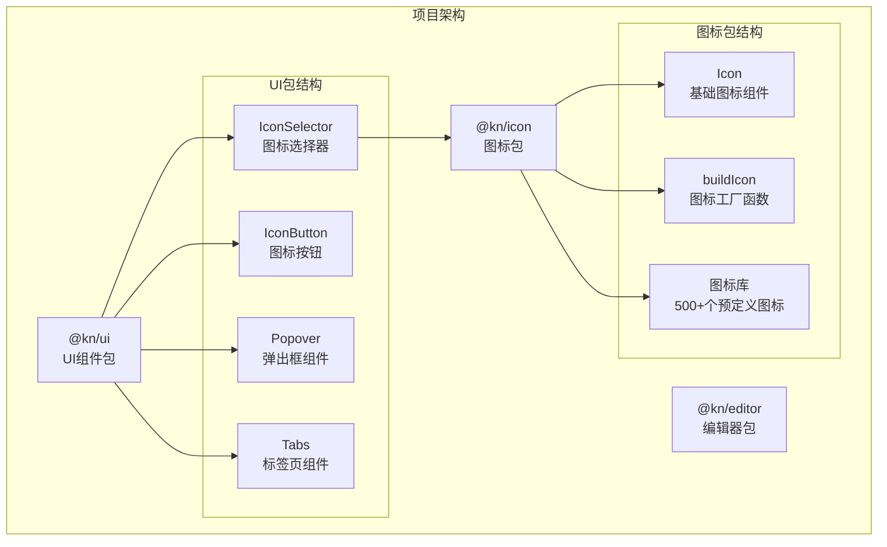
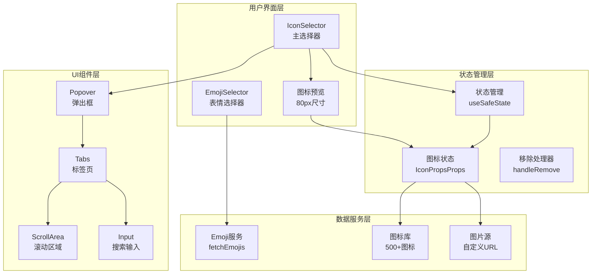
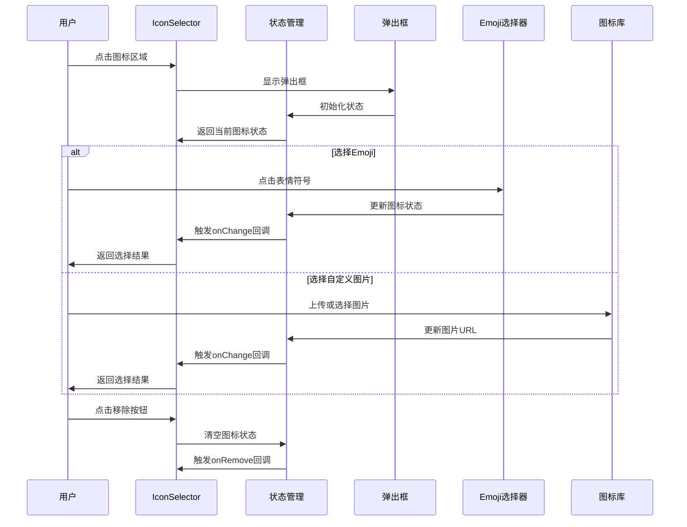
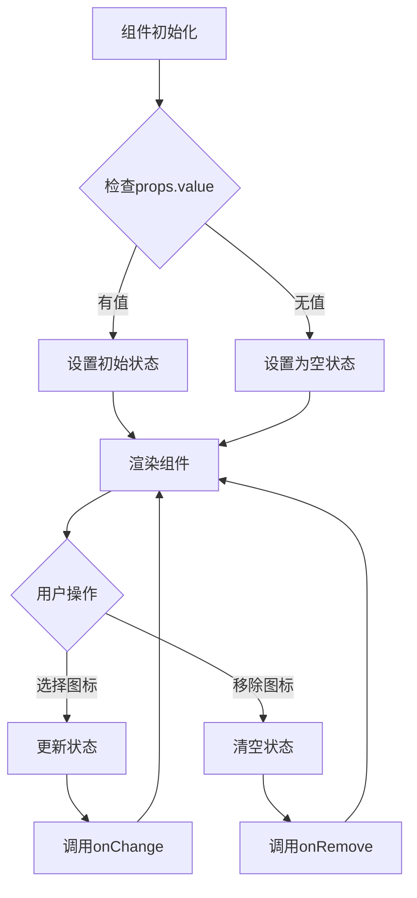
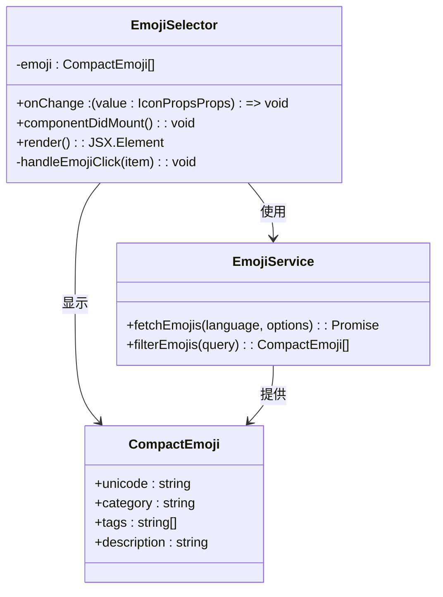
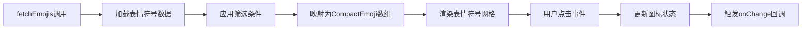
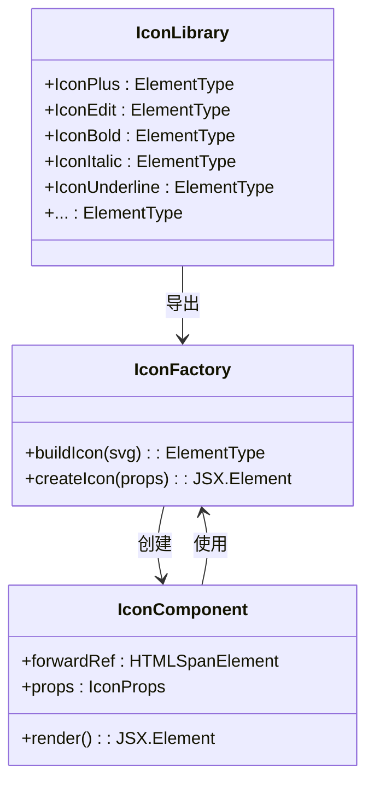
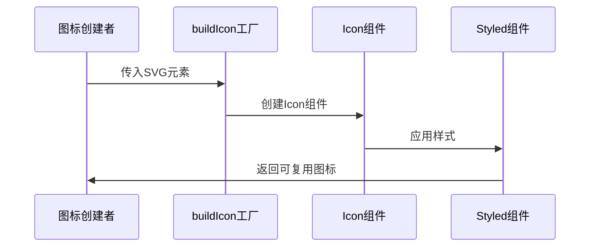

# 图标选择器组件

<cite>
**本文档引用的文件**
- [packages/ui/src/components/IconSelector.tsx](file://packages/ui/src/components/IconSelector.tsx)
- [packages/icon/src/icons/icon.tsx](file://packages/icon/src/icons/icon.tsx)
- [packages/icon/src/icons/index.tsx](file://packages/icon/src/icons/index.tsx)
- [packages/icon/src/index.ts](file://packages/icon/src/index.ts)
- [packages/ui/src/components/ui/icon-button.tsx](file://packages/ui/src/components/ui/icon-button.tsx)
- [packages/icon/package.json](file://packages/icon/package.json)
- [packages/ui/package.json](file://packages/ui/package.json)
</cite>

## 目录
1. [简介](#简介)
2. [项目结构](#项目结构)
3. [核心组件](#核心组件)
4. [架构概览](#架构概览)
5. [详细组件分析](#详细组件分析)
6. [依赖关系分析](#依赖关系分析)
7. [性能考虑](#性能考虑)
8. [故障排除指南](#故障排除指南)
9. [结论](#结论)

## 简介

图标选择器组件是知识库项目中的一个核心UI组件，用于让用户从多种图标源中选择合适的图标。该组件支持两种主要的图标类型：Emoji表情符号和自定义图片图标。通过弹出式选择器界面，用户可以轻松浏览、搜索和选择所需的图标。

该组件采用现代化的React设计模式，结合了styled-components进行样式管理、Radix UI组件库提供基础UI功能，以及emojibase库处理表情符号数据。组件设计注重用户体验，提供了直观的交互方式和良好的可扩展性。

## 项目结构

图标选择器组件位于项目的UI包中，与图标包紧密集成。整体项目结构采用monorepo架构，将不同的功能模块分离到独立的包中：



**图表来源**
- [packages/ui/src/components/IconSelector.tsx:1-131](file://packages/ui/src/components/IconSelector.tsx#L1-L131)
- [packages/icon/src/icons/index.tsx:1-527](file://packages/icon/src/icons/index.tsx#L1-L527)

**章节来源**
- [packages/ui/src/components/IconSelector.tsx:1-131](file://packages/ui/src/components/IconSelector.tsx#L1-L131)
- [packages/icon/src/icons/index.tsx:1-527](file://packages/icon/src/icons/index.tsx#L1-L527)

## 核心组件

### IconSelector 组件

IconSelector是整个图标选择器的核心组件，负责管理图标选择的状态和用户交互。该组件支持两种图标类型的选择，并提供了完整的图标预览功能。

**主要特性：**
- 支持Emoji和图片两种图标类型
- 实时图标预览显示
- 弹出式选择界面
- 可选的图标移除功能
- 响应式设计适配不同屏幕尺寸

**组件接口：**
```typescript
interface IconSelectorProps {
  onChange: (icon: IconPropsProps) => void;
  onRemove?: () => void;
  value?: IconPropsProps;
}

interface IconPropsProps {
  type: 'IMAGE' | 'EMOJI';
  icon: string;
}
```

### Icon 基础组件

Icon组件是所有图标的基础包装器，提供了统一的图标渲染机制和样式管理。它使用styled-components进行样式处理，确保图标在不同环境下的一致表现。

**核心功能：**
- 统一的图标容器样式
- 点击事件处理
- CSS样式属性支持
- 类名定制能力

**章节来源**
- [packages/ui/src/components/IconSelector.tsx:18-22](file://packages/ui/src/components/IconSelector.tsx#L18-L22)
- [packages/icon/src/icons/icon.tsx:4-9](file://packages/icon/src/icons/icon.tsx#L4-L9)
- [packages/icon/src/icons/icon.tsx:21-29](file://packages/icon/src/icons/icon.tsx#L21-L29)

## 架构概览

图标选择器组件采用了分层架构设计，将功能逻辑、UI展示和数据管理清晰分离：



**图表来源**
- [packages/ui/src/components/IconSelector.tsx:55-131](file://packages/ui/src/components/IconSelector.tsx#L55-L131)
- [packages/icon/src/icons/index.tsx:1-527](file://packages/icon/src/icons/index.tsx#L1-L527)

## 详细组件分析

### IconSelector 主组件

IconSelector组件是整个图标选择器的核心，实现了完整的图标选择流程：



**图表来源**
- [packages/ui/src/components/IconSelector.tsx:55-131](file://packages/ui/src/components/IconSelector.tsx#L55-L131)

#### 组件状态管理

组件使用`useSafeState`钩子进行状态管理，确保状态更新的安全性和一致性：



**图表来源**
- [packages/ui/src/components/IconSelector.tsx:57-62](file://packages/ui/src/components/IconSelector.tsx#L57-L62)

**章节来源**
- [packages/ui/src/components/IconSelector.tsx:55-131](file://packages/ui/src/components/IconSelector.tsx#L55-L131)

### Emoji 选择器

Emoji选择器组件提供了丰富的表情符号选择功能，集成了emojibase库的强大表情符号数据：



**图表来源**
- [packages/ui/src/components/IconSelector.tsx:24-52](file://packages/ui/src/components/IconSelector.tsx#L24-L52)

#### 表情符号数据流

表情符号的加载和处理遵循以下流程：



**图表来源**
- [packages/ui/src/components/IconSelector.tsx:26-30](file://packages/ui/src/components/IconSelector.tsx#L26-L30)

**章节来源**
- [packages/ui/src/components/IconSelector.tsx:24-52](file://packages/ui/src/components/IconSelector.tsx#L24-L52)

### 图标库系统

图标包提供了超过500个预定义图标，涵盖了各种使用场景和风格需求：



**图表来源**
- [packages/icon/src/icons/icon.tsx:31-34](file://packages/icon/src/icons/icon.tsx#L31-L34)
- [packages/icon/src/icons/index.tsx:1-527](file://packages/icon/src/icons/index.tsx#L1-L527)

#### 图标构建流程

每个图标都是通过工厂函数动态创建的：



**图表来源**
- [packages/icon/src/icons/icon.tsx:31-34](file://packages/icon/src/icons/icon.tsx#L31-L34)

**章节来源**
- [packages/icon/src/icons/index.tsx:1-527](file://packages/icon/src/icons/index.tsx#L1-L527)
- [packages/icon/src/icons/icon.tsx:31-34](file://packages/icon/src/icons/icon.tsx#L31-L34)

## 依赖关系分析

图标选择器组件的依赖关系体现了现代React开发的最佳实践：

```mermaid
graph TB
subgraph "外部依赖"
REACT[React 18+]
STYLED[styled-components]
RADIX_UI[Radix UI]
EMOJIBASE[emojibase]
LUCIDE[lucide-react]
REACT_ICONS[react-icons]
end
subgraph "内部包依赖"
UI_PKG[@kn/ui]
ICON_PKG[@kn/icon]
COMMON_PKG[@kn/common]
end
subgraph "图标选择器组件"
ICON_SELECTOR[IconSelector]
ICON_BUTTON[IconButton]
BASE_ICON[Icon]
end
UI_PKG --> ICON_SELECTOR
UI_PKG --> ICON_BUTTON
ICON_PKG --> BASE_ICON
ICON_SELECTOR --> ICON_PKG
ICON_SELECTOR --> RADIX_UI
ICON_SELECTOR --> EMOJIBASE
ICON_SELECTOR --> STYLED
ICON_BUTTON --> RADIX_UI
BASE_ICON --> STYLED
BASE_ICON --> LUCIDE
BASE_ICON --> REACT_ICONS
```

**图表来源**
- [packages/ui/package.json:23-90](file://packages/ui/package.json#L23-L90)
- [packages/icon/package.json:18-26](file://packages/icon/package.json#L18-L26)

### 关键依赖说明

**UI组件库依赖：**
- Radix UI：提供无障碍、可访问性的基础UI组件
- styled-components：实现CSS-in-JS样式管理
- emojibase：处理表情符号数据和分类

**图标库依赖：**
- lucide-react：提供简洁线性图标
- react-icons：包含多个图标库集合
- brand-logos：品牌和公司logo图标

**章节来源**
- [packages/ui/package.json:23-90](file://packages/ui/package.json#L23-L90)
- [packages/icon/package.json:18-26](file://packages/icon/package.json#L18-L26)

## 性能考虑

图标选择器组件在设计时充分考虑了性能优化：

### 渲染优化策略

1. **懒加载机制**：表情符号数据按需加载，避免初始化时的性能开销
2. **虚拟滚动**：对于大量图标的场景，使用虚拟滚动技术提升渲染性能
3. **状态缓存**：使用useSafeState避免不必要的重渲染
4. **样式优化**：styled-components的样式缓存机制

### 内存管理

- 组件卸载时自动清理事件监听器
- 图标资源的及时释放
- 防抖处理减少频繁的状态更新

### 加载性能

- 图标库的按需导入
- 压缩后的生产构建
- CDN加速的静态资源

## 故障排除指南

### 常见问题及解决方案

**问题1：表情符号无法显示**
- 检查网络连接是否正常
- 验证emojibase库的版本兼容性
- 确认语言设置是否正确

**问题2：图标点击无响应**
- 检查onClick事件绑定
- 验证组件的disabled状态
- 确认父容器的z-index层级

**问题3：样式显示异常**
- 检查styled-components的注入顺序
- 验证CSS类名冲突
- 确认主题配置正确

**问题4：性能问题**
- 检查是否有过多的重渲染
- 验证状态更新的必要性
- 考虑实现防抖机制

### 调试技巧

1. **开发者工具**：使用React DevTools检查组件树和状态
2. **控制台日志**：添加必要的日志输出定位问题
3. **网络面板**：监控表情符号数据的加载情况
4. **性能面板**：分析组件的渲染性能

**章节来源**
- [packages/ui/src/components/IconSelector.tsx:64-76](file://packages/ui/src/components/IconSelector.tsx#L64-L76)

## 结论

图标选择器组件是知识库项目中一个设计精良、功能完善的UI组件。它成功地整合了多种图标源，提供了优秀的用户体验和良好的可扩展性。

**主要优势：**
- 模块化设计，易于维护和扩展
- 现代化的React开发模式
- 完善的类型安全支持
- 良好的性能表现
- 丰富的图标资源

**未来改进方向：**
- 添加更多图标源的支持
- 实现图标搜索功能
- 优化移动端用户体验
- 增强可访问性支持

该组件为整个知识库项目提供了强大的图标选择能力，是构建现代化用户界面的重要基础设施。