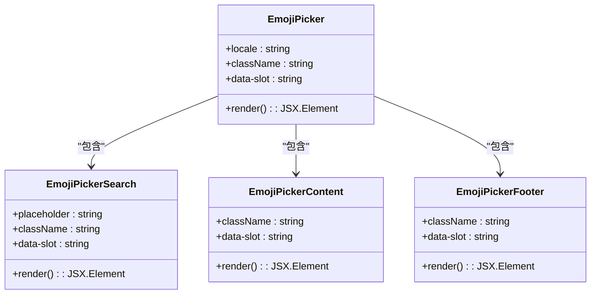
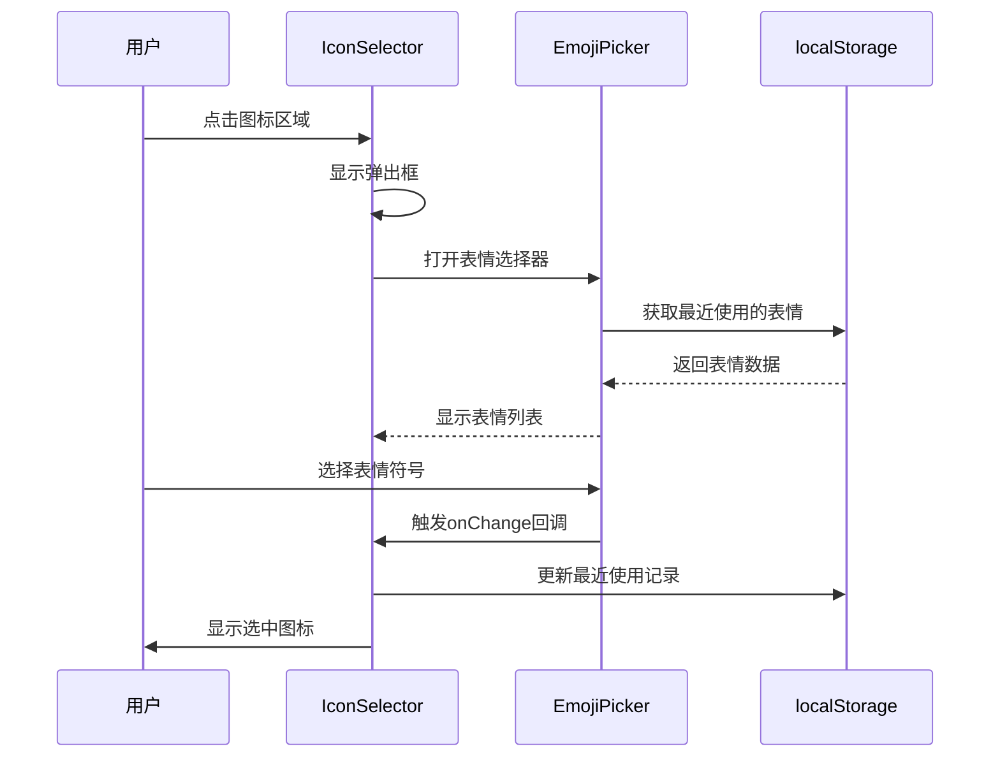
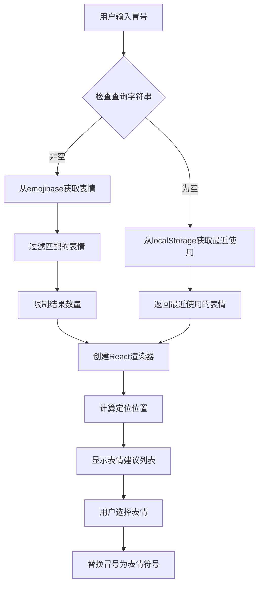
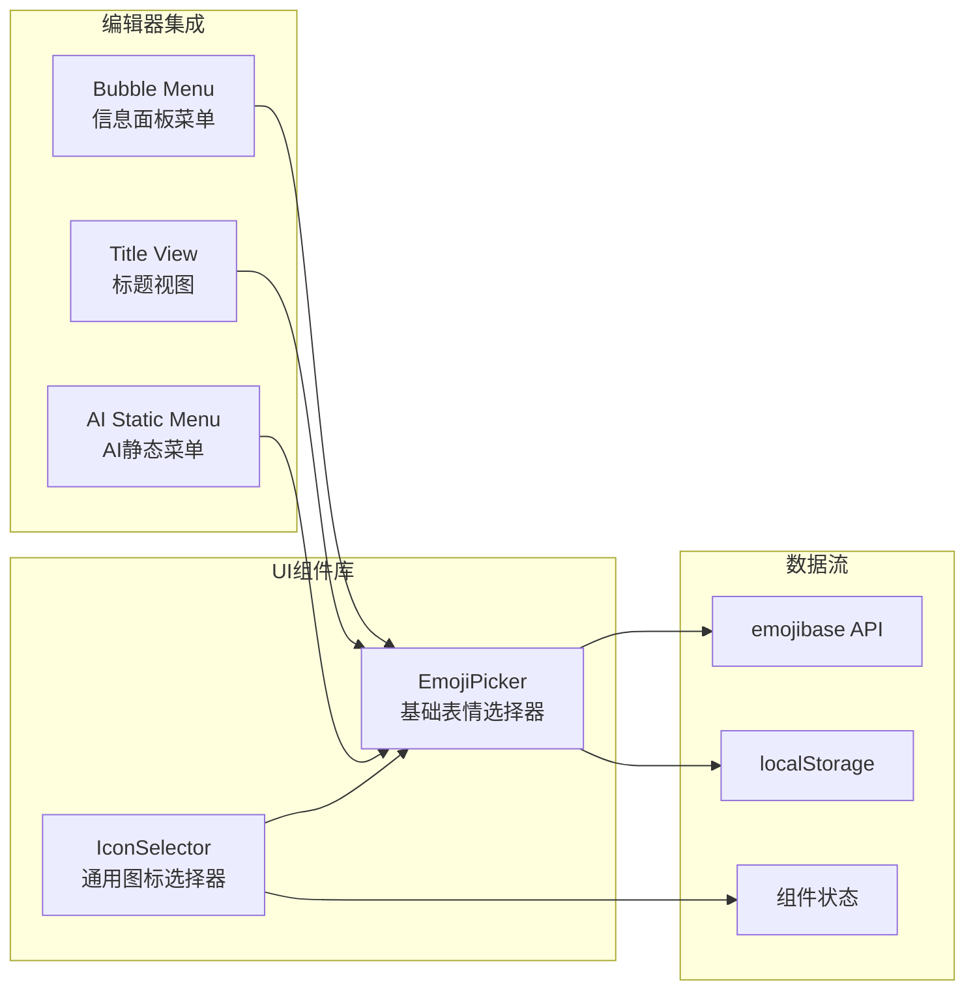
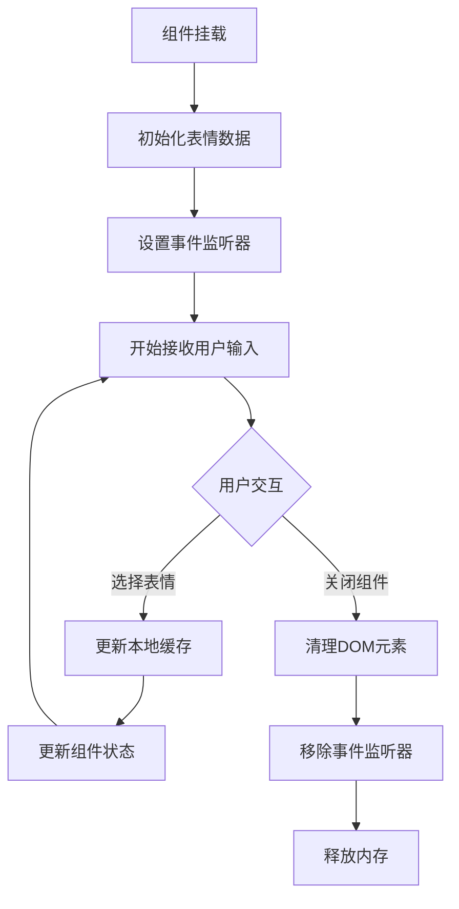

# 表情包选择器组件

<cite>
**本文档引用的文件**
- [emoji-picker.tsx](file://packages/ui/src/components/ui/emoji-picker.tsx)
- [IconSelector.tsx](file://packages/ui/src/components/IconSelector.tsx)
- [emoji-suggestions.ts](file://packages/editor/src/extensions/emoji/emoji-suggestions.ts)
- [emoji-list.tsx](file://packages/editor/src/extensions/emoji/emoji-list.tsx)
- [index.tsx](file://packages/editor/src/extensions/emoji/index.tsx)
- [package.json（编辑器）](file://packages/editor/package.json)
- [package.json（UI组件库）](file://packages/ui/package.json)
- [bubble.tsx](file://packages/editor/src/extensions/info-panel/menu/bubble.tsx)
- [title-view.tsx](file://packages/editor/src/extensions/title/title-view.tsx)
</cite>

## 目录
1. [简介](#简介)
2. [项目结构](#项目结构)
3. [核心组件](#核心组件)
4. [架构概览](#架构概览)
5. [详细组件分析](#详细组件分析)
6. [依赖关系分析](#依赖关系分析)
7. [性能考虑](#性能考虑)
8. [故障排除指南](#故障排除指南)
9. [结论](#结论)

## 简介

表情包选择器组件是知识库平台中的重要功能模块，提供了丰富的表情符号选择和管理能力。该组件基于现代前端技术栈构建，集成了实时协作编辑、本地存储优化和响应式设计等特性。

系统包含两个主要的表情包选择器组件：

1. **编辑器表情包选择器**：集成在富文本编辑器中，支持快捷键触发和智能建议
2. **通用图标选择器**：提供更完整的界面，支持表情符号和图标选择

## 项目结构

表情包选择器组件分布在两个主要包中：

```mermaid
graph TB
subgraph "UI组件库 (@kn/ui)"
A[emoji-picker.tsx<br/>基础表情选择器]
B[IconSelector.tsx<br/>通用图标选择器]
end
subgraph "编辑器 (@kn/editor)"
C[emoji-suggestions.ts<br/>表情建议系统]
D[emoji-list.tsx<br/>表情列表组件]
E[index.tsx<br/>表情扩展入口]
end
subgraph "外部依赖"
F[frimousse<br/>表情选择器库]
G[emojibase<br/>表情数据源]
H[@floating-ui<br/>定位计算]
end
A --> F
B --> A
C --> G
C --> H
D --> G
E --> C
```

**图表来源**
- [emoji-picker.tsx:1-170](file://packages/ui/src/components/ui/emoji-picker.tsx#L1-L170)
- [IconSelector.tsx:1-131](file://packages/ui/src/components/IconSelector.tsx#L1-L131)
- [emoji-suggestions.ts:1-108](file://packages/editor/src/extensions/emoji/emoji-suggestions.ts#L1-L108)

**章节来源**
- [emoji-picker.tsx:1-170](file://packages/ui/src/components/ui/emoji-picker.tsx#L1-L170)
- [IconSelector.tsx:1-131](file://packages/ui/src/components/IconSelector.tsx#L1-L131)
- [emoji-suggestions.ts:1-108](file://packages/editor/src/extensions/emoji/emoji-suggestions.ts#L1-L108)

## 核心组件

### 基础表情选择器组件

基础表情选择器组件提供了完整的表情符号选择功能，包括搜索、分类浏览和皮肤色调选择。

**主要特性：**
- 多语言支持（中文）
- 实时搜索过滤
- 分类标签浏览
- 皮肤色调调节
- 加载状态指示

**章节来源**
- [emoji-picker.tsx:12-27](file://packages/ui/src/components/ui/emoji-picker.tsx#L12-L27)

### 通用图标选择器组件

通用图标选择器组件提供了更丰富的界面，支持表情符号和图标两种类型的选择。

**主要特性：**
- 双标签页界面（Emoji/Icons）
- 弹出框触发
- 图标移除功能
- 响应式布局设计

**章节来源**
- [IconSelector.tsx:55-131](file://packages/ui/src/components/IconSelector.tsx#L55-L131)

### 编辑器表情扩展

编辑器表情扩展提供了无缝集成到富文本编辑器的功能。

**主要特性：**
- 快捷键触发（冒号）
- 智能建议系统
- 浮动定位计算
- 本地存储优化

**章节来源**
- [index.tsx:5-20](file://packages/editor/src/extensions/emoji/index.tsx#L5-L20)
- [emoji-suggestions.ts:13-36](file://packages/editor/src/extensions/emoji/emoji-suggestions.ts#L13-L36)

## 架构概览

表情包选择器组件采用分层架构设计，确保了良好的可维护性和扩展性。

```mermaid
graph TD
subgraph "用户界面层"
UI1[IconSelector 组件]
UI2[EmojiPicker 组件]
UI3[Bubble Menu 集成]
end
subgraph "业务逻辑层"
BL1[表情选择处理]
BL2[搜索过滤逻辑]
BL3[本地存储管理]
end
subgraph "数据访问层"
DA1[emojibase 数据源]
DA2[localStorage 存储]
DA3[位置计算服务]
end
subgraph "外部依赖"
EX1[frimousse UI库]
EX2[@floating-ui 定位]
EX3[Tiptap 编辑器]
end
UI1 --> BL1
UI2 --> BL2
UI3 --> BL1
BL1 --> DA1
BL2 --> DA1
BL3 --> DA2
BL3 --> DA3
UI1 --> EX1
UI2 --> EX1
UI3 --> EX3
BL3 --> EX2
```

**图表来源**
- [IconSelector.tsx:78-131](file://packages/ui/src/components/IconSelector.tsx#L78-L131)
- [emoji-picker.tsx:1-170](file://packages/ui/src/components/ui/emoji-picker.tsx#L1-L170)
- [bubble.tsx:152-177](file://packages/editor/src/extensions/info-panel/menu/bubble.tsx#L152-L177)

## 详细组件分析

### 基础表情选择器组件

基础表情选择器组件是整个表情包选择器系统的核心，提供了完整的表情符号选择功能。



**图表来源**
- [emoji-picker.tsx:12-27](file://packages/ui/src/components/ui/emoji-picker.tsx#L12-L27)
- [emoji-picker.tsx:29-51](file://packages/ui/src/components/ui/emoji-picker.tsx#L29-L51)
- [emoji-picker.tsx:95-128](file://packages/ui/src/components/ui/emoji-picker.tsx#L95-L128)
- [emoji-picker.tsx:130-163](file://packages/ui/src/components/ui/emoji-picker.tsx#L130-L163)

**组件功能分析：**

1. **EmojiPicker根组件**：设置国际化配置和样式类
2. **EmojiPickerSearch搜索组件**：提供搜索输入和皮肤色调选择
3. **EmojiPickerContent内容组件**：显示表情符号列表和加载状态
4. **EmojiPickerFooter底部组件**：显示当前选中的表情符号信息

**章节来源**
- [emoji-picker.tsx:1-170](file://packages/ui/src/components/ui/emoji-picker.tsx#L1-L170)

### 通用图标选择器组件

通用图标选择器组件提供了更完整的界面，支持多种图标类型的管理。



**图表来源**
- [IconSelector.tsx:78-131](file://packages/ui/src/components/IconSelector.tsx#L78-L131)
- [emoji-picker.tsx:111-123](file://packages/ui/src/components/ui/emoji-picker.tsx#L111-L123)

**组件交互流程：**

1. **初始化阶段**：组件挂载时获取所有可用的表情符号
2. **用户交互**：通过弹出框提供表情选择界面
3. **数据持久化**：使用localStorage存储最近使用的表情
4. **状态管理**：通过受控组件模式管理图标状态

**章节来源**
- [IconSelector.tsx:1-131](file://packages/ui/src/components/IconSelector.tsx#L1-L131)

### 编辑器表情扩展

编辑器表情扩展提供了无缝集成到富文本编辑器的功能，支持智能建议和快捷键触发。



**图表来源**
- [emoji-suggestions.ts:14-36](file://packages/editor/src/extensions/emoji/emoji-suggestions.ts#L14-L36)
- [emoji-suggestions.ts:65-105](file://packages/editor/src/extensions/emoji/emoji-suggestions.ts#L65-L105)

**核心算法实现：**

1. **智能搜索算法**：支持按标签和描述搜索表情符号
2. **本地缓存策略**：优化用户体验，快速显示最近使用的表情
3. **动态定位系统**：使用@floating-ui计算最佳显示位置
4. **键盘导航支持**：提供完整的键盘操作体验

**章节来源**
- [emoji-suggestions.ts:1-108](file://packages/editor/src/extensions/emoji/emoji-suggestions.ts#L1-L108)
- [emoji-list.tsx:14-97](file://packages/editor/src/extensions/emoji/emoji-list.tsx#L14-L97)

### 集成点分析

表情包选择器组件在系统中有多个集成点，确保了功能的一致性和用户体验的连贯性。



**图表来源**
- [bubble.tsx:152-177](file://packages/editor/src/extensions/info-panel/menu/bubble.tsx#L152-L177)
- [title-view.tsx:330-344](file://packages/editor/src/extensions/title/title-view.tsx#L330-L344)

**集成特点：**

1. **统一的数据源**：所有组件共享相同的emojibase数据源
2. **一致的UI风格**：基于相同的样式系统和设计规范
3. **灵活的触发方式**：支持多种用户交互场景
4. **状态同步机制**：确保不同组件间的状态一致性

**章节来源**
- [bubble.tsx:150-190](file://packages/editor/src/extensions/info-panel/menu/bubble.tsx#L150-L190)
- [title-view.tsx:318-347](file://packages/editor/src/extensions/title/title-view.tsx#L318-L347)

## 依赖关系分析

表情包选择器组件的依赖关系体现了清晰的分层架构和模块化设计。

```mermaid
graph TB
subgraph "UI组件库依赖"
A[@kn/ui]
A1[frimousse ^0.2.0]
A2[emojibase ^15.3.1]
A3[@kn/icon]
A4[@kn/ui/lib/utils]
end
subgraph "编辑器依赖"
B[@kn/editor]
B1[@tiptap/react ^3.15.3]
B2[@floating-ui/dom ^1.6.0]
B3[emojibase ^15.3.1]
B4[@kn/common]
end
subgraph "共享依赖"
C[emojibase ^15.3.1]
D[@kn/icon]
E[@kn/ui/lib/utils]
end
A --> A1
A --> A2
A --> A3
A --> A4
B --> B1
B --> B2
B --> B3
B --> B4
A2 --> C
B3 --> C
A3 --> D
A4 --> E
```

**图表来源**
- [package.json（UI组件库）:23-90](file://packages/ui/package.json#L23-L90)
- [package.json（编辑器）:16-93](file://packages/editor/package.json#L16-L93)

**依赖特点：**

1. **版本控制**：所有包都明确声明了依赖版本
2. **共享资源**：emojibase和@kn/icon作为共享依赖
3. **模块化设计**：UI组件库和编辑器各自维护独立的依赖树
4. **兼容性保证**：通过workspace:*确保内部包的版本一致性

**章节来源**
- [package.json（UI组件库）:1-91](file://packages/ui/package.json#L1-L91)
- [package.json（编辑器）:1-106](file://packages/editor/package.json#L1-L106)

## 性能考虑

表情包选择器组件在设计时充分考虑了性能优化，采用了多种策略来提升用户体验。

### 性能优化策略

1. **懒加载机制**：表情符号数据按需加载，减少初始渲染时间
2. **本地缓存**：使用localStorage存储最近使用的表情，避免重复请求
3. **虚拟滚动**：对于大量表情符号的情况，采用虚拟滚动技术
4. **防抖搜索**：搜索功能使用防抖机制，减少不必要的计算
5. **内存管理**：及时清理DOM元素和事件监听器

### 内存管理流程



**章节来源**
- [emoji-suggestions.ts:100-105](file://packages/editor/src/extensions/emoji/emoji-suggestions.ts#L100-L105)
- [emoji-list.tsx:20-34](file://packages/editor/src/extensions/emoji/emoji-list.tsx#L20-L34)

## 故障排除指南

### 常见问题及解决方案

**问题1：表情符号无法显示**
- 检查网络连接是否正常
- 验证emojibase API的可用性
- 确认浏览器支持Unicode表情符号

**问题2：搜索功能异常**
- 清除浏览器缓存
- 检查localStorage权限
- 验证搜索关键词格式

**问题3：定位计算错误**
- 检查容器元素的CSS样式
- 验证z-index层级设置
- 确认相对定位元素的存在

**问题4：键盘导航失效**
- 检查事件监听器绑定
- 验证焦点管理
- 确认键盘事件处理逻辑

### 调试工具和方法

1. **浏览器开发者工具**：监控网络请求和DOM变化
2. **React DevTools**：检查组件状态和属性
3. **性能分析器**：识别性能瓶颈
4. **控制台日志**：跟踪执行流程和错误信息

**章节来源**
- [emoji-suggestions.ts:45-62](file://packages/editor/src/extensions/emoji/emoji-suggestions.ts#L45-L62)
- [emoji-list.tsx:54-73](file://packages/editor/src/extensions/emoji/emoji-list.tsx#L54-L73)

## 结论

表情包选择器组件展现了现代前端开发的最佳实践，通过精心设计的架构和完善的性能优化，为用户提供了流畅的表情符号选择体验。

### 主要成就

1. **模块化设计**：清晰的组件分离和职责划分
2. **性能优化**：多层缓存和懒加载策略
3. **用户体验**：直观的界面设计和流畅的交互
4. **可维护性**：标准化的代码结构和文档

### 技术亮点

- 基于emojibase的完整表情符号数据支持
- @floating-ui提供的精确定位计算
- localStorage驱动的智能缓存机制
- 响应式设计确保跨设备兼容性

该组件为知识库平台的用户提供了丰富的情感表达工具，是现代Web应用中表情符号集成的优秀范例。