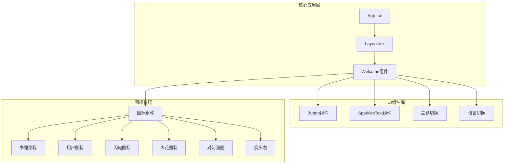
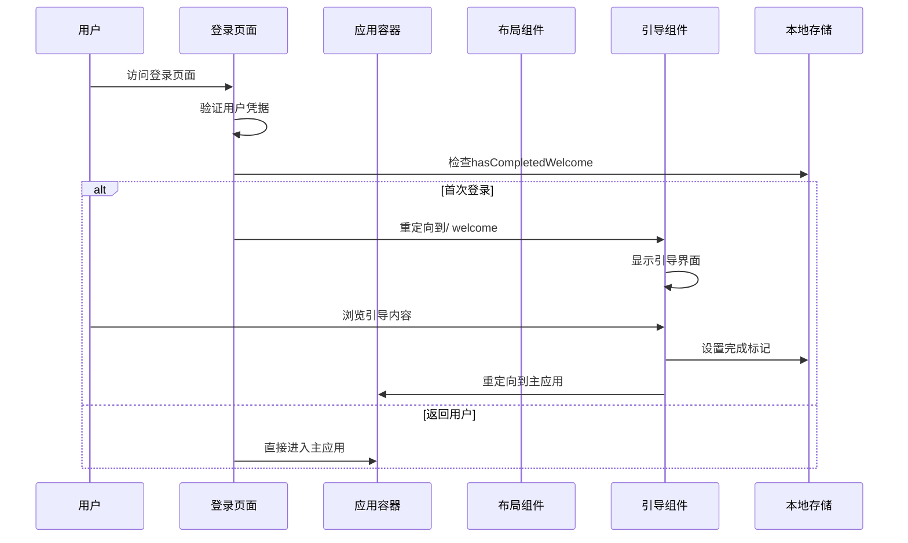
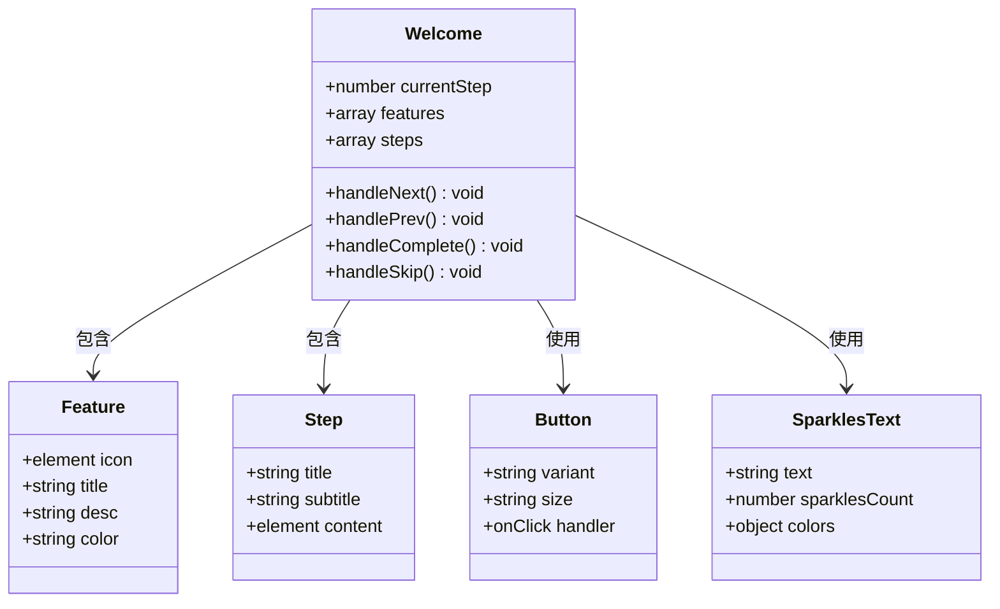
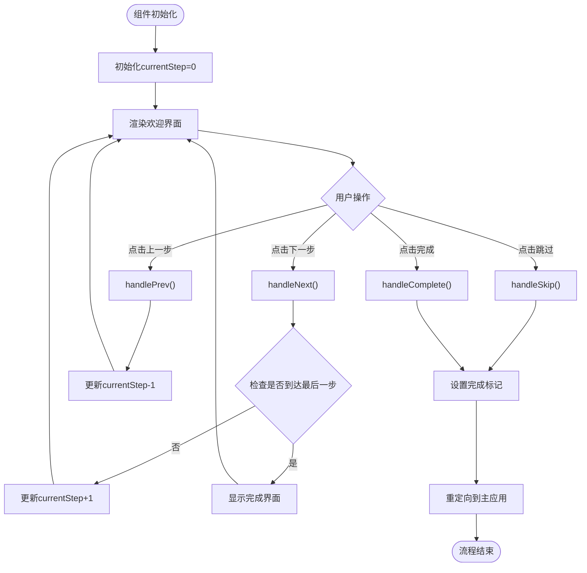
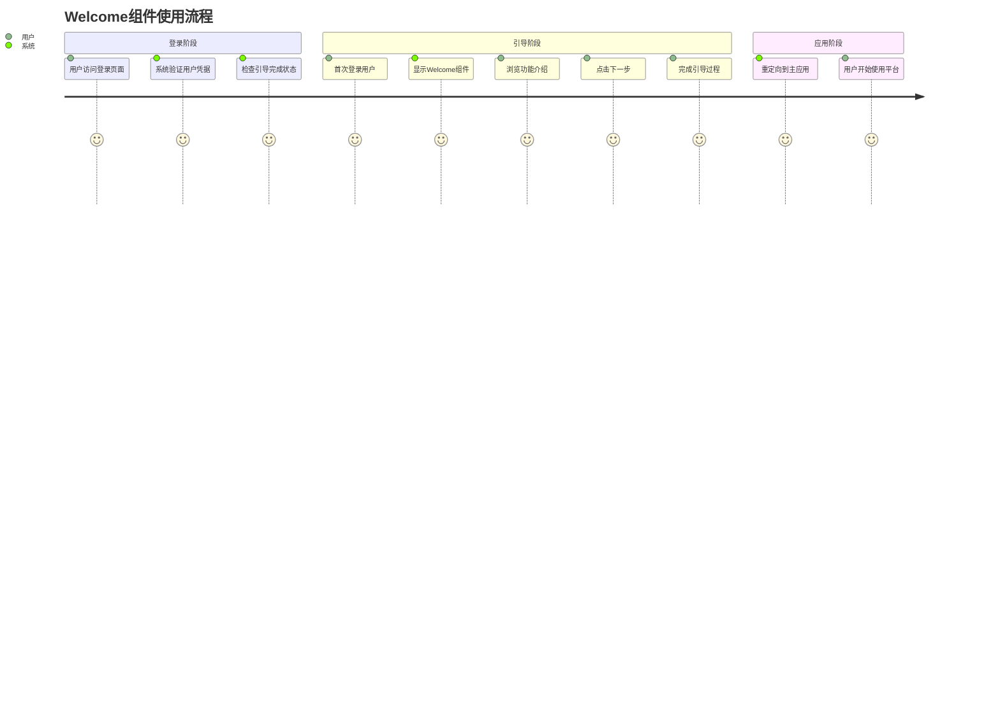

# Welcome组件使用指南

<cite>
**本文档引用的文件**
- [packages/core/src/components/Welcome/index.tsx](file://packages/core/src/components/Welcome/index.tsx)
- [packages/core/src/App.tsx](file://packages/core/src/App.tsx)
- [packages/core/src/Layout.tsx](file://packages/core/src/Layout.tsx)
- [packages/core/src/components/Login/index.tsx](file://packages/core/src/components/Login/index.tsx)
- [packages/core/src/locales/LanguageToggle.tsx](file://packages/core/src/locales/LanguageToggle.tsx)
- [packages/ui/src/components/ui/button.tsx](file://packages/ui/src/components/ui/button.tsx)
- [packages/ui/src/components/ui/sparkles-text.tsx](file://packages/ui/src/components/ui/sparkles-text.tsx)
- [packages/icon/src/icons/icon.tsx](file://packages/icon/src/icons/icon.tsx)
</cite>

## 目录
1. [简介](#简介)
2. [项目结构](#项目结构)
3. [核心组件](#核心组件)
4. [架构概览](#架构概览)
5. [详细组件分析](#详细组件分析)
6. [用户流程指南](#用户流程指南)
7. [自定义配置](#自定义配置)
8. [故障排除](#故障排除)
9. [总结](#总结)

## 简介

Welcome组件是Knowledge知识管理平台的核心引导组件，为新用户提供渐进式功能介绍和平台使用指导。该组件采用多步骤向导形式，通过视觉化的方式展示平台的核心功能特性，帮助用户快速了解和上手系统。

该组件集成了现代化的UI设计元素，包括动态渐变背景、动画效果、响应式布局等特性，为用户提供了流畅且愉悦的引导体验。

## 项目结构

Welcome组件在项目中的位置和依赖关系如下：

**图表来源**
- [packages/core/src/App.tsx](file://packages/core/src/App.tsx#L128-L128)
- [packages/core/src/Layout.tsx](file://packages/core/src/Layout.tsx#L80-L80)
- [packages/core/src/components/Welcome/index.tsx](file://packages/core/src/components/Welcome/index.tsx#L1-L1)

**章节来源**
- [packages/core/src/App.tsx](file://packages/core/src/App.tsx#L128-L128)
- [packages/core/src/Layout.tsx](file://packages/core/src/Layout.tsx#L80-L80)
- [packages/core/src/components/Welcome/index.tsx](file://packages/core/src/components/Welcome/index.tsx#L1-L1)

## 核心组件

Welcome组件是一个完整的多步骤引导界面，包含以下核心功能模块：

### 组件架构
- **状态管理**: 使用React useState管理当前步骤状态
- **路由集成**: 与主应用路由系统无缝集成
- **本地存储**: 使用localStorage跟踪用户完成状态
- **国际化支持**: 集成多语言切换功能

### 主要特性
- **渐进式引导**: 三步式引导流程，逐步介绍平台功能
- **响应式设计**: 支持桌面端和移动端适配
- **动画效果**: 内置淡入淡出和滑动动画
- **进度指示**: 可视化的进度条和步骤指示器

**章节来源**
- [packages/core/src/components/Welcome/index.tsx](file://packages/core/src/components/Welcome/index.tsx#L7-L245)

## 架构概览

Welcome组件在整个应用架构中的位置和交互关系：

**图表来源**
- [packages/core/src/components/Login/index.tsx](file://packages/core/src/components/Login/index.tsx#L49-L57)
- [packages/core/src/App.tsx](file://packages/core/src/App.tsx#L128-L128)
- [packages/core/src/components/Welcome/index.tsx](file://packages/core/src/components/Welcome/index.tsx#L113-L121)

**章节来源**
- [packages/core/src/components/Login/index.tsx](file://packages/core/src/components/Login/index.tsx#L41-L60)
- [packages/core/src/App.tsx](file://packages/core/src/App.tsx#L117-L148)

## 详细组件分析

### 组件结构分析

**图表来源**
- [packages/core/src/components/Welcome/index.tsx](file://packages/core/src/components/Welcome/index.tsx#L10-L99)
- [packages/ui/src/components/ui/button.tsx](file://packages/ui/src/components/ui/button.tsx#L36-L57)
- [packages/ui/src/components/ui/sparkles-text.tsx](file://packages/ui/src/components/ui/sparkles-text.tsx#L19-L62)

### 步骤流程分析

Welcome组件包含三个主要步骤：

#### 步骤1：欢迎界面
- 展示品牌标识和平台介绍
- 使用SparklesText组件创造动态效果
- 提供平台核心价值说明

#### 步骤2：功能展示
- 四个核心功能模块的可视化展示
- 每个功能模块包含图标、标题和描述
- 使用渐变色彩方案增强视觉效果

#### 步骤3：完成确认
- 成功完成标志显示
- 行动号召按钮
- 导航到主应用

**章节来源**
- [packages/core/src/components/Welcome/index.tsx](file://packages/core/src/components/Welcome/index.tsx#L37-L99)

### 交互逻辑分析

**图表来源**
- [packages/core/src/components/Welcome/index.tsx](file://packages/core/src/components/Welcome/index.tsx#L101-L121)

**章节来源**
- [packages/core/src/components/Welcome/index.tsx](file://packages/core/src/components/Welcome/index.tsx#L101-L121)

### UI组件集成

Welcome组件集成了多个UI组件库中的组件：

#### 按钮组件
- 使用Button组件提供统一的交互样式
- 支持多种变体和尺寸配置
- 实现渐进式颜色变化效果

#### 文本特效组件
- SparklesText组件提供动态火花效果
- 可配置火花数量和颜色
- 使用Framer Motion实现平滑动画

#### 图标系统
- 集成@kn/icon包中的图标组件
- 支持响应式图标尺寸
- 提供语义化图标使用方式

**章节来源**
- [packages/ui/src/components/ui/button.tsx](file://packages/ui/src/components/ui/button.tsx#L42-L57)
- [packages/ui/src/components/ui/sparkles-text.tsx](file://packages/ui/src/components/ui/sparkles-text.tsx#L64-L154)
- [packages/icon/src/icons/icon.tsx](file://packages/icon/src/icons/icon.tsx#L21-L35)

## 用户流程指南

### 完整使用流程

### 用户操作指南

#### 导航控制
- **下一步按钮**: 移动到下一个引导步骤
- **上一步按钮**: 返回到前一个引导步骤  
- **跳过引导**: 直接完成引导过程
- **开始使用**: 完成所有步骤并进入主应用

#### 视觉反馈
- **进度条**: 实时显示引导完成进度
- **步骤指示器**: 圆点形状显示当前位置
- **动画效果**: 淡入淡出和滑动动画提升用户体验

**章节来源**
- [packages/core/src/components/Welcome/index.tsx](file://packages/core/src/components/Welcome/index.tsx#L176-L211)

## 自定义配置

### 功能模块定制

Welcome组件支持灵活的功能模块定制：

#### 特性模块配置
每个特性模块包含四个关键属性：
- **图标**: 使用@kn/icon包中的图标组件
- **标题**: 功能模块的简短描述
- **描述**: 功能模块的详细说明
- **颜色**: 渐变色彩方案配置

#### 步骤内容定制
- **标题**: 每个步骤的主标题
- **副标题**: 步骤的详细说明
- **内容**: 步骤的具体展示内容

### 样式定制选项

#### 主题集成
- **暗色模式支持**: 自动适配系统主题
- **响应式设计**: 支持不同屏幕尺寸
- **动画配置**: 可调整动画持续时间和缓动效果

#### 本地存储配置
- **完成标记**: 使用localStorage跟踪用户进度
- **语言偏好**: 集成多语言切换功能
- **主题偏好**: 支持明暗主题切换

**章节来源**
- [packages/core/src/components/Welcome/index.tsx](file://packages/core/src/components/Welcome/index.tsx#L10-L99)
- [packages/core/src/locales/LanguageToggle.tsx](file://packages/core/src/locales/LanguageToggle.tsx#L11-L44)

## 故障排除

### 常见问题解决

#### 引导流程异常
**问题**: 用户无法正常完成引导流程
**解决方案**: 
1. 检查localStorage中`hasCompletedWelcome`标记
2. 验证路由配置正确性
3. 确认网络连接稳定

#### 样式显示问题
**问题**: 组件样式显示异常或动画不工作
**解决方案**:
1. 检查Tailwind CSS配置
2. 验证@kn/ui包版本兼容性
3. 确认CSS动画支持情况

#### 交互功能失效
**问题**: 按钮点击无响应或导航失败
**解决方案**:
1. 检查事件处理器绑定
2. 验证路由配置正确性
3. 确认组件重新渲染机制

### 性能优化建议

#### 渲染优化
- 合理使用React.memo避免不必要的重渲染
- 优化动画性能减少CPU占用
- 延迟加载非关键资源

#### 存储优化
- 合理使用localStorage避免存储过多数据
- 实现存储清理机制防止数据膨胀
- 考虑使用IndexedDB处理大量数据

**章节来源**
- [packages/core/src/components/Welcome/index.tsx](file://packages/core/src/components/Welcome/index.tsx#L213-L244)

## 总结

Welcome组件作为Knowledge平台的重要组成部分，通过精心设计的多步骤引导流程，为用户提供了直观且高效的平台使用指导。该组件不仅展示了平台的核心功能特性，还通过现代化的UI设计和交互体验，提升了用户的整体使用满意度。

### 关键优势
- **用户友好**: 渐进式引导降低学习成本
- **视觉丰富**: 动态效果和动画增强用户体验  
- **功能完整**: 集成多语言、主题切换等实用功能
- **易于扩展**: 模块化设计便于功能定制和扩展

### 最佳实践
- 根据目标用户群体调整引导内容
- 定期更新功能展示确保信息准确性
- 监控用户完成率优化引导流程
- 收集用户反馈持续改进组件体验

通过合理使用和配置Welcome组件，开发者可以为用户提供更加友好和专业的平台使用体验，有效提升用户留存率和平台活跃度。