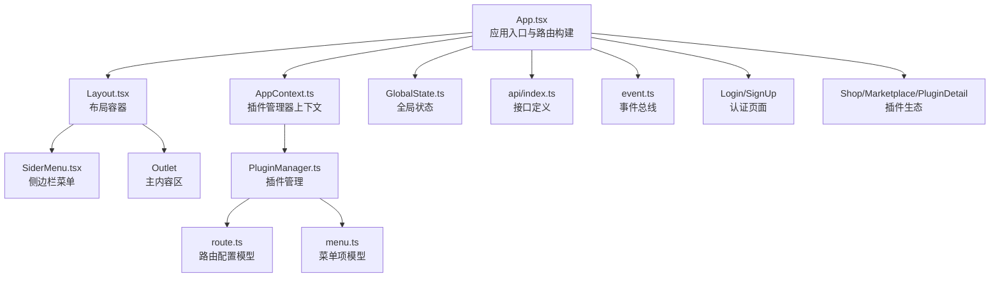
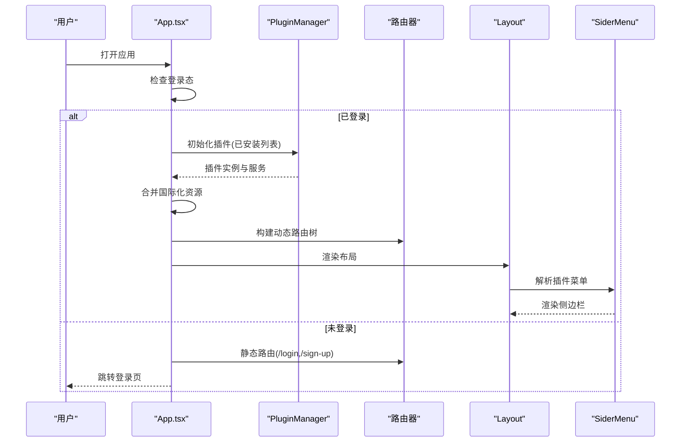
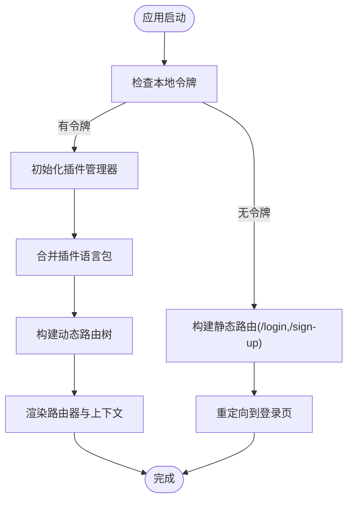
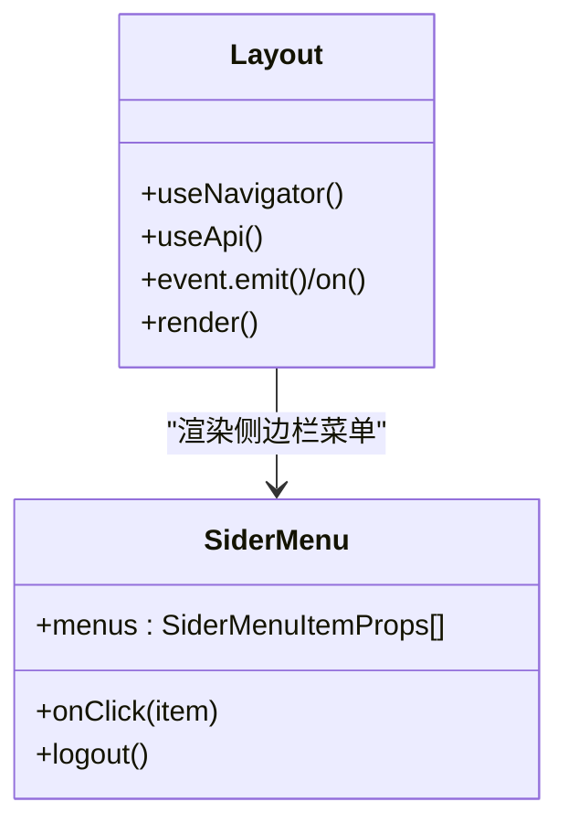
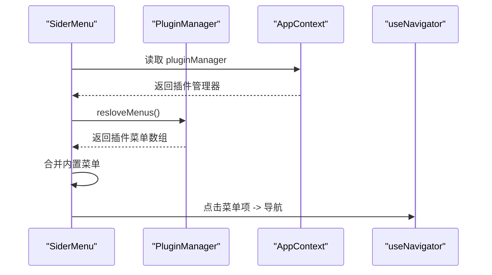
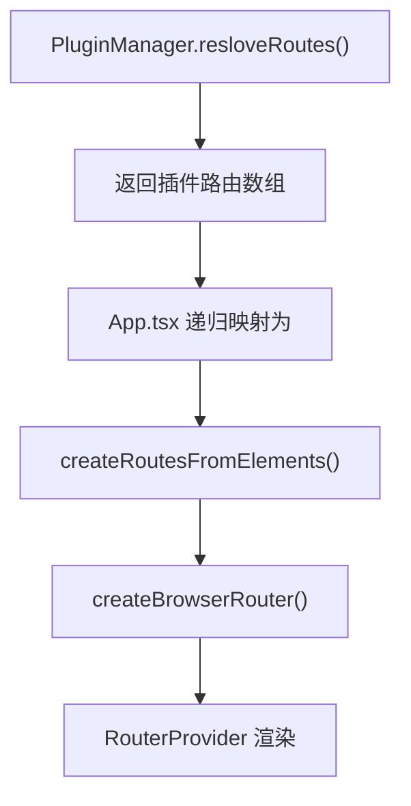
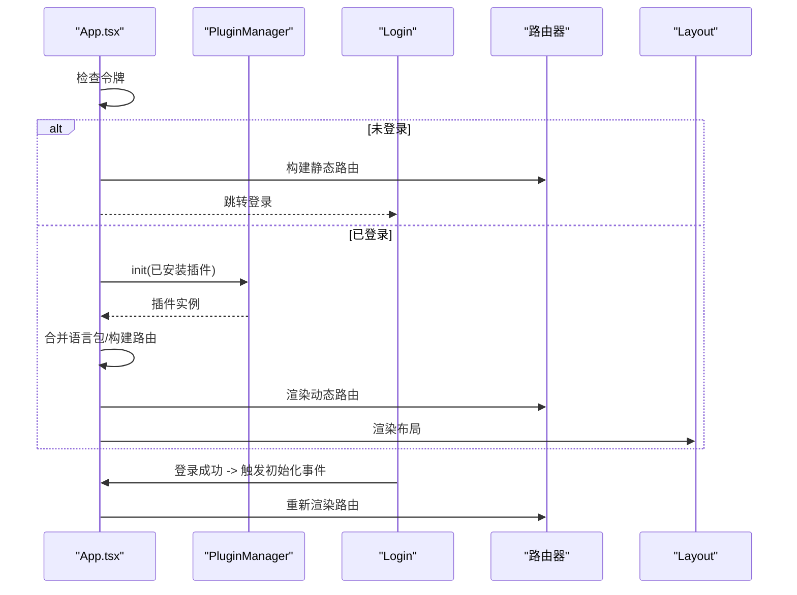
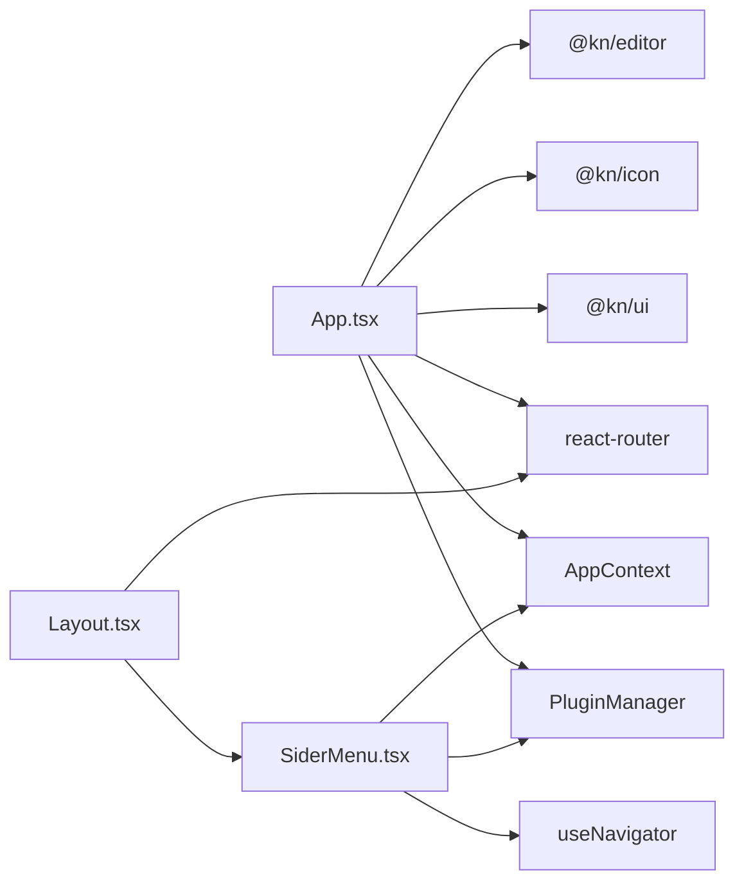

# 应用主组件

<cite>
**本文引用的文件**
- [packages/core/src/App.tsx](file://packages/core/src/App.tsx)
- [packages/core/src/Layout.tsx](file://packages/core/src/Layout.tsx)
- [packages/core/src/components/SiderMenu.tsx](file://packages/core/src/components/SiderMenu.tsx)
- [packages/common/src/core/AppContext.ts](file://packages/common/src/core/AppContext.ts)
- [packages/common/src/core/PluginManager.ts](file://packages/common/src/core/PluginManager.ts)
- [packages/common/src/core/menu.ts](file://packages/common/src/core/menu.ts)
- [packages/common/src/core/route.ts](file://packages/common/src/core/route.ts)
- [packages/core/src/store/GlobalState.ts](file://packages/core/src/store/GlobalState.ts)
- [packages/core/src/hooks/use-navigator.ts](file://packages/core/src/hooks/use-navigator.ts)
- [packages/core/src/api/index.ts](file://packages/core/src/api/index.ts)
- [packages/common/src/event/event.ts](file://packages/common/src/event/event.ts)
- [packages/core/src/components/Login/index.tsx](file://packages/core/src/components/Login/index.tsx)
- [packages/core/src/components/SignUp/index.tsx](file://packages/core/src/components/SignUp/index.tsx)
- [packages/core/src/components/Shop/index.tsx](file://packages/core/src/components/Shop/index.tsx)
- [packages/core/src/components/Shop/Marketplace/index.tsx](file://packages/core/src/components/Shop/Marketplace/index.tsx)
- [packages/core/src/components/Shop/PluginDetail/index.tsx](file://packages/core/src/components/Shop/PluginDetail/index.tsx)
</cite>

## 目录
1. [引言](#引言)
2. [项目结构](#项目结构)
3. [核心组件](#核心组件)
4. [架构总览](#架构总览)
5. [详细组件分析](#详细组件分析)
6. [依赖关系分析](#依赖关系分析)
7. [性能考虑](#性能考虑)
8. [故障排查指南](#故障排查指南)
9. [结论](#结论)
10. [附录](#附录)

## 引言
本文件面向知识库管理系统的核心应用主组件，围绕 App.tsx 作为应用入口，系统性阐述其路由管理、布局系统与全局状态协调；解析 Layout 组件的侧边栏菜单、头部导航与内容区域组织；梳理路由配置（静态路由与动态路由）与菜单系统（动态生成、权限与界面适配）；并给出应用启动流程（插件初始化、用户认证、数据预加载）的完整说明。文档同时提供可视化图示与具体文件路径指引，帮助开发者快速理解与扩展。

## 项目结构
应用主组件位于 packages/core/src，采用“入口组件 + 布局 + 菜单 + 插件生态”的分层设计：
- 入口与路由：App.tsx 负责根据登录态与插件列表构建路由树，并注入上下文与主题/全局状态。
- 布局系统：Layout.tsx 提供侧边栏、主内容区与引导流程；SiderMenu.tsx 聚合插件菜单与内置功能。
- 插件生态：PluginManager.ts 负责插件加载、合并路由/菜单/语言包与服务；AppContext.ts 提供插件管理器的全局访问。
- 认证与商店：Login/SignUp 页面负责用户认证；Shop/Marketplace/PluginDetail 管理插件市场与详情页。

图表来源
- [packages/core/src/App.tsx](file://packages/core/src/App.tsx#L1-L187)
- [packages/core/src/Layout.tsx](file://packages/core/src/Layout.tsx#L1-L157)
- [packages/core/src/components/SiderMenu.tsx](file://packages/core/src/components/SiderMenu.tsx#L1-L171)
- [packages/common/src/core/AppContext.ts](file://packages/common/src/core/AppContext.ts#L1-L13)
- [packages/common/src/core/PluginManager.ts](file://packages/common/src/core/PluginManager.ts#L1-L170)
- [packages/common/src/core/route.ts](file://packages/common/src/core/route.ts#L1-L8)
- [packages/common/src/core/menu.ts](file://packages/common/src/core/menu.ts#L1-L25)
- [packages/core/src/store/GlobalState.ts](file://packages/core/src/store/GlobalState.ts#L1-L32)
- [packages/core/src/api/index.ts](file://packages/core/src/api/index.ts#L1-L49)
- [packages/common/src/event/event.ts](file://packages/common/src/event/event.ts#L1-L44)
- [packages/core/src/components/Login/index.tsx](file://packages/core/src/components/Login/index.tsx#L1-L146)
- [packages/core/src/components/SignUp/index.tsx](file://packages/core/src/components/SignUp/index.tsx#L1-L130)
- [packages/core/src/components/Shop/index.tsx](file://packages/core/src/components/Shop/index.tsx#L1-L220)
- [packages/core/src/components/Shop/Marketplace/index.tsx](file://packages/core/src/components/Shop/Marketplace/index.tsx#L1-L192)
- [packages/core/src/components/Shop/PluginDetail/index.tsx](file://packages/core/src/components/Shop/PluginDetail/index.tsx#L1-L85)

章节来源
- [packages/core/src/App.tsx](file://packages/core/src/App.tsx#L1-L187)
- [packages/core/src/Layout.tsx](file://packages/core/src/Layout.tsx#L1-L157)

## 核心组件
- App.tsx：应用入口，负责：
  - 插件管理器初始化与动态路由构建；
  - 国际化资源合并与初始化；
  - 登录态判断与路由切换；
  - 提供 AppContext 与主题/全局状态/模态等上下文。
- Layout.tsx：布局容器，负责：
  - 侧边栏菜单渲染与主内容 Outlet；
  - 用户信息拉取与跳转；
  - 插件安装请求弹窗与引导流程。
- SiderMenu.tsx：侧边栏菜单，聚合插件菜单与内置功能（商店、消息、设置、用户信息），支持点击导航与下拉操作。
- PluginManager.ts：插件管理器，负责远程插件脚本加载、合并路由/菜单/语言包与服务，提供安装/卸载能力。
- AppContext.ts：应用上下文，向子组件暴露插件管理器实例。
- GlobalState.ts：全局状态模型，包含用户信息、应用信息、标签页与折叠状态等。
- use-navigator.ts：统一导航封装，支持带标签页附加的导航。
- api/index.ts：集中定义后端接口常量，便于调用与维护。
- event.ts：轻量事件总线，用于跨组件通信（如刷新插件列表）。

章节来源
- [packages/core/src/App.tsx](file://packages/core/src/App.tsx#L1-L187)
- [packages/core/src/Layout.tsx](file://packages/core/src/Layout.tsx#L1-L157)
- [packages/core/src/components/SiderMenu.tsx](file://packages/core/src/components/SiderMenu.tsx#L1-L171)
- [packages/common/src/core/PluginManager.ts](file://packages/common/src/core/PluginManager.ts#L1-L170)
- [packages/common/src/core/AppContext.ts](file://packages/common/src/core/AppContext.ts#L1-L13)
- [packages/core/src/store/GlobalState.ts](file://packages/core/src/store/GlobalState.ts#L1-L32)
- [packages/core/src/hooks/use-navigator.ts](file://packages/core/src/hooks/use-navigator.ts#L1-L33)
- [packages/core/src/api/index.ts](file://packages/core/src/api/index.ts#L1-L49)
- [packages/common/src/event/event.ts](file://packages/common/src/event/event.ts#L1-L44)

## 架构总览
应用采用“入口路由 + 动态插件 + 布局容器”的架构模式：
- 入口路由在 App.tsx 中根据登录态与插件列表动态生成；
- 插件通过 PluginManager 加载并合并其路由/菜单/语言包；
- Layout 负责侧边栏与主内容区，SiderMenu 聚合插件菜单；
- 全局状态由 store 提供，上下文通过 AppContext 注入；
- 认证流程由 Login/SignUp 页面完成，随后触发插件初始化与路由重建。

图表来源
- [packages/core/src/App.tsx](file://packages/core/src/App.tsx#L60-L187)
- [packages/common/src/core/PluginManager.ts](file://packages/common/src/core/PluginManager.ts#L78-L113)
- [packages/core/src/Layout.tsx](file://packages/core/src/Layout.tsx#L1-L157)
- [packages/core/src/components/SiderMenu.tsx](file://packages/core/src/components/SiderMenu.tsx#L1-L171)

## 详细组件分析

### App.tsx：应用入口与路由构建
- 插件初始化与动态路由：
  - 使用 PluginManager 初始化插件（本地与远程），合并插件路由配置；
  - 将插件路由与内置路由（如商店）组合为完整的路由树；
  - 通过 RouterProvider 渲染路由。
- 国际化：
  - 合并插件语言包到 i18n 资源，支持检测与回退语言；
  - 支持多语言切换与按需加载。
- 登录态与重定向：
  - 若存在令牌则进入已登录流程，否则渲染登录/注册路由并跳转登录页；
  - 登录成功后通过事件触发插件初始化完成，再跳转首页。
- 上下文与主题：
  - 提供 AppContext、ModalProvider、ThemeProvider、全局状态 Provider。

图表来源
- [packages/core/src/App.tsx](file://packages/core/src/App.tsx#L60-L187)

章节来源
- [packages/core/src/App.tsx](file://packages/core/src/App.tsx#L1-L187)

### Layout.tsx：布局容器与导航
- 结构组成：
  - 侧边栏区域：固定宽度列，包含品牌标识与 SiderMenu；
  - 主内容区：Outlet 占位，承载动态路由内容；
  - 对话框：插件安装请求确认；
  - 引导流程：Onboarding 步骤提示。
- 导航与用户信息：
  - 通过 useNavigator 统一跳转；
  - 拉取用户信息并更新全局状态；
  - 未登录时跳转至登录页。
- 事件联动：
  - 监听 REFRESH_PLUSINS 刷新菜单；
  - 监听 GO_TO_MARKETPLACE 跳转商店。

图表来源
- [packages/core/src/Layout.tsx](file://packages/core/src/Layout.tsx#L1-L157)
- [packages/core/src/components/SiderMenu.tsx](file://packages/core/src/components/SiderMenu.tsx#L1-L171)

章节来源
- [packages/core/src/Layout.tsx](file://packages/core/src/Layout.tsx#L1-L157)

### SiderMenu.tsx：侧边栏菜单
- 动态菜单生成：
  - 从 AppContext 获取 PluginManager，解析插件菜单；
  - 追加内置菜单（商店、消息、设置、用户信息）。
- 导航与交互：
  - 点击菜单项触发 useNavigator 导航；
  - 用户头像下拉菜单支持注销、个人空间入口等。
- 事件刷新：
  - 监听 REFRESH_PLUSINS 以响应插件安装/卸载后的菜单刷新。

图表来源
- [packages/core/src/components/SiderMenu.tsx](file://packages/core/src/components/SiderMenu.tsx#L1-L171)
- [packages/common/src/core/PluginManager.ts](file://packages/common/src/core/PluginManager.ts#L157-L165)
- [packages/common/src/core/AppContext.ts](file://packages/common/src/core/AppContext.ts#L1-L13)

章节来源
- [packages/core/src/components/SiderMenu.tsx](file://packages/core/src/components/SiderMenu.tsx#L1-L171)
- [packages/common/src/core/menu.ts](file://packages/common/src/core/menu.ts#L1-L25)

### 路由配置系统：静态与动态
- 静态路由：
  - 未登录时仅提供 /login 与 /sign-up；
  - 已登录时提供 / 与 /plugin-hub 及其子路由。
- 动态路由：
  - PluginManager.resloveRoutes() 汇聚各插件路由配置；
  - App.tsx 递归构建 Route 树（支持嵌套 children）。
- 路由模型：
  - RouteConfig 定义 path、name、element 与 children。

图表来源
- [packages/common/src/core/PluginManager.ts](file://packages/common/src/core/PluginManager.ts#L122-L129)
- [packages/common/src/core/route.ts](file://packages/common/src/core/route.ts#L1-L8)
- [packages/core/src/App.tsx](file://packages/core/src/App.tsx#L51-L61)

章节来源
- [packages/common/src/core/PluginManager.ts](file://packages/common/src/core/PluginManager.ts#L122-L129)
- [packages/common/src/core/route.ts](file://packages/common/src/core/route.ts#L1-L8)
- [packages/core/src/App.tsx](file://packages/core/src/App.tsx#L51-L61)

### 菜单系统：动态生成、权限与界面适配
- 动态生成：
  - 通过 PluginManager.resloveMenus() 聚合插件菜单；
  - SiderMenu 合并内置菜单项，形成最终侧边栏。
- 权限控制：
  - GlobalState.userInfo.permissions 作为权限字典，可在菜单项或页面中按需校验；
  - 可在插件菜单定义中加入可见性逻辑（当前仓库未直接展示权限字段，建议在插件侧实现）。
- 界面适配：
  - 支持不同尺寸（mini/default/md）与图标、徽标、动作按钮等扩展属性；
  - 与 Dropdown/Popover/Empty 等 UI 组件配合，提升交互体验。

章节来源
- [packages/common/src/core/PluginManager.ts](file://packages/common/src/core/PluginManager.ts#L157-L165)
- [packages/core/src/store/GlobalState.ts](file://packages/core/src/store/GlobalState.ts#L1-L32)
- [packages/common/src/core/menu.ts](file://packages/common/src/core/menu.ts#L1-L25)
- [packages/core/src/components/SiderMenu.tsx](file://packages/core/src/components/SiderMenu.tsx#L1-L171)

### 应用启动流程：插件初始化、认证与数据预加载
- 流程概览：
  - 启动时检查本地令牌；
  - 已登录：拉取已安装插件，初始化 PluginManager，合并语言包，构建动态路由，渲染布局；
  - 未登录：构建静态路由，跳转登录页；
  - 登录成功：触发插件初始化事件，完成后跳转首页。
- 关键点：
  - 事件驱动：REFRESH_PLUSINS 用于刷新菜单与插件列表；
  - 登录事件：PLUGIN_INIT_SUCCESS 用于登录成功后导航。

图表来源
- [packages/core/src/App.tsx](file://packages/core/src/App.tsx#L60-L187)
- [packages/core/src/components/Login/index.tsx](file://packages/core/src/components/Login/index.tsx#L1-L146)
- [packages/common/src/event/event.ts](file://packages/common/src/event/event.ts#L1-L44)

章节来源
- [packages/core/src/App.tsx](file://packages/core/src/App.tsx#L60-L187)
- [packages/core/src/components/Login/index.tsx](file://packages/core/src/components/Login/index.tsx#L1-L146)
- [packages/common/src/event/event.ts](file://packages/common/src/event/event.ts#L1-L44)

### 商店与插件生态
- 商店页 Shop：
  - 左侧分类与搜索，右侧 Outlet 展示子路由；
  - 支持卸载、更新、上传与管理插件。
- 市场页 Marketplace：
  - 拉取插件列表，支持分类筛选与安装；
  - 安装成功后通过 PluginManager.installPlugin 更新插件集合。
- 插件详情 PluginDetail：
  - 展示插件元信息与版本说明，使用编辑器渲染富文本。

章节来源
- [packages/core/src/components/Shop/index.tsx](file://packages/core/src/components/Shop/index.tsx#L1-L220)
- [packages/core/src/components/Shop/Marketplace/index.tsx](file://packages/core/src/components/Shop/Marketplace/index.tsx#L1-L192)
- [packages/core/src/components/Shop/PluginDetail/index.tsx](file://packages/core/src/components/Shop/PluginDetail/index.tsx#L1-L85)

## 依赖关系分析
- 组件耦合：
  - App.tsx 依赖 PluginManager、i18n、事件总线与路由构建；
  - Layout 依赖 SiderMenu、useNavigator、useApi；
  - SiderMenu 依赖 AppContext、PluginManager、useNavigator。
- 外部依赖：
  - 路由：react-router；
  - UI：@kn/ui；
  - 图标：@kn/icon；
  - 编辑器：@kn/editor；
  - 请求与工具：@kn/common、@kn/core、ahooks、lodash。

图表来源
- [packages/core/src/App.tsx](file://packages/core/src/App.tsx#L1-L187)
- [packages/core/src/Layout.tsx](file://packages/core/src/Layout.tsx#L1-L157)
- [packages/core/src/components/SiderMenu.tsx](file://packages/core/src/components/SiderMenu.tsx#L1-L171)
- [packages/common/src/core/PluginManager.ts](file://packages/common/src/core/PluginManager.ts#L1-L170)
- [packages/common/src/core/AppContext.ts](file://packages/common/src/core/AppContext.ts#L1-L13)

章节来源
- [packages/core/src/App.tsx](file://packages/core/src/App.tsx#L1-L187)
- [packages/core/src/Layout.tsx](file://packages/core/src/Layout.tsx#L1-L157)
- [packages/core/src/components/SiderMenu.tsx](file://packages/core/src/components/SiderMenu.tsx#L1-L171)

## 性能考虑
- 插件加载：
  - 使用 importScript 按需加载远程插件脚本，避免首屏体积膨胀；
  - 合并语言包与服务时注意去重与增量更新。
- 路由构建：
  - 动态路由树仅在插件初始化完成后构建，减少无效渲染；
  - 子路由按需懒加载，结合 Outlet 实现。
- UI 与状态：
  - 使用 useSafeState 与 useMemo 降低重渲染；
  - 全局状态按模块拆分，避免大对象全量替换。

## 故障排查指南
- 登录后无法进入首页：
  - 检查 REFRESH_PLUSINS 是否正确触发与监听；
  - 确认 PLUGIN_INIT_SUCCESS 是否在登录成功后发出。
- 插件菜单不显示：
  - 确认 PluginManager 初始化是否成功；
  - 检查插件是否正确导出 menus 字段。
- 国际化资源缺失：
  - 确认 resloveLocales 合并逻辑与 i18n 初始化参数；
  - 检查插件语言包命名与键值。
- 用户信息拉取失败：
  - 检查 GET_USER_INFO 接口与 token 有效性；
  - 确保未登录时跳转到登录页的逻辑生效。

章节来源
- [packages/common/src/event/event.ts](file://packages/common/src/event/event.ts#L1-L44)
- [packages/core/src/App.tsx](file://packages/core/src/App.tsx#L129-L170)
- [packages/common/src/core/PluginManager.ts](file://packages/common/src/core/PluginManager.ts#L136-L144)
- [packages/core/src/Layout.tsx](file://packages/core/src/Layout.tsx#L73-L84)

## 结论
该应用主组件通过“入口路由 + 插件生态 + 布局容器”的架构，实现了高扩展性的知识库管理平台。App.tsx 负责启动流程与路由构建，Layout 与 SiderMenu 提供一致的导航体验，PluginManager 与 AppContext 保障插件的动态加载与菜单聚合。配合完善的事件总线与全局状态，系统具备良好的可维护性与可扩展性。

## 附录
- 配置与扩展建议：
  - 在插件中导出路由、菜单、语言包与服务，确保 PluginManager 能正确合并；
  - 使用 use-navigator 统一导航，必要时附加标签页；
  - 对大型插件采用懒加载策略，优化首屏性能；
  - 在 GlobalState 中补充权限字段并在菜单/页面中进行校验。