# 应用主组件

<cite>
**本文引用的文件**
- [packages/core/src/App.tsx](file://packages/core/src/App.tsx)
- [packages/core/src/Layout.tsx](file://packages/core/src/Layout.tsx)
- [packages/core/src/components/SiderMenu.tsx](file://packages/core/src/components/SiderMenu.tsx)
- [packages/core/src/components/Welcome/index.tsx](file://packages/core/src/components/Welcome/index.tsx)
- [packages/core/src/components/PluginErrorBoundary.tsx](file://packages/core/src/components/PluginErrorBoundary.tsx)
- [packages/core/src/components/ErrorPage.tsx](file://packages/core/src/components/ErrorPage.tsx)
- [packages/common/src/core/AppContext.ts](file://packages/common/src/core/AppContext.ts)
- [packages/common/src/core/PluginManager.ts](file://packages/common/src/core/PluginManager.ts)
- [packages/common/src/core/menu.ts](file://packages/common/src/core/menu.ts)
- [packages/common/src/core/route.ts](file://packages/common/src/core/route.ts)
- [packages/core/src/store/GlobalState.ts](file://packages/core/src/store/GlobalState.ts)
- [packages/core/src/hooks/use-navigator.ts](file://packages/core/src/hooks/use-navigator.ts)
- [packages/core/src/api/index.ts](file://packages/core/src/api/index.ts)
- [packages/common/src/event/event.ts](file://packages/common/src/event/event.ts)
- [packages/core/src/components/Login/index.tsx](file://packages/core/src/components/Login/index.tsx)
- [packages/core/src/components/SignUp/index.tsx](file://packages/core/src/components/SignUp/index.tsx)
- [packages/core/src/components/Shop/index.tsx](file://packages/core/src/components/Shop/index.tsx)
- [packages/core/src/components/Shop/Marketplace/index.tsx](file://packages/core/src/components/Shop/Marketplace/index.tsx)
- [packages/core/src/components/Shop/PluginDetail/index.tsx](file://packages/core/src/components/Shop/PluginDetail/index.tsx)
</cite>

## 更新摘要
**变更内容**
- 新增PluginErrorBoundary组件集成，为所有插件路由元素提供错误隔离机制
- 更新路由系统架构，增强应用稳定性与容错能力
- 完善错误处理流程，区分插件级错误与全局错误

## 目录
1. [引言](#引言)
2. [项目结构](#项目结构)
3. [核心组件](#核心组件)
4. [架构总览](#架构总览)
5. [详细组件分析](#详细组件分析)
6. [依赖关系分析](#依赖关系分析)
7. [性能考虑](#性能考虑)
8. [故障排查指南](#故障排查指南)
9. [结论](#结论)
10. [附录](#附录)

## 引言
本文件面向知识库管理系统的核心应用主组件，围绕 App.tsx 作为应用入口，系统性阐述其路由管理、布局系统与全局状态协调；解析 Layout 组件的侧边栏菜单、头部导航与内容区域组织；梳理路由配置（静态路由与动态路由）与菜单系统（动态生成、权限与界面适配）；并给出应用启动流程（插件初始化、用户认证、数据预加载）的完整说明。文档同时提供可视化图示与具体文件路径指引，帮助开发者快速理解与扩展。

**更新** 新增了PluginErrorBoundary组件的集成，为插件路由提供统一的错误隔离机制，确保单个插件的崩溃不会影响整个应用的稳定性。

## 项目结构
应用主组件位于 packages/core/src，采用"入口组件 + 布局 + 菜单 + 错误边界 + 引导流程 + 插件生态"的分层设计：
- 入口与路由：App.tsx 负责根据登录态与插件列表构建路由树，并注入上下文与主题/全局状态。
- 错误处理：PluginErrorBoundary 提供插件级错误隔离，ErrorPage 处理全局路由错误。
- 布局系统：Layout.tsx 提供侧边栏、主内容区与引导流程；SiderMenu.tsx 聚合插件菜单与内置功能。
- 引导流程：Welcome.tsx 提供用户首次使用引导，包含多步骤介绍和进度跟踪。
- 插件生态：PluginManager.ts 负责插件加载、合并路由/菜单/语言包与服务；AppContext.ts 提供插件管理器的全局访问。
- 认证与商店：Login/SignUp 页面负责用户认证；Shop/Marketplace/PluginDetail 管理插件市场与详情页。

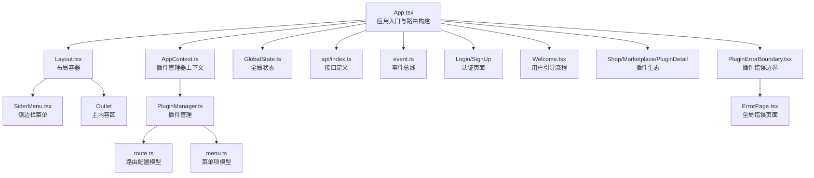
```mermaid
graph TB
App["App.tsx<br/>应用入口与路由构建"] --> Layout["Layout.tsx<br/>布局容器"]
Layout --> Sider["SiderMenu.tsx<br/>侧边栏菜单"]
Layout --> Outlet["Outlet<br/>主内容区"]
App --> Ctx["AppContext.ts<br/>插件管理器上下文"]
Ctx --> PM["PluginManager.ts<br/>插件管理"]
PM --> Routes["route.ts<br/>路由配置模型"]
PM --> Menu["menu.ts<br/>菜单项模型"]
App --> Store["GlobalState.ts<br/>全局状态"]
App --> API["api/index.ts<br/>接口定义"]
App --> Events["event.ts<br/>事件总线"]
App --> Auth["Login/SignUp<br/>认证页面"]
App --> Welcome["Welcome.tsx<br/>用户引导流程"]
App --> Shop["Shop/Marketplace/PluginDetail<br/>插件生态"]
App --> PEB["PluginErrorBoundary.tsx<br/>插件错误边界"]
PEB --> ErrorPage["ErrorPage.tsx<br/>全局错误页面"]
```

**图表来源**
- [packages/core/src/App.tsx:1-196](file://packages/core/src/App.tsx#L1-L196)
- [packages/core/src/Layout.tsx:1-318](file://packages/core/src/Layout.tsx#L1-L318)
- [packages/core/src/components/SiderMenu.tsx:1-275](file://packages/core/src/components/SiderMenu.tsx#L1-L275)
- [packages/core/src/components/Welcome/index.tsx:1-245](file://packages/core/src/components/Welcome/index.tsx#L1-L245)
- [packages/core/src/components/PluginErrorBoundary.tsx:1-142](file://packages/core/src/components/PluginErrorBoundary.tsx#L1-L142)
- [packages/core/src/components/ErrorPage.tsx:1-156](file://packages/core/src/components/ErrorPage.tsx#L1-L156)
- [packages/common/src/core/AppContext.ts:1-13](file://packages/common/src/core/AppContext.ts#L1-L13)
- [packages/common/src/core/PluginManager.ts:1-656](file://packages/common/src/core/PluginManager.ts#L1-L656)
- [packages/common/src/core/route.ts:1-8](file://packages/common/src/core/route.ts#L1-L8)
- [packages/common/src/core/menu.ts:1-24](file://packages/common/src/core/menu.ts#L1-L24)
- [packages/core/src/store/GlobalState.ts:1-32](file://packages/core/src/store/GlobalState.ts#L1-L32)
- [packages/core/src/api/index.ts:1-49](file://packages/core/src/api/index.ts#L1-L49)
- [packages/common/src/event/event.ts:1-44](file://packages/common/src/event/event.ts#L1-L44)
- [packages/core/src/components/Login/index.tsx:1-146](file://packages/core/src/components/Login/index.tsx#L1-L146)
- [packages/core/src/components/SignUp/index.tsx:1-130](file://packages/core/src/components/SignUp/index.tsx#L1-L130)
- [packages/core/src/components/Shop/index.tsx:1-220](file://packages/core/src/components/Shop/index.tsx#L1-L220)
- [packages/core/src/components/Shop/Marketplace/index.tsx:1-192](file://packages/core/src/components/Shop/Marketplace/index.tsx#L1-L192)
- [packages/core/src/components/Shop/PluginDetail/index.tsx:1-85](file://packages/core/src/components/Shop/PluginDetail/index.tsx#L1-L85)

**章节来源**
- [packages/core/src/App.tsx:1-196](file://packages/core/src/App.tsx#L1-L196)
- [packages/core/src/Layout.tsx:1-318](file://packages/core/src/Layout.tsx#L1-L318)

## 核心组件
- App.tsx：应用入口，负责：
  - 插件管理器初始化与动态路由构建；
  - 国际化资源合并与初始化；
  - 登录态判断与路由切换；
  - 提供 AppContext 与主题/全局状态/模态等上下文。
  - **新增** 自动包装插件路由元素，提供错误隔离机制。
- PluginErrorBoundary.tsx：插件错误边界，负责：
  - 捕获插件路由组件的错误；
  - 提供页面级和内联级错误回退；
  - 支持错误重试和导航功能。
- ErrorPage.tsx：全局错误页面，负责：
  - 处理未被PluginErrorBoundary捕获的全局路由错误；
  - 提供详细的错误信息和恢复选项。
- Layout.tsx：布局容器，负责：
  - 侧边栏菜单渲染与主内容 Outlet；
  - 用户信息拉取与跳转；
  - 插件安装请求弹窗与引导流程。
- SiderMenu.tsx：侧边栏菜单，聚合插件菜单与内置功能（商店、消息、设置、用户信息），支持点击导航与下拉操作。
- Welcome.tsx：用户引导流程，提供多步骤介绍、进度跟踪和开始使用功能。
- PluginManager.ts：插件管理器，负责远程插件脚本加载、合并路由/菜单/语言包与服务，提供安装/卸载能力。
- AppContext.ts：应用上下文，向子组件暴露插件管理器实例。
- GlobalState.ts：全局状态模型，包含用户信息、应用信息、标签页与折叠状态等。
- use-navigator.ts：统一导航封装，支持带标签页附加的导航。
- api/index.ts：集中定义后端接口常量，便于调用与维护。
- event.ts：轻量事件总线，用于跨组件通信（如刷新插件列表）。

**章节来源**
- [packages/core/src/App.tsx:1-196](file://packages/core/src/App.tsx#L1-L196)
- [packages/core/src/components/PluginErrorBoundary.tsx:1-142](file://packages/core/src/components/PluginErrorBoundary.tsx#L1-L142)
- [packages/core/src/components/ErrorPage.tsx:1-156](file://packages/core/src/components/ErrorPage.tsx#L1-L156)
- [packages/core/src/Layout.tsx:1-318](file://packages/core/src/Layout.tsx#L1-L318)
- [packages/core/src/components/SiderMenu.tsx:1-275](file://packages/core/src/components/SiderMenu.tsx#L1-L275)
- [packages/core/src/components/Welcome/index.tsx:1-245](file://packages/core/src/components/Welcome/index.tsx#L1-L245)
- [packages/common/src/core/PluginManager.ts:1-656](file://packages/common/src/core/PluginManager.ts#L1-L656)
- [packages/common/src/core/AppContext.ts:1-13](file://packages/common/src/core/AppContext.ts#L1-L13)
- [packages/core/src/store/GlobalState.ts:1-32](file://packages/core/src/store/GlobalState.ts#L1-L32)
- [packages/core/src/hooks/use-navigator.ts:1-33](file://packages/core/src/hooks/use-navigator.ts#L1-L33)
- [packages/core/src/api/index.ts:1-49](file://packages/core/src/api/index.ts#L1-L49)
- [packages/common/src/event/event.ts:1-44](file://packages/common/src/event/event.ts#L1-L44)

## 架构总览
应用采用"入口路由 + 动态插件 + 错误边界 + 布局容器 + 引导流程"的架构模式：
- 入口路由在 App.tsx 中根据登录态与插件列表动态生成；
- 插件通过 PluginManager 加载并合并其路由/菜单/语言包；
- **新增** PluginErrorBoundary 自动包装所有插件路由元素，提供错误隔离；
- Layout 负责侧边栏与主内容区，SiderMenu 聚合插件菜单；
- Welcome 组件提供用户首次使用引导流程；
- 全局状态由 store 提供，上下文通过 AppContext 注入；
- 认证流程由 Login/SignUp 页面完成，随后触发插件初始化与路由重建；
- **新增** ErrorPage 处理未被PluginErrorBoundary捕获的全局错误。

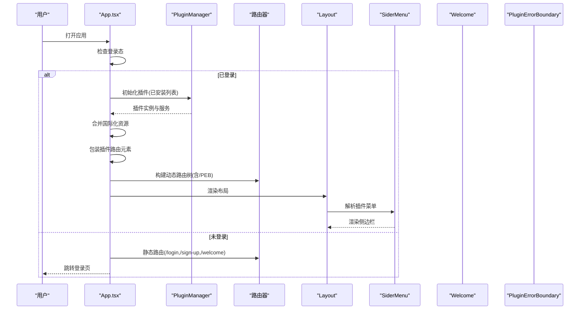
```mermaid
sequenceDiagram
participant U as "用户"
participant App as "App.tsx"
participant PM as "PluginManager"
participant R as "路由器"
participant L as "Layout"
participant SM as "SiderMenu"
participant W as "Welcome"
participant PEB as "PluginErrorBoundary"
U->>App : 打开应用
App->>App : 检查登录态
alt 已登录
App->>PM : 初始化插件(已安装列表)
PM-->>App : 插件实例与服务
App->>App : 合并国际化资源
App->>App : 包装插件路由元素
App->>R : 构建动态路由树(含/PEB)
App->>L : 渲染布局
L->>SM : 解析插件菜单
SM-->>L : 渲染侧边栏
else 未登录
App->>R : 静态路由(/login,/sign-up,/welcome)
App-->>U : 跳转登录页
end
```

**图表来源**
- [packages/core/src/App.tsx:69-171](file://packages/core/src/App.tsx#L69-L171)
- [packages/common/src/core/PluginManager.ts:202-278](file://packages/common/src/core/PluginManager.ts#L202-L278)
- [packages/core/src/Layout.tsx:79-149](file://packages/core/src/Layout.tsx#L79-L149)
- [packages/core/src/components/SiderMenu.tsx:1-275](file://packages/core/src/components/SiderMenu.tsx#L1-L275)
- [packages/core/src/components/Welcome/index.tsx:1-245](file://packages/core/src/components/Welcome/index.tsx#L1-L245)
- [packages/core/src/components/PluginErrorBoundary.tsx:25-62](file://packages/core/src/components/PluginErrorBoundary.tsx#L25-L62)

## 详细组件分析

### App.tsx：应用入口与路由构建
- 插件初始化与动态路由：
  - 使用 PluginManager 初始化插件（本地与远程），合并插件路由配置；
  - 将插件路由与内置路由（如商店）组合为完整的路由树；
  - **新增** 通过 reslove 函数自动包装每个插件路由元素，添加 PluginErrorBoundary；
  - 通过 RouterProvider 渲染路由。
- 国际化：
  - 合并插件语言包到 i18n 资源，支持检测与回退语言；
  - 支持多语言切换与按需加载。
- 登录态与重定向：
  - 若存在令牌则进入已登录流程，否则渲染登录/注册/欢迎路由并跳转相应页面；
  - 登录成功后通过事件触发插件初始化完成，再跳转首页。
- 上下文与主题：
  - 提供 AppContext、ModalProvider、ThemeProvider、全局状态 Provider。

**更新** 新增了PluginErrorBoundary的自动集成，确保所有插件路由元素都得到错误隔离保护。

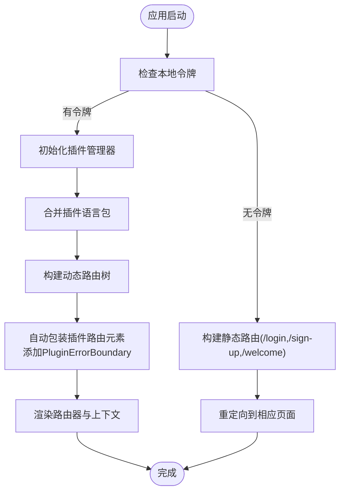
```mermaid
flowchart TD
Start(["应用启动"]) --> CheckToken["检查本地令牌"]
CheckToken --> |有令牌| InitPM["初始化插件管理器"]
CheckToken --> |无令牌| BuildStatic["构建静态路由(/login,/sign-up,/welcome)"]
InitPM --> MergeLocales["合并插件语言包"]
MergeLocales --> BuildDynamic["构建动态路由树"]
BuildDynamic --> WrapRoutes["自动包装插件路由元素<br/>添加PluginErrorBoundary"]
WrapRoutes --> Render["渲染路由器与上下文"]
BuildStatic --> Redirect["重定向到相应页面"]
Render --> End(["完成"])
Redirect --> End
```

**图表来源**
- [packages/core/src/App.tsx:69-171](file://packages/core/src/App.tsx#L69-L171)
- [packages/core/src/App.tsx:32-48](file://packages/core/src/App.tsx#L32-L48)

**章节来源**
- [packages/core/src/App.tsx:1-196](file://packages/core/src/App.tsx#L1-L196)

### PluginErrorBoundary.tsx：插件错误边界
- 错误隔离机制：
  - 捕获插件路由组件的错误，防止单个插件崩溃影响整个应用；
  - 支持两种回退模式：页面级（preserve sidebar/navigation）和内联级（node views）。
- 用户体验：
  - 提供清晰的错误信息和重试按钮；
  - 支持返回上一页和重试功能；
  - 内联模式下提供简洁的错误卡片。
- 日志记录：
  - 捕获错误时记录详细的错误信息和组件信息；
  - 便于调试和问题追踪。

**新增** 作为应用错误处理体系的核心组件，提供了一致的插件错误隔离机制。

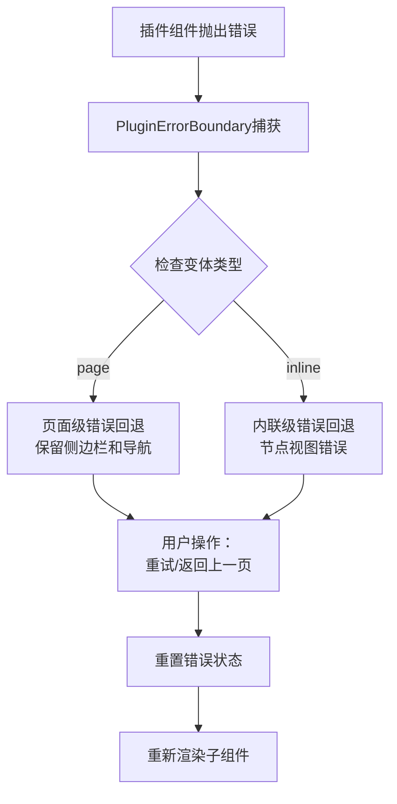
```mermaid
flowchart TD
Error["插件组件抛出错误"] --> PEB["PluginErrorBoundary捕获"]
PEB --> CheckVariant{"检查变体类型"}
CheckVariant --> |page| PageFallback["页面级错误回退<br/>保留侧边栏和导航"]
CheckVariant --> |inline| InlineFallback["内联级错误回退<br/>节点视图错误"]
PageFallback --> UserActions["用户操作：<br/>重试/返回上一页"]
InlineFallback --> UserActions
UserActions --> Reset["重置错误状态"]
Reset --> Children["重新渲染子组件"]
```

**图表来源**
- [packages/core/src/components/PluginErrorBoundary.tsx:25-62](file://packages/core/src/components/PluginErrorBoundary.tsx#L25-L62)
- [packages/core/src/components/PluginErrorBoundary.tsx:105-141](file://packages/core/src/components/PluginErrorBoundary.tsx#L105-L141)

**章节来源**
- [packages/core/src/components/PluginErrorBoundary.tsx:1-142](file://packages/core/src/components/PluginErrorBoundary.tsx#L1-L142)

### ErrorPage.tsx：全局错误页面
- 全局错误处理：
  - 处理未被PluginErrorBoundary捕获的全局路由错误；
  - 提供详细的错误信息和调试选项。
- 用户引导：
  - 提供返回首页和重新加载的选项；
  - 支持显示/隐藏错误详情。
- 帮助信息：
  - 提供缓存清理、网络检查和联系支持的指导；
  - 增强用户自助解决问题的能力。

**新增** 作为应用错误处理的最后一道防线，确保用户在遇到严重错误时仍能得到友好的反馈。

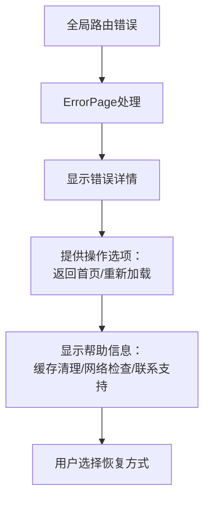
```mermaid
flowchart TD
GlobalError["全局路由错误"] --> ErrorPage["ErrorPage处理"]
ErrorPage --> ShowDetails["显示错误详情"]
ShowDetails --> Actions["提供操作选项：<br/>返回首页/重新加载"]
Actions --> Help["显示帮助信息：<br/>缓存清理/网络检查/联系支持"]
Help --> Recovery["用户选择恢复方式"]
```

**图表来源**
- [packages/core/src/components/ErrorPage.tsx:12-37](file://packages/core/src/components/ErrorPage.tsx#L12-L37)

**章节来源**
- [packages/core/src/components/ErrorPage.tsx:1-156](file://packages/core/src/components/ErrorPage.tsx#L1-L156)

### Layout.tsx：布局容器与导航
- 结构组成：
  - 侧边栏区域：固定宽度列，包含品牌标识与 SiderMenu；
  - 主内容区：Outlet 占位，承载动态路由内容；
  - 对话框：插件安装请求确认；
  - 引导流程：Onboarding 步骤提示。
- 导航与用户信息：
  - 通过 useNavigator 统一跳转；
  - 拉取用户信息并更新全局状态；
  - 未登录时跳转至登录页。
- 事件联动：
  - 监听 REFRESH_PLUSINS 刷新菜单；
  - 监听 GO_TO_MARKETPLACE 跳转商店。

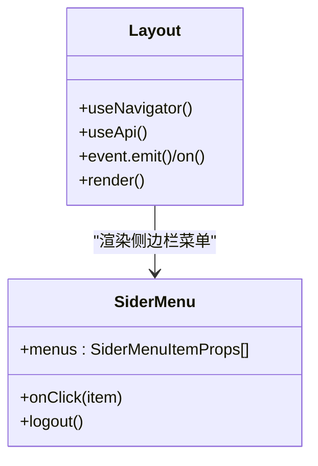
```mermaid
classDiagram
class Layout {
+useNavigator()
+useApi()
+event.emit()/on()
+render()
}
class SiderMenu {
+menus : SiderMenuItemProps[]
+onClick(item)
+logout()
}
Layout --> SiderMenu : "渲染侧边栏菜单"
```

**图表来源**
- [packages/core/src/Layout.tsx:79-318](file://packages/core/src/Layout.tsx#L79-L318)
- [packages/core/src/components/SiderMenu.tsx:1-275](file://packages/core/src/components/SiderMenu.tsx#L1-L275)

**章节来源**
- [packages/core/src/Layout.tsx:1-318](file://packages/core/src/Layout.tsx#L1-L318)

### SiderMenu.tsx：侧边栏菜单
- 动态菜单生成：
  - 从 AppContext 获取 PluginManager，解析插件菜单；
  - 追加内置菜单（商店、消息、设置、用户信息）。
- 导航与交互：
  - 点击菜单项触发 useNavigator 导航；
  - 用户头像下拉菜单支持注销、个人空间入口等。
- 事件刷新：
  - 监听 REFRESH_PLUSINS 以响应插件安装/卸载后的菜单刷新。

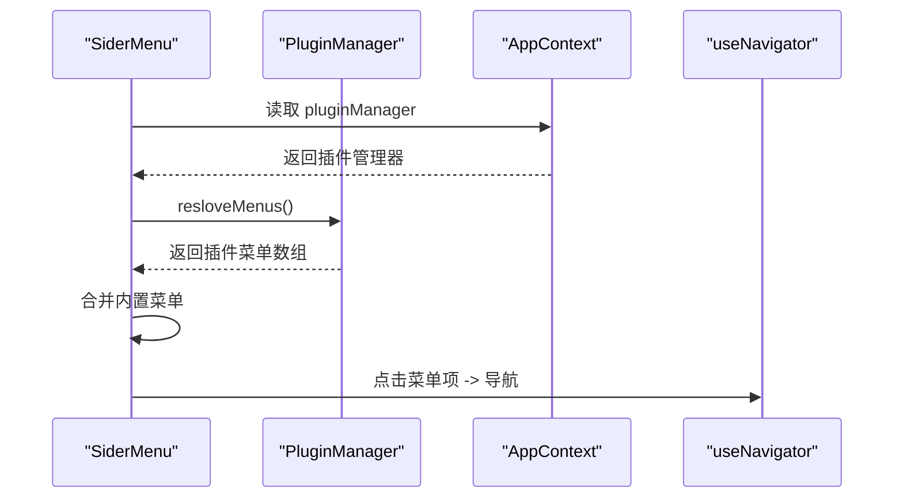
```mermaid
sequenceDiagram
participant SM as "SiderMenu"
participant PM as "PluginManager"
participant Ctx as "AppContext"
participant Nav as "useNavigator"
SM->>Ctx : 读取 pluginManager
Ctx-->>SM : 返回插件管理器
SM->>PM : resloveMenus()
PM-->>SM : 返回插件菜单数组
SM->>SM : 合并内置菜单
SM->>Nav : 点击菜单项 -> 导航
```

**图表来源**
- [packages/core/src/components/SiderMenu.tsx:1-275](file://packages/core/src/components/SiderMenu.tsx#L1-L275)
- [packages/common/src/core/PluginManager.ts:469-483](file://packages/common/src/core/PluginManager.ts#L469-L483)
- [packages/common/src/core/AppContext.ts:1-13](file://packages/common/src/core/AppContext.ts#L1-L13)

**章节来源**
- [packages/core/src/components/SiderMenu.tsx:1-275](file://packages/core/src/components/SiderMenu.tsx#L1-L275)
- [packages/common/src/core/menu.ts:1-24](file://packages/common/src/core/menu.ts#L1-L24)

### Welcome.tsx：用户引导流程
- 多步骤引导：
  - 包含欢迎、核心功能介绍、准备就绪三个步骤；
  - 每个步骤都有对应的标题、副标题和内容区域。
- 交互功能：
  - 支持上一步、下一步、跳过引导和开始使用；
  - 进度条显示当前步骤完成情况。
- 状态管理：
  - 使用 localStorage 记录用户是否已完成引导；
  - 完成后自动跳转到应用首页。
- 视觉设计：
  - 采用渐变色彩和动画效果；
  - 支持明暗主题切换和多语言切换。

**新增** 作为应用的重要组成部分，Welcome组件提供了完整的用户引导体验。

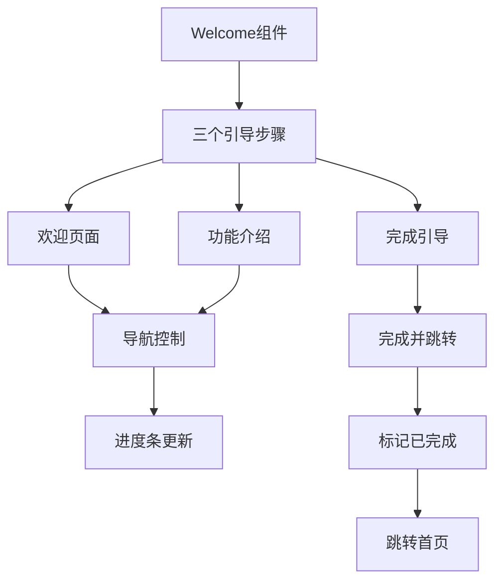
```mermaid
flowchart TD
Welcome["Welcome组件"] --> Steps["三个引导步骤"]
Steps --> Step1["欢迎页面"]
Steps --> Step2["功能介绍"]
Steps --> Step3["完成引导"]
Step1 --> Navigation["导航控制"]
Step2 --> Navigation
Step3 --> Complete["完成并跳转"]
Navigation --> Progress["进度条更新"]
Complete --> Storage["标记已完成"]
Storage --> Redirect["跳转首页"]
```

**图表来源**
- [packages/core/src/components/Welcome/index.tsx:1-245](file://packages/core/src/components/Welcome/index.tsx#L1-L245)

**章节来源**
- [packages/core/src/components/Welcome/index.tsx:1-245](file://packages/core/src/components/Welcome/index.tsx#L1-L245)

### 路由配置系统：静态与动态
- 静态路由：
  - 未登录时提供 /login、/sign-up 和 /welcome；
  - 已登录时提供 / 与 /plugin-hub 及其子路由。
- 动态路由：
  - PluginManager.resloveRoutes() 汇聚各插件路由配置；
  - App.tsx 递归构建 Route 树（支持嵌套 children）。
  - **新增** 自动包装每个插件路由元素，添加 PluginErrorBoundary。
- 路由模型：
  - RouteConfig 定义 path、name、element 与 children。

**更新** 新增了PluginErrorBoundary的自动集成，确保所有插件路由元素都得到错误隔离保护。

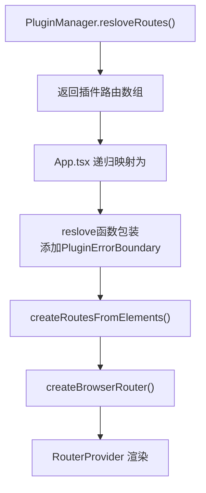
```mermaid
flowchart TD
A["PluginManager.resloveRoutes()"] --> B["返回插件路由数组"]
B --> C["App.tsx 递归映射为 <Route>"]
C --> D["reslove函数包装<br/>添加PluginErrorBoundary"]
D --> E["createRoutesFromElements()"]
E --> F["createBrowserRouter()"]
F --> G["RouterProvider 渲染"]
```

**图表来源**
- [packages/common/src/core/PluginManager.ts:389-403](file://packages/common/src/core/PluginManager.ts#L389-L403)
- [packages/common/src/core/route.ts:1-8](file://packages/common/src/core/route.ts#L1-L8)
- [packages/core/src/App.tsx:32-48](file://packages/core/src/App.tsx#L32-L48)

**章节来源**
- [packages/common/src/core/PluginManager.ts:389-403](file://packages/common/src/core/PluginManager.ts#L389-L403)
- [packages/common/src/core/route.ts:1-8](file://packages/common/src/core/route.ts#L1-L8)
- [packages/core/src/App.tsx:32-48](file://packages/core/src/App.tsx#L32-L48)

### 菜单系统：动态生成、权限与界面适配
- 动态生成：
  - 通过 PluginManager.resloveMenus() 聚合插件菜单；
  - SiderMenu 合并内置菜单项，形成最终侧边栏。
- 权限控制：
  - GlobalState.userInfo.permissions 作为权限字典，可在菜单项或页面中按需校验；
  - 可在插件菜单定义中加入可见性逻辑（当前仓库未直接展示权限字段，建议在插件侧实现）。
- 界面适配：
  - 支持不同尺寸（mini/default/md）与图标、徽标、动作按钮等扩展属性；
  - 与 Dropdown/Popover/Empty 等 UI 组件配合，提升交互体验。

**章节来源**
- [packages/common/src/core/PluginManager.ts:469-483](file://packages/common/src/core/PluginManager.ts#L469-L483)
- [packages/core/src/store/GlobalState.ts:1-32](file://packages/core/src/store/GlobalState.ts#L1-L32)
- [packages/common/src/core/menu.ts:1-24](file://packages/common/src/core/menu.ts#L1-L24)
- [packages/core/src/components/SiderMenu.tsx:1-275](file://packages/core/src/components/SiderMenu.tsx#L1-L275)

### 应用启动流程：插件初始化、认证与数据预加载
- 流程概览：
  - 启动时检查本地令牌；
  - 已登录：拉取已安装插件，初始化 PluginManager，合并语言包，构建动态路由，渲染布局；
  - 未登录：构建静态路由（包含/welcome），跳转相应页面；
  - 登录成功：触发插件初始化事件，完成后跳转首页。
- 关键点：
  - 事件驱动：REFRESH_PLUSINS 用于刷新菜单与插件列表；
  - 登录事件：PLUGIN_INIT_SUCCESS 用于登录成功后导航。
  - **新增** PluginErrorBoundary 自动集成，确保插件路由的稳定性。

**更新** 新增了PluginErrorBoundary的参与，为插件路由提供统一的错误隔离机制。

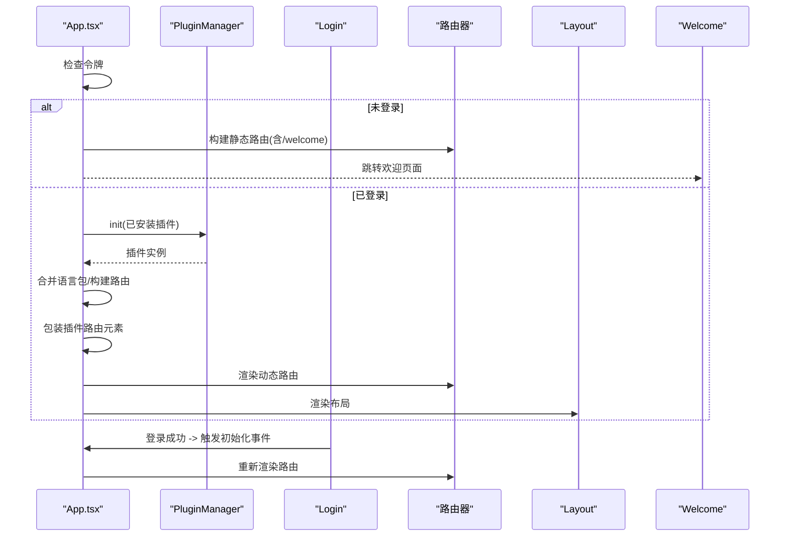
```mermaid
sequenceDiagram
participant App as "App.tsx"
participant PM as "PluginManager"
participant Auth as "Login"
participant R as "路由器"
participant L as "Layout"
participant W as "Welcome"
App->>App : 检查令牌
alt 未登录
App->>R : 构建静态路由(含/welcome)
App-->>W : 跳转欢迎页面
else 已登录
App->>PM : init(已安装插件)
PM-->>App : 插件实例
App->>App : 合并语言包/构建路由
App->>App : 包装插件路由元素
App->>R : 渲染动态路由
App->>L : 渲染布局
end
Auth->>App : 登录成功 -> 触发初始化事件
App->>R : 重新渲染路由
```

**图表来源**
- [packages/core/src/App.tsx:69-171](file://packages/core/src/App.tsx#L69-L171)
- [packages/core/src/components/Login/index.tsx:1-146](file://packages/core/src/components/Login/index.tsx#L1-L146)
- [packages/common/src/event/event.ts:1-44](file://packages/common/src/event/event.ts#L1-L44)
- [packages/core/src/components/Welcome/index.tsx:1-245](file://packages/core/src/components/Welcome/index.tsx#L1-L245)

**章节来源**
- [packages/core/src/App.tsx:69-171](file://packages/core/src/App.tsx#L69-L171)
- [packages/core/src/components/Login/index.tsx:1-146](file://packages/core/src/components/Login/index.tsx#L1-L146)
- [packages/common/src/event/event.ts:1-44](file://packages/common/src/event/event.ts#L1-L44)

### 商店与插件生态
- 商店页 Shop：
  - 左侧分类与搜索，右侧 Outlet 展示子路由；
  - 支持卸载、更新、上传与管理插件。
- 市场页 Marketplace：
  - 拉取插件列表，支持分类筛选与安装；
  - 安装成功后通过 PluginManager.installPlugin 更新插件集合。
- 插件详情 PluginDetail：
  - 展示插件元信息与版本说明，使用编辑器渲染富文本。

**章节来源**
- [packages/core/src/components/Shop/index.tsx:1-220](file://packages/core/src/components/Shop/index.tsx#L1-L220)
- [packages/core/src/components/Shop/Marketplace/index.tsx:1-192](file://packages/core/src/components/Shop/Marketplace/index.tsx#L1-L192)
- [packages/core/src/components/Shop/PluginDetail/index.tsx:1-85](file://packages/core/src/components/Shop/PluginDetail/index.tsx#L1-L85)

## 依赖关系分析
- 组件耦合：
  - App.tsx 依赖 PluginManager、i18n、事件总线与路由构建；
  - **新增** PluginErrorBoundary 依赖 UI 组件和图标；
  - ErrorPage 依赖导航和翻译；
  - Layout 依赖 SiderMenu、useNavigator、useApi；
  - SiderMenu 依赖 AppContext、PluginManager、useNavigator；
  - Welcome 依赖 UI 组件、图标和本地存储。
- 外部依赖：
  - 路由：react-router；
  - UI：@kn/ui；
  - 图标：@kn/icon；
  - 编辑器：@kn/editor；
  - 请求与工具：@kn/common、@kn/core、ahooks、lodash。

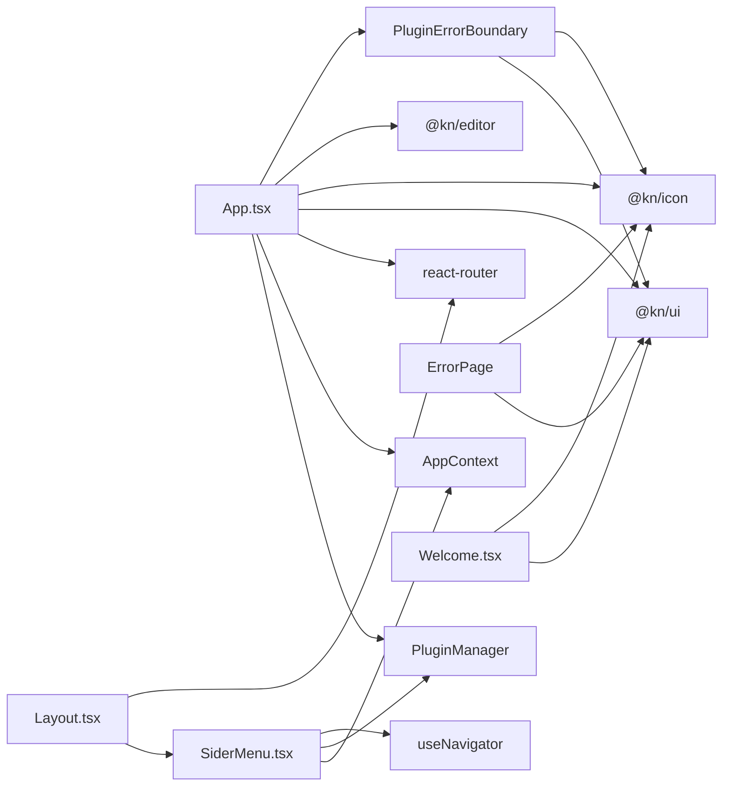
```mermaid
graph LR
App["App.tsx"] --> PM["PluginManager"]
App --> Ctx["AppContext"]
App --> R["react-router"]
App --> UI["@kn/ui"]
App --> ICON["@kn/icon"]
App --> EDIT["@kn/editor"]
App --> PEB["PluginErrorBoundary"]
PEB --> UI
PEB --> ICON
ErrorPage --> UI
ErrorPage --> ICON
Layout["Layout.tsx"] --> Sider["SiderMenu.tsx"]
Layout --> R
Sider --> Ctx
Sider --> PM
Sider --> Nav["useNavigator"]
Welcome["Welcome.tsx"] --> UI
Welcome --> ICON
```

**图表来源**
- [packages/core/src/App.tsx:1-196](file://packages/core/src/App.tsx#L1-L196)
- [packages/core/src/Layout.tsx:1-318](file://packages/core/src/Layout.tsx#L1-L318)
- [packages/core/src/components/SiderMenu.tsx:1-275](file://packages/core/src/components/SiderMenu.tsx#L1-L275)
- [packages/core/src/components/Welcome/index.tsx:1-245](file://packages/core/src/components/Welcome/index.tsx#L1-L245)
- [packages/core/src/components/PluginErrorBoundary.tsx:1-142](file://packages/core/src/components/PluginErrorBoundary.tsx#L1-L142)
- [packages/core/src/components/ErrorPage.tsx:1-156](file://packages/core/src/components/ErrorPage.tsx#L1-L156)
- [packages/common/src/core/PluginManager.ts:1-656](file://packages/common/src/core/PluginManager.ts#L1-L656)
- [packages/common/src/core/AppContext.ts:1-13](file://packages/common/src/core/AppContext.ts#L1-L13)

**章节来源**
- [packages/core/src/App.tsx:1-196](file://packages/core/src/App.tsx#L1-L196)
- [packages/core/src/Layout.tsx:1-318](file://packages/core/src/Layout.tsx#L1-L318)
- [packages/core/src/components/SiderMenu.tsx:1-275](file://packages/core/src/components/SiderMenu.tsx#L1-L275)
- [packages/core/src/components/Welcome/index.tsx:1-245](file://packages/core/src/components/Welcome/index.tsx#L1-L245)
- [packages/core/src/components/PluginErrorBoundary.tsx:1-142](file://packages/core/src/components/PluginErrorBoundary.tsx#L1-L142)
- [packages/core/src/components/ErrorPage.tsx:1-156](file://packages/core/src/components/ErrorPage.tsx#L1-L156)

## 性能考虑
- 插件加载：
  - 使用 importScript 按需加载远程插件脚本，避免首屏体积膨胀；
  - 合并语言包与服务时注意去重与增量更新。
- 路由构建：
  - 动态路由树仅在插件初始化完成后构建，减少无效渲染；
  - 子路由按需懒加载，结合 Outlet 实现。
  - **新增** PluginErrorBoundary 的包装是纯函数式操作，不影响渲染性能。
- UI 与状态：
  - 使用 useSafeState 与 useMemo 降低重渲染；
  - 全局状态按模块拆分，避免大对象全量替换。
- 引导流程：
  - Welcome 组件使用动画和渐变效果，注意在移动设备上的性能表现。
- **新增** 错误边界性能：
  - PluginErrorBoundary 使用 React 的 getDerivedStateFromError，性能开销最小；
  - 错误状态仅在插件组件抛错时激活，正常情况下零开销。

## 故障排查指南
- 登录后无法进入首页：
  - 检查 REFRESH_PLUSINS 是否正确触发与监听；
  - 确认 PLUGIN_INIT_SUCCESS 是否在登录成功后发出。
- 插件菜单不显示：
  - 确认 PluginManager 初始化是否成功；
  - 检查插件是否正确导出 menus 字段。
- 国际化资源缺失：
  - 确认 resloveLocales 合并逻辑与 i18n 初始化参数；
  - 检查插件语言包命名与键值。
- 用户信息拉取失败：
  - 检查 GET_USER_INFO 接口与 token 有效性；
  - 确保未登录时跳转到登录页的逻辑生效。
- Welcome 引导流程异常：
  - 检查 localStorage 中的 hasCompletedWelcome 标记；
  - 确认路由配置中的/welcome路径正确。
- **新增** 插件路由错误：
  - 检查 PluginErrorBoundary 是否正确包装插件路由元素；
  - 确认插件组件是否正确处理错误边界；
  - 查看浏览器控制台中的错误日志。
- **新增** 全局路由错误：
  - 检查 ErrorPage 是否正确处理未捕获的错误；
  - 确认路由配置中的 errorElement 设置。

**章节来源**
- [packages/common/src/event/event.ts:1-44](file://packages/common/src/event/event.ts#L1-L44)
- [packages/core/src/App.tsx:125-171](file://packages/core/src/App.tsx#L125-L171)
- [packages/common/src/core/PluginManager.ts:202-278](file://packages/common/src/core/PluginManager.ts#L202-L278)
- [packages/core/src/Layout.tsx:108-149](file://packages/core/src/Layout.tsx#L108-L149)
- [packages/core/src/components/Welcome/index.tsx:113-121](file://packages/core/src/components/Welcome/index.tsx#L113-L121)
- [packages/core/src/components/PluginErrorBoundary.tsx:35-37](file://packages/core/src/components/PluginErrorBoundary.tsx#L35-L37)
- [packages/core/src/components/ErrorPage.tsx:19-24](file://packages/core/src/components/ErrorPage.tsx#L19-L24)

## 结论
该应用主组件通过"入口路由 + 插件生态 + 错误边界 + 布局容器 + 引导流程"的架构，实现了高扩展性的知识库管理平台。App.tsx 负责启动流程与路由构建，**新增的PluginErrorBoundary为插件路由提供了统一的错误隔离机制**，确保单个插件的崩溃不会影响整个应用的稳定性；Layout 与 SiderMenu 提供一致的导航体验，Welcome 组件为新用户提供完整的引导流程，PluginManager 与 AppContext 保障插件的动态加载与菜单聚合。配合完善的事件总线与全局状态，系统具备良好的可维护性与可扩展性。

**更新** 错误边界集成显著提升了应用的稳定性和用户体验，为插件生态的发展提供了坚实的技术基础。

## 附录
- 配置与扩展建议：
  - 在插件中导出路由、菜单、语言包与服务，确保 PluginManager 能正确合并；
  - 使用 use-navigator 统一导航，必要时附加标签页；
  - 对大型插件采用懒加载策略，优化首屏性能；
  - 在 GlobalState 中补充权限字段并在菜单/页面中进行校验；
  - Welcome 组件可作为新功能上线时的引导模板，提供一致的用户体验；
  - **新增** 插件开发时应考虑错误边界的影响，确保组件能够优雅地处理异常情况。