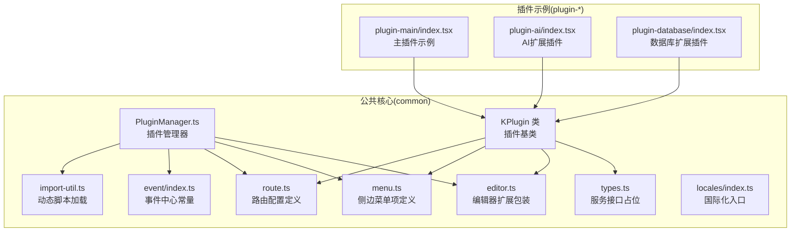
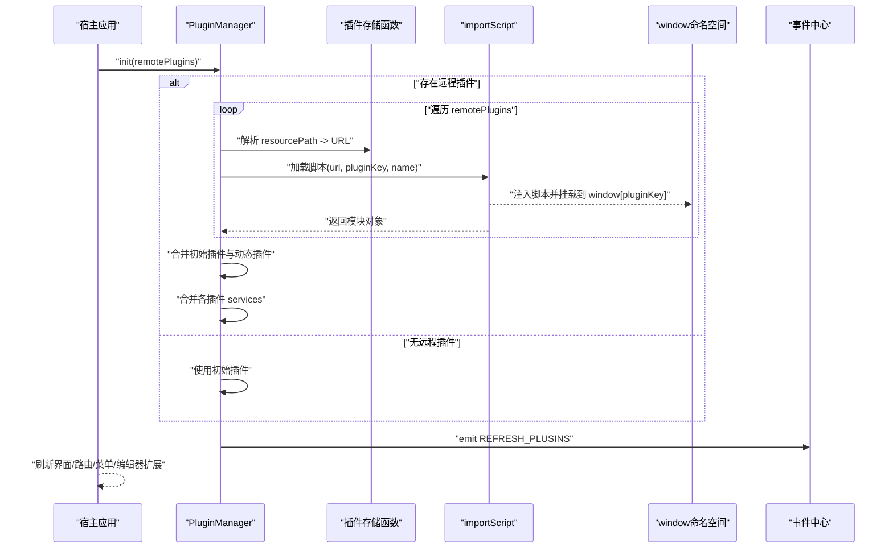
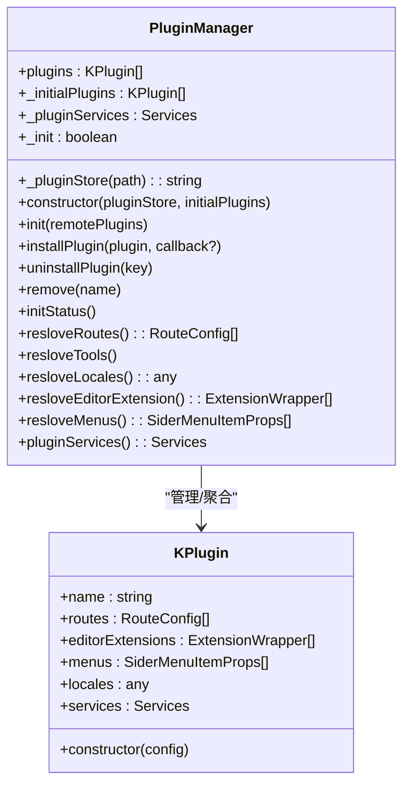
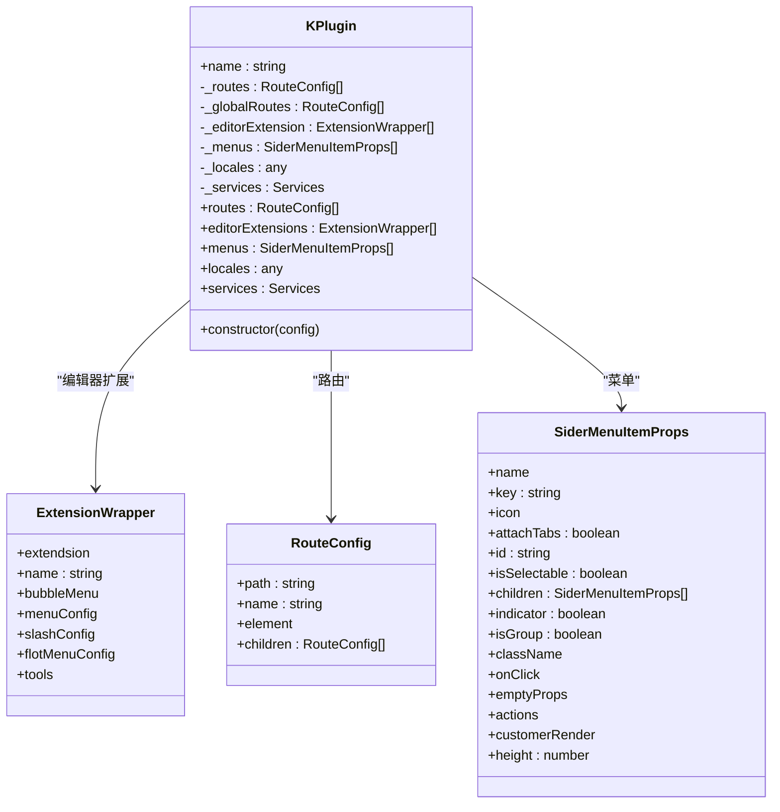
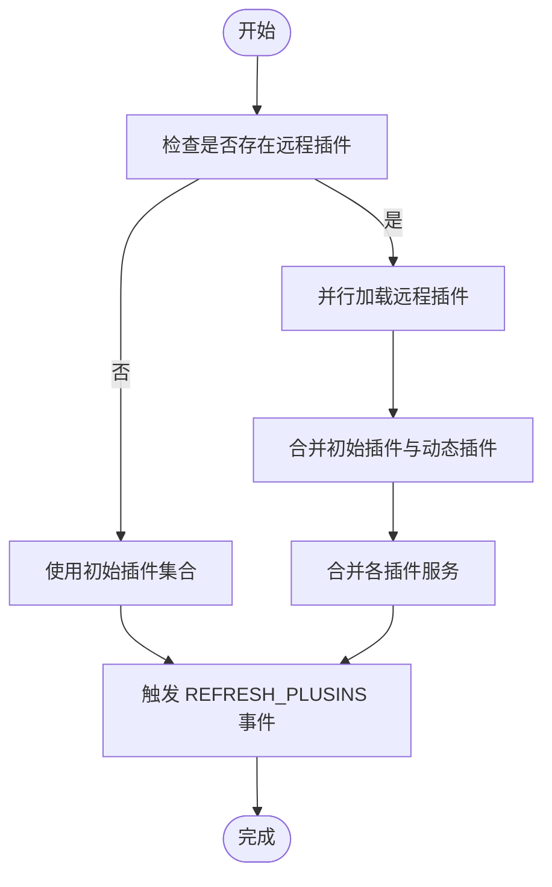
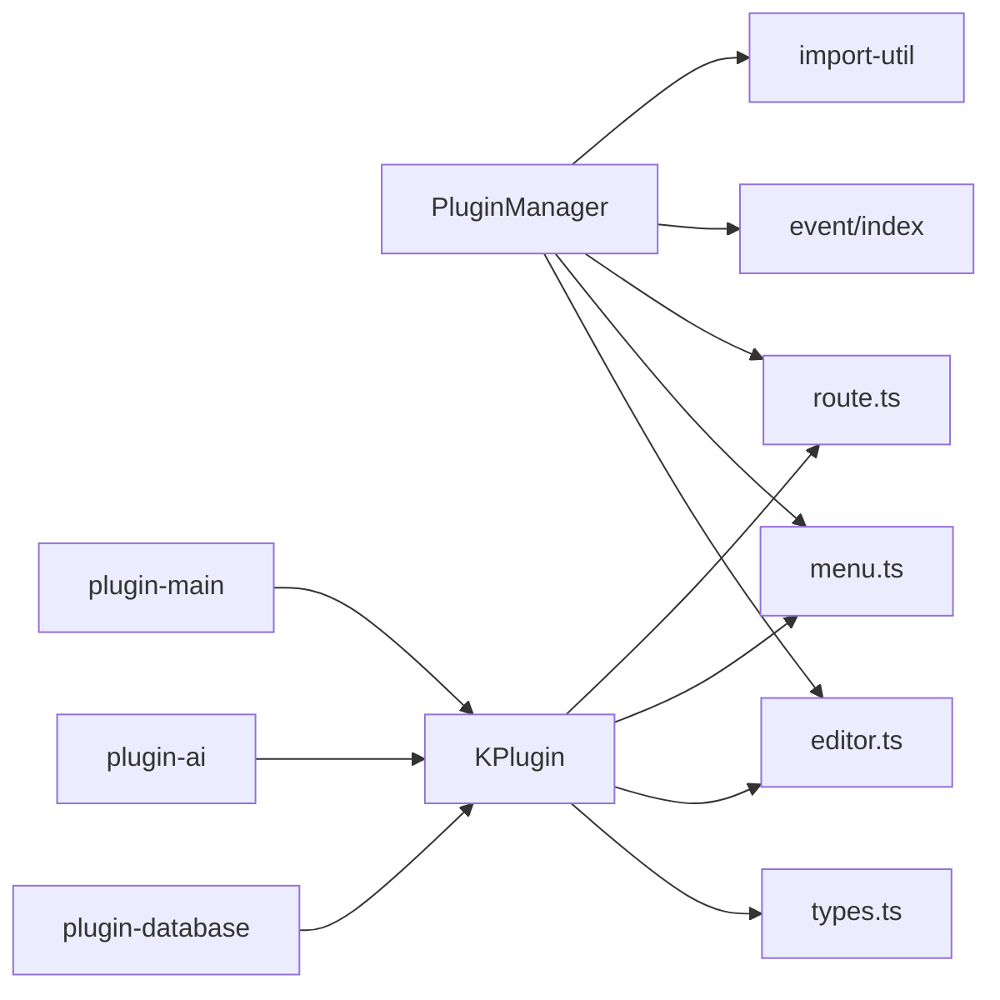

# 插件管理系统

<cite>
**本文引用的文件**
- [packages/common/src/core/PluginManager.ts](file://packages/common/src/core/PluginManager.ts)
- [packages/common/src/core/types.ts](file://packages/common/src/core/types.ts)
- [packages/common/src/core/editor.ts](file://packages/common/src/core/editor.ts)
- [packages/common/src/core/menu.ts](file://packages/common/src/core/menu.ts)
- [packages/common/src/core/route.ts](file://packages/common/src/core/route.ts)
- [packages/common/src/utils/import-util.ts](file://packages/common/src/utils/import-util.ts)
- [packages/common/src/event/index.ts](file://packages/common/src/event/index.ts)
- [packages/common/src/locales/index.ts](file://packages/common/src/locales/index.ts)
- [packages/plugin-main/src/index.tsx](file://packages/plugin-main/src/index.tsx)
- [packages/plugin-ai/src/index.tsx](file://packages/plugin-ai/src/index.tsx)
- [packages/plugin-database/src/index.tsx](file://packages/plugin-database/src/index.tsx)
- [packages/core/src/components/PluginHub/index.tsx](file://packages/core/src/components/PluginHub/index.tsx)
</cite>

## 目录
1. [引言](#引言)
2. [项目结构](#项目结构)
3. [核心组件](#核心组件)
4. [架构总览](#架构总览)
5. [详细组件分析](#详细组件分析)
6. [依赖关系分析](#依赖关系分析)
7. [性能考量](#性能考量)
8. [故障排查指南](#故障排查指南)
9. [结论](#结论)
10. [附录](#附录)

## 引言
本文件面向知识库管理系统的插件体系，围绕插件管理器与插件基类进行系统化说明，重点覆盖以下方面：
- PluginManager 类的设计与职责：插件初始化、远程动态加载、卸载与管理；路由解析、菜单生成、编辑器扩展聚合、国际化资源合并；服务注册与事件驱动刷新。
- KPlugin 类的实现：插件配置结构、生命周期属性与访问器、扩展点暴露（路由、菜单、编辑器扩展、国际化、服务）。
- 插件开发最佳实践：插件配置规范、服务接口定义、扩展点实现、事件与通信机制。
- 典型插件示例：主插件与编辑器扩展插件的结构与用法。

## 项目结构
插件系统的核心位于公共包 common 中，围绕插件配置、编辑器扩展、菜单与路由等类型定义，以及插件管理器与脚本动态加载工具构成。典型插件位于 packages 下的独立包中，通过继承 KPlugin 并导出单例实例的方式接入系统。

图示来源
- [packages/common/src/core/PluginManager.ts](file://packages/common/src/core/PluginManager.ts#L63-L170)
- [packages/common/src/core/types.ts](file://packages/common/src/core/types.ts#L1-L4)
- [packages/common/src/core/editor.ts](file://packages/common/src/core/editor.ts#L1-L31)
- [packages/common/src/core/menu.ts](file://packages/common/src/core/menu.ts#L1-L25)
- [packages/common/src/core/route.ts](file://packages/common/src/core/route.ts#L1-L8)
- [packages/common/src/utils/import-util.ts](file://packages/common/src/utils/import-util.ts#L1-L23)
- [packages/common/src/event/index.ts](file://packages/common/src/event/index.ts#L1-L19)
- [packages/common/src/locales/index.ts](file://packages/common/src/locales/index.ts#L1-L6)
- [packages/plugin-main/src/index.tsx](file://packages/plugin-main/src/index.tsx#L1-L118)
- [packages/plugin-ai/src/index.tsx](file://packages/plugin-ai/src/index.tsx#L1-L35)
- [packages/plugin-database/src/index.tsx](file://packages/plugin-database/src/index.tsx#L1-L17)

章节来源
- [packages/common/src/core/PluginManager.ts](file://packages/common/src/core/PluginManager.ts#L63-L170)
- [packages/common/src/core/types.ts](file://packages/common/src/core/types.ts#L1-L4)
- [packages/common/src/core/editor.ts](file://packages/common/src/core/editor.ts#L1-L31)
- [packages/common/src/core/menu.ts](file://packages/common/src/core/menu.ts#L1-L25)
- [packages/common/src/core/route.ts](file://packages/common/src/core/route.ts#L1-L8)
- [packages/common/src/utils/import-util.ts](file://packages/common/src/utils/import-util.ts#L1-L23)
- [packages/common/src/event/index.ts](file://packages/common/src/event/index.ts#L1-L19)
- [packages/common/src/locales/index.ts](file://packages/common/src/locales/index.ts#L1-L6)
- [packages/plugin-main/src/index.tsx](file://packages/plugin-main/src/index.tsx#L1-L118)
- [packages/plugin-ai/src/index.tsx](file://packages/plugin-ai/src/index.tsx#L1-L35)
- [packages/plugin-database/src/index.tsx](file://packages/plugin-database/src/index.tsx#L1-L17)

## 核心组件
- 插件配置结构
  - 名称与状态：name、status
  - 路由与全局路由：routes、globalRoutes
  - 菜单项：menus
  - 编辑器扩展：editorExtension
  - 国际化资源：locales
  - 服务集合：services
- KPlugin 类
  - 提供只读访问器：routes、editorExtensions、menus、locales、services
  - 作为插件基类，子类可按需扩展
- PluginManager 类
  - 管理插件集合、初始插件、服务合并、初始化状态
  - 动态加载远程插件、安装/卸载插件、触发事件刷新
  - 聚合路由、菜单、编辑器扩展与国际化资源
  - 暴露 pluginServices 以供系统使用

章节来源
- [packages/common/src/core/PluginManager.ts](file://packages/common/src/core/PluginManager.ts#L9-L61)
- [packages/common/src/core/PluginManager.ts](file://packages/common/src/core/PluginManager.ts#L63-L170)
- [packages/common/src/core/types.ts](file://packages/common/src/core/types.ts#L1-L4)
- [packages/common/src/core/editor.ts](file://packages/common/src/core/editor.ts#L1-L31)
- [packages/common/src/core/menu.ts](file://packages/common/src/core/menu.ts#L1-L25)
- [packages/common/src/core/route.ts](file://packages/common/src/core/route.ts#L1-L8)

## 架构总览
插件系统采用“配置即插件”的设计：每个插件通过继承 KPlugin 并在构造时传入配置对象，暴露路由、菜单、编辑器扩展、国际化与服务等扩展点。PluginManager 负责：
- 初始化阶段：合并初始插件与动态加载的插件，构建统一的服务字典
- 运行期：提供路由解析、菜单聚合、编辑器扩展聚合、国际化资源合并
- 生命周期：支持安装新插件与卸载插件，通过事件通知刷新界面

图示来源
- [packages/common/src/core/PluginManager.ts](file://packages/common/src/core/PluginManager.ts#L78-L112)
- [packages/common/src/utils/import-util.ts](file://packages/common/src/utils/import-util.ts#L1-L23)
- [packages/common/src/event/index.ts](file://packages/common/src/event/index.ts#L1-L19)

## 详细组件分析

### PluginManager 类分析
- 职责边界
  - 统一管理插件集合与服务字典
  - 提供插件动态加载、安装、卸载能力
  - 聚合多插件的路由、菜单、编辑器扩展与国际化资源
- 关键方法与流程
  - init(remotePlugins)
    - 若 remotePlugins 存在，逐个调用 importScript 加载脚本，取 window[pluginKey] 作为插件实例
    - 合并初始插件与动态插件，合并 services
  - installPlugin(plugin, callback?)
    - 动态加载并安装单个插件，更新插件集合与服务字典，触发刷新事件
  - uninstallPlugin(key)
    - 移除指定插件并触发刷新事件
  - 解析扩展点
    - resloveRoutes/resloveMenus/resloveEditorExtension/resloveLocales
- 错误处理
  - importScript 在加载失败时抛出错误，上层应捕获并提示用户
- 性能与并发
  - 使用 Promise.all 并行加载远程插件，提升初始化效率
  - 导入脚本具备缓存，避免重复加载

图示来源
- [packages/common/src/core/PluginManager.ts](file://packages/common/src/core/PluginManager.ts#L63-L170)
- [packages/common/src/core/PluginManager.ts](file://packages/common/src/core/PluginManager.ts#L21-L61)

章节来源
- [packages/common/src/core/PluginManager.ts](file://packages/common/src/core/PluginManager.ts#L63-L170)
- [packages/common/src/utils/import-util.ts](file://packages/common/src/utils/import-util.ts#L1-L23)
- [packages/common/src/event/index.ts](file://packages/common/src/event/index.ts#L1-L19)

### KPlugin 类分析
- 设计要点
  - 通过泛型约束 PluginConfig，确保插件配置结构一致
  - 所有扩展点均通过只读访问器暴露，保证数据一致性
- 扩展点
  - 路由：用于页面导航与嵌套路由
  - 菜单：用于侧边栏导航与分组
  - 编辑器扩展：用于 TipTap 扩展、气泡菜单、斜杠菜单、浮动菜单与工具
  - 国际化：多语言翻译资源
  - 服务：业务服务接口集合，供系统统一调用

图示来源
- [packages/common/src/core/PluginManager.ts](file://packages/common/src/core/PluginManager.ts#L21-L61)
- [packages/common/src/core/editor.ts](file://packages/common/src/core/editor.ts#L1-L31)
- [packages/common/src/core/route.ts](file://packages/common/src/core/route.ts#L1-L8)
- [packages/common/src/core/menu.ts](file://packages/common/src/core/menu.ts#L1-L25)

章节来源
- [packages/common/src/core/PluginManager.ts](file://packages/common/src/core/PluginManager.ts#L21-L61)
- [packages/common/src/core/editor.ts](file://packages/common/src/core/editor.ts#L1-L31)
- [packages/common/src/core/menu.ts](file://packages/common/src/core/menu.ts#L1-L25)
- [packages/common/src/core/route.ts](file://packages/common/src/core/route.ts#L1-L8)

### 插件动态加载与卸载流程
- 动态加载
  - PluginManager 通过 _pluginStore 将 resourcePath 解析为可访问的 URL
  - 使用 importScript 动态注入脚本，从 window[pluginKey] 获取插件实例
  - 合并插件 services，保持全局可用
- 卸载
  - 通过 uninstallPlugin 移除指定插件并触发 REFRESH_PLUSINS 事件
- 安装
  - installPlugin 支持运行时安装新插件，完成后同样触发刷新事件

图示来源
- [packages/common/src/core/PluginManager.ts](file://packages/common/src/core/PluginManager.ts#L78-L112)
- [packages/common/src/utils/import-util.ts](file://packages/common/src/utils/import-util.ts#L1-L23)
- [packages/common/src/event/index.ts](file://packages/common/src/event/index.ts#L1-L19)

章节来源
- [packages/common/src/core/PluginManager.ts](file://packages/common/src/core/PluginManager.ts#L78-L112)
- [packages/common/src/utils/import-util.ts](file://packages/common/src/utils/import-util.ts#L1-L23)
- [packages/common/src/event/index.ts](file://packages/common/src/event/index.ts#L1-L19)

### 路由解析、菜单生成与国际化
- 路由解析
  - resloveRoutes 遍历所有插件的 routes 字段，拼接为全局路由表
- 菜单生成
  - resloveMenus 遍历所有插件的 menus 字段，生成侧边菜单树
- 国际化
  - resloveLocales 对各插件 locales 进行深度合并，形成全局翻译资源
- 编辑器扩展
  - resloveEditorExtension 聚合所有插件的编辑器扩展，供编辑器初始化使用

章节来源
- [packages/common/src/core/PluginManager.ts](file://packages/common/src/core/PluginManager.ts#L122-L169)
- [packages/common/src/core/PluginManager.ts](file://packages/common/src/core/PluginManager.ts#L132-L134)
- [packages/common/src/core/PluginManager.ts](file://packages/common/src/core/PluginManager.ts#L136-L144)
- [packages/common/src/core/PluginManager.ts](file://packages/common/src/core/PluginManager.ts#L146-L154)
- [packages/common/src/core/PluginManager.ts](file://packages/common/src/core/PluginManager.ts#L157-L165)

### 插件开发最佳实践
- 插件配置规范
  - 必填字段：name、status
  - 可选扩展点：routes、globalRoutes、menus、editorExtension、locales、services
- 服务接口定义
  - 在插件中定义清晰的业务服务接口，通过 services 暴露给系统统一调用
  - 服务命名建议使用领域内语义化名称，避免冲突
- 扩展点实现
  - 路由：遵循 path 命名规范，支持嵌套路由
  - 菜单：合理组织分组与层级，提供点击回调
  - 编辑器扩展：严格定义 menuConfig、slashConfig、tools 等结构
  - 国际化：提供 zh 与 en 翻译，确保 key 唯一且语义明确
- 事件与通信
  - 使用 REFRESH_PLUSINS 触发界面刷新
  - 通过全局 services 进行跨插件协作

章节来源
- [packages/common/src/core/PluginManager.ts](file://packages/common/src/core/PluginManager.ts#L63-L170)
- [packages/common/src/event/index.ts](file://packages/common/src/event/index.ts#L1-L19)
- [packages/common/src/locales/index.ts](file://packages/common/src/locales/index.ts#L1-L6)

### 典型插件示例
- 主插件（plugin-main）
  - 定义首页、空间列表、空间详情、页面查看与编辑、设置等路由
  - 提供侧边菜单项
  - 暴露 spaceService 服务
  - 提供多语言翻译资源
- AI 扩展插件（plugin-ai）
  - 注册编辑器扩展 AIExtension
  - 提供多语言翻译资源
- 数据库扩展插件（plugin-database）
  - 注册编辑器扩展 DatabaseExtension

章节来源
- [packages/plugin-main/src/index.tsx](file://packages/plugin-main/src/index.tsx#L1-L118)
- [packages/plugin-ai/src/index.tsx](file://packages/plugin-ai/src/index.tsx#L1-L35)
- [packages/plugin-database/src/index.tsx](file://packages/plugin-database/src/index.tsx#L1-L17)

## 依赖关系分析
- 组件耦合
  - PluginManager 依赖 import-script 工具与事件中心
  - KPlugin 依赖路由、菜单、编辑器扩展与服务类型定义
- 外部依赖
  - 动态脚本加载依赖浏览器环境与 window 命名空间
  - 国际化依赖 i18next 生态
- 潜在循环依赖
  - 插件之间不应直接相互导入，应通过 services 或事件进行解耦

图示来源
- [packages/common/src/core/PluginManager.ts](file://packages/common/src/core/PluginManager.ts#L63-L170)
- [packages/common/src/utils/import-util.ts](file://packages/common/src/utils/import-util.ts#L1-L23)
- [packages/common/src/event/index.ts](file://packages/common/src/event/index.ts#L1-L19)
- [packages/common/src/core/route.ts](file://packages/common/src/core/route.ts#L1-L8)
- [packages/common/src/core/menu.ts](file://packages/common/src/core/menu.ts#L1-L25)
- [packages/common/src/core/editor.ts](file://packages/common/src/core/editor.ts#L1-L31)
- [packages/common/src/core/types.ts](file://packages/common/src/core/types.ts#L1-L4)
- [packages/plugin-main/src/index.tsx](file://packages/plugin-main/src/index.tsx#L1-L118)
- [packages/plugin-ai/src/index.tsx](file://packages/plugin-ai/src/index.tsx#L1-L35)
- [packages/plugin-database/src/index.tsx](file://packages/plugin-database/src/index.tsx#L1-L17)

章节来源
- [packages/common/src/core/PluginManager.ts](file://packages/common/src/core/PluginManager.ts#L63-L170)
- [packages/common/src/utils/import-util.ts](file://packages/common/src/utils/import-util.ts#L1-L23)
- [packages/common/src/event/index.ts](file://packages/common/src/event/index.ts#L1-L19)
- [packages/common/src/core/route.ts](file://packages/common/src/core/route.ts#L1-L8)
- [packages/common/src/core/menu.ts](file://packages/common/src/core/menu.ts#L1-L25)
- [packages/common/src/core/editor.ts](file://packages/common/src/core/editor.ts#L1-L31)
- [packages/common/src/core/types.ts](file://packages/common/src/core/types.ts#L1-L4)
- [packages/plugin-main/src/index.tsx](file://packages/plugin-main/src/index.tsx#L1-L118)
- [packages/plugin-ai/src/index.tsx](file://packages/plugin-ai/src/index.tsx#L1-L35)
- [packages/plugin-database/src/index.tsx](file://packages/plugin-database/src/index.tsx#L1-L17)

## 性能考量
- 并行加载：init 与 installPlugin 使用 Promise.all 并行加载远程插件，显著缩短初始化时间
- 脚本缓存：importUtil 内置缓存，避免重复下载同一插件脚本
- 资源聚合：路由、菜单、国际化与编辑器扩展在内存中一次性聚合，减少运行时计算成本
- 事件驱动刷新：通过事件集中刷新界面，避免细粒度重复渲染

## 故障排查指南
- 插件未生效
  - 检查 resourcePath 是否正确，确认 _pluginStore 返回有效 URL
  - 确认 window[pluginKey] 是否存在，脚本是否成功注入
- 服务不可用
  - 检查插件 services 是否正确暴露，PluginManager 是否合并成功
- 路由/菜单不显示
  - 确认 routes/menus 字段结构正确，路径与元素引用有效
- 国际化缺失
  - 检查 locales 结构与语言键是否匹配，确保合并逻辑未被覆盖
- 刷新无效
  - 确认 REFRESH_PLUSINS 事件是否触发，订阅方是否正确响应

章节来源
- [packages/common/src/utils/import-util.ts](file://packages/common/src/utils/import-util.ts#L1-L23)
- [packages/common/src/event/index.ts](file://packages/common/src/event/index.ts#L1-L19)
- [packages/common/src/core/PluginManager.ts](file://packages/common/src/core/PluginManager.ts#L78-L112)

## 结论
插件管理系统通过 KPlugin 与 PluginManager 的协同，实现了插件的声明式配置、动态加载与统一管理。借助编辑器扩展包装、路由与菜单聚合、国际化资源合并以及事件驱动刷新，系统在可扩展性与运行时性能之间取得了良好平衡。建议在实际开发中遵循配置规范与最佳实践，确保插件间低耦合与高内聚。

## 附录
- 插件开发清单
  - 明确插件名称与状态
  - 定义路由与菜单
  - 实现编辑器扩展（如需要）
  - 提供国际化资源
  - 暴露服务接口
  - 触发 REFRESH_PLUSINS 刷新界面
- 插件 Hub 组件
  - 当前为空白占位，后续可扩展为插件市场或插件管理入口

章节来源
- [packages/core/src/components/PluginHub/index.tsx](file://packages/core/src/components/PluginHub/index.tsx#L1-L6)