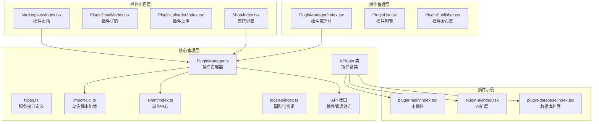
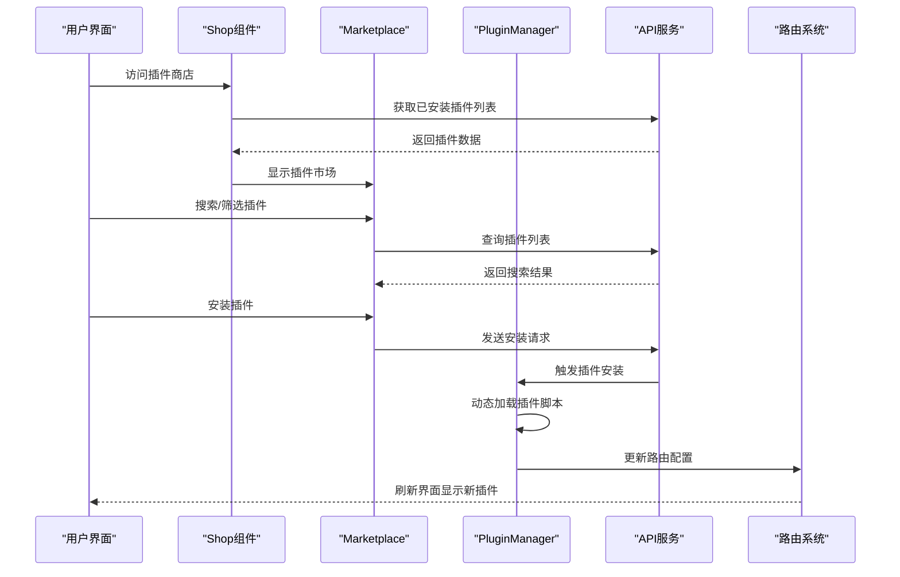
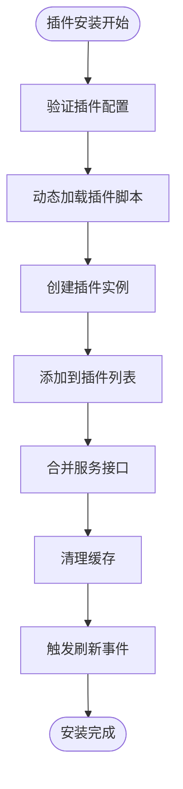
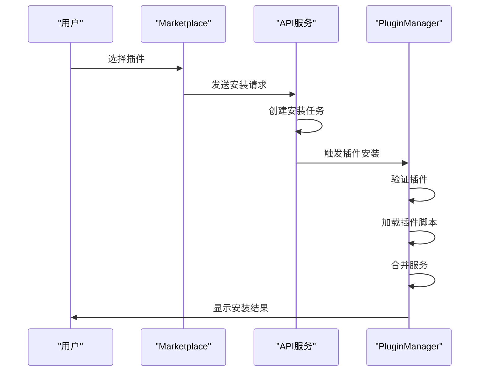
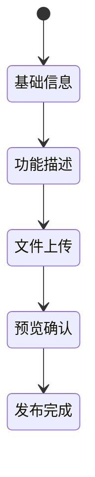

# 插件管理系统

<cite>
**本文档引用的文件**
- [packages/common/src/core/PluginManager.ts](file://packages/common/src/core/PluginManager.ts)
- [packages/common/src/core/types.ts](file://packages/common/src/core/types.ts)
- [packages/common/src/core/editor.ts](file://packages/common/src/core/editor.ts)
- [packages/common/src/core/menu.ts](file://packages/common/src/core/menu.ts)
- [packages/common/src/core/route.ts](file://packages/common/src/core/route.ts)
- [packages/common/src/utils/import-util.ts](file://packages/common/src/utils/import-util.ts)
- [packages/common/src/event/index.ts](file://packages/common/src/event/index.ts)
- [packages/common/src/locales/index.ts](file://packages/common/src/locales/index.ts)
- [packages/plugin-main/src/index.tsx](file://packages/plugin-main/src/index.tsx)
- [packages/plugin-ai/src/index.tsx](file://packages/plugin-ai/src/index.tsx)
- [packages/plugin-database/src/index.tsx](file://packages/plugin-database/src/index.tsx)
- [packages/core/src/components/Shop/Marketplace/index.tsx](file://packages/core/src/components/Shop/Marketplace/index.tsx)
- [packages/core/src/components/Shop/PluginManager/PluginList.tsx](file://packages/core/src/components/Shop/PluginManager/PluginList.tsx)
- [packages/core/src/components/Shop/PluginManager/index.tsx](file://packages/core/src/components/Shop/PluginManager/index.tsx)
- [packages/core/src/components/Shop/PluginDetail/index.tsx](file://packages/core/src/components/Shop/PluginDetail/index.tsx)
- [packages/core/src/components/Shop/PluginUploader/index.tsx](file://packages/core/src/components/Shop/PluginUploader/index.tsx)
- [packages/core/src/components/Shop/index.tsx](file://packages/core/src/components/Shop/index.tsx)
- [packages/core/src/App.tsx](file://packages/core/src/App.tsx)
</cite>

## 更新摘要
**变更内容**
- 新增插件生态系统的完整生命周期管理
- 添加插件市场的搜索、过滤、排序功能实现
- 完善插件发布、安装、管理的完整工作流
- 增强插件状态管理和批量操作功能
- 扩展插件分类和类型筛选机制

## 目录
1. [引言](#引言)
2. [项目结构](#项目结构)
3. [核心组件](#核心组件)
4. [架构总览](#架构总览)
5. [详细组件分析](#详细组件分析)
6. [插件生态系统](#插件生态系统)
7. [插件市场功能](#插件市场功能)
8. [插件管理功能](#插件管理功能)
9. [依赖关系分析](#依赖关系分析)
10. [性能考量](#性能考量)
11. [故障排查指南](#故障排查指南)
12. [结论](#结论)
13. [附录](#附录)

## 引言
本文档全面介绍知识库管理系统的插件生态系统，重点涵盖插件发现、安装、管理的完整生命周期，以及插件市场的搜索、过滤、排序功能。系统通过 PluginManager 类实现插件的动态加载与管理，结合 Shop 组件提供完整的插件生态管理界面。

## 项目结构
插件生态系统由多个层次组成，从核心的插件管理器到用户界面的插件市场和管理面板：

```mermaid
graph TB
subgraph "核心管理层"
PM["PluginManager.ts<br/>插件管理器"]
KC["KPlugin 类<br/>插件基类"]
TYPES["types.ts<br/>服务接口定义"]
IMPORT["import-util.ts<br/>动态脚本加载"]
EVENT["event/index.ts<br/>事件中心"]
LOCALE["locales/index.ts<br/>国际化资源"]
ENDPOINT["API 接口<br/>插件管理端点"]
end
subgraph "插件市场层"
MARKET["Marketplace/index.tsx<br/>插件市场"]
DETAIL["PluginDetail/index.tsx<br/>插件详情"]
UPLOAD["PluginUploader/index.tsx<br/>插件上传"]
SHOP["Shop/index.tsx<br/>商店界面"]
end
subgraph "插件管理层"
PMANAGER["PluginManager/index.tsx<br/>插件管理器"]
PLIST["PluginList.tsx<br/>插件列表"]
PUBLISHER["PluginPublisher.tsx<br/>插件发布器"]
end
subgraph "插件示例"
MAIN["plugin-main/index.tsx<br/>主插件"]
AI["plugin-ai/index.tsx<br/>AI扩展"]
DB["plugin-database/index.tsx<br/>数据库扩展"]
end
PM --> IMPORT
PM --> EVENT
PM --> ENDPOINT
MARKET --> PM
SHOP --> PM
PMANAGER --> PM
KC --> MAIN
KC --> AI
KC --> DB
```

**图表来源**
- [packages/common/src/core/PluginManager.ts](file://packages/common/src/core/PluginManager.ts#L63-L170)
- [packages/core/src/components/Shop/Marketplace/index.tsx](file://packages/core/src/components/Shop/Marketplace/index.tsx#L14-L74)
- [packages/core/src/components/Shop/PluginManager/index.tsx](file://packages/core/src/components/Shop/PluginManager/index.tsx#L40-L214)

## 核心组件
插件生态系统包含以下核心组件：

### 插件管理器组件
- **PluginManager**: 核心插件管理器，负责插件的动态加载、安装、卸载和状态管理
- **KPlugin**: 插件基类，定义插件的标准结构和扩展点
- **PluginList**: 插件列表组件，提供搜索、过滤、排序和批量操作功能

### 插件市场组件
- **Marketplace**: 插件市场界面，展示可安装的插件
- **PluginDetail**: 插件详情展示，提供版本历史和描述信息
- **PluginUploader**: 插件上传向导，支持多步骤插件发布流程

### 插件管理组件
- **Shop**: 主商店界面，管理已安装的插件
- **PluginManager**: 完整的插件管理对话框，支持状态分类和类型筛选

**章节来源**
- [packages/common/src/core/PluginManager.ts](file://packages/common/src/core/PluginManager.ts#L63-L170)
- [packages/core/src/components/Shop/Marketplace/index.tsx](file://packages/core/src/components/Shop/Marketplace/index.tsx#L14-L74)
- [packages/core/src/components/Shop/PluginManager/PluginList.tsx](file://packages/core/src/components/Shop/PluginManager/PluginList.tsx#L54-L80)

## 架构总览
插件生态系统采用分层架构设计，实现插件的全生命周期管理：

```mermaid
sequenceDiagram
participant User as "用户界面"
participant Shop as "Shop组件"
participant Market as "Marketplace"
participant PM as "PluginManager"
participant API as "API服务"
participant Router as "路由系统"
User->>Shop : 访问插件商店
Shop->>API : 获取已安装插件列表
API-->>Shop : 返回插件数据
Shop->>Market : 显示插件市场
User->>Market : 搜索/筛选插件
Market->>API : 查询插件列表
API-->>Market : 返回搜索结果
User->>Market : 安装插件
Market->>API : 发送安装请求
API->>PM : 触发插件安装
PM->>PM : 动态加载插件脚本
PM->>Router : 更新路由配置
Router-->>User : 刷新界面显示新插件
```

**图表来源**
- [packages/core/src/components/Shop/index.tsx](file://packages/core/src/components/Shop/index.tsx#L136-L172)
- [packages/core/src/components/Shop/Marketplace/index.tsx](file://packages/core/src/components/Shop/Marketplace/index.tsx#L62-L74)
- [packages/core/src/App.tsx](file://packages/core/src/App.tsx#L102-L148)

## 详细组件分析

### PluginManager 类分析
插件管理器是整个插件系统的核心，负责插件的完整生命周期管理：

#### 核心功能
- **动态加载**: 通过 `_pluginStore` 方法解析插件资源路径，使用 `importScript` 动态加载插件脚本
- **安装管理**: `installPlugin` 方法处理插件安装，包括验证、加载和状态更新
- **卸载管理**: `uninstallPlugin` 方法移除插件并清理相关资源
- **服务合并**: 自动合并插件的服务接口，实现跨插件通信

#### 关键方法流程

```mermaid
flowchart TD
Start(["插件安装开始"]) --> Validate["验证插件配置"]
Validate --> LoadScript["动态加载插件脚本"]
LoadScript --> CreateInstance["创建插件实例"]
CreateInstance --> AddToList["添加到插件列表"]
AddToList --> MergeServices["合并服务接口"]
MergeServices --> ClearCache["清理缓存"]
ClearCache --> EmitEvent["触发刷新事件"]
EmitEvent --> End(["安装完成"])
```

**图表来源**
- [packages/common/src/core/PluginManager.ts](file://packages/common/src/core/PluginManager.ts#L251-L281)

**章节来源**
- [packages/common/src/core/PluginManager.ts](file://packages/common/src/core/PluginManager.ts#L231-L281)

### 插件市场组件分析
Marketplace 组件提供完整的插件发现和安装功能：

#### 搜索和过滤功能
- **实时搜索**: 支持按插件名称、开发者、维护者和描述进行搜索
- **分类筛选**: 按插件类型（App、Feature、Connector）进行筛选
- **排序功能**: 支持按相关性、流行度、最近添加、评分排序

#### 安装流程

```mermaid
sequenceDiagram
participant User as "用户"
participant Market as "Marketplace"
participant API as "API服务"
participant PM as "PluginManager"
User->>Market : 选择插件
Market->>API : 发送安装请求
API->>API : 创建安装任务
API->>PM : 触发插件安装
PM->>PM : 验证插件
PM->>PM : 加载插件脚本
PM->>PM : 合并服务
PM->>User : 显示安装结果
```

**图表来源**
- [packages/core/src/components/Shop/Marketplace/index.tsx](file://packages/core/src/components/Shop/Marketplace/index.tsx#L62-L74)

**章节来源**
- [packages/core/src/components/Shop/Marketplace/index.tsx](file://packages/core/src/components/Shop/Marketplace/index.tsx#L14-L74)

### 插件管理器组件分析
PluginManager 组件提供完整的插件管理功能：

#### 状态分类
- **全部插件**: 显示所有已安装的插件
- **激活插件**: 显示当前启用的插件
- **停用插件**: 显示当前禁用的插件
- **待审核插件**: 显示等待审核的插件

#### 批量操作
- **批量启用/禁用**: 支持多选插件的批量状态切换
- **批量删除**: 支持多选插件的批量卸载
- **快速操作**: 提供一键操作按钮

**章节来源**
- [packages/core/src/components/Shop/PluginManager/index.tsx](file://packages/core/src/components/Shop/PluginManager/index.tsx#L40-L214)

## 插件生态系统
完整的插件生态系统包含以下关键特性：

### 插件生命周期管理
1. **发现阶段**: 用户通过插件市场浏览和搜索可用插件
2. **安装阶段**: 用户选择插件并发起安装请求
3. **加载阶段**: 系统动态加载插件脚本并创建实例
4. **激活阶段**: 插件被添加到系统中并开始工作
5. **管理阶段**: 用户可以管理插件的状态和配置
6. **卸载阶段**: 用户可以选择卸载不再使用的插件

### 插件分类系统
系统支持多种插件分类方式：

#### 状态分类
- ACTIVE: 已激活的插件
- INACTIVE: 已停用的插件  
- PENDING: 待审核的插件

#### 类型分类
- feature: 功能增强插件
- ui: 界面增强插件
- integration: 集成插件
- utility: 实用工具插件

### 插件发布流程
PluginUploader 组件提供完整的插件发布向导：

```mermaid
stateDiagram-v2
[*] --> 基础信息
基础信息 --> 功能描述
功能描述 --> 文件上传
文件上传 --> 预览确认
预览确认 --> 发布完成
```

**图表来源**
- [packages/core/src/components/Shop/PluginUploader/index.tsx](file://packages/core/src/components/Shop/PluginUploader/index.tsx#L26-L30)

**章节来源**
- [packages/core/src/components/Shop/PluginUploader/index.tsx](file://packages/core/src/components/Shop/PluginUploader/index.tsx#L23-L745)

## 插件市场功能
插件市场提供丰富的搜索和发现功能：

### 搜索功能
- **关键词搜索**: 支持插件名称、开发者、维护者、描述的全文搜索
- **智能匹配**: 支持模糊匹配和部分匹配
- **实时反馈**: 搜索结果实时更新

### 过滤功能
- **分类过滤**: 按插件类型（App、Feature、Connector）过滤
- **评分过滤**: 按插件评分和下载量过滤
- **状态过滤**: 按插件状态过滤

### 排序功能
- **相关性排序**: 基于搜索关键词的相关性排序
- **流行度排序**: 基于下载量和评分排序
- **时间排序**: 基于发布时间排序
- **评分排序**: 基于用户评分排序

**章节来源**
- [packages/core/src/components/Shop/Marketplace/index.tsx](file://packages/core/src/components/Shop/Marketplace/index.tsx#L129-L147)

## 插件管理功能
插件管理器提供完整的插件管理功能：

### 插件列表管理
- **状态统计**: 实时显示各种状态插件的数量
- **分类导航**: 通过侧边栏快速切换不同状态的插件
- **类型筛选**: 支持按插件类型进行筛选

### 批量操作功能
- **全选功能**: 支持一键选择所有可见插件
- **批量状态切换**: 支持批量启用或禁用插件
- **批量卸载**: 支持批量卸载插件

### 详细信息展示
- **插件头信息**: 显示插件图标、名称、版本、状态
- **元数据信息**: 显示开发者、维护者、描述等信息
- **快速操作**: 提供启用/禁用、卸载、设置等快捷操作
- **版本历史**: 显示插件的版本更新历史

**章节来源**
- [packages/core/src/components/Shop/PluginManager/PluginList.tsx](file://packages/core/src/components/Shop/PluginManager/PluginList.tsx#L54-L80)

## 依赖关系分析
插件生态系统具有清晰的依赖关系：

### 组件依赖
- **Shop 组件**: 依赖 PluginManager 和 API 服务
- **Marketplace 组件**: 依赖 API 服务和 PluginManager
- **PluginManager 组件**: 依赖 PluginManager 核心类和 API 服务
- **PluginList 组件**: 依赖 PluginManager 和 UI 组件库

### 外部依赖
- **React Router**: 用于路由管理和页面导航
- **Redux**: 用于状态管理和组件间通信
- **UI 组件库**: 提供丰富的 UI 组件
- **国际化框架**: 支持多语言功能

### 事件驱动架构
系统采用事件驱动架构，通过 REFRESH_PLUSINS 事件实现组件间的解耦通信。

**章节来源**
- [packages/core/src/components/Shop/index.tsx](file://packages/core/src/components/Shop/index.tsx#L136-L172)
- [packages/core/src/App.tsx](file://packages/core/src/App.tsx#L102-L148)

## 性能考量
插件生态系统在性能方面进行了多项优化：

### 加载优化
- **懒加载**: 插件采用动态加载，避免一次性加载所有插件
- **缓存策略**: 插件脚本使用缓存机制，避免重复下载
- **并行加载**: 支持多个插件的并行加载

### 渲染优化
- **虚拟滚动**: 插件列表使用虚拟滚动技术，提高大数据量下的渲染性能
- **状态分离**: 将插件状态与 UI 状态分离，减少不必要的重渲染
- **记忆化**: 使用 useMemo 和 useCallback 优化组件性能

### 内存管理
- **垃圾回收**: 及时清理不再使用的插件实例和事件监听器
- **资源释放**: 在插件卸载时释放相关资源

## 故障排查指南
针对插件生态系统可能出现的问题提供排查指导：

### 插件加载问题
- **脚本加载失败**: 检查插件资源路径是否正确，网络连接是否正常
- **插件实例创建失败**: 验证插件结构是否符合 KPlugin 接口要求
- **服务合并失败**: 检查插件服务接口定义是否正确

### 安装问题
- **安装请求失败**: 检查 API 服务是否正常运行
- **插件状态异常**: 验证插件状态转换逻辑
- **路由更新失败**: 检查路由配置是否正确

### 性能问题
- **页面加载缓慢**: 检查插件数量和大小，考虑启用懒加载
- **内存泄漏**: 确保插件卸载时正确清理资源
- **UI 卡顿**: 优化插件列表渲染，使用虚拟滚动

**章节来源**
- [packages/common/src/core/PluginManager.ts](file://packages/common/src/core/PluginManager.ts#L209-L219)

## 结论
插件生态系统通过完善的生命周期管理、丰富的搜索过滤功能和友好的用户界面，为知识库管理系统提供了强大的扩展能力。系统采用模块化的架构设计，支持插件的动态加载、安装、管理和卸载，同时提供了完整的插件发布和市场功能。

## 附录

### 插件开发最佳实践
- **插件结构**: 遵循 KPlugin 接口规范，确保插件的兼容性和稳定性
- **服务接口**: 定义清晰的服务接口，避免命名冲突
- **错误处理**: 实现完善的错误处理机制，提供友好的错误提示
- **性能优化**: 注意插件的性能影响，避免阻塞主线程

### 插件发布指南
- **准备工作**: 准备插件的基本信息、图标、描述和版本信息
- **功能测试**: 在本地环境中充分测试插件的功能和性能
- **文档编写**: 编写详细的插件使用文档和版本更新日志
- **提交审核**: 通过 PluginUploader 组件提交插件进行审核

### 技术规范
- **代码规范**: 遵循项目的代码规范和风格指南
- **安全要求**: 确保插件代码的安全性，避免注入攻击
- **兼容性**: 确保插件与系统的兼容性，支持不同版本的系统

**章节来源**
- [packages/core/src/components/Shop/PluginUploader/index.tsx](file://packages/core/src/components/Shop/PluginUploader/index.tsx#L24-L30)