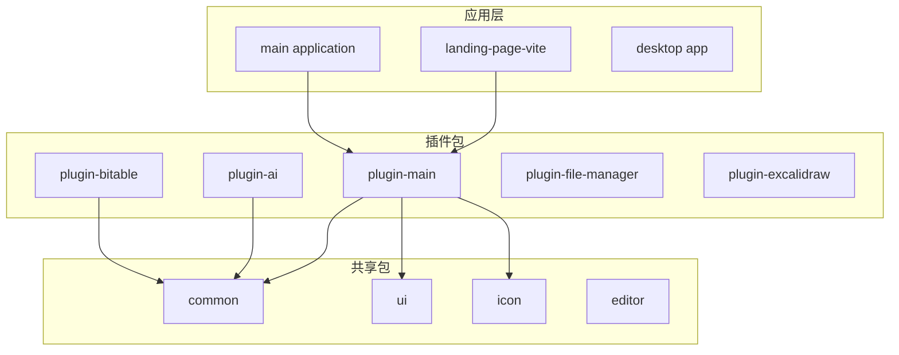
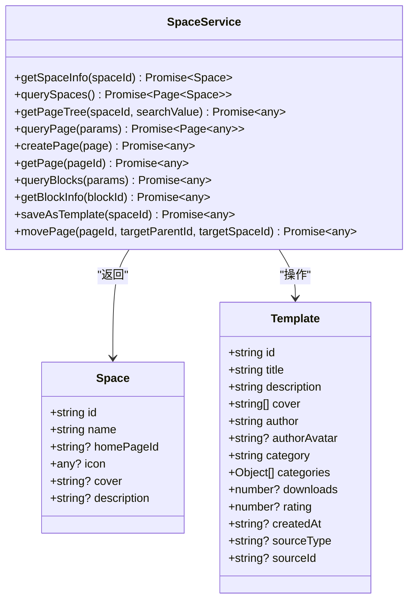
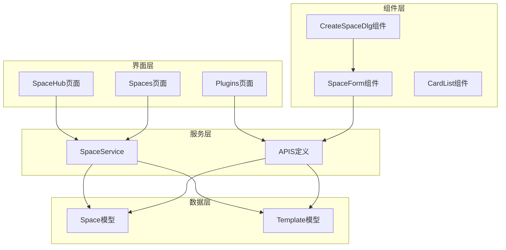
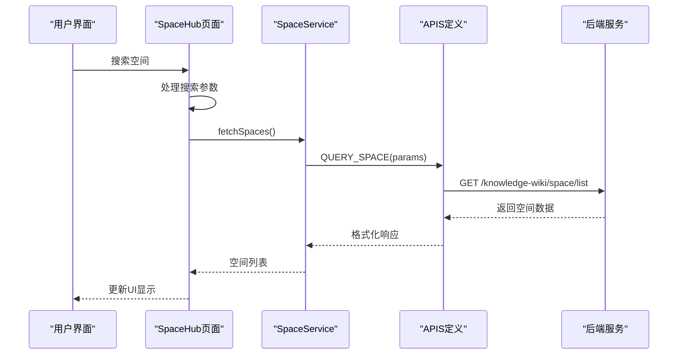
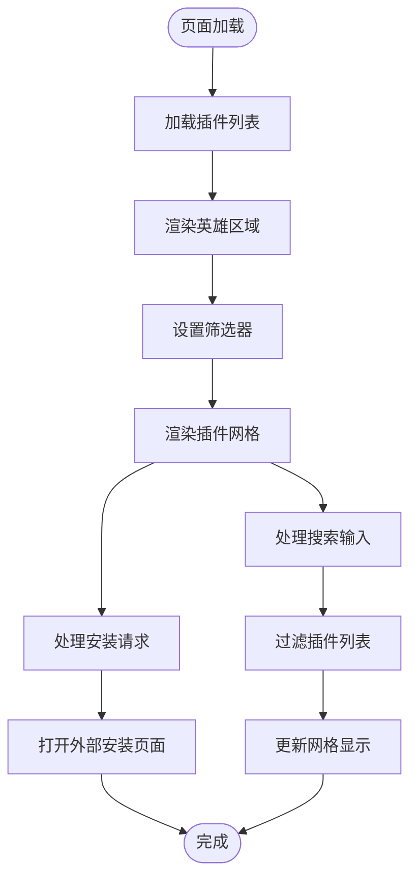
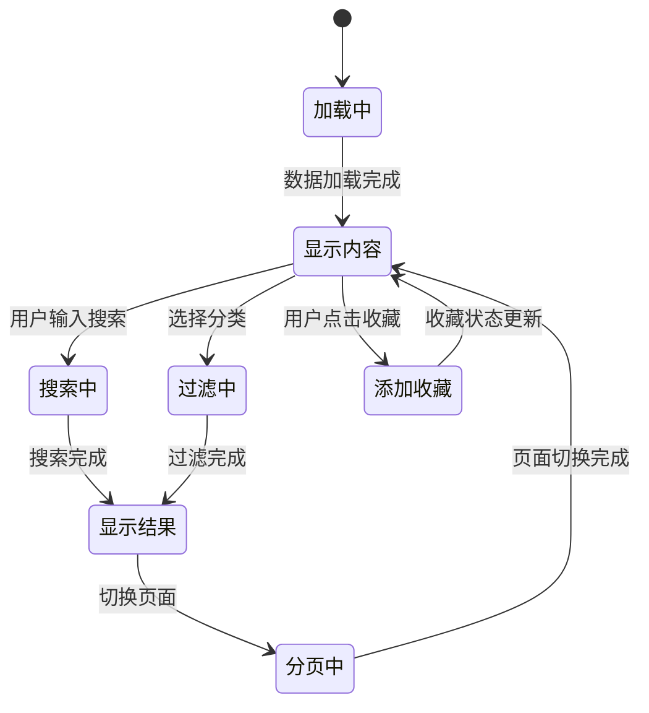
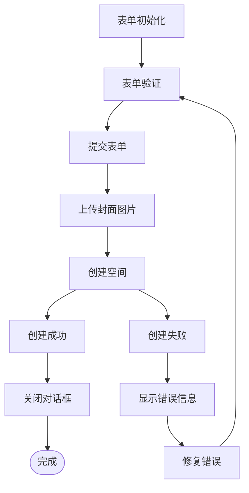
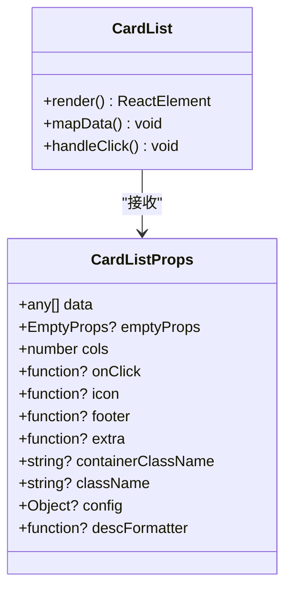

# 插件页面管理功能

<cite>
**本文档引用的文件**
- [README.md](file://README.md)
- [apps/landing-page-vite/src/pages/Plugins/index.tsx](file://apps/landing-page-vite/src/pages/Plugins/index.tsx)
- [packages/plugin-main/src/pages/SpaceHub/index.tsx](file://packages/plugin-main/src/pages/SpaceHub/index.tsx)
- [packages/plugin-main/src/pages/Spaces/index.tsx](file://packages/plugin-main/src/pages/Spaces/index.tsx)
- [packages/plugin-main/src/pages/components/SpaceForm.tsx](file://packages/plugin-main/src/pages/components/SpaceForm.tsx)
- [packages/plugin-main/src/pages/components/CardList.tsx](file://packages/plugin-main/src/pages/components/CardList.tsx)
- [packages/plugin-main/src/model/Space.ts](file://packages/plugin-main/src/model/Space.ts)
- [packages/plugin-main/src/model/Template.ts](file://packages/plugin-main/src/model/Template.ts)
- [packages/plugin-main/src/api/index.ts](file://packages/plugin-main/src/api/index.ts)
- [packages/plugin-main/src/service/space-service.ts](file://packages/plugin-main/src/service/space-service.ts)
- [packages/plugin-main/package.json](file://packages/plugin-main/package.json)
</cite>

## 目录
1. [简介](#简介)
2. [项目结构](#项目结构)
3. [核心组件](#核心组件)
4. [架构概览](#架构概览)
5. [详细组件分析](#详细组件分析)
6. [依赖关系分析](#依赖关系分析)
7. [性能考虑](#性能考虑)
8. [故障排除指南](#故障排除指南)
9. [结论](#结论)

## 简介

插件页面管理功能是知识库平台中的核心模块，负责管理用户空间、模板以及插件生态系统。该功能提供了完整的空间创建、管理和导航能力，支持多种视图模式和交互方式。

系统采用现代化的前端技术栈，包括React 18、TypeScript 5、Vite构建工具，以及shadcn/ui组件库。通过插件架构设计，实现了高度可扩展的功能模块化管理。

## 项目结构

知识库项目采用monorepo架构，主要包含以下关键目录：



**图表来源**
- [README.md:66-97](file://README.md#L66-L97)

**章节来源**
- [README.md:66-97](file://README.md#L66-L97)

## 核心组件

插件页面管理功能由多个核心组件构成，每个组件都有特定的职责和功能：

### 主要组件架构

| 组件名称 | 职责 | 关键特性 |
|---------|------|----------|
| SpaceHub | 空间管理中心 | 支持网格/列表视图、搜索过滤、收藏管理 |
| Spaces | 空间列表展示 | 最近编辑空间、所有空间管理 |
| SpaceForm | 空间创建表单 | 图标选择、封面上传、验证机制 |
| CardList | 卡片列表组件 | 可复用的卡片渲染器 |
| Template | 模板管理 | 模板创建、分类、评分系统 |

### 数据模型



**图表来源**
- [packages/plugin-main/src/model/Space.ts:1-8](file://packages/plugin-main/src/model/Space.ts#L1-L8)
- [packages/plugin-main/src/model/Template.ts:1-17](file://packages/plugin-main/src/model/Template.ts#L1-L17)
- [packages/plugin-main/src/service/space-service.ts:1-64](file://packages/plugin-main/src/service/space-service.ts#L1-L64)

**章节来源**
- [packages/plugin-main/src/model/Space.ts:1-8](file://packages/plugin-main/src/model/Space.ts#L1-L8)
- [packages/plugin-main/src/model/Template.ts:1-17](file://packages/plugin-main/src/model/Template.ts#L1-L17)
- [packages/plugin-main/src/service/space-service.ts:1-64](file://packages/plugin-main/src/service/space-service.ts#L1-L64)

## 架构概览

插件页面管理功能采用分层架构设计，确保了良好的可维护性和扩展性：



**图表来源**
- [apps/landing-page-vite/src/pages/Plugins/index.tsx:1-427](file://apps/landing-page-vite/src/pages/Plugins/index.tsx#L1-L427)
- [packages/plugin-main/src/pages/SpaceHub/index.tsx:1-617](file://packages/plugin-main/src/pages/SpaceHub/index.tsx#L1-L617)
- [packages/plugin-main/src/pages/Spaces/index.tsx:1-118](file://packages/plugin-main/src/pages/Spaces/index.tsx#L1-L118)

### API架构设计



**图表来源**
- [packages/plugin-main/src/pages/SpaceHub/index.tsx:37-74](file://packages/plugin-main/src/pages/SpaceHub/index.tsx#L37-L74)
- [packages/plugin-main/src/api/index.ts:4-9](file://packages/plugin-main/src/api/index.ts#L4-L9)

**章节来源**
- [packages/plugin-main/src/api/index.ts:1-179](file://packages/plugin-main/src/api/index.ts#L1-L179)

## 详细组件分析

### Plugins页面组件

Plugins页面是插件生态系统的入口，提供了完整的插件浏览、搜索和安装功能：



**图表来源**
- [apps/landing-page-vite/src/pages/Plugins/index.tsx:24-31](file://apps/landing-page-vite/src/pages/Plugins/index.tsx#L24-L31)
- [apps/landing-page-vite/src/pages/Plugins/index.tsx:138-152](file://apps/landing-page-vite/src/pages/Plugins/index.tsx#L138-L152)

#### 核心功能特性

1. **插件分类系统**: 支持按类型（全部、功能、应用、连接器）进行筛选
2. **搜索功能**: 实时搜索插件名称和描述
3. **详情展示**: 支持弹窗查看详情和截图预览
4. **安装流程**: 集成外部安装页面跳转
5. **统计信息**: 显示插件数量、下载量和评分

**章节来源**
- [apps/landing-page-vite/src/pages/Plugins/index.tsx:1-427](file://apps/landing-page-vite/src/pages/Plugins/index.tsx#L1-L427)

### SpaceHub页面组件

SpaceHub是空间管理的核心页面，提供了丰富的空间组织和导航功能：



**图表来源**
- [packages/plugin-main/src/pages/SpaceHub/index.tsx:130-137](file://packages/plugin-main/src/pages/SpaceHub/index.tsx#L130-L137)
- [packages/plugin-main/src/pages/SpaceHub/index.tsx:140-144](file://packages/plugin-main/src/pages/SpaceHub/index.tsx#L140-L144)

#### 主要功能模块

1. **多视图支持**: 网格视图和列表视图自由切换
2. **智能搜索**: 带防抖的实时搜索功能
3. **分类过滤**: 按应用、功能、连接器分类
4. **分页管理**: 自动计算总页数和页码生成
5. **收藏系统**: 支持空间收藏和快速访问

**章节来源**
- [packages/plugin-main/src/pages/SpaceHub/index.tsx:1-617](file://packages/plugin-main/src/pages/SpaceHub/index.tsx#L1-L617)

### SpaceForm组件

SpaceForm提供了完整的空间创建表单，包含多种自定义选项：



**图表来源**
- [packages/plugin-main/src/pages/components/SpaceForm.tsx:58-73](file://packages/plugin-main/src/pages/components/SpaceForm.tsx#L58-L73)
- [packages/plugin-main/src/pages/components/SpaceForm.tsx:261-308](file://packages/plugin-main/src/pages/components/SpaceForm.tsx#L261-L308)

#### 表单功能特性

1. **图标选择**: 支持emoji和图片两种图标类型
2. **封面上传**: 支持自定义上传和预设选择
3. **验证机制**: 使用Zod进行表单验证
4. **文件上传**: 集成文件上传和预览功能
5. **回调机制**: 创建成功后的回调处理

**章节来源**
- [packages/plugin-main/src/pages/components/SpaceForm.tsx:1-308](file://packages/plugin-main/src/pages/components/SpaceForm.tsx#L1-L308)

### CardList组件

CardList是一个高度可复用的卡片渲染组件：



**图表来源**
- [packages/plugin-main/src/pages/components/CardList.tsx:7-19](file://packages/plugin-main/src/pages/components/CardList.tsx#L7-L19)
- [packages/plugin-main/src/pages/components/CardList.tsx:21-53](file://packages/plugin-main/src/pages/components/CardList.tsx#L21-L53)

#### 组件特性

1. **灵活配置**: 支持多种配置选项和自定义渲染
2. **响应式布局**: 自适应网格布局
3. **空状态处理**: 完善的空数据处理
4. **事件处理**: 支持点击事件和额外操作
5. **样式定制**: 支持容器类名和组件类名

**章节来源**
- [packages/plugin-main/src/pages/components/CardList.tsx:1-53](file://packages/plugin-main/src/pages/components/CardList.tsx#L1-L53)

## 依赖关系分析

插件页面管理功能的依赖关系体现了清晰的分层架构：

```mermaid
graph TB
subgraph "外部依赖"
REACT[React 18]
TS[TypeScript 5]
ZOD[Zod验证]
TOAST[Toast通知]
end
subgraph "内部包依赖"
COMMON[@kn/common]
UI[@kn/ui]
ICON[@kn/icon]
EDITOR[@kn/editor]
end
subgraph "插件包"
PLUGIN_MAIN[@kn/plugin-main]
end
REACT --> PLUGIN_MAIN
TS --> PLUGIN_MAIN
ZOD --> PLUGIN_MAIN
TOAST --> PLUGIN_MAIN
COMMON --> PLUGIN_MAIN
UI --> PLUGIN_MAIN
ICON --> PLUGIN_MAIN
EDITOR --> PLUGIN_MAIN
```

**图表来源**
- [packages/plugin-main/package.json:15-26](file://packages/plugin-main/package.json#L15-L26)

### 核心依赖说明

1. **@kn/common**: 提供通用工具函数、API封装和状态管理
2. **@kn/ui**: shadcn/ui组件库，提供UI组件和样式
3. **@kn/icon**: 自定义图标库，支持多种图标类型
4. **@kn/editor**: Tiptap编辑器集成，支持富文本编辑

**章节来源**
- [packages/plugin-main/package.json:1-28](file://packages/plugin-main/package.json#L1-L28)

## 性能考虑

插件页面管理功能在设计时充分考虑了性能优化：

### 1. 懒加载和代码分割
- 使用React.lazy和Suspense实现组件懒加载
- 动态导入大型依赖减少初始包大小
- 路由级别的代码分割

### 2. 数据缓存策略
- API响应缓存避免重复请求
- 防抖搜索减少网络请求频率
- 本地状态缓存提升用户体验

### 3. 渲染优化
- 虚拟滚动处理大量数据
- React.memo优化组件重渲染
- CSS动画替代JavaScript动画

### 4. 文件上传优化
- 分片上传支持大文件
- 断点续传机制
- 进度条反馈

## 故障排除指南

### 常见问题及解决方案

#### 1. 插件加载失败
**症状**: 插件列表显示为空或加载超时
**解决方案**:
- 检查网络连接和API可用性
- 验证插件服务器状态
- 查看浏览器控制台错误信息

#### 2. 空间创建失败
**症状**: 表单提交后无响应或显示错误
**解决方案**:
- 检查表单验证规则
- 验证用户权限
- 查看后端API响应

#### 3. 图片上传问题
**症状**: 封面图片无法上传或显示异常
**解决方案**:
- 检查文件格式和大小限制
- 验证存储服务配置
- 查看上传进度和错误信息

**章节来源**
- [packages/plugin-main/src/pages/components/SpaceForm.tsx:66-73](file://packages/plugin-main/src/pages/components/SpaceForm.tsx#L66-L73)

## 结论

插件页面管理功能展现了现代前端开发的最佳实践，通过清晰的架构设计、完善的组件体系和优秀的用户体验，为知识库平台提供了强大的空间管理能力。

### 主要优势

1. **模块化设计**: 清晰的组件分离和职责划分
2. **可扩展性**: 插件架构支持功能扩展
3. **用户体验**: 流畅的交互和响应式设计
4. **性能优化**: 多层次的性能优化策略
5. **开发体验**: 类型安全和完善的开发工具链

### 技术亮点

- 采用React 18的新特性提升性能
- TypeScript提供完整的类型安全保障
- shadcn/ui组件库确保设计一致性
- Zod验证提供可靠的表单处理
- 防抖搜索优化用户体验

该功能为知识库平台的插件生态系统奠定了坚实的基础，支持未来的功能扩展和技术演进。