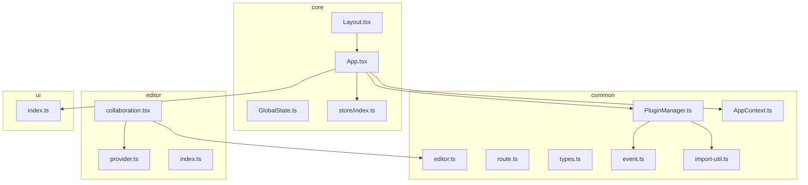
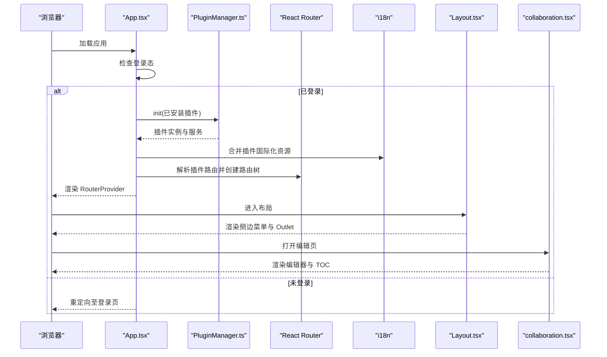
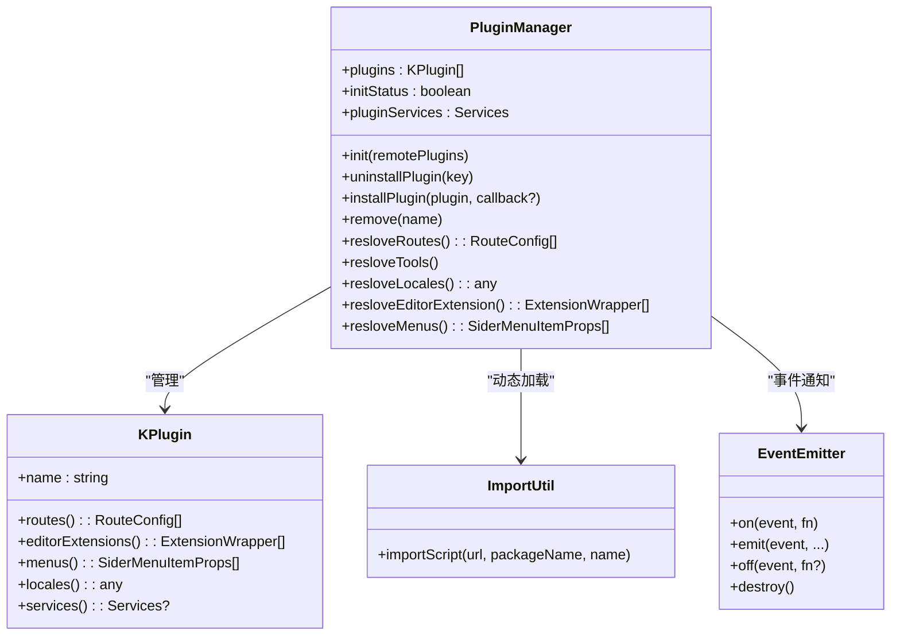
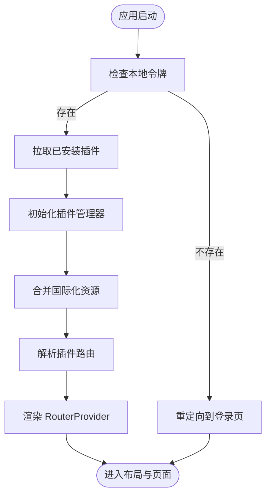
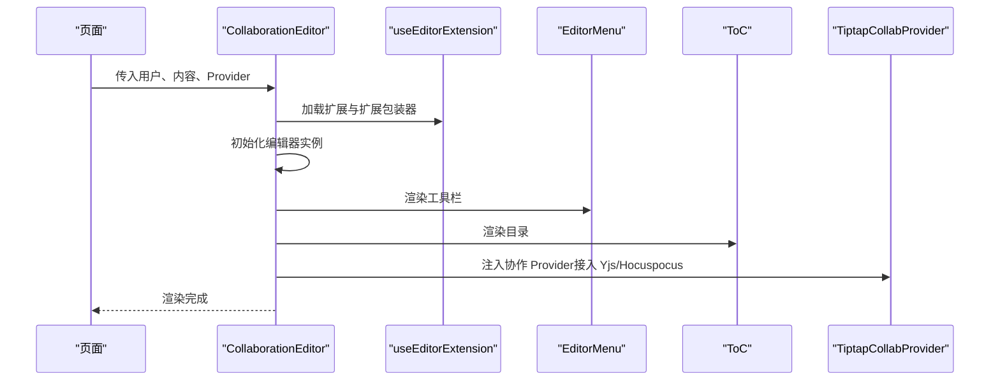
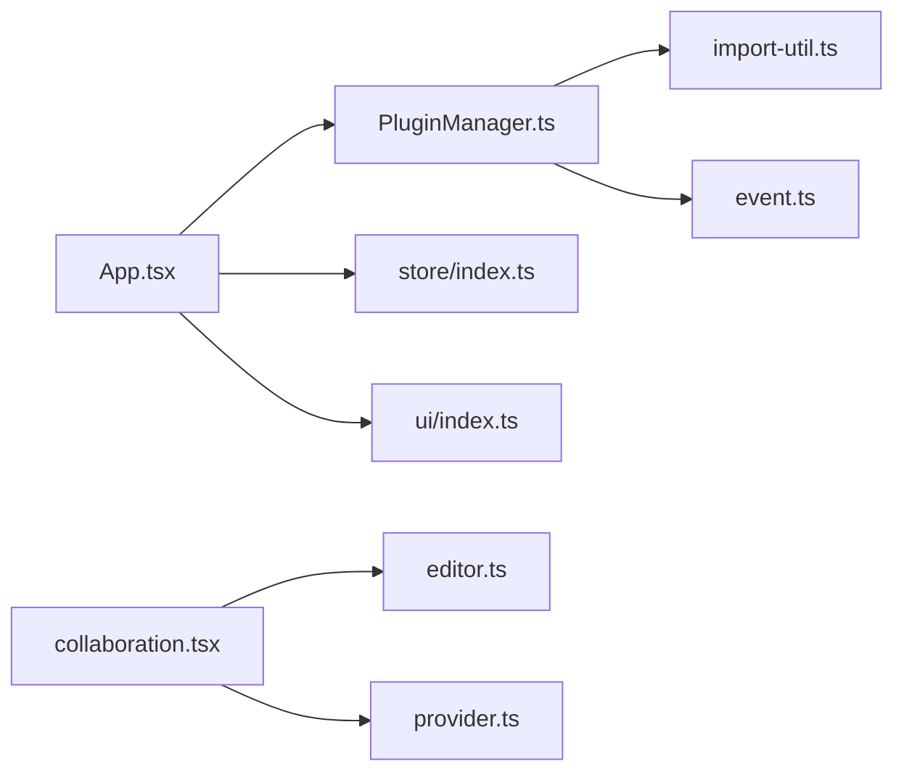

# 核心模块

<cite>
**本文引用的文件**
- [packages/common/src/core/PluginManager.ts](file://packages/common/src/core/PluginManager.ts)
- [packages/common/src/core/AppContext.ts](file://packages/common/src/core/AppContext.ts)
- [packages/common/src/core/editor.ts](file://packages/common/src/core/editor.ts)
- [packages/common/src/core/route.ts](file://packages/common/src/core/route.ts)
- [packages/common/src/core/types.ts](file://packages/common/src/core/types.ts)
- [packages/common/src/utils/import-util.ts](file://packages/common/src/utils/import-util.ts)
- [packages/common/src/event/event.ts](file://packages/common/src/event/event.ts)
- [packages/core/src/App.tsx](file://packages/core/src/App.tsx)
- [packages/core/src/Layout.tsx](file://packages/core/src/Layout.tsx)
- [packages/core/src/store/GlobalState.ts](file://packages/core/src/store/GlobalState.ts)
- [packages/core/src/store/index.ts](file://packages/core/src/store/index.ts)
- [packages/editor/src/editor/collaboration.tsx](file://packages/editor/src/editor/collaboration.tsx)
- [packages/editor/src/editor/provider.ts](file://packages/editor/src/editor/provider.ts)
- [packages/editor/src/index.ts](file://packages/editor/src/index.ts)
- [packages/ui/src/index.ts](file://packages/ui/src/index.ts)
</cite>

## 目录
1. [引言](#引言)
2. [项目结构](#项目结构)
3. [核心组件](#核心组件)
4. [架构总览](#架构总览)
5. [详细组件分析](#详细组件分析)
6. [依赖分析](#依赖分析)
7. [性能考虑](#性能考虑)
8. [故障排查指南](#故障排查指南)
9. [结论](#结论)
10. [附录](#附录)

## 引言
本文件面向知识库管理系统的核心模块，围绕以下目标展开：插件管理器的设计与实现（生命周期、动态加载、路由解析）、应用主组件的架构（路由管理、全局状态管理、组件协调）、编辑器内核的关键能力（实时协作、扩展系统、Yjs/Hocuspocus 协作协议接入点）、UI 组件库的设计理念与使用方法，并提供模块间交互与数据流分析，辅以最佳实践与排障建议。

## 项目结构
该项目采用多包工作区组织方式，核心模块分布在 common、core、editor、ui 等包中：
- common：跨应用共享的基础能力，如插件管理、上下文、类型、事件与工具。
- core：应用入口与布局，负责路由装配、国际化、全局状态、插件 Hub 集成等。
- editor：基于 Tiptap 的编辑器内核与扩展体系，提供协作编辑、菜单、TOC、导出等能力。
- ui：通用 UI 组件库，提供基础组件、主题、表单、图表等。

**图示来源**
- [packages/common/src/core/PluginManager.ts](file://packages/common/src/core/PluginManager.ts#L1-L170)
- [packages/common/src/core/AppContext.ts](file://packages/common/src/core/AppContext.ts#L1-L13)
- [packages/common/src/core/editor.ts](file://packages/common/src/core/editor.ts#L1-L31)
- [packages/common/src/core/route.ts](file://packages/common/src/core/route.ts#L1-L8)
- [packages/common/src/core/types.ts](file://packages/common/src/core/types.ts#L1-L4)
- [packages/common/src/utils/import-util.ts](file://packages/common/src/utils/import-util.ts#L1-L23)
- [packages/common/src/event/event.ts](file://packages/common/src/event/event.ts#L1-L44)
- [packages/core/src/App.tsx](file://packages/core/src/App.tsx#L1-L187)
- [packages/core/src/Layout.tsx](file://packages/core/src/Layout.tsx#L1-L157)
- [packages/core/src/store/GlobalState.ts](file://packages/core/src/store/GlobalState.ts#L1-L32)
- [packages/core/src/store/index.ts](file://packages/core/src/store/index.ts#L1-L71)
- [packages/editor/src/editor/collaboration.tsx](file://packages/editor/src/editor/collaboration.tsx#L1-L142)
- [packages/editor/src/editor/provider.ts](file://packages/editor/src/editor/provider.ts#L1-L53)
- [packages/editor/src/index.ts](file://packages/editor/src/index.ts#L1-L23)
- [packages/ui/src/index.ts](file://packages/ui/src/index.ts#L1-L18)

**章节来源**
- [packages/common/src/core/PluginManager.ts](file://packages/common/src/core/PluginManager.ts#L1-L170)
- [packages/core/src/App.tsx](file://packages/core/src/App.tsx#L1-L187)

## 核心组件
本节聚焦四大核心模块：插件管理器、应用主组件、编辑器内核、UI 组件库。

- 插件管理器（PluginManager）
  - 职责：统一装载内置与远程插件、聚合路由、菜单、国际化、编辑器扩展与服务；支持卸载与动态安装。
  - 关键接口：初始化、卸载、安装、解析路由/菜单/国际化/编辑器扩展、合并服务。
  - 动态加载：通过脚本注入与缓存，结合事件驱动刷新。
- 应用主组件（App）
  - 职责：根据登录态决定路由装配；在登录后收集插件路由并生成浏览器路由；初始化国际化资源；提供 AppContext 与全局状态 Provider。
  - 关键流程：鉴权 → 拉取已安装插件 → 初始化插件管理器 → 解析路由与国际化 → 渲染 RouterProvider。
- 编辑器内核（Editor）
  - 职责：基于 Tiptap 构建编辑器实例，挂载扩展、菜单、目录、协作能力；提供扩展系统与协作协议接入点。
  - 关键能力：扩展加载、协作编辑（Yjs/Hocuspocus 接入点）、内容渲染、工具栏与浮动菜单。
- UI 组件库（@kn/ui）
  - 职责：提供通用组件、主题、表单、图表与工具函数，支撑上层页面与编辑器 UI。

**章节来源**
- [packages/common/src/core/PluginManager.ts](file://packages/common/src/core/PluginManager.ts#L1-L170)
- [packages/core/src/App.tsx](file://packages/core/src/App.tsx#L1-L187)
- [packages/editor/src/editor/collaboration.tsx](file://packages/editor/src/editor/collaboration.tsx#L1-L142)
- [packages/ui/src/index.ts](file://packages/ui/src/index.ts#L1-L18)

## 架构总览
下图展示从应用启动到编辑器协作的端到端流程，以及模块间的耦合关系。

**图示来源**
- [packages/core/src/App.tsx](file://packages/core/src/App.tsx#L1-L187)
- [packages/common/src/core/PluginManager.ts](file://packages/common/src/core/PluginManager.ts#L1-L170)
- [packages/editor/src/editor/collaboration.tsx](file://packages/editor/src/editor/collaboration.tsx#L1-L142)

## 详细组件分析

### 插件管理器：设计与实现
- 设计要点
  - 插件配置模型：名称、状态、路由、菜单、编辑器扩展、国际化、服务等。
  - 插件包装器：KPlugin 封装插件元数据与访问器，便于统一消费。
  - 动态加载：importScript 基于脚本注入与缓存，支持远程插件按需加载。
  - 路由解析：聚合各插件路由，生成最终路由树。
  - 国际化聚合：合并插件语言包，供 i18n 初始化使用。
  - 事件驱动刷新：通过事件总线触发界面刷新，避免强耦合。
- 生命周期
  - 初始化：内置插件 + 远程插件合并，构建插件集合与服务映射。
  - 卸载：移除指定插件并广播刷新事件。
  - 安装：动态加载并注册新插件，更新服务与路由。
- 数据结构与复杂度
  - 路由/菜单/国际化解析为线性扫描，复杂度 O(P)，P 为插件数。
  - 服务合并使用对象合并，复杂度近似 O(S)，S 为服务项数。
- 错误处理
  - importScript 对加载失败进行错误回调，调用方可捕获并降级。
  - 初始化异常时回退到最小路由集，保证可用性。
- 性能优化
  - 脚本加载缓存减少重复请求。
  - 仅在必要时重建路由树，避免全量重渲染。

**图示来源**
- [packages/common/src/core/PluginManager.ts](file://packages/common/src/core/PluginManager.ts#L1-L170)
- [packages/common/src/utils/import-util.ts](file://packages/common/src/utils/import-util.ts#L1-L23)
- [packages/common/src/event/event.ts](file://packages/common/src/event/event.ts#L1-L44)

**章节来源**
- [packages/common/src/core/PluginManager.ts](file://packages/common/src/core/PluginManager.ts#L1-L170)
- [packages/common/src/utils/import-util.ts](file://packages/common/src/utils/import-util.ts#L1-L23)
- [packages/common/src/event/event.ts](file://packages/common/src/event/event.ts#L1-L44)

### 应用主组件：路由管理、全局状态与组件协调
- 路由管理
  - 登录态决定是否拉取已安装插件并解析插件路由。
  - 使用 createBrowserRouter + createRoutesFromElements 动态生成路由树。
  - 支持插件 Hub 页面与插件详情页。
- 全局状态管理
  - Redux Store 提供用户信息、标签页、侧边栏折叠等状态。
  - 通过 Provider 注入应用上下文，供子组件使用。
- 组件协调
  - AppContext 提供插件管理器实例，供布局与页面消费。
  - 事件总线用于插件安装/卸载后的界面刷新。
  - 国际化资源合并后初始化 i18n，覆盖插件语言包。

**图示来源**
- [packages/core/src/App.tsx](file://packages/core/src/App.tsx#L1-L187)
- [packages/core/src/store/index.ts](file://packages/core/src/store/index.ts#L1-L71)

**章节来源**
- [packages/core/src/App.tsx](file://packages/core/src/App.tsx#L1-L187)
- [packages/core/src/store/index.ts](file://packages/core/src/store/index.ts#L1-L71)
- [packages/core/src/store/GlobalState.ts](file://packages/core/src/store/GlobalState.ts#L1-L32)

### 编辑器内核：实时协作、扩展系统与 Yjs 协作协议
- 扩展系统
  - 通过 useEditorExtension 加载扩展与扩展包装器，支持工具栏、浮动菜单、Slash 菜单等。
  - 扩展包装器类型定义包含组别、菜单、Slash 配置、浮动菜单与工具等字段。
- 实时协作
  - 提供协作编辑容器与上下文，支持标题、目录、菜单等组件组合。
  - 通过 Provider 与 Yjs/Hocuspocus 协议对接（接口导出），作为协作协议接入点。
- 内容渲染与回退
  - 对未知节点进行内容重写，确保兼容性与可渲染性。
- 协作协议实现
  - 编辑器导出 Tiptap 协作 Provider 与 Hocuspocus Provider，供上层在协作场景中注入。

**图示来源**
- [packages/editor/src/editor/collaboration.tsx](file://packages/editor/src/editor/collaboration.tsx#L1-L142)
- [packages/editor/src/editor/provider.ts](file://packages/editor/src/editor/provider.ts#L1-L53)
- [packages/editor/src/index.ts](file://packages/editor/src/index.ts#L1-L23)
- [packages/common/src/core/editor.ts](file://packages/common/src/core/editor.ts#L1-L31)

**章节来源**
- [packages/editor/src/editor/collaboration.tsx](file://packages/editor/src/editor/collaboration.tsx#L1-L142)
- [packages/editor/src/editor/provider.ts](file://packages/editor/src/editor/provider.ts#L1-L53)
- [packages/editor/src/index.ts](file://packages/editor/src/index.ts#L1-L23)
- [packages/common/src/core/editor.ts](file://packages/common/src/core/editor.ts#L1-L31)

### UI 组件库：设计理念与使用方法
- 设计理念
  - 以可复用组件为核心，提供主题、表单、图表与动画能力。
  - 通过统一导出与工具函数，降低上层使用成本。
- 使用方法
  - 在页面中直接引入所需组件与样式。
  - 结合 @kn/ui 的主题与样式系统，保持视觉一致性。
- 与编辑器的协同
  - 编辑器内核使用 @kn/ui 的主题与组件进行菜单、提示、弹窗等 UI 层实现。

**章节来源**
- [packages/ui/src/index.ts](file://packages/ui/src/index.ts#L1-L18)
- [packages/editor/src/editor/collaboration.tsx](file://packages/editor/src/editor/collaboration.tsx#L1-L142)

## 依赖分析
- 模块耦合
  - App 依赖 PluginManager 与全局状态；PluginManager 依赖 import-util 与事件总线。
  - 编辑器内核依赖扩展包装器类型与 Provider 导出，形成对协作协议的弱耦合接入点。
  - UI 组件库被多处使用，形成通用依赖。
- 外部依赖
  - React Router、Redux、Tiptap、@hocuspocus/provider、styled-components、recharts 等。
- 循环依赖
  - 当前结构未见明显循环依赖；事件总线与 AppContext 作为横切关注点，避免深层耦合。

**图示来源**
- [packages/core/src/App.tsx](file://packages/core/src/App.tsx#L1-L187)
- [packages/common/src/core/PluginManager.ts](file://packages/common/src/core/PluginManager.ts#L1-L170)
- [packages/common/src/utils/import-util.ts](file://packages/common/src/utils/import-util.ts#L1-L23)
- [packages/common/src/event/event.ts](file://packages/common/src/event/event.ts#L1-L44)
- [packages/editor/src/editor/collaboration.tsx](file://packages/editor/src/editor/collaboration.tsx#L1-L142)
- [packages/common/src/core/editor.ts](file://packages/common/src/core/editor.ts#L1-L31)
- [packages/editor/src/editor/provider.ts](file://packages/editor/src/editor/provider.ts#L1-L53)
- [packages/ui/src/index.ts](file://packages/ui/src/index.ts#L1-L18)

**章节来源**
- [packages/core/src/App.tsx](file://packages/core/src/App.tsx#L1-L187)
- [packages/common/src/core/PluginManager.ts](file://packages/common/src/core/PluginManager.ts#L1-L170)

## 性能考虑
- 插件动态加载
  - 利用脚本加载缓存，避免重复下载；按需加载远程插件，减少首屏体积。
- 路由与国际化
  - 仅在插件变更或初始化时重建路由树；国际化资源合并后一次性初始化。
- 编辑器渲染
  - 使用立即渲染与事务控制，减少不必要的重渲染；对未知内容进行安全回退。
- 全局状态
  - Redux 状态粒度合理，避免过度拆分导致的频繁订阅与重渲染。

## 故障排查指南
- 插件加载失败
  - 现象：插件未生效或报错。
  - 排查：确认资源路径与缓存参数；检查 importScript 是否抛出错误；查看事件是否正确触发刷新。
- 路由不显示
  - 现象：插件路由未出现在导航中。
  - 排查：确认插件配置中的路由字段；检查 App 中路由解析逻辑；验证 RouterProvider 是否渲染。
- 国际化缺失
  - 现象：界面语言未切换或缺少翻译。
  - 排查：确认插件语言包合并顺序；检查 i18n 初始化参数与检测器配置。
- 协作连接问题
  - 现象：协作不可用或断连。
  - 排查：确认 Provider 注入与销毁时机；检查 Yjs/Hocuspocus 服务端连通性；观察编辑器卸载时的断连逻辑。

**章节来源**
- [packages/common/src/utils/import-util.ts](file://packages/common/src/utils/import-util.ts#L1-L23)
- [packages/common/src/event/event.ts](file://packages/common/src/event/event.ts#L1-L44)
- [packages/core/src/App.tsx](file://packages/core/src/App.tsx#L1-L187)
- [packages/editor/src/editor/collaboration.tsx](file://packages/editor/src/editor/collaboration.tsx#L1-L142)

## 结论
该核心模块以“插件即服务”的思想构建，通过插件管理器实现动态扩展与路由聚合；应用主组件承担路由装配、国际化与全局状态的中枢角色；编辑器内核提供扩展系统与协作协议接入点；UI 组件库保障一致的交互体验。模块间通过事件总线与上下文解耦，具备良好的可维护性与扩展性。

## 附录
- 最佳实践
  - 插件开发遵循统一配置模型，提供路由、菜单、国际化与扩展包装器。
  - 动态加载插件时添加错误边界与降级策略，提升稳定性。
  - 编辑器扩展尽量模块化，避免大而全的单体扩展。
  - 国际化资源按插件维度独立维护，避免命名冲突。
- 参考路径
  - 插件配置与包装器：[packages/common/src/core/PluginManager.ts](file://packages/common/src/core/PluginManager.ts#L1-L170)、[packages/common/src/core/editor.ts](file://packages/common/src/core/editor.ts#L1-L31)
  - 动态加载工具：[packages/common/src/utils/import-util.ts](file://packages/common/src/utils/import-util.ts#L1-L23)
  - 应用路由与状态：[packages/core/src/App.tsx](file://packages/core/src/App.tsx#L1-L187)、[packages/core/src/store/index.ts](file://packages/core/src/store/index.ts#L1-L71)
  - 编辑器协作与扩展：[packages/editor/src/editor/collaboration.tsx](file://packages/editor/src/editor/collaboration.tsx#L1-L142)、[packages/editor/src/index.ts](file://packages/editor/src/index.ts#L1-L23)
  - UI 组件库导出：[packages/ui/src/index.ts](file://packages/ui/src/index.ts#L1-L18)