# 核心模块

<cite>
**本文引用的文件**
- [packages/common/src/core/PluginManager.ts](file://packages/common/src/core/PluginManager.ts)
- [packages/common/src/core/AppContext.ts](file://packages/common/src/core/AppContext.ts)
- [packages/common/src/core/editor.ts](file://packages/common/src/core/editor.ts)
- [packages/common/src/core/route.ts](file://packages/common/src/core/route.ts)
- [packages/common/src/core/types.ts](file://packages/common/src/core/types.ts)
- [packages/common/src/utils/import-util.ts](file://packages/common/src/utils/import-util.ts)
- [packages/common/src/event/event.ts](file://packages/common/src/event/event.ts)
- [packages/common/src/locales/supported-language.ts](file://packages/common/src/locales/supported-language.ts)
- [packages/common/src/locales/index.ts](file://packages/common/src/locales/index.ts)
- [packages/core/src/App.tsx](file://packages/core/src/App.tsx)
- [packages/core/src/Layout.tsx](file://packages/core/src/Layout.tsx)
- [packages/core/src/store/GlobalState.ts](file://packages/core/src/store/GlobalState.ts)
- [packages/core/src/store/index.ts](file://packages/core/src/store/index.ts)
- [packages/core/src/locales/resources.ts](file://packages/core/src/locales/resources.ts)
- [packages/core/src/locales/LanguageToggle.tsx](file://packages/core/src/locales/LanguageToggle.tsx)
- [packages/editor/src/editor/collaboration.tsx](file://packages/editor/src/editor/collaboration.tsx)
- [packages/editor/src/editor/provider.ts](file://packages/editor/src/editor/provider.ts)
- [packages/editor/src/index.ts](file://packages/editor/src/index.ts)
- [packages/ui/src/index.ts](file://packages/ui/src/index.ts)
- [packages/core/src/services/file-service.ts](file://packages/core/src/services/file-service.ts)
- [packages/core/src/hooks/use-upload-file.ts](file://packages/core/src/hooks/use-upload-file.ts)
- [packages/plugin-file-manager/src/services/FileServiceImpl.ts](file://packages/plugin-file-manager/src/services/FileServiceImpl.ts)
- [packages/plugin-file-manager/src/index.tsx](file://packages/plugin-file-manager/src/index.tsx)
- [packages/core/src/services/index.ts](file://packages/core/src/services/index.ts)
- [packages/plugin-block-reference/src/i18n/index.ts](file://packages/plugin-block-reference/src/i18n/index.ts)
- [packages/electron-adapter/src/index.ts](file://packages/electron-adapter/src/index.ts)
- [packages/electron-adapter/src/config.ts](file://packages/electron-adapter/src/config.ts)
- [packages/electron-adapter/src/http/client.ts](file://packages/electron-adapter/src/http/client.ts)
- [packages/electron-adapter/src/database/manager.ts](file://packages/electron-adapter/src/database/manager.ts)
- [packages/electron-adapter/src/storage/storage-adapter.ts](file://packages/electron-adapter/src/storage/storage-adapter.ts)
- [packages/electron-adapter/src/auth/auth-manager.ts](file://packages/electron-adapter/src/auth/auth-manager.ts)
- [packages/electron-adapter/src/types/index.ts](file://packages/electron-adapter/src/types/index.ts)
- [packages/electron-adapter/src/plugin/plugin-cache-service.ts](file://packages/electron-adapter/src/plugin/plugin-cache-service.ts)
- [apps/desktop/src/main/index.ts](file://apps/desktop/src/main/index.ts)
- [apps/desktop/package.json](file://apps/desktop/package.json)
- [apps/desktop/electron.vite.config.ts](file://apps/desktop/electron.vite.config.ts)
</cite>

## 更新摘要
**所做更改**
- 新增electron-adapter架构章节，详细介绍桌面应用支持和离线功能
- 更新应用架构图，包含electron-adapter集成
- 新增桌面应用启动流程和自定义协议处理
- 更新存储适配器章节，反映本地/云端/混合存储模式
- 新增插件缓存服务和认证管理器的详细说明
- 更新文件服务架构，增加桌面应用特有的文件操作支持

## 目录
1. [引言](#引言)
2. [项目结构](#项目结构)
3. [核心组件](#核心组件)
4. [架构总览](#架构总览)
5. [详细组件分析](#详细组件分析)
6. [文件服务架构](#文件服务架构)
7. [国际化支持](#国际化支持)
8. [插件国际化支持](#插件国际化支持)
9. [electron-adapter架构](#electron-adapter架构)
10. [桌面应用支持](#桌面应用支持)
11. [依赖分析](#依赖分析)
12. [性能考虑](#性能考虑)
13. [故障排查指南](#故障排查指南)
14. [结论](#结论)
15. [附录](#附录)

## 引言
本文件面向知识库管理系统的核心模块，围绕以下目标展开：插件管理器的设计与实现（生命周期、动态加载、路由解析）、应用主组件的架构（路由管理、全局状态管理、组件协调）、编辑器内核的关键能力（实时协作、扩展系统、Yjs/Hocuspocus 协作协议接入点）、UI 组件库的设计理念与使用方法、**文件服务架构**（FileService接口与实现）、**electron-adapter架构**（桌面应用支持和离线功能）、以及**大幅扩展的国际化支持**，并提供模块间交互与数据流分析，辅以最佳实践与排障建议。

## 项目结构
该项目采用多包工作区组织方式，核心模块分布在 common、core、editor、ui、electron-adapter 等包中：
- common：跨应用共享的基础能力，如插件管理、上下文、类型、事件与工具，**包含国际化基础设施和FileService接口定义**。
- core：应用入口与布局，负责路由装配、国际化、全局状态、插件 Hub 集成、**文件服务访问**等。
- editor：基于 Tiptap 的编辑器内核与扩展体系，提供协作编辑、菜单、TOC、导出等能力。
- ui：通用 UI 组件库，提供基础组件、主题、表单、图表等。
- **electron-adapter：桌面应用适配层，提供本地数据库、HTTP客户端、认证管理、插件缓存等桌面应用专用功能**。

```mermaid
graph TB
subgraph "common"
CM["PluginManager.ts"]
CTX["AppContext.ts"]
ETYPE["editor.ts"]
RT["route.ts"]
TYP["types.ts"]
EVT["event.ts"]
IMP["import-util.ts"]
SL["supported-language.ts"]
LI["locales/index.ts"]
FSI["FileService接口"]
end
subgraph "core"
APP["App.tsx"]
LYT["Layout.tsx"]
GST["GlobalState.ts"]
GSX["store/index.ts"]
RES["locales/resources.ts"]
LT["locales/LanguageToggle.tsx"]
UFS["useFileService钩子"]
UUF["use-upload-file钩子"]
end
subgraph "editor"
COL["collaboration.tsx"]
PRV["provider.ts"]
EDX["index.ts"]
end
subgraph "ui"
UIDX["index.ts"]
end
subgraph "electron-adapter"
EIDX["index.ts"]
ECFG["config.ts"]
EHTTP["http/client.ts"]
EDB["database/manager.ts"]
ESTORE["storage/storage-adapter.ts"]
EAUTH["auth/auth-manager.ts"]
ETYPES["types/index.ts"]
EPLUGIN["plugin/plugin-cache-service.ts"]
end
subgraph "desktop-app"
DMN["apps/desktop/src/main/index.ts"]
DPKG["apps/desktop/package.json"]
DEV["apps/desktop/electron.vite.config.ts"]
end
subgraph "plugin-file-manager"
FSI["FileServiceImpl实现"]
REG["插件注册"]
end
subgraph "插件国际化"
BR["block-reference国际化"]
FM["file-manager国际化"]
AI["plugin-ai国际化"]
DB["plugin-database国际化"]
end
APP --> CM
APP --> CTX
APP --> GSX
LYT --> APP
COL --> ETYPE
COL --> PRV
CM --> IMP
CM --> EVT
APP --> UIDX
APP --> RES
APP --> LT
UFS --> FSX
UUF --> FSX
FSI --> FSI
REG --> FSX
BR --> RES
FM --> RES
AI --> RES
DB --> RES
EIDX --> ECFG
EIDX --> EHTTP
EIDX --> EDB
EIDX --> ESTORE
EIDX --> EAUTH
EIDX --> ETYPES
EIDX --> EPLUGIN
DMN --> EIDX
DPKG --> EIDX
DEV --> DMN
```

**图示来源**
- [packages/common/src/core/PluginManager.ts](file://packages/common/src/core/PluginManager.ts#L1-L170)
- [packages/common/src/core/AppContext.ts](file://packages/common/src/core/AppContext.ts#L1-L13)
- [packages/common/src/core/editor.ts](file://packages/common/src/core/editor.ts#L1-L31)
- [packages/common/src/core/route.ts](file://packages/common/src/core/route.ts#L1-L8)
- [packages/common/src/core/types.ts](file://packages/common/src/core/types.ts#L1-L4)
- [packages/common/src/utils/import-util.ts](file://packages/common/src/utils/import-util.ts#L1-L23)
- [packages/common/src/event/event.ts](file://packages/common/src/event/event.ts#L1-L44)
- [packages/common/src/locales/supported-language.ts](file://packages/common/src/locales/supported-language.ts#L1-L2)
- [packages/common/src/locales/index.ts](file://packages/common/src/locales/index.ts#L1-L6)
- [packages/core/src/App.tsx](file://packages/core/src/App.tsx#L1-L159)
- [packages/core/src/Layout.tsx](file://packages/core/src/Layout.tsx#L1-L157)
- [packages/core/src/store/GlobalState.ts](file://packages/core/src/store/GlobalState.ts#L1-L32)
- [packages/core/src/store/index.ts](file://packages/core/src/store/index.ts#L1-L71)
- [packages/core/src/locales/resources.ts](file://packages/core/src/locales/resources.ts#L1-L630)
- [packages/core/src/locales/LanguageToggle.tsx](file://packages/core/src/locales/LanguageToggle.tsx#L1-L44)
- [packages/editor/src/editor/collaboration.tsx](file://packages/editor/src/editor/collaboration.tsx#L1-L142)
- [packages/editor/src/editor/provider.ts](file://packages/editor/src/editor/provider.ts#L1-L53)
- [packages/editor/src/index.ts](file://packages/editor/src/index.ts#L1-L23)
- [packages/ui/src/index.ts](file://packages/ui/src/index.ts#L1-L18)
- [packages/core/src/services/file-service.ts](file://packages/core/src/services/file-service.ts#L1-L35)
- [packages/core/src/hooks/use-upload-file.ts](file://packages/core/src/hooks/use-upload-file.ts#L1-L82)
- [packages/plugin-file-manager/src/services/FileServiceImpl.ts](file://packages/plugin-file-manager/src/services/FileServiceImpl.ts#L1-L149)
- [packages/plugin-file-manager/src/index.tsx](file://packages/plugin-file-manager/src/index.tsx#L1-L60)
- [packages/plugin-block-reference/src/i18n/index.ts](file://packages/plugin-block-reference/src/i18n/index.ts#L1-L121)
- [packages/electron-adapter/src/index.ts](file://packages/electron-adapter/src/index.ts#L1-L26)
- [packages/electron-adapter/src/config.ts](file://packages/electron-adapter/src/config.ts#L1-L24)
- [packages/electron-adapter/src/http/client.ts](file://packages/electron-adapter/src/http/client.ts#L1-L227)
- [packages/electron-adapter/src/database/manager.ts](file://packages/electron-adapter/src/database/manager.ts#L1-L369)
- [packages/electron-adapter/src/storage/storage-adapter.ts](file://packages/electron-adapter/src/storage/storage-adapter.ts#L1-L519)
- [packages/electron-adapter/src/auth/auth-manager.ts](file://packages/electron-adapter/src/auth/auth-manager.ts#L1-L319)
- [packages/electron-adapter/src/types/index.ts](file://packages/electron-adapter/src/types/index.ts#L1-L309)
- [packages/electron-adapter/src/plugin/plugin-cache-service.ts](file://packages/electron-adapter/src/plugin/plugin-cache-service.ts#L1-L148)
- [apps/desktop/src/main/index.ts](file://apps/desktop/src/main/index.ts#L1-L95)
- [apps/desktop/package.json](file://apps/desktop/package.json#L1-L98)
- [apps/desktop/electron.vite.config.ts](file://apps/desktop/electron.vite.config.ts#L1-L30)

**章节来源**
- [packages/common/src/core/PluginManager.ts](file://packages/common/src/core/PluginManager.ts#L1-L170)
- [packages/core/src/App.tsx](file://packages/core/src/App.tsx#L1-L159)
- [packages/core/src/services/file-service.ts](file://packages/core/src/services/file-service.ts#L1-L35)
- [packages/electron-adapter/src/index.ts](file://packages/electron-adapter/src/index.ts#L1-L26)

## 核心组件
本节聚焦七大核心模块：插件管理器、应用主组件、编辑器内核、UI 组件库、**文件服务架构**、**electron-adapter架构**、**国际化支持**。

- 插件管理器（PluginManager）
  - 职责：统一装载内置与远程插件、聚合路由、菜单、国际化、编辑器扩展与服务；支持卸载与动态安装。
  - 关键接口：初始化、卸载、安装、解析路由/菜单/国际化/编辑器扩展、合并服务。
  - 动态加载：通过脚本注入与缓存，结合事件驱动刷新。
- 应用主组件（App）
  - 职责：根据登录态决定路由装配；在登录后收集插件路由并生成浏览器路由；初始化国际化资源；提供 AppContext 与全局状态 Provider。
  - 关键流程：鉴权 → 拉取已安装插件 → 初始化插件管理器 → 解析路由与国际化 → 渲染 RouterProvider。
- 编辑器内核（Editor）
  - 职责：基于 Tiptap 构建编辑器实例，挂载扩展、菜单、目录、协作能力；提供扩展系统与协作协议接入点。
  - 关键能力：扩展加载、协作编辑（Yjs/Hocuspocus 接入点）、内容渲染、工具栏与浮动菜单。
- UI 组件库（@kn/ui）
  - 职责：提供通用组件、主题、表单、图表与工具函数，支撑上层页面与编辑器 UI。
- **文件服务架构（新增）**
  - 职责：提供统一的文件操作接口，支持上传、下载、删除、重命名、移动等文件管理功能。
  - 关键接口：FileService接口定义，useFileService钩子，FileServiceImpl实现。
  - 服务注册：通过插件注册机制将文件服务注册到插件管理器的服务映射中。
- **electron-adapter架构（新增）**
  - 职责：为桌面应用提供本地数据库、HTTP客户端、认证管理、插件缓存等专用功能。
  - 关键组件：DatabaseManager（SQLite本地存储）、HttpClient（带token管理的HTTP客户端）、AuthManager（认证管理）、StorageAdapter（存储模式适配）、PluginCacheService（插件缓存）。
  - 存储模式：LOCAL（仅本地）、CLOUD（仅云端）、HYBRID（本地缓存+云端同步）。
- **国际化支持（重大改进）**
  - 职责：提供多语言支持，包含**630个翻译条目**，支持中英文双语切换，语言检测与持久化存储。
  - 覆盖范围：错误页面、插件市场、消息盒子、插件上传器、插件管理器、协作邀请、数据库视图等核心功能模块。

**章节来源**
- [packages/common/src/core/PluginManager.ts](file://packages/common/src/core/PluginManager.ts#L1-L170)
- [packages/core/src/App.tsx](file://packages/core/src/App.tsx#L1-L159)
- [packages/editor/src/editor/collaboration.tsx](file://packages/editor/src/editor/collaboration.tsx#L1-L142)
- [packages/ui/src/index.ts](file://packages/ui/src/index.ts#L1-L18)
- [packages/core/src/locales/resources.ts](file://packages/core/src/locales/resources.ts#L1-L630)
- [packages/common/src/core/types.ts](file://packages/common/src/core/types.ts#L32-L54)
- [packages/core/src/services/file-service.ts](file://packages/core/src/services/file-service.ts#L1-L35)
- [packages/plugin-file-manager/src/services/FileServiceImpl.ts](file://packages/plugin-file-manager/src/services/FileServiceImpl.ts#L1-L149)
- [packages/electron-adapter/src/index.ts](file://packages/electron-adapter/src/index.ts#L1-L26)
- [packages/electron-adapter/src/auth/auth-manager.ts](file://packages/electron-adapter/src/auth/auth-manager.ts#L1-L319)
- [packages/electron-adapter/src/storage/storage-adapter.ts](file://packages/electron-adapter/src/storage/storage-adapter.ts#L1-L519)

## 架构总览
下图展示从应用启动到编辑器协作的端到端流程，以及模块间的耦合关系，**包含electron-adapter集成和文件服务注册与访问的完整流程**。

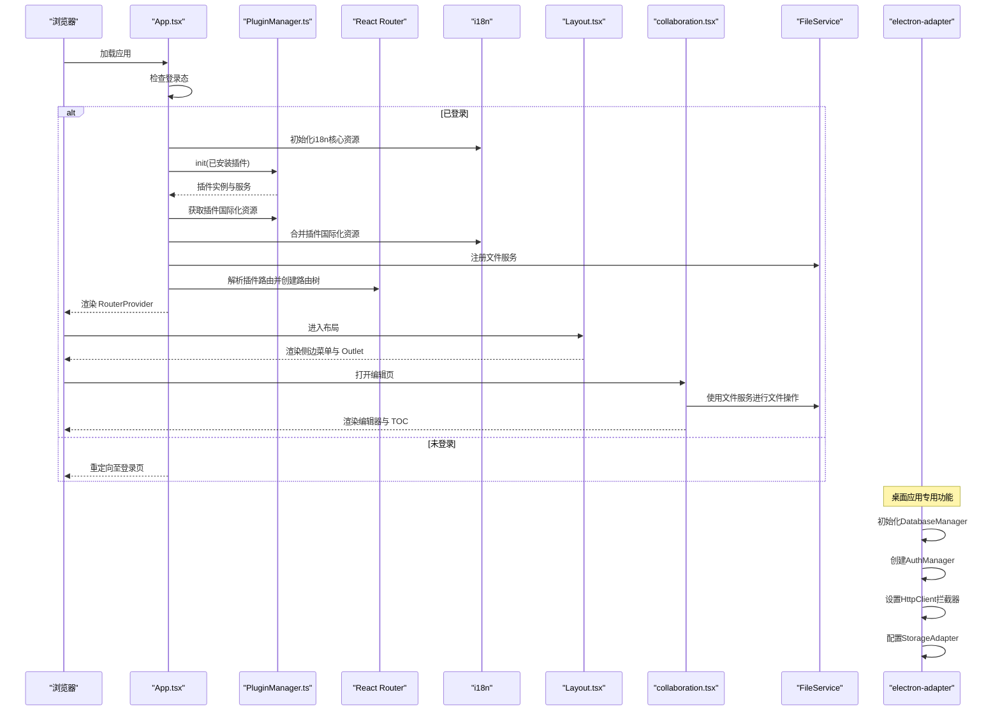
```mermaid
sequenceDiagram
participant Browser as "浏览器"
participant App as "App.tsx"
participant PM as "PluginManager.ts"
participant Router as "React Router"
participant Intl as "i18n"
participant Layout as "Layout.tsx"
participant Editor as "collaboration.tsx"
participant FS as "FileService"
participant Electron as "electron-adapter"
Browser->>App : 加载应用
App->>App : 检查登录态
alt 已登录
App->>Intl : 初始化i18n核心资源
App->>PM : init(已安装插件)
PM-->>App : 插件实例与服务
App->>PM : 获取插件国际化资源
App->>Intl : 合并插件国际化资源
App->>FS : 注册文件服务
App->>Router : 解析插件路由并创建路由树
App-->>Browser : 渲染 RouterProvider
Browser->>Layout : 进入布局
Layout-->>Browser : 渲染侧边菜单与 Outlet
Browser->>Editor : 打开编辑页
Editor->>FS : 使用文件服务进行文件操作
Editor-->>Browser : 渲染编辑器与 TOC
else 未登录
App-->>Browser : 重定向至登录页
end
Note over Electron : 桌面应用专用功能
Electron->>Electron : 初始化DatabaseManager
Electron->>Electron : 创建AuthManager
Electron->>Electron : 设置HttpClient拦截器
Electron->>Electron : 配置StorageAdapter
```

**图示来源**
- [packages/core/src/App.tsx](file://packages/core/src/App.tsx#L1-L159)
- [packages/common/src/core/PluginManager.ts](file://packages/common/src/core/PluginManager.ts#L1-L170)
- [packages/editor/src/editor/collaboration.tsx](file://packages/editor/src/editor/collaboration.tsx#L1-L142)
- [packages/plugin-file-manager/src/index.tsx](file://packages/plugin-file-manager/src/index.tsx#L50-L53)
- [packages/electron-adapter/src/index.ts](file://packages/electron-adapter/src/index.ts#L1-L26)

## 详细组件分析

### 插件管理器：设计与实现
- 设计要点
  - 插件配置模型：名称、状态、路由、菜单、编辑器扩展、国际化、服务等。
  - 插件包装器：KPlugin 封装插件元数据与访问器，便于统一消费。
  - 动态加载：importScript 基于脚本注入与缓存，支持远程插件按需加载。
  - 路由解析：聚合各插件路由，生成最终路由树。
  - **国际化聚合：合并插件语言包，供 i18n 初始化使用**。
  - **服务注册：通过 services 字段注册插件提供的服务，如 FileService**。
  - 事件驱动刷新：通过事件总线触发界面刷新，避免强耦合。
- 生命周期
  - 初始化：内置插件 + 远程插件合并，构建插件集合与服务映射。
  - 卸载：移除指定插件并广播刷新事件。
  - 安装：动态加载并注册新插件，更新服务与路由。
- 数据结构与复杂度
  - 路由/菜单/国际化解析为线性扫描，复杂度 O(P)，P 为插件数。
  - 服务合并使用对象合并，复杂度近似 O(S)，S 为服务项数。
- 错误处理
  - importScript 对加载失败进行错误回调，调用方可捕获并降级。
  - 初始化异常时回退到最小路由集，保证可用性。
- 性能优化
  - 脚本加载缓存减少重复请求。
  - 仅在必要时重建路由树，避免全量重渲染。

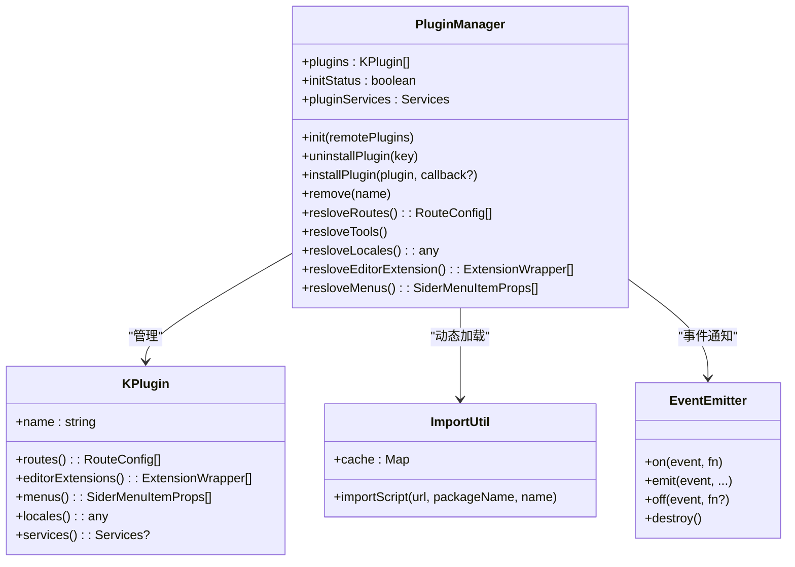
```mermaid
classDiagram
class KPlugin {
+name : string
+routes() : RouteConfig[]
+editorExtensions() : ExtensionWrapper[]
+menus() : SiderMenuItemProps[]
+locales() : any
+services() : Services?
}
class PluginManager {
+plugins : KPlugin[]
+init(remotePlugins)
+uninstallPlugin(key)
+installPlugin(plugin, callback?)
+remove(name)
+initStatus : boolean
+resloveRoutes() : RouteConfig[]
+resloveTools()
+resloveLocales() : any
+resloveEditorExtension() : ExtensionWrapper[]
+resloveMenus() : SiderMenuItemProps[]
+pluginServices : Services
}
class ImportUtil {
+importScript(url, packageName, name)
+cache : Map
}
class EventEmitter {
+on(event, fn)
+emit(event, ...)
+off(event, fn?)
+destroy()
}
PluginManager --> KPlugin : "管理"
PluginManager --> ImportUtil : "动态加载"
PluginManager --> EventEmitter : "事件通知"
```

**图示来源**
- [packages/common/src/core/PluginManager.ts](file://packages/common/src/core/PluginManager.ts#L1-L170)
- [packages/common/src/utils/import-util.ts](file://packages/common/src/utils/import-util.ts#L1-L23)
- [packages/common/src/event/event.ts](file://packages/common/src/event/event.ts#L1-L44)

**章节来源**
- [packages/common/src/core/PluginManager.ts](file://packages/common/src/core/PluginManager.ts#L1-L170)
- [packages/common/src/utils/import-util.ts](file://packages/common/src/utils/import-util.ts#L1-L23)
- [packages/common/src/event/event.ts](file://packages/common/src/event/event.ts#L1-L44)

### 应用主组件：路由管理、全局状态与组件协调
- 路由管理
  - 登录态决定是否拉取已安装插件并解析插件路由。
  - 使用 createBrowserRouter + createRoutesFromElements 动态生成路由树。
  - 支持插件 Hub 页面与插件详情页。
- 全局状态管理
  - Redux Store 提供用户信息、标签页、侧边栏折叠等状态。
  - 通过 Provider 注入应用上下文，供子组件使用。
- 组件协调
  - AppContext 提供插件管理器实例，供布局与页面消费。
  - 事件总线用于插件安装/卸载后的界面刷新。
  - **国际化资源合并后初始化 i18n，覆盖插件语言包**。
  - **文件服务注册：通过插件管理器的服务映射提供文件服务访问**。

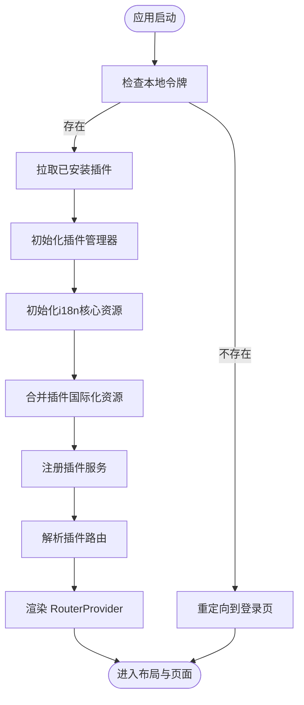
```mermaid
flowchart TD
Start(["应用启动"]) --> CheckAuth["检查本地令牌"]
CheckAuth --> |存在| LoadInstalled["拉取已安装插件"]
CheckAuth --> |不存在| RedirectLogin["重定向到登录页"]
LoadInstalled --> InitPM["初始化插件管理器"]
InitPM --> InitI18n["初始化i18n核心资源"]
InitI18n --> MergeLocales["合并插件国际化资源"]
MergeLocales --> RegisterServices["注册插件服务"]
RegisterServices --> BuildRoutes["解析插件路由"]
BuildRoutes --> RenderRouter["渲染 RouterProvider"]
RenderRouter --> End(["进入布局与页面"])
RedirectLogin --> End
```

**图示来源**
- [packages/core/src/App.tsx](file://packages/core/src/App.tsx#L1-L159)
- [packages/core/src/store/index.ts](file://packages/core/src/store/index.ts#L1-L71)
- [packages/plugin-file-manager/src/index.tsx](file://packages/plugin-file-manager/src/index.tsx#L50-L53)

**章节来源**
- [packages/core/src/App.tsx](file://packages/core/src/App.tsx#L1-L159)
- [packages/core/src/store/index.ts](file://packages/core/src/store/index.ts#L1-L71)
- [packages/core/src/store/GlobalState.ts](file://packages/core/src/store/GlobalState.ts#L1-L32)

### 编辑器内核：实时协作、扩展系统与 Yjs 协作协议
- 扩展系统
  - 通过 useEditorExtension 加载扩展与扩展包装器，支持工具栏、浮动菜单、Slash 菜单等。
  - 扩展包装器类型定义包含组别、菜单、Slash 配置、浮动菜单与工具等字段。
- 实时协作
  - 提供协作编辑容器与上下文，支持标题、目录、菜单等组件组合。
  - 通过 Provider 与 Yjs/Hocuspocus 协议对接（接口导出），作为协作协议接入点。
- 内容渲染与回退
  - 对未知节点进行内容重写，确保兼容性与可渲染性。
- 协作协议实现
  - 编辑器导出 Tiptap 协作 Provider 与 Hocuspocus Provider，供上层在协作场景中注入。

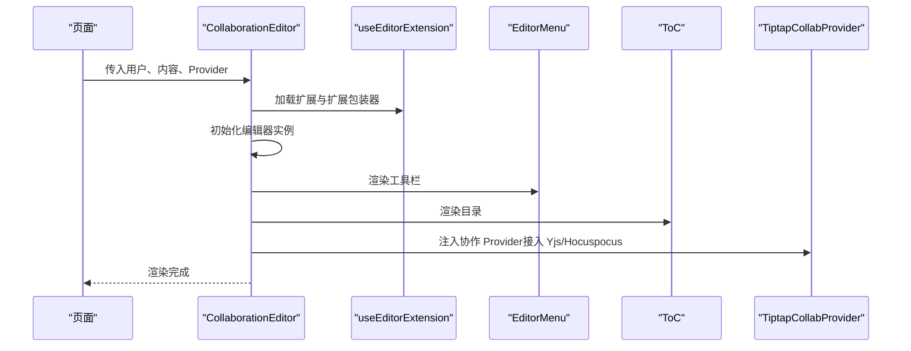
```mermaid
sequenceDiagram
participant Page as "页面"
participant Collab as "CollaborationEditor"
participant Ext as "useEditorExtension"
participant Menu as "EditorMenu"
participant TOC as "ToC"
participant Prov as "TiptapCollabProvider"
Page->>Collab : 传入用户、内容、Provider
Collab->>Ext : 加载扩展与扩展包装器
Collab->>Collab : 初始化编辑器实例
Collab->>Menu : 渲染工具栏
Collab->>TOC : 渲染目录
Collab->>Prov : 注入协作 Provider接入 Yjs/Hocuspocus
Collab-->>Page : 渲染完成
```

**图示来源**
- [packages/editor/src/editor/collaboration.tsx](file://packages/editor/src/editor/collaboration.tsx#L1-L142)
- [packages/editor/src/editor/provider.ts](file://packages/editor/src/editor/provider.ts#L1-L53)
- [packages/editor/src/index.ts](file://packages/editor/src/index.ts#L1-L23)
- [packages/common/src/core/editor.ts](file://packages/common/src/core/editor.ts#L1-L31)

**章节来源**
- [packages/editor/src/editor/collaboration.tsx](file://packages/editor/src/editor/collaboration.tsx#L1-L142)
- [packages/editor/src/editor/provider.ts](file://packages/editor/src/editor/provider.ts#L1-L53)
- [packages/editor/src/index.ts](file://packages/editor/src/index.ts#L1-L23)
- [packages/common/src/core/editor.ts](file://packages/common/src/core/editor.ts#L1-L31)

### UI 组件库：设计理念与使用方法
- 设计理念
  - 以可复用组件为核心，提供主题、表单、图表与动画能力。
  - 通过统一导出与工具函数，降低上层使用成本。
- 使用方法
  - 在页面中直接引入所需组件与样式。
  - 结合 @kn/ui 的主题与样式系统，保持视觉一致性。
- 与编辑器的协同
  - 编辑器内核使用 @kn/ui 的主题与组件进行菜单、提示、弹窗等 UI 层实现。

**章节来源**
- [packages/ui/src/index.ts](file://packages/ui/src/index.ts#L1-L18)
- [packages/editor/src/editor/collaboration.tsx](file://packages/editor/src/editor/collaboration.tsx#L1-L142)

## 文件服务架构

### FileService接口定义
FileService是知识库系统中统一的文件操作接口，为所有插件提供标准化的文件管理能力：

- 核心功能
  - 文件上传：支持单文件、多文件上传
  - 文件下载：获取下载链接并执行下载
  - 文件管理：删除、重命名、移动等操作
  - 文件中心：与文件管理中心集成
- 接口规范
  - upload：打开文件选择器并上传
  - uploadFile：上传指定文件
  - uploadFiles：批量上传文件
  - getDownloadUrl：获取文件下载URL
  - download：执行文件下载
  - deleteFile/createFolder/renameFile/moveFile：文件管理操作

### useFileService钩子
useFileService钩子提供了访问FileService的便捷方式：

- 必须使用版本
  - 当服务已注册时，直接返回FileService实例
  - 当服务未注册时，抛出错误异常
- 可选使用版本
  - 当服务已注册时返回FileService实例
  - 当服务未注册时返回undefined
- 使用场景
  - 编辑器扩展中的文件操作
  - 文件管理插件的功能实现
  - 任何需要文件管理功能的组件

### FileServiceImpl实现
FileServiceImpl是FileManager插件提供的具体实现：

- 下载基础URL配置
- 文件上传实现（基于browser-fs-access）
- 文件下载实现（新窗口打开）
- 文件管理API调用
- 文件中心集成

### 服务注册与集成
文件服务通过插件注册机制集成到系统中：

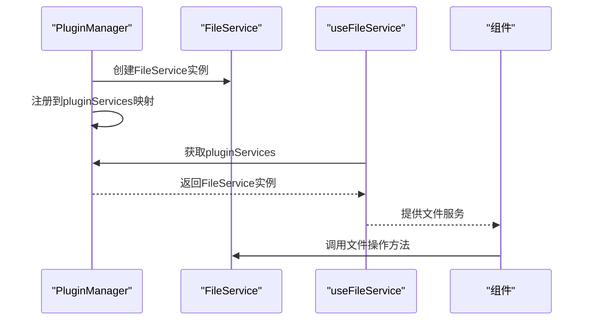
```mermaid
sequenceDiagram
participant PM as "PluginManager"
participant FS as "FileService"
participant UFS as "useFileService"
participant Component as "组件"
PM->>FS : 创建FileService实例
PM->>PM : 注册到pluginServices映射
UFS->>PM : 获取pluginServices
PM-->>UFS : 返回FileService实例
UFS-->>Component : 提供文件服务
Component->>FS : 调用文件操作方法
```

**图示来源**
- [packages/plugin-file-manager/src/index.tsx](file://packages/plugin-file-manager/src/index.tsx#L28-L53)
- [packages/core/src/services/file-service.ts](file://packages/core/src/services/file-service.ts#L12-L33)
- [packages/plugin-file-manager/src/services/FileServiceImpl.ts](file://packages/plugin-file-manager/src/services/FileServiceImpl.ts#L10-L148)

**章节来源**
- [packages/common/src/core/types.ts](file://packages/common/src/core/types.ts#L32-L54)
- [packages/core/src/services/file-service.ts](file://packages/core/src/services/file-service.ts#L1-L35)
- [packages/plugin-file-manager/src/services/FileServiceImpl.ts](file://packages/plugin-file-manager/src/services/FileServiceImpl.ts#L1-L149)
- [packages/plugin-file-manager/src/index.tsx](file://packages/plugin-file-manager/src/index.tsx#L28-L53)

### use-upload-file钩子的废弃状态
useUpload-file钩子已被标记为废弃，需要迁移到新的FileService架构：

- 废弃原因
  - 新的FileService架构提供了更完善的文件管理功能
  - 统一的接口设计便于插件开发
  - 更好的错误处理和用户体验
- 迁移指南
  - 使用useFileService钩子替代useUploadFile
  - 通过FileService接口访问文件操作功能
  - 保持向后兼容性，旧钩子仍可使用但不推荐

**章节来源**
- [packages/core/src/hooks/use-upload-file.ts](file://packages/core/src/hooks/use-upload-file.ts#L20-L23)
- [packages/core/src/services/file-service.ts](file://packages/core/src/services/file-service.ts#L1-L35)

## 国际化支持

### 支持的语言与覆盖范围
系统现已支持中英文双语，包含**630个翻译条目**，涵盖以下功能模块：

- **错误页面**：错误标题、子标题、错误详情、未知错误、技术详情、返回首页、重新加载页面等
- **插件市场**：插件创建、开始使用、开发者文档、标题、描述等
- **消息盒子**：消息标题、未读计数、标签页、空状态、操作按钮、时间显示、查看全部消息
- **插件上传器**：发布插件对话框标题、步骤、分步描述、基本身份、版本与分类、展示信息、字段、标签、上传部分、预览、提交提示、按钮、退出对话框、验证规则、提示信息
- **插件管理器**：管理插件标题、描述、概览、状态统计、类型筛选、搜索、排序、操作按钮、详情、版本历史、设置等
- **协作邀请**：权限设置、加载状态、错误处理、等待主持人、提示信息、头部信息、会话结束、只读模式、按钮等
- **数据库视图**：动作按钮、对话框、删除视图确认等

### 国际化初始化流程
应用启动时的国际化初始化流程如下：

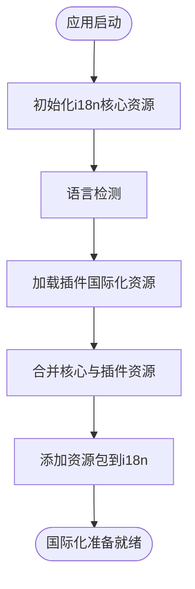
```mermaid
flowchart TD
Start(["应用启动"]) --> InitI18n["初始化i18n核心资源"]
InitI18n --> DetectLang["语言检测"]
DetectLang --> LoadPluginLocales["加载插件国际化资源"]
LoadPluginLocales --> MergeResources["合并核心与插件资源"]
MergeResources --> AddBundles["添加资源包到i18n"]
AddBundles --> Ready(["国际化准备就绪"])
```

**图示来源**
- [packages/core/src/App.tsx](file://packages/core/src/App.tsx#L77-L111)
- [packages/core/src/locales/resources.ts](file://packages/core/src/locales/resources.ts#L1-L630)

### 语言切换组件
系统提供语言切换功能，支持中英文切换：

- **LanguageToggle 组件**：提供下拉菜单形式的语言切换界面
- **支持的语言**：英语（🇺🇸）、中文（🇨🇳）
- **切换机制**：点击语言标志切换当前语言，状态持久化到 localStorage
- **检测逻辑**：根据当前语言选择对应的旗帜图标

**章节来源**
- [packages/core/src/locales/resources.ts](file://packages/core/src/locales/resources.ts#L1-L630)
- [packages/core/src/locales/LanguageToggle.tsx](file://packages/core/src/locales/LanguageToggle.tsx#L1-L44)
- [packages/common/src/locales/supported-language.ts](file://packages/common/src/locales/supported-language.ts#L1-L2)
- [packages/common/src/locales/index.ts](file://packages/common/src/locales/index.ts#L1-L6)

## 插件国际化支持

### 插件国际化架构
各插件采用独立的国际化实现，通过插件管理器统一聚合：

- **Block Reference 插件**：支持块引用、页面引用、选择器、斜杠命令等翻译
- **File Manager 插件**：文件管理器界面、对话框、面包屑导航等翻译
- **AI 插件**：AI相关界面、设置、图像处理等功能翻译
- **Database 插件**：数据库视图、表格操作、字段管理等翻译

### 国际化实现模式
每个插件的国际化实现遵循统一模式：

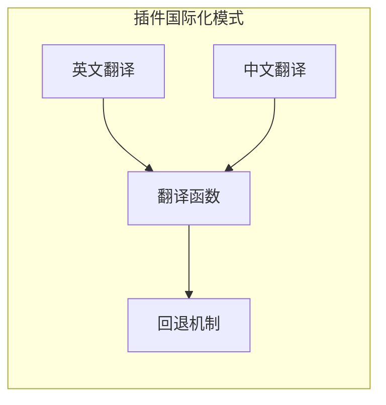
```mermaid
graph LR
subgraph "插件国际化模式"
EN["英文翻译"]
ZH["中文翻译"]
T["翻译函数"]
FB["回退机制"]
EN --> T
ZH --> T
T --> FB
end
```

**图示来源**
- [packages/plugin-block-reference/src/i18n/index.ts](file://packages/plugin-block-reference/src/i18n/index.ts#L1-L121)

### 国际化聚合流程
插件国际化资源通过以下流程聚合到系统中：

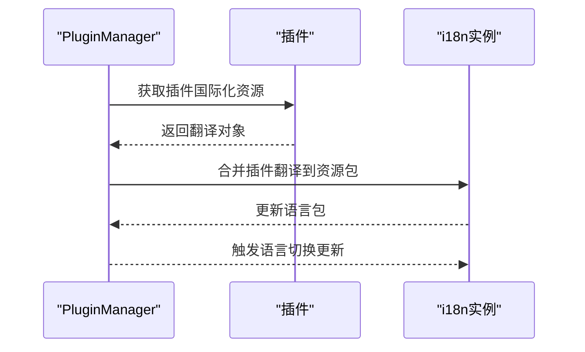
```mermaid
sequenceDiagram
participant PM as "PluginManager"
participant Plugin as "插件"
participant I18n as "i18n实例"
PM->>Plugin : 获取插件国际化资源
Plugin-->>PM : 返回翻译对象
PM->>I18n : 合并插件翻译到资源包
I18n-->>PM : 更新语言包
PM-->>I18n : 触发语言切换更新
```

**图示来源**
- [packages/common/src/core/PluginManager.ts](file://packages/common/src/core/PluginManager.ts#L1-L170)
- [packages/core/src/locales/resources.ts](file://packages/core/src/locales/resources.ts#L1-L630)

### 国际化最佳实践
- **键值命名规范**：使用层级命名空间，如 `pluginName.section.key`
- **占位符使用**：统一使用 `{{variable}}` 格式，避免硬编码文本
- **回退机制**：优先使用插件翻译，缺失时回退到英文
- **一致性维护**：各插件保持翻译风格和术语一致
- **测试覆盖**：为关键界面提供双语测试用例

**章节来源**
- [packages/plugin-block-reference/src/i18n/index.ts](file://packages/plugin-block-reference/src/i18n/index.ts#L1-L121)
- [packages/common/src/core/PluginManager.ts](file://packages/common/src/core/PluginManager.ts#L1-L170)

## electron-adapter架构

### 架构概述
electron-adapter是知识库桌面应用的核心适配层，为桌面应用提供本地数据存储、HTTP API调用、认证管理、插件缓存等专用功能。该模块采用分层架构设计，包含以下核心组件：

- **DatabaseManager**：基于better-sqlite3的本地数据库管理，提供SQLite数据库的创建、迁移、事务处理等功能
- **HttpClient**：基于axios的HTTP客户端，支持自动token注入、刷新和错误处理
- **AuthManager**：认证管理器，支持匿名登录、账号密码登录、会员系统
- **StorageAdapter**：存储适配器，根据用户身份自动选择存储模式（本地/云端/混合）
- **PluginCacheService**：插件缓存服务，负责插件JS文件的本地缓存和版本管理
- **类型系统**：完整的TypeScript类型定义，确保类型安全

### DatabaseManager：本地数据库管理
DatabaseManager提供SQLite数据库的完整管理功能：

- **数据库初始化**：自动创建数据库文件，设置WAL模式和外键约束
- **模式管理**：支持数据库模式版本控制和迁移
- **表结构**：包含认证信息、用户信息、空间、页面、插件、文件等完整表结构
- **事务支持**：提供事务封装，确保数据一致性
- **备份与维护**：支持数据库备份、Vacuum清理和统计查询

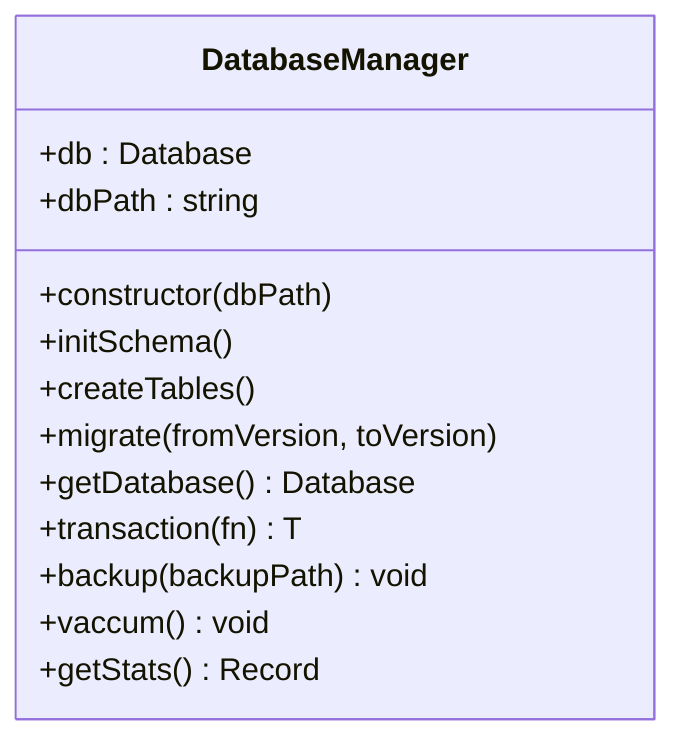
```mermaid
classDiagram
class DatabaseManager {
+db : Database
+dbPath : string
+constructor(dbPath)
+initSchema()
+createTables()
+migrate(fromVersion, toVersion)
+getDatabase() Database
+transaction(fn) T
+backup(backupPath) void
+vaccum() void
+getStats() Record
}
```

**图示来源**
- [packages/electron-adapter/src/database/manager.ts](file://packages/electron-adapter/src/database/manager.ts#L1-L369)

### HttpClient：智能HTTP客户端
HttpClient基于axios封装，提供桌面应用专用的HTTP通信能力：

- **自动token管理**：支持访问令牌和刷新令牌的自动注入和刷新
- **请求拦截器**：自动添加Authorization头，处理401未授权错误
- **响应拦截器**：统一处理错误响应，支持队列化的重试机制
- **下载支持**：支持文件下载和进度回调
- **事件系统**：通过EventEmitter提供认证过期、请求错误等事件

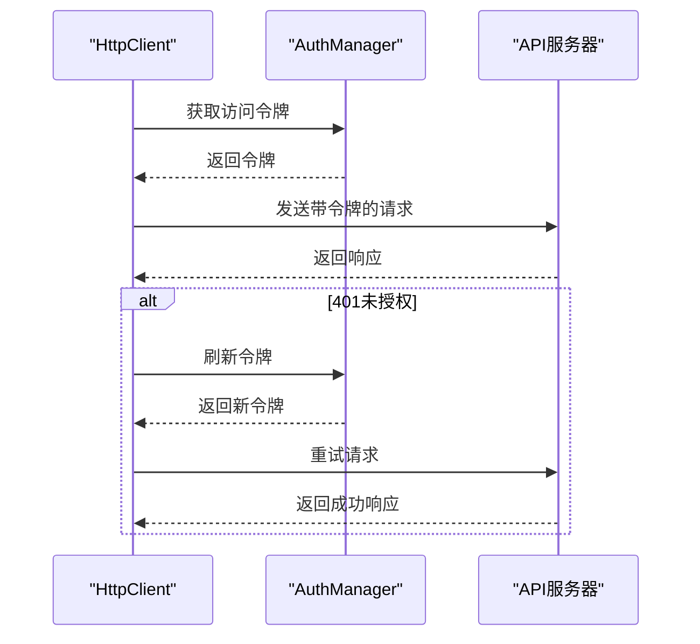
```mermaid
sequenceDiagram
participant Client as "HttpClient"
participant Token as "AuthManager"
participant Server as "API服务器"
Client->>Token : 获取访问令牌
Token-->>Client : 返回令牌
Client->>Server : 发送带令牌的请求
Server-->>Client : 返回响应
alt 401未授权
Client->>Token : 刷新令牌
Token-->>Client : 返回新令牌
Client->>Server : 重试请求
Server-->>Client : 返回成功响应
end
```

**图示来源**
- [packages/electron-adapter/src/http/client.ts](file://packages/electron-adapter/src/http/client.ts#L1-L227)

### AuthManager：认证管理器
AuthManager提供完整的用户认证和会话管理功能：

- **设备管理**：自动生成和管理设备ID，支持设备绑定
- **登录方式**：支持匿名登录和账号密码登录
- **会话管理**：管理访问令牌、刷新令牌和用户信息
- **会员系统**：集成会员等级检查和过期管理
- **事件系统**：提供登录、登出、令牌刷新等事件

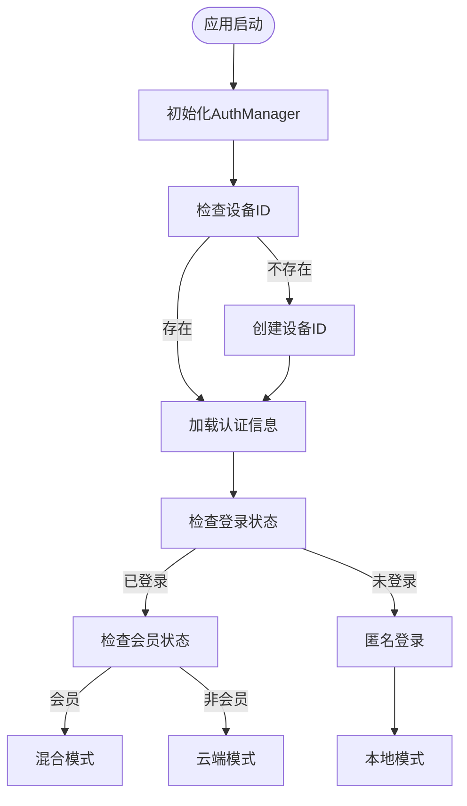
```mermaid
flowchart TD
Start(["应用启动"]) --> InitAuth["初始化AuthManager"]
InitAuth --> CheckDevice["检查设备ID"]
CheckDevice --> |存在| LoadAuth["加载认证信息"]
CheckDevice --> |不存在| CreateDevice["创建设备ID"]
CreateDevice --> LoadAuth
LoadAuth --> CheckLogin["检查登录状态"]
CheckLogin --> |已登录| CheckMember["检查会员状态"]
CheckLogin --> |未登录| AnonymousLogin["匿名登录"]
CheckMember --> |会员| HybridMode["混合模式"]
CheckMember --> |非会员| CloudMode["云端模式"]
AnonymousLogin --> LocalMode["本地模式"]
```

**图示来源**
- [packages/electron-adapter/src/auth/auth-manager.ts](file://packages/electron-adapter/src/auth/auth-manager.ts#L1-L319)

### StorageAdapter：存储模式适配器
StorageAdapter根据用户身份自动选择最优的存储模式：

- **LOCAL模式**：匿名用户，仅使用本地数据库，不进行云端同步
- **CLOUD模式**：已登录用户（非会员），仅访问云端数据，不缓存到本地
- **HYBRID模式**：会员用户，本地缓存+云端同步，提供最佳的离线体验

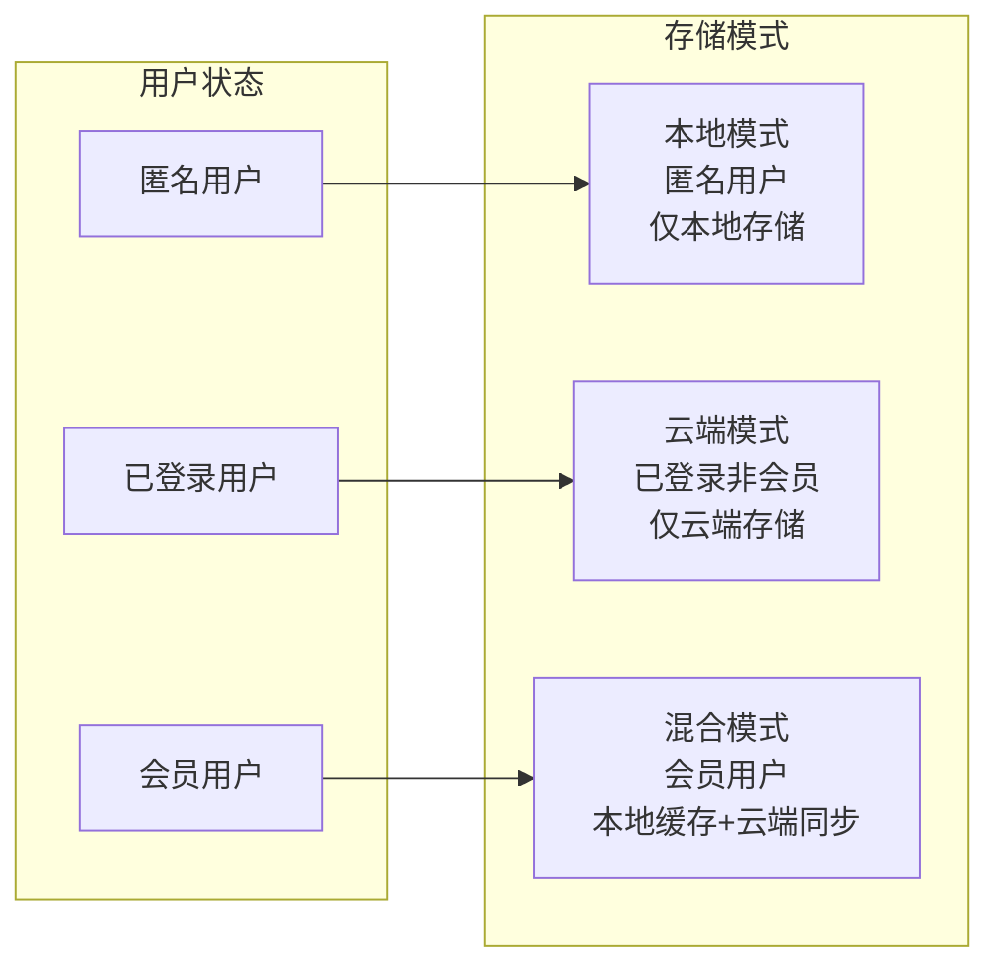
```mermaid
graph LR
subgraph "存储模式"
LOCAL["本地模式<br/>匿名用户<br/>仅本地存储"]
CLOUD["云端模式<br/>已登录非会员<br/>仅云端存储"]
HYBRID["混合模式<br/>会员用户<br/>本地缓存+云端同步"]
end
subgraph "用户状态"
ANON["匿名用户"]
AUTH["已登录用户"]
MEMBER["会员用户"]
end
ANON --> LOCAL
AUTH --> CLOUD
MEMBER --> HYBRID
```

**图示来源**
- [packages/electron-adapter/src/storage/storage-adapter.ts](file://packages/electron-adapter/src/storage/storage-adapter.ts#L1-L519)

### PluginCacheService：插件缓存管理
PluginCacheService专门负责插件的本地缓存和版本管理：

- **缓存策略**：插件JS文件的本地缓存，支持版本控制
- **下载管理**：支持插件文件的下载和进度跟踪
- **完整性校验**：通过SHA-256哈希验证缓存文件的完整性
- **缓存清理**：提供缓存清理和大小统计功能

**章节来源**
- [packages/electron-adapter/src/index.ts](file://packages/electron-adapter/src/index.ts#L1-L26)
- [packages/electron-adapter/src/config.ts](file://packages/electron-adapter/src/config.ts#L1-L24)
- [packages/electron-adapter/src/http/client.ts](file://packages/electron-adapter/src/http/client.ts#L1-L227)
- [packages/electron-adapter/src/database/manager.ts](file://packages/electron-adapter/src/database/manager.ts#L1-L369)
- [packages/electron-adapter/src/storage/storage-adapter.ts](file://packages/electron-adapter/src/storage/storage-adapter.ts#L1-L519)
- [packages/electron-adapter/src/auth/auth-manager.ts](file://packages/electron-adapter/src/auth/auth-manager.ts#L1-L319)
- [packages/electron-adapter/src/types/index.ts](file://packages/electron-adapter/src/types/index.ts#L1-L309)
- [packages/electron-adapter/src/plugin/plugin-cache-service.ts](file://packages/electron-adapter/src/plugin/plugin-cache-service.ts#L1-L148)

## 桌面应用支持

### 桌面应用架构
桌面应用基于Electron构建，采用现代前端技术栈：

- **主进程**：使用TypeScript编写，负责应用生命周期管理、窗口创建、IPC通信
- **渲染进程**：基于React + Vite，提供现代化的用户界面
- **自定义协议**：注册app://协议支持SPA路由
- **打包配置**：使用electron-vite和electron-builder进行构建和打包

### 应用启动流程
桌面应用的启动流程包含多个关键阶段：

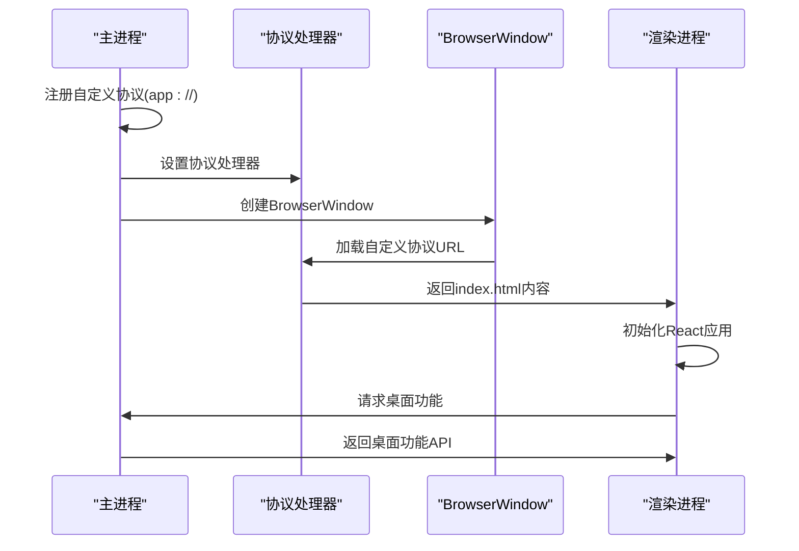
```mermaid
sequenceDiagram
participant Main as "主进程"
participant Protocol as "协议处理器"
participant Window as "BrowserWindow"
participant Renderer as "渲染进程"
Main->>Main : 注册自定义协议(app : //)
Main->>Protocol : 设置协议处理器
Main->>Window : 创建BrowserWindow
Window->>Protocol : 加载自定义协议URL
Protocol->>Renderer : 返回index.html内容
Renderer->>Renderer : 初始化React应用
Renderer->>Main : 请求桌面功能
Main->>Renderer : 返回桌面功能API
```

**图示来源**
- [apps/desktop/src/main/index.ts](file://apps/desktop/src/main/index.ts#L1-L95)

### 自定义协议处理
桌面应用注册了app://自定义协议，支持SPA路由：

- **协议注册**：在应用启动前注册自定义协议
- **路由处理**：对于无扩展名的路径，自动返回index.html
- **静态资源**：通过net.fetch提供静态文件服务
- **开发模式**：支持开发环境的热重载

### 插件生态集成
桌面应用集成了丰富的插件生态：

- **UI组件**：@kn/ui基础组件库
- **核心插件**：@kn/plugin-main、@kn/plugin-ai等
- **编辑器插件**：@kn/plugin-excalidraw、@kn/plugin-drawnix等
- **数据库插件**：@kn/plugin-database、@kn/plugin-bitable等
- **文件管理**：@kn/file-manager插件

**章节来源**
- [apps/desktop/src/main/index.ts](file://apps/desktop/src/main/index.ts#L1-L95)
- [apps/desktop/package.json](file://apps/desktop/package.json#L1-L98)
- [apps/desktop/electron.vite.config.ts](file://apps/desktop/electron.vite.config.ts#L1-L30)

## 依赖分析
- 模块耦合
  - App 依赖 PluginManager 与全局状态；PluginManager 依赖 import-util 与事件总线。
  - 编辑器内核依赖扩展包装器类型与 Provider 导出，形成对协作协议的弱耦合接入点。
  - UI 组件库被多处使用，形成通用依赖。
  - **文件服务通过AppContext和PluginManager提供服务访问，形成对插件的弱耦合依赖**。
  - **国际化模块通过 App 组件进行集中管理，插件国际化资源通过插件管理器聚合**。
  - **electron-adapter作为桌面应用专用模块，与核心模块解耦，通过接口提供功能**。
- 外部依赖
  - React Router、Redux、Tiptap、@hocuspocus/provider、styled-components、recharts、i18next、browser-fs-access、electron、better-sqlite3、axios等。
- 循环依赖
  - 当前结构未见明显循环依赖；事件总线与 AppContext 作为横切关注点，避免深层耦合。

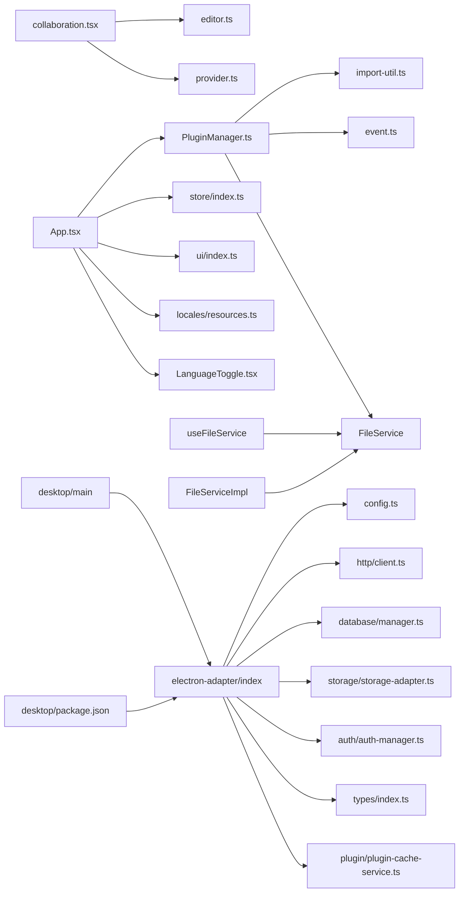
```mermaid
graph LR
APP["App.tsx"] --> PM["PluginManager.ts"]
APP --> GS["store/index.ts"]
PM --> IMP["import-util.ts"]
PM --> EVT["event.ts"]
PM --> FS["FileService"]
COL["collaboration.tsx"] --> ETYPE["editor.ts"]
COL --> PRV["provider.ts"]
APP --> UI["ui/index.ts"]
APP --> RES["locales/resources.ts"]
APP --> LT["LanguageToggle.tsx"]
UFS["useFileService"] --> FS
FSI["FileServiceImpl"] --> FS
EIDX["electron-adapter/index"] --> ECFG["config.ts"]
EIDX --> EHTTP["http/client.ts"]
EIDX --> EDB["database/manager.ts"]
EIDX --> ESTORE["storage/storage-adapter.ts"]
EIDX --> EAUTH["auth/auth-manager.ts"]
EIDX --> ETYPES["types/index.ts"]
EIDX --> EPLUGIN["plugin/plugin-cache-service.ts"]
DMN["desktop/main"] --> EIDX
DPKG["desktop/package.json"] --> EIDX
```

**图示来源**
- [packages/core/src/App.tsx](file://packages/core/src/App.tsx#L1-L159)
- [packages/common/src/core/PluginManager.ts](file://packages/common/src/core/PluginManager.ts#L1-L170)
- [packages/common/src/utils/import-util.ts](file://packages/common/src/utils/import-util.ts#L1-L23)
- [packages/common/src/event/event.ts](file://packages/common/src/event/event.ts#L1-L44)
- [packages/editor/src/editor/collaboration.tsx](file://packages/editor/src/editor/collaboration.tsx#L1-L142)
- [packages/common/src/core/editor.ts](file://packages/common/src/core/editor.ts#L1-L31)
- [packages/editor/src/editor/provider.ts](file://packages/editor/src/editor/provider.ts#L1-L53)
- [packages/ui/src/index.ts](file://packages/ui/src/index.ts#L1-L18)
- [packages/core/src/locales/resources.ts](file://packages/core/src/locales/resources.ts#L1-L630)
- [packages/core/src/locales/LanguageToggle.tsx](file://packages/core/src/locales/LanguageToggle.tsx#L1-L44)
- [packages/core/src/services/file-service.ts](file://packages/core/src/services/file-service.ts#L1-L35)
- [packages/plugin-file-manager/src/services/FileServiceImpl.ts](file://packages/plugin-file-manager/src/services/FileServiceImpl.ts#L1-L149)
- [packages/electron-adapter/src/index.ts](file://packages/electron-adapter/src/index.ts#L1-L26)
- [apps/desktop/src/main/index.ts](file://apps/desktop/src/main/index.ts#L1-L95)
- [apps/desktop/package.json](file://apps/desktop/package.json#L1-L98)

**章节来源**
- [packages/core/src/App.tsx](file://packages/core/src/App.tsx#L1-L159)
- [packages/common/src/core/PluginManager.ts](file://packages/common/src/core/PluginManager.ts#L1-L170)
- [packages/core/src/services/file-service.ts](file://packages/core/src/services/file-service.ts#L1-L35)
- [packages/electron-adapter/src/index.ts](file://packages/electron-adapter/src/index.ts#L1-L26)

## 性能考虑
- 插件动态加载
  - 利用脚本加载缓存，避免重复下载；按需加载远程插件，减少首屏体积。
- 路由与国际化
  - 仅在插件变更或初始化时重建路由树；国际化资源合并后一次性初始化。
  - **插件国际化资源通过增量合并机制，避免重复加载相同资源**。
- 编辑器渲染
  - 使用立即渲染与事务控制，减少不必要的重渲染；对未知内容进行安全回退。
- 全局状态
  - Redux 状态粒度合理，避免过度拆分导致的频繁订阅与重渲染。
- **文件服务性能**
  - 文件上传使用浏览器原生文件选择器，避免额外的DOM操作。
  - 文件下载通过浏览器新窗口打开，不阻塞当前页面。
  - 文件服务实例采用单例模式，避免重复创建。
- **electron-adapter性能优化**
  - DatabaseManager使用WAL模式提高并发性能
  - HttpClient实现请求队列避免重复认证
  - StorageAdapter智能缓存策略减少网络请求
  - PluginCacheService提供插件文件的本地缓存
- **国际化性能优化**
  - 翻译资源按需加载，避免一次性加载所有插件翻译。
  - 语言切换时仅更新必要的组件，使用 React.memo 优化渲染。
  - 支持语言检测器，减少手动配置开销。

## 故障排查指南
- 插件加载失败
  - 现象：插件未生效或报错。
  - 排查：确认资源路径与缓存参数；检查 importScript 是否抛出错误；查看事件是否正确触发刷新。
- 路由不显示
  - 现象：插件路由未出现在导航中。
  - 排查：确认插件配置中的路由字段；检查 App 中路由解析逻辑；验证 RouterProvider 是否渲染。
- **国际化缺失**
  - 现象：界面语言未切换或缺少翻译。
  - 排查：确认插件语言包合并顺序；检查 i18n 初始化参数与检测器配置；验证资源包是否正确添加。
- 协作连接问题
  - 现象：协作不可用或断连。
  - 排查：确认 Provider 注入与销毁时机；检查 Yjs/Hocuspocus 服务端连通性；观察编辑器卸载时的断连逻辑。
- **文件服务访问失败**
  - 现象：useFileService抛出错误或返回undefined。
  - 排查：确认plugin-file-manager插件已安装并加载；检查FileService是否正确注册到pluginServices；验证AppContext中的pluginManager状态。
- **use-upload-file废弃警告**
  - 现象：控制台出现废弃警告。
  - 排查：按照迁移指南使用useFileService钩子替代useUploadFile；检查组件中文件上传逻辑的实现。
- **插件国际化不生效**
  - 现象：插件特定界面未显示翻译。
  - 排查：确认插件国际化文件正确导出；检查插件管理器是否正确聚合翻译；验证翻译键值是否匹配。
- **electron-adapter数据库问题**
  - 现象：本地数据无法保存或丢失。
  - 排查：检查DatabaseManager初始化是否成功；验证数据库文件路径；确认SQLite权限设置。
- **electron-adapter认证失败**
  - 现象：登录后无法访问云端数据。
  - 排查：确认AuthManager初始化完成；检查token是否正确设置；验证API服务器连通性。
- **electron-adapter存储模式异常**
  - 现象：数据不同步或缓存异常。
  - 排查：确认StorageAdapter模式判断逻辑；检查网络连接状态；验证缓存目录权限。

**章节来源**
- [packages/common/src/utils/import-util.ts](file://packages/common/src/utils/import-util.ts#L1-L23)
- [packages/common/src/event/event.ts](file://packages/common/src/event/event.ts#L1-L44)
- [packages/core/src/App.tsx](file://packages/core/src/App.tsx#L1-L159)
- [packages/editor/src/editor/collaboration.tsx](file://packages/editor/src/editor/collaboration.tsx#L1-L142)
- [packages/core/src/services/file-service.ts](file://packages/core/src/services/file-service.ts#L16-L21)
- [packages/core/src/hooks/use-upload-file.ts](file://packages/core/src/hooks/use-upload-file.ts#L20-L23)
- [packages/electron-adapter/src/database/manager.ts](file://packages/electron-adapter/src/database/manager.ts#L1-L369)
- [packages/electron-adapter/src/auth/auth-manager.ts](file://packages/electron-adapter/src/auth/auth-manager.ts#L1-L319)
- [packages/electron-adapter/src/storage/storage-adapter.ts](file://packages/electron-adapter/src/storage/storage-adapter.ts#L1-L519)

## 结论
该核心模块以"插件即服务"的思想构建，通过插件管理器实现动态扩展与路由聚合；应用主组件承担路由装配、国际化与全局状态的中枢角色；编辑器内核提供扩展系统与协作协议接入点；UI 组件库保障一致的交互体验；**新增的electron-adapter架构为桌面应用提供了完整的本地存储、认证管理、插件缓存等专用功能，支持LOCAL/CLOUD/HYBRID三种存储模式，显著提升了桌面应用的离线能力和用户体验**；**新增的文件服务架构提供了统一的文件管理接口，通过FileService接口和useFileService钩子实现了标准化的文件操作能力**；**新增的国际化支持大幅扩展了系统的本地化能力，包含630个翻译条目，支持中英文双语切换，为全球化部署奠定了坚实基础**。模块间通过事件总线与上下文解耦，具备良好的可维护性与扩展性。

## 附录
- 最佳实践
  - 插件开发遵循统一配置模型，提供路由、菜单、国际化与扩展包装器。
  - 动态加载插件时添加错误边界与降级策略，提升稳定性。
  - 编辑器扩展尽量模块化，避免大而全的单体扩展。
  - **文件操作统一通过FileService接口进行，避免直接调用API**。
  - **use-upload-file钩子已废弃，新开发请使用useFileService钩子**。
  - **国际化资源按插件维度独立维护，避免命名冲突，确保翻译的一致性**。
  - **插件国际化应遵循核心资源的键值结构，确保翻译完整性**。
  - **新增插件时提供完整的中英文翻译，遵循现有的命名空间和键值规范**。
  - **electron-adapter模块应通过接口而非直接依赖，保持模块间的松耦合**。
  - **桌面应用开发应充分利用electron-adapter的离线能力，优化用户体验**。
- 参考路径
  - 插件配置与包装器：[packages/common/src/core/PluginManager.ts](file://packages/common/src/core/PluginManager.ts#L1-L170)、[packages/common/src/core/editor.ts](file://packages/common/src/core/editor.ts#L1-L31)
  - 动态加载工具：[packages/common/src/utils/import-util.ts](file://packages/common/src/utils/import-util.ts#L1-L23)
  - 应用路由与状态：[packages/core/src/App.tsx](file://packages/core/src/App.tsx#L1-L159)、[packages/core/src/store/index.ts](file://packages/core/src/store/index.ts#L1-L71)
  - 编辑器协作与扩展：[packages/editor/src/editor/collaboration.tsx](file://packages/editor/src/editor/collaboration.tsx#L1-L142)、[packages/editor/src/index.ts](file://packages/editor/src/index.ts#L1-L23)
  - UI 组件库导出：[packages/ui/src/index.ts](file://packages/ui/src/index.ts#L1-L18)
  - **文件服务接口与实现**：[packages/common/src/core/types.ts](file://packages/common/src/core/types.ts#L32-L54)、[packages/core/src/services/file-service.ts](file://packages/core/src/services/file-service.ts#L1-L35)、[packages/plugin-file-manager/src/services/FileServiceImpl.ts](file://packages/plugin-file-manager/src/services/FileServiceImpl.ts#L1-L149)
  - **废弃的文件上传钩子**：[packages/core/src/hooks/use-upload-file.ts](file://packages/core/src/hooks/use-upload-file.ts#L1-L82)
  - **国际化资源与语言切换**：[packages/core/src/locales/resources.ts](file://packages/core/src/locales/resources.ts#L1-L630)、[packages/core/src/locales/LanguageToggle.tsx](file://packages/core/src/locales/LanguageToggle.tsx#L1-L44)
  - **插件国际化实现**：[packages/plugin-block-reference/src/i18n/index.ts](file://packages/plugin-block-reference/src/i18n/index.ts#L1-L121)
  - **electron-adapter核心组件**：[packages/electron-adapter/src/index.ts](file://packages/electron-adapter/src/index.ts#L1-L26)、[packages/electron-adapter/src/auth/auth-manager.ts](file://packages/electron-adapter/src/auth/auth-manager.ts#L1-L319)、[packages/electron-adapter/src/storage/storage-adapter.ts](file://packages/electron-adapter/src/storage/storage-adapter.ts#L1-L519)
  - **桌面应用架构**：[apps/desktop/src/main/index.ts](file://apps/desktop/src/main/index.ts#L1-L95)、[apps/desktop/package.json](file://apps/desktop/package.json#L1-L98)、[apps/desktop/electron.vite.config.ts](file://apps/desktop/electron.vite.config.ts#L1-L30)