# 桌面应用框架

<cite>
**本文档引用的文件**
- [apps/desktop/package.json](file://apps/desktop/package.json)
- [apps/desktop/src/main/index.ts](file://apps/desktop/src/main/index.ts)
- [apps/desktop/src/preload/index.ts](file://apps/desktop/src/preload/index.ts)
- [apps/desktop/src/renderer/index.ts](file://apps/desktop/src/renderer/index.ts)
- [apps/desktop/src/main/services.ts](file://apps/desktop/src/main/services.ts)
- [apps/desktop/src/main/ipc.ts](file://apps/desktop/src/main/ipc.ts)
- [apps/desktop/src/shared/types.ts](file://apps/desktop/src/shared/types.ts)
- [apps/desktop/src/renderer/src/main.tsx](file://apps/desktop/src/renderer/src/main.tsx)
- [packages/electron-adapter/src/index.ts](file://packages/electron-adapter/src/index.ts)
- [packages/electron-adapter/src/config.ts](file://packages/electron-adapter/src/config.ts)
- [packages/electron-adapter/src/http/client.ts](file://packages/electron-adapter/src/http/client.ts)
- [packages/electron-adapter/src/database/manager.ts](file://packages/electron-adapter/src/database/manager.ts)
- [packages/electron-adapter/src/storage/storage-adapter.ts](file://packages/electron-adapter/src/storage/storage-adapter.ts)
- [packages/electron-adapter/src/auth/auth-manager.ts](file://packages/electron-adapter/src/auth/auth-manager.ts)
- [packages/electron-adapter/src/plugin/plugin-cache-service.ts](file://packages/electron-adapter/src/plugin/plugin-cache-service.ts)
- [packages/plugin-file-manager/src/services/FileServiceImpl.ts](file://packages/plugin-file-manager/src/services/FileServiceImpl.ts)
- [apps/desktop/vite.config.ts](file://apps/desktop/vite.config.ts)
- [apps/desktop/tailwind.config.js](file://apps/desktop/tailwind.config.js)
- [apps/desktop/postcss.config.cjs](file://apps/desktop/postcss.config.cjs)
- [apps/desktop/tsconfig.json](file://apps/desktop/tsconfig.json)
- [apps/desktop/tsconfig.node.json](file://apps/desktop/tsconfig.node.json)
- [packages/ui/tailwind.config.js](file://packages/ui/tailwind.config.js)
- [packages/ui/postcss.config.js](file://packages/ui/postcss.config.js)
- [packages/ui/globals.css](file://packages/ui/globals.css)
- [packages/common/src/index.ts](file://packages/common/src/index.ts)
- [packages/core/src/index.ts](file://packages/core/src/index.ts)
- [packages/core/src/App.tsx](file://packages/core/src/App.tsx)
- [packages/common/src/core/PluginManager.ts](file://packages/common/src/core/PluginManager.ts)
- [packages/core/src/Layout.tsx](file://packages/core/src/Layout.tsx)
- [packages/core/src/store/GlobalState.ts](file://packages/core/src/store/GlobalState.ts)
- [packages/common/src/entity/Page.ts](file://packages/common/src/entity/Page.ts)
- [package.json](file://package.json)
- [turbo.json](file://turbo.json)
</cite>

## 更新摘要
**所做更改**
- 新增超过500行的完整IPC处理器系统，涵盖认证、空间、页面、插件、文件、数据库等所有核心功能
- 引入桌面特定功能，包括系统对话框、文件系统操作、应用信息获取等
- 实现完整的错误边界处理机制，提供健壮的应用容错能力
- 集成文件系统操作API，支持本地文件读写、目录管理、文件复制移动等
- 从基础桌面框架升级为完整的跨平台桌面解决方案

## 目录
1. [简介](#简介)
2. [项目结构](#项目结构)
3. [核心组件](#核心组件)
4. [架构概览](#架构概览)
5. [详细组件分析](#详细组件分析)
6. [构建与部署](#构建与部署)
7. [依赖关系分析](#依赖关系分析)
8. [性能考虑](#性能考虑)
9. [故障排除指南](#故障排除指南)
10. [结论](#结论)

## 简介

这是一个基于 Electron 33.2.1 的现代化桌面应用框架，完全重构自传统的 Web 架构。该框架采用全新的集中式服务管理架构，通过 Electron 适配器包提供统一的服务抽象层，实现了完整的知识管理功能。

**重大更新** 框架现已完全迁移到 Electron 架构，提供原生桌面应用体验，包括：
- 基于 Better-SQLite3 的高性能本地数据库
- 基于 Axios 的智能 HTTP 客户端和令牌管理
- 智能插件缓存和版本控制系统
- 多存储模式支持（本地、云端、混合）
- 完整的认证和授权体系
- 原生 IPC 通信机制
- **新增** 超过500行的完整IPC处理器系统
- **新增** 桌面特定功能和系统集成
- **新增** 健壮的错误边界处理机制
- **新增** 文件系统操作和本地文件管理

## 项目结构

该桌面应用框架采用 Monorepo 结构，主要包含以下核心目录：

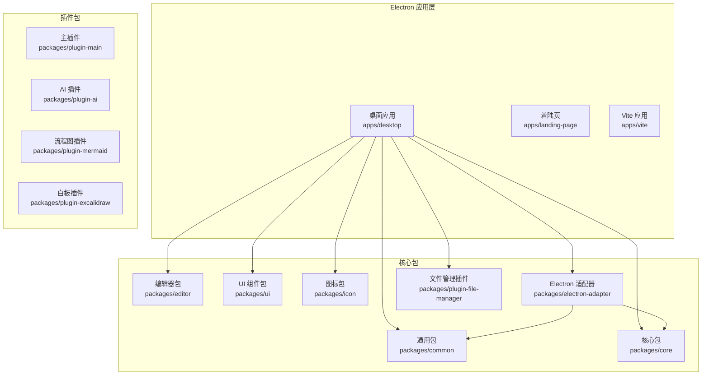

**图表来源**
- [apps/desktop/package.json](file://apps/desktop/package.json#L1-L100)
- [package.json](file://package.json#L1-L120)

**章节来源**
- [apps/desktop/package.json](file://apps/desktop/package.json#L1-L100)
- [package.json](file://package.json#L1-L120)

## 核心组件

### 服务管理架构

**新增** 桌面应用引入了全新的集中式服务管理架构，所有服务通过统一的服务工厂进行初始化和管理。

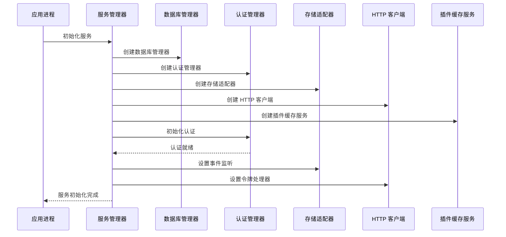

**图表来源**
- [apps/desktop/src/main/services.ts](file://apps/desktop/src/main/services.ts#L44-L133)

### 预加载脚本与安全桥接

预加载脚本通过 `contextBridge` API 在渲染进程和主进程之间建立安全通信通道，提供受限的 API 接口。

**章节来源**
- [apps/desktop/src/preload/index.ts](file://apps/desktop/src/preload/index.ts#L1-L29)
- [apps/desktop/src/main/index.ts](file://apps/desktop/src/main/index.ts#L1-L115)

### 工作空间包检测系统

桌面应用引入了智能的工作空间包检测系统，自动扫描和配置 Monorepo 中的包别名。

**章节来源**
- [apps/desktop/vite.config.ts](file://apps/desktop/vite.config.ts#L1-L103)

### IPC 处理器系统

**新增** 桌面应用引入了完整的IPC处理器系统，涵盖所有核心功能模块：

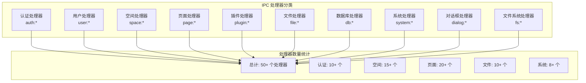

**图表来源**
- [apps/desktop/src/main/ipc.ts](file://apps/desktop/src/main/ipc.ts#L18-L786)

**章节来源**
- [apps/desktop/src/main/ipc.ts](file://apps/desktop/src/main/ipc.ts#L1-L786)

### 错误边界处理

**新增** 桌面应用实现了完整的错误边界处理机制，提供健壮的应用容错能力：

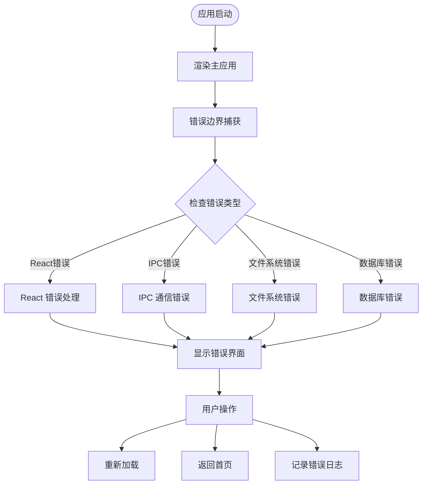

**图表来源**
- [apps/desktop/src/renderer/src/main.tsx](file://apps/desktop/src/renderer/src/main.tsx#L15-L66)

**章节来源**
- [apps/desktop/src/renderer/src/main.tsx](file://apps/desktop/src/renderer/src/main.tsx#L1-L73)

## 架构概览

**重大更新** 框架采用全新的集中式服务管理架构，所有核心功能通过 Electron 适配器包统一管理，并集成了完整的桌面特定功能：

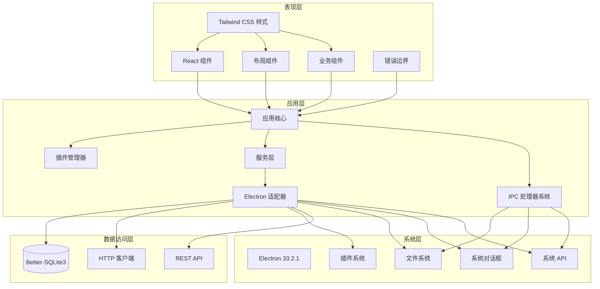

**图表来源**
- [packages/core/src/App.tsx](file://packages/core/src/App.tsx#L56-L162)
- [packages/common/src/core/PluginManager.ts](file://packages/common/src/core/PluginManager.ts#L99-L490)
- [apps/desktop/src/main/services.ts](file://apps/desktop/src/main/services.ts#L1-L197)
- [apps/desktop/src/main/ipc.ts](file://apps/desktop/src/main/ipc.ts#L1-L786)

## 详细组件分析

### Electron 适配器架构

**新增** Electron 适配器包提供了统一的服务抽象层，封装了所有底层实现细节。

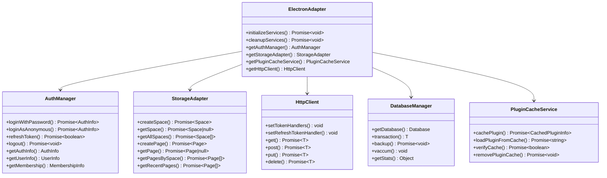

**图表来源**
- [packages/electron-adapter/src/index.ts](file://packages/electron-adapter/src/index.ts#L1-L26)
- [packages/electron-adapter/src/auth/auth-manager.ts](file://packages/electron-adapter/src/auth/auth-manager.ts#L23-L319)
- [packages/electron-adapter/src/storage/storage-adapter.ts](file://packages/electron-adapter/src/storage/storage-adapter.ts#L23-L519)
- [packages/electron-adapter/src/http/client.ts](file://packages/electron-adapter/src/http/client.ts#L11-L227)
- [packages/electron-adapter/src/database/manager.ts](file://packages/electron-adapter/src/database/manager.ts#L6-L369)
- [packages/electron-adapter/src/plugin/plugin-cache-service.ts](file://packages/electron-adapter/src/plugin/plugin-cache-service.ts#L15-L148)

#### 服务生命周期管理

服务的生命周期包括初始化、运行时管理和清理阶段：

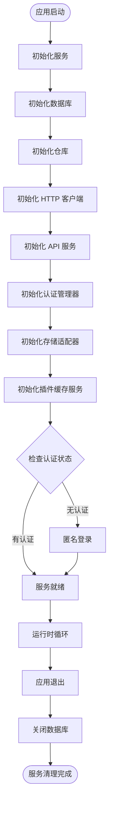

**图表来源**
- [apps/desktop/src/main/services.ts](file://apps/desktop/src/main/services.ts#L44-L146)

**章节来源**
- [apps/desktop/src/main/services.ts](file://apps/desktop/src/main/services.ts#L1-L197)

### 数据库架构

**更新** 数据库系统采用 Better-SQLite3 提供高性能的本地存储，支持完整的 CRUD 操作和事务管理。

```mermaid
erDiagram
AUTH_INFO {
INTEGER id PK
TEXT access_token
TEXT refresh_token
TEXT token_type
INTEGER expires_in
INTEGER user_id
TEXT tenant_id
TEXT account
TEXT user_name
TEXT avatar
TEXT user_role
INTEGER created_at
INTEGER updated_at
}
USER_INFO {
INTEGER id PK
INTEGER account
TEXT name
TEXT real_name
TEXT avatar
TEXT email
TEXT phone
TEXT role_id
TEXT role_name
INTEGER dept_id
INTEGER post_id
TEXT tenant_id
INTEGER created_at
INTEGER updated_at
}
MEMBERSHIP_INFO {
INTEGER id PK
TEXT level
INTEGER expire_time
INTEGER max_devices
TEXT features
INTEGER created_at
INTEGER updated_at
}
SPACES {
INTEGER id PK
TEXT name
TEXT description
TEXT icon
INTEGER is_public
INTEGER is_template
INTEGER creator_id
INTEGER local_only
TEXT sync_status
INTEGER created_at
INTEGER updated_at
INTEGER deleted_at
}
PAGES {
INTEGER id PK
INTEGER space_id FK
INTEGER title
TEXT content
INTEGER parent_id
TEXT icon
TEXT cover
INTEGER is_deleted
INTEGER creator_id
INTEGER local_only
TEXT sync_status
INTEGER created_at
INTEGER updated_at
INTEGER deleted_at
}
PAGE_BLOCKS {
TEXT id PK
INTEGER page_id FK
TEXT type
TEXT content
TEXT properties
TEXT parent_id
INTEGER block_order
INTEGER created_at
INTEGER updated_at
}
PLUGINS {
TEXT id PK
TEXT name
TEXT version
TEXT category
INTEGER is_premium
INTEGER installed_at
INTEGER cloud_id
TEXT file_path
INTEGER enabled
UNIQUE(cloud_id, version)
}
PLUGIN_CACHE {
INTEGER id PK
TEXT plugin_id
TEXT version
TEXT file_hash
INTEGER file_size
TEXT file_path
TEXT download_url
INTEGER cached_at
INTEGER last_verified
UNIQUE(plugin_id, version)
}
FILES {
INTEGER id PK
TEXT name
TEXT type
INTEGER parent_id
TEXT repo_key
TEXT path
INTEGER size
TEXT mime_type
INTEGER creator_id
INTEGER local_only
TEXT sync_status
INTEGER created_at
INTEGER updated_at
INTEGER deleted_at
}
SYNC_QUEUE {
INTEGER id PK
TEXT entity_type
INTEGER entity_id
TEXT action
TEXT data
INTEGER created_at
INTEGER synced_at
}
SYNC_CONFLICTS {
INTEGER id PK
TEXT entity_type
INTEGER entity_id
TEXT local_data
TEXT remote_data
INTEGER local_timestamp
INTEGER remote_timestamp
INTEGER resolved
INTEGER created_at
}
SETTINGS {
TEXT key PK
TEXT value
INTEGER updated_at
}
FAVORITES {
INTEGER id PK
TEXT entity_type
INTEGER entity_id
INTEGER created_at
UNIQUE(entity_type, entity_id)
}
RECENT_ACCESS {
INTEGER id PK
TEXT entity_type
INTEGER entity_id
INTEGER accessed_at
}
AUTH_INFO ||--o{ USER_INFO : "关联"
AUTH_INFO ||--o{ MEMBERSHIP_INFO : "关联"
AUTH_INFO ||--o{ SPACES : "创建"
SPACES ||--o{ PAGES : "包含"
PAGES ||--o{ PAGE_BLOCKS : "包含"
AUTH_INFO ||--o{ FILES : "创建"
SPACES ||--o{ FILES : "包含"
AUTH_INFO ||--o{ FAVORITES : "收藏"
PAGES ||--o{ FAVORITES : "被收藏"
SPACES ||--o{ FAVORITES : "被收藏"
```

**图表来源**
- [packages/electron-adapter/src/database/manager.ts](file://packages/electron-adapter/src/database/manager.ts#L39-L277)

**章节来源**
- [packages/electron-adapter/src/database/manager.ts](file://packages/electron-adapter/src/database/manager.ts#L1-L369)

### 用户认证系统

**更新** 认证系统采用 Electron 适配器提供的统一认证管理器，支持多种认证方式和设备绑定。

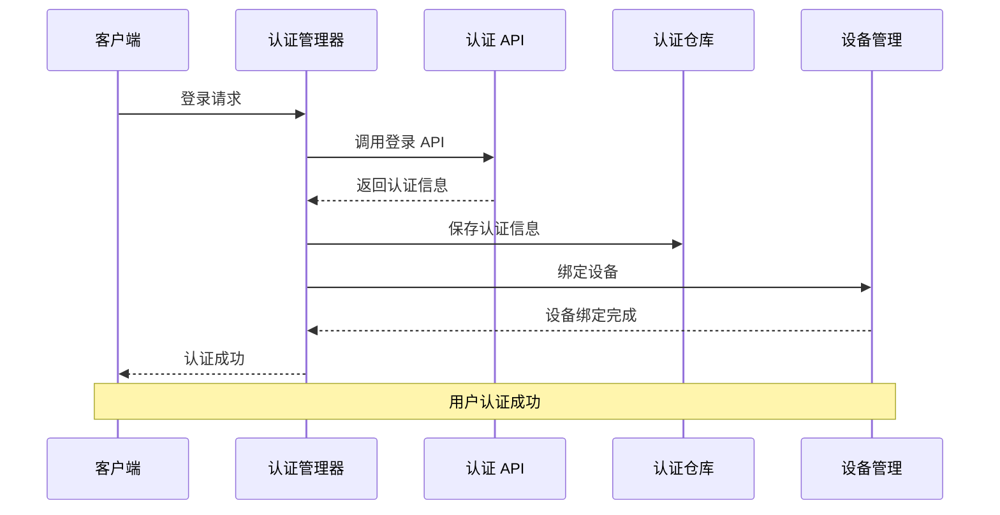

**图表来源**
- [packages/electron-adapter/src/auth/auth-manager.ts](file://packages/electron-adapter/src/auth/auth-manager.ts#L70-L96)
- [packages/electron-adapter/src/http/auth-api.ts](file://packages/electron-adapter/src/http/auth-api.ts#L24-L43)

**章节来源**
- [packages/electron-adapter/src/auth/auth-manager.ts](file://packages/electron-adapter/src/auth/auth-manager.ts#L1-L319)
- [packages/electron-adapter/src/http/auth-api.ts](file://packages/electron-adapter/src/http/auth-api.ts#L1-L142)

### 存储适配器

**新增** 存储适配器提供了统一的数据访问接口，支持本地、云端和混合三种存储模式。

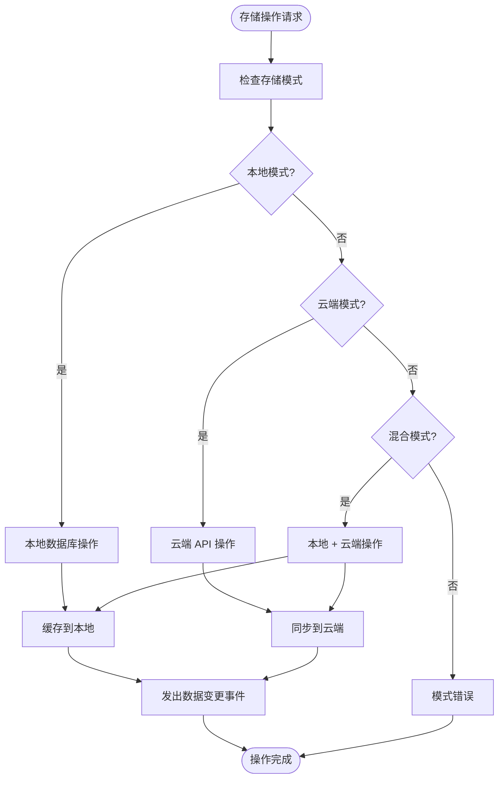

**图表来源**
- [packages/electron-adapter/src/storage/storage-adapter.ts](file://packages/electron-adapter/src/storage/storage-adapter.ts#L471-L481)

**章节来源**
- [packages/electron-adapter/src/storage/storage-adapter.ts](file://packages/electron-adapter/src/storage/storage-adapter.ts#L1-L519)

### HTTP 客户端

**更新** HTTP 客户端基于 Axios 构建，提供了完整的请求拦截、响应处理和自动令牌刷新功能。

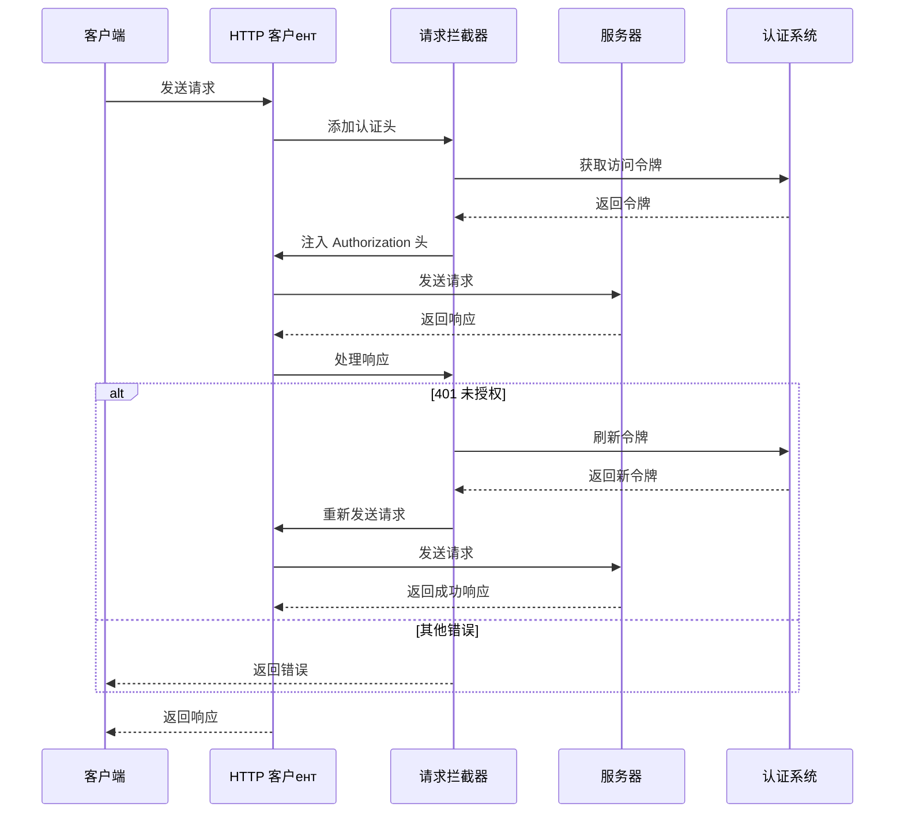

**图表来源**
- [packages/electron-adapter/src/http/client.ts](file://packages/electron-adapter/src/http/client.ts#L72-L135)

**章节来源**
- [packages/electron-adapter/src/http/client.ts](file://packages/electron-adapter/src/http/client.ts#L1-L227)

### 插件缓存服务

**新增** 插件缓存服务提供了智能的插件下载、缓存和版本管理功能。

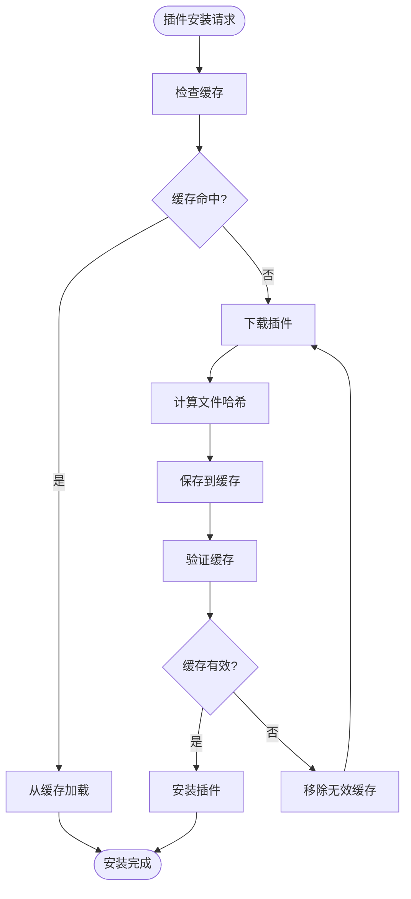

**图表来源**
- [packages/electron-adapter/src/plugin/plugin-cache-service.ts](file://packages/electron-adapter/src/plugin/plugin-cache-service.ts#L31-L92)

**章节来源**
- [packages/electron-adapter/src/plugin/plugin-cache-service.ts](file://packages/electron-adapter/src/plugin/plugin-cache-service.ts#L1-L148)

### 文件系统集成

**新增** 桌面应用集成了完整的文件系统操作能力，支持本地文件读写、目录管理、文件复制移动等：

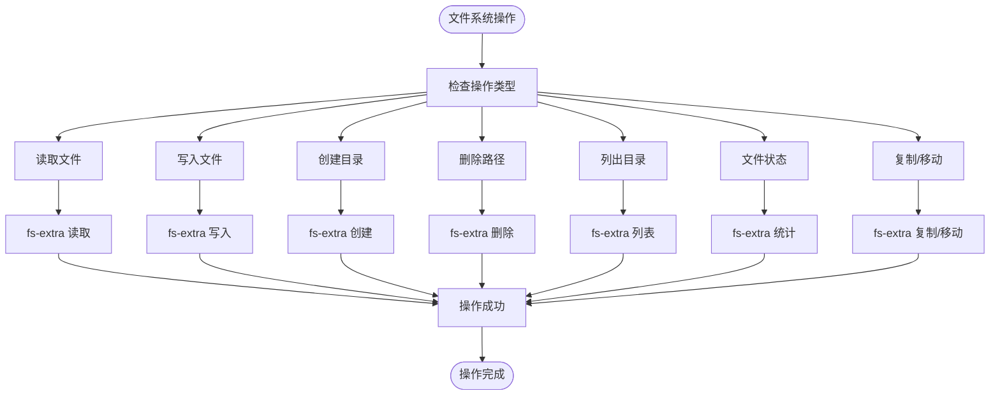

**图表来源**
- [apps/desktop/src/main/ipc.ts](file://apps/desktop/src/main/ipc.ts#L686-L782)

**章节来源**
- [apps/desktop/src/main/ipc.ts](file://apps/desktop/src/main/ipc.ts#L686-L782)

### 系统对话框集成

**新增** 桌面应用提供了完整的系统对话框集成，支持文件选择、文件保存、消息提示等功能：

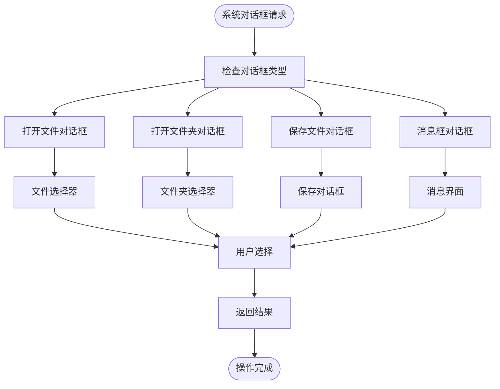

**图表来源**
- [apps/desktop/src/main/ipc.ts](file://apps/desktop/src/main/ipc.ts#L618-L684)

**章节来源**
- [apps/desktop/src/main/ipc.ts](file://apps/desktop/src/main/ipc.ts#L618-L684)

### 前端应用架构

前端应用采用 React + TypeScript 构建，通过插件系统实现功能扩展，并集成了完整的错误边界处理：

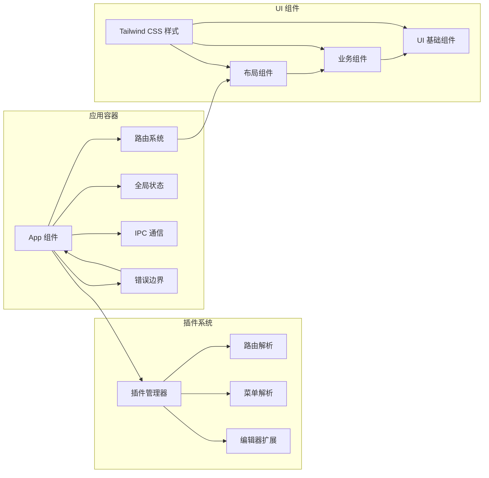

**图表来源**
- [packages/core/src/App.tsx](file://packages/core/src/App.tsx#L56-L162)
- [packages/core/src/Layout.tsx](file://packages/core/src/Layout.tsx#L80-L306)
- [apps/desktop/src/renderer/src/main.tsx](file://apps/desktop/src/renderer/src/main.tsx#L15-L66)

**章节来源**
- [packages/core/src/App.tsx](file://packages/core/src/App.tsx#L1-L162)
- [packages/core/src/Layout.tsx](file://packages/core/src/Layout.tsx#L1-L306)
- [apps/desktop/src/renderer/src/main.tsx](file://apps/desktop/src/renderer/src/main.tsx#L1-L73)

### 样式基础设施重构

桌面应用的样式基础设施经过全面重构，采用集中式的 Tailwind CSS 配置和主题系统。

**章节来源**
- [apps/desktop/tailwind.config.js](file://apps/desktop/tailwind.config.js#L1-L2)
- [apps/desktop/postcss.config.cjs](file://apps/desktop/postcss.config.cjs#L1-L7)
- [packages/ui/tailwind.config.js](file://packages/ui/tailwind.config.js#L1-L211)
- [packages/ui/postcss.config.js](file://packages/ui/postcss.config.js#L1-L8)
- [packages/ui/globals.css](file://packages/ui/globals.css#L1-L140)

### 文件管理插件

**新增** 文件管理插件提供了完整的文件系统操作能力，支持本地文件上传、下载、删除、重命名等操作：

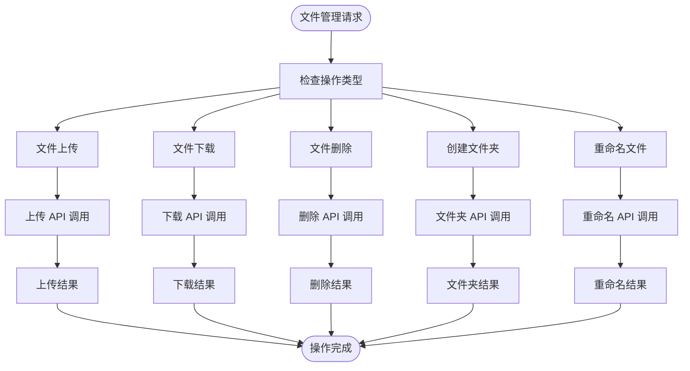

**图表来源**
- [packages/plugin-file-manager/src/services/FileServiceImpl.ts](file://packages/plugin-file-manager/src/services/FileServiceImpl.ts#L22-L153)

**章节来源**
- [packages/plugin-file-manager/src/services/FileServiceImpl.ts](file://packages/plugin-file-manager/src/services/FileServiceImpl.ts#L1-L175)

## 构建与部署

### 构建脚本标准化

**更新** 桌面应用的构建脚本已标准化为 `desktop:build` 命名约定，提供一致的构建体验。

桌面应用的构建流程包含四个关键步骤：

1. **TypeScript 编译**：编译 TypeScript 源码为 JavaScript
2. **Vite 构建**：构建前端资源和静态文件
3. **Electron Builder 打包**：生成跨平台桌面应用程序
4. **资源优化**：优化打包后的资源文件

```mermaid
flowchart TD
Start([执行 desktop:build]) --> TS["TypeScript 编译<br/>tsc"]
TS --> ViteBuild["Vite 构建<br/>vite build"]
ViteBuild --> ElectronBuilder["Electron Builder 打包<br/>electron-builder"]
ElectronBuilder --> Optimize["资源优化<br/>压缩和混淆"]
Optimize --> Output["输出发布文件<br/>release/"]
Output --> End([构建完成])
Style BuildScript["font-weight:bold;fill:#e1f5fe"]
TS --> Style BuildScript
ViteBuild --> Style BuildScript
ElectronBuilder --> Style BuildScript
Optimize --> Style BuildScript
```

**图表来源**
- [apps/desktop/package.json](file://apps/desktop/package.json#L8-L16)

### 多平台打包支持

桌面应用支持多种平台的打包和分发：

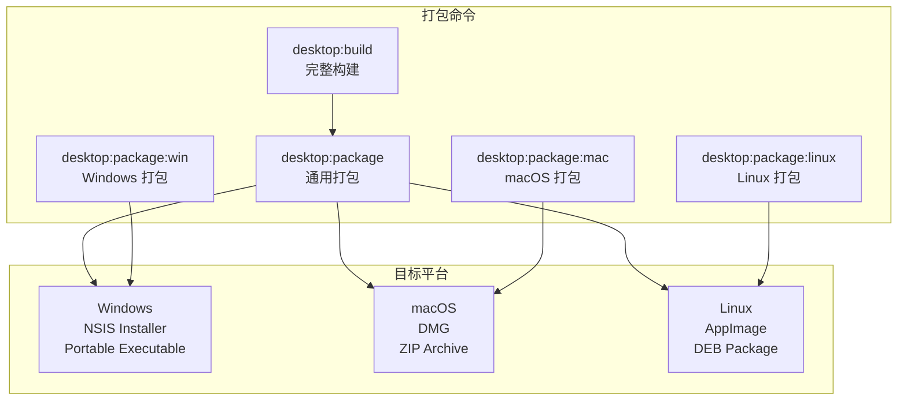

**图表来源**
- [apps/desktop/package.json](file://apps/desktop/package.json#L12-L16)
- [package.json](file://package.json#L45-L49)

### 工作空间构建流程

工作空间级别的构建流程现在通过 `desktop:build` 脚本统一管理：

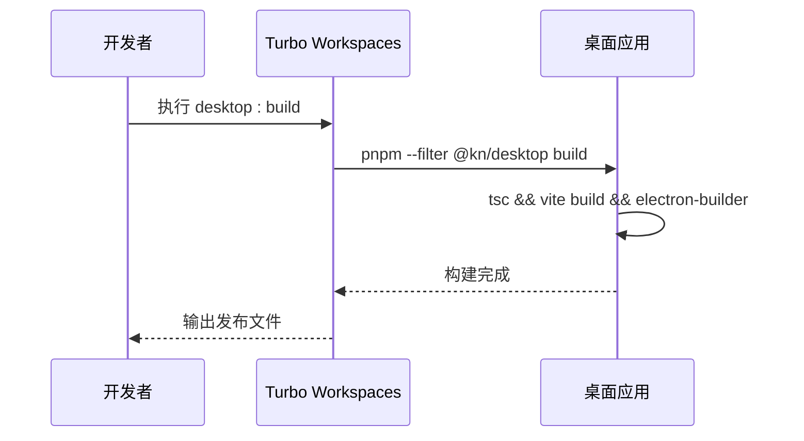

**图表来源**
- [package.json](file://package.json#L45)
- [apps/desktop/package.json](file://apps/desktop/package.json#L8)

**章节来源**
- [apps/desktop/package.json](file://apps/desktop/package.json#L1-L100)
- [package.json](file://package.json#L45-L49)

## 依赖关系分析

### 包依赖关系

**更新** Electron 适配器包成为桌面应用的核心依赖，提供统一的服务抽象：

```mermaid
graph TB
subgraph "桌面应用"
Desktop[@kn/desktop]
ElectronAdapter[@kn/electron-adapter]
FileManager[@kn/plugin-file-manager]
end
subgraph "核心依赖"
Core[@kn/core]
Common[@kn/common]
Editor[@kn/editor]
UI[@kn/ui]
Icon[@kn/icon]
end
subgraph "插件依赖"
PluginMain[@kn/plugin-main]
PluginAI[@kn/plugin-ai]
PluginMermaid[@kn/plugin-mermaid]
PluginExcalidraw[@kn/plugin-excalidraw]
end
Desktop --> ElectronAdapter
Desktop --> FileManager
Desktop --> Core
Desktop --> Common
Desktop --> Editor
Desktop --> UI
Desktop --> Icon
Desktop --> PluginMain
Desktop --> PluginAI
Desktop --> PluginMermaid
Desktop --> PluginExcalidraw
ElectronAdapter --> Common
ElectronAdapter --> Core
Core --> Common
Editor --> Common
UI --> Common
Icon --> Common
PluginMain --> Common
PluginAI --> Common
PluginMermaid --> Common
PluginExcalidraw --> Common
```

**图表来源**
- [apps/desktop/package.json](file://apps/desktop/package.json#L18-L38)
- [packages/core/src/index.ts](file://packages/core/src/index.ts#L1-L22)

### 开发工具链

**更新** 工具链已进行现代化升级，包含最新的 Electron 版本和构建工具。

| 工具 | 版本 | 用途 |
|------|------|------|
| Electron | ^33.2.1 | 桌面应用框架 |
| Electron Builder | ^25.1.8 | 跨平台打包工具 |
| Vite | ^5.4.8 | 构建工具和开发服务器 |
| React | ^18.3.1 | 用户界面库 |
| TypeScript | ^5.8.3 | 类型检查和编译 |
| TailwindCSS | ^3.4.17 | CSS 框架 |
| Better-SQLite3 | ^9.4.3 | 本地数据库 |
| Axios | ^1.7.7 | HTTP 客户端 |
| fs-extra | ^11.2.0 | 文件系统操作 |
| PostCSS | ^8.5.6 | CSS 后处理器 |
| Autoprefixer | ^10.4.21 | 自动前缀添加 |

**章节来源**
- [apps/desktop/package.json](file://apps/desktop/package.json#L39-L58)
- [apps/desktop/vite.config.ts](file://apps/desktop/vite.config.ts#L1-L78)

### 类型定义系统

**新增** Electron 适配器提供了完整的 TypeScript 类型定义，确保类型安全。

```mermaid
graph TB
subgraph "类型系统"
AuthTypes[认证类型]
StorageTypes[存储类型]
PluginTypes[插件类型]
FileTypes[文件类型]
SyncTypes[同步类型]
ConfigTypes[配置类型]
SystemTypes[系统类型]
ErrorTypes[错误类型]
end
subgraph "接口定义"
AuthInterface[AuthInfo, LoginCredentials]
StorageInterface[Space, Page, TreeNode]
PluginInterface[Plugin, PluginVersion, InstalledPlugin]
FileInterface[FileInfo, FileDTO]
SyncInterface[SyncStatus, SyncChange, SyncConflict]
ConfigInterface[ApiConfig, ElectronAdapterConfig]
SystemInterface[AppInfo, StorageInfo]
ErrorInterface[ErrorResponse, ErrorBoundaryState]
end
AuthTypes --> AuthInterface
StorageTypes --> StorageInterface
PluginTypes --> PluginInterface
FileTypes --> FileInterface
SyncTypes --> SyncInterface
ConfigTypes --> ConfigInterface
SystemTypes --> SystemInterface
ErrorTypes --> ErrorInterface
```

**图表来源**
- [packages/electron-adapter/src/types/index.ts](file://packages/electron-adapter/src/types/index.ts#L1-L309)
- [apps/desktop/src/shared/types.ts](file://apps/desktop/src/shared/types.ts#L1-L14)

**章节来源**
- [packages/electron-adapter/src/types/index.ts](file://packages/electron-adapter/src/types/index.ts#L1-L309)
- [apps/desktop/src/shared/types.ts](file://apps/desktop/src/shared/types.ts#L1-L14)

## 性能考虑

### 内存管理

应用采用渐进式插件加载策略，避免一次性加载所有插件导致内存压力：

- 插件按需加载，减少初始内存占用
- 使用缓存机制避免重复解析插件配置
- 及时清理未使用的插件实例
- 优化数据库连接池管理

### 数据库优化

- 合理的索引设计提升查询性能
- 事务批量操作减少磁盘 I/O
- 连接池管理避免频繁创建数据库连接
- WAL 模式提升并发性能

### HTTP 客户端优化

- 自动令牌刷新避免重复认证
- 请求队列处理 401 错误
- 进度回调支持大文件下载
- 连接超时和重试机制

### 前端性能

- React 组件懒加载减少首屏加载时间
- 插件路由延迟解析优化导航性能
- 图片和资源按需加载
- 事件委托减少内存占用

### 构建性能优化

**新增** 标准化构建脚本带来的性能提升：

- 统一的构建流程减少配置复杂性
- 并行构建任务提高构建速度
- 缓存机制减少重复构建时间
- 多平台打包支持优化分发效率

### 服务管理优化

**新增** 集中式服务管理带来的性能提升：

- 单例模式避免重复实例化
- 依赖注入减少循环依赖
- 异步初始化提升启动速度
- 事件驱动架构降低耦合度

### IPC 通信优化

**新增** 完整的IPC处理器系统带来的性能提升：

- 分类管理的处理器减少代码复杂度
- 统一的错误处理机制提升稳定性
- 异步操作避免阻塞主线程
- 缓存机制减少重复计算

### 文件系统操作优化

**新增** 文件系统集成带来的性能提升：

- fs-extra 提供高效的文件操作
- 批量操作减少系统调用次数
- 缓存机制避免重复文件读取
- 异步操作支持大文件处理

## 故障排除指南

### 常见问题诊断

**插件加载失败**
1. 检查插件 URL 是否正确
2. 验证插件配置格式
3. 查看控制台错误日志
4. 检查插件缓存是否损坏

**数据库连接问题**
1. 确认用户数据目录权限
2. 检查数据库文件完整性
3. 验证 Better-SQLite3 版本兼容性
4. 查看数据库锁状态

**HTTP 客户端异常**
1. 确认 API 地址配置正确
2. 检查网络连接状态
3. 验证令牌有效性
4. 查看请求拦截器日志

**IPC 通信异常**
1. 确认预加载脚本正确注入
2. 检查主进程和渲染进程版本匹配
3. 验证 IPC 处理器注册状态
4. 查看服务初始化顺序

**文件系统操作失败**
1. 检查文件路径权限
2. 验证文件是否存在
3. 确认磁盘空间充足
4. 查看文件系统错误日志

**错误边界处理问题**
1. 检查错误边界组件配置
2. 验证错误信息格式
3. 确认用户操作按钮功能
4. 查看错误日志记录

### Electron 适配器相关问题

**服务初始化失败**
1. 检查服务依赖是否正确安装
2. 验证数据库路径权限
3. 确认 API 配置正确性
4. 查看服务工厂日志

**认证问题**
1. 检查认证 API 响应格式
2. 验证令牌存储机制
3. 确认设备绑定状态
4. 查看认证事件日志

**存储适配器问题**
1. 检查存储模式配置
2. 验证本地数据库状态
3. 确认云端 API 可用性
4. 查看同步队列状态

**插件缓存问题**
1. 检查缓存目录权限
2. 验证文件哈希计算
3. 确认插件下载完整性
4. 查看缓存清理机制

**文件管理插件问题**
1. 检查文件上传权限
2. 验证文件下载链接
3. 确认文件夹创建状态
4. 查看文件操作日志

**章节来源**
- [packages/electron-adapter/src/auth/auth-manager.ts](file://packages/electron-adapter/src/auth/auth-manager.ts#L150-L219)
- [packages/electron-adapter/src/database/manager.ts](file://packages/electron-adapter/src/database/manager.ts#L280-L304)
- [packages/electron-adapter/src/http/client.ts](file://packages/electron-adapter/src/http/client.ts#L54-L135)
- [apps/desktop/src/main/services.ts](file://apps/desktop/src/main/services.ts#L44-L133)
- [packages/electron-adapter/src/plugin/plugin-cache-service.ts](file://packages/electron-adapter/src/plugin/plugin-cache-service.ts#L80-L92)
- [apps/desktop/src/main/ipc.ts](file://apps/desktop/src/main/ipc.ts#L686-L782)
- [apps/desktop/src/renderer/src/main.tsx](file://apps/desktop/src/renderer/src/main.tsx#L15-L66)

## 结论

该桌面应用框架提供了一个完整、可扩展、高性能的知识管理解决方案。通过全新的集中式服务管理架构和 Electron 适配器包，开发者可以轻松扩展应用功能而无需修改核心代码。

**重大更新** 经过完全重构后，框架具有以下显著优势：

### 技术栈现代化
- Electron 33.2.1 提供更好的性能和安全性
- TypeScript 5.8.3 支持最新的类型特性
- Axios 1.7.7 提供强大的 HTTP 客户端功能
- Better-SQLite3 9.4.3 支持高性能本地存储
- fs-extra 11.2.0 提供高效的文件系统操作
- Tailwind CSS 3.4.17 提供灵活的样式定制

### 架构优势
- 完善的集中式服务管理
- 灵活的多存储模式支持
- 智能的插件缓存系统
- 完整的认证和授权体系
- 统一的类型定义系统
- 健壮的错误处理机制
- **新增** 完整的IPC处理器系统
- **新增** 桌面特定功能集成
- **新增** 文件系统操作能力

### 功能完整性
- **新增** 超过500行的IPC处理器，覆盖认证、空间、页面、插件、文件、数据库等所有核心功能
- **新增** 系统对话框集成，支持文件选择、保存、消息提示等
- **新增** 文件系统操作API，支持本地文件读写、目录管理、文件复制移动等
- **新增** 错误边界处理机制，提供健壮的应用容错能力
- **新增** 文件管理插件，提供完整的文件系统操作能力

### 开发体验提升
- 智能包检测减少手动配置
- 统一的样式系统简化开发
- 现代化的构建工具链
- 改进的 TypeScript 支持
- 标准化的构建脚本命名约定
- **新增** 完整的错误处理和调试工具

### 性能优化
- 高效的数据库操作
- 智能的缓存策略
- 优化的网络请求处理
- 并行的服务初始化
- 事件驱动的架构设计
- **新增** 优化的IPC通信机制
- **新增** 高效的文件系统操作

### 构建与部署优化
- 统一的 `desktop:build` 构建脚本
- 多平台打包支持（Windows、macOS、Linux）
- 工作空间级别的构建管理
- 优化的构建性能和缓存机制
- **新增** 完整的桌面应用打包和分发流程

### 跨平台兼容性
- **新增** 原生桌面应用体验
- **新增** 系统级功能集成（对话框、文件系统等）
- **新增** 平台特定的优化和适配
- **新增** 跨平台一致的用户体验

未来可以考虑的功能增强方向：
- 更完善的插件市场和版本管理
- 增强的协作功能和实时同步
- 更丰富的编辑器扩展能力
- 改进的性能监控和分析工具
- 更智能的工作空间包管理
- 增强的主题定制和品牌化能力
- 改进的构建脚本和 CI/CD 集成
- 多语言国际化支持
- 增强的调试和开发工具链
- 更好的错误报告和诊断工具
- **新增** 更丰富的桌面特定功能
- **新增** 更完善的文件系统集成
- **新增** 更强大的错误处理机制