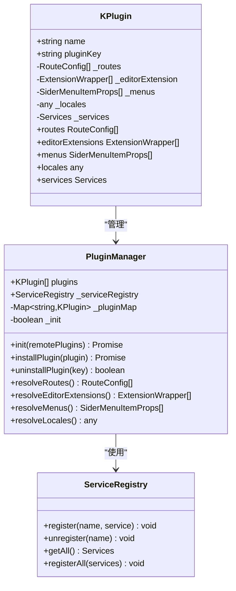
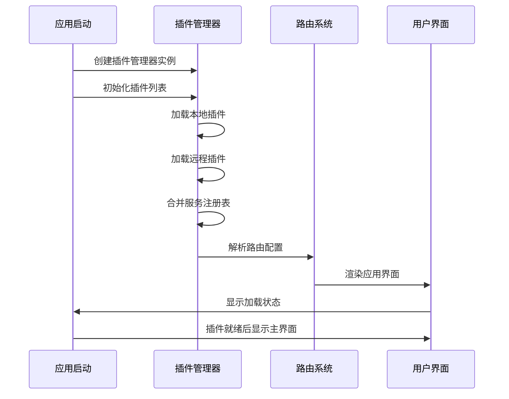
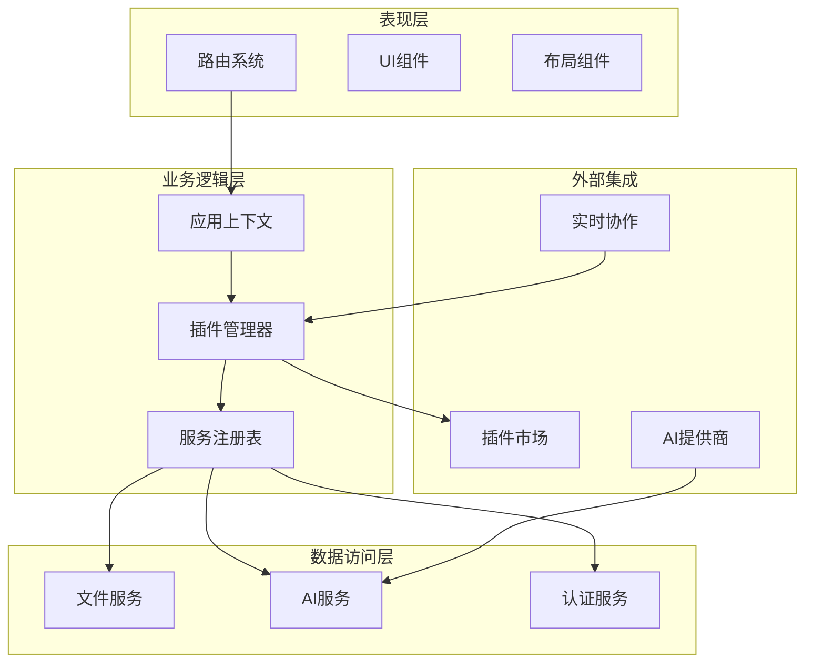
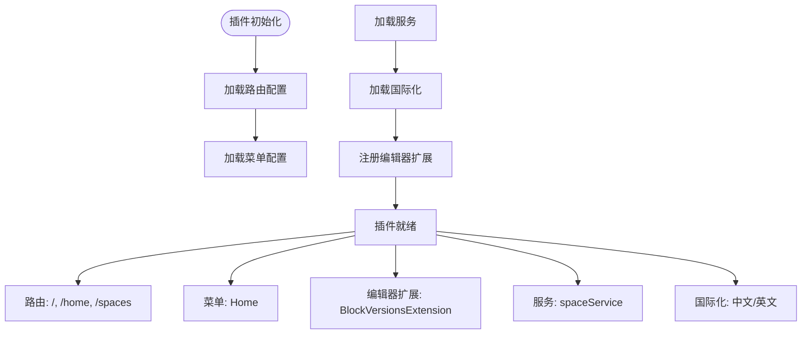
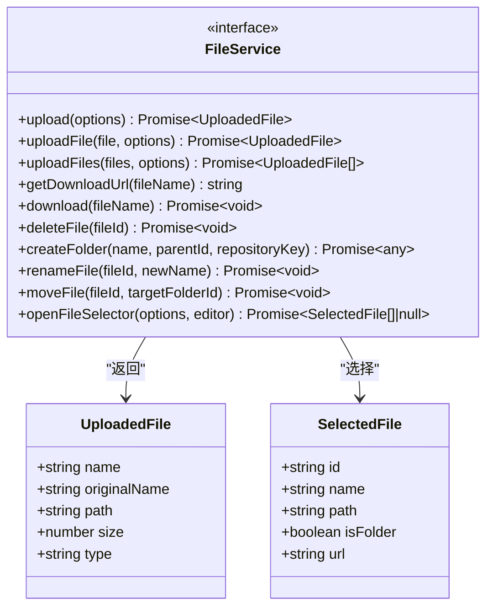
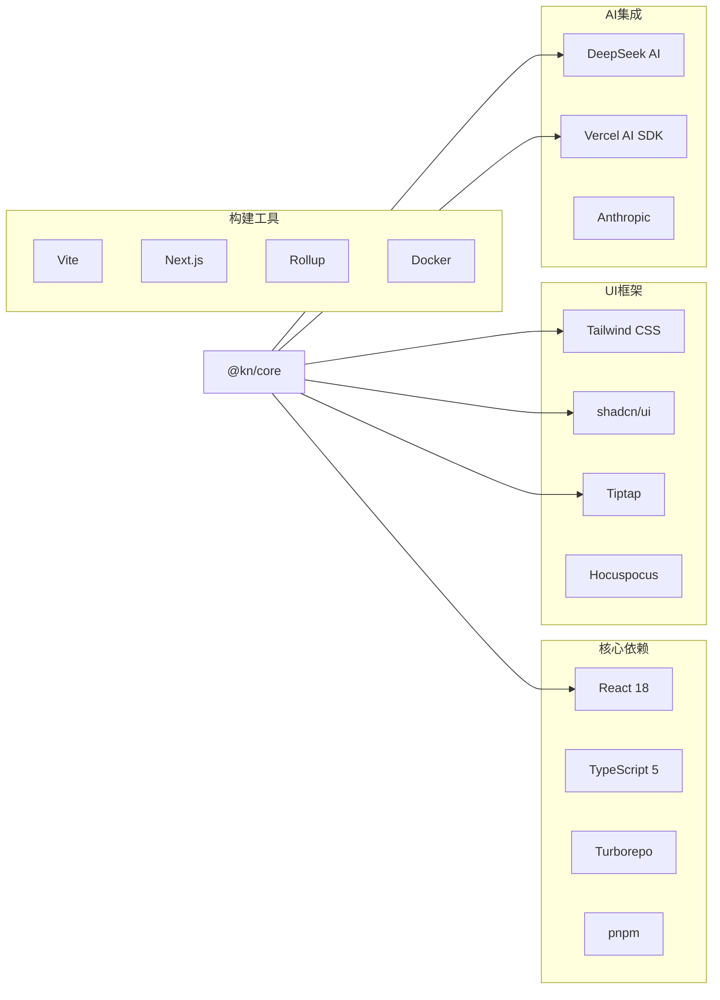

# 注册组件

<cite>
**本文档引用的文件**
- [packages/core/src/index.ts](file://packages/core/src/index.ts)
- [packages/core/src/App.tsx](file://packages/core/src/App.tsx)
- [packages/common/src/index.ts](file://packages/common/src/index.ts)
- [packages/common/src/core/PluginManager.ts](file://packages/common/src/core/PluginManager.ts)
- [packages/common/src/core/types.ts](file://packages/common/src/core/types.ts)
- [packages/plugin-main/src/index.tsx](file://packages/plugin-main/src/index.tsx)
- [packages/core/package.json](file://packages/core/package.json)
- [packages/plugin-main/package.json](file://packages/plugin-main/package.json)
</cite>

## 目录
1. [简介](#简介)
2. [项目结构](#项目结构)
3. [核心组件](#核心组件)
4. [架构概览](#架构概览)
5. [详细组件分析](#详细组件分析)
6. [依赖关系分析](#依赖关系分析)
7. [性能考虑](#性能考虑)
8. [故障排除指南](#故障排除指南)
9. [结论](#结论)

## 简介

注册组件是知识库系统中的核心基础设施，负责管理插件的注册、初始化和路由配置。该组件采用模块化设计，支持动态插件加载、国际化支持和实时协作功能。系统通过统一的插件管理器来协调各个插件的功能，实现高度可扩展的应用架构。

## 项目结构

知识库项目采用Monorepo架构，主要包含以下关键目录：

```mermaid
graph TB
subgraph "应用层"
Core[核心应用 @kn/core]
Desktop[桌面应用]
Landing[着陆页面]
end
subgraph "共享包"
Common[@kn/common 共享工具]
UI[@kn/ui 组件库]
Editor[@kn/editor 编辑器]
Icon[@kn/icon 图标库]
end
subgraph "插件系统"
MainPlugin[主插件 @kn/plugin-main]
AIPlugin[AI插件 @kn/plugin-ai]
FileManager[文件管理 @kn/plugin-file-manager]
Database[数据库 @kn/plugin-database]
end
Core --> Common
Core --> UI
Core --> Editor
Core --> Icon
MainPlugin --> Common
MainPlugin --> UI
AIPlugin --> Common
FileManager --> Common
```

**图表来源**
- [packages/core/package.json:1-43](file://packages/core/package.json#L1-L43)
- [packages/plugin-main/package.json:1-28](file://packages/plugin-main/package.json#L1-L28)

**章节来源**
- [packages/core/src/index.ts:1-11](file://packages/core/src/index.ts#L1-L11)
- [packages/common/src/index.ts:1-39](file://packages/common/src/index.ts#L1-L39)

## 核心组件

### 插件管理系统

插件管理系统是整个注册组件的核心，提供了完整的插件生命周期管理功能：



**图表来源**
- [packages/common/src/core/PluginManager.ts:51-98](file://packages/common/src/core/PluginManager.ts#L51-L98)
- [packages/common/src/core/PluginManager.ts:100-129](file://packages/common/src/core/PluginManager.ts#L100-L129)

### 应用启动流程

应用启动时的注册流程确保了插件的正确初始化和路由配置：



**图表来源**
- [packages/core/src/App.tsx:62-164](file://packages/core/src/App.tsx#L62-L164)

**章节来源**
- [packages/common/src/core/PluginManager.ts:202-278](file://packages/common/src/core/PluginManager.ts#L202-L278)
- [packages/core/src/App.tsx:62-164](file://packages/core/src/App.tsx#L62-L164)

## 架构概览

注册组件采用了分层架构设计，确保了系统的可维护性和扩展性：



**图表来源**
- [packages/core/src/App.tsx:1-189](file://packages/core/src/App.tsx#L1-L189)
- [packages/common/src/core/PluginManager.ts:100-129](file://packages/common/src/core/PluginManager.ts#L100-L129)

## 详细组件分析

### 插件配置系统

插件配置系统提供了灵活的插件定义和管理机制：

| 配置项 | 类型 | 必需 | 描述 |
|--------|------|------|------|
| name | string | 是 | 插件名称 |
| status | string | 是 | 插件状态（ACTIVE/INACTIVE） |
| routes | RouteConfig[] | 否 | 路由配置数组 |
| menus | SiderMenuItemProps[] | 否 | 菜单配置数组 |
| editorExtension | ExtensionWrapper[] | 否 | 编辑器扩展 |
| locales | any | 否 | 国际化资源 |
| services | Services | 否 | 服务接口定义 |
| settings | PluginSettingsConfig | 否 | 设置面板配置 |

### 主插件实现

主插件作为核心功能的载体，提供了完整的知识管理功能：



**图表来源**
- [packages/plugin-main/src/index.tsx:30-76](file://packages/plugin-main/src/index.tsx#L30-L76)

**章节来源**
- [packages/plugin-main/src/index.tsx:26-76](file://packages/plugin-main/src/index.tsx#L26-L76)

### 文件服务接口

文件服务提供了统一的文件操作接口，确保所有插件使用一致的文件处理方式：



**图表来源**
- [packages/common/src/core/types.ts:63-75](file://packages/common/src/core/types.ts#L63-L75)

**章节来源**
- [packages/common/src/core/types.ts:63-75](file://packages/common/src/core/types.ts#L63-L75)

## 依赖关系分析

注册组件的依赖关系体现了清晰的分层架构：



**图表来源**
- [packages/core/package.json:17-33](file://packages/core/package.json#L17-L33)

**章节来源**
- [packages/core/package.json:17-33](file://packages/core/package.json#L17-L33)
- [packages/plugin-main/package.json:15-20](file://packages/plugin-main/package.json#L15-L20)

## 性能考虑

注册组件在设计时充分考虑了性能优化：

### 缓存策略
- 插件脚本缓存：避免重复加载相同的插件
- 路由配置缓存：减少路由解析开销
- 服务注册表缓存：提升服务查找效率

### 异步加载
- 插件异步加载：不阻塞主应用启动
- 路由懒加载：按需加载页面组件
- 国际化资源延迟加载

### 内存管理
- 插件卸载清理：释放内存和事件监听器
- 服务注册表动态管理：支持运行时服务增删
- 编辑器扩展缓存：避免重复创建扩展实例

## 故障排除指南

### 常见问题及解决方案

| 问题类型 | 症状 | 可能原因 | 解决方案 |
|----------|------|----------|----------|
| 插件加载失败 | 插件未显示在界面中 | 插件脚本错误或依赖缺失 | 检查插件控制台错误日志 |
| 路由冲突 | 页面无法正确显示 | 插件路由配置重复 | 检查插件路由路径唯一性 |
| 国际化失效 | 文案显示为英文 | 语言包加载失败 | 验证locale资源文件完整性 |
| 服务不可用 | 功能调用报错 | 服务注册失败 | 检查服务注册表状态 |

### 调试工具

1. **插件状态监控**：通过`onChange`回调监听插件变化
2. **日志系统**：使用`logger`记录详细的插件加载过程
3. **版本追踪**：利用`version`属性检测插件状态变更
4. **缓存清理**：使用`clearPluginCache`方法清除缓存

**章节来源**
- [packages/common/src/core/PluginManager.ts:159-166](file://packages/common/src/core/PluginManager.ts#L159-L166)
- [packages/common/src/core/PluginManager.ts:173-184](file://packages/common/src/core/PluginManager.ts#L173-L184)

## 结论

注册组件作为知识库系统的核心基础设施，通过其模块化的架构设计和完善的插件管理机制，为整个平台提供了强大的扩展能力和良好的用户体验。组件的设计充分考虑了性能优化、错误处理和可维护性，为后续的功能扩展奠定了坚实的基础。

未来的发展方向包括：
- 增强插件热重载功能
- 优化大型插件的加载性能
- 扩展插件间通信机制
- 完善插件开发工具链