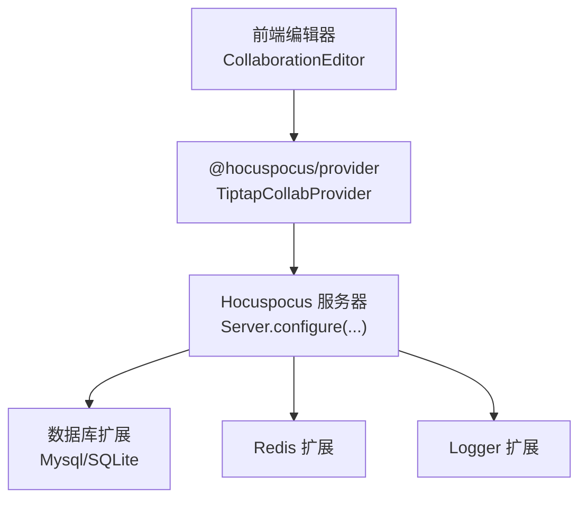
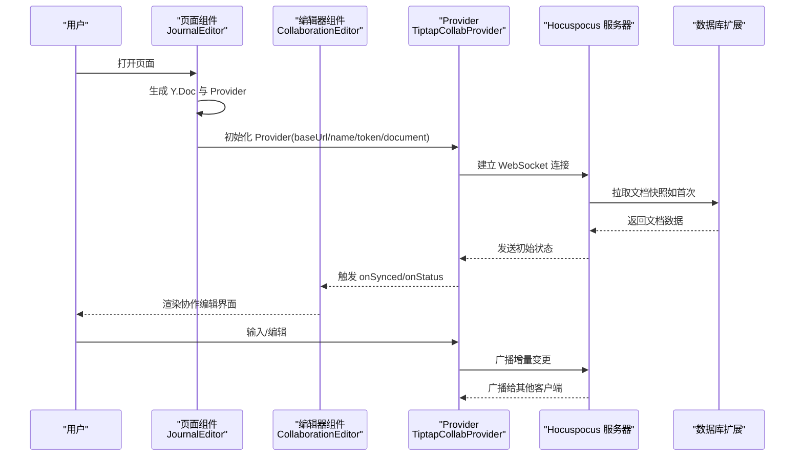
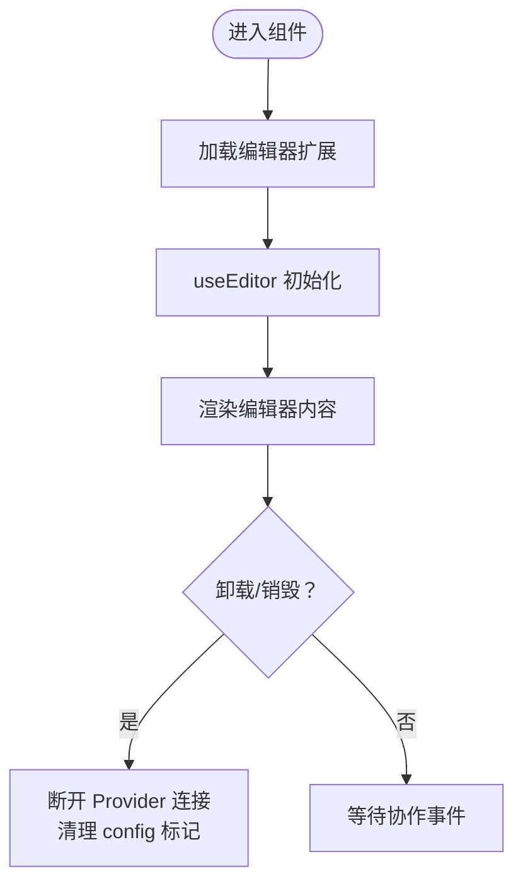
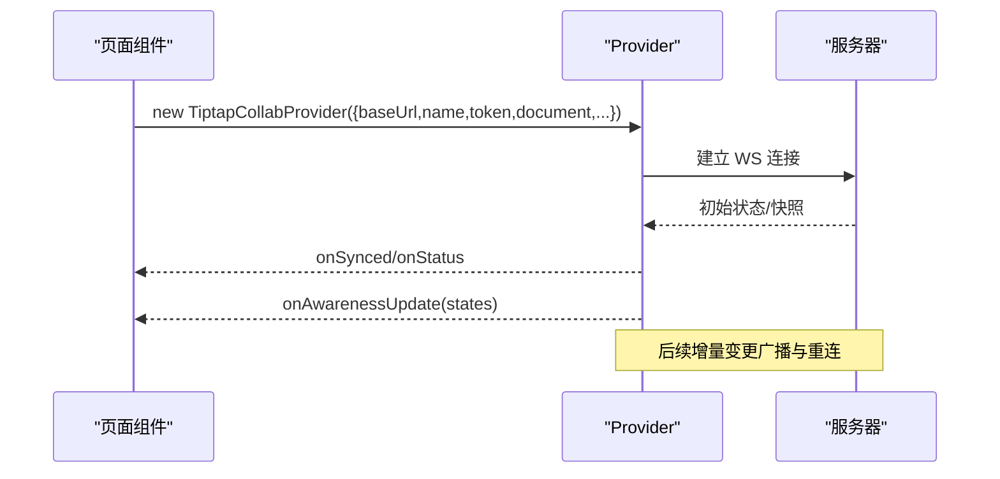
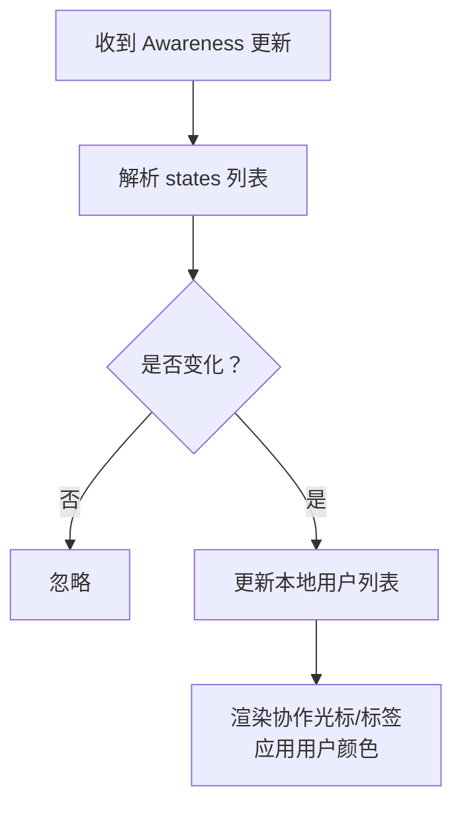
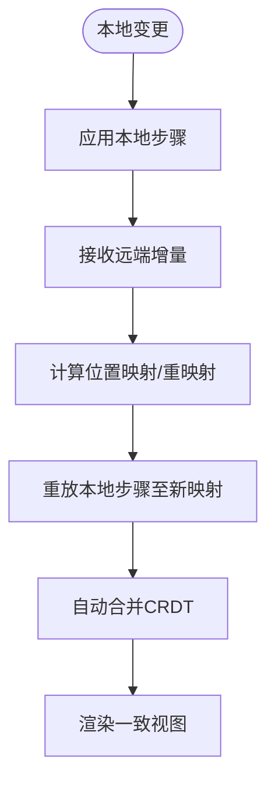
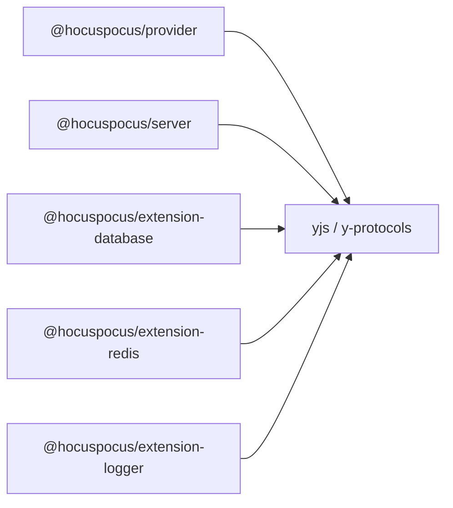

# 实时协作功能

<cite>
**本文引用的文件**
- [packages/editor/src/editor/collaboration.tsx](file://packages/editor/src/editor/collaboration.tsx)
- [packages/editor/src/editor/provider.ts](file://packages/editor/src/editor/provider.ts)
- [packages/editor/src/editor/use-extension.ts](file://packages/editor/src/editor/use-extension.ts)
- [packages/editor/src/server/server.mjs](file://packages/editor/src/server/server.mjs)
- [packages/editor/src/server/plugin/mysql/MysqlPlugin.mjs](file://packages/editor/src/server/plugin/mysql/MysqlPlugin.mjs)
- [packages/plugin-main/src/pages/Journals/JournalEditor/index.tsx](file://packages/plugin-main/src/pages/Journals/JournalEditor/index.tsx)
- [packages/editor/src/styles/editor.ts](file://packages/editor/src/styles/editor.ts)
- [packages/editor/src/extensions/undo-redo/history.ts](file://packages/editor/src/extensions/undo-redo/history.ts)
- [packages/editor/src/extensions/selection/selection.ts](file://packages/editor/src/extensions/selection/selection.ts)
- [packages/editor/src/extensions/dropcursor/prosemirror-dropcursor.ts](file://packages/editor/src/extensions/dropcursor/prosemirror-dropcursor.ts)
- [packages/editor/src/editor/utilities.ts](file://packages/editor/src/editor/utilities.ts)
- [pnpm-lock.yaml](file://pnpm-lock.yaml)
</cite>

## 目录
1. [简介](#简介)
2. [项目结构](#项目结构)
3. [核心组件](#核心组件)
4. [架构总览](#架构总览)
5. [组件详解](#组件详解)
6. [依赖关系分析](#依赖关系分析)
7. [性能考量](#性能考量)
8. [故障排查指南](#故障排查指南)
9. [结论](#结论)
10. [附录](#附录)

## 简介
本技术文档聚焦于编辑器的实时协作能力，围绕以下目标展开：
- 解释 Yjs 协作协议与基于 Yjs 的协同模型在本项目中的落地方式（通过 @hocuspocus/provider 与 @hocuspocus/server）。
- 阐述 Hocuspocus 服务器的集成方式：连接建立、文档同步、持久化与广播、用户状态（Awareness）管理。
- 说明协作提供者（Provider）的配置与使用：服务器地址、认证令牌、事件回调、断线重连策略等。
- 提供协作编辑的用户体验设计建议：光标同步、用户颜色标识、在线状态显示。
- 给出可直接参考的代码片段路径，帮助快速定位实现细节。

## 项目结构
本项目的实时协作由“前端编辑器 + Hocuspocus 协作服务 + 数据存储”三层组成：
- 前端编辑器层：基于 Tiptap 与 Yjs 的协作编辑器组件，负责渲染、扩展加载、事件处理与 Provider 生命周期管理。
- 协作服务层：Hocuspocus 服务器，负责 WebSocket 连接、文档分发、状态广播、扩展（数据库、Redis、日志）集成。
- 存储层：MySQL/SQLite/Redis 等，用于持久化文档快照与跨节点同步。



图表来源
- [packages/editor/src/editor/collaboration.tsx](file://packages/editor/src/editor/collaboration.tsx#L1-L142)
- [packages/editor/src/server/server.mjs](file://packages/editor/src/server/server.mjs#L1-L25)
- [packages/editor/src/server/plugin/mysql/MysqlPlugin.mjs](file://packages/editor/src/server/plugin/mysql/MysqlPlugin.mjs#L1-L88)

章节来源
- [packages/editor/src/editor/collaboration.tsx](file://packages/editor/src/editor/collaboration.tsx#L1-L142)
- [packages/editor/src/server/server.mjs](file://packages/editor/src/server/server.mjs#L1-L25)

## 核心组件
- 协作编辑器组件：封装编辑器实例、扩展加载、工具栏、目录等 UI 结构，并通过 Provider 管理协作生命周期。
- 协作提供者（Provider）：封装与 Hocuspocus 服务器的连接、文档同步、Awareness 状态更新、连接状态回调。
- Hocuspocus 服务器：统一配置扩展（数据库、Redis、日志），监听端口并对外提供协作服务。
- 数据库扩展：实现文档的持久化拉取与存储，支持 MySQL/SQLite 等后端。

章节来源
- [packages/editor/src/editor/collaboration.tsx](file://packages/editor/src/editor/collaboration.tsx#L1-L142)
- [packages/editor/src/editor/provider.ts](file://packages/editor/src/editor/provider.ts#L1-L53)
- [packages/editor/src/server/server.mjs](file://packages/editor/src/server/server.mjs#L1-L25)
- [packages/editor/src/server/plugin/mysql/MysqlPlugin.mjs](file://packages/editor/src/server/plugin/mysql/MysqlPlugin.mjs#L1-L88)

## 架构总览
下图展示了从页面初始化到文档同步完成的端到端流程，以及用户状态（Awareness）的传播路径。



图表来源
- [packages/plugin-main/src/pages/Journals/JournalEditor/index.tsx](file://packages/plugin-main/src/pages/Journals/JournalEditor/index.tsx#L1-L54)
- [packages/editor/src/editor/collaboration.tsx](file://packages/editor/src/editor/collaboration.tsx#L1-L142)
- [packages/editor/src/server/server.mjs](file://packages/editor/src/server/server.mjs#L1-L25)
- [packages/editor/src/server/plugin/mysql/MysqlPlugin.mjs](file://packages/editor/src/server/plugin/mysql/MysqlPlugin.mjs#L1-L88)

## 组件详解

### 协作编辑器组件（CollaborationEditor）
职责与要点：
- 使用 useEditor 创建编辑器实例，注入扩展集合（含占位、撤销重做、唯一 ID 等）。
- 通过 Provider 管理文档同步与连接生命周期，支持销毁时断开连接与清理状态。
- 可选地挂载目录、菜单等 UI 组件，提供良好的协作体验。



图表来源
- [packages/editor/src/editor/collaboration.tsx](file://packages/editor/src/editor/collaboration.tsx#L1-L142)
- [packages/editor/src/editor/use-extension.ts](file://packages/editor/src/editor/use-extension.ts#L1-L63)

章节来源
- [packages/editor/src/editor/collaboration.tsx](file://packages/editor/src/editor/collaboration.tsx#L1-L142)
- [packages/editor/src/editor/use-extension.ts](file://packages/editor/src/editor/use-extension.ts#L1-L63)

### 协作提供者（Provider）配置与使用
- 服务器地址与文档命名空间：通过 baseUrl 与 name 指定协作房间；每个文档名对应一个独立的 Y.Doc。
- 认证与令牌：通过 token 字段传递认证信息，由服务器侧校验。
- 事件回调：
  - onAwarenessUpdate：订阅其他用户的 Awareness 状态，可用于渲染协作光标与在线用户列表。
  - onSynced：文档已同步，可切换 UI 状态或进行后续初始化。
  - onStatus：连接状态变化（如 connecting/synced/disconnected 等）。
- 断线与重连：Provider 内置重连机制，可在网络波动时自动恢复。



图表来源
- [packages/plugin-main/src/pages/Journals/JournalEditor/index.tsx](file://packages/plugin-main/src/pages/Journals/JournalEditor/index.tsx#L1-L54)
- [packages/editor/src/editor/collaboration.tsx](file://packages/editor/src/editor/collaboration.tsx#L1-L142)

章节来源
- [packages/plugin-main/src/pages/Journals/JournalEditor/index.tsx](file://packages/plugin-main/src/pages/Journals/JournalEditor/index.tsx#L1-L54)

### Hocuspocus 服务器集成
- 服务器配置：通过 Server.configure 注册扩展，包括数据库扩展、Redis、Logger 等。
- 环境变量：端口、数据库与 Redis 的连接参数通过环境变量注入。
- 文档持久化：数据库扩展负责拉取与存储文档快照，确保断线重连后能恢复最新状态。

```mermaid
classDiagram
class Server {
+configure(options)
+listen()
}
class Mysql {
+onConfigure()
+fetch({documentName})
+store({documentName,state})
}
class Redis {
+host
+port
}
class Logger {
+log(...)
}
Server --> Mysql : "注册扩展"
Server --> Redis : "注册扩展"
Server --> Logger : "注册扩展"
```

图表来源
- [packages/editor/src/server/server.mjs](file://packages/editor/src/server/server.mjs#L1-L25)
- [packages/editor/src/server/plugin/mysql/MysqlPlugin.mjs](file://packages/editor/src/server/plugin/mysql/MysqlPlugin.mjs#L1-L88)

章节来源
- [packages/editor/src/server/server.mjs](file://packages/editor/src/server/server.mjs#L1-L25)
- [packages/editor/src/server/plugin/mysql/MysqlPlugin.mjs](file://packages/editor/src/server/plugin/mysql/MysqlPlugin.mjs#L1-L88)

### 用户状态（Awareness）与光标同步
- 用户状态（Awareness）：通过 onAwarenessUpdate 回调获取其他用户的用户信息与客户端 ID，结合样式实现协作光标与标签。
- 光标样式：编辑器样式中定义了协作光标的 caret 与 label 样式，便于在编辑器内渲染他人光标。
- 颜色标识：可通过随机或固定规则为不同用户分配颜色，用于区分协作光标与标签颜色。



图表来源
- [packages/plugin-main/src/pages/Journals/JournalEditor/index.tsx](file://packages/plugin-main/src/pages/Journals/JournalEditor/index.tsx#L1-L54)
- [packages/editor/src/styles/editor.ts](file://packages/editor/src/styles/editor.ts#L740-L763)
- [packages/editor/src/editor/utilities.ts](file://packages/editor/src/editor/utilities.ts#L1-L27)

章节来源
- [packages/editor/src/styles/editor.ts](file://packages/editor/src/styles/editor.ts#L740-L763)
- [packages/editor/src/editor/utilities.ts](file://packages/editor/src/editor/utilities.ts#L1-L27)

### 冲突检测与自动合并机制
- Yjs CRDT：基于有界因果复制（CRDT）的数据结构，天然支持无锁并发写入与自动合并，无需传统“操作转换（OT）”。
- 本地历史与映射：编辑器内部维护本地事务历史，当收到远端变更时，通过映射与重映射（mapping/rebased）调整本地步骤，保证一致性。
- 选择与事务：过滤掉由协作引发的事务，避免互相覆盖；同时对节点选择与文本选择进行过滤，减少冲突场景。



图表来源
- [packages/editor/src/extensions/undo-redo/history.ts](file://packages/editor/src/extensions/undo-redo/history.ts#L72-L204)
- [packages/editor/src/extensions/selection/selection.ts](file://packages/editor/src/extensions/selection/selection.ts#L75-L106)

章节来源
- [packages/editor/src/extensions/undo-redo/history.ts](file://packages/editor/src/extensions/undo-redo/history.ts#L72-L204)
- [packages/editor/src/extensions/selection/selection.ts](file://packages/editor/src/extensions/selection/selection.ts#L75-L106)

### 拖拽光标与滚动行为（协作友好）
- 拖拽光标：在文档内容变化时，动态更新拖拽光标的位置与覆盖层，避免因文档尺寸变化导致的光标错位。
- 协作场景下的选择过滤：防止协作过程中由观察器触发的选择覆盖，保持节点选择与文本选择的一致性。

章节来源
- [packages/editor/src/extensions/dropcursor/prosemirror-dropcursor.ts](file://packages/editor/src/extensions/dropcursor/prosemirror-dropcursor.ts#L42-L88)
- [packages/editor/src/extensions/selection/selection.ts](file://packages/editor/src/extensions/selection/selection.ts#L75-L106)

## 依赖关系分析
- 前端依赖：@hocuspocus/provider、@hocuspocus/server、y-protocols、yjs 等，用于建立 WebSocket 连接、协议编解码与文档同步。
- 服务器扩展：@hocuspocus/extension-database、@hocuspocus/extension-redis、@hocuspocus/extension-logger 等，分别负责持久化、分布式锁与广播、日志记录。
- 版本约束：锁定文件中明确了各包的版本与对 yjs/y-protocols 的 peerDependencies 要求。



图表来源
- [pnpm-lock.yaml](file://pnpm-lock.yaml#L453-L10712)
- [pnpm-lock.yaml](file://pnpm-lock.yaml#L9861-L9896)

章节来源
- [pnpm-lock.yaml](file://pnpm-lock.yaml#L453-L10712)
- [pnpm-lock.yaml](file://pnpm-lock.yaml#L9861-L9896)

## 性能考量
- 传输与映射：Yjs 的增量传输与映射机制显著降低带宽占用；在高并发场景下，建议启用 Redis 扩展以提升广播效率。
- 历史压缩：编辑器内部对历史分支进行压缩与重映射，减少内存占用与重放成本。
- UI 渲染：在大量协作光标同时出现时，建议按需渲染与节流，避免频繁重绘。
- 断线重连：Provider 默认具备重连策略，建议在业务层根据网络状态调整重试间隔与最大重试次数。

## 故障排查指南
- 连接失败
  - 检查服务器端口与网络可达性；确认环境变量配置正确。
  - 查看服务器日志扩展输出，定位连接与握手阶段问题。
- 文档未同步
  - 确认文档名称（room）一致；检查 Provider 的 onSynced 是否触发。
  - 若使用数据库扩展，确认拉取/存储逻辑正常，必要时手动校验数据库条目。
- 光标异常
  - 检查 Awareness 回调是否被正确订阅；核对用户颜色分配逻辑。
  - 关注选择过滤插件，避免协作期间的选择覆盖导致光标错位。
- 拖拽光标错位
  - 确保文档内容变化后及时更新拖拽光标覆盖层；检查 resolve 位置是否正确。

章节来源
- [packages/editor/src/server/server.mjs](file://packages/editor/src/server/server.mjs#L1-L25)
- [packages/editor/src/server/plugin/mysql/MysqlPlugin.mjs](file://packages/editor/src/server/plugin/mysql/MysqlPlugin.mjs#L1-L88)
- [packages/editor/src/styles/editor.ts](file://packages/editor/src/styles/editor.ts#L740-L763)
- [packages/editor/src/extensions/selection/selection.ts](file://packages/editor/src/extensions/selection/selection.ts#L75-L106)
- [packages/editor/src/extensions/dropcursor/prosemirror-dropcursor.ts](file://packages/editor/src/extensions/dropcursor/prosemirror-dropcursor.ts#L42-L88)

## 结论
本项目采用 Yjs + Hocuspocus 的协作方案，通过 Provider 与服务器扩展实现低耦合、可扩展的实时协作能力。前端侧重于编辑器体验与用户状态呈现，服务器侧通过数据库与 Redis 扩展保障持久化与广播效率。配合 CRDT 的自动合并机制与本地历史映射，系统在高并发与弱网环境下仍能保持一致性与稳定性。

## 附录

### 代码示例路径（配置与事件处理）
- 初始化 Provider 与文档同步
  - [packages/plugin-main/src/pages/Journals/JournalEditor/index.tsx](file://packages/plugin-main/src/pages/Journals/JournalEditor/index.tsx#L1-L54)
- 编辑器组件与扩展加载
  - [packages/editor/src/editor/collaboration.tsx](file://packages/editor/src/editor/collaboration.tsx#L1-L142)
  - [packages/editor/src/editor/use-extension.ts](file://packages/editor/src/editor/use-extension.ts#L1-L63)
- 服务器配置与扩展注册
  - [packages/editor/src/server/server.mjs](file://packages/editor/src/server/server.mjs#L1-L25)
- 数据库扩展（MySQL）
  - [packages/editor/src/server/plugin/mysql/MysqlPlugin.mjs](file://packages/editor/src/server/plugin/mysql/MysqlPlugin.mjs#L1-L88)
- 协作光标样式
  - [packages/editor/src/styles/editor.ts](file://packages/editor/src/styles/editor.ts#L740-L763)
- 用户颜色分配
  - [packages/editor/src/editor/utilities.ts](file://packages/editor/src/editor/utilities.ts#L1-L27)
- 历史与映射（自动合并）
  - [packages/editor/src/extensions/undo-redo/history.ts](file://packages/editor/src/extensions/undo-redo/history.ts#L72-L204)
- 选择过滤（协作友好）
  - [packages/editor/src/extensions/selection/selection.ts](file://packages/editor/src/extensions/selection/selection.ts#L75-L106)
- 拖拽光标（协作友好）
  - [packages/editor/src/extensions/dropcursor/prosemirror-dropcursor.ts](file://packages/editor/src/extensions/dropcursor/prosemirror-dropcursor.ts#L42-L88)