# 实时协作功能

<cite>
**本文引用的文件**
- [packages/editor/src/editor/collaboration.tsx](file://packages/editor/src/editor/collaboration.tsx)
- [packages/editor/src/editor/provider.ts](file://packages/editor/src/editor/provider.ts)
- [packages/editor/src/editor/use-extension.ts](file://packages/editor/src/editor/use-extension.ts)
- [packages/room-server/src/server.mjs](file://packages/room-server/src/server.mjs)
- [packages/room-server/src/plugin/mysql/MysqlPlugin.mjs](file://packages/room-server/src/plugin/mysql/MysqlPlugin.mjs)
- [packages/plugin-main/src/pages/Journals/JournalEditor/index.tsx](file://packages/plugin-main/src/pages/Journals/JournalEditor/index.tsx)
- [packages/plugin-main/src/pages/SpaceDetail/PageEditor/index.tsx](file://packages/plugin-main/src/pages/SpaceDetail/PageEditor/index.tsx)
- [packages/plugin-main/src/pages/InviteCollaboration/index.tsx](file://packages/plugin-main/src/pages/InviteCollaboration/index.tsx)
- [packages/plugin-main/src/api/index.ts](file://packages/plugin-main/src/api/index.ts)
- [packages/plugin-main/docs/COLLABORATION_API.md](file://packages/plugin-main/docs/COLLABORATION_API.md)
- [packages/editor/src/styles/editor.ts](file://packages/editor/src/styles/editor.ts)
- [packages/editor/src/extensions/sync-block/SyncBlock.tsx](file://packages/editor/src/extensions/sync-block/SyncBlock.tsx)
- [packages/core/src/hooks/use-instant-message.ts](file://packages/core/src/hooks/use-instant-message.ts)
- [packages/core/src/components/MessageBox/index.tsx](file://packages/core/src/components/MessageBox/index.tsx)
- [packages/editor/src/extensions/undo-redo/history.ts](file://packages/editor/src/extensions/undo-redo/history.ts)
- [packages/editor/src/extensions/selection/selection.ts](file://packages/editor/src/extensions/selection/selection.ts)
- [packages/editor/src/extensions/dropcursor/prosemirror-dropcursor.ts](file://packages/editor/src/extensions/dropcursor/prosemirror-dropcursor.ts)
- [packages/editor/src/editor/utilities.ts](file://packages/editor/src/editor/utilities.ts)
- [packages/common/src/core/PluginManager.ts](file://packages/common/src/core/PluginManager.ts)
- [packages/room-server/package.json](file://packages/room-server/package.json)
- [packages/room-server/Dockerfile](file://packages/room-server/Dockerfile)
- [packages/room-server/docker-compose.yml](file://packages/room-server/docker-compose.yml)
- [packages/room-server/nginx/nginx.conf](file://packages/room-server/nginx/nginx.conf)
- [.env.example](file://.env.example)
- [apps/vite/.env.development](file://apps/vite/.env.development)
- [apps/vite/.env.production](file://apps/vite/.env.production)
- [apps/vite/vite.config.ts](file://apps/vite/vite.config.ts)
- [apps/landing-page-vite/vite.config.ts](file://apps/landing-page-vite/vite.config.ts)
- [apps/landing-page-vite/src/pages/Docs/index.tsx](file://apps/landing-page-vite/src/pages/Docs/index.tsx)
- [apps/vite/nginx/nginx.conf](file://apps/vite/nginx/nginx.conf)
</cite>

## 更新摘要
**所做更改**
- WebSocket URL从ws://kotion.top:1234更新为wss://kotion.top:8877/ws，采用Nginx反向代理和SSL终止
- 新增Nginx反向代理配置，支持WebSocket升级和SSL加密
- 改进MySQL插件连接管理，增强连接健康检查和自动重连机制
- 更新即时消息系统WebSocket配置，使用wss://kotion.top:888确保安全传输
- 完善Docker容器化部署，支持Nginx SSL终止和WebSocket代理

## 目录
1. [简介](#简介)
2. [项目结构](#项目结构)
3. [核心组件](#核心组件)
4. [架构总览](#架构总览)
5. [组件详解](#组件详解)
6. [协作邀请系统](#协作邀请系统)
7. [room-server包实现](#room-server包实现)
8. [环境配置与部署](#环境配置与部署)
9. [依赖关系分析](#依赖关系分析)
10. [性能考量](#性能考量)
11. [故障排查指南](#故障排查指南)
12. [结论](#结论)
13. [附录](#附录)

## 简介
本技术文档聚焦于编辑器的实时协作能力，围绕以下目标展开：
- 解释 Yjs 协作协议与基于 Yjs 的协同模型在本项目中的落地方式（通过 @hocuspocus/provider 与 @hocuspocus/server）。
- 阐述room-server包作为协作服务器的集成方式：连接建立、文档同步、持久化与广播、用户状态（Awareness）管理。
- 说明协作提供者（Provider）的配置与使用：服务器地址、认证令牌、事件回调、断线重连策略等。
- 提供协作编辑的用户体验设计建议：光标同步、用户颜色标识、在线状态显示。
- 给出可直接参考的代码片段路径，帮助快速定位实现细节。
- 完善环境配置与部署文档，支持多环境协作服务器URL管理。

**更新** 本版本更新了协作服务器架构，采用Nginx反向代理和SSL终止，WebSocket URL从ws://kotion.top:1234更新为wss://kotion.top:8877/ws，提供更安全可靠的实时协作解决方案。

## 项目结构
本项目的实时协作由"前端编辑器 + room-server协作服务 + 数据存储 + 消息中心"四层组成：
- 前端编辑器层：基于 Tiptap 与 Yjs 的协作编辑器组件，负责渲染、扩展加载、事件处理与 Provider 生命周期管理。
- 协作服务层：room-server包提供的Hocuspocus服务器，负责WebSocket连接、文档分发、状态广播、扩展集成。
- 存储层：MySQL/SQLite/Redis 等，用于持久化文档快照与跨节点同步。
- 消息中心层：WebSocket 实时通信系统，支持协作邀请通知、消息推送和状态跟踪。

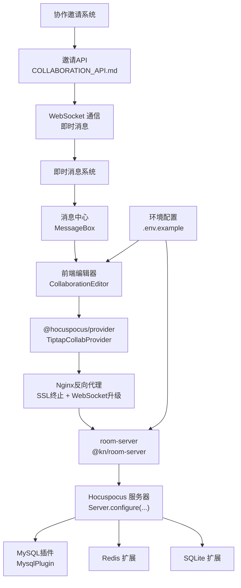
```mermaid
graph TB
FE["前端编辑器<br/>CollaborationEditor"] --> Prov["@hocuspocus/provider<br/>TiptapCollabProvider"]
Prov --> Nginx["Nginx反向代理<br/>SSL终止 + WebSocket升级"]
Nginx --> RS["room-server<br/>@kn/room-server"]
RS --> HS["Hocuspocus 服务器<br/>Server.configure(...)"]
HS --> DB["MySQL插件<br/>MysqlPlugin"]
HS --> RDS["Redis 扩展"]
HS --> SQLITE["SQLite 扩展"]
WS["WebSocket 通信<br/>即时消息"] --> IM["即时消息系统"]
IM --> MC["消息中心<br/>MessageBox"]
MC --> FE
INV["协作邀请系统"] --> API["邀请API<br/>COLLABORATION_API.md"]
API --> WS
ENV["环境配置<br/>.env.example"] --> FE
ENV --> RS
```

**图表来源**
- [packages/editor/src/editor/collaboration.tsx](file://packages/editor/src/editor/collaboration.tsx#L1-L161)
- [packages/room-server/src/server.mjs](file://packages/room-server/src/server.mjs#L1-L59)
- [packages/room-server/src/plugin/mysql/MysqlPlugin.mjs](file://packages/room-server/src/plugin/mysql/MysqlPlugin.mjs#L1-L124)
- [packages/core/src/hooks/use-instant-message.ts](file://packages/core/src/hooks/use-instant-message.ts#L1-L359)
- [packages/plugin-main/docs/COLLABORATION_API.md](file://packages/plugin-main/docs/COLLABORATION_API.md#L1-L806)
- [.env.example](file://.env.example#L1-L24)

**章节来源**
- [packages/editor/src/editor/collaboration.tsx](file://packages/editor/src/editor/collaboration.tsx#L1-L161)
- [packages/room-server/src/server.mjs](file://packages/room-server/src/server.mjs#L1-L59)
- [packages/plugin-main/docs/COLLABORATION_API.md](file://packages/plugin-main/docs/COLLABORATION_API.md#L1-L806)

## 核心组件
- 协作编辑器组件：封装编辑器实例、扩展加载、工具栏、目录等 UI 结构，并通过 Provider 管理协作生命周期。
- 协作提供者（Provider）：封装与room-server的连接、文档同步、Awareness 状态更新、连接状态回调。
- room-server包：全新的协作服务器实现，基于Hocuspocus框架，提供模块化的扩展支持和Docker容器化部署。
- MySQL插件：重构后的数据库扩展，采用Mysql类继承Database基类，提供更好的错误处理和连接管理。
- 即时消息系统：基于 WebSocket 的实时通信，支持消息发送、接收、状态跟踪和自动重连。
- 协作邀请系统：完整的邀请流程管理，包括邀请创建、验证、接受和消息中心通知。
- 外部插件加载：动态加载协作方的编辑器插件，确保一致的编辑体验。
- 环境配置管理：统一的环境变量配置，支持多环境协作服务器URL管理。
- Nginx反向代理：提供SSL终止、WebSocket升级和负载均衡支持。

**更新** 新增Nginx反向代理支持，提供SSL加密和WebSocket升级功能，增强协作服务器的安全性和可靠性。

**章节来源**
- [packages/editor/src/editor/collaboration.tsx](file://packages/editor/src/editor/collaboration.tsx#L1-L161)
- [packages/editor/src/editor/provider.ts](file://packages/editor/src/editor/provider.ts#L1-L53)
- [packages/room-server/src/server.mjs](file://packages/room-server/src/server.mjs#L1-L59)
- [packages/room-server/src/plugin/mysql/MysqlPlugin.mjs](file://packages/room-server/src/plugin/mysql/MysqlPlugin.mjs#L1-L124)
- [packages/core/src/hooks/use-instant-message.ts](file://packages/core/src/hooks/use-instant-message.ts#L1-L359)
- [packages/plugin-main/src/pages/InviteCollaboration/index.tsx](file://packages/plugin-main/src/pages/InviteCollaboration/index.tsx#L1-L617)
- [packages/common/src/core/PluginManager.ts](file://packages/common/src/core/PluginManager.ts#L440-L484)
- [.env.example](file://.env.example#L1-L24)

## 架构总览
下图展示了从页面初始化到文档同步完成的端到端流程，以及用户状态（Awareness）的传播路径。

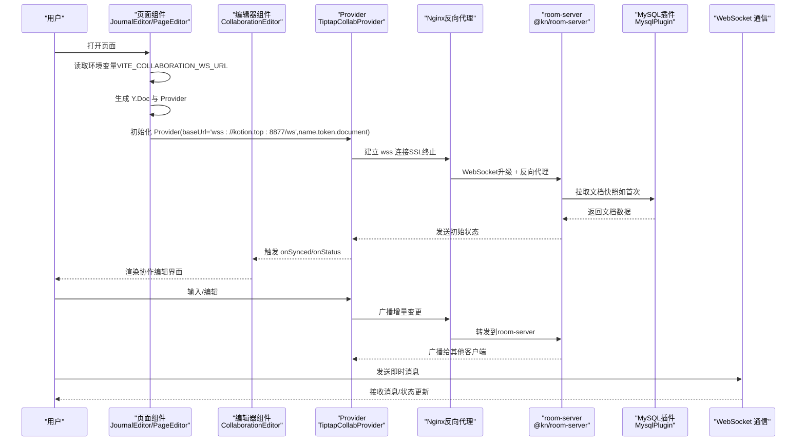
```mermaid
sequenceDiagram
participant U as "用户"
participant P as "页面组件<br/>JournalEditor/PageEditor"
participant E as "编辑器组件<br/>CollaborationEditor"
participant PR as "Provider<br/>TiptapCollabProvider"
participant NGINX as "Nginx反向代理"
participant RS as "room-server<br/>@kn/room-server"
participant MP as "MySQL插件<br/>MysqlPlugin"
participant WS as "WebSocket 通信"
U->>P : 打开页面
P->>P : 读取环境变量VITE_COLLABORATION_WS_URL
P->>P : 生成 Y.Doc 与 Provider
P->>PR : 初始化 Provider(baseUrl='wss : //kotion.top : 8877/ws',name,token,document)
PR->>NGINX : 建立 wss 连接SSL终止
NGINX->>RS : WebSocket升级 + 反向代理
RS->>MP : 拉取文档快照如首次
MP-->>RS : 返回文档数据
RS-->>PR : 发送初始状态
PR-->>E : 触发 onSynced/onStatus
E-->>U : 渲染协作编辑界面
U->>PR : 输入/编辑
PR->>NGINX : 广播增量变更
NGINX->>RS : 转发到room-server
RS-->>PR : 广播给其他客户端
U->>WS : 发送即时消息
WS-->>U : 接收消息/状态更新
```

**图表来源**
- [packages/plugin-main/src/pages/Journals/JournalEditor/index.tsx](file://packages/plugin-main/src/pages/Journals/JournalEditor/index.tsx#L1-L54)
- [packages/plugin-main/src/pages/SpaceDetail/PageEditor/index.tsx](file://packages/plugin-main/src/pages/SpaceDetail/PageEditor/index.tsx#L80-L126)
- [packages/editor/src/editor/collaboration.tsx](file://packages/editor/src/editor/collaboration.tsx#L1-L161)
- [packages/room-server/src/server.mjs](file://packages/room-server/src/server.mjs#L1-L59)
- [packages/room-server/src/plugin/mysql/MysqlPlugin.mjs](file://packages/room-server/src/plugin/mysql/MysqlPlugin.mjs#L1-L124)
- [packages/core/src/hooks/use-instant-message.ts](file://packages/core/src/hooks/use-instant-message.ts#L216-L265)
- [.env.example](file://.env.example#L8-L9)

## 组件详解

### 协作编辑器组件（CollaborationEditor）
职责与要点：
- 使用 useEditor 创建编辑器实例，注入扩展集合（含占位、撤销重做、唯一 ID 等）。
- 通过 Provider 管理文档同步与连接生命周期，支持销毁时断开连接与清理状态。
- 可选地挂载目录、菜单等 UI 组件，提供良好的协作体验。
- 支持协作光标同步，通过 CollaborationCursor 扩展实现多用户光标显示。
- 支持外部扩展加载，用于协作场景下加载协作方的编辑器插件。

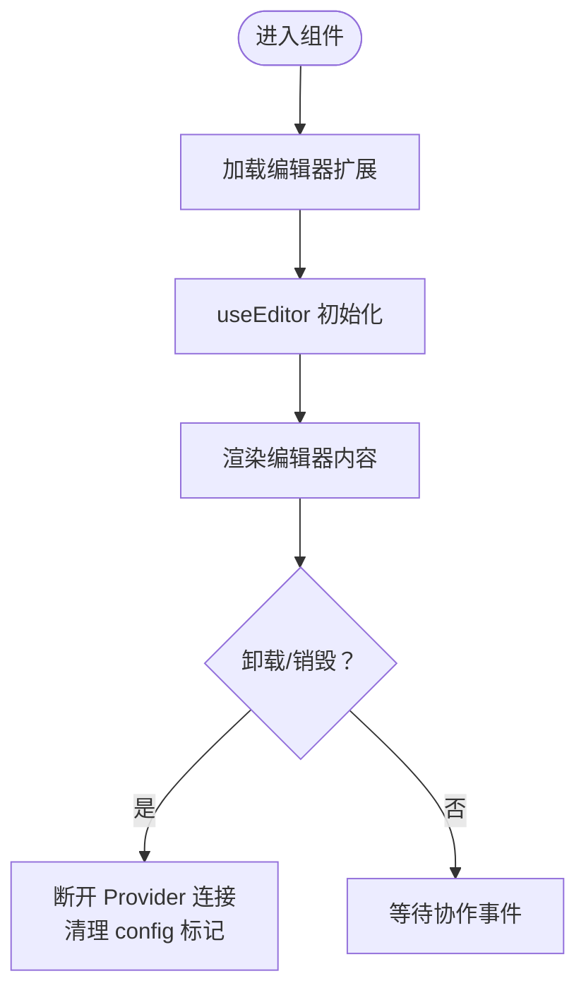
```mermaid
flowchart TD
Start(["进入组件"]) --> LoadExt["加载编辑器扩展"]
LoadExt --> InitEditor["useEditor 初始化"]
InitEditor --> Render["渲染编辑器内容"]
Render --> Cleanup{"卸载/销毁？"}
Cleanup --> |是| Disconnect["断开 Provider 连接<br/>清理 config 标记"]
Cleanup --> |否| Wait["等待协作事件"]
```

**图表来源**
- [packages/editor/src/editor/collaboration.tsx](file://packages/editor/src/editor/collaboration.tsx#L1-L161)
- [packages/editor/src/editor/use-extension.ts](file://packages/editor/src/editor/use-extension.ts#L1-L63)

**章节来源**
- [packages/editor/src/editor/collaboration.tsx](file://packages/editor/src/editor/collaboration.tsx#L1-L161)
- [packages/editor/src/editor/use-extension.ts](file://packages/editor/src/editor/use-extension.ts#L1-L63)

### 协作提供者（Provider）配置与使用
- 服务器地址与文档命名空间：通过 baseUrl 与 name 指定协作房间；每个文档名对应一个独立的 Y.Doc。
- 认证与令牌：通过 token 字段传递认证信息，由服务器侧校验。
- 事件回调：
  - onAwarenessUpdate：订阅其他用户的 Awareness 状态，可用于渲染协作光标与在线用户列表。
  - onSynced：文档已同步，可切换 UI 状态或进行后续初始化。
  - onStatus：连接状态变化（如 connecting/synced/disconnected 等）。
- 断线与重连：Provider 内置重连机制，可在网络波动时自动恢复。
- 环境配置：支持从环境变量读取协作服务器URL，实现多环境配置管理。

**更新** 协作服务器URL现已更新为wss://kotion.top:8877/ws，采用Nginx反向代理和SSL终止，提供更安全的连接。

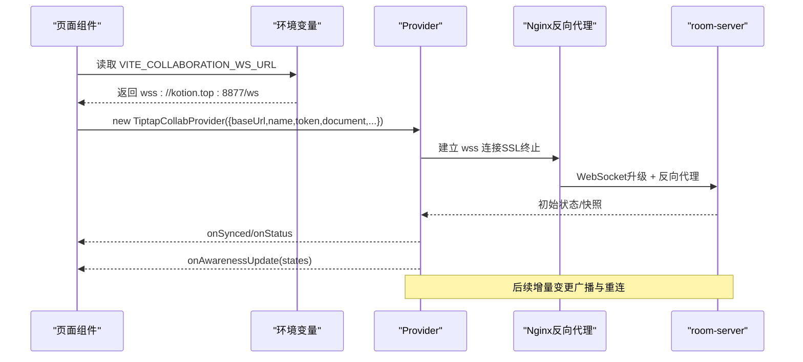
```mermaid
sequenceDiagram
participant C as "页面组件"
participant ENV as "环境变量"
participant PR as "Provider"
participant NGINX as "Nginx反向代理"
participant RS as "room-server"
C->>ENV : 读取 VITE_COLLABORATION_WS_URL
ENV-->>C : 返回 wss : //kotion.top : 8877/ws
C->>PR : new TiptapCollabProvider({baseUrl,name,token,document,...})
PR->>NGINX : 建立 wss 连接SSL终止
NGINX->>RS : WebSocket升级 + 反向代理
RS-->>PR : 初始状态/快照
PR-->>C : onSynced/onStatus
PR-->>C : onAwarenessUpdate(states)
Note over PR,RS : 后续增量变更广播与重连
```

**图表来源**
- [packages/plugin-main/src/pages/Journals/JournalEditor/index.tsx](file://packages/plugin-main/src/pages/Journals/JournalEditor/index.tsx#L20-L42)
- [packages/plugin-main/src/pages/SpaceDetail/PageEditor/index.tsx](file://packages/plugin-main/src/pages/SpaceDetail/PageEditor/index.tsx#L88-L126)
- [packages/plugin-main/src/pages/InviteCollaboration/index.tsx](file://packages/plugin-main/src/pages/InviteCollaboration/index.tsx#L119-L159)
- [packages/editor/src/editor/collaboration.tsx](file://packages/editor/src/editor/collaboration.tsx#L1-L161)
- [.env.example](file://.env.example#L8-L9)

**章节来源**
- [packages/plugin-main/src/pages/Journals/JournalEditor/index.tsx](file://packages/plugin-main/src/pages/Journals/JournalEditor/index.tsx#L1-L54)
- [packages/plugin-main/src/pages/SpaceDetail/PageEditor/index.tsx](file://packages/plugin-main/src/pages/SpaceDetail/PageEditor/index.tsx#L80-L126)
- [packages/plugin-main/src/pages/InviteCollaboration/index.tsx](file://packages/plugin-main/src/pages/InviteCollaboration/index.tsx#L119-L159)
- [.env.example](file://.env.example#L8-L9)

### room-server包实现
- 包结构：采用模块化设计，包含服务器入口文件和插件目录。
- 服务器配置：通过Server.configure注册扩展，包括MySQL插件、Redis、SQLite、Logger等。
- 环境变量：端口、数据库与Redis的连接参数通过环境变量注入。
- Docker支持：提供完整的Dockerfile，支持容器化部署和生产环境运行。
- 扩展管理：支持按需启用/禁用扩展，便于开发和生产环境的灵活配置。

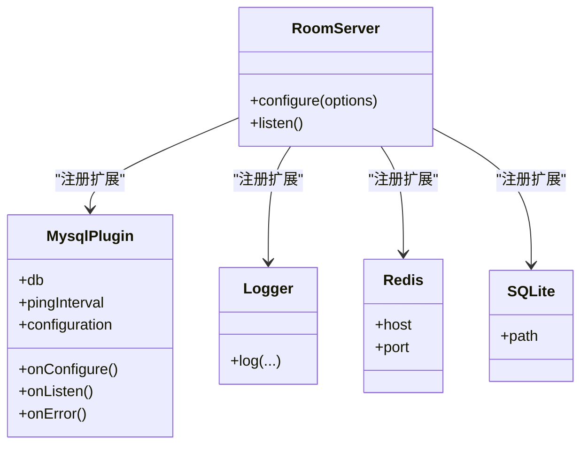
```mermaid
classDiagram
class RoomServer {
+configure(options)
+listen()
}
class MysqlPlugin {
+db
+pingInterval
+configuration
+onConfigure()
+onListen()
+onError()
}
class Logger {
+log(...)
}
class Redis {
+host
+port
}
class SQLite {
+path
}
RoomServer --> MysqlPlugin : "注册扩展"
RoomServer --> Logger : "注册扩展"
RoomServer --> Redis : "注册扩展"
RoomServer --> SQLite : "注册扩展"
```

**图表来源**
- [packages/room-server/src/server.mjs](file://packages/room-server/src/server.mjs#L1-L59)
- [packages/room-server/src/plugin/mysql/MysqlPlugin.mjs](file://packages/room-server/src/plugin/mysql/MysqlPlugin.mjs#L21-L124)

**章节来源**
- [packages/room-server/src/server.mjs](file://packages/room-server/src/server.mjs#L1-L59)
- [packages/room-server/src/plugin/mysql/MysqlPlugin.mjs](file://packages/room-server/src/plugin/mysql/MysqlPlugin.mjs#L1-L124)
- [packages/room-server/package.json](file://packages/room-server/package.json#L1-L32)
- [packages/room-server/Dockerfile](file://packages/room-server/Dockerfile#L1-L28)

### MySQL插件重构实现
- 类继承架构：Mysql类继承自@hocuspocus/extension-database的Database基类。
- 连接管理：采用mysql原生驱动，提供自动重连和错误处理机制。
- 数据库操作：实现文档的拉取(fetch)和存储(store)功能，使用UPSERT语句确保数据一致性。
- 连接健康检查：定时执行ping操作，监控数据库连接状态并自动恢复。
- 配置灵活性：支持通过构造函数参数和环境变量配置数据库连接。

**更新** MySQL插件增强了连接健康检查机制，定时执行ping操作监控连接状态，提供更稳定的数据库连接管理。

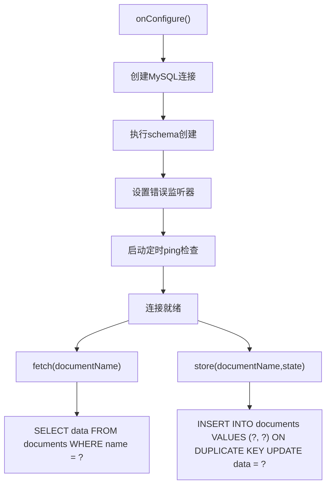
```mermaid
flowchart TD
A["onConfigure()"] --> B["创建MySQL连接"]
B --> C["执行schema创建"]
C --> D["设置错误监听器"]
D --> E["启动定时ping检查"]
E --> F["连接就绪"]
F --> G["fetch(documentName)"]
F --> H["store(documentName,state)"]
G --> I["SELECT data FROM documents WHERE name = ?"]
H --> J["INSERT INTO documents VALUES (?, ?) ON DUPLICATE KEY UPDATE data = ?"]
```

**图表来源**
- [packages/room-server/src/plugin/mysql/MysqlPlugin.mjs](file://packages/room-server/src/plugin/mysql/MysqlPlugin.mjs#L52-L124)

**章节来源**
- [packages/room-server/src/plugin/mysql/MysqlPlugin.mjs](file://packages/room-server/src/plugin/mysql/MysqlPlugin.mjs#L1-L124)

### 用户状态（Awareness）与光标同步
- 用户状态（Awareness）：通过 onAwarenessUpdate 回调获取其他用户的用户信息与客户端 ID，结合样式实现协作光标与标签。
- 光标样式：编辑器样式中定义了协作光标的 caret 与 label 样式，便于在编辑器内渲染他人光标。
- 颜色标识：可通过随机或固定规则为不同用户分配颜色，用于区分协作光标与标签颜色。
- 活跃用户显示：在页面顶部显示当前在线用户头像组，支持最多显示3个用户，超出部分显示计数。

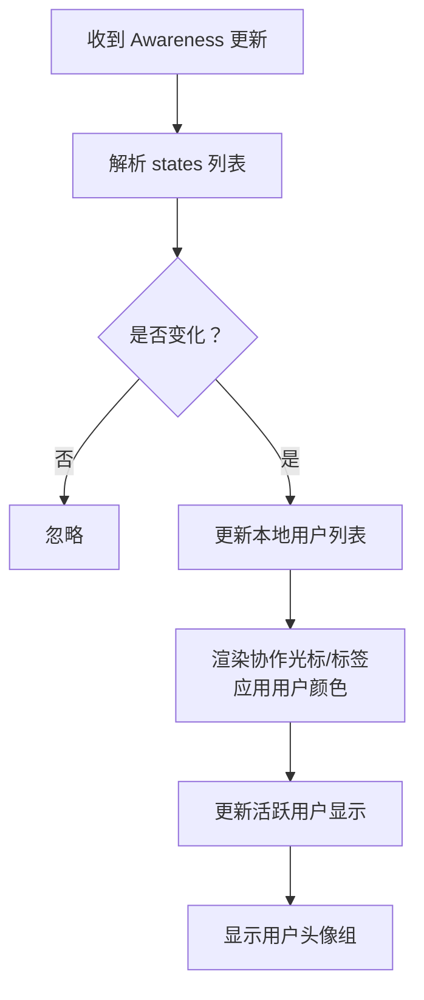
```mermaid
flowchart TD
A["收到 Awareness 更新"] --> B["解析 states 列表"]
B --> C{"是否变化？"}
C --> |否| D["忽略"]
C --> |是| E["更新本地用户列表"]
E --> F["渲染协作光标/标签<br/>应用用户颜色"]
F --> G["更新活跃用户显示"]
G --> H["显示用户头像组"]
```

**图表来源**
- [packages/plugin-main/src/pages/Journals/JournalEditor/index.tsx](file://packages/plugin-main/src/pages/Journals/JournalEditor/index.tsx#L27-L34)
- [packages/plugin-main/src/pages/SpaceDetail/PageEditor/index.tsx](file://packages/plugin-main/src/pages/SpaceDetail/PageEditor/index.tsx#L97-L109)
- [packages/editor/src/styles/editor.ts](file://packages/editor/src/styles/editor.ts#L793-L845)
- [packages/editor/src/editor/utilities.ts](file://packages/editor/src/editor/utilities.ts#L1-L55)

**章节来源**
- [packages/editor/src/styles/editor.ts](file://packages/editor/src/styles/editor.ts#L793-L845)
- [packages/editor/src/editor/utilities.ts](file://packages/editor/src/editor/utilities.ts#L1-L55)
- [packages/plugin-main/src/pages/SpaceDetail/PageEditor/index.tsx](file://packages/plugin-main/src/pages/SpaceDetail/PageEditor/index.tsx#L317-L333)

### 即时消息系统与WebSocket通信
- WebSocket 连接管理：提供完整的连接建立、心跳检测、错误处理和自动重连机制。
- 消息类型：支持 TEXT、IMAGE、FILE、LINK 等多种消息内容类型。
- 状态跟踪：实时跟踪消息发送状态（SENT、DELIVERED、READ）和未读消息数量。
- 心跳机制：定期发送 PING/PONG 消息维持连接有效性。
- 消息中心集成：支持协作邀请通知的实时推送和解析。
- 安全连接：使用wss://kotion.top:888确保消息传输的安全性。

**更新** 即时消息系统现使用wss://kotion.top:888进行安全的WebSocket通信，提供加密的消息传输通道。

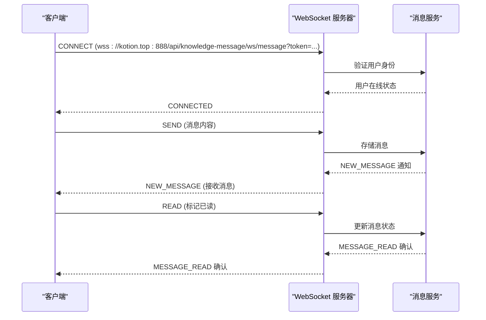
```mermaid
sequenceDiagram
participant C as "客户端"
participant WS as "WebSocket 服务器"
participant S as "消息服务"
C->>WS : CONNECT (wss : //kotion.top : 888/api/knowledge-message/ws/message?token=...)
WS->>S : 验证用户身份
S-->>WS : 用户在线状态
WS-->>C : CONNECTED
C->>WS : SEND (消息内容)
WS->>S : 存储消息
S-->>WS : NEW_MESSAGE 通知
WS-->>C : NEW_MESSAGE (接收消息)
C->>WS : READ (标记已读)
WS->>S : 更新消息状态
S-->>WS : MESSAGE_READ 确认
WS-->>C : MESSAGE_READ 确认
```

**图表来源**
- [packages/core/src/hooks/use-instant-message.ts](file://packages/core/src/hooks/use-instant-message.ts#L216-L265)
- [packages/core/src/hooks/use-instant-message.ts](file://packages/core/src/hooks/use-instant-message.ts#L160-L176)

**章节来源**
- [packages/core/src/hooks/use-instant-message.ts](file://packages/core/src/hooks/use-instant-message.ts#L1-L359)
- [packages/core/src/components/MessageBox/index.tsx](file://packages/core/src/components/MessageBox/index.tsx#L33-L69)

### 冲突检测与自动合并机制
- Yjs CRDT：基于有界因果复制（CRDT）的数据结构，天然支持无锁并发写入与自动合并，无需传统"操作转换（OT）"。
- 本地历史与映射：编辑器内部维护本地事务历史，当收到远端变更时，通过映射与重映射（mapping/rebased）调整本地步骤，保证一致性。
- 选择与事务：过滤掉由协作引发的事务，避免互相覆盖；同时对节点选择与文本选择进行过滤，减少冲突场景。

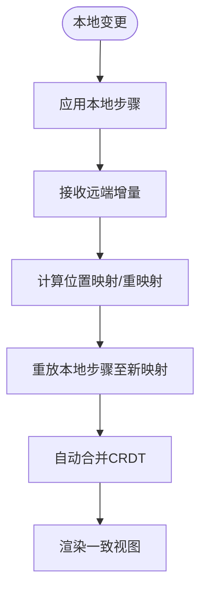
```mermaid
flowchart TD
Start(["本地变更"]) --> ApplyLocal["应用本地步骤"]
ApplyLocal --> Remote["接收远端增量"]
Remote --> Map["计算位置映射/重映射"]
Map --> Rebase["重放本地步骤至新映射"]
Rebase --> Merge["自动合并CRDT"]
Merge --> Render["渲染一致视图"]
```

**图表来源**
- [packages/editor/src/extensions/undo-redo/history.ts](file://packages/editor/src/extensions/undo-redo/history.ts#L72-L204)
- [packages/editor/src/extensions/selection/selection.ts](file://packages/editor/src/extensions/selection/selection.ts#L75-L106)

**章节来源**
- [packages/editor/src/extensions/undo-redo/history.ts](file://packages/editor/src/extensions/undo-redo/history.ts#L72-L204)
- [packages/editor/src/extensions/selection/selection.ts](file://packages/editor/src/extensions/selection/selection.ts#L75-L106)

### 拖拽光标与滚动行为（协作友好）
- 拖拽光标：在文档内容变化时，动态更新拖拽光标的位置与覆盖层，避免因文档尺寸变化导致的光标错位。
- 协作场景下的选择过滤：防止协作过程中由观察器触发的选择覆盖，保持节点选择与文本选择的一致性。

**章节来源**
- [packages/editor/src/extensions/dropcursor/prosemirror-dropcursor.ts](file://packages/editor/src/extensions/dropcursor/prosemirror-dropcursor.ts#L42-L88)
- [packages/editor/src/extensions/selection/selection.ts](file://packages/editor/src/extensions/selection/selection.ts#L75-L106)

### 子文档协作支持
- 嵌套文档：支持在编辑器中创建子文档（SyncBlock），每个子文档拥有独立的协作空间。
- 文档隔离：通过格式化的文档键（space:|page:|block:）实现文档间的完全隔离。
- 独立同步：子文档可以独立同步，不影响主文档的协作状态。

**章节来源**
- [packages/editor/src/extensions/sync-block/SyncBlock.tsx](file://packages/editor/src/extensions/sync-block/SyncBlock.tsx#L27-L87)

## 协作邀请系统

### 邀请API设计
协作邀请系统提供了完整的邀请流程管理，包括邀请创建、验证、接受和消息中心通知。

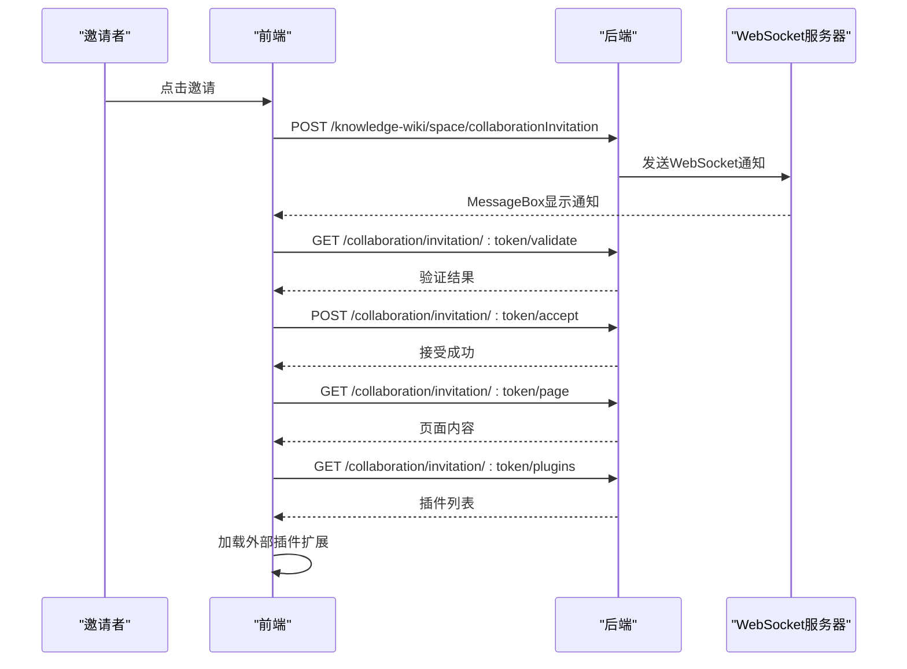
```mermaid
sequenceDiagram
participant Inviter as "邀请者"
participant Frontend as "前端"
participant Backend as "后端"
participant WS as "WebSocket服务器"
Inviter->>Frontend : 点击邀请
Frontend->>Backend : POST /knowledge-wiki/space/collaborationInvitation
Backend->>WS : 发送WebSocket通知
WS-->>Frontend : MessageBox显示通知
Frontend->>Backend : GET /collaboration/invitation/ : token/validate
Backend-->>Frontend : 验证结果
Frontend->>Backend : POST /collaboration/invitation/ : token/accept
Backend-->>Frontend : 接受成功
Frontend->>Backend : GET /collaboration/invitation/ : token/page
Backend-->>Frontend : 页面内容
Frontend->>Backend : GET /collaboration/invitation/ : token/plugins
Backend-->>Frontend : 插件列表
Frontend->>Frontend : 加载外部插件扩展
```

**图表来源**
- [packages/plugin-main/docs/COLLABORATION_API.md](file://packages/plugin-main/docs/COLLABORATION_API.md#L16-L61)
- [packages/plugin-main/src/api/index.ts](file://packages/plugin-main/src/api/index.ts#L100-L171)

### 邀请流程实现
- 邀请创建：支持通过用户ID或邮箱邀请，自动发送WebSocket通知到被邀请者的消息中心。
- 邀请验证：邀请链接点击后验证token有效性，检查过期和撤销状态。
- 邀请接受：自动接受待处理的邀请，更新数据库状态并返回成功响应。
- 插件共享：加载邀请方安装的编辑器插件，确保协作双方编辑体验一致。

**章节来源**
- [packages/plugin-main/src/pages/InviteCollaboration/index.tsx](file://packages/plugin-main/src/pages/InviteCollaboration/index.tsx#L183-L240)
- [packages/plugin-main/src/api/index.ts](file://packages/plugin-main/src/api/index.ts#L152-L171)
- [packages/plugin-main/docs/COLLABORATION_API.md](file://packages/plugin-main/docs/COLLABORATION_API.md#L537-L754)

### 消息中心集成
- WebSocket通知：邀请创建时自动发送NEW_MESSAGE类型的WebSocket通知。
- 消息解析：MessageBox组件自动识别协作邀请消息并提取邀请链接。
- 导航支持：点击消息自动导航到协作编辑器页面。

**章节来源**
- [packages/core/src/components/MessageBox/index.tsx](file://packages/core/src/components/MessageBox/index.tsx#L55-L69)
- [packages/core/src/hooks/use-instant-message.ts](file://packages/core/src/hooks/use-instant-message.ts#L173-L177)

### 外部插件加载机制
- 动态脚本加载：根据插件元数据动态加载协作方的编辑器扩展。
- 扩展合并：将外部插件的编辑器扩展与当前用户插件合并。
- 错误处理：插件加载失败时优雅降级，使用当前用户默认插件。

**章节来源**
- [packages/common/src/core/PluginManager.ts](file://packages/common/src/core/PluginManager.ts#L440-L484)
- [packages/plugin-main/src/pages/InviteCollaboration/index.tsx](file://packages/plugin-main/src/pages/InviteCollaboration/index.tsx#L218-L232)

## room-server包实现

### 包结构与配置
- 包名称：@kn/room-server，版本0.0.16
- 主入口：src/server.mjs
- 依赖管理：使用npm脚本管理开发和生产环境
- Docker支持：提供完整的Dockerfile和构建脚本

**章节来源**
- [packages/room-server/package.json](file://packages/room-server/package.json#L1-L32)
- [packages/room-server/Dockerfile](file://packages/room-server/Dockerfile#L1-L28)

### 服务器配置
- 扩展注册：通过Server.configure方法注册各种扩展
- 环境变量：PORT、DB_HOST、DB_PASSWORD、DB_USERNAME、DB_PORT、DB_DATABASE等
- 扩展选择：MySQL插件、Redis扩展、SQLite扩展、Logger扩展可按需启用
- 端口配置：默认1234端口，可通过环境变量修改
- SSL配置：支持SSL证书配置，通过SSL_ENABLED、SSL_KEY_PATH、SSL_CERT_PATH环境变量控制

**章节来源**
- [packages/room-server/src/server.mjs](file://packages/room-server/src/server.mjs#L30-L59)

### MySQL插件架构
- 类继承：Mysql类继承自Database基类
- 连接池：使用mysql原生驱动建立数据库连接
- 错误处理：监听数据库错误并自动重建连接
- 健康检查：定时执行ping操作监控连接状态
- 数据操作：实现fetch和store方法进行文档读写

**更新** MySQL插件增强了连接健康检查机制，定时执行ping操作监控连接状态，提供更稳定的数据库连接管理。

**章节来源**
- [packages/room-server/src/plugin/mysql/MysqlPlugin.mjs](file://packages/room-server/src/plugin/mysql/MysqlPlugin.mjs#L21-L124)

### Docker容器化部署
- 基础镜像：node:22-alpine
- 工作目录：/app
- 依赖安装：仅安装生产依赖
- 端口暴露：1234端口
- 环境变量：PORT=1234，NODE_ENV=production，SSL_ENABLED=false
- SSL证书：支持从/usr/share/nginx/kotion.top.key和/usr/share/nginx/kotion.top.pem加载证书
- 启动命令：node ./src/server.mjs

**更新** Docker容器化部署新增Nginx反向代理支持，通过docker-compose.yml配置Nginx和room-server的服务编排。

**章节来源**
- [packages/room-server/Dockerfile](file://packages/room-server/Dockerfile#L1-L28)
- [packages/room-server/docker-compose.yml](file://packages/room-server/docker-compose.yml#L1-L39)

## 环境配置与部署

### 环境变量配置
项目采用统一的环境变量管理系统，支持多环境协作服务器URL配置：

- 开发环境：VITE_COLLABORATION_WS_URL=ws://kotion.top:1234
- 生产环境：VITE_COLLABORATION_WS_URL=ws://kotion.top:1234
- API基础URL：VITE_API_BASE_URL=https://kotion.top:888/api
- 插件上传URL：VITE_PLUGIN_UPLOAD_URL=https://kotion.top:888/api/knowledge-resource/oss/endpoint/put-file

**更新** 环境变量配置保持不变，WebSocket URL仍为ws://kotion.top:1234，实际连接通过Nginx反向代理转换为wss://kotion.top:8877/ws。

**章节来源**
- [.env.example](file://.env.example#L1-L24)
- [apps/vite/.env.development](file://apps/vite/.env.development#L1-L24)
- [apps/vite/.env.production](file://apps/vite/.env.production#L1-L24)

### Nginx反向代理配置
项目使用Nginx提供SSL终止和WebSocket升级支持，实现安全的实时协作连接：

- SSL端口：8877端口（WebSocket专用）
- 服务器名称：kotion.top
- SSL证书：/usr/share/nginx/kotion.top.pem
- SSL私钥：/usr/share/nginx/kotion.top.key
- WebSocket代理：将/ws路径转发到192.168.3.43:1234
- 反向代理：将/api/路径转发到192.168.3.43:88
- WebSocket升级：自动处理Upgrade头部和Connection: upgrade
- 超时设置：连接超时7天，适合长连接的WebSocket

**更新** 新增Nginx反向代理配置，提供SSL终止、WebSocket升级和负载均衡支持，WebSocket URL从ws://kotion.top:1234更新为wss://kotion.top:8877/ws。

**章节来源**
- [packages/room-server/nginx/nginx.conf](file://packages/room-server/nginx/nginx.conf#L40-L134)
- [packages/room-server/docker-compose.yml](file://packages/room-server/docker-compose.yml#L1-L39)

### 即时消息WebSocket配置
即时消息系统使用wss://kotion.top:888进行安全的WebSocket通信：

- WebSocket URL：wss://kotion.top:888/api/knowledge-message/ws/message
- 认证方式：通过token参数传递JWT令牌
- 协议升级：自动从http升级到wss
- 心跳机制：30秒心跳检测，3秒重连延迟

**更新** 即时消息系统现使用wss://kotion.top:888确保消息传输的安全性，与协作服务器的SSL配置保持一致。

**章节来源**
- [packages/core/src/hooks/use-instant-message.ts](file://packages/core/src/hooks/use-instant-message.ts#L74-L81)

### 多环境部署策略
- 开发环境：使用ws://kotion.top:1234进行本地开发测试
- 测试环境：使用相同的URL配置，但指向测试服务器
- 生产环境：使用kotion.top域名，通过Nginx提供SSL加密
- 环境隔离：通过不同的.env文件实现环境隔离和配置管理

**章节来源**
- [apps/vite/vite.config.ts](file://apps/vite/vite.config.ts#L15-L23)
- [apps/landing-page-vite/vite.config.ts](file://apps/landing-page-vite/vite.config.ts#L21-L30)

## 依赖关系分析
- 前端依赖：@hocuspocus/provider、@hocuspocus/server、y-protocols、yjs 等，用于建立 WebSocket 连接、协议编解码与文档同步。
- 服务器扩展：@hocuspocus/extension-database、@hocuspocus/extension-redis、@hocuspocus/extension-logger、@hocuspocus/extension-sqlite 等，分别负责持久化、分布式锁与广播、日志记录和SQLite支持。
- room-server包：独立的协作服务器实现，提供模块化的扩展支持和Docker容器化部署。
- 环境配置：统一的环境变量管理，支持多环境协作服务器URL配置。
- 即时消息依赖：WebSocket 连接、心跳检测、自动重连等核心功能。
- 协作邀请依赖：消息中心集成、WebSocket通知格式、API路由配置。
- Nginx依赖：反向代理、SSL终止、WebSocket升级支持。

**更新** 新增Nginx依赖关系，提供SSL终止和WebSocket升级支持，增强协作服务器的安全性和可靠性。

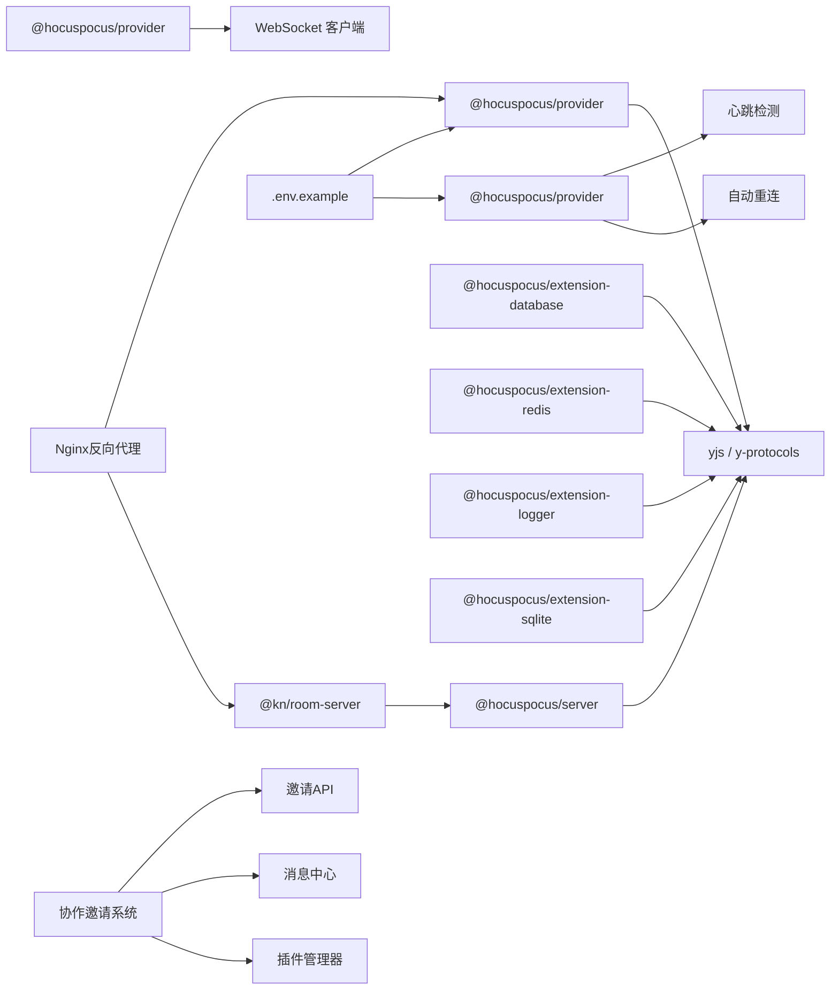
```mermaid
graph LR
Prov["@hocuspocus/provider"] --> YJS["yjs / y-protocols"]
RS["@kn/room-server"] --> HPS["@hocuspocus/server"]
HPS --> YJS
DBExt["@hocuspocus/extension-database"] --> YJS
RedisExt["@hocuspocus/extension-redis"] --> YJS
LoggerExt["@hocuspocus/extension-logger"] --> YJS
SQLiteExt["@hocuspocus/extension-sqlite"] --> YJS
WS["@hocuspocus/provider"] --> WSClient["WebSocket 客户端"]
IM["@hocuspocus/provider"] --> Heartbeat["心跳检测"]
IM --> Reconnect["自动重连"]
ENV[".env.example"] --> Prov
ENV --> IM
INV["协作邀请系统"] --> API["邀请API"]
INV --> MC["消息中心"]
INV --> PM["插件管理器"]
NGINX["Nginx反向代理"] --> Prov
NGINX --> RS
```

**图表来源**
- [pnpm-lock.yaml](file://pnpm-lock.yaml#L11587-L11597)
- [pnpm-lock.yaml](file://pnpm-lock.yaml#L11559-L11597)
- [packages/core/src/hooks/use-instant-message.ts](file://packages/core/src/hooks/use-instant-message.ts#L1-L359)
- [packages/plugin-main/src/api/index.ts](file://packages/plugin-main/src/api/index.ts#L100-L171)
- [.env.example](file://.env.example#L1-L24)

**章节来源**
- [pnpm-lock.yaml](file://pnpm-lock.yaml#L11587-L11597)
- [pnpm-lock.yaml](file://pnpm-lock.yaml#L11559-L11597)
- [packages/plugin-main/src/api/index.ts](file://packages/plugin-main/src/api/index.ts#L100-L171)
- [.env.example](file://.env.example#L1-L24)

## 性能考量
- 传输与映射：Yjs 的增量传输与映射机制显著降低带宽占用；在高并发场景下，建议启用 Redis 扩展以提升广播效率。
- 历史压缩：编辑器内部对历史分支进行压缩与重映射，减少内存占用与重放成本。
- UI 渲染：在大量协作光标同时出现时，建议按需渲染与节流，避免频繁重绘。
- 断线重连：Provider 默认具备重连策略，建议在业务层根据网络状态调整重试间隔与最大重试次数。
- 即时消息优化：WebSocket 连接池管理、消息队列缓冲、心跳间隔优化等措施提升实时通信性能。
- 内存管理：及时清理协作提供者资源，避免内存泄漏；合理使用 React.memo 和 useMemo 优化组件渲染。
- 外部插件加载：批量加载插件时使用Promise.allSettled，避免单个插件失败影响整体加载。
- room-server优化：采用连接池管理数据库连接，定时健康检查，自动重连机制提升服务器稳定性。
- 环境配置优化：统一的环境变量管理减少配置错误，支持多环境差异化配置。
- Nginx优化：反向代理缓存、连接池管理、SSL会话复用等措施提升WebSocket性能。

**更新** 新增Nginx性能优化建议，包括反向代理缓存、连接池管理和SSL会话复用，提升WebSocket连接性能。

## 故障排查指南
- 连接失败
  - 检查room-server端口与网络可达性；确认环境变量配置正确。
  - 查看room-server日志输出，定位连接与握手阶段问题。
  - 验证MySQL数据库连接参数和网络连通性。
  - 确认SSL证书配置正确，检查证书文件路径。
  - 验证Nginx反向代理配置，检查WebSocket升级是否正常。
- 文档未同步
  - 确认文档名称（room）一致；检查 Provider 的 onSynced 是否触发。
  - 若使用MySQL插件，确认拉取/存储逻辑正常，必要时手动校验数据库表结构。
  - 验证环境变量VITE_COLLABORATION_WS_URL配置正确。
- 光标异常
  - 检查 Awareness 回调是否被正确订阅；核对用户颜色分配逻辑。
  - 关注选择过滤插件，避免协作期间的选择覆盖导致光标错位。
- 拖拽光标错位
  - 确保文档内容变化后及时更新拖拽光标覆盖层；检查 resolve 位置是否正确。
- 即时消息问题
  - 检查 WebSocket 连接状态和心跳机制；验证认证令牌有效性。
  - 确认wss://kotion.top:888连接可用，检查SSL证书配置。
  - 查看消息发送/接收日志，确认消息类型和内容格式正确。
- 协作邀请问题
  - 检查邀请API响应状态和消息中心通知是否正常。
  - 验证邀请token格式和有效期，确认消息中心消息解析正确。
  - 测试外部插件加载机制，确保协作方插件正确加载。
- 性能问题
  - 监控内存使用情况，检查是否存在内存泄漏。
  - 优化大型文档的渲染性能，考虑分页加载或虚拟滚动。
  - 监控WebSocket连接数和消息吞吐量，必要时增加服务器实例。
  - 检查room-server的数据库连接池配置和健康检查机制。
  - 验证环境变量配置，确保正确的协作服务器URL。
  - 监控Nginx反向代理性能，检查SSL会话复用和连接池配置。
- room-server部署问题
  - 验证Docker容器是否正确构建和运行。
  - 检查环境变量配置和端口映射。
  - 确认MySQL数据库服务可用性和网络连通性。
  - 检查SSL证书文件权限和路径配置。
  - 验证Nginx配置文件语法和证书路径。
- 环境配置问题
  - 验证.env文件配置正确，检查VITE_COLLABORATION_WS_URL格式。
  - 确认不同环境的配置文件（.env.development、.env.production）正确加载。
  - 检查环境变量优先级和覆盖关系。
  - 验证Nginx反向代理配置与room-server端口映射。

**更新** 新增Nginx反向代理故障排查指南，涵盖SSL终止、WebSocket升级和连接池配置问题。

**章节来源**
- [packages/room-server/src/server.mjs](file://packages/room-server/src/server.mjs#L1-L59)
- [packages/room-server/src/plugin/mysql/MysqlPlugin.mjs](file://packages/room-server/src/plugin/mysql/MysqlPlugin.mjs#L1-L124)
- [packages/editor/src/styles/editor.ts](file://packages/editor/src/styles/editor.ts#L793-L845)
- [packages/editor/src/extensions/selection/selection.ts](file://packages/editor/src/extensions/selection/selection.ts#L75-L106)
- [packages/editor/src/extensions/dropcursor/prosemirror-dropcursor.ts](file://packages/editor/src/extensions/dropcursor/prosemirror-dropcursor.ts#L42-L88)
- [packages/core/src/hooks/use-instant-message.ts](file://packages/core/src/hooks/use-instant-message.ts#L216-L265)
- [packages/plugin-main/src/pages/InviteCollaboration/index.tsx](file://packages/plugin-main/src/pages/InviteCollaboration/index.tsx#L183-L240)
- [.env.example](file://.env.example#L1-L24)

## 结论
本项目采用 Yjs + room-server 的协作方案，通过新的room-server包与服务器扩展实现低耦合、可扩展的实时协作能力。前端侧重于编辑器体验与用户状态呈现，服务器侧通过重构的MySQL插件和模块化扩展保障持久化与广播效率。配合 CRDT 的自动合并机制与本地历史映射，系统在高并发与弱网环境下仍能保持一致性与稳定性。

**更新** 新版本进一步完善了协作服务器架构，采用Nginx反向代理和SSL终止，WebSocket URL从ws://kotion.top:1234更新为wss://kotion.top:8877/ws，提供更安全可靠的实时协作解决方案。系统现已支持完整的邀请流程、消息中心集成、外部插件共享和统一的环境变量配置管理，为用户提供无缝的协作体验。

## 附录

### 代码示例路径（配置与事件处理）
- 初始化 Provider 与文档同步
  - [packages/plugin-main/src/pages/Journals/JournalEditor/index.tsx](file://packages/plugin-main/src/pages/Journals/JournalEditor/index.tsx#L20-L42)
  - [packages/plugin-main/src/pages/SpaceDetail/PageEditor/index.tsx](file://packages/plugin-main/src/pages/SpaceDetail/PageEditor/index.tsx#L88-L126)
  - [packages/plugin-main/src/pages/InviteCollaboration/index.tsx](file://packages/plugin-main/src/pages/InviteCollaboration/index.tsx#L124-L158)
- 编辑器组件与扩展加载
  - [packages/editor/src/editor/collaboration.tsx](file://packages/editor/src/editor/collaboration.tsx#L56-L82)
  - [packages/editor/src/editor/use-extension.ts](file://packages/editor/src/editor/use-extension.ts#L1-L63)
- room-server配置与扩展注册
  - [packages/room-server/src/server.mjs](file://packages/room-server/src/server.mjs#L30-L59)
- MySQL插件实现
  - [packages/room-server/src/plugin/mysql/MysqlPlugin.mjs](file://packages/room-server/src/plugin/mysql/MysqlPlugin.mjs#L21-L124)
- 协作光标样式
  - [packages/editor/src/styles/editor.ts](file://packages/editor/src/styles/editor.ts#L793-L845)
- 用户颜色分配
  - [packages/editor/src/editor/utilities.ts](file://packages/editor/src/editor/utilities.ts#L1-L55)
- 历史与映射（自动合并）
  - [packages/editor/src/extensions/undo-redo/history.ts](file://packages/editor/src/extensions/undo-redo/history.ts#L72-L204)
- 选择过滤（协作友好）
  - [packages/editor/src/extensions/selection/selection.ts](file://packages/editor/src/extensions/selection/selection.ts#L75-L106)
- 拖拽光标（协作友好）
  - [packages/editor/src/extensions/dropcursor/prosemirror-dropcursor.ts](file://packages/editor/src/extensions/dropcursor/prosemirror-dropcursor.ts#L42-L88)
- 子文档协作
  - [packages/editor/src/extensions/sync-block/SyncBlock.tsx](file://packages/editor/src/extensions/sync-block/SyncBlock.tsx#L27-L87)
- 即时消息系统
  - [packages/core/src/hooks/use-instant-message.ts](file://packages/core/src/hooks/use-instant-message.ts#L1-L359)
  - [packages/core/src/components/MessageBox/index.tsx](file://packages/core/src/components/MessageBox/index.tsx#L33-L69)
- 协作邀请系统
  - [packages/plugin-main/src/pages/InviteCollaboration/index.tsx](file://packages/plugin-main/src/pages/InviteCollaboration/index.tsx#L1-L617)
  - [packages/plugin-main/src/api/index.ts](file://packages/plugin-main/src/api/index.ts#L100-L171)
  - [packages/plugin-main/docs/COLLABORATION_API.md](file://packages/plugin-main/docs/COLLABORATION_API.md#L1-L806)
- 外部插件加载
  - [packages/common/src/core/PluginManager.ts](file://packages/common/src/core/PluginManager.ts#L440-L484)
- room-server包
  - [packages/room-server/package.json](file://packages/room-server/package.json#L1-L32)
  - [packages/room-server/Dockerfile](file://packages/room-server/Dockerfile#L1-L28)
- 环境配置管理
  - [.env.example](file://.env.example#L1-L24)
  - [apps/vite/.env.development](file://apps/vite/.env.development#L1-L24)
  - [apps/vite/.env.production](file://apps/vite/.env.production#L1-L24)
- Nginx反向代理配置
  - [packages/room-server/nginx/nginx.conf](file://packages/room-server/nginx/nginx.conf#L40-L134)
  - [packages/room-server/docker-compose.yml](file://packages/room-server/docker-compose.yml#L1-L39)