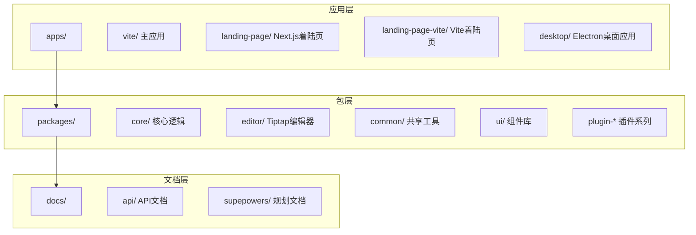
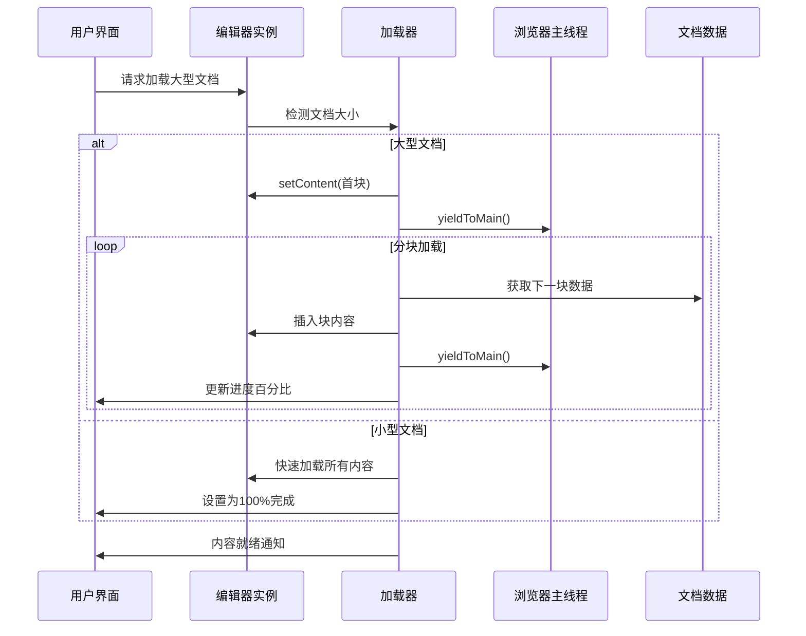
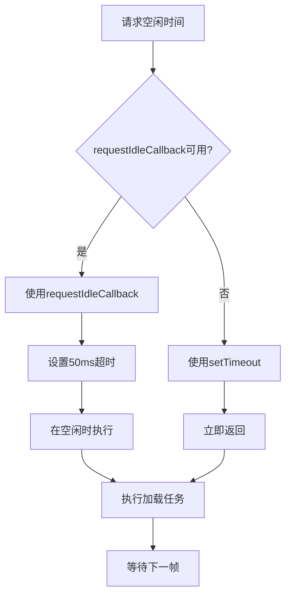
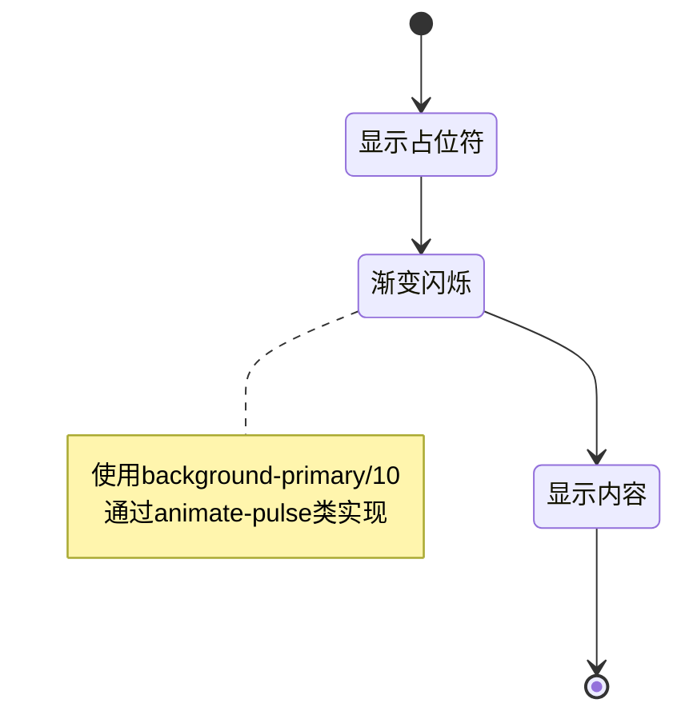
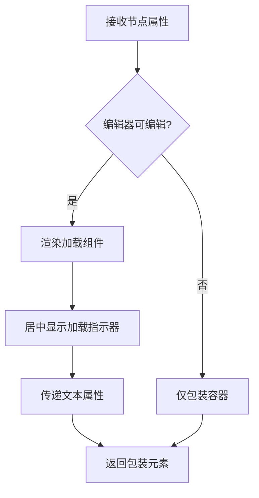
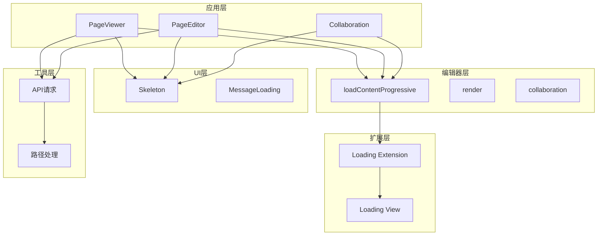

# 渐进式内容加载

<cite>
**本文档引用的文件**
- [README.md](file://README.md)
- [loadContentProgressive.ts](file://packages/editor/src/editor/loadContentProgressive.ts)
- [render.tsx](file://packages/editor/src/editor/render.tsx)
- [collaboration.tsx](file://packages/editor/src/editor/collaboration.tsx)
- [loading.ts](file://packages/editor/src/extensions/loading/loading.ts)
- [loading-view.tsx](file://packages/editor/src/extensions/loading/loading-view.tsx)
- [index.ts](file://packages/editor/src/extensions/loading/index.ts)
- [request.tsx](file://apps/landing-page-vite/src/utils/request.tsx)
- [use-path.ts](file://apps/landing-page-vite/src/utils/use-path.ts)
- [PageViewer/index.tsx](file://packages/plugin-main/src/pages/SpaceDetail/PageViewer/index.tsx)
- [PageEditor/index.tsx](file://packages/plugin-main/src/pages/SpaceDetail/PageEditor/index.tsx)
- [message-loading.tsx](file://packages/ui/src/components/ui/message-loading.tsx)
- [skeleton.tsx](file://packages/ui/src/components/ui/skeleton.tsx)
</cite>

## 目录
1. [简介](#简介)
2. [项目结构](#项目结构)
3. [核心组件](#核心组件)
4. [架构概览](#架构概览)
5. [详细组件分析](#详细组件分析)
6. [依赖关系分析](#依赖关系分析)
7. [性能考虑](#性能考虑)
8. [故障排除指南](#故障排除指南)
9. [结论](#结论)

## 简介

渐进式内容加载是知识库项目中的一个关键特性，旨在优化大型文档的渲染性能和用户体验。该系统通过将大量内容分块加载、在浏览器空闲时间执行以及提供进度反馈机制，确保应用程序在处理复杂文档时保持响应性和流畅性。

该项目采用现代化的前端技术栈，包括React 18、TypeScript 5、Tiptap富文本编辑器和实时协作功能。渐进式加载机制特别针对Tiptap文档编辑器进行了优化，能够智能识别大型文档并自动应用相应的加载策略。

## 项目结构

知识库项目采用Monorepo架构，主要包含以下关键目录：



**图表来源**
- [README.md:66-97](file://README.md#L66-L97)

**章节来源**
- [README.md:66-97](file://README.md#L66-L97)

## 核心组件

渐进式内容加载系统由多个相互协作的核心组件构成：

### 主要组件概述

1. **负载均衡器** - 智能检测文档大小并选择合适的加载策略
2. **分块加载器** - 将大型文档分割成可管理的块进行加载
3. **进度监控器** - 提供实时加载进度反馈
4. **空闲调度器** - 利用浏览器空闲时间执行加载任务
5. **骨架屏组件** - 在内容加载期间提供占位符界面

### 技术特性

- **自适应阈值**：文档超过200个顶级块或10万字符时触发渐进式加载
- **浏览器兼容性**：使用requestIdleCallback优先级，回退到setTimeout
- **内存优化**：避免撤销历史污染，保持编辑器性能
- **用户交互**：允许用户在加载过程中继续操作

**章节来源**
- [loadContentProgressive.ts:54-60](file://packages/editor/src/editor/loadContentProgressive.ts#L54-L60)
- [loadContentProgressive.ts:17-28](file://packages/editor/src/editor/loadContentProgressive.ts#L17-L28)

## 架构概览

渐进式内容加载系统采用分层架构设计，确保各个组件之间的清晰分离和高效协作：



**图表来源**
- [loadContentProgressive.ts:71-140](file://packages/editor/src/editor/loadContentProgressive.ts#L71-L140)
- [render.tsx:146-162](file://packages/editor/src/editor/render.tsx#L146-L162)

## 详细组件分析

### 负载均衡器 (loadContentProgressive)

负载均衡器是整个渐进式加载系统的核心，负责智能判断何时以及如何加载内容：

#### 核心算法

```mermaid
flowchart TD
A[开始加载] --> B{检查文档大小}
B --> |小型文档| C[快速加载所有内容]
B --> |大型文档| D[启用渐进式加载]
D --> E[加载首块内容]
E --> F[计算剩余块数]
F --> G{还有剩余块?}
G --> |是| H[创建块数组]
H --> I[循环处理每个块]
I --> J[转换为ProseMirror节点]
J --> K[插入到文档末尾]
K --> L[更新进度百分比]
L --> M[yieldToMain()]
M --> G
G --> |否| N[标记加载完成]
C --> O[设置100%进度]
N --> P[触发内容就绪事件]
O --> P
```

**图表来源**
- [loadContentProgressive.ts:71-140](file://packages/editor/src/editor/loadContentProgressive.ts#L71-L140)

#### 关键特性

- **智能分块**：默认每块40个顶级块，可根据需要调整
- **内存优化**：使用addToHistory: false避免撤销历史膨胀
- **错误处理**：直接事务失败时回退到高级命令
- **取消支持**：提供isCancelled回调以支持组件卸载

**章节来源**
- [loadContentProgressive.ts:71-140](file://packages/editor/src/editor/loadContentProgressive.ts#L71-L140)

### 进度监控器 (ProgressiveLoadOptions)

进度监控器提供了完整的加载状态跟踪机制：

#### 配置选项

| 选项名 | 类型 | 默认值 | 描述 |
|--------|------|--------|------|
| chunkSize | number | 40 | 每次加载的顶级块数量 |
| onProgress | (progress: number) => void | - | 进度回调函数 |
| isCancelled | () => boolean | - | 取消检查函数 |

#### 进度计算

```mermaid
flowchart LR
A[总块数] --> B[当前已加载块数]
B --> C[进度 = (已加载/总数) × 100%]
C --> D[范围限制 0-100]
D --> E[回调通知]
```

**图表来源**
- [loadContentProgressive.ts:4-11](file://packages/editor/src/editor/loadContentProgressive.ts#L4-L11)

**章节来源**
- [loadContentProgressive.ts:4-11](file://packages/editor/src/editor/loadContentProgressive.ts#L4-L11)

### 空闲调度器 (yieldToMain)

空闲调度器利用现代浏览器的空闲时间来执行非关键任务：

#### 实现策略



**图表来源**
- [loadContentProgressive.ts:17-28](file://packages/editor/src/editor/loadContentProgressive.ts#L17-L28)

#### 性能优势

- **响应性**：确保UI始终响应用户输入
- **平滑滚动**：避免加载过程中的卡顿
- **电池寿命**：减少不必要的CPU使用

**章节来源**
- [loadContentProgressive.ts:17-28](file://packages/editor/src/editor/loadContentProgressive.ts#L17-L28)

### 骨架屏组件 (Skeleton UI)

骨架屏组件为用户提供视觉反馈，改善感知性能：

#### 组件类型

| 组件名称 | 使用场景 | 特点 |
|----------|----------|------|
| Skeleton | 页面加载占位符 | 简单矩形动画 |
| MessageLoading | 消息加载指示器 | 三个点状动画 |
| PageViewer | 文档页面骨架 | 结构化布局 |

#### 动画效果

骨架屏使用CSS动画实现平滑的加载效果：



**图表来源**
- [skeleton.tsx:4-16](file://packages/ui/src/components/ui/skeleton.tsx#L4-L16)

**章节来源**
- [skeleton.tsx:4-16](file://packages/ui/src/components/ui/skeleton.tsx#L4-L16)
- [message-loading.tsx:1-49](file://packages/ui/src/components/ui/message-loading.tsx#L1-L49)

### 加载扩展 (Loading Extension)

加载扩展为编辑器提供专门的加载节点支持：

#### 扩展配置

| 属性 | 值 | 说明 |
|------|-----|------|
| 名称 | loading | 节点标识符 |
| 类型 | 块级元素 | 不可选中、不可拖拽 |
| 原子性 | 是 | 作为独立单元处理 |
| HTML属性 | class: "loading" | 样式标识 |

#### 视图渲染

加载视图根据编辑器可编辑状态动态调整：



**图表来源**
- [loading-view.tsx:14-30](file://packages/editor/src/extensions/loading/loading-view.tsx#L14-L30)

**章节来源**
- [loading.ts:5-52](file://packages/editor/src/extensions/loading/loading.ts#L5-L52)
- [loading-view.tsx:14-30](file://packages/editor/src/extensions/loading/loading-view.tsx#L14-L30)

## 依赖关系分析

渐进式内容加载系统的依赖关系体现了清晰的分层架构：



**图表来源**
- [render.tsx:127-169](file://packages/editor/src/editor/render.tsx#L127-L169)
- [collaboration.tsx:166-218](file://packages/editor/src/editor/collaboration.tsx#L166-L218)

### 关键依赖链

1. **应用层 → 编辑器层**：页面组件通过编辑器API访问加载功能
2. **编辑器层 → 扩展层**：加载器依赖专门的加载扩展提供节点支持
3. **UI层 → 应用层**：骨架屏组件为页面组件提供加载状态显示
4. **工具层 → 应用层**：API请求和路径处理为内容加载提供数据支持

**章节来源**
- [render.tsx:127-169](file://packages/editor/src/editor/render.tsx#L127-L169)
- [collaboration.tsx:166-218](file://packages/editor/src/editor/collaboration.tsx#L166-L218)

## 性能考虑

渐进式内容加载系统在设计时充分考虑了性能优化：

### 内存管理

- **增量加载**：避免一次性将所有内容加载到内存
- **节点复用**：重用ProseMirror节点对象减少内存分配
- **垃圾回收**：及时释放不再使用的临时对象

### CPU优化

- **空闲调度**：利用浏览器空闲时间执行非关键任务
- **批量处理**：将多个小操作合并为批处理
- **防抖机制**：避免频繁的状态更新

### 网络优化

- **懒加载**：只在需要时加载相关资源
- **缓存策略**：合理利用浏览器缓存机制
- **并发控制**：限制同时进行的网络请求数量

## 故障排除指南

### 常见问题及解决方案

#### 加载性能问题

**症状**：大型文档加载缓慢或卡顿

**诊断步骤**：
1. 检查文档块数量是否超过阈值（200块）
2. 验证chunkSize配置是否合理
3. 确认浏览器空闲调度是否正常工作

**解决方案**：
- 调整chunkSize参数（建议50-100）
- 检查是否有内存泄漏
- 优化文档结构减少嵌套层级

#### 进度显示异常

**症状**：进度条不更新或显示错误百分比

**诊断步骤**：
1. 验证onProgress回调是否正确绑定
2. 检查isCancelled函数的返回值
3. 确认进度计算逻辑

**解决方案**：
- 确保回调函数在组件生命周期内有效
- 检查取消标志的正确设置
- 验证进度计算的边界条件

#### 内存溢出错误

**症状**：浏览器崩溃或内存使用过高

**诊断步骤**：
1. 检查文档大小估算是否准确
2. 验证节点转换过程中的错误处理
3. 确认内存清理机制是否正常

**解决方案**：
- 实施更严格的内存监控
- 优化节点转换算法
- 增加内存使用警告

**章节来源**
- [loadContentProgressive.ts:108-130](file://packages/editor/src/editor/loadContentProgressive.ts#L108-L130)

### 开发调试技巧

#### 性能监控

使用浏览器开发者工具监控：
- JavaScript执行时间
- 内存使用情况
- 垃圾回收频率
- 网络请求性能

#### 日志记录

在关键节点添加日志：
- 文档大小检测结果
- 分块加载进度
- 错误处理分支
- 性能指标统计

## 结论

渐进式内容加载系统通过智能化的分块加载、空闲调度和进度反馈机制，显著提升了大型文档的处理能力和用户体验。该系统的设计充分考虑了现代Web应用的性能要求，采用了多种优化策略来确保在各种设备和网络条件下都能提供流畅的使用体验。

### 技术优势

1. **智能适应**：自动检测文档大小并选择最优加载策略
2. **用户友好**：提供实时进度反馈和骨架屏显示
3. **性能卓越**：利用浏览器空闲时间避免阻塞UI
4. **可扩展性**：模块化设计便于功能扩展和维护

### 未来发展方向

- **预加载策略**：实现智能预加载预测用户行为
- **离线支持**：增强离线环境下的内容加载能力
- **多线程处理**：探索Web Workers进行并行内容处理
- **AI优化**：利用机器学习优化加载策略选择

该系统为知识库平台提供了坚实的技术基础，能够有效支撑大规模文档管理和实时协作需求。