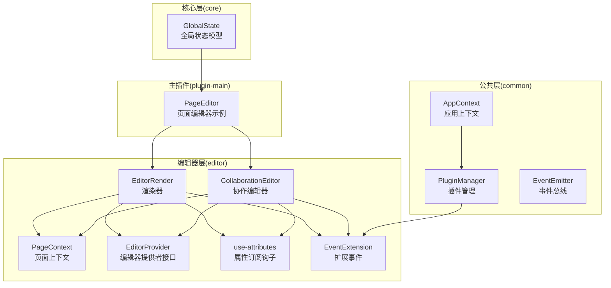
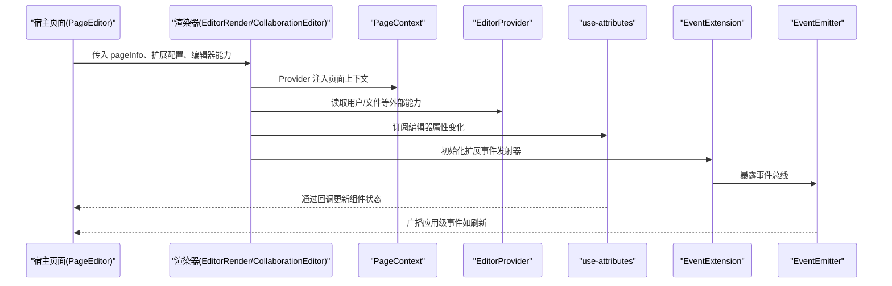
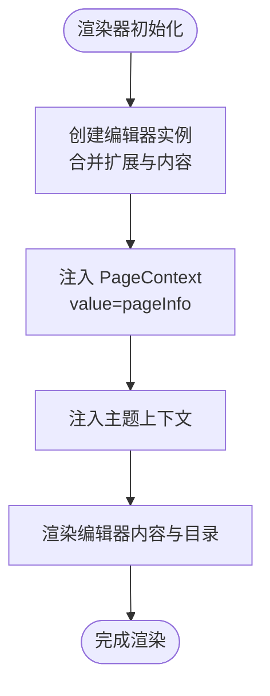
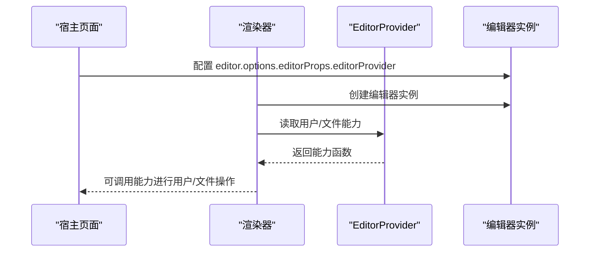
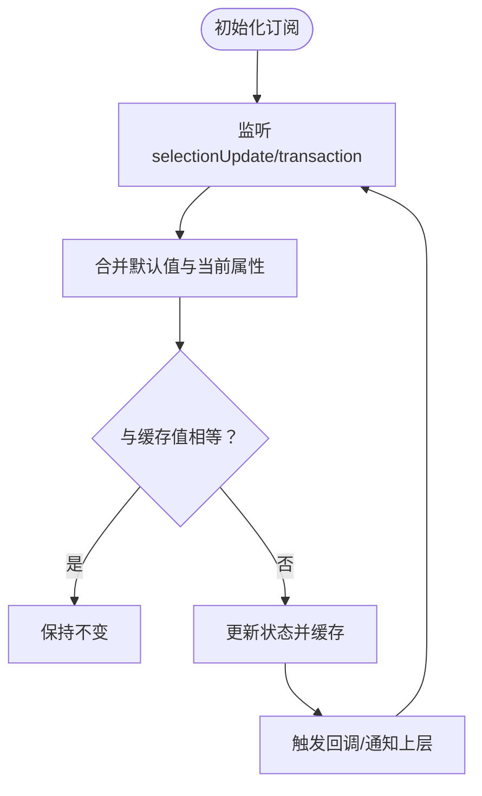
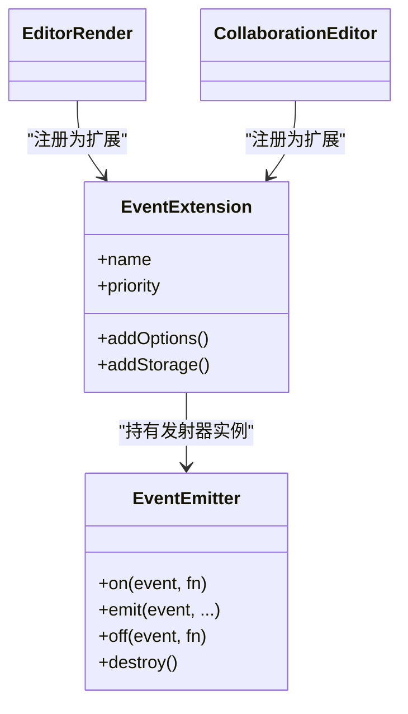
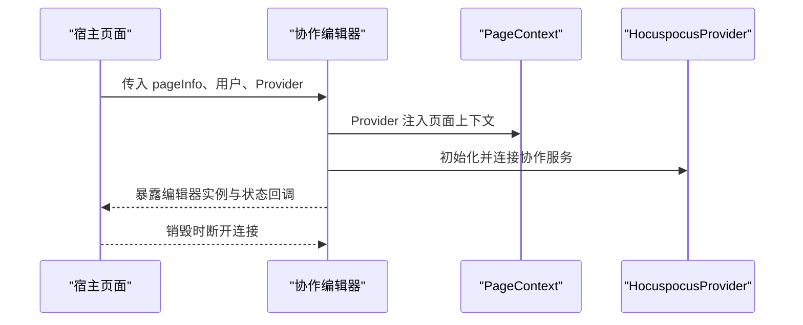
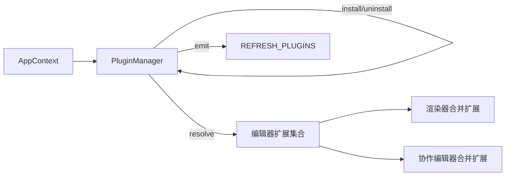
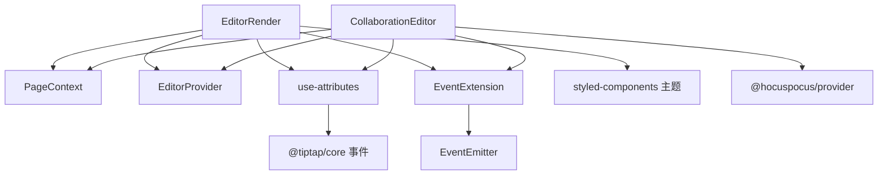

# 编辑器上下文管理

<cite>
**本文引用的文件**
- [packages/common/src/core/AppContext.ts](file://packages/common/src/core/AppContext.ts)
- [packages/common/src/core/PluginManager.ts](file://packages/common/src/core/PluginManager.ts)
- [packages/common/src/event/event.ts](file://packages/common/src/event/event.ts)
- [packages/core/src/store/GlobalState.ts](file://packages/core/src/store/GlobalState.ts)
- [packages/editor/src/editor/context.tsx](file://packages/editor/src/editor/context.tsx)
- [packages/editor/src/editor/provider.ts](file://packages/editor/src/editor/provider.ts)
- [packages/editor/src/editor/render.tsx](file://packages/editor/src/editor/render.tsx)
- [packages/editor/src/editor/collaboration.tsx](file://packages/editor/src/editor/collaboration.tsx)
- [packages/editor/src/hooks/use-attributes.tsx](file://packages/editor/src/hooks/use-attributes.tsx)
- [packages/editor/src/extensions/event/event.ts](file://packages/editor/src/extensions/event/event.ts)
- [packages/editor/src/extensions/event/index.ts](file://packages/editor/src/extensions/event/index.ts)
- [packages/plugin-main/src/pages/SpaceDetail/PageEditor/index.tsx](file://packages/plugin-main/src/pages/SpaceDetail/PageEditor/index.tsx)
</cite>

## 目录
1. [引言](#引言)
2. [项目结构](#项目结构)
3. [核心组件](#核心组件)
4. [架构总览](#架构总览)
5. [详细组件分析](#详细组件分析)
6. [依赖关系分析](#依赖关系分析)
7. [性能考量](#性能考量)
8. [故障排查指南](#故障排查指南)
9. [结论](#结论)
10. [附录：最佳实践与示例路径](#附录最佳实践与示例路径)

## 引言
本技术文档围绕编辑器上下文管理系统展开，目标是帮助读者理解编辑器上下文的设计目的、实现原理与使用方式。内容涵盖：
- 全局状态管理与用户信息传递
- 组件通信机制（React Context、事件总线）
- 上下文提供者（EditorProvider）的使用方法（状态订阅、事件监听、数据更新）
- 渲染系统工作原理（组件渲染、DOM 更新、性能优化）
- 与编辑器扩展的集成（扩展访问、状态共享、事件传播）
- 最佳实践（状态设计、性能与内存管理）

## 项目结构
本仓库采用多包（monorepo）组织，编辑器上下文相关的关键模块分布如下：
- 公共层（packages/common）：应用级上下文、插件管理、事件总线
- 核心层（packages/core）：全局状态模型
- 编辑器层（packages/editor）：页面上下文、渲染器、协作编辑器、扩展事件等
- 主插件（packages/plugin-main）：页面编辑器示例，演示上下文与状态的实际使用

图表来源
- [packages/common/src/core/AppContext.ts](file://packages/common/src/core/AppContext.ts#L1-L13)
- [packages/common/src/core/PluginManager.ts](file://packages/common/src/core/PluginManager.ts#L1-L170)
- [packages/common/src/event/event.ts](file://packages/common/src/event/event.ts#L1-L44)
- [packages/core/src/store/GlobalState.ts](file://packages/core/src/store/GlobalState.ts#L1-L32)
- [packages/editor/src/editor/context.tsx](file://packages/editor/src/editor/context.tsx#L1-L14)
- [packages/editor/src/editor/provider.ts](file://packages/editor/src/editor/provider.ts#L1-L53)
- [packages/editor/src/editor/render.tsx](file://packages/editor/src/editor/render.tsx#L1-L115)
- [packages/editor/src/editor/collaboration.tsx](file://packages/editor/src/editor/collaboration.tsx#L1-L141)
- [packages/editor/src/hooks/use-attributes.tsx](file://packages/editor/src/hooks/use-attributes.tsx#L1-L52)
- [packages/editor/src/extensions/event/event.ts](file://packages/editor/src/extensions/event/event.ts#L1-L18)
- [packages/editor/src/extensions/event/index.ts](file://packages/editor/src/extensions/event/index.ts#L1-L8)
- [packages/plugin-main/src/pages/SpaceDetail/PageEditor/index.tsx](file://packages/plugin-main/src/pages/SpaceDetail/PageEditor/index.tsx#L1-L200)

章节来源
- [packages/common/src/core/AppContext.ts](file://packages/common/src/core/AppContext.ts#L1-L13)
- [packages/common/src/core/PluginManager.ts](file://packages/common/src/core/PluginManager.ts#L1-L170)
- [packages/common/src/event/event.ts](file://packages/common/src/event/event.ts#L1-L44)
- [packages/core/src/store/GlobalState.ts](file://packages/core/src/store/GlobalState.ts#L1-L32)
- [packages/editor/src/editor/context.tsx](file://packages/editor/src/editor/context.tsx#L1-L14)
- [packages/editor/src/editor/provider.ts](file://packages/editor/src/editor/provider.ts#L1-L53)
- [packages/editor/src/editor/render.tsx](file://packages/editor/src/editor/render.tsx#L1-L115)
- [packages/editor/src/editor/collaboration.tsx](file://packages/editor/src/editor/collaboration.tsx#L1-L141)
- [packages/editor/src/hooks/use-attributes.tsx](file://packages/editor/src/hooks/use-attributes.tsx#L1-L52)
- [packages/editor/src/extensions/event/event.ts](file://packages/editor/src/extensions/event/event.ts#L1-L18)
- [packages/editor/src/extensions/event/index.ts](file://packages/editor/src/extensions/event/index.ts#L1-L8)
- [packages/plugin-main/src/pages/SpaceDetail/PageEditor/index.tsx](file://packages/plugin-main/src/pages/SpaceDetail/PageEditor/index.tsx#L1-L200)

## 核心组件
- 应用上下文（AppContext）
  - 提供插件管理器实例，作为应用级共享对象注入到组件树中
  - 便于跨页面、跨功能模块访问插件能力
- 页面上下文（PageContext）
  - 传递页面元信息（如空间 ID、页面 ID、标题、创建者等），用于渲染侧边目录、面包屑、权限控制等
- 编辑器提供者（EditorProvider）
  - 定义用户信息、文件上传下载等外部能力接口，由宿主环境注入到编辑器中
- 渲染器（EditorRender / CollaborationEditor）
  - 负责创建编辑器实例、挂载内容、渲染目录、提供主题与样式
  - 在根部以 Provider 形式注入 PageContext 与主题上下文
- 属性订阅钩子（use-attributes）
  - 订阅编辑器选区或事务变化，按需更新组件状态，避免全量重渲染
- 扩展事件（EventExtension）
  - 为编辑器扩展注入统一事件发射器，支持扩展间解耦通信
- 事件总线（EventEmitter）
  - 提供 on/emit/off/destroy 等基础能力，支撑应用级事件传播

章节来源
- [packages/common/src/core/AppContext.ts](file://packages/common/src/core/AppContext.ts#L1-L13)
- [packages/editor/src/editor/context.tsx](file://packages/editor/src/editor/context.tsx#L1-L14)
- [packages/editor/src/editor/provider.ts](file://packages/editor/src/editor/provider.ts#L1-L53)
- [packages/editor/src/editor/render.tsx](file://packages/editor/src/editor/render.tsx#L1-L115)
- [packages/editor/src/editor/collaboration.tsx](file://packages/editor/src/editor/collaboration.tsx#L1-L141)
- [packages/editor/src/hooks/use-attributes.tsx](file://packages/editor/src/hooks/use-attributes.tsx#L1-L52)
- [packages/editor/src/extensions/event/event.ts](file://packages/editor/src/extensions/event/event.ts#L1-L18)
- [packages/common/src/event/event.ts](file://packages/common/src/event/event.ts#L1-L44)

## 架构总览
编辑器上下文管理通过“上下文 + 钩子 + 事件”的组合实现：
- 上下文：PageContext 注入页面元信息；AppContext 注入插件管理器
- 钩子：use-attributes 基于编辑器事件驱动组件状态更新
- 事件：EventExtension 暴露统一事件发射器；EventEmitter 支撑应用级事件广播

图表来源
- [packages/plugin-main/src/pages/SpaceDetail/PageEditor/index.tsx](file://packages/plugin-main/src/pages/SpaceDetail/PageEditor/index.tsx#L1-L200)
- [packages/editor/src/editor/render.tsx](file://packages/editor/src/editor/render.tsx#L1-L115)
- [packages/editor/src/editor/collaboration.tsx](file://packages/editor/src/editor/collaboration.tsx#L1-L141)
- [packages/editor/src/hooks/use-attributes.tsx](file://packages/editor/src/hooks/use-attributes.tsx#L1-L52)
- [packages/editor/src/extensions/event/event.ts](file://packages/editor/src/extensions/event/event.ts#L1-L18)
- [packages/common/src/event/event.ts](file://packages/common/src/event/event.ts#L1-L44)

## 详细组件分析

### 页面上下文（PageContext）与渲染系统
- 设计目的
  - 将页面元信息（空间、页面、标题、创建者等）以 React Context 的形式向下传递，供目录、菜单、权限判断等组件使用
- 实现要点
  - 渲染器在根部以 Provider 包裹，将 pageInfo 作为上下文值注入
  - 渲染器同时负责主题与样式注入，确保编辑器区域具备一致的视觉表现
- 数据流
  - 宿主页面准备 pageInfo，渲染器接收后注入上下文
  - 子组件通过 useContext 读取上下文，结合 use-attributes 订阅编辑器状态，实现联动更新

图表来源
- [packages/editor/src/editor/render.tsx](file://packages/editor/src/editor/render.tsx#L1-L115)
- [packages/editor/src/editor/context.tsx](file://packages/editor/src/editor/context.tsx#L1-L14)

章节来源
- [packages/editor/src/editor/context.tsx](file://packages/editor/src/editor/context.tsx#L1-L14)
- [packages/editor/src/editor/render.tsx](file://packages/editor/src/editor/render.tsx#L1-L115)

### 编辑器提供者（EditorProvider）与用户/文件能力
- 设计目的
  - 抽象用户信息、文件上传下载等外部能力，使编辑器不直接依赖具体实现
- 接口定义
  - 用户能力：获取当前用户、查询用户列表
  - 文件能力：上传、下载、生成下载路径
- 使用方式
  - 宿主在创建编辑器时，将 EditorProvider 注入 editor.options.editorProps.editorProvider
  - 渲染器通过 getEditorProvider 读取并使用这些能力

图表来源
- [packages/editor/src/editor/provider.ts](file://packages/editor/src/editor/provider.ts#L1-L53)
- [packages/editor/src/editor/render.tsx](file://packages/editor/src/editor/render.tsx#L1-L115)

章节来源
- [packages/editor/src/editor/provider.ts](file://packages/editor/src/editor/provider.ts#L1-L53)
- [packages/editor/src/editor/render.tsx](file://packages/editor/src/editor/render.tsx#L1-L115)

### 属性订阅与组件通信（use-attributes）
- 设计目的
  - 将编辑器内部状态（如选区、节点属性）映射为组件可感知的状态，减少不必要的重渲染
- 工作原理
  - 订阅编辑器的 selectionUpdate 与 transaction 事件
  - 合并默认值与当前属性，使用深比较避免重复更新
  - 通过回调将最新值回传给宿主或上层组件
- 性能影响
  - 仅在属性变化且与缓存值不相等时更新，降低渲染成本

图表来源
- [packages/editor/src/hooks/use-attributes.tsx](file://packages/editor/src/hooks/use-attributes.tsx#L1-L52)

章节来源
- [packages/editor/src/hooks/use-attributes.tsx](file://packages/editor/src/hooks/use-attributes.tsx#L1-L52)

### 扩展事件与应用级事件传播
- 扩展事件（EventExtension）
  - 为编辑器扩展注入统一事件发射器，扩展之间可通过该发射器进行低耦合通信
- 应用级事件（EventEmitter）
  - 提供 on/emit/off/destroy 方法，支持应用内事件广播与清理
- 集成方式
  - 在渲染器中引入 EventExtension，使其成为编辑器扩展的一部分
  - 通过宿主页面或业务逻辑调用 emit 触发事件，订阅方响应处理

图表来源
- [packages/editor/src/extensions/event/event.ts](file://packages/editor/src/extensions/event/event.ts#L1-L18)
- [packages/editor/src/extensions/event/index.ts](file://packages/editor/src/extensions/event/index.ts#L1-L8)
- [packages/editor/src/editor/render.tsx](file://packages/editor/src/editor/render.tsx#L1-L115)
- [packages/editor/src/editor/collaboration.tsx](file://packages/editor/src/editor/collaboration.tsx#L1-L141)
- [packages/common/src/event/event.ts](file://packages/common/src/event/event.ts#L1-L44)

章节来源
- [packages/editor/src/extensions/event/event.ts](file://packages/editor/src/extensions/event/event.ts#L1-L18)
- [packages/editor/src/extensions/event/index.ts](file://packages/editor/src/extensions/event/index.ts#L1-L8)
- [packages/common/src/event/event.ts](file://packages/common/src/event/event.ts#L1-L44)

### 协作编辑器与上下文注入
- 设计目的
  - 在协作场景下，同样需要注入 PageContext，并提供用户列表、同步状态等能力
- 关键点
  - 与普通渲染器类似，协作编辑器在根部注入 PageContext 与主题上下文
  - 通过 HocuspocusProvider 连接协作服务，生命周期内进行连接与销毁管理

图表来源
- [packages/editor/src/editor/collaboration.tsx](file://packages/editor/src/editor/collaboration.tsx#L1-L141)

章节来源
- [packages/editor/src/editor/collaboration.tsx](file://packages/editor/src/editor/collaboration.tsx#L1-L141)

### 插件管理与上下文生态
- 插件管理器（PluginManager）
  - 负责加载、安装、卸载插件，聚合插件的服务与编辑器扩展
  - 通过事件总线发出 REFRESH_PLUGINS，驱动界面刷新
- 应用上下文（AppContext）
  - 将插件管理器注入应用上下文，供全局使用
- 与编辑器扩展的集成
  - 插件可提供 editorExtensions，渲染器在创建编辑器时合并这些扩展
  - 通过 EventExtension 与 EventEmitter 实现扩展间事件通信

图表来源
- [packages/common/src/core/PluginManager.ts](file://packages/common/src/core/PluginManager.ts#L1-L170)
- [packages/common/src/core/AppContext.ts](file://packages/common/src/core/AppContext.ts#L1-L13)
- [packages/editor/src/editor/render.tsx](file://packages/editor/src/editor/render.tsx#L1-L115)
- [packages/editor/src/editor/collaboration.tsx](file://packages/editor/src/editor/collaboration.tsx#L1-L141)
- [packages/common/src/event/event.ts](file://packages/common/src/event/event.ts#L1-L44)

章节来源
- [packages/common/src/core/PluginManager.ts](file://packages/common/src/core/PluginManager.ts#L1-L170)
- [packages/common/src/core/AppContext.ts](file://packages/common/src/core/AppContext.ts#L1-L13)
- [packages/common/src/event/event.ts](file://packages/common/src/event/event.ts#L1-L44)

## 依赖关系分析
- 组件耦合
  - 渲染器与协作编辑器依赖 PageContext 与 EditorProvider
  - use-attributes 依赖编辑器事件系统，形成“事件 -> 状态 -> 渲染”的单向数据流
  - EventExtension 与 EventEmitter 为扩展与应用提供解耦通信通道
- 外部依赖
  - @tiptap/*：编辑器内核与 React 绑定
  - @hocuspocus/provider：协作编辑协议
  - styled-components：主题注入
  - lodash/ahooks/deep-equal：工具与状态管理辅助

图表来源
- [packages/editor/src/editor/render.tsx](file://packages/editor/src/editor/render.tsx#L1-L115)
- [packages/editor/src/editor/collaboration.tsx](file://packages/editor/src/editor/collaboration.tsx#L1-L141)
- [packages/editor/src/hooks/use-attributes.tsx](file://packages/editor/src/hooks/use-attributes.tsx#L1-L52)
- [packages/editor/src/extensions/event/event.ts](file://packages/editor/src/extensions/event/event.ts#L1-L18)
- [packages/common/src/event/event.ts](file://packages/common/src/event/event.ts#L1-L44)

章节来源
- [packages/editor/src/editor/render.tsx](file://packages/editor/src/editor/render.tsx#L1-L115)
- [packages/editor/src/editor/collaboration.tsx](file://packages/editor/src/editor/collaboration.tsx#L1-L141)
- [packages/editor/src/hooks/use-attributes.tsx](file://packages/editor/src/hooks/use-attributes.tsx#L1-L52)
- [packages/editor/src/extensions/event/event.ts](file://packages/editor/src/extensions/event/event.ts#L1-L18)
- [packages/common/src/event/event.ts](file://packages/common/src/event/event.ts#L1-L44)

## 性能考量
- 事件驱动的细粒度更新
  - 使用 use-attributes 订阅编辑器事件，避免全量重渲染
- 合并扩展与内容
  - 渲染器在创建编辑器时合并扩展与内容，减少重复计算
- 主题与样式注入
  - 通过 ThemeProvider 与样式模块化，避免样式抖动与重复渲染
- 协作编辑生命周期管理
  - 在销毁时断开协作连接，释放资源，避免内存泄漏

[本节为通用性能建议，无需特定文件引用]

## 故障排查指南
- 上下文未生效
  - 检查是否在渲染器根部注入了 PageContext
  - 确认 pageInfo 是否正确传入
- 事件未触发
  - 确认 EventExtension 已被添加到编辑器扩展集合
  - 检查 EventEmitter 的 on/emit 调用链路
- 协作编辑无法连接
  - 检查 Provider 的初始化参数与生命周期
  - 确认销毁流程中执行了断开与销毁
- 属性订阅无效
  - 确认编辑器事件（selectionUpdate/transaction）是否正常触发
  - 检查默认值与当前属性合并逻辑

章节来源
- [packages/editor/src/editor/render.tsx](file://packages/editor/src/editor/render.tsx#L1-L115)
- [packages/editor/src/editor/collaboration.tsx](file://packages/editor/src/editor/collaboration.tsx#L1-L141)
- [packages/editor/src/hooks/use-attributes.tsx](file://packages/editor/src/hooks/use-attributes.tsx#L1-L52)
- [packages/editor/src/extensions/event/event.ts](file://packages/editor/src/extensions/event/event.ts#L1-L18)
- [packages/common/src/event/event.ts](file://packages/common/src/event/event.ts#L1-L44)

## 结论
编辑器上下文管理系统通过“上下文 + 钩子 + 事件”实现了清晰的分层与解耦：
- PageContext 与 EditorProvider 提供稳定的运行时依赖
- use-attributes 将编辑器状态转化为组件可控的状态
- EventExtension 与 EventEmitter 为扩展与应用提供事件通信通道
- 渲染器与协作编辑器在统一入口注入上下文与主题，保证一致性与可维护性

[本节为总结性内容，无需特定文件引用]

## 附录：最佳实践与示例路径
- 状态设计
  - 将页面元信息放入 PageContext，避免在多处重复传递
  - 将用户与文件能力抽象为 EditorProvider，便于替换实现
- 性能考虑
  - 使用 use-attributes 订阅必要属性，避免全量状态更新
  - 合理拆分扩展，减少渲染器初始化时的计算压力
- 内存管理
  - 协作编辑器在销毁时断开连接并释放资源
- 示例路径
  - 页面编辑器示例（宿主页面）：[packages/plugin-main/src/pages/SpaceDetail/PageEditor/index.tsx](file://packages/plugin-main/src/pages/SpaceDetail/PageEditor/index.tsx#L1-L200)
  - 渲染器（普通编辑器）：[packages/editor/src/editor/render.tsx](file://packages/editor/src/editor/render.tsx#L1-L115)
  - 协作编辑器：[packages/editor/src/editor/collaboration.tsx](file://packages/editor/src/editor/collaboration.tsx#L1-L141)
  - 属性订阅钩子：[packages/editor/src/hooks/use-attributes.tsx](file://packages/editor/src/hooks/use-attributes.tsx#L1-L52)
  - 扩展事件与事件总线：[packages/editor/src/extensions/event/event.ts](file://packages/editor/src/extensions/event/event.ts#L1-L18)，[packages/common/src/event/event.ts](file://packages/common/src/event/event.ts#L1-L44)
  - 应用上下文与插件管理：[packages/common/src/core/AppContext.ts](file://packages/common/src/core/AppContext.ts#L1-L13)，[packages/common/src/core/PluginManager.ts](file://packages/common/src/core/PluginManager.ts#L1-L170)
  - 全局状态模型：[packages/core/src/store/GlobalState.ts](file://packages/core/src/store/GlobalState.ts#L1-L32)

章节来源
- [packages/plugin-main/src/pages/SpaceDetail/PageEditor/index.tsx](file://packages/plugin-main/src/pages/SpaceDetail/PageEditor/index.tsx#L1-L200)
- [packages/editor/src/editor/render.tsx](file://packages/editor/src/editor/render.tsx#L1-L115)
- [packages/editor/src/editor/collaboration.tsx](file://packages/editor/src/editor/collaboration.tsx#L1-L141)
- [packages/editor/src/hooks/use-attributes.tsx](file://packages/editor/src/hooks/use-attributes.tsx#L1-L52)
- [packages/editor/src/extensions/event/event.ts](file://packages/editor/src/extensions/event/event.ts#L1-L18)
- [packages/common/src/event/event.ts](file://packages/common/src/event/event.ts#L1-L44)
- [packages/common/src/core/AppContext.ts](file://packages/common/src/core/AppContext.ts#L1-L13)
- [packages/common/src/core/PluginManager.ts](file://packages/common/src/core/PluginManager.ts#L1-L170)
- [packages/core/src/store/GlobalState.ts](file://packages/core/src/store/GlobalState.ts#L1-L32)