# 编辑器上下文管理

<cite>
**本文引用的文件**
- [packages/common/src/core/AppContext.ts](file://packages/common/src/core/AppContext.ts)
- [packages/common/src/core/PluginManager.ts](file://packages/common/src/core/PluginManager.ts)
- [packages/common/src/event/event.ts](file://packages/common/src/event/event.ts)
- [packages/core/src/store/GlobalState.ts](file://packages/core/src/store/GlobalState.ts)
- [packages/editor/src/editor/context.tsx](file://packages/editor/src/editor/context.tsx)
- [packages/editor/src/editor/provider.ts](file://packages/editor/src/editor/provider.ts)
- [packages/editor/src/editor/render.tsx](file://packages/editor/src/editor/render.tsx)
- [packages/editor/src/editor/collaboration.tsx](file://packages/editor/src/editor/collaboration.tsx)
- [packages/editor/src/hooks/use-attributes.tsx](file://packages/editor/src/hooks/use-attributes.tsx)
- [packages/editor/src/extensions/event/event.ts](file://packages/editor/src/extensions/event/event.ts)
- [packages/editor/src/extensions/event/index.ts](file://packages/editor/src/extensions/event/index.ts)
- [packages/plugin-main/src/pages/SpaceDetail/PageEditor/index.tsx](file://packages/plugin-main/src/pages/SpaceDetail/PageEditor/index.tsx)
- [packages/plugin-main/src/pages/InviteCollaboration/index.tsx](file://packages/plugin-main/src/pages/InviteCollaboration/index.tsx)
- [packages/plugin-main/src/pages/Journals/JournalEditor/index.tsx](file://packages/plugin-main/src/pages/Journals/JournalEditor/index.tsx)
- [packages/plugin-main/src/pages/PageRoom/index.tsx](file://packages/plugin-main/src/pages/PageRoom/index.tsx)
- [packages/editor/src/editor/use-extension.ts](file://packages/editor/src/editor/use-extension.ts)
</cite>

## 更新摘要
**所做更改**
- 新增协作状态管理章节，详细说明用户意识更新机制
- 增强用户信息管理部分，包含颜色生成和稳定标识
- 更新协作编辑器集成示例，展示完整的状态管理流程
- 新增协作邀请API文档引用，说明后端接口要求
- 完善性能优化策略，包含深度比较和引用优化

## 目录
1. [引言](#引言)
2. [项目结构](#项目结构)
3. [核心组件](#核心组件)
4. [架构总览](#架构总览)
5. [详细组件分析](#详细组件分析)
6. [协作状态管理](#协作状态管理)
7. [用户信息管理](#用户信息管理)
8. [依赖关系分析](#依赖关系分析)
9. [性能考量](#性能考量)
10. [故障排查指南](#故障排查指南)
11. [结论](#结论)
12. [附录：最佳实践与示例路径](#附录最佳实践与示例路径)

## 引言
本技术文档围绕编辑器上下文管理系统展开，目标是帮助读者理解编辑器上下文的设计目的、实现原理与使用方式。内容涵盖：
- 全局状态管理与用户信息传递
- 组件通信机制（React Context、事件总线）
- 上下文提供者（EditorProvider）的使用方法（状态订阅、事件监听、数据更新）
- 渲染系统工作原理（组件渲染、DOM 更新、性能优化）
- 与编辑器扩展的集成（扩展访问、状态共享、事件传播）
- **新增** 协作状态管理与用户意识更新机制
- 最佳实践（状态设计、性能与内存管理）

## 项目结构
本仓库采用多包（monorepo）组织，编辑器上下文相关的关键模块分布如下：
- 公共层（packages/common）：应用级上下文、插件管理、事件总线
- 核心层（packages/core）：全局状态模型
- 编辑器层（packages/editor）：页面上下文、渲染器、协作编辑器、扩展事件等
- 主插件（packages/plugin-main）：页面编辑器示例，演示上下文与状态的实际使用

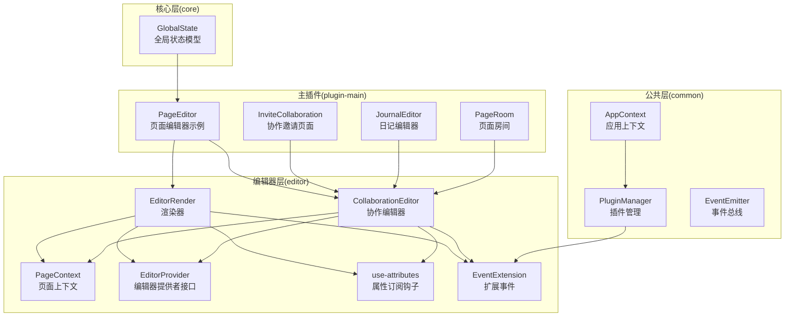
```mermaid
graph TB
subgraph "公共层(common)"
AC["AppContext<br/>应用上下文"]
PM["PluginManager<br/>插件管理"]
EE["EventEmitter<br/>事件总线"]
end
subgraph "核心层(core)"
GS["GlobalState<br/>全局状态模型"]
end
subgraph "编辑器层(editor)"
PCtx["PageContext<br/>页面上下文"]
EProv["EditorProvider<br/>编辑器提供者接口"]
ER["EditorRender<br/>渲染器"]
CE["CollaborationEditor<br/>协作编辑器"]
UA["use-attributes<br/>属性订阅钩子"]
EXE["EventExtension<br/>扩展事件"]
end
subgraph "主插件(plugin-main)"
PE["PageEditor<br/>页面编辑器示例"]
ICE["InviteCollaboration<br/>协作邀请页面"]
JE["JournalEditor<br/>日记编辑器"]
PR["PageRoom<br/>页面房间"]
end
PE --> ER
PE --> CE
ICE --> CE
JE --> CE
PR --> CE
ER --> PCtx
CE --> PCtx
ER --> EProv
CE --> EProv
ER --> UA
CE --> UA
ER --> EXE
CE --> EXE
AC --> PM
PM --> EXE
GS --> PE
```

**图表来源**
- [packages/common/src/core/AppContext.ts](file://packages/common/src/core/AppContext.ts#L1-L13)
- [packages/common/src/core/PluginManager.ts](file://packages/common/src/core/PluginManager.ts#L1-L170)
- [packages/common/src/event/event.ts](file://packages/common/src/event/event.ts#L1-L44)
- [packages/core/src/store/GlobalState.ts](file://packages/core/src/store/GlobalState.ts#L1-L32)
- [packages/editor/src/editor/context.tsx](file://packages/editor/src/editor/context.tsx#L1-L14)
- [packages/editor/src/editor/provider.ts](file://packages/editor/src/editor/provider.ts#L1-L53)
- [packages/editor/src/editor/render.tsx](file://packages/editor/src/editor/render.tsx#L1-L115)
- [packages/editor/src/editor/collaboration.tsx](file://packages/editor/src/editor/collaboration.tsx#L1-L156)
- [packages/editor/src/hooks/use-attributes.tsx](file://packages/editor/src/hooks/use-attributes.tsx#L1-L52)
- [packages/editor/src/extensions/event/event.ts](file://packages/editor/src/extensions/event/event.ts#L1-L18)
- [packages/editor/src/extensions/event/index.ts](file://packages/editor/src/extensions/event/index.ts#L1-L8)
- [packages/plugin-main/src/pages/SpaceDetail/PageEditor/index.tsx](file://packages/plugin-main/src/pages/SpaceDetail/PageEditor/index.tsx#L1-L549)
- [packages/plugin-main/src/pages/InviteCollaboration/index.tsx](file://packages/plugin-main/src/pages/InviteCollaboration/index.tsx#L1-L559)
- [packages/plugin-main/src/pages/Journals/JournalEditor/index.tsx](file://packages/plugin-main/src/pages/Journals/JournalEditor/index.tsx#L1-L54)
- [packages/plugin-main/src/pages/PageRoom/index.tsx](file://packages/plugin-main/src/pages/PageRoom/index.tsx#L103-L120)

**章节来源**
- [packages/common/src/core/AppContext.ts](file://packages/common/src/core/AppContext.ts#L1-L13)
- [packages/common/src/core/PluginManager.ts](file://packages/common/src/core/PluginManager.ts#L1-L170)
- [packages/common/src/event/event.ts](file://packages/common/src/event/event.ts#L1-L44)
- [packages/core/src/store/GlobalState.ts](file://packages/core/src/store/GlobalState.ts#L1-L32)
- [packages/editor/src/editor/context.tsx](file://packages/editor/src/editor/context.tsx#L1-L14)
- [packages/editor/src/editor/provider.ts](file://packages/editor/src/editor/provider.ts#L1-L53)
- [packages/editor/src/editor/render.tsx](file://packages/editor/src/editor/render.tsx#L1-L115)
- [packages/editor/src/editor/collaboration.tsx](file://packages/editor/src/editor/collaboration.tsx#L1-L156)
- [packages/editor/src/hooks/use-attributes.tsx](file://packages/editor/src/hooks/use-attributes.tsx#L1-L52)
- [packages/editor/src/extensions/event/event.ts](file://packages/editor/src/extensions/event/event.ts#L1-L18)
- [packages/editor/src/extensions/event/index.ts](file://packages/editor/src/extensions/event/index.ts#L1-L8)
- [packages/plugin-main/src/pages/SpaceDetail/PageEditor/index.tsx](file://packages/plugin-main/src/pages/SpaceDetail/PageEditor/index.tsx#L1-L549)
- [packages/plugin-main/src/pages/InviteCollaboration/index.tsx](file://packages/plugin-main/src/pages/InviteCollaboration/index.tsx#L1-L559)
- [packages/plugin-main/src/pages/Journals/JournalEditor/index.tsx](file://packages/plugin-main/src/pages/Journals/JournalEditor/index.tsx#L1-L54)
- [packages/plugin-main/src/pages/PageRoom/index.tsx](file://packages/plugin-main/src/pages/PageRoom/index.tsx#L103-L120)

## 核心组件
- 应用上下文（AppContext）
  - 提供插件管理器实例，作为应用级共享对象注入到组件树中
  - 便于跨页面、跨功能模块访问插件能力
- 页面上下文（PageContext）
  - 传递页面元信息（如空间 ID、页面 ID、标题、创建者等），用于渲染侧边目录、面包屑、权限控制等
- 编辑器提供者（EditorProvider）
  - 定义用户信息、文件上传下载等外部能力接口，由宿主环境注入到编辑器中
- 渲染器（EditorRender / CollaborationEditor）
  - 负责创建编辑器实例、挂载内容、渲染目录、提供主题与样式
  - 在根部以 Provider 形式注入 PageContext 与主题上下文
- 属性订阅钩子（use-attributes）
  - 订阅编辑器选区或事务变化，按需更新组件状态，避免全量重渲染
- 扩展事件（EventExtension）
  - 为编辑器扩展注入统一事件发射器，支持扩展间解耦通信
- 事件总线（EventEmitter）
  - 提供 on/emit/off/destroy 等基础能力，支撑应用级事件传播
- **新增** 协作状态管理
  - 通过 Awareness 机制跟踪在线用户状态
  - 实现用户意识更新和协作状态同步

**章节来源**
- [packages/common/src/core/AppContext.ts](file://packages/common/src/core/AppContext.ts#L1-L13)
- [packages/editor/src/editor/context.tsx](file://packages/editor/src/editor/context.tsx#L1-L14)
- [packages/editor/src/editor/provider.ts](file://packages/editor/src/editor/provider.ts#L1-L53)
- [packages/editor/src/editor/render.tsx](file://packages/editor/src/editor/render.tsx#L1-L115)
- [packages/editor/src/editor/collaboration.tsx](file://packages/editor/src/editor/collaboration.tsx#L1-L156)
- [packages/editor/src/hooks/use-attributes.tsx](file://packages/editor/src/hooks/use-attributes.tsx#L1-L52)
- [packages/editor/src/extensions/event/event.ts](file://packages/editor/src/extensions/event/event.ts#L1-L18)
- [packages/common/src/event/event.ts](file://packages/common/src/event/event.ts#L1-L44)

## 架构总览
编辑器上下文管理通过"上下文 + 钩子 + 事件 + 协作状态"的组合实现：
- 上下文：PageContext 注入页面元信息；AppContext 注入插件管理器
- 钩子：use-attributes 基于编辑器事件驱动组件状态更新
- 事件：EventExtension 暴露统一事件发射器；EventEmitter 支撑应用级事件广播
- **新增** 协作状态：Awareness 机制跟踪在线用户，实现实时协作状态同步

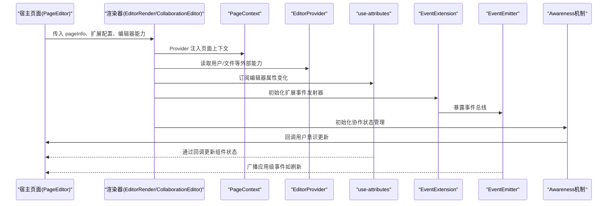
```mermaid
sequenceDiagram
participant Host as "宿主页面(PageEditor)"
participant Render as "渲染器(EditorRender/CollaborationEditor)"
participant Ctx as "PageContext"
participant Prov as "EditorProvider"
participant Hook as "use-attributes"
participant Ext as "EventExtension"
participant Bus as "EventEmitter"
participant Aware as "Awareness机制"
Host->>Render : 传入 pageInfo、扩展配置、编辑器能力
Render->>Ctx : Provider 注入页面上下文
Render->>Prov : 读取用户/文件等外部能力
Render->>Hook : 订阅编辑器属性变化
Render->>Ext : 初始化扩展事件发射器
Ext->>Bus : 暴露事件总线
Render->>Aware : 初始化协作状态管理
Aware->>Host : 回调用户意识更新
Hook-->>Host : 通过回调更新组件状态
Bus-->>Host : 广播应用级事件如刷新
```

**图表来源**
- [packages/plugin-main/src/pages/SpaceDetail/PageEditor/index.tsx](file://packages/plugin-main/src/pages/SpaceDetail/PageEditor/index.tsx#L1-L549)
- [packages/editor/src/editor/render.tsx](file://packages/editor/src/editor/render.tsx#L1-L115)
- [packages/editor/src/editor/collaboration.tsx](file://packages/editor/src/editor/collaboration.tsx#L1-L156)
- [packages/editor/src/hooks/use-attributes.tsx](file://packages/editor/src/hooks/use-attributes.tsx#L1-L52)
- [packages/editor/src/extensions/event/event.ts](file://packages/editor/src/extensions/event/event.ts#L1-L18)
- [packages/common/src/event/event.ts](file://packages/common/src/event/event.ts#L1-L44)

## 详细组件分析

### 页面上下文（PageContext）与渲染系统
- 设计目的
  - 将页面元信息（空间、页面、标题、创建者等）以 React Context 的形式向下传递，供目录、菜单、权限判断等组件使用
- 实现要点
  - 渲染器在根部以 Provider 包裹，将 pageInfo 作为上下文值注入
  - 渲染器同时负责主题与样式注入，确保编辑器区域具备一致的视觉表现
- 数据流
  - 宿主页面准备 pageInfo，渲染器接收后注入上下文
  - 子组件通过 useContext 读取上下文，结合 use-attributes 订阅编辑器状态，实现联动更新

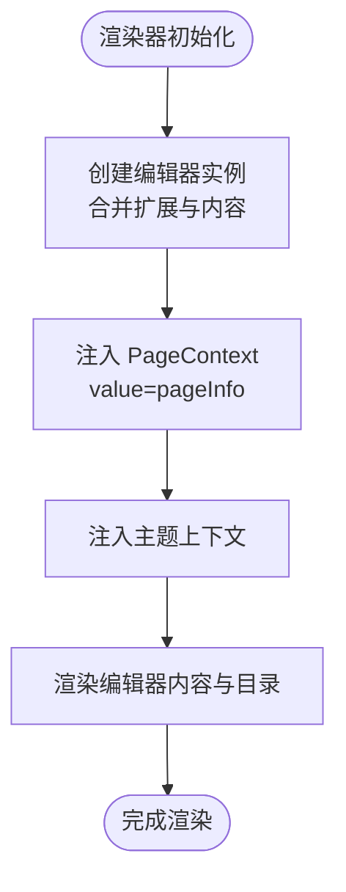
```mermaid
flowchart TD
Start(["渲染器初始化"]) --> BuildEditor["创建编辑器实例<br/>合并扩展与内容"]
BuildEditor --> InjectCtx["注入 PageContext<br/>value=pageInfo"]
InjectCtx --> Theme["注入主题上下文"]
Theme --> RenderContent["渲染编辑器内容与目录"]
RenderContent --> End(["完成渲染"])
```

**图表来源**
- [packages/editor/src/editor/render.tsx](file://packages/editor/src/editor/render.tsx#L1-L115)
- [packages/editor/src/editor/context.tsx](file://packages/editor/src/editor/context.tsx#L1-L14)

**章节来源**
- [packages/editor/src/editor/context.tsx](file://packages/editor/src/editor/context.tsx#L1-L14)
- [packages/editor/src/editor/render.tsx](file://packages/editor/src/editor/render.tsx#L1-L115)

### 编辑器提供者（EditorProvider）与用户/文件能力
- 设计目的
  - 抽象用户信息、文件上传下载等外部能力，使编辑器不直接依赖具体实现
- 接口定义
  - 用户能力：获取当前用户、查询用户列表
  - 文件能力：上传、下载、生成下载路径
- 使用方式
  - 宿主在创建编辑器时，将 EditorProvider 注入 editor.options.editorProps.editorProvider
  - 渲染器通过 getEditorProvider 读取并使用这些能力

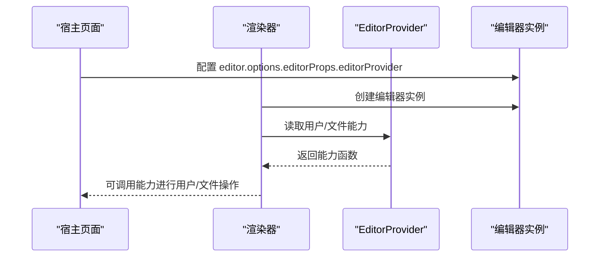
```mermaid
sequenceDiagram
participant Host as "宿主页面"
participant Render as "渲染器"
participant Prov as "EditorProvider"
participant Editor as "编辑器实例"
Host->>Editor : 配置 editor.options.editorProps.editorProvider
Render->>Editor : 创建编辑器实例
Render->>Prov : 读取用户/文件能力
Prov-->>Render : 返回能力函数
Render-->>Host : 可调用能力进行用户/文件操作
```

**图表来源**
- [packages/editor/src/editor/provider.ts](file://packages/editor/src/editor/provider.ts#L1-L53)
- [packages/editor/src/editor/render.tsx](file://packages/editor/src/editor/render.tsx#L1-L115)

**章节来源**
- [packages/editor/src/editor/provider.ts](file://packages/editor/src/editor/provider.ts#L1-L53)
- [packages/editor/src/editor/render.tsx](file://packages/editor/src/editor/render.tsx#L1-L115)

### 属性订阅与组件通信（use-attributes）
- 设计目的
  - 将编辑器内部状态（如选区、节点属性）映射为组件可感知的状态，减少不必要的重渲染
- 工作原理
  - 订阅编辑器的 selectionUpdate 与 transaction 事件
  - 合并默认值与当前属性，使用深比较避免重复更新
  - 通过回调将最新值回传给宿主或上层组件
- 性能影响
  - 仅在属性变化且与缓存值不相等时更新，降低渲染成本

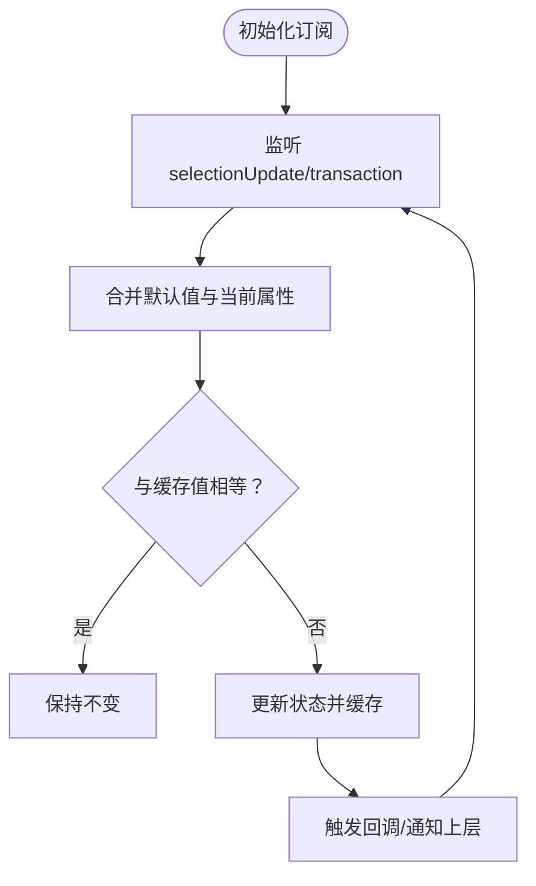
```mermaid
flowchart TD
Init(["初始化订阅"]) --> Listen["监听 selectionUpdate/transaction"]
Listen --> Compute["合并默认值与当前属性"]
Compute --> Compare{"与缓存值相等？"}
Compare -- 是 --> Idle["保持不变"]
Compare -- 否 --> Update["更新状态并缓存"]
Update --> Notify["触发回调/通知上层"]
Notify --> Listen
```

**图表来源**
- [packages/editor/src/hooks/use-attributes.tsx](file://packages/editor/src/hooks/use-attributes.tsx#L1-L52)

**章节来源**
- [packages/editor/src/hooks/use-attributes.tsx](file://packages/editor/src/hooks/use-attributes.tsx#L1-L52)

### 扩展事件与应用级事件传播
- 扩展事件（EventExtension）
  - 为编辑器扩展注入统一事件发射器，扩展之间可通过该发射器进行低耦合通信
- 应用级事件（EventEmitter）
  - 提供 on/emit/off/destroy 方法，支持应用内事件广播与清理
- 集成方式
  - 在渲染器中引入 EventExtension，使其成为编辑器扩展的一部分
  - 通过宿主页面或业务逻辑调用 emit 触发事件，订阅方响应处理

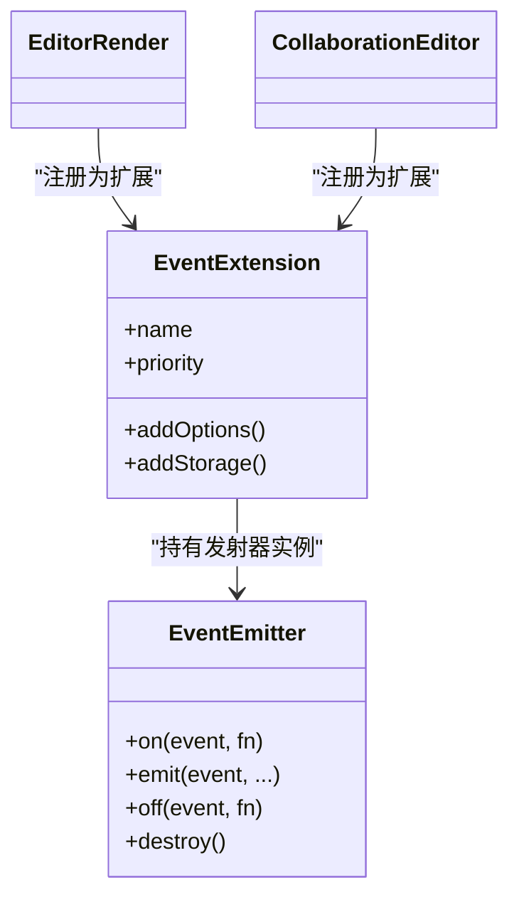
```mermaid
classDiagram
class EventExtension {
+name
+priority
+addOptions()
+addStorage()
}
class EventEmitter {
+on(event, fn)
+emit(event, ...)
+off(event, fn)
+destroy()
}
class EditorRender
class CollaborationEditor
EditorRender --> EventExtension : "注册为扩展"
CollaborationEditor --> EventExtension : "注册为扩展"
EventExtension --> EventEmitter : "持有发射器实例"
```

**图表来源**
- [packages/editor/src/extensions/event/event.ts](file://packages/editor/src/extensions/event/event.ts#L1-L18)
- [packages/editor/src/extensions/event/index.ts](file://packages/editor/src/extensions/event/index.ts#L1-L8)
- [packages/editor/src/editor/render.tsx](file://packages/editor/src/editor/render.tsx#L1-L115)
- [packages/editor/src/editor/collaboration.tsx](file://packages/editor/src/editor/collaboration.tsx#L1-L156)
- [packages/common/src/event/event.ts](file://packages/common/src/event/event.ts#L1-L44)

**章节来源**
- [packages/editor/src/extensions/event/event.ts](file://packages/editor/src/extensions/event/event.ts#L1-L18)
- [packages/editor/src/extensions/event/index.ts](file://packages/editor/src/extensions/event/index.ts#L1-L8)
- [packages/common/src/event/event.ts](file://packages/common/src/event/event.ts#L1-L44)

### 协作编辑器与上下文注入
- 设计目的
  - 在协作场景下，同样需要注入 PageContext，并提供用户列表、同步状态等能力
- 关键点
  - 与普通渲染器类似，协作编辑器在根部注入 PageContext 与主题上下文
  - 通过 HocuspocusProvider 连接协作服务，生命周期内进行连接与销毁管理
  - **新增** 集成 Awareness 机制，实现实时用户状态跟踪

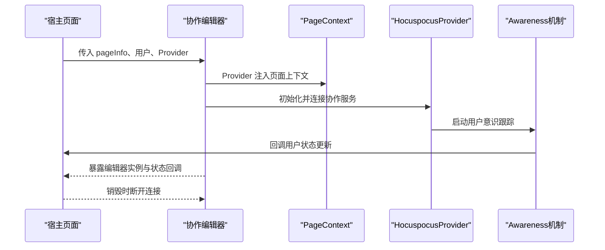
```mermaid
sequenceDiagram
participant Host as "宿主页面"
participant Collab as "协作编辑器"
participant Ctx as "PageContext"
participant Prov as "HocuspocusProvider"
participant Aware as "Awareness机制"
Host->>Collab : 传入 pageInfo、用户、Provider
Collab->>Ctx : Provider 注入页面上下文
Collab->>Prov : 初始化并连接协作服务
Prov->>Aware : 启动用户意识跟踪
Aware->>Host : 回调用户状态更新
Collab-->>Host : 暴露编辑器实例与状态回调
Host-->>Collab : 销毁时断开连接
```

**图表来源**
- [packages/editor/src/editor/collaboration.tsx](file://packages/editor/src/editor/collaboration.tsx#L1-L156)

**章节来源**
- [packages/editor/src/editor/collaboration.tsx](file://packages/editor/src/editor/collaboration.tsx#L1-L156)

### 插件管理与上下文生态
- 插件管理器（PluginManager）
  - 负责加载、安装、卸载插件，聚合插件的服务与编辑器扩展
  - 通过事件总线发出 REFRESH_PLUGINS，驱动界面刷新
- 应用上下文（AppContext）
  - 将插件管理器注入应用上下文，供全局使用
- 与编辑器扩展的集成
  - 插件可提供 editorExtensions，渲染器在创建编辑器时合并这些扩展
  - 通过 EventExtension 与 EventEmitter 实现扩展间事件通信

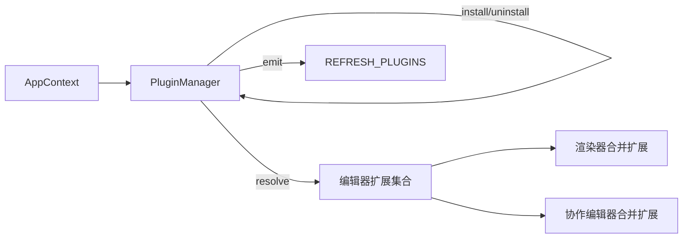
```mermaid
graph LR
PM["PluginManager"] --> |install/uninstall| PM
PM --> |resolve| EX["编辑器扩展集合"]
PM --> |emit| BUS["REFRESH_PLUGINS"]
AC["AppContext"] --> PM
EX --> ER["渲染器合并扩展"]
EX --> CE["协作编辑器合并扩展"]
```

**图表来源**
- [packages/common/src/core/PluginManager.ts](file://packages/common/src/core/PluginManager.ts#L1-L170)
- [packages/common/src/core/AppContext.ts](file://packages/common/src/core/AppContext.ts#L1-L13)
- [packages/editor/src/editor/render.tsx](file://packages/editor/src/editor/render.tsx#L1-L115)
- [packages/editor/src/editor/collaboration.tsx](file://packages/editor/src/editor/collaboration.tsx#L1-L156)
- [packages/common/src/event/event.ts](file://packages/common/src/event/event.ts#L1-L44)

**章节来源**
- [packages/common/src/core/PluginManager.ts](file://packages/common/src/core/PluginManager.ts#L1-L170)
- [packages/common/src/core/AppContext.ts](file://packages/common/src/core/AppContext.ts#L1-L13)
- [packages/common/src/event/event.ts](file://packages/common/src/event/event.ts#L1-L44)

## 协作状态管理

### Awareness 机制概述
协作状态管理通过 Awareness 机制实现用户意识更新，确保所有协作者能够实时看到彼此的在线状态。

- **设计目的**
  - 跟踪在线用户的光标位置、选区状态和用户信息
  - 实现实时协作状态同步，提升多人协作体验
  - 提供用户列表展示和连接状态指示

- **核心组件**
  - **Awareness 对象**：管理用户状态的 Yjs Awareness 实例
  - **onAwarenessUpdate 回调**：监听用户状态变化
  - **用户状态过滤**：过滤掉无用户信息的状态条目
  - **深度比较优化**：使用 deepEqual 避免重复渲染

### 用户意识更新流程

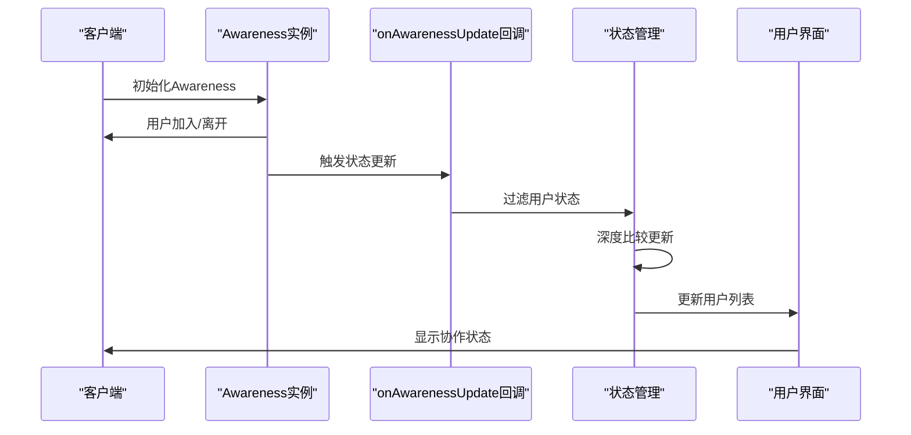
```mermaid
sequenceDiagram
participant Client as "客户端"
participant Awareness as "Awareness实例"
participant Callback as "onAwarenessUpdate回调"
participant State as "状态管理"
participant UI as "用户界面"
Client->>Awareness : 初始化Awareness
Awareness->>Client : 用户加入/离开
Awareness->>Callback : 触发状态更新
Callback->>State : 过滤用户状态
State->>State : 深度比较更新
State->>UI : 更新用户列表
UI->>Client : 显示协作状态
```

**图表来源**
- [packages/plugin-main/src/pages/SpaceDetail/PageEditor/index.tsx](file://packages/plugin-main/src/pages/SpaceDetail/PageEditor/index.tsx#L97-L109)
- [packages/plugin-main/src/pages/InviteCollaboration/index.tsx](file://packages/plugin-main/src/pages/InviteCollaboration/index.tsx#L133-L144)
- [packages/plugin-main/src/pages/Journals/JournalEditor/index.tsx](file://packages/plugin-main/src/pages/Journals/JournalEditor/index.tsx#L27-L34)

### 协作状态数据结构

| 字段名 | 类型 | 描述 | 示例值 |
|--------|------|------|--------|
| clientId | number | 客户端唯一标识符 | 123456 |
| user | object | 用户信息对象 | `{name: '张三', color: '#3b82f6', id: 'user-1'}` |
| name | string | 用户姓名 | '张三' |
| color | string | 用户头像颜色 | '#3b82f6' |
| id | string \| number | 用户唯一标识 | 'user-1' |

### 协作状态管理最佳实践

- **状态过滤**
  - 使用 `.filter(u => u.user)` 过滤掉无用户信息的状态条目
  - 确保只处理有效的用户状态

- **性能优化**
  - 使用 `lastAwarenessRef` 缓存上次的状态，避免重复渲染
  - 通过 `deepEqual` 进行状态比较，只有当状态真正改变时才更新

- **内存管理**
  - 在组件卸载时销毁 Awareness 实例
  - 断开协作连接，释放相关资源

**章节来源**
- [packages/plugin-main/src/pages/SpaceDetail/PageEditor/index.tsx](file://packages/plugin-main/src/pages/SpaceDetail/PageEditor/index.tsx#L97-L109)
- [packages/plugin-main/src/pages/InviteCollaboration/index.tsx](file://packages/plugin-main/src/pages/InviteCollaboration/index.tsx#L133-L144)
- [packages/plugin-main/src/pages/Journals/JournalEditor/index.tsx](file://packages/plugin-main/src/pages/Journals/JournalEditor/index.tsx#L27-L34)

## 用户信息管理

### 用户信息结构设计
用户信息管理是协作状态的核心组成部分，负责为每个协作者提供唯一的身份标识和视觉表示。

- **用户信息字段**
  - `id`: 用户唯一标识符（支持字符串和数字）
  - `name`: 用户显示名称
  - `avatar`: 用户头像URL（可选）
  - `color`: 用户专用颜色，用于协作光标和头像标识

- **颜色生成算法**
  - 基于用户ID的哈希算法生成稳定的颜色
  - 使用预定义的颜色数组，确保颜色分布均匀
  - 支持匿名用户的默认颜色分配

### 用户信息生成流程

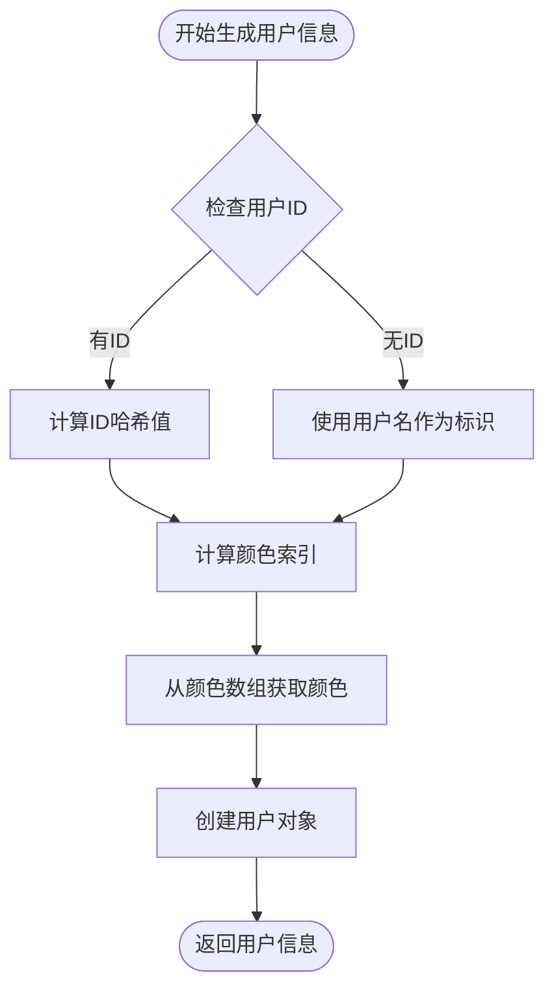
```mermaid
flowchart TD
Start(["开始生成用户信息"]) --> CheckID{"检查用户ID"}
CheckID -- 有ID --> Hash["计算ID哈希值"]
CheckID -- 无ID --> UseName["使用用户名作为标识"]
Hash --> CalcColor["计算颜色索引"]
UseName --> CalcColor
CalcColor --> GetColor["从颜色数组获取颜色"]
GetColor --> CreateUser["创建用户对象"]
CreateUser --> End(["返回用户信息"])
```

**图表来源**
- [packages/plugin-main/src/pages/SpaceDetail/PageEditor/index.tsx](file://packages/plugin-main/src/pages/SpaceDetail/PageEditor/index.tsx#L70-L85)
- [packages/plugin-main/src/pages/InviteCollaboration/index.tsx](file://packages/plugin-main/src/pages/InviteCollaboration/index.tsx#L105-L121)
- [packages/plugin-main/src/pages/Journals/JournalEditor/index.tsx](file://packages/plugin-main/src/pages/Journals/JournalEditor/index.tsx#L10-L18)

### 用户信息管理特性

- **稳定性保证**
  - 同一用户在不同会话中获得相同颜色
  - 基于哈希算法的颜色分配确保一致性

- **兼容性处理**
  - 支持多种用户标识格式（ID、名称、邮箱）
  - 提供匿名用户的默认处理方案

- **视觉一致性**
  - 统一的颜色编码系统
  - 与协作光标和用户头像的视觉协调

**章节来源**
- [packages/plugin-main/src/pages/SpaceDetail/PageEditor/index.tsx](file://packages/plugin-main/src/pages/SpaceDetail/PageEditor/index.tsx#L70-L85)
- [packages/plugin-main/src/pages/InviteCollaboration/index.tsx](file://packages/plugin-main/src/pages/InviteCollaboration/index.tsx#L105-L121)
- [packages/plugin-main/src/pages/Journals/JournalEditor/index.tsx](file://packages/plugin-main/src/pages/Journals/JournalEditor/index.tsx#L10-L18)

## 依赖关系分析
- 组件耦合
  - 渲染器与协作编辑器依赖 PageContext 与 EditorProvider
  - use-attributes 依赖编辑器事件系统，形成"事件 -> 状态 -> 渲染"的单向数据流
  - EventExtension 与 EventEmitter 为扩展与应用提供解耦通信通道
  - **新增** 协作编辑器依赖 Awareness 机制实现用户状态管理
- 外部依赖
  - @tiptap/*：编辑器内核与 React 绑定
  - @hocuspocus/provider：协作编辑协议
  - styled-components：主题注入
  - lodash/ahooks/deep-equal：工具与状态管理辅助
  - yjs：协作状态管理核心库

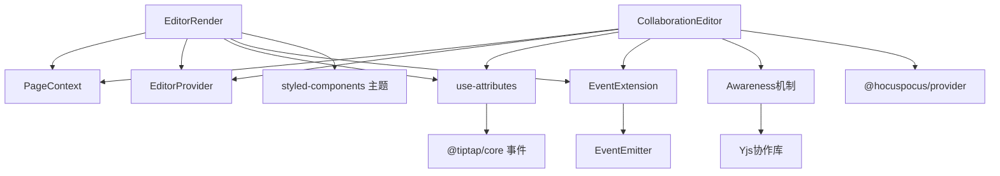
```mermaid
graph TB
ER["EditorRender"] --> PC["PageContext"]
ER --> EP["EditorProvider"]
ER --> UA["use-attributes"]
ER --> EX["EventExtension"]
CE["CollaborationEditor"] --> PC
CE --> EP
CE --> UA
CE --> EX
CE --> AW["Awareness机制"]
UA --> TE["@tiptap/core 事件"]
EX --> EE["EventEmitter"]
AW --> YJS["Yjs协作库"]
ER --> SC["styled-components 主题"]
CE --> HP["@hocuspocus/provider"]
```

**图表来源**
- [packages/editor/src/editor/render.tsx](file://packages/editor/src/editor/render.tsx#L1-L115)
- [packages/editor/src/editor/collaboration.tsx](file://packages/editor/src/editor/collaboration.tsx#L1-L156)
- [packages/editor/src/hooks/use-attributes.tsx](file://packages/editor/src/hooks/use-attributes.tsx#L1-L52)
- [packages/editor/src/extensions/event/event.ts](file://packages/editor/src/extensions/event/event.ts#L1-L18)
- [packages/common/src/event/event.ts](file://packages/common/src/event/event.ts#L1-L44)

**章节来源**
- [packages/editor/src/editor/render.tsx](file://packages/editor/src/editor/render.tsx#L1-L115)
- [packages/editor/src/editor/collaboration.tsx](file://packages/editor/src/editor/collaboration.tsx#L1-L156)
- [packages/editor/src/hooks/use-attributes.tsx](file://packages/editor/src/hooks/use-attributes.tsx#L1-L52)
- [packages/editor/src/extensions/event/event.ts](file://packages/editor/src/extensions/event/event.ts#L1-L18)
- [packages/common/src/event/event.ts](file://packages/common/src/event/event.ts#L1-L44)

## 性能考量
- 事件驱动的细粒度更新
  - 使用 use-attributes 订阅编辑器事件，避免全量重渲染
- 合并扩展与内容
  - 渲染器在创建编辑器时合并扩展与内容，减少重复计算
- 主题与样式注入
  - 通过 ThemeProvider 与样式模块化，避免样式抖动与重复渲染
- 协作编辑生命周期管理
  - 在销毁时断开协作连接，释放资源，避免内存泄漏
- **新增** Awareness 优化
  - 使用 lastAwarenessRef 缓存用户状态，避免重复渲染
  - 通过 deepEqual 进行状态比较，只有当状态真正改变时才更新
  - 合理的用户状态过滤，减少不必要的状态处理

## 故障排查指南
- 上下文未生效
  - 检查是否在渲染器根部注入了 PageContext
  - 确认 pageInfo 是否正确传入
- 事件未触发
  - 确认 EventExtension 已被添加到编辑器扩展集合
  - 检查 EventEmitter 的 on/emit 调用链路
- 协作编辑无法连接
  - 检查 Provider 的初始化参数与生命周期
  - 确认销毁流程中执行了断开与销毁
- 属性订阅无效
  - 确认编辑器事件（selectionUpdate/transaction）是否正常触发
  - 检查默认值与当前属性合并逻辑
- **新增** 协作状态问题
  - 检查 Awareness 实例是否正确初始化
  - 确认 onAwarenessUpdate 回调是否正常触发
  - 验证用户状态过滤逻辑是否正确
  - 检查 deepEqual 比较是否正常工作

**章节来源**
- [packages/editor/src/editor/render.tsx](file://packages/editor/src/editor/render.tsx#L1-L115)
- [packages/editor/src/editor/collaboration.tsx](file://packages/editor/src/editor/collaboration.tsx#L1-L156)
- [packages/editor/src/hooks/use-attributes.tsx](file://packages/editor/src/hooks/use-attributes.tsx#L1-L52)
- [packages/editor/src/extensions/event/event.ts](file://packages/editor/src/extensions/event/event.ts#L1-L18)
- [packages/common/src/event/event.ts](file://packages/common/src/event/event.ts#L1-L44)

## 结论
编辑器上下文管理系统通过"上下文 + 钩子 + 事件 + 协作状态"实现了清晰的分层与解耦：
- PageContext 与 EditorProvider 提供稳定的运行时依赖
- use-attributes 将编辑器状态转化为组件可控的状态
- EventExtension 与 EventEmitter 为扩展与应用提供事件通信通道
- **新增** Awareness 机制实现用户意识更新，完善协作状态管理
- 渲染器与协作编辑器在统一入口注入上下文与主题，保证一致性与可维护性

## 附录：最佳实践与示例路径
- 状态设计
  - 将页面元信息放入 PageContext，避免在多处重复传递
  - 将用户与文件能力抽象为 EditorProvider，便于替换实现
  - **新增** 设计稳定的用户信息结构，支持协作状态管理
- 性能考虑
  - 使用 use-attributes 订阅必要属性，避免全量状态更新
  - 合理拆分扩展，减少渲染器初始化时的计算压力
  - **新增** 使用 lastAwarenessRef 缓存用户状态，避免重复渲染
  - **新增** 通过 deepEqual 进行状态比较，优化协作状态更新
- 内存管理
  - 协作编辑器在销毁时断开连接并释放资源
  - **新增** 在组件卸载时销毁 Awareness 实例，防止内存泄漏
- 示例路径
  - 页面编辑器示例（宿主页面）：[packages/plugin-main/src/pages/SpaceDetail/PageEditor/index.tsx](file://packages/plugin-main/src/pages/SpaceDetail/PageEditor/index.tsx#L1-L549)
  - 协作邀请页面：[packages/plugin-main/src/pages/InviteCollaboration/index.tsx](file://packages/plugin-main/src/pages/InviteCollaboration/index.tsx#L1-L559)
  - 日记编辑器：[packages/plugin-main/src/pages/Journals/JournalEditor/index.tsx](file://packages/plugin-main/src/pages/Journals/JournalEditor/index.tsx#L1-L54)
  - 页面房间：[packages/plugin-main/src/pages/PageRoom/index.tsx](file://packages/plugin-main/src/pages/PageRoom/index.tsx#L103-L120)
  - 渲染器（普通编辑器）：[packages/editor/src/editor/render.tsx](file://packages/editor/src/editor/render.tsx#L1-L115)
  - 协作编辑器：[packages/editor/src/editor/collaboration.tsx](file://packages/editor/src/editor/collaboration.tsx#L1-L156)
  - 属性订阅钩子：[packages/editor/src/hooks/use-attributes.tsx](file://packages/editor/src/hooks/use-attributes.tsx#L1-L52)
  - 扩展事件与事件总线：[packages/editor/src/extensions/event/event.ts](file://packages/editor/src/extensions/event/event.ts#L1-L18)，[packages/common/src/event/event.ts](file://packages/common/src/event/event.ts#L1-L44)
  - 应用上下文与插件管理：[packages/common/src/core/AppContext.ts](file://packages/common/src/core/AppContext.ts#L1-L13)，[packages/common/src/core/PluginManager.ts](file://packages/common/src/core/PluginManager.ts#L1-L170)
  - 全局状态模型：[packages/core/src/store/GlobalState.ts](file://packages/core/src/store/GlobalState.ts#L1-L32)
  - **新增** 协作邀请API文档：[packages/plugin-main/docs/COLLABORATION_API.md](file://packages/plugin-main/docs/COLLABORATION_API.md#L1-L66)
  - **新增** 编辑器扩展管理：[packages/editor/src/editor/use-extension.ts](file://packages/editor/src/editor/use-extension.ts#L1-L62)

**章节来源**
- [packages/plugin-main/src/pages/SpaceDetail/PageEditor/index.tsx](file://packages/plugin-main/src/pages/SpaceDetail/PageEditor/index.tsx#L1-L549)
- [packages/plugin-main/src/pages/InviteCollaboration/index.tsx](file://packages/plugin-main/src/pages/InviteCollaboration/index.tsx#L1-L559)
- [packages/plugin-main/src/pages/Journals/JournalEditor/index.tsx](file://packages/plugin-main/src/pages/Journals/JournalEditor/index.tsx#L1-L54)
- [packages/plugin-main/src/pages/PageRoom/index.tsx](file://packages/plugin-main/src/pages/PageRoom/index.tsx#L103-L120)
- [packages/editor/src/editor/render.tsx](file://packages/editor/src/editor/render.tsx#L1-L115)
- [packages/editor/src/editor/collaboration.tsx](file://packages/editor/src/editor/collaboration.tsx#L1-L156)
- [packages/editor/src/hooks/use-attributes.tsx](file://packages/editor/src/hooks/use-attributes.tsx#L1-L52)
- [packages/editor/src/extensions/event/event.ts](file://packages/editor/src/extensions/event/event.ts#L1-L18)
- [packages/common/src/event/event.ts](file://packages/common/src/event/event.ts#L1-L44)
- [packages/common/src/core/AppContext.ts](file://packages/common/src/core/AppContext.ts#L1-L13)
- [packages/common/src/core/PluginManager.ts](file://packages/common/src/core/PluginManager.ts#L1-L170)
- [packages/core/src/store/GlobalState.ts](file://packages/core/src/store/GlobalState.ts#L1-L32)
- [packages/plugin-main/docs/COLLABORATION_API.md](file://packages/plugin-main/docs/COLLABORATION_API.md#L1-L66)
- [packages/editor/src/editor/use-extension.ts](file://packages/editor/src/editor/use-extension.ts#L1-L62)