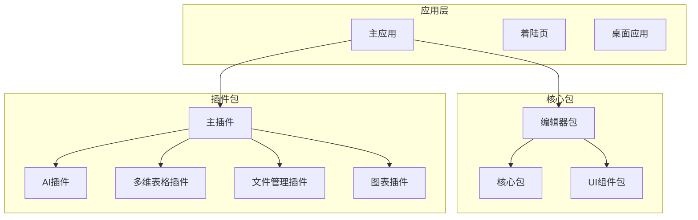
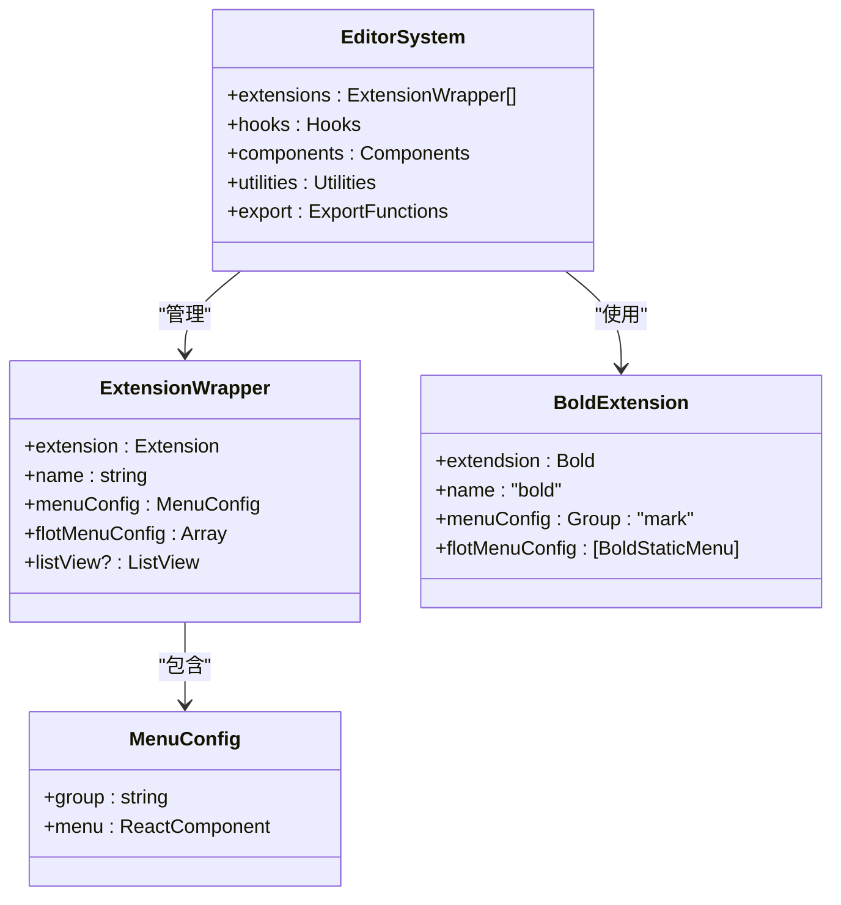
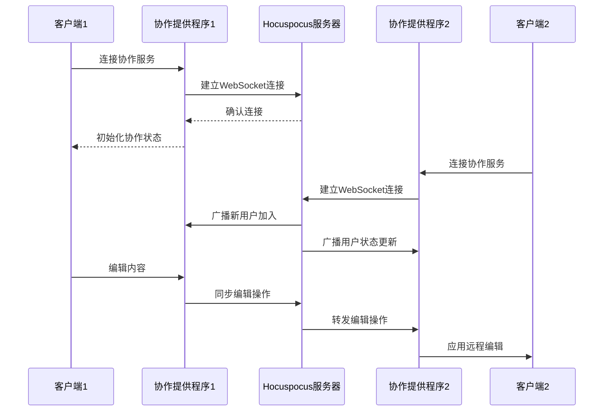
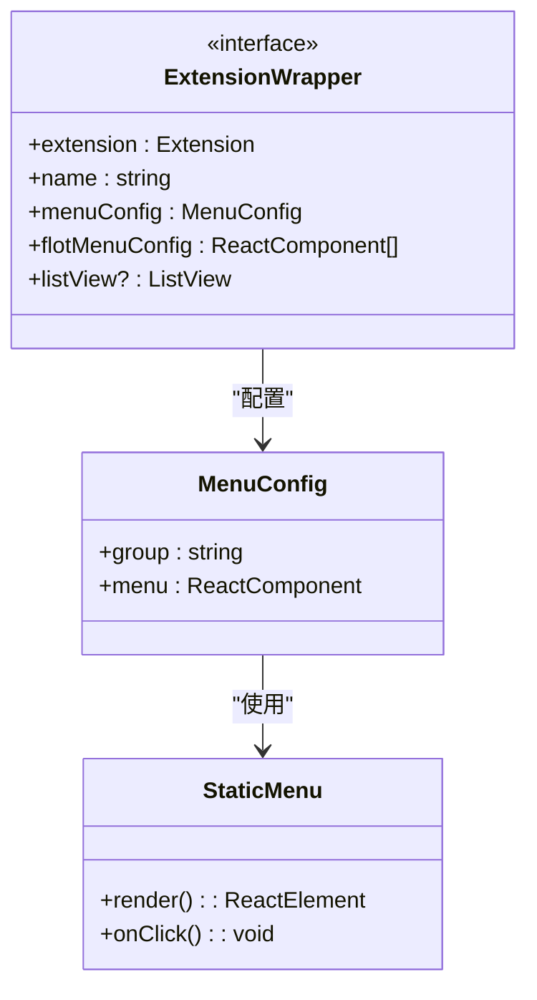
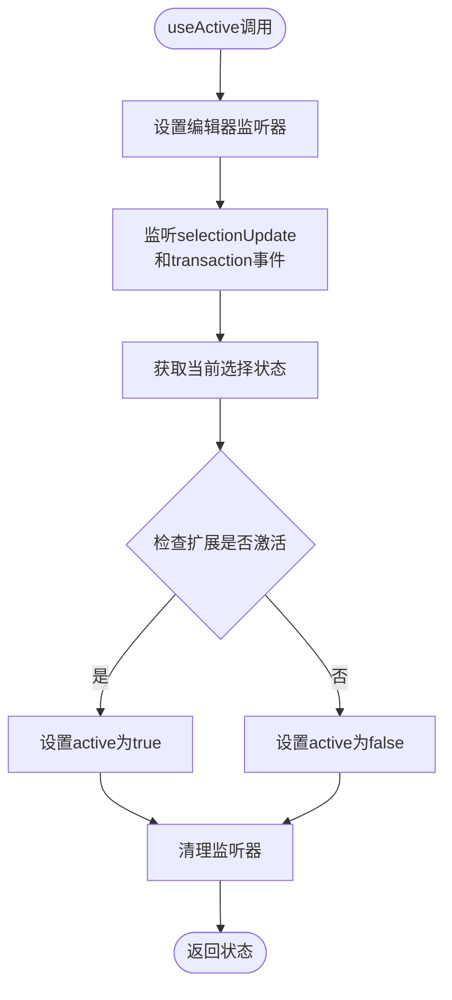
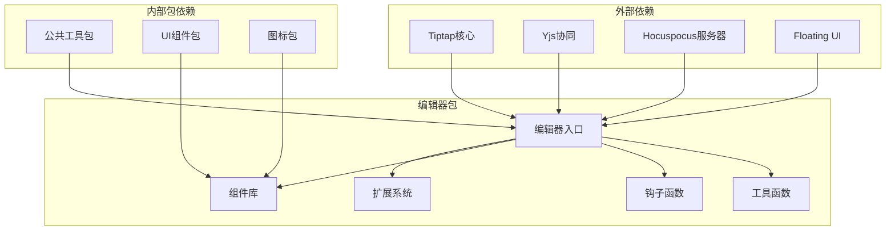

# 编辑器扩展更新

<cite>
**本文档引用的文件**
- [README.md](file://README.md)
- [package.json](file://package.json)
- [packages/editor/src/index.ts](file://packages/editor/src/index.ts)
- [packages/editor/src/editor/index.tsx](file://packages/editor/src/editor/index.tsx)
- [packages/editor/src/extensions/index.ts](file://packages/editor/src/extensions/index.ts)
- [packages/editor/src/components/index.tsx](file://packages/editor/src/components/index.tsx)
- [packages/editor/package.json](file://packages/editor/package.json)
- [packages/editor/src/hooks/use-active.tsx](file://packages/editor/src/hooks/use-active.tsx)
- [packages/editor/src/hooks/use-attributes.tsx](file://packages/editor/src/hooks/use-attributes.tsx)
</cite>

## 目录
1. [简介](#简介)
2. [项目结构](#项目结构)
3. [核心组件](#核心组件)
4. [架构概览](#架构概览)
5. [详细组件分析](#详细组件分析)
6. [依赖关系分析](#依赖关系分析)
7. [性能考虑](#性能考虑)
8. [故障排除指南](#故障排除指南)
9. [结论](#结论)

## 简介

本项目是一个强大的协作式知识管理平台，具备富文本编辑、实时协作、AI集成和丰富的插件生态系统。编辑器扩展系统是整个平台的核心组件之一，基于Tiptap构建，支持实时协作编辑、多种内容格式化选项和可扩展的插件架构。

## 项目结构

该项目采用Monorepo架构，使用Turborepo进行构建管理。编辑器相关的核心包位于`packages/editor`目录下，包含完整的编辑器扩展系统、组件库和工具函数。

**图表来源**
- [README.md:66-97](file://README.md#L66-L97)
- [package.json:1-124](file://package.json#L1-L124)

**章节来源**
- [README.md:66-97](file://README.md#L66-L97)
- [package.json:1-124](file://package.json#L1-L124)

## 核心组件

编辑器扩展系统由多个核心组件构成，包括扩展包装器、钩子函数、工具函数和导出功能。

### 主要导出模块

编辑器包提供了统一的导出接口，便于外部使用：

- **编辑器核心**：Tiptap编辑器实例和协作功能
- **扩展系统**：完整的富文本编辑器扩展集合
- **组件库**：气泡菜单、颜色选择器等UI组件
- **工具函数**：编辑器操作和状态管理工具
- **导出功能**：PDF导出和其他格式转换

### 扩展分类体系

编辑器扩展按照功能分为多个类别：

- **基础文本格式**：粗体、斜体、下划线、删除线
- **标题系统**：从H1到H6的标题格式
- **列表系统**：有序列表、无序列表、任务列表
- **内容块**：表格、代码块、引用块
- **媒体支持**：图片、链接、表情符号
- **高级功能**：颜色、对齐、数学公式、目录

**章节来源**
- [packages/editor/src/index.ts:1-26](file://packages/editor/src/index.ts#L1-L26)
- [packages/editor/src/editor/index.tsx:1-8](file://packages/editor/src/editor/index.tsx#L1-L8)
- [packages/editor/src/extensions/index.ts:1-66](file://packages/editor/src/extensions/index.ts#L1-L66)

## 架构概览

编辑器扩展系统采用模块化设计，通过统一的扩展包装器模式实现标准化管理。

**图表来源**
- [packages/editor/src/extensions/bold/index.ts:9-19](file://packages/editor/src/extensions/bold/index.ts#L9-L19)
- [packages/editor/src/index.ts:1-26](file://packages/editor/src/index.ts#L1-L26)

### 实时协作架构

编辑器系统集成了Hocuspocus提供程序，实现真正的实时协作编辑功能。

**图表来源**
- [packages/editor/src/index.ts:12-12](file://packages/editor/src/index.ts#L12-L12)

**章节来源**
- [packages/editor/src/index.ts:12-12](file://packages/editor/src/index.ts#L12-L12)

## 详细组件分析

### 扩展包装器系统

每个编辑器扩展都通过统一的包装器模式进行封装，确保一致的API和功能。

#### 扩展包装器接口

**图表来源**
- [packages/editor/src/extensions/bold/index.ts:9-19](file://packages/editor/src/extensions/bold/index.ts#L9-L19)

#### 具体扩展实现示例

以粗体扩展为例，展示标准的扩展包装器实现模式：

- **扩展类型**：基础文本样式扩展
- **菜单配置**：标记组别，使用静态菜单组件
- **浮动菜单**：支持气泡菜单显示
- **列表视图**：可选的列表视图组件

**章节来源**
- [packages/editor/src/extensions/bold/index.ts:9-19](file://packages/editor/src/extensions/bold/index.ts#L9-L19)

### 钩子函数系统

编辑器系统提供了多个React钩子函数，用于简化编辑器状态管理和事件处理。

#### useActive钩子

用于检测当前编辑器状态是否激活特定扩展。

**图表来源**
- [packages/editor/src/hooks/use-active.tsx:11-31](file://packages/editor/src/hooks/use-active.tsx#L11-L31)

#### useAttributes钩子

用于获取和监听特定属性的值变化。

**章节来源**
- [packages/editor/src/hooks/use-active.tsx:1-32](file://packages/editor/src/hooks/use-active.tsx#L1-L32)
- [packages/editor/src/hooks/use-attributes.tsx:1-53](file://packages/editor/src/hooks/use-attributes.tsx#L1-L53)

### 组件系统

编辑器组件库提供了丰富的UI组件，支持自定义和扩展。

#### 主要组件类型

- **气泡菜单**：上下文相关的工具栏
- **颜色选择器**：文本和背景色选择
- **提示工具**：用户交互提示
- **可调整大小组件**：支持拖拽调整尺寸
- **上传组件**：文件上传和处理

**章节来源**
- [packages/editor/src/components/index.tsx:1-13](file://packages/editor/src/components/index.tsx#L1-L13)

### 工具函数库

编辑器工具函数提供了常用的操作和辅助功能。

#### 核心工具函数

- **节点创建**：创建ProseMirror节点
- **位置计算**：编辑器位置和坐标计算
- **选择管理**：复杂的选择操作
- **导入脚本**：动态脚本加载
- **节流函数**：性能优化的节流工具

**章节来源**
- [packages/editor/src/index.ts:2-22](file://packages/editor/src/index.ts#L2-L22)

## 依赖关系分析

编辑器扩展系统具有清晰的依赖层次结构，确保模块间的松耦合和高内聚。

**图表来源**
- [packages/editor/package.json:16-92](file://packages/editor/package.json#L16-L92)

### 关键依赖说明

编辑器系统的核心依赖包括：

- **Tiptap 3.15.3**：现代富文本编辑器框架
- **Yjs 13.6.21**：分布式协同编辑引擎
- **Hocuspocus 2.13.7**：实时协作后端服务
- **@floating-ui/dom 1.6.0**：浮动元素定位系统
- **React 18.3.1**：用户界面库

**章节来源**
- [packages/editor/package.json:16-92](file://packages/editor/package.json#L16-L92)

## 性能考虑

编辑器扩展系统在设计时充分考虑了性能优化，采用了多种策略来确保流畅的用户体验。

### 性能优化策略

1. **事件监听优化**：使用深度相等比较避免不必要的重渲染
2. **懒加载机制**：按需加载扩展和组件
3. **内存管理**：及时清理事件监听器和定时器
4. **虚拟化支持**：大数据量内容的虚拟滚动
5. **缓存机制**：常用数据和计算结果的缓存

### 性能监控

系统内置了性能监控工具，可以跟踪编辑器的性能指标：

- **渲染性能**：组件重新渲染频率
- **内存使用**：编辑器状态占用内存
- **事件处理**：编辑器事件响应时间
- **协作延迟**：实时同步延迟时间

## 故障排除指南

### 常见问题及解决方案

#### 编辑器初始化失败

**症状**：编辑器无法正常加载或显示空白

**可能原因**：
- 依赖包版本不兼容
- 样式文件未正确加载
- 编辑器配置错误

**解决步骤**：
1. 检查依赖包版本是否符合要求
2. 确认样式文件已正确引入
3. 验证编辑器配置参数

#### 实时协作连接问题

**症状**：多人协作时同步失败或延迟过高

**可能原因**：
- Hocuspocus服务器连接异常
- 网络环境不稳定
- 客户端状态不同步

**解决步骤**：
1. 检查Hocuspocus服务器状态
2. 验证网络连接稳定性
3. 重启协作提供程序

#### 扩展功能异常

**症状**：特定扩展功能无法正常使用

**可能原因**：
- 扩展包装器配置错误
- 依赖组件缺失
- 权限配置问题

**解决步骤**：
1. 检查扩展包装器配置
2. 验证依赖组件完整性
3. 确认权限设置正确

**章节来源**
- [packages/editor/src/hooks/use-active.tsx:14-27](file://packages/editor/src/hooks/use-active.tsx#L14-L27)
- [packages/editor/src/hooks/use-attributes.tsx:42-48](file://packages/editor/src/hooks/use-attributes.tsx#L42-L48)

## 结论

编辑器扩展系统展现了现代化富文本编辑器的设计理念，通过模块化架构、统一的扩展包装器模式和完善的工具函数库，为开发者提供了强大而灵活的编辑器开发平台。

### 主要优势

1. **高度模块化**：清晰的组件分离和职责划分
2. **统一接口**：标准化的扩展包装器API
3. **实时协作**：基于Yjs和Hocuspocus的高性能协作
4. **丰富生态**：完整的插件系统和组件库
5. **性能优化**：多维度的性能优化策略

### 发展方向

未来的发展重点包括：
- 增强移动端适配能力
- 优化大型文档处理性能
- 扩展AI集成功能
- 改进插件开发体验
- 加强安全性和权限控制

该编辑器扩展系统为知识管理平台提供了坚实的技术基础，能够满足各种复杂的编辑需求，并为未来的功能扩展奠定了良好的技术架构。