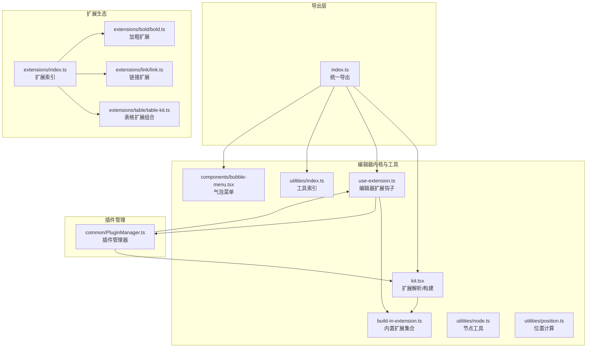
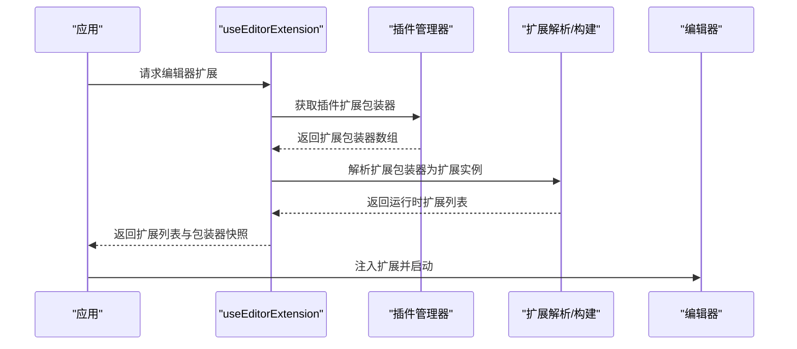
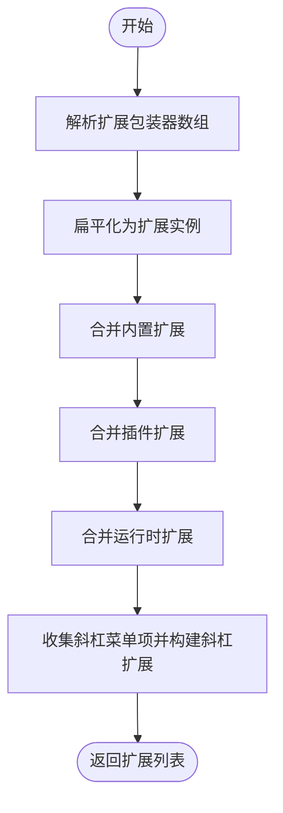
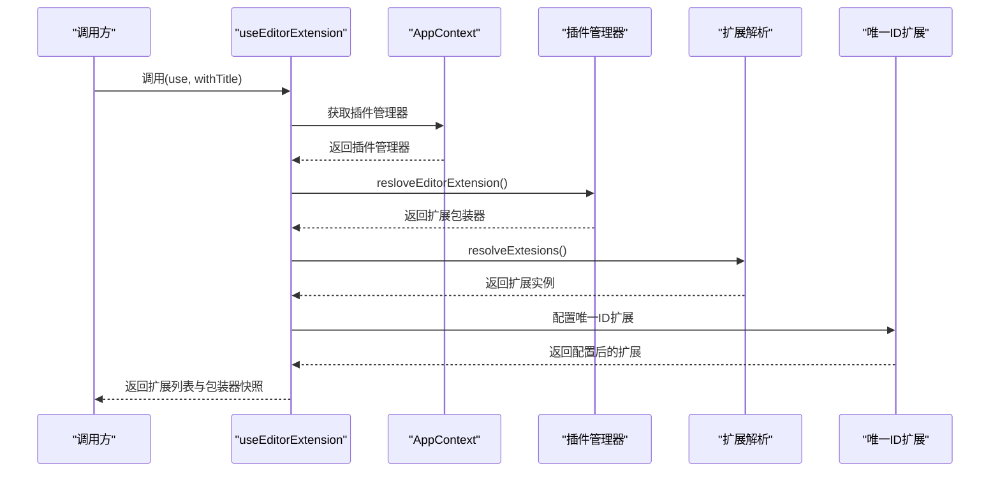
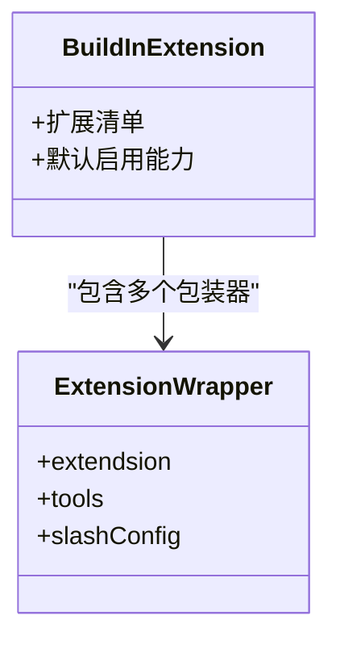
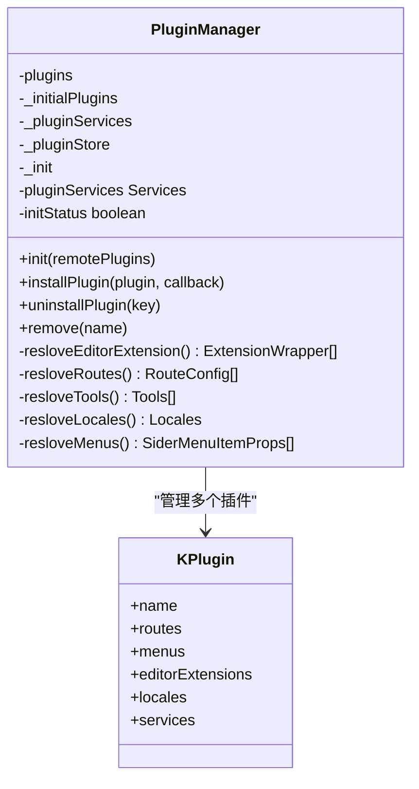
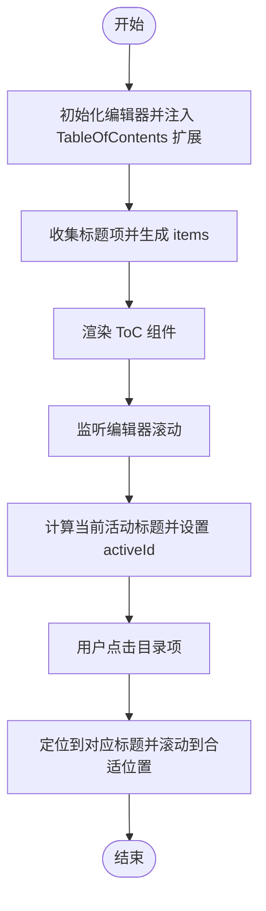
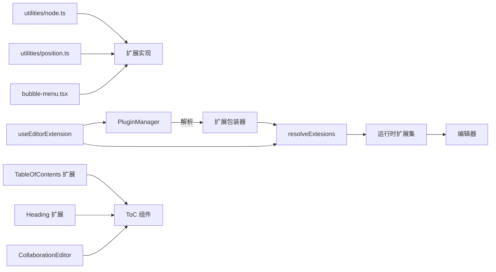

# 编辑器扩展系统

<cite>
**本文引用的文件**
- [packages/editor/src/index.ts](file://packages/editor/src/index.ts)
- [packages/editor/src/editor/index.tsx](file://packages/editor/src/editor/index.tsx)
- [packages/editor/src/editor/kit.tsx](file://packages/editor/src/editor/kit.tsx)
- [packages/editor/src/editor/use-extension.ts](file://packages/editor/src/editor/use-extension.ts)
- [packages/editor/src/editor/build-in-extension.ts](file://packages/editor/src/editor/build-in-extension.ts)
- [packages/common/src/core/PluginManager.ts](file://packages/common/src/core/PluginManager.ts)
- [packages/editor/src/utilities/index.ts](file://packages/editor/src/utilities/index.ts)
- [packages/editor/src/utilities/node.ts](file://packages/editor/src/utilities/node.ts)
- [packages/editor/src/utilities/position.ts](file://packages/editor/src/utilities/position.ts)
- [packages/editor/src/components/bubble-menu.tsx](file://packages/editor/src/components/bubble-menu.tsx)
- [packages/editor/src/extensions/index.ts](file://packages/editor/src/extensions/index.ts)
- [packages/editor/src/extensions/bold/bold.ts](file://packages/editor/src/extensions/bold/bold.ts)
- [packages/editor/src/extensions/link/link.ts](file://packages/editor/src/extensions/link/link.ts)
- [packages/editor/src/extensions/table/table-kit.ts](file://packages/editor/src/extensions/table/table-kit.ts)
- [packages/editor/src/components/toc/index.tsx](file://packages/editor/src/components/toc/index.tsx)
- [packages/editor/src/components/toc/style/index.module.less](file://packages/editor/src/components/toc/style/index.module.less)
- [packages/editor/src/editor/ToC.tsx](file://packages/editor/src/editor/ToC.tsx)
- [packages/editor/src/editor/collaboration.tsx](file://packages/editor/src/editor/collaboration.tsx)
- [packages/editor/src/extensions/table-of-content/table-of-content.ts](file://packages/editor/src/extensions/table-of-content/table-of-content.ts)
- [packages/editor/src/extensions/heading/heading.ts](file://packages/editor/src/extensions/heading/heading.ts)
</cite>

## 目录
1. [引言](#引言)
2. [项目结构](#项目结构)
3. [核心组件](#核心组件)
4. [架构总览](#架构总览)
5. [详细组件分析](#详细组件分析)
6. [依赖关系分析](#依赖关系分析)
7. [性能考虑](#性能考虑)
8. [故障排查指南](#故障排查指南)
9. [结论](#结论)
10. [附录：自定义扩展开发指南](#附录自定义扩展开发指南)

## 引言
本技术文档面向编辑器扩展系统的开发者与维护者，系统性阐述编辑器扩展的架构设计、扩展注册与生命周期管理、依赖注入机制、扩展工具包的实现方式、钩子与状态管理、以及扩展工具函数（DOM 操作、位置计算、事件处理）的作用与实践。同时提供自定义扩展开发指南与具体示例路径，帮助快速实现文本格式化、特殊节点插入与交互功能。

## 项目结构
编辑器扩展系统主要由以下层次构成：
- 导出层：统一导出编辑器能力、工具函数、钩子与第三方依赖，便于上层应用按需引入。
- 编辑器内核与工具：提供扩展解析、构建内置扩展集合、生成运行时扩展集的能力；封装通用工具函数与 UI 组件。
- 扩展生态：以 TiPtap 扩展为核心，提供大量内置扩展与组合工具，支持插件化扩展装配。
- 插件管理：通过插件管理器聚合来自本地与远程的扩展配置，完成扩展注册与动态安装卸载。

图表来源
- [packages/editor/src/index.ts](file://packages/editor/src/index.ts#L1-L23)
- [packages/editor/src/editor/kit.tsx](file://packages/editor/src/editor/kit.tsx#L1-L87)
- [packages/editor/src/editor/use-extension.ts](file://packages/editor/src/editor/use-extension.ts#L1-L63)
- [packages/editor/src/editor/build-in-extension.ts](file://packages/editor/src/editor/build-in-extension.ts#L1-L56)
- [packages/editor/src/utilities/index.ts](file://packages/editor/src/utilities/index.ts#L1-L12)
- [packages/editor/src/utilities/node.ts](file://packages/editor/src/utilities/node.ts#L1-L149)
- [packages/editor/src/utilities/position.ts](file://packages/editor/src/utilities/position.ts#L1-L69)
- [packages/editor/src/components/bubble-menu.tsx](file://packages/editor/src/components/bubble-menu.tsx#L1-L84)
- [packages/editor/src/extensions/index.ts](file://packages/editor/src/extensions/index.ts#L1-L64)
- [packages/editor/src/extensions/bold/bold.ts](file://packages/editor/src/extensions/bold/bold.ts#L1-L4)
- [packages/editor/src/extensions/link/link.ts](file://packages/editor/src/extensions/link/link.ts#L1-L66)
- [packages/editor/src/extensions/table/table-kit.ts](file://packages/editor/src/extensions/table/table-kit.ts#L1-L17)
- [packages/common/src/core/PluginManager.ts](file://packages/common/src/core/PluginManager.ts#L1-L170)

章节来源
- [packages/editor/src/index.ts](file://packages/editor/src/index.ts#L1-L23)
- [packages/editor/src/editor/index.tsx](file://packages/editor/src/editor/index.tsx#L1-L7)

## 核心组件
- 扩展解析与构建
  - 解析扩展包装器数组，生成运行时扩展列表；支持合并内置扩展与插件扩展；支持斜杠菜单项收集与注入。
- 编辑器扩展钩子
  - 提供 useEditorExtension 钩子，基于上下文中的插件管理器与内置扩展，组装运行时扩展集，并可按名称过滤特定扩展。
- 内置扩展集合
  - 定义编辑器默认启用的扩展清单，覆盖常用格式化、交互与可视化能力。
- 工具函数与组件
  - 节点工具：判断当前激活节点类型、是否在特定节点内、按 blockId 查找节点等。
  - 位置计算：根据选区计算 DOM 位置，安全位置修正。
  - 气泡菜单：增强版气泡菜单，支持节点级显示策略与定位回调。
- 插件管理器
  - 支持本地与远程插件加载、服务合并、菜单与路由聚合、编辑器扩展解析与动态安装/卸载。

章节来源
- [packages/editor/src/editor/kit.tsx](file://packages/editor/src/editor/kit.tsx#L1-L87)
- [packages/editor/src/editor/use-extension.ts](file://packages/editor/src/editor/use-extension.ts#L1-L63)
- [packages/editor/src/editor/build-in-extension.ts](file://packages/editor/src/editor/build-in-extension.ts#L1-L56)
- [packages/editor/src/utilities/node.ts](file://packages/editor/src/utilities/node.ts#L1-L149)
- [packages/editor/src/utilities/position.ts](file://packages/editor/src/utilities/position.ts#L1-L69)
- [packages/editor/src/components/bubble-menu.tsx](file://packages/editor/src/components/bubble-menu.tsx#L1-L84)
- [packages/common/src/core/PluginManager.ts](file://packages/common/src/core/PluginManager.ts#L1-L170)

## 架构总览
编辑器扩展系统采用“插件化 + 内置扩展 + 工具函数”的分层架构：
- 插件层：通过插件管理器聚合扩展配置，支持本地与远程脚本动态加载。
- 内置层：提供默认扩展清单，保证基础能力可用。
- 工具层：提供节点与位置相关的工具函数，支撑扩展行为与 UI 交互。
- 集成层：通过扩展解析与钩子，将插件与内置扩展合并为运行时扩展集，注入编辑器。

图表来源
- [packages/editor/src/editor/use-extension.ts](file://packages/editor/src/editor/use-extension.ts#L1-L63)
- [packages/common/src/core/PluginManager.ts](file://packages/common/src/core/PluginManager.ts#L1-L170)
- [packages/editor/src/editor/kit.tsx](file://packages/editor/src/editor/kit.tsx#L1-L87)

## 详细组件分析

### 组件A：扩展解析与构建（resolveExtesions / resolveEditorKit / resloveSlash）
- 功能要点
  - 将扩展包装器数组扁平化为扩展实例数组。
  - 合并内置扩展、插件扩展与运行时扩展，形成最终扩展集。
  - 收集斜杠菜单项并生成斜杠扩展实例，注入编辑器。
- 关键流程

图表来源
- [packages/editor/src/editor/kit.tsx](file://packages/editor/src/editor/kit.tsx#L1-L87)
- [packages/editor/src/editor/build-in-extension.ts](file://packages/editor/src/editor/build-in-extension.ts#L1-L56)

章节来源
- [packages/editor/src/editor/kit.tsx](file://packages/editor/src/editor/kit.tsx#L1-L87)
- [packages/editor/src/editor/build-in-extension.ts](file://packages/editor/src/editor/build-in-extension.ts#L1-L56)

### 组件B：编辑器扩展钩子（useEditorExtension）
- 功能要点
  - 基于上下文中的插件管理器与内置扩展，组装运行时扩展集。
  - 可按名称过滤指定扩展，避免重复或冲突。
  - 注入唯一 ID 扩展，控制事务来源，避免协作回写冲突。
- 调用序列

图表来源
- [packages/editor/src/editor/use-extension.ts](file://packages/editor/src/editor/use-extension.ts#L1-L63)
- [packages/common/src/core/PluginManager.ts](file://packages/common/src/core/PluginManager.ts#L1-L170)
- [packages/editor/src/editor/kit.tsx](file://packages/editor/src/editor/kit.tsx#L1-L87)

章节来源
- [packages/editor/src/editor/use-extension.ts](file://packages/editor/src/editor/use-extension.ts#L1-L63)

### 组件C：内置扩展集合（buildInExtension）
- 功能要点
  - 定义编辑器默认启用的扩展清单，覆盖格式化、交互、可视化与协作相关能力。
  - 作为扩展解析的基础来源之一，确保最小可用体验。
- 结构示意

图表来源
- [packages/editor/src/editor/build-in-extension.ts](file://packages/editor/src/editor/build-in-extension.ts#L1-L56)

章节来源
- [packages/editor/src/editor/build-in-extension.ts](file://packages/editor/src/editor/build-in-extension.ts#L1-L56)

### 组件D：插件管理器（PluginManager）
- 功能要点
  - 插件配置与装载：支持本地与远程插件，动态导入脚本并合并服务。
  - 扩展解析：聚合各插件的编辑器扩展包装器，形成统一扩展集。
  - 生命周期：提供安装、卸载、移除与初始化状态查询。
- 类图

图表来源
- [packages/common/src/core/PluginManager.ts](file://packages/common/src/core/PluginManager.ts#L1-L170)

章节来源
- [packages/common/src/core/PluginManager.ts](file://packages/common/src/core/PluginManager.ts#L1-L170)

### 组件E：扩展工具包与工具函数
- 节点工具（utilities/node.ts）
  - 当前节点获取、按位置获取节点、节点激活判断、是否在特定节点内、按 blockId 查找节点、列表激活状态判断等。
- 位置计算（utilities/position.ts）
  - 计算节点/文本位置，支持选区坐标到 DOM 坐标转换，提供安全位置修正。
- 气泡菜单（components/bubble-menu.tsx）
  - 增强版气泡菜单，支持节点级显示策略、定位回调与默认样式配置。

章节来源
- [packages/editor/src/utilities/node.ts](file://packages/editor/src/utilities/node.ts#L1-L149)
- [packages/editor/src/utilities/position.ts](file://packages/editor/src/utilities/position.ts#L1-L69)
- [packages/editor/src/components/bubble-menu.tsx](file://packages/editor/src/components/bubble-menu.tsx#L1-L84)

### 组件F：扩展索引与典型扩展
- 扩展索引（extensions/index.ts）
  - 汇总导出各类扩展，包括格式化、列表、表格、颜色、数学、日期、表情、任务列表、目录、事件、选择、未知节点、高亮与详情等。
- 典型扩展示例
  - 加粗扩展：基于 TiPtap 的 Bold 扩展。
  - 链接扩展：扩展输入规则与属性，支持 Markdown 语法与 URL 自动识别。
  - 表格扩展组合：将 Table、TableCell、TableHeader、TableRow 组合为 TableExtensions。

章节来源
- [packages/editor/src/extensions/index.ts](file://packages/editor/src/extensions/index.ts#L1-L64)
- [packages/editor/src/extensions/bold/bold.ts](file://packages/editor/src/extensions/bold/bold.ts#L1-L4)
- [packages/editor/src/extensions/link/link.ts](file://packages/editor/src/extensions/link/link.ts#L1-L66)
- [packages/editor/src/extensions/table/table-kit.ts](file://packages/editor/src/extensions/table/table-kit.ts#L1-L17)

### 组件G：目录功能（ToC）——全新重设计
- 设计目标
  - 活动部分高亮显示：滚动时自动识别当前可视区域内的标题，突出显示对应目录项。
  - 粘性标题定位：目录面板采用粘性定位，随编辑器内容滚动保持可见与对齐。
  - 改进的视觉样式：采用现代化的层级缩进、颜色分级、边框与阴影，提升可读性与对比度。
- 实现概览
  - 目录数据源：通过 TableOfContents 扩展收集文档标题层级与索引，实时更新 items。
  - 目录渲染：ToC 组件负责渲染目录项、层级缩进、活动状态高亮与点击跳转。
  - 协作集成：CollaborationEditor 将 ToC 与编辑器内容容器并排布局，启用粘性定位。
  - 样式体系：采用 Tailwind 类名与主题变量，确保深浅色模式一致的视觉效果。
- 关键流程

图表来源
- [packages/editor/src/editor/collaboration.tsx](file://packages/editor/src/editor/collaboration.tsx#L116-L136)
- [packages/editor/src/editor/ToC.tsx](file://packages/editor/src/editor/ToC.tsx#L72-L161)
- [packages/editor/src/extensions/table-of-content/table-of-content.ts](file://packages/editor/src/extensions/table-of-content/table-of-content.ts#L1-L1)

章节来源
- [packages/editor/src/editor/collaboration.tsx](file://packages/editor/src/editor/collaboration.tsx#L116-L136)
- [packages/editor/src/editor/ToC.tsx](file://packages/editor/src/editor/ToC.tsx#L72-L161)
- [packages/editor/src/extensions/table-of-content/table-of-content.ts](file://packages/editor/src/extensions/table-of-content/table-of-content.ts#L1-L1)

### 组件H：目录样式与布局
- 旧版样式（固定定位与卡片容器）
  - 早期版本采用固定定位与卡片容器，提供基础的目录列表样式与空状态提示。
- 新版样式（粘性定位与现代化 UI）
  - 新版本采用粘性定位，顶部添加标题栏与徽章，使用滚动区域组件承载目录项，配合层级缩进与颜色分级，实现清晰的视觉层次。
  - 通过 Tailwind 类名实现深浅色模式适配与过渡动画，提升交互体验。

章节来源
- [packages/editor/src/components/toc/index.tsx](file://packages/editor/src/components/toc/index.tsx#L1-L74)
- [packages/editor/src/components/toc/style/index.module.less](file://packages/editor/src/components/toc/style/index.module.less#L1-L47)
- [packages/editor/src/editor/ToC.tsx](file://packages/editor/src/editor/ToC.tsx#L134-L161)

## 依赖关系分析
- 组件耦合
  - useEditorExtension 依赖 AppContext 中的插件管理器与内置扩展集合。
  - kit.tsx 依赖内置扩展集合与扩展包装器解析逻辑。
  - utilities 提供跨扩展复用的工具函数。
- 外部依赖
  - TiPtap 生态（@tiptap/core、@tiptap/react、@tiptap/pm 等）为扩展与编辑器提供基础能力。
  - 插件管理器通过动态脚本加载远程插件，实现扩展的热插拔。
- 目录功能依赖
  - TableOfContents 扩展负责从文档中提取标题并生成层级索引。
  - Heading 扩展提供标题节点的属性与键盘快捷键支持。
  - CollaborationEditor 将 ToC 与编辑器内容并排布局，启用粘性定位。

图表来源
- [packages/editor/src/editor/use-extension.ts](file://packages/editor/src/editor/use-extension.ts#L1-L63)
- [packages/editor/src/editor/kit.tsx](file://packages/editor/src/editor/kit.tsx#L1-L87)
- [packages/common/src/core/PluginManager.ts](file://packages/common/src/core/PluginManager.ts#L1-L170)
- [packages/editor/src/utilities/node.ts](file://packages/editor/src/utilities/node.ts#L1-L149)
- [packages/editor/src/utilities/position.ts](file://packages/editor/src/utilities/position.ts#L1-L69)
- [packages/editor/src/components/bubble-menu.tsx](file://packages/editor/src/components/bubble-menu.tsx#L1-L84)
- [packages/editor/src/editor/ToC.tsx](file://packages/editor/src/editor/ToC.tsx#L72-L161)
- [packages/editor/src/extensions/table-of-content/table-of-content.ts](file://packages/editor/src/extensions/table-of-content/table-of-content.ts#L1-L1)
- [packages/editor/src/extensions/heading/heading.ts](file://packages/editor/src/extensions/heading/heading.ts#L1-L216)
- [packages/editor/src/editor/collaboration.tsx](file://packages/editor/src/editor/collaboration.tsx#L116-L136)

章节来源
- [packages/editor/src/editor/use-extension.ts](file://packages/editor/src/editor/use-extension.ts#L1-L63)
- [packages/editor/src/editor/kit.tsx](file://packages/editor/src/editor/kit.tsx#L1-L87)
- [packages/common/src/core/PluginManager.ts](file://packages/common/src/core/PluginManager.ts#L1-L170)
- [packages/editor/src/editor/ToC.tsx](file://packages/editor/src/editor/ToC.tsx#L72-L161)
- [packages/editor/src/extensions/table-of-content/table-of-content.ts](file://packages/editor/src/extensions/table-of-content/table-of-content.ts#L1-L1)
- [packages/editor/src/extensions/heading/heading.ts](file://packages/editor/src/extensions/heading/heading.ts#L1-L216)
- [packages/editor/src/editor/collaboration.tsx](file://packages/editor/src/editor/collaboration.tsx#L116-L136)

## 性能考虑
- 扩展解析与合并
  - 在 useEditorExtension 中对扩展进行去重与过滤，避免重复注入导致的性能损耗。
  - 仅在必要时重新解析扩展包装器，减少不必要的计算。
- 目录滚动检测
  - ToC 组件在滚动时进行 DOM 查询与位置计算，建议结合节流/防抖策略，避免频繁触发导致的布局抖动。
- 斜杠菜单
  - 斜杠扩展的 items 由插件与内置扩展共同提供，建议按需收集，避免过多条目影响渲染性能。
- 位置计算与 UI 更新
  - 位置计算函数应结合节流/防抖策略，避免频繁触发导致的布局抖动。
- 协作与事务过滤
  - 唯一 ID 扩展的事务过滤可减少协作回写带来的无效更新。

## 故障排查指南
- 插件未生效
  - 检查插件管理器是否正确初始化与合并服务。
  - 确认扩展包装器的 editorExtensions 字段已正确提供。
- 扩展冲突
  - 使用 useEditorExtension 过滤掉冲突扩展名称，或调整扩展顺序。
- 目录不更新
  - 确认 TableOfContents 扩展已注入并配置 onUpdate 回调。
  - 检查 Heading 扩展是否正确渲染标题节点并带有 data-toc-id 属性。
- 活动项不变化
  - 检查 ToC 组件的滚动监听是否绑定到正确的滚动容器。
  - 确认 getBoundingClientRect 返回的 top 值在预期范围内。
- 点击跳转异常
  - 检查 posAtDOM 与 TextSelection 的使用是否正确。
  - 确认 window.scrollTo 的偏移量与编辑器头部高度一致。
- 气泡菜单定位异常
  - 检查 getReferenceClientRect 回调与默认定位选项配置。
- 节点查找失败
  - 确认节点属性中包含 blockId 或使用 getCurrentNode/getNodeAtPos 等工具函数。

章节来源
- [packages/common/src/core/PluginManager.ts](file://packages/common/src/core/PluginManager.ts#L1-L170)
- [packages/editor/src/editor/use-extension.ts](file://packages/editor/src/editor/use-extension.ts#L1-L63)
- [packages/editor/src/components/bubble-menu.tsx](file://packages/editor/src/components/bubble-menu.tsx#L1-L84)
- [packages/editor/src/utilities/node.ts](file://packages/editor/src/utilities/node.ts#L1-L149)
- [packages/editor/src/editor/ToC.tsx](file://packages/editor/src/editor/ToC.tsx#L72-L161)
- [packages/editor/src/extensions/table-of-content/table-of-content.ts](file://packages/editor/src/extensions/table-of-content/table-of-content.ts#L1-L1)
- [packages/editor/src/extensions/heading/heading.ts](file://packages/editor/src/extensions/heading/heading.ts#L1-L216)
- [packages/editor/src/editor/collaboration.tsx](file://packages/editor/src/editor/collaboration.tsx#L116-L136)

## 结论
编辑器扩展系统通过插件管理器与扩展解析机制，实现了灵活的扩展装配与动态扩展能力。内置扩展集合确保了基础体验，工具函数与组件增强了扩展的可用性与一致性。目录功能的重设计引入了活动部分高亮、粘性标题定位与现代化视觉样式，显著提升了用户体验。遵循本文档的开发与集成规范，可高效实现文本格式化、特殊节点插入与交互功能，并保持良好的性能与可维护性。

## 附录：自定义扩展开发指南
- 扩展接口与实现
  - 基于 TiPtap 扩展进行封装或组合，导出扩展实例并在 extensions/index.ts 中统一导出。
  - 示例路径
    - [加粗扩展](file://packages/editor/src/extensions/bold/bold.ts#L1-L4)
    - [链接扩展](file://packages/editor/src/extensions/link/link.ts#L1-L66)
    - [表格扩展组合](file://packages/editor/src/extensions/table/table-kit.ts#L1-L17)
- 扩展注册与装配
  - 将扩展包装器加入插件配置的 editorExtensions 字段，或通过 useEditorExtension 动态注入。
  - 参考路径
    - [useEditorExtension](file://packages/editor/src/editor/use-extension.ts#L1-L63)
    - [扩展解析与构建](file://packages/editor/src/editor/kit.tsx#L1-L87)
- 生命周期与钩子
  - 利用 useEditorExtension 返回的扩展列表与包装器快照，进行初始化、状态管理与清理。
- 工具函数使用
  - 节点与位置工具
    - [节点工具](file://packages/editor/src/utilities/node.ts#L1-L149)
    - [位置计算](file://packages/editor/src/utilities/position.ts#L1-L69)
  - 气泡菜单
    - [气泡菜单组件](file://packages/editor/src/components/bubble-menu.tsx#L1-L84)
- 目录功能开发要点
  - 使用 TableOfContents 扩展收集标题并生成层级索引。
  - 在 ToC 组件中实现滚动监听与活动项高亮。
  - 在 CollaborationEditor 中启用粘性定位并并排展示目录面板。
  - 示例路径
    - [目录扩展入口](file://packages/editor/src/extensions/table-of-content/table-of-content.ts#L1-L1)
    - [目录组件](file://packages/editor/src/editor/ToC.tsx#L72-L161)
    - [协作编辑器集成](file://packages/editor/src/editor/collaboration.tsx#L116-L136)
    - [标题扩展](file://packages/editor/src/extensions/heading/heading.ts#L1-L216)
- 测试方法
  - 单元测试：针对扩展输入规则、属性解析与状态切换进行断言。
  - 集成测试：在编辑器中验证扩展行为与 UI 交互，确保与内置扩展无冲突。
  - 性能测试：评估扩展对渲染与协作的影响，必要时进行优化与节流。